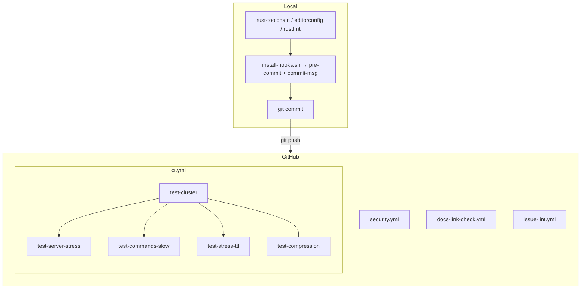

# CI

## 简介

CI 质量门禁由本地 **Git Hooks(pre-commit)** 和云端 **GitHub Actions** 协同构成;
辅以 **ISSUE** 与 **Pull Request** 模板, 全链路规范开发流程.

> 需执行 [`install-hooks.sh`](../install-hooks.sh) 脚本安装到本地 hooks (软链到 .git/hooks/) 才生效.
>
> **aidb 依赖**: `Cargo.toml` 声明 `aidb = { git = "https://github.com/wiqun/AiDb.git", branch = "new/main" }`, CI 构建前由 prepare action 执行 `cargo update -p aidb` 强制对齐分支最新; 本地开发通过 `~/.cargo/config.toml` 的 `[patch]` 覆盖为本地 path (见 [README.md §与 AiDb](../README.md#与-aidb)).

## 总览



```shell
aikv/
├── install-hooks.sh         # 安装本地 hooks (软链到 .git/hooks/)
├── hooks/                   # 本地 commit 门禁
│   ├── pre-commit           #   commit 时依次执行下面 4 个脚本 + fmt/clippy
│   ├── check-branch.sh      #   分支保护: 禁止在基础分支直接提交
│   ├── check-docs-links.sh  #   staged .md 相对链接存在性检查
│   ├── check-security.sh    #   cargo audit + deny
│   └── commit-msg           #   Conventional Commits 提交说明校验
├── deny.toml            # cargo deny 策略 (许可证/来源)
├── .cargo/
│   └── audit.toml       # cargo-audit ignore (bincode / Issue #77)
├── rust-toolchain.toml  # 工具链 (stable, 自动切换)
├── rustfmt.toml         # rustfmt 配置 (4 空格)
├── .editorconfig        # 编辑器格式
└── .github/
    ├── README.md        # 说明文档
    ├── ISSUE_TEMPLATE/  # Issue 类型模板 (feat/fix/refactor/test/docs/chore/perf)
    │   ├── feat.yml
    │   ├── fix.yml
    │   ├── …
    │   └── config.yml # 禁用空白 Issue
    ├── PULL_REQUEST_TEMPLATE.md # PR 描述模板 (含 Closes #)
    ├── actions/
    │   └── prepare/action.yml    # composite: rust + protoc + cargo update aidb (workflow 须先 checkout)
    └── workflows/               # GitHub Actions
        ├── ci.yml               # 主 CI (test-cluster → stress/slow; e2e 暂不入 CI)
        ├── security.yml         # 安全扫描 (audit + deny)
        ├── docs-link-check.yml  # 文档外链检查 (lychee)
        └── issue-lint.yml       # 提醒 PR 关联 GitHub Issue
```

| 层级     | 文件                                                             | 作用                                                      |
| ------ | ---------------------------------------------------------------- | ----------------------------------------------------------|
| Local  | `[rust-toolchain.toml](../rust-toolchain.toml)`                  | 工具链 (stable, 进入仓库自动切换)                             |
| Local  | `[.editorconfig](../.editorconfig)`                              | 编辑器格式                                                  |
| Local  | `[rustfmt.toml](../rustfmt.toml)`                                | rustfmt 配置 (4 空格)                                       |
| Local  | `[install-hooks.sh](../install-hooks.sh)`                        | 安装本地 hooks (软链到 `.git/hooks/`)                        |
| Local  | `[hooks/pre-commit](../hooks/pre-commit)`                        | commit 门禁入口, 按序执行分支保护 → 链接 → aidb 解析 → fmt/clippy → security |
| Local  | `[hooks/check-branch.sh](../hooks/check-branch.sh)`              | 分支保护: 禁止在基础分支直接提交                                 |
| Local  | `[hooks/check-docs-links.sh](../hooks/check-docs-links.sh)`      | staged `.md` 相对链接存在性检查                               |
| Local  | `[hooks/check-security.sh](../hooks/check-security.sh)`          | `cargo audit` + `cargo deny`   |
| Local  | `[deny.toml](../deny.toml)`                                      | cargo deny 策略 (许可证/来源)                                |
| Local  | `[.cargo/audit.toml](../.cargo/audit.toml)`                      | cargo-audit 独立 ignore (目前仅 bincode RUSTSEC-2025-0141)   |
| Local  | `[hooks/commit-msg](../hooks/commit-msg)`                        | Conventional Commits 提交说明校验                            |
| GitHub | `[ISSUE_TEMPLATE/feat.yml](ISSUE_TEMPLATE/feat.yml)`             | Issue 模板: 新功能                                          |
| GitHub | `[ISSUE_TEMPLATE/fix.yml](ISSUE_TEMPLATE/fix.yml)`               | Issue 模板: bug 修复                                        |
| GitHub | `[ISSUE_TEMPLATE/refactor.yml](ISSUE_TEMPLATE/refactor.yml)`     | Issue 模板: 重构                                            |
| GitHub | `[ISSUE_TEMPLATE/test.yml](ISSUE_TEMPLATE/test.yml)`             | Issue 模板: 测试                                            |
| GitHub | `[ISSUE_TEMPLATE/docs.yml](ISSUE_TEMPLATE/docs.yml)`             | Issue 模板: 文档                                            |
| GitHub | `[ISSUE_TEMPLATE/chore.yml](ISSUE_TEMPLATE/chore.yml)`           | Issue 模板: 杂项                                            |
| GitHub | `[ISSUE_TEMPLATE/perf.yml](ISSUE_TEMPLATE/perf.yml)`             | Issue 模板: 性能                                            |
| GitHub | `[ISSUE_TEMPLATE/config.yml](ISSUE_TEMPLATE/config.yml)`         | 禁用空白 Issue                                              |
| GitHub | `[PULL_REQUEST_TEMPLATE.md](PULL_REQUEST_TEMPLATE.md)`           | PR 描述模板                                                 |
| GitHub | `[actions/prepare/action.yml](actions/prepare/action.yml)`       | rust + protoc + `cargo update -p aidb`; 各 job 须先 `actions/checkout` |
| GitHub | `[workflows/ci.yml](workflows/ci.yml)`                           | 主 CI (test-cluster → stress/slow, compression 并行; e2e 暂不入 CI) |
| GitHub | `[workflows/security.yml](workflows/security.yml)`               | 安全扫描 (audit + deny, push/PR/定时)                        |
| GitHub | `[workflows/docs-link-check.yml](workflows/docs-link-check.yml)` | 文档外链检查 (lychee, push/PR 含 `.md`)                      |
| GitHub | `[workflows/issue-lint.yml](workflows/issue-lint.yml)`           | 提醒 PR 关联 GitHub Issue (PR opened/edited)                |
