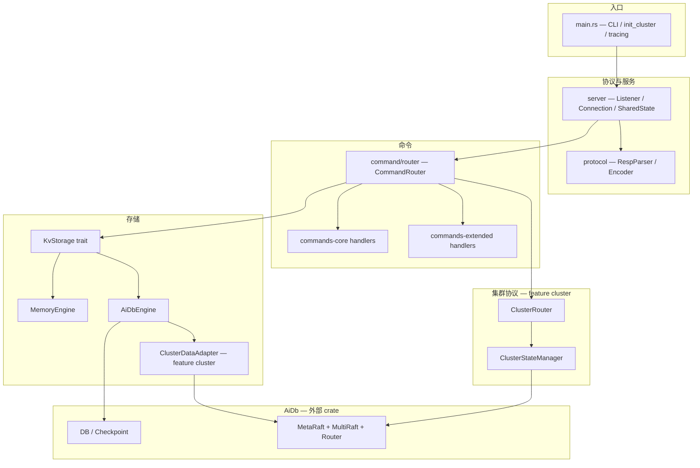
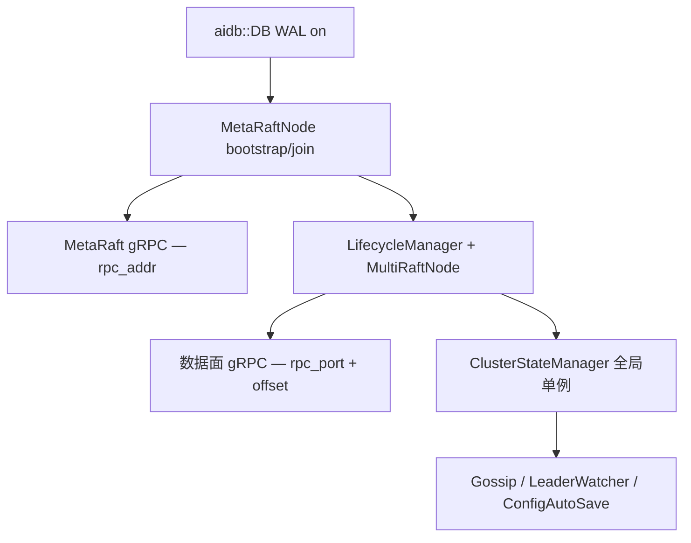

# AiKv 架构

AiKv 是用 Rust 实现的 **Redis RESP 兼容 KV 服务** (bin + lib). 对外提供 RESP2/3、Redis 命令与 Redis Cluster 协议; 对内 **不实现** LSM/Raft, 持久化与共识委托 sibling 库 [AiDb](../aidb/ARCHITECTURE.md).

日常改代码优先读 [docs/modules/](docs/modules/) 域文档; 本文提供系统分层、与 AiDb 边界、模块关系与数据流总览.

## 定位与边界

| 维度 | AiKv | AiDb |
|------|------|------|
| 形态 | 网络服务, async (Tokio) | lib crate, **同步** API |
| 协议 | RESP, Redis 命令语义, MOVED/ASK | 无网络层 |
| 类型编码 | `StoredValue` / `ValueType` → 扁平 key `{db}:{user_key}` | 字节 KV + tombstone |
| 单机存储 | `MemoryEngine` 或 `AiDbEngine` (`spawn_blocking`) | `DB::put/get/...`, MVCC, LSM |
| 集群客户端 | MOVED/ASK, CLUSTER *, ASKING/READONLY | — |
| 集群共识 | `init_cluster` wiring + `ClusterStateManager` | MetaRaft, Multi-Raft, Router, slot 迁移 |
| 数据面写 | `ClusterDataAdapter` → `propose_group` | `OpenRaftNode` + `ShardedStorage` |
| 持久化 | `SAVE`/`BGSAVE` → `Checkpoint` (aidb 路径) | WAL, flush, `Checkpoint::create` |
| 指标 | HTTP `/metrics`, `aikv_*`; `aidb::metrics::register_into` | `aidb_*` 库内系列 |

**分工原则**: Redis 协议与命令在 AiKv; LSM 写路径、Raft 状态机、slot 表与 gRPC 在 AiDb. AiKv 侧 **拓扑 tick** 刷新 leader 路由缓存与 gossip metrics; `CLUSTER NODES` 读 MetaRaft; 故障判定走 MetaRaft, 非 Redis 16379 gossip 共识.

本地开发需 sibling 布局 `../aidb`; CI checkout 同名分支 AiDb 并 link.

## 系统分层



## 目录结构

按域聚合 (非逐文件 listing). 完整路径见各 [module 文档](docs/modules/).

```shell
aikv/src/
├── main.rs              # CLI, build_storage, init_cluster, metrics 装配
├── lib.rs               # crate 根; feature cluster 导出 cluster
├── error.rs             # Error / Result
├── protocol/            # RESP2/3 编解码
│   ├── encoder.rs       # 序列化
│   ├── parser.rs        # RespParser feed/parse
│   └── types.rs         # RespValue, ProtocolVersion
├── server/              # TCP 与连接状态
│   ├── config.rs        # ServerSharedState, ConnectionConfig
│   ├── connection.rs    # 读写循环, HELLO, ATOM 事务, 内联命令
│   ├── info.rs          # INFO 段渲染
│   ├── latency.rs       # LATENCY 直方图
│   ├── listener.rs      # Server::run accept 循环
│   ├── metrics.rs       # ServerMetrics
│   ├── metrics_server.rs  # HTTP /metrics (feature monitoring)
│   ├── process_metrics.rs
│   └── slowlog.rs       # 慢查询
├── command/             # Redis 命令实现
│   ├── router.rs        # CommandRouter, KeyLock, cluster_route
│   ├── registry.rs      # COMMAND 元数据
│   ├── string.rs        # 核心数据结构命令
│   ├── hash.rs
│   ├── list.rs
│   ├── set.rs
│   ├── zset.rs
│   ├── key.rs
│   ├── database.rs
│   ├── scan_util.rs
│   ├── json.rs          # 扩展: JSON / Lua / 阻塞 / MIGRATE / 持久化 / admin
│   ├── jsonpath.rs
│   ├── script/
│   ├── blocking.rs
│   ├── migrate.rs
│   ├── persistence.rs
│   └── server.rs
├── storage/             # 存储抽象与引擎
│   ├── types.rs         # KvStorage trait, StoredValue
│   ├── memory.rs        # MemoryEngine
│   ├── aidb.rs          # AiDbEngine
│   ├── adapter.rs       # KvStorageAdapter / StorageAdapter
│   ├── cluster_adapter.rs  # ClusterDataAdapter (feature cluster)
│   ├── dump.rs          # DUMP/RESTORE 编码
│   └── observation.rs   # 存储侧计数桥
└── cluster/             # Redis Cluster 协议 (feature cluster)
    ├── state.rs         # ClusterStateManager, CLUSTER_STATE_MGR
    ├── router.rs        # ClusterRouter MOVED/ASK
    ├── commands.rs      # CLUSTER 子命令
    ├── connection.rs    # ASKING / READONLY 连接状态
    ├── gossip.rs        # 拓扑刷新
    ├── forward.rs
    ├── replication.rs
    ├── announce.rs
    └── config_auto_save.rs
```

## 模块导航

| Module 文档 | 覆盖 `src/` | 何时深入 |
|-------------|-------------|----------|
| [protocol.md](docs/modules/protocol.md) | `protocol/*` | RESP 帧解析/编码, pipeline 边界 |
| [server.md](docs/modules/server.md) | `server/{config,listener,connection}` | TCP 循环, HELLO, ATOM 事务 |
| [storage.md](docs/modules/storage.md) | `storage/*` | `KvStorage`, memory/aidb, cluster 数据面写 |
| [commands-core.md](docs/modules/commands-core.md) | `command/{string~router,...}` | 核心命令, Router, KeyLock |
| [commands-extended.md](docs/modules/commands-extended.md) | `command/{json,script,blocking,...}` | JSON/Lua/SAVE/INFO/MIGRATE |
| [cluster.md](docs/modules/cluster.md) | `cluster/*`, router `cluster_route` | MOVED/ASK, CLUSTER 子命令, init wiring |
| [observability.md](docs/modules/observability.md) | `server/{slowlog,latency,info,metrics*}`, `storage/observation` | SLOWLOG, INFO, `/metrics` |

AiDb 域文档: [engine](../aidb/docs/modules/engine.md), [engine-storage](../aidb/docs/modules/engine-storage.md), [cluster](../aidb/docs/modules/cluster.md).

## Feature 边界

| Feature | Default | 启用内容 | 构建注意 |
|---------|---------|----------|----------|
| (none) | — | protocol, server, command, storage | 单机二进制 |
| `cluster` | no | `cluster/*`, `storage/cluster_adapter`, `main::init_cluster` | `aidb/cluster`; CI 主测 `--features cluster` |
| `monitoring` | no | `metrics_server`, OTel, Prometheus | 传递 `aidb/monitoring` |

开发与 CI 以 `--features cluster` 为主; `monitoring` 按需启用 HTTP scrape 与 OTel.

## 代码入口

| 能力 | 入口 |
|------|------|
| 进程启动 | `main.rs` |
| 库导出 | `lib.rs` |
| TCP 服务 | `server/listener.rs` — `Server::run` |
| 连接循环 | `server/connection.rs` — `Connection::handle` |
| 命令分发 | `command/router.rs` — `CommandRouter::execute_with_client` |
| 存储抽象 | `storage/types.rs` — `KvStorage` |
| AiDb 适配 | `storage/aidb.rs` — `AiDbEngine::open` |
| 集群数据写 | `storage/cluster_adapter.rs` — `ClusterDataAdapter` |
| 集群路由 | `cluster/router.rs` — `ClusterRouter::decide` |
| 集群状态 | `cluster/state.rs` — `CLUSTER_STATE_MGR` |
| 集群启动 | `main.rs` — `init_cluster` |
| Metrics HTTP | `server/metrics_server.rs` (feature `monitoring`) |

## 数据流总览

### 进程启动

```mermaid
flowchart LR
  A[init_logging] --> B[build_storage]
  B --> C[ServerSharedState]
  C --> D{cluster CLI?}
  D -->|是| E[init_cluster await]
  D -->|否| F[Server::run]
  E --> F
  B --> G[MemoryEngine | AiDbEngine]
  G --> H{cluster+aidb?}
  H -->|是| I[ClusterDataAdapter 包裹]
```

1. `build_storage`: `MemoryEngine` 或 `AiDbEngine`; cluster+aidb 时 **`ClusterDataAdapter` 包裹** → `KvStorageAdapter`.
2. **[cluster]** `--cluster-node-id` + `--cluster-rpc-addr` → **`init_cluster` 同步 await** (确保 `CLUSTER_STATE_MGR` 就绪).
3. **[monitoring]** spawn `MetricsServer` + 后台 refresh; `aidb::metrics::register_into`.
4. `Server::run` 进入 accept 循环.

细节: [server.md](docs/modules/server.md), [storage.md](docs/modules/storage.md).

### 命令执行 (单机 / 集群本地)

```text
accept → Connection read loop
  → RespParser pipeline parse
  → 内联命令 (PING/HELLO/…) 或 ATOM 事务
  → CommandRouter::execute_with_client
       [cluster] cluster_route → MOVED/ASK/CROSSSLOT 或继续
       → handler → KvStorage
  → adapt_for_protocol → write RESP; metrics / slowlog
```

细节: [protocol.md](docs/modules/protocol.md), [commands-core.md](docs/modules/commands-core.md), [commands-extended.md](docs/modules/commands-extended.md).

### 集群初始化 (feature `cluster`)



- **控制面**: MetaRaft (group_id=0) — 节点/Group/SlotTable/迁移状态.
- **数据面**: MultiRaft + `LifecycleManager::tick` 自动建/毁 group DB.
- **协议层**: `ClusterStateManager` + `MembershipCoordinator` + `SlotMigrationManager` (aidb) glue.
- **端口**: 客户端 RESP 在 `--bind`; MetaRaft 在 `--cluster-rpc-addr`; 数据 Raft 在 `rpc_port + --cluster-data-port-offset` (默认 10000).

MetaRaft/MultiRaft/Router 实现见 [aidb cluster.md](../aidb/docs/modules/cluster.md); Redis 语义见 [cluster.md](docs/modules/cluster.md).

### 集群命令路由

- `CommandRouter::cluster_route`: admin 命令 bypass; 多 key → CROSSSLOT 检查.
- `ClusterRouter::decide` → Execute / MOVED / ASK / CLUSTERDOWN.
- 本地 leader slot 写 → `ClusterDataAdapter::propose_group` → aidb Raft apply.

### 持久化

- **memory**: 无 checkpoint; 生产不推荐.
- **aidb**: `command/persistence` → `flush` / `Checkpoint::create` (委托 AiDb).
- 标准 RDB `dump.rdb` 非主路径; memory AOF / `CONFIG REWRITE` 未实现 — 见 [AGENTS.md](AGENTS.md).

### 可观测性

- **Tracing**: 始终编译; 命令/连接 span.
- **Prometheus / OTel**: `monitoring` feature; HTTP `/metrics` 在 AiKv; `aidb_*` 经 `register_into`.
- **INFO / SLOWLOG / LATENCY**: 数据结构在 `server/*`; 命令 dispatch 在 [commands-extended.md](docs/modules/commands-extended.md).

详情: [observability.md](docs/modules/observability.md).

## 与 AiDb 的分工 (嵌入关系)

AiKv 通过 `Cargo.toml` `aidb = { path = "../aidb" }` 依赖 AiDb:

1. **单机**: `AiDbEngine::open` 包装 `DB`; 用户 key 编码 `{db_index}:{user_key}`; 同步 I/O 经 `spawn_blocking`.
2. **集群**: `main::init_cluster` 启动 MetaRaft/MultiRaft; `ClusterDataAdapter` 将已分配 slot 的写路由到数据面 Raft; MOVED/ASK 与 CLUSTER 子命令留在 aikv `cluster/`.
3. **存在性/删除**: 须走 AiDb `DB::get` 与 tombstone 规则, 不在 storage adapter 绕过.
4. **指标**: 启动时 `aidb::metrics::register_into`; HTTP 暴露在 aikv `MetricsServer`.

AiDb 侧总览: [aidb/ARCHITECTURE.md](../aidb/ARCHITECTURE.md).

## 设计取向 (摘要)

- **协议与存储解耦**: `KvStorage` trait; memory/aidb 可切换; 命令层不感知 LSM.
- **RESP 双版本**: RESP2 默认兼容; HELLO 协商 RESP3 — 详见 [DESIGN.md](DESIGN.md).
- **集群**: 同一二进制, `#[cfg(feature = "cluster")]`; Redis Cluster 客户端协议 + AiDb MetaRaft/Multi-Raft.
- **async + blocking 分离**: Tokio 服务层; AiDb 同步 API 在 blocking pool.

完整决策与 trade-off 见 [DESIGN.md](DESIGN.md).

## 进一步阅读

- [AGENTS.md](AGENTS.md) — AI 助手与 CI 入口
- [docs/modules/](docs/modules/) — 域级 Skill 文档
- [aidb/ARCHITECTURE.md](../aidb/ARCHITECTURE.md) — AiDb 分层与嵌入边界
- [DESIGN.md](DESIGN.md) — 设计决策 (汇总)
- [DEPLOYMENT.md](DEPLOYMENT.md) — 构建、feature、运行 (汇总)
- [ISSUES.md](ISSUES.md) — 待核实项

## 待核实

- 集群 failover / stub 子命令等待核实项 — 见 [ISSUES.md](ISSUES.md) (ISSUE-014/016, ISSUE-019 等, 详情在 modules 一行引用).
- 可观测性默认与 metrics 刷新 — 见 [ISSUES.md](ISSUES.md) (ISSUE-020~023).
