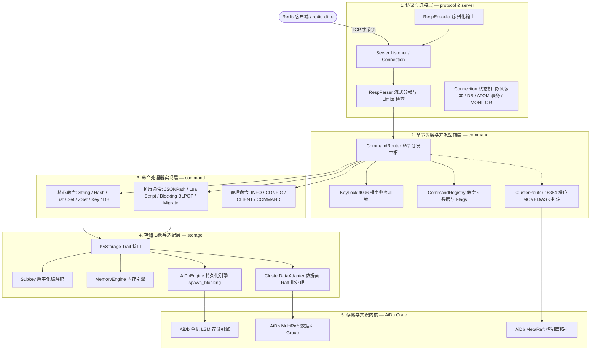
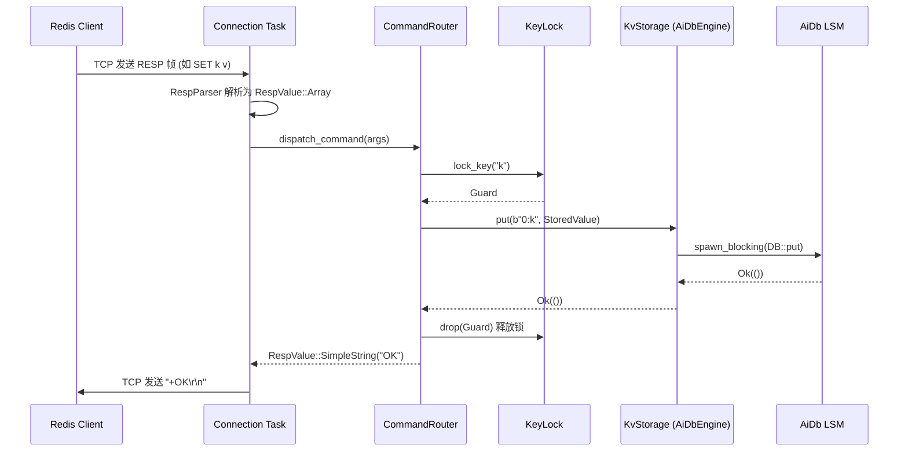
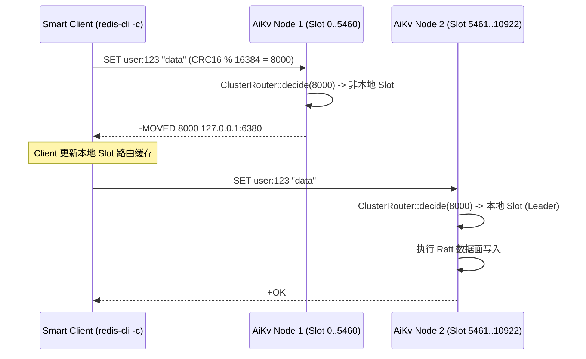

# AiKv 架构设计

> **AiKv** 是用 Rust 实现的高性能、轻量级 **Redis RESP 协议兼容的分布式键值服务** (bin + lib).
> 对外提供标准的 RESP2/RESP3 协议、Redis 命令语义与 Redis Cluster 客户端重定向协议; 对内**不实现**底层 LSM 存储与 Raft 算法, 持久化与分布式共识委托给纯 Rust 嵌入式存储库 [wiqun/AiDb](https://github.com/wiqun/AiDb).

日常修改各子系统代码时, 优先查阅 [docs/modules/](docs/modules/) 模块文档. 本文提供系统定位边界、分层拓扑、源码映射、并发锁模型与核心请求数据流总览.

---

## 1. 定位与职责边界 (Context & Boundaries)

AiKv 与底层存储内核 AiDb 保持清晰的上下游分工与职责分离:

| 维度 | AiKv (网络服务与协议层) | AiDb (底层存储与共识内核) |
| :--- | :--- | :--- |
| **产品形态** | 独立网络服务端 (bin + lib), 基于 Tokio 异步运行时 | 纯嵌入式 lib crate, 纯**同步**阻塞 API |
| **协议与线格式** | RESP2 / RESP3 (HELLO 协商), Pipeline, 二进制安全 BulkString | 无网络层, 纯 Rust 结构体与字节切片 |
| **数据结构映射** | Redis 复杂类型 (`StoredValue`) 到底层 KV 的 Subkey 扁平化映射 | 单一扁平字节 Keyspace (`[u8] -> [u8]`) |
| **并发锁模型** | 细粒度 `KeyLock` (4096 桶按 Key 字典序排序加锁防死锁) | 写锁保护的 Sequence 分配与 SkipMap 无锁并发 |
| **集群客户端交互** | 计算 16384 槽位, 返回 `-MOVED` / `-ASK`, 支持 `ASKING` / `READONLY` | MetaRaft 拓扑状态机、MultiRaft 数据分片与 gRPC 传输 |
| **数据面写入** | `ClusterDataAdapter` (批处理合并、EagerFlush 异步 propose) | MultiRaft Log 追加、Commit 与状态机 Apply |
| **持久化运维** | `SAVE` / `BGSAVE` 指令映射至 AiDb Checkpoint 快照 | LSM WAL 重放、MemTable 落盘与一致性硬链接 Checkpoint |
| **可观测性** | Redis 8.8 `INFO` 渲染、Slowlog、Latency、OTel `aikv_*` 指标 | 内部 `aidb_*` 指标注册与热路径 `debug` Tracing Span |

---

## 2. 系统分层模型 (Layered Architecture)



- **分层单向依赖**: 请求由外向内单向流动 (`Protocol -> Router -> Handler -> Storage -> AiDb`), 禁止底层组件反向侵入上层.
- **存储抽象多态**: 命令层只持有 `Arc<dyn KvStorage>`, 彻底屏蔽单机内存、单机 LSM 与集群 Raft 的底层差异.

---

## 3. 源码目录拓扑 (Source Layout)

```shell
aikv/src/
├── main.rs              # CLI 入口 (Args)、init_cluster 装配、OTel 初始化
├── lib.rs               # lib crate 根; 模块声明与 feature 导出
├── error.rs             # Error 与 Result 类型定义
├── protocol/            # RESP2 / RESP3 编解码与流式解析
│   ├── encoder.rs       # RespValue 序列化
│   ├── parser.rs        # RespParser 流式解析、缓冲区管理与 Limits 校验
│   ├── types.rs         # RespValue AST 与 ProtocolVersion 定义
│   └── mod.rs
├── server/              # TCP 服务、连接管理与可观测性运行时
│   ├── listener.rs      # TCP Server accept 循环与 max_clients 门控
│   ├── connection/      # 连接处理、Pipeline 批读、HELLO 握手与 ATOM 事务
│   ├── config.rs        # ServerSharedState 与连接配置
│   ├── info.rs          # Redis 8.8 INFO 11 个 Section 格式化渲染
│   ├── info_catalog.rs  # INFO ↔ OTel 增量同步字典
│   ├── metrics.rs       # ServerMetrics 原子内存计数器
│   ├── metrics_server.rs # HTTP /health 探活服务 (feature = "monitoring")
│   ├── otel.rs          # OpenTelemetry Tracer / Meter 初始化
│   ├── otel_metrics/    # aikv_* OTel 生产指标定义
│   ├── process_metrics.rs # CPU / RSS 进程指标采集
│   ├── slowlog.rs       # SlowQueryLog 慢查询环形缓冲
│   ├── latency.rs       # LatencyStats 延迟尖刺统计
│   └── mod.rs
├── storage/             # 存储适配与数据编码
│   ├── adapter.rs       # KvStorage trait 核心抽象接口
│   ├── memory.rs        # MemoryEngine 内存存储实现
│   ├── aidb.rs          # AiDbEngine 持久化引擎适配 (spawn_blocking)
│   ├── aidb_options.rs  # LSM 预设映射 (default, high-write, high-read)
│   ├── cluster_adapter.rs # ClusterDataAdapter 与 Batcher 异步 propose
│   ├── cluster_batcher.rs # GroupSetBatcher 写凑批 actor
│   ├── subkey.rs        # Subkey 扁平化前缀编解码
│   ├── types.rs         # StoredValue, ValueType, SubkeyData
│   ├── dump.rs          # DUMP / RESTORE 紧凑 postcard 编解码
│   ├── ttl_filter.rs    # TTL 惰性过期与 Compaction Filter 联动
│   ├── observation.rs   # 存储层延迟与吞吐监控统计
│   └── mod.rs
├── command/             # 命令路由、并发控制与业务处理器
│   ├── router/          # CommandRouter 分发中枢与 KeyLock 调度
│   ├── registry.rs      # CommandRegistry 元数据表与 CommandFlags
│   ├── string.rs        # String 系列命令处理器
│   ├── hash.rs          # Hash 系列命令处理器
│   ├── list.rs          # List 系列命令处理器
│   ├── set.rs           # Set 系列命令处理器
│   ├── zset/            # Sorted Set 系列命令处理器
│   ├── key.rs           # Key 通用操作 (EXPIRE, TTL, TYPE, DEL, EXISTS)
│   ├── database.rs      # DB 管理命令 (SELECT, FLUSHDB, DBSIZE)
│   ├── json.rs          # RedisJSON 兼容命令 (JSON.GET, JSON.SET 等)
│   ├── jsonpath/        # JSONPath 查询与修改引擎
│   ├── jsonpath_util.rs # JSONPath 辅助解析
│   ├── script.rs        # Lua EVAL / EVALSHA / SCRIPT 命令
│   ├── script/          # Lua 沙箱, redis.call (execute/), ScriptTransaction
│   ├── blocking.rs      # BlockingRegistry 阻塞命令等待与唤醒队列
│   ├── migrate.rs       # MIGRATE 数据槽位网络同步命令
│   ├── persistence.rs   # SAVE / BGSAVE / LASTSAVE / SHUTDOWN
│   ├── server.rs        # INFO / CONFIG / CLIENT / COMMAND / OBJECT
│   ├── scan_util.rs     # SCAN 游标编码与迭代辅助
│   └── mod.rs
└── cluster/             # Redis Cluster 协议与拓扑 (feature = "cluster")
    ├── router.rs        # ClusterRouter (16384 槽位 CRC16 计算与 MOVED/ASK 判定)
    ├── routing_key.rs   # {...} Hash Tag 提取算法
    ├── state.rs         # ClusterStateManager 拓扑与 Leader 缓存
    ├── gossip.rs        # 节点间轻量拓扑 tick 与指标采集
    ├── replication.rs   # 主从复制状态与 READONLY 读副本
    ├── connection.rs    # 集群节点间连接池
    ├── commands/        # CLUSTER 系列子命令 (NODES, SLOTS, SHARDS 等)
    ├── announce.rs      # NAT / 容器外部可达地址通告解析
    ├── config_auto_save.rs # 集群节点配置自动保存
    └── mod.rs
```

---

## 4. 核心并发模型与锁机制 (Concurrency & KeyLock)

为了在高并发网络连接下提供线程安全的数据修改并防止跨 Key 死锁, AiKv 实现了多层并发协调机制:

```mermaid
flowchart TD
    Req[客户端并发请求] --> Conn[Connection 异步 Task]
    Conn --> Router[CommandRouter]
    Router --> LockCheck{是否为写操作 / 多 Key 操作?}
    LockCheck -->|只读命令| ReadExec[并发执行 / 共享读]
    LockCheck -->|写命令 / Lua| KeyLockMgr[KeyLock 管理器]

    subgraph KeyLockMgr [KeyLock 4096 分桶加锁]
        Sort[1. 提取所有涉及的 Key 并去重] --> Sorter[2. 严格按 Key 字典序升序排序]
        Sorter --> Buckets[3. 依次对对应 Bucket tokio::Mutex 加锁]
        Buckets --> Exec[4. 执行命令业务逻辑]
        Exec --> Release[5. 离开作用域自动释放锁 (RAII)]
    end
```

### 4.1 字典序排序加锁防死锁 (Deadlock Prevention)

- **单 Key 写**: 计算 Key 哈希值并获取对应分桶的锁;
- **双 Key 命令 (如 `RENAME`, `RPOPLPUSH`)**: 对两个 Key 按照字节序比较 (`key_a < key_b`), 强制以固定顺序依次获取锁;
- **多 Key / Lua 事务**: 提取所有参数 Key, 过滤重复 Key 并全局字典序排序, 设置 30 秒加锁等待超时 (`lock_keys_sorted_with_timeout`), **从数学上保证加锁依赖图严格无环, 彻底消除死锁**.

### 4.2 线程与异步运行时模型

- **网络 IO 线程池**: Tokio Runtime (默认与 CPU 核心数相同), 负责高并发 TCP 连接建立、RESP 流式分帧与 Pipeline 解析;
- **存储阻塞线程池**: 底层同步 LSM 读写通过 `tokio::task::spawn_blocking` 派发至专用的 Blocking 线程池执行, 避免磁盘 IO 阻塞网络 EventLoop.

---

## 5. 数据模型与 Subkey 扁平化编码

AiKv 将 Redis 的丰富数据结构映射到底层 AiDb 的单一扁平 KV 空间:

### 5.1 编码规则

| Redis 数据类型 | 元数据 Key 格式 | 数据 Key (Subkey) 格式 | 存储 Value 结构 |
| :--- | :--- | :--- | :--- |
| **String** | `{db}:{user_key}` | — | `StoredValue { type: String, expire_at, data }` |
| **Hash** | `{db}:{user_key}` (元数据: 长度/版本) | `{db}:{user_key}:{field}` | 字段 Value 切片 |
| **List** | `{db}:{user_key}` (元数据: head/tail/len) | `{db}:{user_key}:{index}` | 元素 Value 切片 |
| **Set** | `{db}:{user_key}` (元数据: 长度/版本) | `{db}:{user_key}:{member}` | 空标记字节 |
| **ZSet** | `{db}:{user_key}` (元数据: 长度/版本) | `{db}:{user_key}:{member}` / 分数索引 | Score 二进制浮点编码 |
| **JSON** | `{db}:{user_key}` | — | `StoredValue { type: String, data: JSON 文本 }` |

- **Subkey 分隔符**: 内部使用专有前缀与分隔符隔离, 支持对 Hash 单字段或 List 端点的高效 $O(1)$ 读写, 避免整存整取导致的写放大.

---

## 6. 核心请求处理数据流 (Core Request Data Flows)

### 6.1 单机读写执行流 (Single-node Read/Write Flow)



### 6.2 Redis Cluster 路由与重定向 (Cluster Routing Flow)



### 6.3 ATOM 事务处理流 (MULTI / EXEC / WATCH)

1. **`WATCH key`**: 在 `Connection` 状态中记录当前 Key 的版本号;
2. **`MULTI`**: 开启事务缓冲模式, 后续写命令均压入连接内部的 `tx_queue`, 立即返回 `+QUEUED`;
3. **`EXEC`**:
   - 检查所有被 `WATCH` 的 Key 是否被外部写入修改 (若被修改则中止事务并返回 Null Array);
   - 提取 `tx_queue` 中全部 Key 并全局字典序加锁;
   - 通过 `WriteBatch` 一次性原子写入底层存储;
   - 释放所有 Key 锁并按序返回执行结果数组.

### 6.4 集群批处理写入流水线 (Batcher & MultiRaft Propose Flow)

在集群模式下, `ClusterDataAdapter` 内置 `Batcher` 队列:
- 多个并发客户端的写请求汇入队列;
- 当累积操作数达到 `DEFAULT_EAGER_FLUSH = 48` 或单批达 `SET_BATCH_MAX_OPS = 512`, 或等待超过 `SET_BATCH_MAX_DELAY = 1ms` 时, 立即将整批操作作为一个 MultiRaft Entry 向 AiDb 提交 propose;
- 极大摊薄了分布式 Raft 共识的网络与磁盘 fsync 开销.

---

## 7. 可观测性架构与数据流 (Observability Pipeline)

```mermaid
flowchart LR
    HotPath[业务热路径: 命令执行] -->|低开销 Atomic 累加| ServerMetrics[ServerMetrics 内存单例]
    ServerMetrics -->|只读查询| INFO[INFO 命令 / InfoRenderer]

    subgraph BackgroundTick [后台定时刷新 15s]
        ServerMetrics -->|增量计算| Sync[info_catalog::sync_otel_from_server_metrics]
        Sync -->|更新 Instrument| OtelMetrics[OtelMetrics 仪表盘]
    end

    OtelMetrics -->|OTLP gRPC| OTLP[OpenTelemetry Collector]
    K8s[K8s 探针] -->|HTTP GET :9191| Health[/health 探活]
```

- **单一真源原则**: `ServerMetrics` 是业务指标的唯一权威源, `INFO` 输出直接读取内存结构, 杜绝监控双计数偏差;
- **OTel 镜像导出**: 后台线程周期性将 `ServerMetrics` 增量同步给 OpenTelemetry, 经 OTLP 管道输出至 Prometheus / Grafana.
