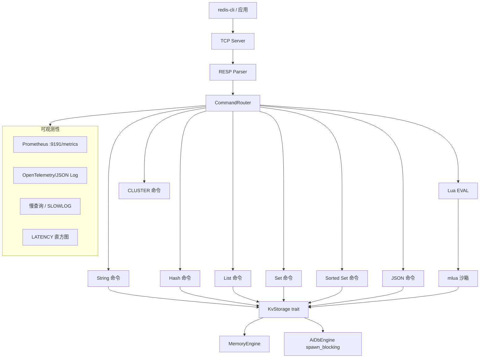

# AiKv

Redis RESP 协议兼容的 KV 服务, Rust 实现. 支持内存引擎和 AiDb 持久化引擎, 可选集群模式.

## 架构



## 特性

| 类别 | 功能 |
|------|------|
| **协议** ✅ | RESP2 + RESP3 编解码, Pipeline, TCP 异步 (tokio) |
| **数据结构** ✅ | String, Hash, List, Set, Sorted Set, Key 管理 |
| **JSON** ✅ | JSON.SET/GET/DEL/TYPE/STRLEN/ARRLEN/OBJLEN, NUMINCRBY/ARRAPPEND/MSET |
| **Lua** ✅ | EVAL/EVALSHA, SCRIPT LOAD/EXISTS/FLUSH/KILL, mlua 沙箱 + redis.call |
| **存储引擎** ✅ | 内存 (`--engine memory`) · AiDb 持久化 (`--engine aidb --data-dir`) |
| **集群** ✅ | CLUSTER INFO/NODES/SLOTS/MEET/ADDSLOTS, MOVED/ASK 重定向, Gossip 发现, Failover |
| **可观测性** ✅ | Prometheus `/metrics`, OTel spans, JSON 日志, 慢查询, LATENCY 直方图 |
| **持久化兼容** ✅ | SAVE/BGSAVE/LASTSAVE/SHUTDOWN, `INFO persistence` |
| **E2E 测试** ✅ | `e2e/test_*.sh` — basic/datatypes/ext/json/lua/persistence |

**未实现** (延后/可选): AOF (memory 引擎), 标准 RDB dump.rdb, CONFIG REWRITE.

**近期新增 (0.9.3)**: 阻塞命令 (BLPOP/BRPOP/BLMOVE/BZPOPMIN/BZPOPMAX), MIGRATE 跨节点 (AUTH + KEYS 子命令).

## 快速开始

### 内存模式

```bash
cargo build --release
./target/release/aikv --engine memory --port 6379

# 另开终端
redis-cli -p 6379 SET hello world
redis-cli -p 6379 GET hello
```

### 持久化模式 (AiDb 引擎)

```bash
./target/release/aikv --engine aidb --data-dir /tmp/aikv-data --port 6379
```

### 集群模式

启动 3 节点集群 (需要 `--features cluster` 构建):

```bash
cargo build --release --features cluster

# 节点 1
./target/release/aikv --engine memory --port 6379 --cluster-mode \
  --cluster-addr 127.0.0.1:6380 --node-id node1

# 另开终端: 节点 2
./target/release/aikv --engine memory --port 6381 --cluster-mode \
  --cluster-addr 127.0.0.1:6382 --node-id node2

# 节点 1 上执行集群 meet
redis-cli -p 6379 CLUSTER MEET 127.0.0.1 6382
```

### 构建与测试

```bash
cargo build
cargo test -- --test-threads=1
cargo test --features cluster -- --test-threads=1   # 集群测试
```

### E2E 测试 (需 redis-cli)

```bash
cargo build --release
./e2e/test_basic.sh
./e2e/test_datatypes.sh
./e2e/test_json.sh
./e2e/test_lua.sh
```

## 命令行参数

| 参数 | 默认值 | 说明 |
|------|--------|------|
| `--bind` | 127.0.0.1 | 监听地址 |
| `--port` | 6379 | 监听端口 |
| `--engine` | memory | 存储引擎: `memory` / `aidb` |
| `--data-dir` | - | AiDb 数据目录 (engine=aidb 时必须) |
| `--metrics-port` | 9191 | Prometheus `/metrics` 端口 |
| `--metrics-addr` | 127.0.0.1 | Metrics 监听地址 |
| `--cluster-mode` | - | 启用集群模式 |
| `--cluster-addr` | - | 集群内部通信地址 (ip:port) |
| `--node-id` | - | 节点唯一标识 |

## 设计文档

详见 [WiQunTools](https://github.com/GO-Zheng/WiQunTools) 仓库下 `docs/aikv-inventory/`.

## 许可

MIT
