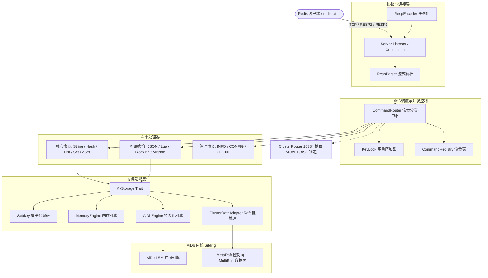

# AiKv

[](https://www.rust-lang.org)
[](Cargo.toml)
[](LICENSE)
[](.github/workflows/ci.yml)

> **AiKv** 是一个用纯 Rust 实现的高性能, 轻量级 **Redis RESP 协议兼容的分布式键值服务** (bin + lib).  
> 对外提供标准的 RESP2/RESP3 协议与 Redis 命令语义; 底层存储与分布式共识委托给嵌入式引擎 [wiqun/AiDb](https://github.com/wiqun/AiDb).

---

## 为什么开发 AiKv (Why AiKv?)

- **磁盘级 KV 存储, 大幅降低成本**: 原生 Redis 全量内存导致成本高昂且容量受限; AiKv 将冷热数据下沉至 SSD 优化的 LSM-Tree 引擎, 在保障高并发低延迟的同时显著降低硬件成本与运维开销.
- **原生支持 JSON 与 Lua 脚本**: 无需额外编译或维护第三方 C 扩展 (如 RedisJSON), 原生支持 RedisJSON (JSONPath) 兼容命令与 Lua 5.4 安全沙箱, 开箱即用.
- **彻底解决 Redis 集群模式痛点**: 摒弃 Redis Gossip 带来的脑裂与收敛慢问题, 引入强一致的 Raft 算法, 提供确定性拓扑管理与无损在线槽位迁移.
- **存算分离, 架构解耦**: 网络协议与命令路由由 AiKv 实现, 持久化与分布式共识由纯 Rust LSM 引擎 [wiqun/AiDb](https://github.com/wiqun/AiDb) 承载, 各层独立演进.

---

## 核心亮点 (Key Highlights)

- **协议完全兼容**: 深度对齐 Redis 8.8, 支持 RESP2/RESP3 双栈协议与标准命令语义, 现有客户端与业务无需改动即可平滑迁移.
- **纯 Rust 实现**: 内存安全, 零 C/C++ 依赖, 采用 mimalloc 降低内存碎片.
- **丰富的数据结构与原生扩展**: 完整支持 String, Hash, List, Set, Sorted Set, 原生内置 JSON (JSONPath) 与 Lua 5.4 脚本 (EVAL / SCRIPT).
- **细粒度并发与事务**: 4096 桶按 Key 字典序排序加锁, 彻底杜绝死锁; 支持 MULTI/EXEC/WATCH 原子事务.
- **分布式集群模式**: 16384 槽位路由, Hash Tag, 在线槽位迁移, 客户端透明重定向 (redis-cli -c).
- **云原生高并发架构**: Tokio 异步运行时 + 4096 桶细粒度 KeyLock, 保证原子性与无死锁的同时最大化多核吞吐.
- **云原生可观测性**: 深度对齐 Redis 8.8 INFO 字段, 支持基于 OpenTelemetry 的指标导出 (`aikv_*`) 与全链路 tracing span 跟踪.

---

## 架构概览 (Architecture at a Glance)



---

## 快速开始

### 编译构建

```bash
# 1. 编译带集群能力的发布版本
cargo build --release --features cluster

# 2. 生产全功能构建 (块压缩 + 集群 + OTel 监控)
cargo build --release --features cluster,monitoring,compression
```

### 单机运行

可选: 将 [`examples/aikv.toml.example`](examples/aikv.toml.example) 复制为 `aikv.toml` 放置于工作目录, 或通过 `--config` 指定; 详见 [docs/modules/09-config.md](docs/modules/09-config.md).

```bash
# 启动持久化服务 (推荐生产配置)
./target/release/aikv \
  --bind 127.0.0.1:6379 \
  --engine aidb \
  --data-dir /tmp/aikv-data

# 另开终端验证
redis-cli -p 6379 PING
redis-cli -p 6379 SET mykey "hello aikv"
redis-cli -p 6379 GET mykey
```

### 集群部署与运维

多节点 Redis Cluster 部署, 端口规划与拓扑初始化指南请查阅 [docs/deployment.md](docs/deployment.md).

---

## 与 AiDb 协同开发 (Monorepo Setup)

AiKv 通过 Git 依赖引入 [wiqun/AiDb](https://github.com/wiqun/AiDb) (`branch = "new/main"`). 本地高频联调时, 在 `~/.cargo/config.toml` 中配置本地覆盖:

```toml
[patch."https://github.com/wiqun/AiDb.git"]
aidb = { path = "/absolute/path/to/aidb" }
```

---

## 示例 (Examples)

仓库内提供了开箱即用的示例代码:

| 示例场景 | 源码入口 | 说明 | 运行命令 |
| :--- | :--- | :--- | :--- |
| **基础操作** | [`examples/basic.rs`](examples/basic.rs) | 内嵌内存 Server 快速演示 CRUD 与 INFO | `cargo run --example basic` |
| **集群路由** | [`examples/cluster.rs`](examples/cluster.rs) | CRC16 槽位计算与 Hash Tag 提取演示 | `cargo run --features cluster --example cluster` |

---

## 功能特性矩阵 (Feature Matrix)

| Feature | 默认状态 | 核心能力 | 依赖与说明 |
| :--- | :--- | :--- | :--- |
| **(none)** | ✅ | 单机 RESP2/3 服务, 内存 / AiDb 存储引擎 | 零外部网络依赖, 最小发布体积 |
| **`cluster`** | 按需开启 | 16384 Slot 槽位计算, `-MOVED` / `-ASK` 重定向, MultiRaft 批处理 | 依赖 `aidb/cluster`, 构建需 `protoc` |
| **`monitoring`** | 按需开启 | OTel 生产指标 (`aikv_*`), Tracing 链路导出, `:9191` `/health` HTTP 探活 | 依赖 `aidb/monitoring` |
| **`compression`** | 按需开启 | 开启 SSTable 数据块压缩 (Snap / LZ4) | 依赖 `aidb/compression` |

完整 CLI 参数与环境变量对照见 [docs/deployment.md](docs/deployment.md).

---

## 自动化测试与质量门禁

```bash
# 1. 运行核心单元与集成测试
export RUSTFLAGS='-D warnings'
cargo fmt --check
cargo clippy --all-targets --features cluster,monitoring
cargo test --features cluster,monitoring -- --test-threads=1

# 2. 运行黑盒 E2E 测试 (需先部署服务)
pytest e2e/function/ -v
```

测试规范与矩阵说明见 [CONTRIBUTING.md](CONTRIBUTING.md).

---

## 文档导航

开发与设计文档总览见 [docs/README.md](docs/README.md).

| 文档分类 | 入口文件 | 适用场景与内容 |
| :--- | :--- | :--- |
| **系统架构** | [ARCHITECTURE.md](ARCHITECTURE.md) | 分层设计, KeyLock 并发模型, Subkey 编码, Cluster 路由原理 |
| **设计决策** | [docs/design.md](docs/design.md) | 技术选型理由, 跨模块权衡 (Why), YAGNI 与已知限制 |
| **部署与运维** | [docs/deployment.md](docs/deployment.md) | Feature 构建, CLI 参数, 集群多节点部署, OTel 监控告警 |
| **开发与贡献** | [CONTRIBUTING.md](CONTRIBUTING.md) | Git 工作流, 测试矩阵, 规范要求与 PR 流程 |
| **AI 助手指南** | [AGENTS.md](AGENTS.md) | 编码硬约束 (Never / Always), 技术对照表与任务路由 |
| **模块文档** | [docs/modules/](docs/modules/) | 8 篇模块深度规范 (Protocol, Server, Storage, Commands, Cluster, Observability) |
| **变更记录** | [CHANGELOG.md](CHANGELOG.md) | 版本演进与特性变更日志 |

---

## 许可证

本项目采用 [MIT 许可证](LICENSE) (见 [Cargo.toml](Cargo.toml)).
