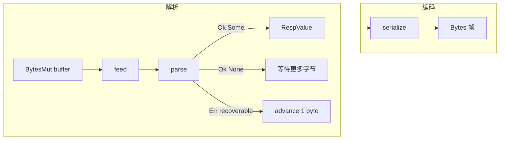
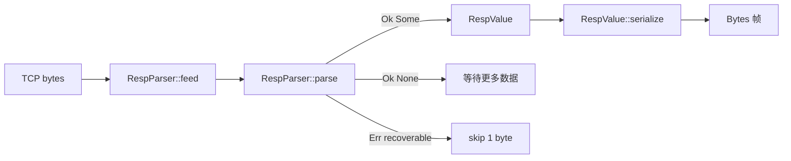

# Cursor transcript

---

## 1. User

工作目录: `/root/code/database`

请先阅读 (不要跳过):

1. `AiKv-Workflow/backup/design.md` — 总规程
2. `AiKv-Workflow/backup/PROGRESS.md` — 当前进度
3. `AiKv-Workflow/backup/INDEX.md` — 本章索引 (若已有行则更新)

---

### 本次任务

|项|值|
|---|---|
|PROGRESS 总步|3|
|目标文件|`aikv/docs/modules/protocol.md`|
|本次子步|从步 0 开始|
|对比深度|模块级 (默认)|

### 必须遵守

- 确认门控: 步 0→1→2→3→4, 每步先讨论, 我确认后再下一步
- 步 4: 先出 Module Skill 正文 草稿, 我确认后再写入 aidb/aikv、更新 INDEX/PROGRESS
- Module Skill 基础模板: frontmatter `name` + `description` (含 `Use when`); 见 `design.md`
- 过程只进 backup/: INDEX; aidb/aikv 不写迁移历史
- 旧文档顺序: `backup/{aidb,aikv}/` → `*-oldmain` → WiQunTools 查漏 → wiqun-*
- 待核实: module 一行引用; 详情写入 当前仓库 根目录 `ISSUES.md` (`aidb/ISSUES.md` 或 `aikv/ISSUES.md`)
- 步 4 落盘前: 对照 create-skill Summary Checklist 自检 (见 `design.md`)

### 本次不要

- 不要跳过未确认的步骤
- 不要一次写多篇 module
- 不要修改 `design.md` / 流程, 除非我明确要求
- 不要 commit, 除非我明确要求

---

请从步 0 开始, 给出本步交付物, 等我确认。

---

## 2. Assistant

先阅读规程、进度与索引，再按步 0 给出交付物。

---

## 3. Assistant

对照 `design.md` 的 modules↔src 表，扫描 `aikv/src/protocol/` 以确定本章范围与拟读文件。

---

## 4. Assistant

## 步 0: 定范围 — `aikv/docs/modules/protocol.md`

**PROGRESS 总步**: 3/12 (阶段 1)  
**对比深度**: 模块级 (默认)  
**Skill name (拟定)**: `aikv-protocol`

---

### 本章定位 (对照 `design.md` modules↔src 表)

| 项 | 内容 |
|---|---|
| 目标文件 | `aikv/docs/modules/protocol.md` |
| 覆盖 `src/` | `protocol/*` |
| 主要内容 | RESP2/RESP3; parser/encoder; pipeline 边界 |
| 下游依赖 | 步 4 `server.md` 直接消费本模块; `command/*`、`cluster/*` 使用 `RespValue` 编码响应 |

---

### `src/protocol/` 实际结构

```shell
aikv/src/protocol/
├── mod.rs      # 模块根; re-export RespParser, ProtocolVersion, RespValue
├── types.rs    # RespValue 枚举 (RESP2+RESP3); ProtocolVersion (默认 Resp3)
├── parser.rs   # RespParser: feed/parse, 限流与深度保护, 可恢复错误策略
└── encoder.rs  # RespValue::serialize / encode_into
```

**库入口**: `aikv/src/lib.rs` → `pub mod protocol`

**对外 pub API (步 1 将细读)**:

| 符号 | 文件 | 用途 |
|------|------|------|
| `RespValue` | `types.rs` | 协议值 AST; 命令层构造响应 |
| `ProtocolVersion` | `types.rs` | RESP2/RESP3; `HELLO` 协商 (逻辑在 `server`, 类型在此) |
| `RespParser` | `parser.rs` | 流式解析; `feed` + `parse` → `Option<RespValue>` |
| `RespValue::serialize()` | `encoder.rs` | 编码为 `Bytes` 帧 |

---

### 拟读文件清单 (步 0→1)

**源码 (必读)**:

| 优先级 | 路径 | 理由 |
|--------|------|------|
| P0 | `aikv/src/protocol/mod.rs` | 模块边界与 re-export |
| P0 | `aikv/src/protocol/types.rs` | RESP 类型全集; `ProtocolVersion` |
| P0 | `aikv/src/protocol/parser.rs` | 解析主流程、limits、recoverable 策略 (~616 行) |
| P0 | `aikv/src/protocol/encoder.rs` | 各类型编码规则 (~143 行) |
| P1 | `aikv/src/error.rs` | `Error::Protocol` 与 parser 错误语义 |
| P1 | `aikv/src/server/connection.rs` (仅 protocol 相关片段) | pipeline 循环、`HELLO` 协商、`protocol_negotiated` — **界定边界, 不写入 server 职责** |

**测试 (步 1 验证用)**:

| 路径 | 覆盖 |
|------|------|
| `aikv/tests/modules/resp/types.rs` | golden encode |
| `aikv/tests/modules/resp/parser.rs` | roundtrip、边界、limits |

**步 2 旧文档 (本步仅登记, 步 2 再读)**:

| 顺序 | 来源 | 路径 |
|------|------|------|
| 1 | backup/aikv | `ARCHITECTURE.md` (protocol 段) |
| 2 | aikv-oldmain | `src/protocol/{mod,types,parser}.rs` (无独立 `encoder.rs`) |
| 3 | WiQunTools | `docs/wiqun-kv-inventory/01-resp-tcp.md` (查漏) |
| 4 | wiqun-kv | 与 aikv 重叠, 二选一 |

---

### 本章边界

**纳入 `protocol.md`**:

- `RespValue` 类型与 RESP2/RESP3 marker 映射
- `RespParser` 流式 API (`new` / `with_limits` / `feed` / `parse` / `buffer_len`)
- 解析限流默认值与 `Error::Protocol` 分类 (含 recoverable skip-1-byte)
- `RespValue::serialize()` 编码规则 (含 NaN/inf/-0 等特殊 float)
- `ProtocolVersion` 类型定义 (协商**行为**仅一句指向 `server.md`)
- pipeline 语义: **单 `parse()` = 单帧**; 多命令 pipeline 由上层循环驱动 (引用 `connection`, 不展开 server 逻辑)

**不纳入 (其它 module)**:

| 内容 | 归属 |
|------|------|
| TCP Listener / Connection 读写循环 | `server.md` (步 4) |
| `HELLO` / `PING` / `QUIT` 命令处理 | `server.md` 或 `commands-extended.md` |
| 命令参数从 `RespValue::Array` 拆解 | `commands-core.md` |
| 集群转发中的 RESP 透传 | `cluster.md` |
| AOF 中的 RESP 记录 | `commands-extended.md` (persistence) |
| `Error` 全量枚举 | `development.md` 或各 module 按需引用 |

**与 oldmain 已见差异 (步 3 再展开)**:

- 新代码拆分 `encoder.rs`; oldmain 编码在 `types.rs` 内
- 新 `parser.rs` 有 `with_limits`、recoverable 错误、更完整 RESP3 解析
- 新增 `ProtocolVersion` 枚举

---

### 拟写入 INDEX 的本章行 (确认后更新)

| 新文档章节 | 状态 | 备注 |
|------------|------|------|
| `docs/modules/protocol.md` | 步 0 已确认 | `protocol/*` — types, parser, encoder; 测试 `tests/modules/resp/` |

---

### 步 4 草稿章节预览 (供范围核对)

- frontmatter: `name: aikv-protocol`, description 含 `Use when` (改 parser/encoder、排查 RESP 帧、pipeline 解析)
- 何时读本文 / 代码地图 / 关键 invariant (limits、单帧 parse 契约)
- 数据流 (mermaid: bytes → RespParser → RespValue → serialize → bytes)
- 关键类型与 API
- 常见任务 (加 RESP3 类型、调 limits、roundtrip 调试)
- 测试命令
- 已知限制 (如 `StreamedString`、`;` chunk marker 拒绝)
- 待核实 (步 2–3 后定)

---

请确认步 0:

1. **范围** (`protocol/*` + 上述边界) 是否 OK?
2. **拟读文件清单** 是否需要增减 (例如是否要在步 1 多读 `cluster/forward.rs` 的 parser 用法)?
3. 确认后我将更新 `backup/INDEX.md` 本章行, 再进入**步 1 (读新代码)**.

---

## 5. User

可以

---

## 6. Assistant

步 0 已确认。正在更新 `INDEX.md`，并深入阅读 `protocol` 源码以准备步 1 交付物。

---

## 7. Assistant

`INDEX.md` 已更新 (protocol 行标记为「步 0 ✅」). 以下为**步 1**交付物, 请确认后再进入步 2.

---

## 步 1: 读新代码 — `protocol` 模块要点

**验证**: `cargo test --test resp` — 66 项全过 (types 29 + parser 37).

---

### 职责 (一句话)

`protocol` 是 AiKv 的 **RESP2/RESP3 编解码层**: 将 TCP 字节流解析为 `RespValue` AST, 再将 AST 编码回 RESP 帧. 不处理命令语义、不管理连接生命周期.

---

### 代码地图

| 路径 | 职责 | 入口 |
|------|------|------|
| `protocol/mod.rs` | 模块根; re-export 公共 API | `RespParser`, `RespValue`, `ProtocolVersion` |
| `protocol/types.rs` | RESP 值 AST + 协议版本枚举 | `RespValue`, `ProtocolVersion` |
| `protocol/parser.rs` | 流式解析器, 限流与深度保护 | `RespParser::new()` / `with_limits()` / `feed()` / `parse()` |
| `protocol/encoder.rs` | 值 → 字节帧 | `RespValue::serialize()` |

**跨模块消费者** (边界参考, 不写入本章正文):

- `server/connection.rs` — 持有 `RespParser`, 驱动 pipeline 循环
- `command/*`, `cluster/*` — 构造/消费 `RespValue` 响应

---

### `RespValue` 类型覆盖

| 类别 | 变体 | marker |
|------|------|--------|
| RESP2 | `SimpleString`, `Error`, `Integer`, `BulkString`, `Array` | `+` `-` `:` `$` `*` |
| RESP3 | `Null`, `Boolean`, `Double`, `BigNumber`, `BulkError`, `VerbatimString`, `Map`, `Set`, `Push`, `Attribute`, `StreamedString` | `_` `#` `,` `(` `!` `=` `%` `~` `>` `\|` `$?`+`;` |

- `BulkString(None)` / `Array(None)` 表示 RESP null bulk/array (`$-1` / `*-1`)
- `BulkString` 载荷用 `bytes::Bytes`, 支持二进制
- `ProtocolVersion`: `Resp3` 默认; `HELLO 2/3` 协商在 `server` (类型定义在此)

---

### 主流程



**`RespParser::parse()` 契约**:

1. 每次调用只消费 **一个完整顶层帧**; 成功时 `buffer.advance(consumed)`
2. 数据不足 → `Ok(None)`, buffer 不变 (支持分片读)
3. 可恢复错误 (`is_recoverable`) → `advance(1)` + `Err`, 上层可重试 (见 `test_parse_unknown_type_marker`)
4. 不可恢复错误 (depth/too large/line too long 等) → 不 advance, 由 `server` 判定 fatal 并断连

**默认 limits** (`parser.rs`):

| 项 | 默认值 |
|----|--------|
| `max_bulk_len` | 512 MiB |
| `max_buffer_size` | 64 MiB |
| `max_parse_depth` | 128 |
| `max_array_len` | 4 MiB (array/map/set/push/attribute 共用) |
| `max_line_len` | 1 MiB |

**Pipeline 边界** (协议层视角):

- 协议层 **无** pipeline API; 多帧 = 上层循环 `parse()` 直到 `None`
- `test_parse_pipeline`: `+PONG\r\n+PONG\r\n` 两次 `parse()` 得两帧
- 命令帧形态: 顶层须为 `Array` (由 `server::process_value` 校验, 非 parser 职责)

**Streamed string**:

- 解析: `$?` 开头 → `;len\r\n` chunks → `;0\r\n` 结束 → `StreamedString`
- 编码: 同上格式
- 孤立 `;` marker → 硬错误 (`unexpected streamed chunk marker`)

**Double 特殊值** (encode/decode 对称):

- `nan` / `inf` / `-inf` / `-0` 有专门处理

---

### 关键 invariant (步 4 拟写入)

1. **`parse()` 单帧语义** — 不一次解析多条命令; pipeline 由调用方循环
2. **不完整帧不消费** — `Ok(None)` 时 cursor 回退, buffer 保留
3. **可恢复 vs fatal 分界** — parser `is_recoverable` 与 server `is_fatal_protocol` 子集不同 (server 额外把 `buffer size` 当 fatal)
4. **编码 roundtrip** — 所有 `RespValue` 变体应 `serialize → feed → parse` 等价 (测试覆盖)
5. **命令请求格式** — AiKv 期望 `Array` of bulk strings; 由 server 层 enforce, 不在 parser 硬编码

---

### 测试入口

```bash
cargo test --test resp          # types + parser 全量
cargo test --test resp parser   # 仅 parser (37)
cargo test --test resp types    # 仅 golden encode (29)
```

覆盖: roundtrip 全类型、incomplete feed、pipeline、limits (depth/bulk/array/line)、recoverable skip、malformed verbatim/length mismatch.

---

### 步 1 结论 (供步 2–4 用)

- 模块小而完整: 4 个源文件, **无** feature flag, **无** 对外配置 (limits 仅 `with_limits`, 生产路径用默认)
- 与 `server` 分工清晰: parser 只管帧; 命令拆解 / HELLO 协商 / null 编码策略 (`protocol_negotiated`) 在 server
- 文档应强调 **流式 API 用法** 与 **limits/recoverable 语义**, 而非 RESP 协议科普
- `StreamedString` / `Attribute` / `Push` 已实现编解码, 但命令层未必使用 — 步 4「已知限制」可注明

---

请确认步 1. 确认后进入**步 2 (查旧文档)**. 如需调整 (例如步 1 是否补充 `cluster/forward.rs` 的 parser 用法), 请说明.

---

## 8. User

可以

---

## 9. Assistant

步 1 已确认。按旧文档查阅顺序检索 `protocol` 相关参考，整理步 2 交付物。

---

## 10. Assistant

## 步 2: 查旧文档 — 交付物

已按 `backup/aikv` → `aikv-oldmain` → WiQunTools → `wiqun-kv` 顺序查阅. **尚未**写入 `INDEX` / `ISSUES.md` (等你确认).

---

### 旧文档清单与分类

| # | 来源 | 路径 | 分类 | 说明 |
|---|------|------|------|------|
| 1 | backup/aikv | `ARCHITECTURE.md` §目录/数据流 | **已过时** | 写 `protocol/value.rs`, 现为 `types.rs` + `encoder.rs`; 命令模块命名亦旧 |
| 2 | backup/aikv | `DESIGN.md` §协议 | **部分仍有效** | RESP2/RESP3 双栈、HELLO 协商、pipeline 理由仍成立; 「不完整→NeedMoreData」术语过时 (现为 `Ok(None)`) |
| 3 | backup/aikv | `README.md` | **仍有效** | 高层: RESP2+RESP3、Pipeline、tokio — 无实现细节 |
| 4 | backup/aikv | `CHANGELOG.md` (~L398) | **仍有效** | `src/protocol/` — RespValue, RespParser, RESP2/RESP3 编码 |
| 5 | backup/aikv | `CONTRIBUTING.md` | **仍有效** | 一行目录说明 |
| 6 | backup/aikv | superpowers cluster 两篇 | **跳过** | 仅 RESP 序列化边缘 (BulkString 空串), 非 protocol 模块主体 |
| 7 | aikv-oldmain | `docs/development/architecture/01-overview.md` §协议层 | **已过时** | `VerbatimString(String, Bytes)` 旧形态; 缺 BulkError/Attribute/StreamedString; 宣称「零拷贝」夸大 |
| 8 | aikv-oldmain | `docs/development/api/01-commands.md` §RESP/HELLO | **部分仍有效** | HELLO 协商语义可参考; 命令大全不属于 protocol.md |
| 9 | aikv-oldmain | `src/protocol/{mod,types,parser}.rs` | **已过时 (实现)** | 无 `encoder.rs`; 无 limits/`with_limits`; `parse()` 将 `Protocol` 错当 incomplete; `RespValue` 有辅助构造器 |
| 10 | WiQunTools | `wiqun-kv-inventory/01-resp-tcp.md` | **大体仍有效** | 与当前实现高度对齐: 17 变体、limits 默认值、recoverable 语义、pipeline、streamed string |
| 11 | WiQunTools | `wiqun-kv-inventory.md` §RESP | **查漏有效** | 功能清单, 不迁入正文 |
| 12 | wiqun-kv | `src/protocol/*` | **与当前 aikv 等价** | 布局同新代码 (`types`+`parser`+`encoder`, `with_limits`, `ProtocolVersion`) — 步 3 可二选一抽样 |

**结论**: 无独立 `protocol.md` 旧稿可回迁; **主参考** = 当前源码 + WiQunTools `01-resp-tcp.md`; backup `ARCHITECTURE`/`DESIGN` 仅摘决策, 不抄结构.

---

### 仍有效 → 步 4 拟吸收

- WiQunTools `01-resp-tcp.md`: `RespParser` API 契约、limits 表、recoverable/fatal 分界、pipeline 循环模式、streamed string 格式
- backup `DESIGN.md`: 双协议动机 (一句, 详述留阶段 2 `DESIGN.md`)
- backup `README`/`CHANGELOG`: 不重复, 仅作交叉核对

---

### 已过时 → 不写入 module / 步 4 消化源侧时处理

| 过时点 | 新实现 |
|--------|--------|
| `value.rs` 单文件 | `types.rs` + `encoder.rs` |
| `RespParser::new(capacity)` | `new()` / `with_limits(...)` |
| 无解析限流 | 5 项默认 limit + 测试覆盖 |
| `parse()` Protocol→`Ok(None)` | 真 incomplete=`Ok(None)`; 错误=`Err` (+ recoverable skip) |
| `RespValue::simple_string()` 等辅助器 | 直接构造枚举 |
| `ProtocolVersion` 在 `connection.rs` | 迁至 `protocol/types.rs` |
| oldmain 默认 `Resp2` | 新代码 `ProtocolVersion::default() = Resp3` |

---

### 设计偏离 / 待核实

| 点 | 性质 | 建议 |
|----|------|------|
| 默认 `ProtocolVersion = Resp3` | **有意变更** (测试 `test_protocol_version_default`, `test_tcp_hello_no_args`) | WiQunTools 写「默认 RESP2」→ 以代码为准; module 写明默认 Resp3 + `protocol_negotiated` 门控 |
| 无参 `HELLO` 返回 RESP3 Map (`%...`) | **有意变更** (对齐 Redis 7 测试意图) | 写入 server 交叉引用; protocol 仅记类型 |
| `adapt_for_protocol` null 转换 | **server 行为**, 非 parser | 不纳入 protocol 正文, 一句指向 `server.md` |
| 顶层 `;` marker 硬拒绝 | 与 oldmain 不同 (oldmain 有 `parse_streamed_chunk`) | 文档「已知限制」; 非 bug |
| oldmain「零拷贝解析」 | 营销表述 | 不写; 实际用 `Bytes`/`BytesMut` |

---

### 拟写 `aikv/ISSUES.md` (确认后落盘)

**ISSUE-001** (建议状态: `doc-only`)

- **标题**: 默认协议版本与 WiQunTools 库存不一致
- **发现于**: PROGRESS 步 3 / `docs/modules/protocol.md`
- **相关 src**: `src/protocol/types.rs` (`ProtocolVersion::default()`)
- **旧文档**: `WiQunTools/.../01-resp-tcp.md` L253「默认 RESP2」; `aikv-oldmain` connection 默认 Resp2
- **现象**: 库存/oldmain 写 RESP2 默认; 当前 `Default = Resp3`, 无参 `HELLO` 返回 Map
- **影响**: module 以代码为准; 不影响未协商连接的 RESP2 线格式 (`protocol_negotiated` 门控)
- **下一步**: 文档更正即可, 无需改代码

module 待核实一行 (步 4):

> `见 ISSUES.md#ISSUE-001 — 默认 ProtocolVersion 为 Resp3, 与 WiQunTools 库存「默认 RESP2」不一致`

若无异议, 步 4 也可写「无」并把 ISSUE-001 标 `doc-only` 后不在 module 引用 — 按你偏好.

---

### 步 4 文档表述建议 (基于步 2)

1. **不科普 RESP 协议** — 只写本项目 API、limits、错误语义
2. **突出重构增量**: 独立 `encoder.rs`、`with_limits`、recoverable skip、`ProtocolVersion` 类型
3. **pipeline**: 引用 WiQunTools 表述 (单 `parse()` 单帧, Connection 循环) — 正文一句 + 指向 `server.md`
4. **DESIGN 级原理** (为何双协议) — 不在 module 展开, 链阶段 2 `DESIGN.md`
5. **测试**: 沿用 `cargo test --test resp`

---

### 确认后我将

1. 更新 `backup/INDEX.md` — protocol 行补「参考路径 + 处理结论」
2. 写入 `aikv/ISSUES.md#ISSUE-001` (若你同意)
3. 进入**步 3 (对比旧代码, 模块级)**

---

请确认步 2:

- 分类与边界是否 OK?
- **ISSUE-001** 是否写入 (`doc-only`)? module 内是否一行引用, 还是仅 ISSUES 记录?
- 确认后进入步 3.

---

## 11. User

可以。我确认默认协议版本应该为 RESP3，WiQunTools 里的该文档已经落后，这个 ISSUES 可以不添加

---

## 12. Assistant

步 2 已确认；不添加 ISSUE-001。正在更新 `INDEX.md`，并对比 oldmain 与当前实现的模块级差异。

---

## 13. Assistant

## 步 3: 对比旧代码 (模块级) — 交付物

对照 `aikv-oldmain/src/protocol/*` 与当前 `aikv/src/protocol/*`; `wiqun-kv` 与当前 aikv **实质等价** (仅格式差异), 作交叉验证. **未**更新 INDEX 步 3 行 (等你确认).

---

### 路径映射

| oldmain | 当前 aikv | 变化 |
|---------|-----------|------|
| `protocol/mod.rs` (2 子模块) | `mod.rs` (3 子模块) | +`encoder` |
| `protocol/types.rs` (类型 + `serialize`) | `types.rs` + `encoder.rs` | 编码拆分 |
| `protocol/parser.rs` (~693 行) | `parser.rs` (~616 行) | 重写: limits、depth、recoverable |
| — | `types.rs::ProtocolVersion` | 从 `server/connection.rs` 迁入 |
| `server/connection.rs::ProtocolVersion` | 删除, 改用 `crate::protocol` | 类型归位 protocol |

---

### 模块级差异表

| 维度 | aikv-oldmain | 当前 aikv | 主流程等价? | 文档应如何写 |
|------|--------------|-----------|-------------|--------------|
| **文件布局** | 3 文件, 编码在 `types.rs` | 4 文件, `encoder.rs` 独立 | ✅ 行为等价 | 代码地图列 4 文件 |
| **`RespParser::new`** | `new(capacity: usize)` | `new()` + `with_limits(...)` | ⚠️ API 变 | 写新 API; 不提 oldmain 签名 |
| **解析限流** | 无 | 5 项默认 limit + 测试 | ❌ 新增 | 「关键 invariant」+ 默认表 |
| **嵌套深度** | 无限制 | `max_parse_depth=128` | ❌ 新增 | 同上 |
| **`parse()` 语义** | 任意 `Protocol` 错 → `Ok(None)` | incomplete=`Ok(None)`; 真错=`Err`; recoverable skip 1B | ❌ 修正 | 重点写三态 + recoverable |
| **incomplete 处理** | `read_line`/`parse_bulk` 多返回 `Err` | cursor 回退 + `Ok(None)` | ⚠️ 更精确 | 说明「等更多字节」契约 |
| **`RespValue` 辅助构造** | `ok()`, `simple_string()` 等 15+ | 无, 直接枚举 | ⚠️ API 删 | 不写辅助器; 示例用字面量 |
| **`ProtocolVersion`** | 在 server, 默认 **Resp2** | 在 protocol, 默认 **Resp3** | ⚠️ 有意变更 | 明确默认 Resp3; HELLO/编码门控指 server |
| **Double 编解码** | 无 `nan`/`-0` 特判 | encode/decode 支持 nan/inf/-0 | ⚠️ 增强 | 列特殊值表 (简短) |
| **Boolean 解析** | `read_line` → `"t"`/`"f"` | 固定读 `t\r\n`/`f\r\n` 3 字节 | ✅ 等价 | 可不写 |
| **顶层 `;` marker** | `parse_streamed_chunk` 分支 | 硬错误 | ⚠️ 更严 | 「已知限制」一句 |
| **Streamed string** | `$?` + `;` chunks | 同 | ✅ | 简述格式 |
| **Pipeline** | 上层 `while parse()?` | 同 + 测试 | ✅ | 一句: 单帧 parse, server 循环 |
| **错误类型** | `AikvError::Protocol` | `Error::Protocol` | ✅ 改名 | 用当前 `error.rs` |
| **单元测试** | 内嵌 `types.rs`/`parser.rs` | `tests/modules/resp/` | ✅ 更强 | 给 `cargo test --test resp` |

---

### 抽样对照 (关键入口)

**oldmain `parse()`** — 协议错误与 incomplete 混淆:

```29:43:aikv-oldmain/src/protocol/parser.rs
    pub fn parse(&mut self) -> Result<Option<RespValue>> {
        // ...
        match self.parse_value(&mut cursor) {
            Ok(value) => { /* advance */ Ok(Some(value)) }
            Err(AikvError::Protocol(_)) => Ok(None), // Need more data
            Err(e) => Err(e),
        }
    }
```

**当前 `parse()`** — 区分 incomplete / recoverable / fatal:

```69:90:aikv/src/protocol/parser.rs
    pub fn parse(&mut self) -> Result<Option<RespValue>> {
        // ...
        match parse_value(&mut cursor, 0, self) {
            Ok(Some(value)) => { /* advance */ Ok(Some(value)) }
            Ok(None) => Ok(None),
            Err(e) if is_recoverable(&e) => {
                self.buffer.advance(1);
                Err(e)
            }
            Err(e) => Err(e),
        }
    }
```

**server 集成差异** (边界, 写入 server 交叉引用, 非 protocol 主体):

| 点 | oldmain | 当前 |
|----|---------|------|
| 默认版本 | `Resp2` | `Resp3` (你已确认) |
| 协商门控 | 无 `protocol_negotiated` | 有; 控制 null→`_` 转换 |
| fatal 判定 | 无专门函数 | `is_fatal_protocol` 与 parser limits 对齐 |
| 协议错处理 | `parse()?` 静默当 incomplete | recoverable 写 ERR 继续; fatal 断连 |

---

### wiqun-kv 交叉验证

- `mod.rs` / `parser.rs` / `encoder.rs` 与 aikv **同构**
- `types.rs`: `ProtocolVersion::default() = Resp3` — 与 aikv 一致
- **结论**: 当前 aikv protocol 即 wiqun-kv 重构终态; oldmain 是更早一代

---

### 步 4 文档表述建议 (综合步 1–3)

1. **frontmatter**: `name: aikv-protocol`; description 含改 parser/encoder、排查 RESP 帧、调 limits
2. **不写迁移对照** — 仅描述当前 API 与 invariant
3. **必写章节**:
   - 代码地图 (4 文件)
   - `RespParser` 三态语义 + 默认 limits 表
   - `RespValue` 变体 ↔ marker (简表, 不 dump 17 行)
   - pipeline: 「单 `parse()` = 单帧」+ 链 `server.md`
   - `ProtocolVersion` 默认 Resp3 + 一句「HELLO/线格式门控见 server」
   - 测试: `cargo test --test resp`
4. **已知限制**: 顶层 `;` 拒绝; `StreamedString` 编解码有、命令层未必用
5. **待核实**: `无.` (ISSUE-001 按你要求不添加)
6. **不展开**: RESP 协议科普、oldmain API、`adapt_for_protocol` 细节

---

### 确认后我将

1. 更新 `INDEX.md` protocol 行 — 补步 3 差异摘要
2. 进入**步 4** — 先出 Module Skill **正文草稿** (不落盘), 等你确认后再写 `aikv/docs/modules/protocol.md` 并更新 PROGRESS

---

请确认步 3. 如需调整差异表或步 4 章节侧重, 请说明.

---

## 14. User

可以

---

## 15. Assistant

步 3 已确认。正在更新 `INDEX.md`，并起草步 4 的 Module Skill 正文。

---

## 16. Assistant

## 步 4: Module Skill 正文草稿

以下为拟写入 `aikv/docs/modules/protocol.md` 的全文草稿. **尚未落盘**; 请确认或提出修改意见.

---

```markdown
---
name: aikv-protocol
description: AiKv RESP2/RESP3 codec — RespValue, RespParser feed/parse, serialize, parse limits, recoverable errors. Use when changing src/protocol/*, debugging RESP frame parse/encode, pipeline buffering, or ProtocolVersion types.
---

# AiKv Protocol (RESP 编解码)

## 何时读本文

- 改 `protocol/{types,parser,encoder}` 或 `RespParser` / `RespValue` 公共 API
- 排查 RESP 帧解析失败、编码 roundtrip、buffer 超限、嵌套深度错误
- **不覆盖**: TCP 读写循环 / HELLO 协商 / null 线格式转换 → [server.md](server.md); 命令参数拆解 → [commands-core.md](commands-core.md)

## 代码地图

| 路径 | 职责 | 入口 |
|------|------|------|
| `protocol/mod.rs` | 模块根; re-export | `RespParser`, `RespValue`, `ProtocolVersion` |
| `protocol/types.rs` | RESP 值 AST; 协议版本枚举 | `RespValue`, `ProtocolVersion` |
| `protocol/parser.rs` | 流式解析; limits; recoverable 策略 | `RespParser::new`, `with_limits`, `feed`, `parse` |
| `protocol/encoder.rs` | 值 → 字节帧 | `RespValue::serialize` |

公共 re-export (`lib.rs`): `protocol` 模块同上.

解析错误类型: `crate::error::Error::Protocol(String)`.

## 关键 invariant (勿破坏)

- **单帧语义**: 每次 `parse()` 至多消费 buffer 头部 **一个** 完整顶层 `RespValue`; pipeline 由调用方循环 `parse()` (见 [server.md](server.md)).
- **不完整不消费**: 数据不足 → `Ok(None)`, cursor 回退, buffer 保留待 `feed`.
- **可恢复错误**: `is_recoverable` 命中时 `advance(1)` 后返回 `Err`; 调用方可写 ERR 响应并继续 (fatal 判定在 server).
- **不可恢复错误**: depth / too large / line too long / length 类错误不 advance; server 应断连.
- **默认 limits**: 见下表; 生产路径 `RespParser::new()` 使用默认值.
- **命令请求形态**: AiKv 期望顶层 `Array` of bulk strings; 由 `server::process_value` 校验, parser 不 enforce.

### 默认 limits

| 字段 | 默认值 | 超限错误 |
|------|--------|----------|
| `max_bulk_len` | 512 MiB | `bulk string too large` |
| `max_buffer_size` | 64 MiB | server 在 `feed` 前检查并断连 |
| `max_parse_depth` | 128 | `parse depth exceeded` |
| `max_array_len` | 4 MiB 元素 | `array/map/set/push/attribute too large` |
| `max_line_len` | 1 MiB | `line too long` |

## 数据流



Pipeline (协议层视角): 连续帧留在同一 `BytesMut`; 每次 `parse()` 成功后 buffer 已 `advance`, 剩余字节留给下一帧.

## 关键类型与 API

### `RespValue`

RESP2 + RESP3 共 17 变体. 命令层最常用: `SimpleString`, `Error`, `Integer`, `BulkString`, `Array`, `Null`, `Map`.

| marker | 变体 | 备注 |
|--------|------|------|
| `+` | `SimpleString` | |
| `-` | `Error` | |
| `:` | `Integer` | |
| `$` | `BulkString` | `None` = `$-1` |
| `*` | `Array` | `None` = `*-1` |
| `_` | `Null` | RESP3 |
| `#` | `Boolean` | |
| `,` | `Double` | nan/inf/-inf/-0 特判 |
| `(` | `BigNumber` | |
| `!` | `BulkError` | |
| `=` | `VerbatimString` | `format` 须 3 字符 + `:` + data |
| `%` | `Map` | |
| `~` | `Set` | |
| `>` | `Push` | |
| `\|` | `Attribute` | attrs + `data` |
| `$?`…`;0` | `StreamedString` | 多块 bulk |

载荷用 `bytes::Bytes`, bulk string 二进制安全.

### `ProtocolVersion`

```rust
pub enum ProtocolVersion { Resp2, Resp3 }  // Default = Resp3
```

- 定义在 `protocol/types.rs`; 默认 **Resp3**
- `HELLO` 协商、`protocol_negotiated` 门控、响应 null 线格式 (`$-1` vs `_`) 在 [server.md](server.md), 不在本模块

### `RespParser`

```rust
impl RespParser {
    pub fn new() -> Self;
    pub fn with_limits(max_bulk_len, max_buffer_size, max_parse_depth,
                       max_array_len, max_line_len) -> Self;
    pub fn feed(&mut self, data: &[u8]);
    pub fn buffer_len(&self) -> usize;
    pub fn max_buffer_size(&self) -> usize;
    pub fn parse(&mut self) -> Result<Option<RespValue>>;
}
```

`parse()` 返回语义:

| 结果 | 含义 |
|------|------|
| `Ok(Some(v))` | 完整帧已解析并消费 |
| `Ok(None)` | 需更多字节 |
| `Err(e)` recoverable | 已 skip 1 字节, 可重试 |
| `Err(e)` fatal | buffer 未前进, 应断连 |

## 常见任务

### 调试 RESP roundtrip

1. 构造 `RespValue`
2. `let bytes = value.serialize()`
3. `parser.feed(&bytes)` → `parser.parse()?`
4. `assert_eq!(parsed, value)` 且 `parser.buffer_len() == 0`

参考 `tests/modules/resp/parser.rs` 中 `roundtrip()` helper.

### 复现 pipeline 解析

```rust
let mut parser = RespParser::new();
parser.feed(b"+PONG\r\n+PONG\r\n");
assert_eq!(parser.parse()?.unwrap(), RespValue::SimpleString("PONG".into()));
assert_eq!(parser.parse()?.unwrap(), RespValue::SimpleString("PONG".into()));
assert!(parser.parse()?.is_none());
```

### 调低 limits 写边界测试

用 `RespParser::with_limits(...)` 注入小阈值, 见 `test_parse_depth_limit`, `test_parse_bulk_string_too_large` 等.

### 新增 RESP3 变体编解码

1. 在 `types.rs` 加枚举变体
2. `parser.rs` `parse_value` match 加分支 + 私有解析函数
3. `encoder.rs` `encode_into` 加分支
4. 在 `tests/modules/resp/{types,parser}.rs` 加 golden + roundtrip

## 配置与 feature flags

| 项 | 位置 | 说明 |
| --- | --- | --- |
| 解析 limits | `parser.rs` 常量 + `with_limits` | 无运行时配置; 默认见上表 |
| feature flags | — | protocol 模块无 `cfg(feature)` |

## 测试

```bash
cargo test --test resp           # types + parser (66)
cargo test --test resp parser    # 仅 parser (37)
cargo test --test resp types     # 仅 golden encode (29)
```

集成: `tests/modules/server/tcp.rs` 覆盖 HELLO/PING pipeline (属 server, 非本模块单元测试).

## 已知限制

- 顶层孤立 `;` chunk marker 返回 `unexpected streamed chunk marker` (须在 `$?` streamed string 上下文内).
- `StreamedString` / `Attribute` / `Push` 已编解码, 命令层未必使用.
- `ProtocolVersion` 不影响 `serialize()` 输出; 版本相关线格式适配在 server `adapt_for_protocol`.

## 待核实

- 无.
```

---

### create-skill Summary Checklist 自检

| 项 | 结果 |
|----|------|
| description 含 WHAT/WHEN, 第三人称 | ✅ |
| 正文 < 500 行 | ✅ (~130 行) |
| 术语一致 (RespParser/RespValue/parse/feed) | ✅ |
| 示例具体 (roundtrip/pipeline 代码) | ✅ |
| 链接一层深度 (server, commands-core) | ✅ |
| 无时间敏感表述 | ✅ |
| 无迁移/oldmain 对照 | ✅ |
| 待核实: 无 ISSUE (按你确认) | ✅ |

---

### 落盘计划 (你确认草稿后)

1. 创建 `aikv/docs/modules/protocol.md` (若 `docs/modules/` 不存在则一并创建)
2. 更新 `backup/INDEX.md` — protocol 行 ✅ + 参考处理结论
3. 更新 `backup/PROGRESS.md` — 步 3 ✅
4. **不**添加 `ISSUES.md` 条目
5. **不**删旧文档 (步 4 末尾行政: 本模块无独立旧稿需消化)

---

请确认步 4 草稿. 如需改章节、措辞或补充内容, 请说明; 确认后落盘并更新 INDEX/PROGRESS.

---

## 17. User

可以

---

## 18. Assistant

步 4 草稿已确认，正在落盘并更新 INDEX/PROGRESS。

---

## 19. Assistant

## 步 4 已完成

### 落盘

- 新建 [`aikv/docs/modules/protocol.md`](aikv/docs/modules/protocol.md) — Module Skill 正文 (frontmatter `aikv-protocol` + 确认稿全文)

### backup 更新

- [`INDEX.md`](AiKv-Workflow/backup/INDEX.md) — protocol 行 ✅, 参考来源与处理结论已记
- [`PROGRESS.md`](AiKv-Workflow/backup/PROGRESS.md) — 步 3 ✅ (2026-06-18); 当前阶段 → 步 4/12 待开始 (`server.md`)

### 收尾说明

- **未**添加 `ISSUES.md` 条目 (按你确认)
- **无**独立旧 `protocol.md` 需从源仓库删除; WiQunTools `01-resp-tcp.md` 仅作 backup 参考保留

---

**PROGRESS 步 3/12** 本章闭环. 下一章为 **步 4 — `aikv/docs/modules/server.md`** (依赖 protocol). 开新对话时可用 `SESSION-PROMPT.md` 从步 0 开始.

---

## 20. User

下面使用 vibe-coding/scripts/archive-cursor-session.sh 帮我保存当前对话到 archive 里面 带 tool 和不带 tool 的都保存，可以参考 aidb 的做法

---

## 21. Assistant

查看归档脚本及 aidb 的既有做法。
