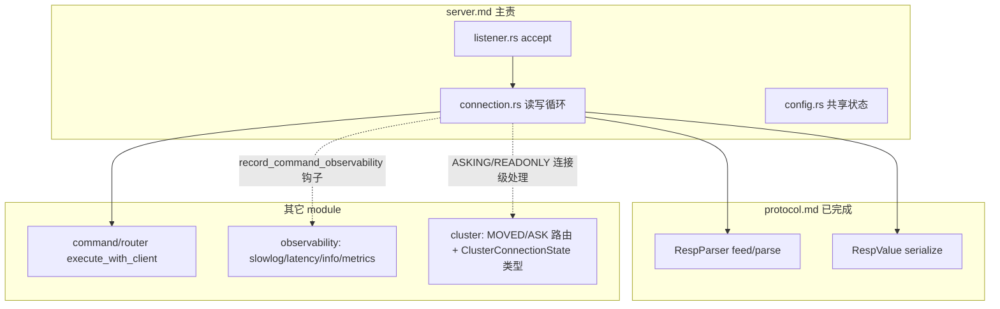
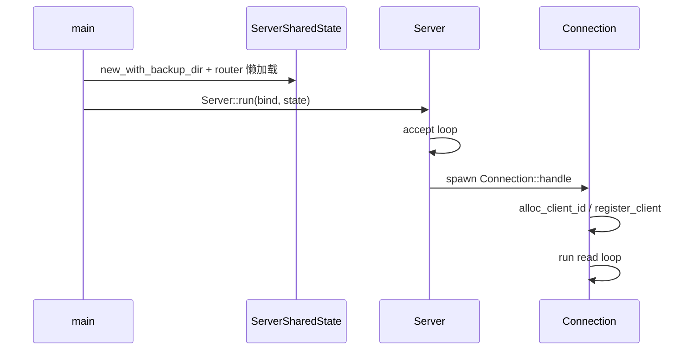
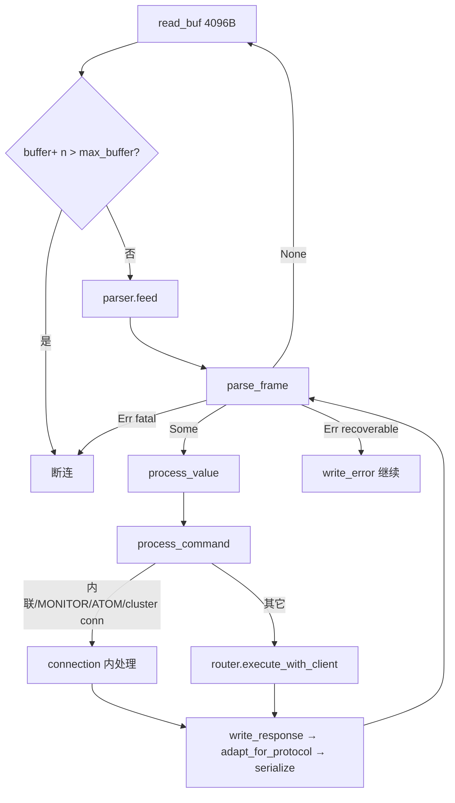
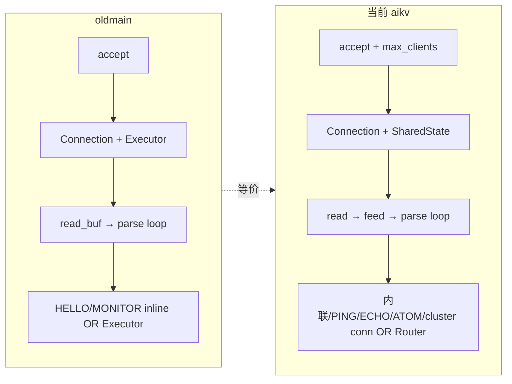
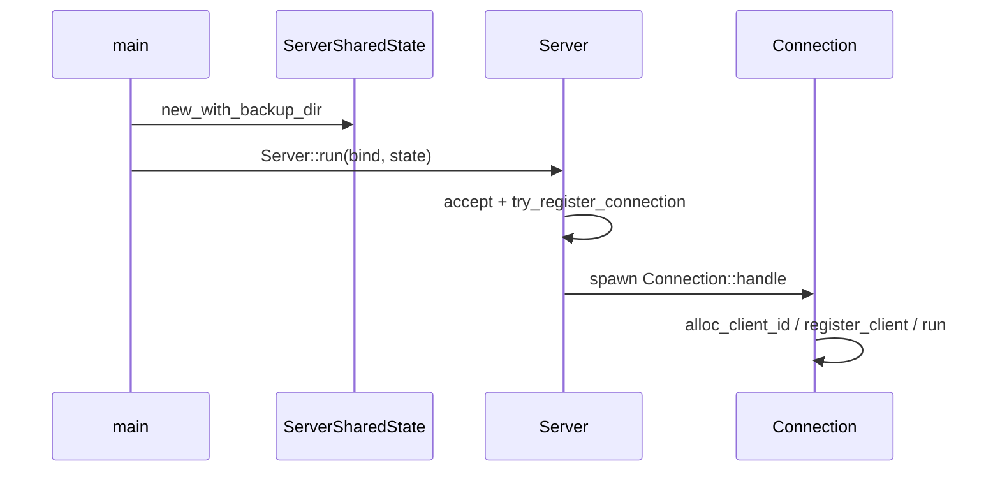
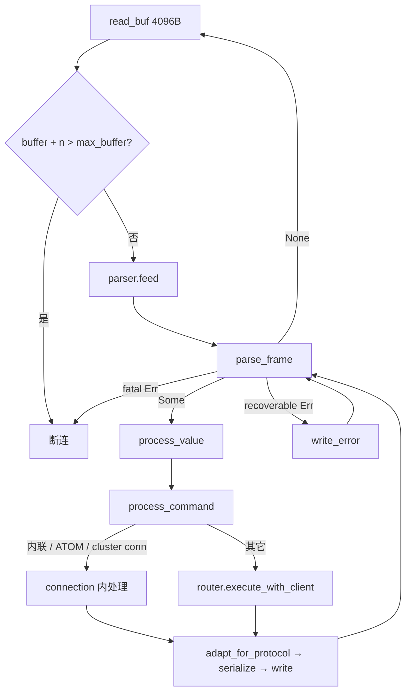

# Cursor transcript

---

## 1. User

## 文档整理 — 新会话

工作目录: `<workspace>` (含 aidb/、aikv/、aifactory/)

请先阅读 (不要跳过):

1. `AiKv-Workflow/backup/design.md` — 总规程
2. `AiKv-Workflow/backup/PROGRESS.md` — 当前进度
3. `AiKv-Workflow/backup/INDEX.md` — 本章索引 (若已有行则更新)

---

### 本次任务

| 项 | 值 |
|----|-----|
| PROGRESS 总步 | 4 |
| 目标文件 | `aikv/docs/modules/server.md` |
| 本次子步 | 从步 0 开始 |
| 对比深度 | 模块级 (默认) |

### 必须遵守

- **确认门控**: 步 0→1→2→3→4, 每步先讨论, 我确认后再下一步
- **步 4**: 先出 Module Skill 正文 **草稿**, 我确认后再写入 aidb/aikv、更新 INDEX/PROGRESS
- **Module Skill 基础模板**: frontmatter `name` + `description` (含 `Use when`); 见 `design.md`
- **过程只进 backup/**: INDEX; aidb/aikv 不写迁移历史
- **旧文档顺序**: `backup/{aidb,aikv}/` → `*-oldmain` → WiQunTools 查漏 → wiqun-*
- **待核实**: module 一行引用; 详情写入 **当前仓库** 根目录 `ISSUES.md` (`aikv/ISSUES.md`)
- **步 4 落盘前**: 对照 create-skill Summary Checklist 自检 (见 `design.md`)

### 上下文 (上一章已完成)

- 步 3 ✅ [`aikv/docs/modules/protocol.md`](aikv/docs/modules/protocol.md) — `RespParser` / `RespValue` / `ProtocolVersion` (默认 Resp3)
- 本章依赖 protocol; 边界: pipeline 循环、HELLO 协商、`adapt_for_protocol` 归 server, 不归 protocol

### 本次不要

- 不要跳过未确认的步骤
- 不要一次写多篇 module
- 不要修改 `design.md` / 流程, 除非我明确要求
- 不要 commit, 除非我明确要求

---

请从步 0 开始, 给出本步交付物, 等我确认。

---

## 2. Assistant

正在阅读规程、进度与索引，随后给出步 0 交付物。

---

## 3. Assistant

正在对照 `design.md` 的 modules↔src 表，梳理 `aikv/src/server/` 的实际目录与入口。

---

## 4. Assistant

## 步 0 — 定范围

**章节**: PROGRESS 步 4 · `aikv/docs/modules/server.md`  
**对照**: `design.md` modules↔src 表 — `server/*` → Listener/Connection、读写循环、与 CommandRouter 衔接

---

### 1. 本章核心范围 (`server/*` 主责)

按 `design.md` 划分, 本章 **主写** 以下 4 个文件 (约 1,596 行):

| 路径 | 行数 | 职责 | 入口 |
|------|------|------|------|
| `server/mod.rs` | 23 | 模块根; re-export | `Server`, `Connection`, `ServerSharedState` |
| `server/listener.rs` | 55 | TCP accept 循环; `max_clients` 拒绝; shutdown | `Server::run`, `run_with_listener` |
| `server/connection.rs` | 1,209 | 单连接读写循环; pipeline; 命令分发; HELLO; 响应编码 | `Connection::handle`, `run`, `process_value`, `adapt_for_protocol` |
| `server/config.rs` | 319 | 连接/服务共享状态; 客户端注册; Router 懒加载 | `ConnectionConfig`, `ServerSharedState` |

**程序入口 (关联, 非本章正文主体)**:

| 路径 | 说明 |
|------|------|
| `src/main.rs` (~L621–699) | 构造 `ConnectionConfig` / `ServerSharedState`, 可选 `MetricsServer`, `Server::run` |
| `src/lib.rs` | `pub mod server`; re-export |

---

### 2. 本章边界 (含上一章 protocol 衔接)



| 主题 | 归属 | 说明 |
|------|------|------|
| `RespParser` / `RespValue` 编解码 | **protocol.md** ✅ | 已完成 |
| **Pipeline 内层循环** (`feed` → `parse` → 处理, 直到 `Ok(None)`) | **server.md** | `connection::run` L145–165 |
| **HELLO 协商** + `protocol_negotiated` 标志 | **server.md** | `cmd_hello`, `hello_map` |
| **`adapt_for_protocol`** (RESP3 null 线格式 `_` vs `$-1`) | **server.md** | 仅在 HELLO 协商后生效 |
| **`is_fatal_protocol`** vs recoverable → 写 ERR / 断连 | **server.md** | 与 protocol 的 recoverable 策略衔接 |
| 顶层 Array 命令形态校验 | **server.md** | `process_value` |
| 连接内联命令 | **server.md** | `PING`, `ECHO`, `HELLO`, `QUIT`, `MONITOR` |
| 原子事务 (ATOM.MULTI/EXEC/…) | **server.md** | `TransactionState`, connection 内实现 |
| `CommandRouter::execute_with_client` | **commands-core.md** | server 只写「如何调用」 |
| INFO/TIME/CONFIG/CLIENT/SLOWLOG/LATENCY 命令实现 | **commands-extended.md** / **observability.md** | `command/server.rs` |
| `ClusterConnectionState` 类型定义 | **cluster.md** | `cluster/connection.rs` |
| 连接级 `ASKING`/`READONLY`/`READWRITE` | **server.md** | `process_command` 内, 不进 Router |
| slowlog / latency / info / metrics 数据结构 | **observability.md** | 物理文件在 `server/*`, 按 design 表归 observability |
| connection 里的 observability **钩子** (`should_track_observability`, `record_command_observability`) | **server.md** 简述 + observability 详述 | 跨章引用即可 |

---

### 3. 同目录但 **不归 server.md 正文** 的文件

`design.md` 明确 observability 覆盖 `server/{slowlog,latency,info,metrics*}`:

| 路径 | 行数 | 归属 module |
|------|------|-------------|
| `server/slowlog.rs` | 171 | observability.md |
| `server/latency.rs` | 249 | observability.md |
| `server/info.rs` | 340 | observability.md |
| `server/metrics.rs` | 804 | observability.md |
| `server/metrics_server.rs` | 123 | observability.md (`monitoring` feature) |
| `server/process_metrics.rs` | 81 | observability.md |

server.md 中仅保留: `ServerSharedState` 持有这些组件 + connection 写入钩子的 **一行引用**.

---

### 4. 步 1 拟读文件列表

**必读 (源码)**:

1. `aikv/src/server/mod.rs`
2. `aikv/src/server/listener.rs`
3. `aikv/src/server/connection.rs` — 全文 (~1,209 行, 本章核心)
4. `aikv/src/server/config.rs`
5. `aikv/src/main.rs` — server 启动段
6. `aikv/src/lib.rs` — 公共 re-export

**边界上下文 (只读关键 API)**:

7. `aikv/src/command/router.rs` — `execute_with_client` 签名与调用约定
8. `aikv/src/cluster/connection.rs` — `ClusterConnectionState` (feature `cluster`)
9. `aikv/docs/modules/protocol.md` — 已写边界, 步 1 对照引用

**测试 (步 1 梳理主流程时跑/读)**:

| 文件 | 覆盖 |
|------|------|
| `tests/modules/server/helpers.rs` | 测试用 `start_server` / TCP 辅助 |
| `tests/modules/server/listen.rs` | Listener 绑定 |
| `tests/modules/server/tcp.rs` | PING/ECHO/HELLO/pipeline/协议错误等 |
| `tests/server.rs` | 集成测试入口 |
| `tests/modules/server/observability.rs` | 跨 observability 边界; 步 1 只读 connection 钩子相关用例 |

**步 2/3 预查旧文档 (步 0 仅列路径, 步 2 再读)**:

- `AiKv-Workflow/backup/aikv/{README,ARCHITECTURE,CHANGELOG,CONTRIBUTING}.md`
- `aikv-oldmain/docs/guide/`, `docs/development/architecture/`
- `WiQunTools/docs/wiqun-kv-inventory/01-resp-tcp.md` (TCP 段查漏)
- `wiqun-kv/src/server/` (oldmain 代码对照, 步 3)

---

### 5. 拟写入 INDEX 的本章行 (确认后落盘)

| 新文档章节 | 状态 | 参考的旧文档 | 处理 | 备注 |
|------------|------|--------------|------|------|
| `docs/modules/server.md` | 步 0 ✅ | (步 2 填) | — | 核心: `listener`, `connection`, `config`; observability 子模块见 observability.md |

---

### 6. Module Skill 预期 frontmatter (步 4 用, 步 0 先定名)

```yaml
name: aikv-server
description: AiKv TCP server — Listener, Connection read loop, pipeline, HELLO negotiation, adapt_for_protocol, CommandRouter dispatch. Use when changing src/server/{listener,connection,config}, debugging connection lifecycle, pipeline, or protocol negotiation on the wire.
```

---

**步 0 交付物**: 拟读文件列表 + 本章边界 (上文).  
**未做**: 未改 INDEX/PROGRESS, 未读旧文档, 未写正文.

请确认边界与拟读列表; 回复「可以」或指出需调整处, 我再进入 **步 1 (读新代码)**.

---

## 5. User

可以

---

## 6. Assistant

步 0 已确认，开始步 1：阅读 `server` 核心源码并梳理职责与主流程。

---

## 7. Assistant

## 步 1 — 读新代码

已阅读 `server/{mod,listener,connection,config}.rs`、`main.rs` 启动段、`router::execute_with_client` 签名, 并跑通 `cargo test --test server -- --test-threads=1` (**33 passed**, 2 ignored 压测).

---

### 职责 (bullet 草稿)

**Listener (`listener.rs`)**
- `Server::run` / `run_with_listener`: 绑定 TCP, `tokio::select!` 在 **shutdown** 与 **accept** 间切换
- 每连接: `try_register_connection()` (`max_clients`) → `tokio::spawn(Connection::handle)` → 断开时 `on_disconnect`
- 超限时直接 `drop(stream)`, 不建连

**Connection (`connection.rs`) — 本章核心**
- **生命周期**: `handle` 分配 `client_id` → `register_client` → `run` → `unregister_client`
- **读循环**: 4096B buf; 可选 `read_timeout` / `idle_timeout`; EOF 或 buffer 超限断连
- **Pipeline**: 单次 read 后内层 `loop { parse_frame → process_value }` 直到 `Ok(None)`
- **协议衔接**: 用 `RespParser::new()`; fatal 错误断连, recoverable 写 `-ERR` 继续
- **命令分发** (`process_command`):
  - 连接内联: `PING` / `ECHO` / `HELLO` / `QUIT` / `MONITOR`
  - 事务: `MULTI|ATOM.MULTI` / `EXEC|ATOM.EXEC` / `DISCARD` / `WATCH` / `UNWATCH` (+ `ATOM.*` 别名)
  - `[cluster]`: `ASKING` / `READONLY` / `READWRITE` 改连接态, 不进 Router
  - 其余 → `CommandRouter::execute_with_client` (带 `current_db`, `client_id`, `protocol_version`, `[cluster] cluster_state`)
- **HELLO**: 可选 arg `2`/`3` 设 `protocol_version` + `protocol_negotiated=true`; 无 arg 仅返回当前版本; 响应用 `hello_map` (Resp3=Map, Resp2=flat Array)
- **响应路径**: `write_response` → `adapt_for_protocol` → `serialize`; 仅 **HELLO 协商 Resp3 后** 才把 `$-1`/`*-1` 递归转为 `_`
- **MONITOR 模式**: `cmd_monitor` 后切 `ConnectionMode::Monitor`; `run_monitor_loop` 用 `select!` 同时读客户端 (仅 QUIT) 与 `monitor_tx` broadcast
- **ATOM 事务**: 连接级 `TransactionState`; WATCH 用 `ServerSharedState.key_versions` 乐观锁; EXEC 冲突返回 null bulk
- **JSON batch EXEC**: 无 MULTI 时 `EXEC <json>` 走 `cmd_atom_exec_json_batch` (DUMP/RESTORE 快照回滚, 非 Redis 标准)
- **Observability 钩子**: 路由命令成功后 `record_command_observability` (latency/slowlog/metrics); 排除 PING/ECHO/HELLO/QUIT/MONITOR/SLOWLOG

**Config / 共享状态 (`config.rs`)**
- `ConnectionConfig`: `read_timeout`(默认 60s), `idle_timeout`(默认 300s), `max_clients`(默认 10000, 0=不限)
- `ServerSharedState`: storage、metrics/slowlog/latency、clients 表、`config_map`、`monitor_tx`、`shutdown`、`key_versions`、Router `OnceLock` 懒初始化
- `try_register_connection`: 连接计数 gate + rejected metrics
- `refresh_runtime_metrics`: uptime/ops/memory/db_key_count/expired keys (main 里 15s 后台 tick, `monitoring` feature)

**main.rs 启动 (关联)**
- 构造 `ConnectionConfig` + `ServerSharedState::new_with_backup_dir`
- `[monitoring]`: 并行 spawn `MetricsServer` + 指标刷新 loop
- `[cluster]`: `init_cluster` 后再 `Server::run`

---

### 代码地图 (草稿)

| 路径 | 职责 | 入口 |
|------|------|------|
| `server/mod.rs` | 模块根; re-export | `Server`, `Connection`, `ServerSharedState`, `InfoRenderer` 等 |
| `server/listener.rs` | Accept 循环 | `Server::run`, `run_with_listener` |
| `server/connection.rs` | 单连接读写、pipeline、分发、HELLO、事务、MONITOR | `Connection::handle`, `run`, `process_value`, `adapt_for_protocol` |
| `server/config.rs` | 连接配置 + 进程级共享状态 | `ConnectionConfig`, `ServerSharedState::new_with_backup_dir`, `router()` |
| `command/router.rs` | 命令执行 (connection 调用方) | `execute_with_client` |
| `cluster/connection.rs` | 连接级 asking/readonly | `ClusterConnectionState` (feature `cluster`) |

**Connection 关键字段**:

| 字段 | 含义 |
|------|------|
| `parser` | 每连接独立 `RespParser` |
| `protocol_version` | 默认 `ProtocolVersion::default()` (Resp3) |
| `protocol_negotiated` | HELLO 后才启用 `adapt_for_protocol` |
| `current_db` | 连接当前 DB 索引, 传给 Router |
| `mode` | `Normal` / `Monitor` |
| `tx_state` | MULTI 队列 + WATCH 版本快照 |
| `[cluster] cluster_state` | ASKING/READONLY 标志 |

---

### 主流程要点

**1. 进程启动 → 首包**



**2. 单连接读-解析-处理 (pipeline)**



**3. HELLO 与线格式**

- 默认 `protocol_version = Resp3`, 但 **`protocol_negotiated = false`**
- 未协商前: Router 返回的 `$-1`/`*-1` **原样** 发出 (兼容 RESP2 客户端)
- `HELLO 3` 后: `adapt_for_protocol` 递归把 null bulk/array 转为 `RespValue::Null` (`_`)

**4. fatal vs recoverable**

| 类型 | 判定 | 行为 |
|------|------|------|
| fatal | `Error::Protocol` 且 msg 含 `depth`/`too large`/`buffer size`/`line too long` | 断连 |
| recoverable | 其它 `Protocol` 错误 | `write_error`, 继续读 |
| 非 Array 命令 | `process_value` | `-ERR Protocol error: expected array` |

**5. 与相邻 module 衔接**

| 方向 | 接口 |
|------|------|
| ← protocol | `RespParser`, `RespValue`, `ProtocolVersion` |
| → commands-core | `router().execute_with_client(cmd, args, &mut db, client_id, proto, [cluster_state])` |
| → cluster | 连接级 ASKING/READONLY; Router 内 MOVED/ASK (cluster.md) |
| → observability | `record_command_observability`; 数据结构见 observability.md |

---

### 测试覆盖 (步 1 已验证)

```bash
cargo test --test server -- --test-threads=1
# 33 passed; 2 ignored (slow send / large pipeline stress)
```

| 测试文件 | 与本章关系 |
|----------|-----------|
| `tests/modules/server/tcp.rs` | PING/ECHO/HELLO/pipeline/MONITOR/路由命令端到端 |
| `tests/modules/server/listen.rs` | accept 基本路径 |
| `tests/modules/server/helpers.rs` | `start_server` = `ServerSharedState::new` + `run_with_listener` |
| `tests/modules/server/observability.rs` | 连接 metrics / maxclients / net bytes (跨 observability 边界) |
| `connection.rs` 内 `mod tests` | `hello_map` 格式、JSON batch、duplicate keys |

---

### 步 1 结论摘要

- **server 层 = TCP 接入 + 单连接状态机 + 协议/路由边界**, 不含 RESP 帧语法细节 (protocol) 与具体命令实现 (commands-*)
- **`connection.rs` (~1210 行) 承载绝大部分逻辑**, 含非标准扩展 (ATOM 事务、JSON batch EXEC)
- **默认 Resp3 但线格式保守**: 只有 HELLO 协商后才发 RESP3 null
- **Router 懒初始化**: 首条路由命令时才 `CommandRouter::new_with_shared`

---

**步 1 交付物**: 上文职责 / 代码地图 / 主流程要点.  
**未做**: 未查旧文档 (步 2), 未写 INDEX/PROGRESS/正文.

请确认; 回复「可以」后进入 **步 2 (查旧文档)**.

---

## 8. User

可以

---

## 9. Assistant

步 1 已确认，开始步 2：按规程顺序查阅 server 相关旧文档。

---

## 10. Assistant

## 步 2 — 查旧文档

已按顺序查阅: `backup/aikv/` → `aikv-oldmain` → WiQunTools inventory → `wiqun-kv` (结构与当前 aikv 基本一致, 与 2 重叠, 仅作查漏).

---

### 旧文档清单与分类

| # | 来源路径 | 分类 | 处理建议 |
|---|----------|------|----------|
| 1 | `WiQunTools/docs/wiqun-kv-inventory/01-resp-tcp.md` | **部分仍有效 / 部分已过时** | TCP 读循环、pipeline、内联命令、timeout/buffer 防护 → 仍有效; **默认 RESP2**、Phase 8 最小 Connection 字段、无 `max_clients`/`ATOM`/`adapt_for_protocol` → 已过时, 以当前代码为准 |
| 2 | `AiKv-Workflow/backup/aikv/ARCHITECTURE.md` | **已过时** | 目录名错误 (`monitor.rs`, `server_cmd.rs`, `value.rs`, `connection_state.rs`); 数据流主路径仍可用作查漏 |
| 3 | `AiKv-Workflow/backup/aikv/DESIGN.md` §协议 | **仍有效** | Pipeline、HELLO 协商、async 读循环 — 与现实现一致 |
| 4 | `AiKv-Workflow/backup/aikv/CHANGELOG.md` | **仍有效** | MONITOR、`max_clients`、cluster ASKING/READONLY、observability 钩子、ATOM JSON batch 回滚 — 与现 `connection.rs` 一致 |
| 5 | `AiKv-Workflow/backup/aikv/README.md` | **仍有效 (高层)** | Client→TCP→Parser→Router 架构图; 细节见 modules |
| 6 | `AiKv-Workflow/backup/aikv/CONTRIBUTING.md` | **仍有效** | `cargo test --test server`; stress 用 `#[ignore]` |
| 7 | `backup/aikv/docs/superpowers/specs/2026-06-10-redis-observability-alignment-design.md` | **已过时 (结构)** / **仍有效 (语义)** | 提议 `server/observability.rs` 未落地; INFO/metrics 字段对齐思路已实现于 `info.rs`/`metrics.rs` → 归 **observability.md** |
| 8 | `aikv-oldmain/docs/development/architecture/01-overview.md` | **已过时** | 旧目录 (`StorageBackend`, `command/server.rs` 平铺); MONITOR 用 `MonitorBroadcaster` + mpsc — 现改为 `broadcast::Sender<String>` |
| 9 | `aikv-oldmain/docs/development/architecture/01-overview.md` §MONITOR | **设计偏离 (文档)** | oldmain 独立 `server/monitor.rs` + 注册/注销 monitor 客户端; 当前内嵌 `connection.rs`, 无 monitor 计数 API |
| 10 | `aikv-oldmain/src/server/` (3 文件) | **设计偏离 (代码)** | `ProtocolVersion` 在 connection 内、**默认 Resp2**; 无 `protocol_negotiated`/`adapt_for_protocol`/ATOM/JSON batch; Server 单体 struct 非 `ServerSharedState` |
| 11 | `WiQunTools/docs/wiqun-kv-inventory.md` §TCP/Connection | **仍有效 (查漏)** | PING/ECHO/HELLO/QUIT、Connection 集群态、HELLO mode/role — 已实现 |
| 12 | `WiQunTools/docs/wiqun-feature-gap-report.md` §Atom | **仍有效** | ATOM.* 为 AiKv 扩展命名空间, 非 Redis 标准 MULTI 别名文档 — server.md 应写明 |
| 13 | `aikv/docs/modules/protocol.md` (上一章) | **仍有效** | 默认 Resp3 + `protocol_negotiated` 门控、`adapt_for_protocol` 归 server — 本章承接 |
| 14 | `wiqun-kv/src/server/connection.rs` | **与当前基本一致** | 步 3 模块级对照即可, 步 2 不重复读 |

---

### 分类汇总

**仍有效 (可提炼进 server.md)**

- TCP accept → per-connection spawn; shutdown via `CancellationToken`
- 读循环: read → feed → parse 内层 loop (pipeline)
- 内联命令: PING / ECHO / HELLO (2/3/无参) / QUIT / MONITOR
- `ConnectionConfig`: read_timeout (60s) / idle_timeout (300s)
- Buffer 超限断连; fatal vs recoverable 协议错误策略
- HELLO 无参: 返回 server info, **不切换** `protocol_version`
- MONITOR: OK 后进入 monitor 模式, `select!` 读 QUIT + 收广播
- tracing spans: `kv_connection`, `kv_read`, `kv_parse`, `kv_write`, `kv_encode`
- 路由命令 observability 钩子 (排除 PING/ECHO/HELLO/QUIT/MONITOR/SLOWLOG)

**已过时 (不迁入正文, 仅 backup 参考)**

- WiQunTools「默认 RESP2」→ 现 **默认 Resp3** (protocol 章已确认)
- backup ARCHITECTURE 文件/目录树 (monitor.rs, server_cmd.rs 等)
- oldmain 架构总览中的模块划分与 `StorageBackend` API
- superpowers observability 设计中的 `server/observability.rs` 单文件方案

**设计偏离 (当前实现 vs 旧文档/旧代码, 文档应说明)**

| 偏离点 | 旧 | 新 | 文档写法 |
|--------|----|----|----------|
| 协议版本默认 | oldmain/WiQunTools: Resp2 | Resp3 + `protocol_negotiated` 门控 | 引用 protocol.md; 强调线格式保守策略 |
| null 线格式 | 直接 serialize | HELLO 3 后 `adapt_for_protocol` | server.md 专节 |
| MONITOR 实现 | `MonitorBroadcaster` 独立模块 + 注册表 | `ServerSharedState.monitor_tx` broadcast | 简述现机制, 不展开 oldmain |
| Server 结构 | oldmain `Server` 聚合一切 | `Server` 仅 listener + `ServerSharedState` | 代码地图 |
| 事务 | oldmain 无 ATOM | 连接级 MULTI/EXEC/WATCH + `ATOM.*` 别名 + JSON batch EXEC | 「已知扩展」节 |
| max_clients | Phase 8 spec 无 | `ConnectionConfig.max_clients` + `try_register_connection` | 配置表 |
| 集群连接命令 | spec: READONLY stub | ASKING/READONLY/READWRITE 在 connection | 一句 + 链 cluster.md |

**待核实 → 拟写 ISSUES**

步 2 结论: **暂无必须写入 `aikv/ISSUES.md` 的 open 条目**.

- 上述偏离均为 **有意设计或文档结构变化**, 非阻塞 bug
- 默认 Resp3 / `protocol_negotiated` 已在 protocol 章记录, server 章交叉引用即可
- ATOM / JSON batch EXEC 为 **AiKv 扩展**, 写入 server.md「已知限制」, 不进 ISSUES

若你希望在 ISSUES 中跟踪「ATOM 与 Redis MULTI 语义差异需对外说明」, 可步 3 后再定; 当前建议 **不新增 ISSUE**.

---

### 拟更新 INDEX 行 (确认后落盘)

| 新文档章节 | 状态 | 参考的旧文档 | 处理 | 备注 |
|------------|------|--------------|------|------|
| `docs/modules/server.md` | 步 2 ✅ | backup/aikv ARCHITECTURE,DESIGN,CHANGELOG; WiQunTools 01-resp-tcp; aikv-oldmain architecture/01-overview + src/server; wiqun-kv src/server (查漏) | 步 4 后写正文 | 核心 listener/connection/config; observability 子模块见 observability.md |

---

### 步 2 对步 4 写作的提示

1. **以当前 `connection.rs` 为准**, 不整篇回迁 WiQunTools Phase 8 spec
2. **明确三章边界**: protocol (帧) / server (连接态+循环) / commands-* (命令体)
3. **专写**: pipeline 内层 loop、HELLO+`protocol_negotiated`、`adapt_for_protocol`、`is_fatal_protocol`
4. **MONITOR / ATOM / JSON batch**: 各一小节, 标注 AiKv 扩展
5. **observability 文件** (`slowlog/latency/info/metrics*`) 仅一行指向 observability.md
6. **待核实**: 「无.」 (除非步 3 发现需 ISSUE 的点)

---

**步 2 交付物**: 旧文档清单 + 分类 + 拟 ISSUES (暂无).  
**未做**: 未改 INDEX/PROGRESS/ISSUES/正文.

请确认; 回复「可以」后进入 **步 3 (对比 oldmain / wiqun-kv 旧代码, 模块级)**.

---

## 11. User

可以

---

## 12. Assistant

步 2 已确认，开始步 3：模块级对照 oldmain 与 wiqun-kv 的 server 实现。

---

## 13. Assistant

## 步 3 — 对比旧代码 (模块级)

对照 **`aikv-oldmain/src/server/`** (3 文件) 与 **`wiqun-kv/src/server/`** (10 文件, 与当前 aikv 同构).  
结论: **主流程等价**, 分层与若干连接语义有演进; **aikv ≈ wiqun-kv** (仅命名/格式差异).

---

### 路径对照

| 维度 | aikv-oldmain | wiqun-kv / 当前 aikv |
|------|--------------|----------------------|
| 模块布局 | `mod.rs` + `connection.rs` + `monitor.rs` | `mod.rs` + `listener.rs` + `connection.rs` + `config.rs` + observability 子模块 |
| TCP accept | `Server::run` 内嵌 accept + spawn | `listener.rs::Server::run` + `ServerSharedState` |
| 连接入口 | `Connection::new(stream, executor, …)` | `Connection::handle(stream, remote, state)` |
| 命令执行 | 每连接 `CommandExecutor::with_shared` | 共享 `ServerSharedState::router()` (`OnceLock<CommandRouter>`) |
| 协议类型 | `connection::ProtocolVersion` | `protocol::ProtocolVersion` |
| MONITOR | `MonitorBroadcaster` 独立模块 | `ServerSharedState.monitor_tx` (`broadcast::Sender<String>`) |
| 集群连接态 | `allow_importing_slot_once` / `readonly_mode` 字段 | `cluster::connection::ClusterConnectionState` |

---

### 模块级差异表

| # | 主题 | oldmain | 当前 aikv | 主流程等价? | 文档建议 |
|---|------|---------|-----------|-------------|----------|
| 1 | **分层** | `Server` 单体 (~585 行 mod.rs 含集群 bootstrap) | `listener` + `config` + `main` 集群 init | 是 (职责迁移) | 代码地图写清三文件; 集群 init 链 `main.rs` |
| 2 | **读路径** | `read_buf(parser.buffer_mut())` 直写 parser | 4096B 栈 buf → `parser.feed` | 是 | 写 feed 模式; 提 buffer 超限检查在 feed 前 |
| 3 | **Pipeline** | `while let Some(v) = parser.parse()?` | 内层 `loop { parse_frame → process }` | 是 | 保留 mermaid; 链 protocol.md |
| 4 | **PING/ECHO** | `CommandExecutor` (command 层) | `connection` 内联 | 是 (边界移动) | 列内联命令表; 不写 command 实现 |
| 5 | **HELLO 无参** | 报错 `wrong number of arguments` | 允许; 只返回 info, 不改版本 | **否** (Redis 7 对齐) | 专节说明; 交叉 protocol 默认 Resp3 |
| 6 | **HELLO 响应** | Resp3 Map 用 `SimpleString` key; 硬编码 version | Map key 全 `BulkString`; `CARGO_PKG_VERSION`; 含 id/mode/role | 部分 | 写 Redis 7 对齐 + `[cluster]` 动态 mode/role |
| 7 | **默认协议** | Resp2 | Resp3 + `protocol_negotiated=false` | **否** (有意) | 引用 protocol.md; 强调线格式门控 |
| 8 | **`adapt_for_protocol`** | 无; 直接 `serialize()` | HELLO 3 后 null→`_` 递归转换 | **否** (新能力) | server 专节 (redis-py 兼容) |
| 9 | **fatal 协议错误** | parse `?` 传播, 无显式 fatal 分类 | `is_fatal_protocol` → 断连 vs 写 ERR | 增强 | 表格对照 protocol recoverable |
| 10 | **连接超时** | 无 `ConnectionConfig` | read 60s / idle 300s / 可 None (测试) | 增强 | 配置表 + tests/helpers 用法 |
| 11 | **max_clients** | 无 | `try_register_connection` + rejected metrics | 增强 | 一句 + observability 指标 |
| 12 | **graceful shutdown** | 无 | `CancellationToken` in select! | 增强 | listener 节简述 |
| 13 | **MONITOR** | `MonitorBroadcaster` 注册/注销; monitor 模式支持 **QUIT+RESET** | broadcast 字符串; monitor 仅 **QUIT** | 部分 | 写现机制; 「已知限制」提无 RESET |
| 14 | **MONITOR 排除** | DEBUG/SYNC/PSYNC/MONITOR | `should_track_observability` 排除 SLOWLOG 等 | 不同 | 不展开 oldmain 列表 |
| 15 | **事务** | 无 | ATOM.MULTI/EXEC/WATCH + JSON batch EXEC | **扩展** | 「AiKv 扩展」专节 |
| 16 | **集群连接命令** | ASKING/READONLY/READWRITE inline; **CLUSTER 管理子命令** 在 connection | ASKING/READONLY/READWRITE inline; CLUSTER 全走 Router | 是 (路由下沉) | 连接级 3 命令 + 链 cluster.md |
| 17 | **Observability 钩子** | connection 内嵌 metrics 记录 | `record_command_observability` → slowlog/latency/metrics | 是 | 一句 + observability.md |
| 18 | **write_response** | `serialize` + **`flush()`** | `adapt_for_protocol` + `serialize`, 无 flush | 细微 | 可不写 flush 细节 (实现差异) |
| 19 | **process_command 签名** | 返回 `RespValue`, 外层 write | 内部 `write_response`, 返回 `Result<()>` | 是 | 数据流按现代码 |
| 20 | **wiqun-kv vs aikv** | — | connection/listener/config **逻辑同构** | 是 | 以 aikv 为准; 不提 wiqun 命名 |

---

### 主流程等价性



**仍成立**: 每连接一 task; pipeline 在同一 buffer 上循环 parse; 内联 vs 路由二分; MONITOR 广播 + select 读客户端.

**演进 (文档必须写)**: 共享状态聚合、`adapt_for_protocol`、HELLO 语义、ATOM 事务、超时/max_clients/shutdown.

---

### 拟写 ISSUES (步 3 结论)

**仍建议: 暂不新增 `aikv/ISSUES.md` 条目.**

| 候选点 | 判定 | 理由 |
|--------|------|------|
| 默认 Resp3 / `protocol_negotiated` | doc-only | protocol 章已记; server 交叉引用 |
| MONITOR 无 RESET | doc-only | 写「已知限制」即可 |
| HELLO 无参 vs oldmain | doc-only | Redis 7 对齐, 有测试 |
| `write_response` 无 flush | 不记 | tokio 缓冲行为, 非用户可见 bug |
| ATOM / JSON batch | doc-only | AiKv 扩展, CHANGELOG 有记录 |

---

### 拟更新 INDEX (步 3 确认后)

| 新文档章节 | 状态 | 参考的旧文档 | 处理 | 备注 |
|------------|------|--------------|------|------|
| `docs/modules/server.md` | 步 3 ✅ | 同上步 2 + oldmain `src/server/*` 模块对照 | 步 4 写正文 | oldmain→listener+config+connection 重构; wiqun-kv 同构 |

---

### 步 4 正文结构建议 (基于步 1–3)

1. frontmatter `aikv-server` (步 0 已定)
2. **何时读本文** — 含与 protocol / commands-core / cluster / observability 边界
3. **代码地图** — listener / connection / config + main 启动
4. **关键 invariant** — pipeline 单帧、fatal 断连、HELLO 门控、MONITOR 模式切换
5. **数据流** — accept + 读-parse-写 mermaid
6. **关键类型与 API** — `ConnectionConfig`, `ServerSharedState`, `Connection::handle`
7. **专节**: HELLO + `adapt_for_protocol`; 内联命令; ATOM 事务; `[cluster]` 连接命令; observability 钩子 (一行外链)
8. **配置与 feature flags** — timeout, max_clients, cluster, monitoring
9. **测试** — `cargo test --test server -- --test-threads=1`
10. **已知限制** — ATOM/JSON batch 扩展; MONITOR 无 RESET; 无内联 `PING\r\n`
11. **待核实** — 无

---

**步 3 交付物**: 差异表 + 文档表述建议 + 拟 ISSUES (无).  
**未做**: 未写 INDEX/PROGRESS/正文.

请确认; 回复「可以」后进入 **步 4** — 先出 Module Skill **正文草稿** 供讨论, 确认后再落盘 aidb/aikv 并更新 INDEX/PROGRESS.

---

## 14. User

可以

---

## 15. Assistant

步 3 已确认。正在对照 `protocol.md` 与 create-skill 清单，起草步 4 的 Module Skill 正文草稿。

---

## 16. Assistant

## 步 4 — Module Skill 正文草稿

以下为 `aikv/docs/modules/server.md` **草稿**, 尚未落盘. 请审阅后回复「可以」或调整意见.

---

```markdown
---
name: aikv-server
description: AiKv TCP server — Listener accept loop, Connection read/pipeline loop, HELLO negotiation, adapt_for_protocol, CommandRouter dispatch, ATOM transaction. Use when changing src/server/{listener,connection,config}, debugging connection lifecycle, pipeline, protocol negotiation on the wire, or max_clients/shutdown.
---

# AiKv Server (TCP 连接层)

## 何时读本文

- 改 `server/{listener,connection,config}` 或 TCP 读写循环、pipeline、连接级命令分发
- 排查 HELLO 协商、`protocol_negotiated` 门控、响应 null 线格式 (`$-1` vs `_`)、fatal 协议断连
- 排查 MONITOR 模式、ATOM 事务 (MULTI/EXEC/WATCH)、`max_clients` 拒绝连接
- **不覆盖**: RESP 帧语法 / parser limits → [protocol.md](protocol.md); 命令实现 → [commands-core.md](commands-core.md) / [commands-extended.md](commands-extended.md); MOVED/ASK 路由 → [cluster.md](cluster.md); slowlog/latency/INFO/metrics 数据结构 → [observability.md](observability.md)

## 代码地图

| 路径 | 职责 | 入口 |
|------|------|------|
| `server/mod.rs` | 模块根; re-export | `Server`, `Connection`, `ServerSharedState`, `ConnectionConfig` |
| `server/listener.rs` | TCP accept; shutdown; max_clients gate | `Server::run`, `run_with_listener` |
| `server/connection.rs` | 单连接读写、pipeline、分发、HELLO、响应编码、ATOM/MONITOR | `Connection::handle`, `run`, `process_value`, `adapt_for_protocol` |
| `server/config.rs` | 连接配置 + 进程共享状态 | `ConnectionConfig`, `ServerSharedState::new_with_backup_dir`, `router()` |
| `main.rs` (~L621–699) | 构造 `ServerSharedState`; 可选 Metrics 后台任务; `Server::run` | 非 server 模块正文, 启动关联 |

同目录 **不归本文正文**: `slowlog.rs`, `latency.rs`, `info.rs`, `metrics.rs`, `metrics_server.rs`, `process_metrics.rs` → [observability.md](observability.md).

公共 re-export (`lib.rs`): `pub mod server`; `Server`, `Connection`, `ServerSharedState` 等.

## 关键 invariant (勿破坏)

- **每连接一 task**: accept 后 `tokio::spawn(Connection::handle)`; 连接状态 (`current_db`, `parser`, `tx_state`) 不跨连接共享.
- **Pipeline 内层循环**: 单次 `read` 后 `feed`, 然后 `loop { parse_frame → process_value }` 直到 `Ok(None)`; 与 [protocol.md](protocol.md) 单帧语义一致.
- **Buffer 超限断连**: `parser.buffer_len() + n > max_buffer_size()` 时直接 break, 不写 ERR.
- **Fatal vs recoverable**: `is_fatal_protocol` (depth / too large / buffer size / line too long) → 断连; 其它 `Protocol` → `write_error` 后继续.
- **命令请求形态**: 顶层须为 `Array`; 命令名与参数须为 `BulkString` (`process_value` 校验).
- **HELLO 门控线格式**: 默认 `ProtocolVersion::Resp3`, 但 `protocol_negotiated = false` 直到客户端发 `HELLO 2|3`; 仅协商 Resp3 后 `adapt_for_protocol` 才把 `$-1`/`*-1` 转为 `_`.
- **Router 懒加载**: `ServerSharedState::router()` 用 `OnceLock` 首次调用时建 `CommandRouter`.
- **Observability 钩子**: 经 Router 的命令 (非内联列表) 成功后写 latency/slowlog/metrics; 详情见 [observability.md](observability.md).

## 数据流

### 进程启动 → 首连接



### 单连接读-解析-写 (pipeline)



## 关键类型与 API

### `ConnectionConfig`

```rust
pub struct ConnectionConfig {
    pub read_timeout: Option<Duration>,   // 默认 Some(60s)
    pub idle_timeout: Option<Duration>,  // 默认 Some(300s)
    pub max_clients: usize,               // 默认 10000; 0 = 不限制
}
```

测试 helpers 常设 timeout 为 `None` (`tests/modules/server/helpers.rs`).

### `ServerSharedState`

进程级 `Arc` 共享: `storage`, `metrics`, `slow_query_log`, `latency_stats`, `config_map`, `clients`, `monitor_tx`, `shutdown`, `key_versions` (WATCH), `router` (`OnceLock`).

| 方法 | 用途 |
|------|------|
| `router()` | 懒初始化 `CommandRouter` |
| `try_register_connection()` | max_clients 检查; 拒绝时 `on_rejected_connection` |
| `alloc_client_id` / `register_client` / `unregister_client` | CLIENT LIST 数据源 |
| `increment_key_version` / `get_key_version` | ATOM WATCH 冲突检测 |
| `refresh_runtime_metrics()` | `[monitoring]` 后台 15s tick |

### `Connection`

每连接持有: `RespParser`, `protocol_version`, `protocol_negotiated`, `current_db`, `client_id`, `mode` (Normal/Monitor), `tx_state`, `[cluster] cluster_state`.

入口:

```rust
Connection::handle(stream, remote, state: Arc<ServerSharedState>).await
// 内部: run() → process_value → process_command
```

### `CommandRouter::execute_with_client` (调用方视角)

```rust
router().execute_with_client(
    cmd, args,
    &mut self.current_db,
    Some(self.client_id),
    self.protocol_version,
    #[cfg(feature = "cluster")] Some(&self.cluster_state),
).await
```

集群 MOVED/ASK/CROSSSLOT 在 Router 内; 连接级 ASKING/READONLY/READWRITE 在 `process_command` 内.

## 连接内联命令

| 命令 | 处理位置 | 备注 |
|------|----------|------|
| `PING` | `cmd_ping` | 无参 → `+PONG`; 一参 → bulk 回显 |
| `ECHO` | `cmd_echo` | 恰好一参 |
| `HELLO` | `cmd_hello` | 见下节 |
| `QUIT` | `cmd_quit` | `+OK` 后 `quit = true` |
| `MONITOR` | `cmd_monitor` | `+OK` 后进入 Monitor 模式 |
| `MULTI` / `ATOM.MULTI` 等 | ATOM 事务 | 见下节 |
| `[cluster] ASKING` / `READONLY` / `READWRITE` | `process_command` | 改 `ClusterConnectionState`; 不进 Router |

其余命令 → Router. `SHUTDOWN` 成功后 connection 设 `quit = true`.

## HELLO 与 `adapt_for_protocol`

### HELLO 语义

| 客户端 | 行为 |
|--------|------|
| `HELLO` (无参) | 返回 `hello_map`; **不**改 `protocol_version`; **不**设 `protocol_negotiated` |
| `HELLO 2` / `HELLO 3` | 设置版本 + `protocol_negotiated = true`; 返回 `hello_map` |
| 非法版本 | `-ERR invalid protocol version` |

`hello_map`: Resp3 → `Map` (key 均为 BulkString, `proto`/`id` 为 Integer); Resp2 → flat `Array`. 含 `server`, `version`, `proto`, `id`, `mode`, `role`; `[cluster]` 时 mode/role 读集群状态.

### `adapt_for_protocol`

仅在 `protocol_negotiated && protocol_version == Resp3` 时:

- `BulkString(None)` / `Array(None)` → `Null` (`_`)
- 递归处理 `Array`, `Map`, `Set`, `Push`, `Attribute`

未协商的 Resp3 默认连接仍发 `$-1`/`*-1`, 避免破坏 RESP2 客户端 (及 redis-py RESP3 解析兼容).

编码路径: `write_response` → `encode` → `adapt_for_protocol(value).serialize()`.

## ATOM 事务 (AiKv 扩展)

连接级 `TransactionState`: `in_multi`, `tx_queue`, `watched_keys`.

| 命令 | 行为 |
|------|------|
| `MULTI` / `ATOM.MULTI` | 进入 multi; 清空队列 |
| 非事务命令 (multi 中) | 入队, 回复 `+QUEUED` |
| `EXEC` / `ATOM.EXEC` (multi 中) | WATCH 冲突 → null bulk; 否则顺序 `execute_with_client`, 返回 Array |
| `EXEC` + JSON arg (无 multi) | `cmd_atom_exec_json_batch`: DUMP/RESTORE 快照回滚; **非 Redis 标准** |
| `WATCH` / `UNWATCH` | 记录/清除 key 版本 (`ServerSharedState.key_versions`) |
| `DISCARD` | 重置事务状态 |

写命令成功后 `track_command_keys` 递增 key 版本.

## MONITOR 模式

1. `MONITOR` → `+OK`, `mode = Monitor`, 订阅 `state.monitor_tx`
2. `run_monitor_loop`: `select!` 读客户端 (仅处理 `QUIT`) + 收 broadcast 行写 socket
3. 正常模式下 `broadcast_monitor` 向 `monitor_tx` 发送 `"timestamp [db N] \"CMD\" \"arg\"...\r\n"` (MONITOR 命令本身不广播)

Monitor 模式 **不支持 RESET** (oldmain 有; 当前仅 QUIT).

## 常见任务

### 调试 pipeline 无响应

1. 确认客户端一次 send 多帧或 TCP_NODELAY
2. 在 connection 看 `parse_frame`: `Ok(None)` 表示等更多数据
3. 查 buffer 是否触顶 `max_buffer_size` 导致静默断连
4. 参考 `tests/modules/server/tcp.rs::test_tcp_pipeline`

### 调试 HELLO / null 线格式

1. 未发 `HELLO 3` 时 GET 缺失 key 应见 `$-1`, 不是 `_`
2. `HELLO 3` 后同场景应见 `_\r\n`
3. 参考 `test_tcp_hello_resp3`, `test_tcp_hello_version_switch_in_pipeline`

### 调试 max_clients 拒绝

1. `ConnectionConfig.max_clients` + `main --max-clients`
2. 超限: listener drop stream, `on_rejected_connection`
3. 参考 `tests/modules/server/observability.rs::test_maxclients_rejection_metrics`

### 新增连接级命令 (不进 Router)

1. 在 `process_command` match 加分支 (或 ATOM 相关)
2. 若需改连接态, 勿经 Router
3. 在 `tests/modules/server/tcp.rs` 加集成测试

### 修改 observability 记录范围

1. 改 `should_track_observability` 排除列表
2. 数据结构 / SLOWLOG 命令 → [observability.md](observability.md)

## 配置与 feature flags

| 项 | 位置 | 说明 |
| --- | --- | --- |
| `read_timeout` / `idle_timeout` | `ConnectionConfig` | CLI 未单独暴露; main 用 `Default` |
| `max_clients` | `ConnectionConfig` + CLI `--max-clients` | 0 = 不限 |
| `shutdown` | `ServerSharedState.shutdown` | `CancellationToken`; listener select 退出 |
| `feature = "cluster"` | `connection.rs` | `cluster_state`; ASKING/READONLY/READWRITE; HELLO mode/role |
| `feature = "monitoring"` | `main.rs` | Metrics HTTP + `refresh_runtime_metrics` 后台任务 (非 listener 本体) |

## 测试

```bash
cargo test --test server -- --test-threads=1
# 33 passed; 2 ignored (slow send / large pipeline stress)

cargo test --test server -- --ignored --test-threads=1   # 可选压测
```

| 文件 | 覆盖 |
|------|------|
| `tests/modules/server/tcp.rs` | PING/ECHO/HELLO/pipeline/MONITOR/路由命令 E2E |
| `tests/modules/server/listen.rs` | accept |
| `tests/modules/server/helpers.rs` | `start_server` 测试夹具 |
| `tests/modules/server/observability.rs` | 连接 metrics / maxclients (跨 observability 边界) |
| `connection.rs` `mod tests` | `hello_map` 格式, JSON batch helpers |

## 已知限制

- **AiKv 扩展**: `ATOM.*` 别名、`EXEC <json>` 无 MULTI 批量 (DUMP/RESTORE 回滚); 非 Redis 官方 MULTI 文档的一一对应说明.
- **MONITOR**: 无 RESET; 无 monitor 客户端注册计数 (oldmain `MonitorBroadcaster` 已移除).
- **内联命令**: 不支持非数组 `PING\r\n` telnet 格式.
- **PING/ECHO**: 在 connection 内联 (oldmain 在 command 层); 行为等价.
- **write_response**: 无 `flush()`; 依赖 tokio 缓冲 (与 oldmain 差异, 无已知问题).

## 待核实

- 无.
```

---

### create-skill Summary Checklist 自检 (落盘前)

| 项 | 状态 |
|----|------|
| description 含 WHAT + WHEN, 第三人称 | ✅ |
| 正文 <500 行 | ✅ (~220 行) |
| 术语一致 (Connection / Router / pipeline / protocol_negotiated) | ✅ |
| 链接一层深度 (同目录 modules + observability) | ✅ |
| 无时间敏感表述 | ✅ |
| 常见任务为步骤列表 | ✅ |
| 过程/旧文档对比不进正文 | ✅ |
| ISSUES 引用 | 无条目, 「待核实: 无」 |

---

**步 4 交付物**: 上列正文草稿 + 自检.  
**未做**: 未写入 `aikv/docs/modules/server.md`, 未更新 INDEX/PROGRESS.

请确认草稿; 回复「可以」后落盘并更新 INDEX/PROGRESS (步 4 行政收尾).

---

## 17. User

可以

---

## 18. Assistant

正在将确认的草稿写入 `aikv/docs/modules/server.md`，并更新 INDEX 与 PROGRESS。

---

## 19. Assistant

## 步 4 完成

已落盘并完成行政收尾:

| 项 | 状态 |
|----|------|
| `aikv/docs/modules/server.md` | ✅ 已写入 |
| `AiKv-Workflow/backup/INDEX.md` | ✅ server 行已更新 |
| `AiKv-Workflow/backup/PROGRESS.md` | ✅ 步 4 → 完成 (2026-06-18) |
| `aikv/ISSUES.md` | 无新增 (步 2–3 结论) |

**PROGRESS**: 阶段 1 步 4/12 ✅; 下一章为步 5 — `aidb/docs/modules/cluster.md`.

**本章要点**: TCP accept + 单连接 pipeline; HELLO / `protocol_negotiated` / `adapt_for_protocol`; 内联命令与 ATOM 扩展; Router 衔接; observability 子模块外链 observability.md.

新开对话做 cluster 章时, 可用 `SESSION-PROMPT.md` 模板, 目标文件改为 `aidb/docs/modules/cluster.md`, 子步从 0 开始。

---

## 20. User

下面使用 vibe-coding/scripts/archive-cursor-session.sh 帮我保存当前对话到 archive 里面 带 tool 和不带 tool 的都保存
