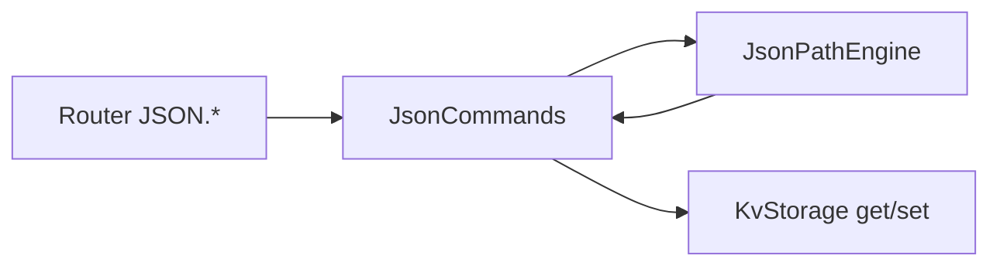
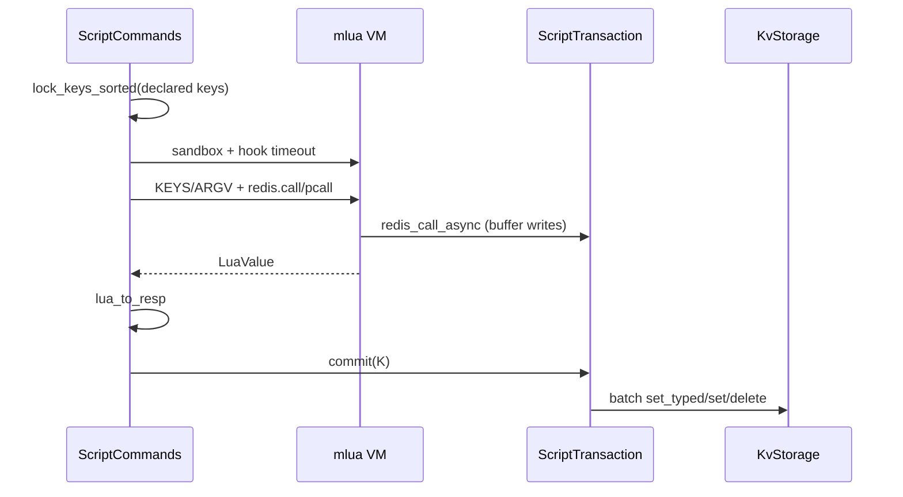
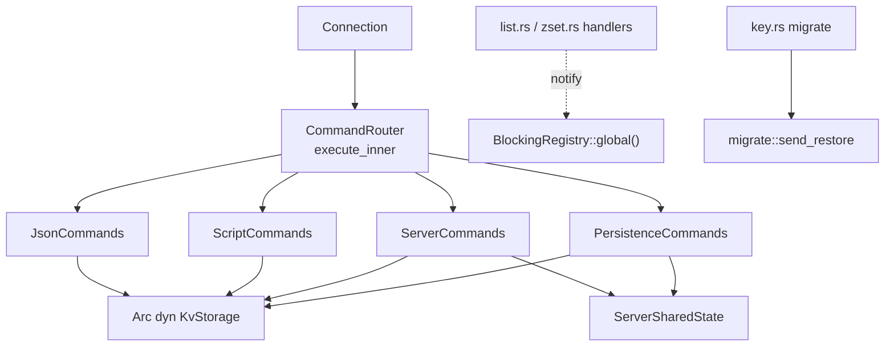
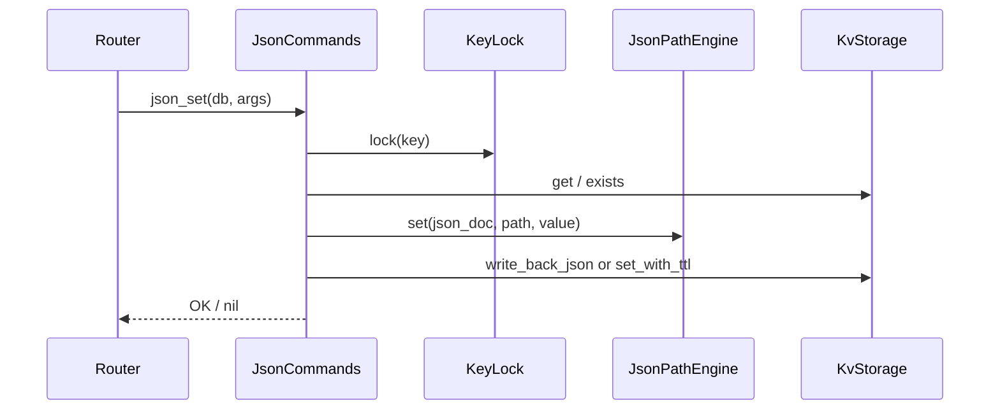
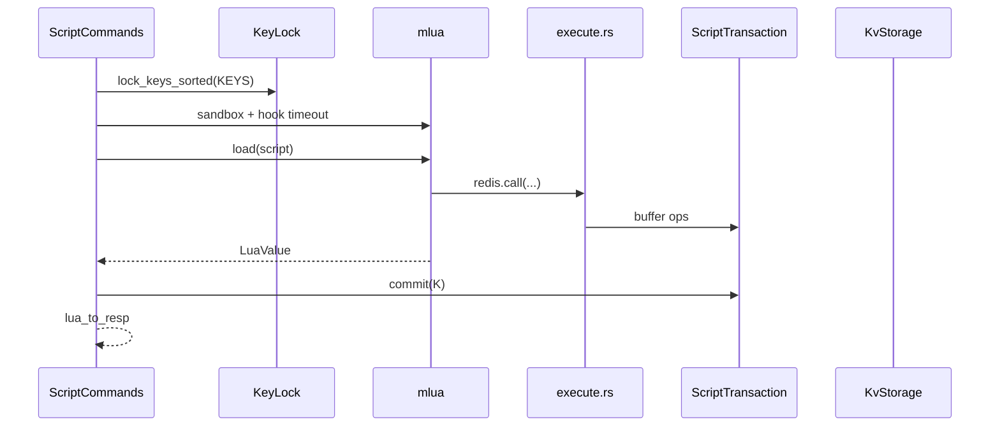

# Cursor transcript

---

## 1. User

## 文档整理 — 新会话

工作目录: `<workspace>` (含 aidb/、aikv/、aifactory/)

请先阅读 (不要跳过):

1. `AiKv-Workflow/backup/design.md` — 总规程
2. `AiKv-Workflow/backup/PROGRESS.md` — 当前进度
3. `AiKv-Workflow/backup/INDEX.md` — 本章索引 (若已有行则更新)

---

### 本次任务

| 项 | 值 |
|----|-----|
| PROGRESS 总步 | 8 |
| 目标文件 | `aikv/docs/modules/commands-extended.md` |
| 本次子步 | 从步 0 开始 |
| 对比深度 | 模块级 (见 `design.md` — aikv `commands-extended` 非加深章) |

### 必须遵守

- **确认门控**: 步 0→1→2→3→4, 每步先讨论, 我确认后再下一步
- **步 4**: 先出 Module Skill 正文 **草稿**, 我确认后再写入 aidb/aikv、更新 INDEX/PROGRESS
- **Module Skill 基础模板**: frontmatter `name` + `description` (含 `Use when`); 见 `design.md`
- **过程只进 backup/**: INDEX; aidb/aikv 不写迁移历史
- **旧文档顺序**: `backup/{aidb,aikv}/` → `*-oldmain` → WiQunTools inventory 段 → wiqun-*
- **待核实**: module 一行引用; 详情写入 **当前仓库** 根目录 `ISSUES.md` (`aikv/ISSUES.md`)
- **步 4 落盘前**: 对照 create-skill Summary Checklist 自检 (见 `design.md`)

### 上下文 (上一章已完成)

- 步 7 ✅ [`aikv/docs/modules/commands-core.md`](aikv/docs/modules/commands-core.md) — `CommandRouter` / `registry` / `KeyLock`; String~ZSet/Key/DB handler; 阻塞 pop **handler 在 core**、`BlockingRegistry` 机制本章应覆盖; ISSUE-001 (MGET), ISSUE-003 (GETRANGE), ISSUE-004 (MSETNX)
- 前置 module: [`protocol.md`](aikv/docs/modules/protocol.md), [`server.md`](aikv/docs/modules/server.md), [`storage.md`](aikv/docs/modules/storage.md), [`commands-core.md`](aikv/docs/modules/commands-core.md)
- 本章覆盖 `aikv/src/command/{json,jsonpath,jsonpath_util,script,blocking,migrate,persistence,server}` (+ `script/*` 子目录); 步 11 cluster、步 12 observability 会引用本章
- WiQunTools 查漏重点: `03-extended-commands.md`, `04-json.md`, `05-lua.md`, `06-persistence.md` (INFO/slowlog 与步 12 分界)

### 边界提示 (步 0 可细化)

- **本章**: JSON/JSONPath, Lua/EVAL, `BlockingRegistry`, `migrate::send_restore`, SAVE/BGSAVE/SHUTDOWN, INFO/TIME/CONFIG/CLIENT/COMMAND/OBJECT 等 **Router 内 server/persistence dispatch**
- **不重复**: 核心数据结构命令 → commands-core; ATOM 事务连接层 → server.md; MOVED/ASK → cluster.md; slowlog/latency/metrics **数据结构** → observability.md (步 12)

### 本次不要

- 不要跳过未确认的步骤
- 不要一次写多篇 module
- 不要修改 `design.md` / 流程, 除非我明确要求
- 不要 commit, 除非我明确要求

---

请从步 0 开始, 给出本步交付物, 等我确认。

---

## 2. Assistant

先阅读规程、进度与索引，再整理 `commands-extended` 模块的步 0 交付物。

---

## 3. Assistant

对照源码与已完成章节，核实 `commands-extended` 的覆盖范围与边界。

---

## 4. Assistant

## 步 0 — 定范围 (`commands-extended.md`)

**PROGRESS 步 8** · 对比深度: **模块级** · 目标: `aikv/docs/modules/commands-extended.md`

---

### 1. 章节定位

在 [commands-core.md](aikv/docs/modules/commands-core.md) 之上, 文档化 **扩展命令域**: JSON/JSONPath、Lua 脚本、阻塞等待基础设施、MIGRATE 网络传输、持久化运维命令, 以及 Router 内 **Server/Persistence 子命令分发** (含 `OBJECT` / `CONFIG` / `CLIENT` 等 inline dispatch).

**前置 module** (只链引用, 不重写): [protocol.md](aikv/docs/modules/protocol.md) · [server.md](aikv/docs/modules/server.md) · [storage.md](aikv/docs/modules/storage.md) · [commands-core.md](aikv/docs/modules/commands-core.md)

**后续引用本章**: 步 11 `cluster.md` (CLUSTER 子命令已在 Router, 实现归 cluster) · 步 12 `observability.md` (slowlog/latency/InfoRenderer/metrics 内部结构)

---

### 2. 覆盖 `src/` 路径 (design.md 对照)

| 路径 | 职责概要 | 入口 |
|------|----------|------|
| `command/json.rs` | 11 条 `JSON.*` handler | `JsonCommands::{json_set, json_get, …}` |
| `command/jsonpath.rs` | JSONPath 解析/修改引擎 (extract/set/delete/filter/incr/append) | `JsonPathEngine` |
| `command/jsonpath_util.rs` | 比较、顶层 split 等工具 | `json_compare`, `split_top_level` |
| `command/script.rs` | EVAL / EVALSHA / SCRIPT 编排 | `ScriptCommands::{eval, evalsha, script}` |
| `command/script/cache.rs` | SHA1 脚本缓存 | `ScriptCache` |
| `command/script/convert.rs` | Lua → RESP | `lua_to_resp` |
| `command/script/execute.rs` | `redis.call` 异步桥 | `redis_call_async` |
| `command/script/json_exec.rs` | Lua 内 JSON 命令 | (script 子模块) |
| `command/script/sandbox.rs` | mlua 沙箱 / hook | `new_sandbox_lua` |
| `command/script/transaction.rs` | 脚本内原子事务 | `ScriptTransaction` |
| `command/blocking.rs` | `BlockingRegistry` 全局单例 + `nil_blocking_response` | `register` / `notify` / `evict_expired` |
| `command/migrate.rs` | MIGRATE 目标端 TCP: SELECT + RESTORE | `send_restore`, `RestoreTarget` |
| `command/persistence.rs` | SAVE / BGSAVE / LASTSAVE / SHUTDOWN | `PersistenceCommands` |
| `command/server.rs` | INFO / TIME / CONFIG / CLIENT / COMMAND / SLOWLOG / LATENCY | `ServerCommands` |

**Router 部分阅读** (实现不在上表, 但 dispatch 归本章叙述):

| 路径 | 仅读片段 |
|------|----------|
| `command/router.rs` | `new_with_shared` 注入; `JSON.*` / `EVAL*` / `SCRIPT` / `INFO`~`SHUTDOWN` match; `dispatch_object` / `dispatch_config` / `dispatch_client`; `require_server` / `require_persistence` |
| `command/registry.rs` | extended 命令元数据条目 (与 core 章交叉引用) |

**跨模块衔接** (步 1 辅助读, 不归本章 `src/` 主地图):

| 路径 | 关系 |
|------|------|
| `command/key.rs` | `MIGRATE` **编排** (DUMP → `migrate::send_restore`); handler 留在 core, TCP 客户端归本章 |
| `command/list.rs`, `command/zset.rs` | BLPOP/BRPOP/BLMOVE/BZPOP* **handler 在 core**; 调用 `BlockingRegistry::global()` |
| `server/config.rs` | `CommandRouter::new_with_shared` 装配 `ServerCommands` / `PersistenceCommands` |
| `server/info.rs`, `server/slowlog.rs`, `server/latency.rs` | `ServerCommands` 委托目标; **数据结构/渲染细节** → observability (步 12) |

---

### 3. 本章边界

#### ✅ 本章覆盖

- **JSON**: 11 条 `JSON.*`; 存储为 String KV + `serde_json`; TTL 写回
- **JSONPath**: `jsonpath.rs` + `jsonpath_util.rs` 能力边界 (含 filter / wildcard 等)
- **Lua**: EVAL/EVALSHA/SCRIPT; 沙箱、超时、内存限制、`redis.call`、脚本缓存、`ScriptTransaction`
- **BlockingRegistry**: 注册/唤醒/过期清理; 与 list/zset handler 的协作模式 (handler 细节不展开)
- **MIGRATE**: `migrate::send_restore` TCP 协议与 `RestoreTarget`; 与 `key.rs::migrate` 分工
- **持久化运维**: SAVE/BGSAVE/LASTSAVE/SHUTDOWN; AiDb engine 限制; `ServerSharedState` 协作
- **Server 管理命令**: INFO/TIME/CONFIG/CLIENT/COMMAND + Router 内 `OBJECT` dispatch
- **SLOWLOG / LATENCY**: 仅写「Router → `ServerCommands` → server 子模块」调用链; 环形缓冲/阈值/**INFO section 内容** 留给 observability

#### ❌ 不重复 (一行链出即可)

| 主题 | 归属 |
|------|------|
| String~ZSet/Key/DB handler、KeyLock、registry/router 主流程 | [commands-core.md](aikv/docs/modules/commands-core.md) |
| ATOM.MULTI/EXEC/WATCH、连接层事务队列 | [server.md](aikv/docs/modules/server.md) (`connection.rs`) |
| MOVED/ASK、`CLUSTER` 子命令实现 | [cluster.md](aikv/docs/modules/cluster.md) (步 11) |
| slowlog 结构、latency 直方图、InfoRenderer 字段、Prometheus `/metrics` | [observability.md](aikv/docs/modules/observability.md) (步 12) |
| `KvStorage` / checkpoint / flush 契约 | [storage.md](aikv/docs/modules/storage.md) |
| DUMP/RESTORE 本地格式 (非 MIGRATE TCP) | commands-core (`key.rs`) |

#### ⚠️ 边界待你确认的两点

1. **`OBJECT`**: 实现在 `router.rs::dispatch_object`, 非 `server.rs` — 建议 **本章** 写 dispatch + stub 语义 (REFCOUNT/IDLETIME/FREQ 返回固定值), core 只保留 registry 一行.
2. **`SLOWLOG`/`LATENCY`/`INFO`**: 本章写「命令入口 + 参数 + 与 `ServerSharedState` 关系」; 步 12 写观测子系统内部 — 与你在边界提示中的 observability 分界一致, 请确认是否 OK.

---

### 4. 步 1 拟读文件清单 (按优先级)

**P0 — 必读源码**

```shell
aikv/src/command/
├── json.rs              # JSON.* handler
├── jsonpath.rs          # JSONPath 引擎
├── jsonpath_util.rs     # 工具函数
├── script.rs            # EVAL/EVALSHA/SCRIPT
├── script/
│   ├── cache.rs
│   ├── convert.rs
│   ├── execute.rs
│   ├── json_exec.rs
│   ├── sandbox.rs
│   └── transaction.rs
├── blocking.rs          # BlockingRegistry
├── migrate.rs           # send_restore TCP
├── persistence.rs       # SAVE/BGSAVE/SHUTDOWN
├── server.rs            # ServerCommands
└── router.rs            # extended match + dispatch_object/config/client (片段)
```

**P1 — 衔接读**

```shell
aikv/src/command/key.rs           # migrate() 编排 (~L286+)
aikv/src/command/list.rs          # BLPOP/BRPOP/BLMOVE + BlockingRegistry
aikv/src/command/zset.rs          # BZPOP* + BlockingRegistry
aikv/src/server/config.rs         # Router 装配
aikv/src/command/registry.rs      # extended 元数据
```

**P2 — 测试 (步 1 验证用)**

```shell
aikv/tests/modules/command/json.rs
aikv/tests/modules/command/atom_json_batch.rs
aikv/tests/modules/command/script.rs
aikv/tests/modules/command/persistence.rs
aikv/tests/modules/command/key.rs          # MIGRATE
aikv/tests/modules/command/list.rs         # 阻塞 pop
aikv/tests/modules/command/server.rs
aikv/tests/modules/command/info_golden.rs
aikv/tests/modules/command/info_alignment.rs
```

**步 2 旧文档查漏** (本轮只列, 步 2 再分类):

- `backup/aikv/` CHANGELOG, DESIGN
- `aikv-oldmain/docs/guide/`, `docs/development/`
- `wiqun-kv/src/command/` (查漏)
- WiQunTools: `03-extended-commands.md`, `04-json.md`, `05-lua.md`, `06-persistence.md` (INFO/slowlog 与步 12 分界)

---

### 5. 拟写入 INDEX 的本章行 (确认步 0 后落盘)

| 新文档章节 | 状态 | 参考的旧文档 | 处理 | 备注 |
|------------|------|--------------|------|------|
| `docs/modules/commands-extended.md` | 🔄 步 0 | (步 2 填) | — | `json/jsonpath/script/blocking/migrate/persistence/server` + router extended dispatch; MIGRATE 编排见 key.rs |

---

### 6. 步 4 预览 (仅 name/description 草案, 不落盘)

```yaml
name: aikv-commands-extended
description: AiKv extended Redis commands — JSON/JSONPath, Lua EVAL/SCRIPT, BlockingRegistry, MIGRATE TCP restore, SAVE/BGSAVE/SHUTDOWN, server admin (INFO/CONFIG/CLIENT/COMMAND/OBJECT). Use when changing src/command/{json,jsonpath,script,blocking,migrate,persistence,server}, router extended dispatch, debugging JSONPath/Lua sandbox/MIGRATE/BGSAVE, or blocking wait/notify integration.
```

---

请确认步 0:

1. **范围与边界** 是否 OK (尤其 `OBJECT` 归本章、`SLOWLOG/LATENCY/INFO` 与 observability 分界)?
2. **拟读文件清单** 有无增减?
3. 确认后我会 **更新 `backup/INDEX.md` 本章行**, 再进入 **步 1 (读新代码)**.

---

## 5. User

可以

---

## 6. Assistant

步 0 已确认。正在更新 `INDEX.md`，并阅读源码以产出步 1 交付物。

---

## 7. Assistant

`INDEX.md` 已更新 (步 0 ✅). 下面是 **步 1 — 读新代码** 交付物, 请确认后再进入步 2.

---

## 步 1 — 职责 / 代码地图 / 主流程

### 1. 模块职责 (按域)

| 域 | 职责 | 关键约束 |
|----|------|----------|
| **JSON** (`json.rs`) | 11 条 `JSON.*`; 文档存为 **String KV** (`storage.get/set`, 非 typed) | KeyLock 写路径; `write_back_json` 保留 TTL; `JSON.MSET` 用 `lock_keys_sorted` |
| **JSONPath** (`jsonpath.rs`, `jsonpath_util.rs`) | 路径 extract/set/delete/incr/append; 支持 `$`/`.`/`[N]`/`[*]`/`[?(@…)]` 过滤 | 与 RedisJSON/AiKv 扩展对齐; filter 比较用 `json_compare` |
| **Lua** (`script.rs` + 子模块) | EVAL/EVALSHA/SCRIPT; 沙箱 mlua; `redis.call/pcall` | 5s 超时 (每 10k 指令 hook); 128MB 内存上限; 声明 key 校验; 结束后 `ScriptTransaction::commit` |
| **BlockingRegistry** (`blocking.rs`) | 全局 `DashMap<key, waiters>`; oneshot 唤醒 | handler 在 core (`list`/`zset`); 写成功后 `notify`; 超时返回 **nil Array** |
| **MIGRATE TCP** (`migrate.rs`) | AUTH → SELECT → (cluster: ASKING) → RESTORE | 编排/ DUMP 在 `key.rs::migrate` |
| **Persistence** (`persistence.rs`) | SAVE/BGSAVE/LASTSAVE/SHUTDOWN | **仅 `StorageEngineKind::AiDb`**; memory engine 拒绝 SAVE/SHUTDOWN SAVE |
| **Server 命令** (`server.rs` + router dispatch) | INFO/TIME/CONFIG/CLIENT/COMMAND/SLOWLOG/LATENCY; router 内 `OBJECT` | 依赖 `ServerSharedState`; 测试用 `CommandRouter::new()` 时 server/persistence 为 `None` → ERR |

**装配差异** (与 core 章衔接):

- `CommandRouter::new()` — 无 `ServerCommands` / `PersistenceCommands` (单测)
- `CommandRouter::new_with_shared()` — 生产路径; JSON/Script 带 metrics

---

### 2. 代码地图 (精炼)

| 路径 | 入口 / 类型 | 说明 |
|------|-------------|------|
| `json.rs` | `JsonCommands` | `load_json` / `write_back_json`; 委托 `JsonPathEngine` |
| `jsonpath.rs` | `JsonPathEngine::{extract,set,delete,incr,append}` | ~1100 行; 核心路径引擎 |
| `jsonpath_util.rs` | `split_top_level`, `json_compare`, `json_equal` | filter 表达式拆分 |
| `script.rs` | `ScriptCommands::{eval,evalsha,script}` | `execute_script` 主流程 |
| `script/cache.rs` | `ScriptCache` | LRU 256; **EVAL 不写缓存**, 仅 SCRIPT LOAD |
| `script/sandbox.rs` | `new_sandbox_lua` | 禁用 load/require/rawget 等; 仅 TABLE/STRING/MATH/UTF8 |
| `script/execute.rs` | `redis_call_async` | ~40+ 子命令 (String/Hash/List/Set/ZSet/JSON/EXPIRE…); 独立 key index 表 |
| `script/json_exec.rs` | `exec_json_*` | Lua 内 JSON, 走 `ScriptTransaction` 缓冲 |
| `script/transaction.rs` | `ScriptTransaction` | 写缓冲 + `commit` 批量落盘 (保留 TTL) |
| `script/convert.rs` | `lua_to_resp`, `resp_to_lua` | Lua ↔ RESP |
| `blocking.rs` | `BlockingRegistry::global()` | `register` / `notify` / `evict_expired` (后者 **未被调用**) |
| `migrate.rs` | `send_restore(RestoreTarget)` | RESP over TCP |
| `persistence.rs` | `PersistenceCommands` | checkpoint → `shared.backup_dir` |
| `server.rs` | `ServerCommands` | INFO → `InfoRenderer`; SLOWLOG/LATENCY → `shared` 子系统 |
| `router.rs` (片段) | `dispatch_object/config/client`; extended match | `require_server` / `require_persistence` |

**跨模块 (本章只链, 不展开 handler)**:

- `key.rs::migrate` — 解析 COPY/REPLACE/AUTH/KEYS; `dump_encode` → `send_restore`
- `list.rs` — `blocking_pop` / `blmove_blocking`; `push` → `notify`
- `zset.rs` — `zadd` → `notify`; `blocking_zpop`

---

### 3. 主流程要点

#### 3.1 JSON 读写



1. `JSON.GET`: `get` → deserialize → path extract (或整文档) → bulk JSON string
2. `JSON.SET`: KeyLock → NX/XX/XE/TTL 选项 → path set 或整 key 替换 → `set` / `set_with_ttl` / `write_back_json`
3. `JSON.DEL` 根路径: `delete`; 子路径: path delete → write_back
4. `JSON.UPDATE`: where 路径过滤 + 多 path/value 批量 set
5. WRONGTYPE: key 存在但非 String JSON → `serde_json` 解析失败或 typed 冲突

#### 3.2 Lua 脚本



- `redis.call` 抛错; `redis.pcall` 返回 `{err, …}` table
- 未声明 key → `ERR Script attempted to access undeclared key`
- `SCRIPT KILL` → 固定 `NOTBUSY` (无运行中脚本跟踪)

#### 3.3 BlockingRegistry (机制在本章, handler 在 core)

1. **Pop 侧** (`list`/`zset`): 先 `try_pop`; 失败则 `register(key, timeout)` 轮询 `try_recv` (10ms sleep); 被唤醒后重试 pop; 超时 → `nil_blocking_response()`
2. **Push 侧**: `LPUSH`/`RPUSH`/`ZADD` 成功后 `notify(key, OK)` — 唤醒 **该 key 全部** waiters
3. `timeout=0` → 立即 nil Array; `timeout<0` → 300s 上限
4. `evict_expired()` 已实现但 **全仓库无调用** (步 2–3 候选 ISSUE)

#### 3.4 MIGRATE

1. `key.rs::migrate` 解析 host/port/key/dest_db/timeout + COPY/REPLACE/AUTH/KEYS
2. 单 key: KeyLock → `get_typed` → `dump_encode` → `send_restore` → 非 COPY 则 `delete`
3. `KEYS` 批量: 逐 key RESTORE + **始终 delete** (COPY 标志未生效 — 步 2–3 候选)
4. `migrate.rs`: TCP connect → 可选 AUTH → 非 0 号库 SELECT → `#[cfg(cluster)] ASKING` → RESTORE

#### 3.5 持久化运维

| 命令 | 行为 |
|------|------|
| SAVE | 同步 `flush_engine` + `create_checkpoint(backup_dir)` + `record_save_success` |
| BGSAVE | CAS `bgsave_in_progress`; `tokio::spawn` 同上; 立即返回 `Background saving started` |
| LASTSAVE | AiDb: `shared.last_save_time()`; memory: 0 |
| SHUTDOWN | AiDb: 可选 checkpoint + `close_engine` + `shared.shutdown.cancel()` |

#### 3.6 Server / Router dispatch

| 命令 | 实现位置 | 要点 |
|------|----------|------|
| INFO | `server.rs` → `InfoRenderer` | section 可选; 字段详情 → observability |
| TIME | `server.rs` | Unix sec + micros |
| CONFIG GET/SET | `server.rs` | `config_map`; `slowlog-*` 联动 `slow_query_log`; `appendonly` 拒绝 |
| CONFIG REWRITE/RESETSTAT | `router.rs` | 直接 OK (no-op) |
| CLIENT LIST/SETNAME/GETNAME | `server.rs` | `shared.clients` |
| COMMAND * | `server.rs` | 读 `registry::all_commands` / GETKEYS |
| SLOWLOG * | `server.rs` | 读 `shared.slow_query_log` |
| LATENCY * | `server.rs` | 读 `shared.latency_stats`; RESP2/3 格式分支 |
| OBJECT * | `router.rs::dispatch_object` | ENCODING 按 `ValueType`; REFCOUNT/IDLETIME/FREQ **stub 固定值** |

---

### 4. 测试锚点 (步 1 已扫)

| 测试 | 覆盖 |
|------|------|
| `tests/modules/command/json.rs` | JSON 命令 + JSONPath |
| `tests/modules/command/atom_json_batch.rs` | ATOM + JSON 批量 (连接层, 本章只链 server.md) |
| `tests/modules/command/script.rs` | EVAL/SCRIPT |
| `tests/modules/command/persistence.rs` | SAVE/BGSAVE/SHUTDOWN |
| `tests/modules/command/key.rs` | MIGRATE |
| `tests/modules/command/list.rs` | 含阻塞 pop |
| `tests/modules/command/server.rs` | CONFIG/CLIENT/COMMAND 等 |
| `tests/modules/command/info_*.rs` | INFO 输出对齐 |

---

### 5. 步 2–3 候选疑点 (暂不写 ISSUES, 步 2 分类)

| 候选 | 位置 | 简述 |
|------|------|------|
| A | `blocking.rs` | `evict_expired` 无后台调用; 过期 waiter 靠 poll 超时 |
| B | `key.rs` MIGRATE KEYS | 批量路径忽略 COPY, 始终 delete |
| C | `script.rs` | SCRIPT KILL 恒 NOTBUSY |
| D | `persistence.rs` SAVE | log target 写 `bgsave.complete` (疑似 copy-paste) |
| E | `execute.rs` | `JSON.MGET` 在 key_indices 表但无 dispatch (Lua 内未实现?) |

---

请确认步 1:

1. 职责划分与代码地图是否准确?
2. 主流程 (尤其 BlockingRegistry / MIGRATE / Lua commit) 有无遗漏?
3. 步 2–3 候选 A–E 是否纳入后续旧文档对照?

确认后进入 **步 2 (查旧文档)**.

---

## 8. User

可以

---

## 9. Assistant

步 1 已确认。开始步 2：按规程顺序查阅旧文档并分类。

---

## 10. Assistant

`INDEX.md` 步 0 行已落盘. 下面是 **步 2 — 查旧文档** 交付物.

---

## 步 2 — 旧文档清单 + 分类 + 拟写 ISSUES

查阅顺序: `backup/aikv/` → `aikv-oldmain` → WiQunTools inventory → `wiqun-kv` (查漏).

---

### 1. 旧文档清单与分类

| 来源 | 路径 | 分类 | 处理建议 (步 4) |
|------|------|------|-----------------|
| **backup/aikv** | `README.md` | **仍有效** (概览) + **待核实** | 功能列表大体对齐; `SCRIPT KILL` 标 ✅ 与现码 stub 矛盾 → 本章「已知限制」+ ISSUE |
| **backup/aikv** | `CHANGELOG.md` | **仍有效** (施工史) | 不迁入 module; 步 4 仍留 backup |
| **backup/aikv** | `DESIGN.md` §命令 (Lua/JSON) | **仍有效** | 3 条设计决策与现码一致, 步 4 正文可吸收要点 |
| **backup/aikv** | `docs/superpowers/specs/2026-06-10-redis-observability-alignment-design.md` | **分界** | → 步 12 `observability.md`; 本章只链 INFO 入口 |
| **aikv-oldmain** | `docs/development/api/01-commands.md` | **部分有效 / 已过时** | JSON 7 条 + EVAL/SCRIPT/MIGRATE/SAVE 示例可用; **缺** UPDATE/MSET/NUMINCRBY/ARRAPPEND; SHUTDOWN `NOW`/`FORCE`/`ABORT` 未实现; 无 BLPOP/OBJECT 专节 |
| **aikv-oldmain** | `docs/development/architecture/05-lua-scripting.md` | **部分有效 / 已过时** | ScriptTransaction 概念仍对; **过时**: sync `write_batch`、无 timeout、命令数 38、Limitations 未更新 (现已有 5s hook + 128MB) |
| **aikv-oldmain** | `docs/development/architecture/01-overview.md` | **已过时** | `CommandExecutor` sync 架构; 模块文件名映射仍可参考 |
| **aikv-oldmain** | `docs/archive/LUA_TRANSACTION_SUMMARY.md` | **已过时** | 历史归档, 步 4 跳过 |
| **WiQunTools** | `03-extended-commands.md` | **查漏 / 部分有效** | Server 子命令 (INFO/CONFIG/CLIENT/SLOWLOG/LATENCY/OBJECT) 详设 + 可观测性 span 表; List/Set/ZSet/Key → core; §可观测性 → 步 12 |
| **WiQunTools** | `04-json.md` | **仍有效** | P11-core/ext、JSONPath 能力、`write_back_json`、KeyLock 模式与 `aikv/src/command/json*.rs` 一致 |
| **WiQunTools** | `05-lua.md` | **仍有效** + **设计偏离 (inventory)** | 沙箱/超时/LRU/pcall `{err}` 表与现码一致; inventory 写 wiqun-kv「JSON via redis.call ⬜」— **aikv 已实现** (`json_exec.rs`) |
| **WiQunTools** | `06-persistence.md` | **仍有效** | 双引擎 SAVE/BGSAVE/SHUTDOWN、`appendonly` 拒绝、checkpoint 非 RDB — 与 `persistence.rs` 一致 |
| **WiQunTools** | `08-observability.md` | **分界** | SLOWLOG/LATENCY/InfoRenderer/metrics 内部 → observability; 本章写 Router→`ServerCommands` 即可 |
| **wiqun-kv** | `src/command/{json,script,blocking,migrate,persistence,server}*` | **查漏** | 与 aikv 同构; MIGRATE KEYS/COPY 等行为相同 (见 ISSUE-006) |

**步 4 预计消化**: 无整篇旧稿需从 `aikv-oldmain` 删除 (本章无 dedicated 旧 module 文档); `01-commands.md` / `05-lua-scripting.md` 保留至其它章或总审后再归档.

---

### 2. 旧文档 vs 现码 — 关键结论 (供步 3 模块级对照)

| 主题 | 旧文档说法 | 现码 | 文档应如何写 |
|------|-----------|------|-------------|
| JSON 存储 | DESIGN / 04-json: String KV + serde_json | 一致 | 保留 invariant; 链 storage.md WRONGTYPE |
| JSON 扩展命令 | oldmain API **无** UPDATE/MSET/NUMINCRBY | 已实现 11 条 | 以现码为准; oldmain API 仅作 core 7 条查漏 |
| Lua 事务 | oldmain: `write_batch` 直写 AiDb | `ScriptTransaction` + per-op `set_typed`/`commit` | 写现路径, 不抄 oldmain 图 |
| Lua 限制 | oldmain: 无 timeout, KILL 不可用 | 5s hook + 128MB; KILL 仍 stub | 「已知限制」 |
| Lua JSON | WiQunTools 05: wiqun-kv 未做 | aikv `json_exec.rs` 9 条 | 本章覆盖; 注明无 JSON.MGET |
| MIGRATE | oldmain: AUTH2 + KEYS 尊重 COPY | 仅 AUTH; KEYS **始终 delete** | ISSUE-006/010 |
| MIGRATE cluster | CHANGELOG: ASKING + 本地路由 | `migrate.rs` + cluster route 豁免 | 链 cluster.md |
| 持久化 | 06-persistence: memory ERR | `ensure_persistent_engine()` | 一致 |
| SAVE 日志 | (无) | `cmd_save` 打 `bgsave.complete` | ISSUE-008 doc-only |
| Blocking | oldmain **无** BlockingRegistry | 重构新增 DashMap+oneshot | 本章主写; handler 链 core |
| INFO/SLOWLOG | 08-observability + CHANGELOG InfoRenderer | `server.rs` 委托 | 命令入口本章; 字段 observability |
| OBJECT | 03-extended 有 stub 设计 | `router.dispatch_object` REFCOUNT/IDLETIME/FREQ 固定值 | 本章写 stub 语义 |
| SHUTDOWN | oldmain API: NOW/FORCE/ABORT | 仅 SAVE/NOSAVE | ISSUE-011 doc-only |

---

### 3. 拟写 ISSUES (`aikv/ISSUES.md`, 步 2 确认后再落盘)

| ID | 标题 | 状态建议 | 依据 |
|----|------|----------|------|
| **ISSUE-005** | `BlockingRegistry::evict_expired` 无后台调用 | `open` | 步 1 候选 A; oldmain 无此机制; waiter 靠 poll 超时 + 内存滞留 |
| **ISSUE-006** | `MIGRATE … KEYS` 忽略 `COPY`, 批量路径始终 delete | `open` | 步 1 候选 B; oldmain `key.rs` L990 `if !copy`; wiqun-kv 同 bug |
| **ISSUE-007** | `SCRIPT KILL` 恒 `NOTBUSY` | `doc-only` | oldmain `05-lua-scripting.md` Limitations 已承认; backup README 标 ✅ 需修正表述 |
| **ISSUE-008** | `SAVE` 日志 target 为 `bgsave.complete` | `doc-only` | 步 1 候选 D; 不影响语义 |
| **ISSUE-009** | Lua `redis.call('JSON.MGET')` 未实现 | `open` | 步 1 候选 E; `execute.rs` key_indices 含 `JSON.MGET`, dispatch 无 |
| **ISSUE-010** | `MIGRATE` 无 `AUTH2` (username+password) | `open` | oldmain 有; 现 `key.rs`/`migrate.rs` 仅 `AUTH password` |
| **ISSUE-011** | `SHUTDOWN NOW/FORCE/ABORT` 未实现 | `doc-only` | oldmain API 有; 现 `persistence.rs` 仅 Default/SAVE/NOSAVE |

步 3 模块级 oldmain 对照预计再核对: `script/execute.rs` 命令子集 vs oldmain sync script、JSONPath filter 行为 (CHANGELOG 已记裸 `@` 修复).

---

### 4. 与 observability (步 12) 分界 (旧文档侧)

| WiQunTools / backup | 归属 |
|---------------------|------|
| `08-observability.md` INFO 字段、Prometheus 不变式、SlowQueryLog 结构 | observability.md |
| `03-extended-commands.md` §可观测性 span/metric 表 | 命令 span 名可在本章「测试/配置」简要列; 指标详情 observability |
| `server.rs` 中 SLOWLOG/LATENCY/INFO **handler** | 本章: 子命令 + 参数 + `ServerSharedState` 字段名 |

---

### 5. 拟更新 INDEX 行 (确认步 2 后落盘)

| 新文档章节 | 状态 | 参考的旧文档 | 处理 | 备注 |
|------------|------|--------------|------|------|
| `docs/modules/commands-extended.md` | 🔄 步 2 ✅ | backup/aikv README,CHANGELOG,DESIGN; oldmain 01-commands,05-lua; WiQunTools 03/04/05/06 (+08 分界); wiqun-kv src/command 查漏 | 步 4 写正文; 无整篇旧稿删除 | ISSUE-005~011 拟新增 |

---

请确认步 2:

1. 旧文档分类是否 OK?
2. ISSUE-005~011 是否全部纳入 (或调整状态/合并)?
3. observability 分界是否维持?

确认后我会 **更新 `backup/INDEX.md`**, **写入 `aikv/ISSUES.md` 新条目**, 再进入 **步 3 (oldmain 模块级代码对照)**.

---

## 11. User

可以

---

## 12. Assistant

步 2 已确认。正在更新 INDEX、写入 ISSUES，并开始步 3 的 oldmain 模块级对照。

---

## 13. Assistant

步 3 尚未确认，先把 INDEX 状态改回步 2。

---

## 14. Assistant

`INDEX.md` 与 `aikv/ISSUES.md` (ISSUE-005~011) 已落盘. 下面是 **步 3 — oldmain 模块级对照**.

---

## 步 3 — 模块级差异表 + 文档表述建议

**对照范围**: `aikv-oldmain/src/command/{json,script,server,key}.rs` + `mod.rs` dispatch · 现码 `aikv/src/command/{json,jsonpath*,script*,blocking,migrate,persistence,server}.rs` + `router.rs` 片段

**oldmain 无对应文件**: `blocking.rs`, `migrate.rs`, `persistence.rs`, `jsonpath.rs` (JSONPath 内联于 `json.rs` ~1860 行)

---

### 1. 路径 / 分层变化

| 域 | oldmain | 现 aikv | 主流程是否等价 |
|----|---------|---------|----------------|
| JSON | `json.rs` 单文件 + 内联 JSONPath | `json.rs` + `jsonpath.rs` + `jsonpath_util.rs` | **是** (11 条命令 + filter 能力保留/增强) |
| Lua | `script.rs` ~3180 行 monolith | `script.rs` + `script/{cache,convert,execute,json_exec,sandbox,transaction}.rs` | **大体是** (commit 路径变) |
| 阻塞 | **无** (list 无 BLPOP) | `blocking.rs` + core handler | **新增** (非 oldmain 回归) |
| MIGRATE TCP | `key.rs` 内联 sync `TcpStream` | `key.rs` 编排 + `migrate.rs` async | **是** (AUTH2/COPY 见 ISSUE) |
| 持久化 | `server.rs` `create_backup` | `persistence.rs` `flush_engine` + `create_checkpoint` | **是** (经 KvStorage trait) |
| Server 命令 | `server.rs` 单体 (含 INFO 拼装) | `server.rs` handler + `server/info.rs` InfoRenderer | **是** (INFO 细节 → observability) |
| 路由 | `mod.rs` `CommandExecutor` sync | `router.rs` async + `ServerSharedState` 注入 | **是** (装配方式变) |

---

### 2. 分域差异表

#### JSON / JSONPath

| 项 | oldmain | 现码 | 文档建议 |
|----|---------|------|----------|
| 存储 API | sync `StorageEngine.get_from_db`, key 为 `String` | async `KvStorage.get`, key `&[u8]` | 写 async + binary-safe; 链 storage.md |
| 命令集 | 11 条 (同) | 11 条 | 列出 registry 条目即可 |
| JSONPath | 内联 `extract_json_path` / `filter_jsonpath` | 独立 `JsonPathEngine` | 代码地图拆三文件; 能力以现 `jsonpath.rs` 为准 |
| NX/XX/XE/TTL | 有 (SET) | 有 | 保留选项表 |
| UPDATE/MSET | 有 | 有 + `lock_keys_sorted` (MSET) | 强调多 key 锁 |

**结论**: 行为延续 oldmain, 结构拆分. 无需新 ISSUE (filter 裸 `@` 等已在 CHANGELOG 修复).

---

#### Lua / Script

| 项 | oldmain | 现码 | 文档建议 |
|----|---------|------|----------|
| 运行时 | sync `create_function` | async `create_async_function` + `eval_async` | 写 async 约束 |
| Key 锁 | `KeyLockManager` (Condvar, **30s 超时**) | `KeyLock::lock_keys_sorted` (**无 script 锁超时**) | 已知限制: 脚本 key 锁无 30s 超时 (与 oldmain 不同) |
| KEYS 校验 | **无** undeclared key 检查 | **有** `validate_keys` | 写为 **重构增强** |
| 沙箱 | StdLib 裁剪, **未** `harden_globals` | `sandbox.rs` 显式 Nil 危险全局 | 写 sandbox 清单 |
| 超时/内存 | **无** | 5s hook + 128MB | 写 DEFAULT 常量 |
| 脚本缓存 | 无界 `HashMap` (SCRIPT LOAD) | LRU **256** (`cache.rs`) | 写 Redis 语义: EVAL 不入 cache |
| commit | `write_batch` (String) + 逐条 typed commit | `ScriptTransaction::commit` → `set_typed`/`delete` | **勿抄** oldmain write_batch 图; 用现 transaction 流程 |
| redis.pcall 错误 | 失败 → **`Nil`** | 失败 → **`{err="..."}` 表** | 写 Redis 兼容行为 (WiQunTools 05-lua 目标) |
| Lua 内 JSON | **无** | `json_exec.rs` 9 条 | 写支持列表; **无 JSON.MGET** → ISSUE-009 |
| redis.call 命令数 | ~38 inline in script.rs | ~40+ in `execute.rs` | 指向 execute match, 不枚举全表 |
| SCRIPT KILL | stub NOTBUSY | 同 | ISSUE-007 doc-only |

**结论**: 现码在沙箱/超时/KEYS 校验/pcall/JSON-in-Lua 上 **强于** oldmain; commit 实现路径不同但语义目标相同.

---

#### BlockingRegistry

| 项 | oldmain | 现码 | 文档建议 |
|----|---------|------|----------|
| 存在性 | **无** BLPOP/BRPOP/BLMOVE/BZPOP* | `blocking.rs` + list/zset handler | 本章主写; handler 链 commands-core |
| 机制 | — | DashMap + oneshot + poll 10ms | 写 register/notify 流程图 |
| 唤醒 | — | LPUSH/RPUSH/ZADD → `notify` | 一句链 core |
| 清理 | — | `evict_expired` 无调用 | ISSUE-005 |

**结论**: **重构新增**, 不与 oldmain 对比回归.

---

#### MIGRATE

| 项 | oldmain | 现码 | 文档建议 |
|----|---------|------|----------|
| TCP 位置 | `key.rs` sync blocking IO | `migrate.rs` async tokio | 写 `send_restore` 步骤 |
| AUTH | password | password | 一致 |
| AUTH2 | **有** user+pass | **无** | ISSUE-010 |
| KEYS + COPY | `if !copy { delete }` | KEYS 分支 **始终 delete** | ISSUE-006 |
| cluster ASKING | 每条 key 前 ASKING | `#[cfg(cluster)]` 一次 ASKING | 写 cluster 链; 与 CHANGELOG 一致 |
| DUMP 格式 | oldmain payload | 同 bincode StoredValue (core) | 链 commands-core DUMP |

---

#### Persistence (SAVE/BGSAVE/SHUTDOWN)

| 项 | oldmain | 现码 | 文档建议 |
|----|---------|------|----------|
| 模块 | `server.rs` | `persistence.rs` | 代码地图独立文件 |
| 备份 API | `storage.create_backup(backup_dir)` | `flush_engine` + `create_checkpoint(dest)` | 链 storage.md checkpoint |
| memory 引擎 | 同进程 StorageEngine | `engine_kind()` → ERR | 与 WiQunTools 06 一致 |
| BGSAVE 重入 | 返回 SimpleString `"Background saving already in progress"` (**非 ERR**) | **`ERR Background saving already in progress`** | 文档写现行为 (Redis 倾向 ERR) |
| BGSAVE 线程 | `std::thread::spawn` | `tokio::spawn` | 一句即可 |
| SHUTDOWN | 解析 NOW/FORCE/ABORT (部分 no-op) | 仅 SAVE/NOSAVE | ISSUE-011 |
| shared 状态 | `ServerCommands` 内嵌 atomic | `ServerSharedState` | 链 server.md |

---

#### Server 命令 (+ router OBJECT)

| 项 | oldmain | 现码 | 文档建议 |
|----|---------|------|----------|
| INFO | `server.rs` `build_*_info` 内联 | `InfoRenderer` (`server/info.rs`) | 本章: `ServerCommands::info` 委托; 字段 → observability |
| CONFIG REWRITE | `config_rewrite` 注释 no-op | router dispatch → OK | 写 stub |
| SLOWLOG/LATENCY | `server.rs` | 同 + 读 `shared` | 子命令表在本章; 结构 → observability |
| COMMAND | `server.rs` | 同 + `registry` | 链 commands-core registry |
| OBJECT | **未实现** (mod 无 match) | `router.dispatch_object` stub | 写 **重构新增** + stub 语义 |
| CLIENT | oldmain 有 | 同 | 简要 |
| 注入 | `ServerCommands` 始终存在 | 仅 `new_with_shared` | 测试 vs 生产表 |

---

### 3. ISSUE 与步 3 对照 (无新增)

| ISSUE | 步 3 结论 |
|-------|-----------|
| 005 | 重构新增 API, oldmain 无对照 — 仍 open |
| 006 | **oldmain 回归** — KEYS 路径仍 open |
| 007 | oldmain 同样 stub — doc-only |
| 008 | oldmain 无此日志 — doc-only |
| 009 | 重构新增 json_exec, 漏 MGET — open |
| 010 | **oldmain 有 AUTH2, 现码缺失** — open |
| 011 | oldmain 解析但未全实现 — doc-only |

**步 3 未新增 ISSUE**. 可选 doc-only 补充 (不落 ISSUES): 脚本 key 锁无 30s 超时 (oldmain 有) — 建议写入 module「已知限制」一行, 不单独开 ISSUE.

---

### 4. 步 4 正文应如何写 (摘要)

1. **架构图**: Router extended match → Json/Script/Server/Persistence; MIGRATE 分叉 key→migrate.
2. **JSON**: String KV invariant + JsonPathEngine 入口 + 11 命令表 ( arity/写锁 ).
3. **Lua**: execute_script 时序; sandbox/timeout/cache; execute.rs 子集说明; pcall `{err}`; json_exec 列表.
4. **BlockingRegistry**: 机制 + 与 core notify 协作 (不展开 BLPOP handler).
5. **MIGRATE**: RestoreTarget 字段 + TCP 步骤 + ISSUE-006/010.
6. **Persistence**: 双引擎表 + SAVE/BGSAVE/SHUTDOWN 流程 + ISSUE-011.
7. **Server**: 子命令表 + OBJECT stub + require_server 条件.
8. **待核实**: 链 ISSUE-005~011 (一行/条).
9. **不写**: INFO 字段清单、slowlog 环形缓冲、cluster MOVED、ATOM 事务.

---

请确认步 3:

1. 差异表与「文档建议」是否 OK?
2. 脚本 key 锁无 30s 超时 — 是否只进 module「已知限制」(不开 ISSUE)?
3. BGSAVE 重入 ERR vs oldmain SimpleString — 是否在 module 注明?

确认后进入 **步 4**: 先出 `commands-extended.md` **正文草稿** 供你审阅.

---

## 15. User

可以，可以开 ISSUE

---

## 16. Assistant

步 3 已确认。正在添加 ISSUE-012、更新 INDEX，并起草步 4 的 Module Skill 正文。

---

## 17. Assistant

已写入 **ISSUE-012** (Script KeyLock 无超时), 并更新 **INDEX 步 3 ✅**. 下面是 **步 4 — Module Skill 正文草稿** (尚未落盘 `aikv/docs/modules/commands-extended.md`).

---

```markdown
---
name: aikv-commands-extended
description: AiKv extended Redis commands — JSON/JSONPath, Lua EVAL/SCRIPT, BlockingRegistry, MIGRATE TCP restore, SAVE/BGSAVE/SHUTDOWN, server admin (INFO/CONFIG/CLIENT/COMMAND/OBJECT). Use when changing src/command/{json,jsonpath,script,blocking,migrate,persistence,server}, router extended dispatch, debugging JSONPath/Lua sandbox/MIGRATE/checkpoint, or blocking wait/notify integration.
---

# AiKv Commands Extended (扩展命令层)

## 何时读本文

- 改 `src/command/{json,jsonpath,jsonpath_util,script,blocking,migrate,persistence,server}` 或 `router.rs` 中 extended match / `dispatch_object|config|client`
- 新增/修改 JSON.*、EVAL/SCRIPT、SAVE/BGSAVE、INFO/CONFIG/CLIENT/COMMAND、MIGRATE 网络传输
- 排查 JSONPath filter、Lua `redis.call`、脚本沙箱/超时、BGSAVE/checkpoint、阻塞唤醒
- **不覆盖**: String~ZSet/Key/DB handler、KeyLock 机制 → [commands-core.md](commands-core.md)
- **不覆盖**: ATOM.MULTI/EXEC/WATCH → [server.md](server.md) (`connection.rs`)
- **不覆盖**: MOVED/ASK、CLUSTER 子命令 → [cluster.md](cluster.md)
- **不覆盖**: slowlog 环形缓冲、latency 直方图、InfoRenderer 字段、Prometheus → [observability.md](observability.md)

## 架构一览



**装配** (见 [commands-core.md](commands-core.md)):

| 构造 | extended 能力 |
|------|----------------|
| `CommandRouter::new(storage)` | JSON + Lua; **无** INFO/SAVE (`require_server` → ERR) |
| `CommandRouter::new_with_shared(storage, shared)` | + `ServerCommands` + `PersistenceCommands` + JSON/Lua metrics |

## 代码地图

| 路径 | 职责 | 入口 |
|------|------|------|
| `command/json.rs` | 11 条 `JSON.*` | `JsonCommands::{json_set, json_get, …}` |
| `command/jsonpath.rs` | JSONPath extract/set/delete/incr/append | `JsonPathEngine` |
| `command/jsonpath_util.rs` | 表达式拆分、JSON 比较 | `split_top_level`, `json_compare` |
| `command/script.rs` | EVAL / EVALSHA / SCRIPT | `ScriptCommands::{eval, evalsha, script}` |
| `command/script/cache.rs` | SCRIPT LOAD LRU 缓存 | `ScriptCache` (max 256) |
| `command/script/sandbox.rs` | mlua 沙箱 | `new_sandbox_lua` |
| `command/script/execute.rs` | `redis.call` / `redis.pcall` | `redis_call_async` |
| `command/script/json_exec.rs` | Lua 内 JSON 子集 | `exec_json_*` |
| `command/script/transaction.rs` | 脚本写缓冲 + commit | `ScriptTransaction::commit` |
| `command/script/convert.rs` | Lua ↔ RESP | `lua_to_resp`, `pcall_error_table` |
| `command/blocking.rs` | 阻塞等待基础设施 | `BlockingRegistry::{register, notify}` |
| `command/migrate.rs` | MIGRATE 目标 TCP 客户端 | `send_restore`, `RestoreTarget` |
| `command/persistence.rs` | SAVE / BGSAVE / LASTSAVE / SHUTDOWN | `PersistenceCommands` |
| `command/server.rs` | INFO / TIME / CONFIG / CLIENT / COMMAND / SLOWLOG / LATENCY | `ServerCommands` |
| `command/router.rs` | extended match; `dispatch_object/config/client` | `require_server`, `require_persistence` |
| `command/key.rs` | MIGRATE **编排** (DUMP → TCP) | `KeyCommands::migrate` |

## 关键 invariant (勿破坏)

- **JSON 存 String KV**: `storage.get/set/set_with_ttl` (非 `get_typed` 写路径); 文档为 `serde_json::Value` 序列化 bytes.
- **JSON TTL 写回**: 子路径修改走 `write_back_json` — 先 `get_typed` 取 `expires_at`, 再 `set` / `set_with_ttl`.
- **JSON.MSET**: `key_lock.lock_keys_sorted` 覆盖 batch 内全部 key.
- **JSONPath 根**: `$` 与 `.` 等价; filter `[?(@…)]` 裸 `@` 表示数组元素本身 (见 CHANGELOG).
- **Lua 原子性**: 脚本内写操作进 `ScriptTransaction`; 成功结束后 **单次** `commit` 落盘; 失败 drop buffer.
- **Lua KEYS 校验**: `redis.call/pcall` 访问的 key 须在 EVAL 声明 KEYS 集合内.
- **Lua 缓存**: 仅 `SCRIPT LOAD` 写入 LRU; **EVAL 不**自动缓存.
- **pcall 错误**: 返回 `{err="…"}` 表 (非 oldmain 的 `Nil`).
- **BlockingRegistry**: 超时返回 **nil Array** (`RespValue::Array(None)`), 非 nil bulk.
- **MIGRATE payload**: 与 [commands-core.md](commands-core.md) DUMP 相同 — `[u8 version=0][bincode(StoredValue)]`.
- **持久化**: SAVE/BGSAVE/SHUTDOWN SAVE 仅 `StorageEngineKind::AiDb`; memory → ERR.
- **INFO**: 仅委托 `InfoRenderer`; 不在此 module 维护字段清单.

## 数据流

### JSON.SET (子路径)



### Lua EVAL



### BlockingRegistry (机制; handler 在 core)

1. **Wait**: `list`/`zset` handler 先非阻塞 pop; 失败 → `register(key, timeout)` + poll `try_recv` (10ms).
2. **Wake**: `LPUSH`/`RPUSH`/`ZADD` 成功后 `notify(key, OK)`.
3. **Timeout**: `timeout=0` → 立即 nil Array; `timeout<0` → 300s 上限.

### MIGRATE (单 key)

1. `key.rs::migrate` 解析 host/port/key/dest_db/timeout + COPY/REPLACE/AUTH/KEYS.
2. `get_typed` → `dump_encode` → `migrate::send_restore`.
3. 非 COPY → 源端 `delete`.
4. TCP: 可选 AUTH → 非 0 库 SELECT → `#[cfg(cluster)] ASKING` → RESTORE.

### SAVE / BGSAVE

1. `ensure_persistent_engine()`.
2. `flush_engine()` → `create_checkpoint(shared.backup_dir)`.
3. SAVE: 同步; BGSAVE: CAS `bgsave_in_progress` + `tokio::spawn`; 成功 `record_save_success()`.

## JSON 命令

| 命令 | 写 | KeyLock | 要点 |
|------|:--:|:-------:|------|
| JSON.GET | | | path 默认 `$`; 无 key → nil bulk |
| JSON.SET | ✓ | ✓ | NX/XX/XE/TTL; 根路径 `$`/`.` |
| JSON.DEL | ✓ | ✓ | 根路径 delete key; 子路径 path delete |
| JSON.TYPE / STRLEN / ARRLEN / OBJLEN | | | 只读; path 可选 |
| JSON.NUMINCRBY | ✓ | ✓ | path incr |
| JSON.ARRAPPEND | ✓ | ✓ | |
| JSON.UPDATE | ✓ | ✓ | wherePath + 多 path/value; 可选 NN |
| JSON.MSET | ✓ | sorted multi | triplets: key path value |

JSONPath 能力 (`jsonpath.rs`): `$`, `.`, `$.field`, `$[N]`, `[*]`, 多字段、`[?(@…)]` filter; `jsonpath_util` 提供比较/拆分.

## Lua / SCRIPT

| 项 | 值 / 行为 |
|----|-----------|
| 默认超时 | 5s (`DEFAULT_SCRIPT_TIMEOUT`) |
| 内存上限 | 128MB (`DEFAULT_MEMORY_LIMIT`) |
| 沙箱 StdLib | TABLE, STRING, MATH, UTF8; Nil: load/require/rawget/rawset/… |
| SCRIPT LOAD | SHA1 hex; LRU 256 |
| SCRIPT EXISTS / FLUSH | 标准语义 |
| SCRIPT KILL | 恒 NOTBUSY (见 ISSUE-007) |

**`redis.call` 支持子集** (`execute.rs`, 按域): String (GET/SET/INCR*/APPEND/STRLEN…), Hash, List, Set, ZSet 常用写读, EXPIRE, JSON.* (9 条 via `json_exec`; **无 JSON.MGET** — ISSUE-009).

## Server 命令 (handler + router dispatch)

| 命令 | 实现 | 说明 |
|------|------|------|
| INFO | `ServerCommands::info` → `InfoRenderer` | section 可选; 字段 → observability |
| TIME | `time` | Unix sec + micros |
| CONFIG GET/SET | `config_get/set` | `shared.config_map`; `slowlog-*` 联动; `appendonly` SET → ERR |
| CONFIG REWRITE/RESETSTAT | `router.dispatch_config` | OK no-op |
| CLIENT LIST/SETNAME/GETNAME | `client_*` | `shared.clients` |
| COMMAND * | `command` | 读 `registry` |
| SLOWLOG * | `slowlog` | 读 `shared.slow_query_log` |
| LATENCY * | `latency` | 读 `shared.latency_stats`; RESP2/3 格式分支 |
| OBJECT * | `router.dispatch_object` | ENCODING 按 `ValueType`; REFCOUNT/IDLETIME/FREQ **stub** |

## CommandRouter 扩展分支 (索引)

`execute_inner` match: `JSON.*` (11), `EVAL`/`EVALSHA`/`SCRIPT`, `INFO`/`TIME`/`CONFIG`/`CLIENT`/`SLOWLOG`/`LATENCY`/`COMMAND`, `SAVE`/`BGSAVE`/`LASTSAVE`/`SHUTDOWN`, `MIGRATE` → `key_cmds`. `CLUSTER` → cluster (步 11).

## 常见任务

### 新增 JSON.* 命令

1. `registry.rs` + `router.rs` match.
2. `JsonCommands` 方法; 写路径 `KeyLock` + `write_back_json` 模式.
3. 若需 JSONPath → `JsonPathEngine` 扩展.
4. 测试 `tests/modules/command/json.rs`.

### 扩展 Lua redis.call 子集

1. `execute.rs` match + handler; 同步 `command_key_indices` (KEYS 校验).
2. 写操作走 `ScriptTransaction`; 读走 `txn.get/get_value`.
3. 测试 `tests/modules/command/script.rs`.

### 排查 BGSAVE 失败

1. 确认 `--engine aidb` (`engine_kind == AiDb`).
2. 查 `shared.bgsave_in_progress` 是否卡住.
3. 日志 target `persist` / span `bgsave_checkpoint`.
4. checkpoint 路径 `shared.backup_dir`.

### 排查 BLPOP 永不返回

1. handler 在 [commands-core.md](commands-core.md) `list.rs`; 本章查 `BlockingRegistry`.
2. 确认写侧是否 `notify` (LPUSH/ZADD).
3. 见 ISSUE-005 (`evict_expired` 未接线).

## 配置与 feature flags

| 项 | 位置 | 说明 |
|----|------|------|
| `backup_dir` | `ServerSharedState` | SAVE/BGSAVE checkpoint 目标 |
| `bgsave_in_progress` | `ServerSharedState` | BGSAVE 互斥 |
| `feature cluster` | `migrate.rs` | RESTORE 前 ASKING; MIGRATE 路由豁免见 cluster |
| `ServerMetrics` | JSON/Lua `with_metrics` | `on_json_command`, `on_lua_command` |

## 测试

```bash
cd aikv
cargo test --test commands
# extended: tests/modules/command/{json,script,persistence,server,key}.rs
# INFO golden: tests/modules/command/info_golden.rs, info_alignment.rs
# L2: tests/modules/server/tcp.rs
```

## 已知限制

- **JSON**: 全文档 RMW, 无 RedisJSON 内存优化; 非 String key → WRONGTYPE/解析失败.
- **Lua**: 无 SCRIPT KILL; 无 JSON.MGET in script; 命令子集小于 Redis.
- **Lua pcall**: Redis `{err}` 表 (非 oldmain Nil).
- **KeyLock (script)**: 无 oldmain 30s 锁超时 (ISSUE-012).
- **MIGRATE**: 无 AUTH2; KEYS 批量忽略 COPY (ISSUE-006/010).
- **BGSAVE 重入**: 第二次返回 **ERR** (非 oldmain SimpleString OK).
- **SHUTDOWN**: 仅 Default/SAVE/NOSAVE (ISSUE-011).
- **OBJECT**: REFCOUNT/IDLETIME/FREQ 固定 stub.
- **BlockingRegistry**: `evict_expired` 无后台任务 (ISSUE-005).
- **SAVE 日志**: 成功事件名 `bgsave.complete` (ISSUE-008).

## 待核实

- 见 [ISSUES.md](../../ISSUES.md#ISSUE-005) — BlockingRegistry evict_expired 无调用.
- 见 [ISSUES.md](../../ISSUES.md#ISSUE-006) — MIGRATE KEYS 忽略 COPY.
- 见 [ISSUES.md](../../ISSUES.md#ISSUE-007) — SCRIPT KILL stub.
- 见 [ISSUES.md](../../ISSUES.md#ISSUE-008) — SAVE 日志 target 命名.
- 见 [ISSUES.md](../../ISSUES.md#ISSUE-009) — Lua JSON.MGET 未实现.
- 见 [ISSUES.md](../../ISSUES.md#ISSUE-010) — MIGRATE 无 AUTH2.
- 见 [ISSUES.md](../../ISSUES.md#ISSUE-011) — SHUTDOWN NOW/FORCE/ABORT.
- 见 [ISSUES.md](../../ISSUES.md#ISSUE-012) — EVAL KeyLock 无超时.
```

---

### create-skill 自检 (草稿)

| 项 | 状态 |
|----|------|
| frontmatter `name` + `description` 含 WHAT/WHEN | ✅ |
| 第三人称 description + `Use when` | ✅ |
| 「何时读本文」+ 不覆盖链 | ✅ |
| 代码地图 + 入口 | ✅ |
| invariant + mermaid 数据流 | ✅ |
| 常见任务步骤 | ✅ |
| 测试命令 | ✅ |
| ISSUES 一行引用 | ✅ ISSUE-005~012 |
| 篇幅 | ~280 行, <500 |
| 无迁移历史/旧文档对比正文 | ✅ |

---

请确认步 4 草稿:

1. 结构与详略是否 OK?
2. 确认后我将 **落盘** `aikv/docs/modules/commands-extended.md`、**更新 INDEX ✅** 与 **PROGRESS 步 8 ✅**.

---

## 18. User

可以

---

## 19. Assistant

正在落盘 module 正文，并更新 INDEX 与 PROGRESS。

---

## 20. Assistant

## 步 4 完成

已落盘并完成行政更新:

| 项 | 路径 |
|----|------|
| Module 正文 | [`aikv/docs/modules/commands-extended.md`](aikv/docs/modules/commands-extended.md) |
| ISSUES | [`aikv/ISSUES.md`](aikv/ISSUES.md) — ISSUE-005~012 |
| INDEX | [`AiKv-Workflow/backup/INDEX.md`](AiKv-Workflow/backup/INDEX.md) — 本章 ✅ |
| PROGRESS | [`AiKv-Workflow/backup/PROGRESS.md`](AiKv-Workflow/backup/PROGRESS.md) — **步 8/12 ✅** (2026-06-18) |

**旧文档消化**: 本章无 dedicated 旧 module 可删; `aikv-oldmain` 的 `01-commands.md` / `05-lua-scripting.md` 仍供其它章参考, 未动源侧.

**下一章 (PROGRESS 步 9)**: aidb [`docs/modules/backup.md`](aidb/docs/modules/backup.md) — `backup/*`. 新开对话时从步 0 起, 用 [`SESSION-PROMPT.md`](AiKv-Workflow/backup/SESSION-PROMPT.md) 模板即可.

---

## 21. User

使用 vibe-coding/scripts/archive-cursor-session.sh  帮我保存当前对话到 archive 里面 带 tool 和不带 tool 的都保存
