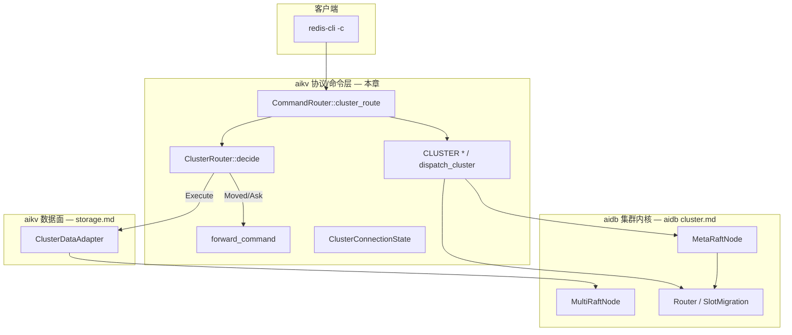
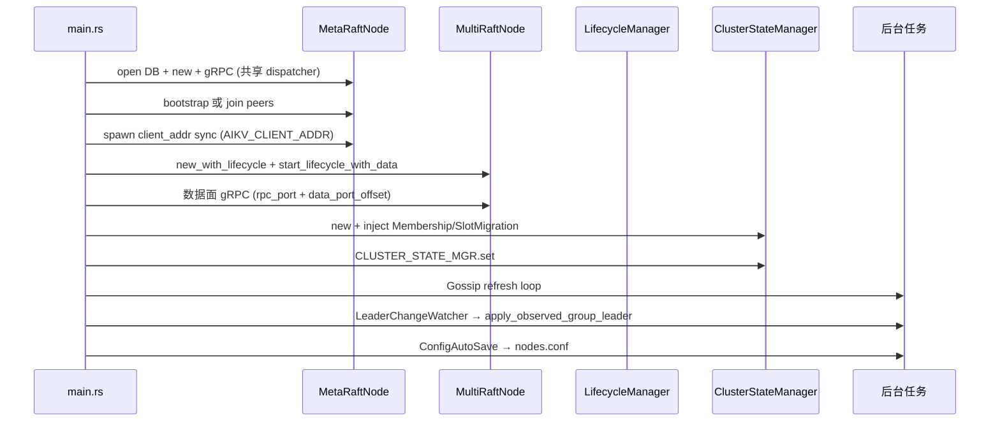
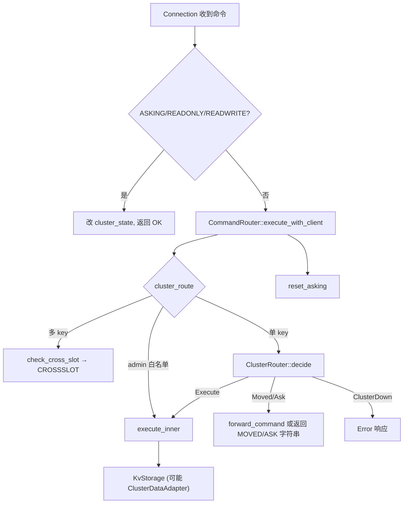
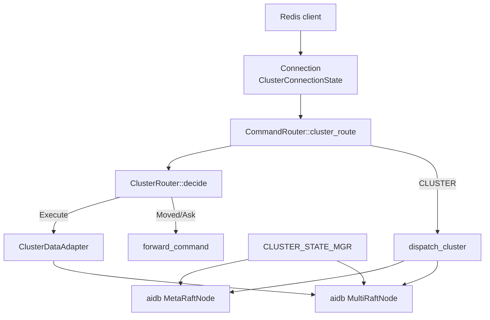
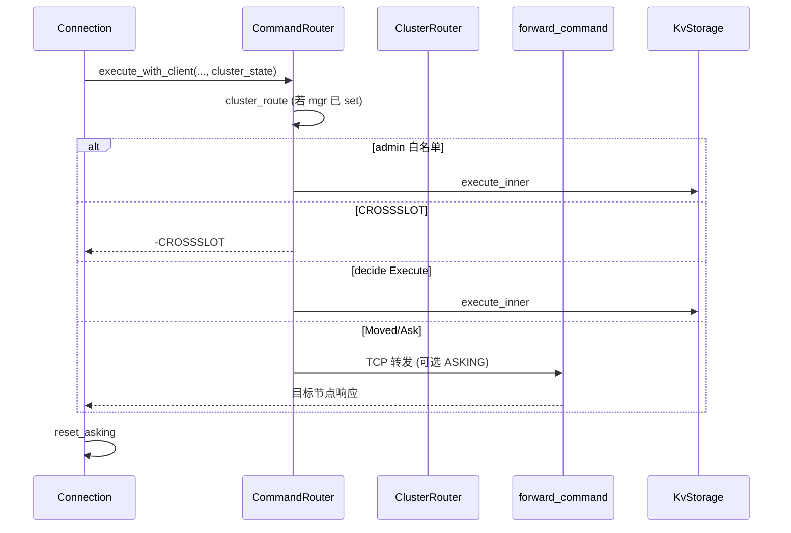

# Cursor transcript

---

## 1. User

## 文档整理 — 新会话

工作目录: `/root/code/database`

请先阅读 (不要跳过):
1. `AiKv-Workflow/backup/design.md` — 总规程
2. `AiKv-Workflow/backup/PROGRESS.md` — 当前进度
3. `AiKv-Workflow/backup/INDEX.md` — 本章索引 (若已有行则更新)

---

### 本次任务

| 项 | 值 |
|----|-----|
| PROGRESS 总步 | 11 |
| 目标文件 | `aikv/docs/modules/cluster.md` |
| 本次子步 | 从步 0 开始 |
| 对比深度 | **核心章逐段** (见 `design.md` — aikv `cluster` 为加深章) |

### 必须遵守

- **确认门控**: 步 0→1→2→3→4, 每步先讨论, 我确认后再下一步
- **步 4**: 先出 Module Skill 正文 **草稿**, 我确认后再写入 aidb/aikv、更新 INDEX/PROGRESS
- **Module Skill 基础模板**: frontmatter `name` + `description` (含 `Use when`); 见 `design.md`
- **过程只进 backup/**: INDEX; aidb/aikv 不写迁移历史
- **旧文档顺序**: `backup/{aidb,aikv}/` → `*-oldmain` → WiQunTools inventory 段 → wiqun-*
- **待核实**: module 一行引用; 详情写入 **当前仓库** 根目录 `ISSUES.md` (`aikv/ISSUES.md`)
- **步 4 落盘前**: 对照 create-skill Summary Checklist 自检 (见 `design.md`)

### 上下文 (上一章已完成)

- 步 10 ✅ [`aidb/docs/modules/observability.md`](aidb/docs/modules/observability.md) — metrics/register_into/tracing 索引; ISSUE-014~018
- **aidb modules 5/5 已全部 ✅** (engine → observability)
- 前置 module: [`aidb/docs/modules/cluster.md`](aidb/docs/modules/cluster.md) (MetaRaft/MultiRaft/Router/slot 迁移); [`aikv/docs/modules/storage.md`](aikv/docs/modules/storage.md) (AiDbEngine/cluster_adapter); [`commands-core.md`](aikv/docs/modules/commands-core.md) (Router)
- 本章覆盖 `aikv/src/cluster/*` + `command/cluster_commands`; MOVED/ASK/Gossip/failover/CLUSTER 子命令
- WiQunTools 查漏: `wiqun-kv-inventory` cluster 相关段

### 边界提示 (步 0 可细化)

- **本章**: aikv 侧 MOVED/ASK 重定向、Gossip、slot 视图、failover、CLUSTER 命令; 与 aidb cluster 的分工
- **不重复**: aidb Raft/MetaRaft 实现 → aidb cluster.md; `aidb_raft_*` 指标 → aidb observability.md
- **加深**: 关键文件逐段对照 oldmain (cluster adapter、cluster commands、MOVED 路径)

### 本次不要

- 不要跳过未确认的步骤
- 不要一次写多篇 module
- 不要修改 `design.md` / 流程, 除非我明确要求
- 不要 commit, 除非我明确要求

---

请从步 0 开始, 给出本步交付物, 等我确认。

---

## 2. Assistant

先阅读规程、进度与索引，并梳理 `aikv` 侧 cluster 相关代码范围，以便给出步 0 交付物。

---

## 3. Assistant

正在梳理 `aikv/src/cluster` 与相关命令的目录结构及前置 module 边界。

---

## 4. Assistant

# 步 0 — 定范围

**章节**: PROGRESS **步 11** · `aikv/docs/modules/cluster.md`  
**对比深度**: **关键文件逐段** (design.md 加深章)  
**前置 module** (已完成, 本章只交叉引用): [aidb cluster.md](../../aidb/docs/modules/cluster.md) · [aikv storage.md](../../aikv/docs/modules/storage.md) · [commands-core.md](../../aikv/docs/modules/commands-core.md)

---

## 1. 本章职责 (一句话)

aikv 侧 **Redis Cluster 协议适配层**: 从 aidb MetaRaft/MultiRaft 读取拓扑, 在 RESP 路径实现 **MOVED/ASK/CROSSSLOT**、连接态 **ASKING/READONLY/READWRITE**、**CLUSTER \*** 子命令、轻量 **Gossip** 渲染、**failover** 触发, 以及进程级 **init_cluster** 装配; **不做** Raft 共识与 slot 迁移状态机本身.

---

## 2. 代码范围

### 2.1 本章 **覆盖** (`src/`)

```shell
aikv/src/
├── cluster/                      # 本章主体 (feature cluster)
│   ├── mod.rs                    # 模块根; re-export aidb key_to_slot/extract_hash_tag
│   ├── announce.rs               # AIKV_CLUSTER_ANNOUNCE_MODE; MOVED/CLUSTER SLOTS 地址解析
│   ├── commands.rs               # CLUSTER 子命令 + dispatch_cluster (~1895 行)
│   ├── config_auto_save.rs       # MetaRaft version → nodes.conf 后台持久化
│   ├── connection.rs             # 每连接 ClusterConnectionState (asking/readonly)
│   ├── forward.rs                # MOVED/ASK 透明 TCP 转发 (单端点客户端)
│   ├── gossip.rs                 # GossipState; CLUSTER NODES flags/timestamps
│   ├── replication.rs            # INFO replication / CLUSTER NODES role 标签
│   ├── router.rs                 # ClusterRouter::decide; RouteDecision; CROSSSLOT
│   └── state.rs                  # ClusterStateManager + CLUSTER_STATE_MGR 全局单例
├── main.rs                       # init_cluster / CLI cluster_* 参数 (~L159–501)
├── command/
│   └── router.rs                 # cluster_route + dispatch "cluster" 子命令 (~L172–745)
├── server/
│   └── connection.rs             # ASKING/READONLY/READWRITE 连接级处理 (~L355)
└── (交叉引用, 正文不展开)
    ├── command/migrate.rs        # RESTORE 前 ASKING (slot 迁移目标)
    └── command/registry.rs       # cluster 命令元数据 (readonly/movablekeys)
```

> **路径勘误**: `design.md` 写 `command/cluster_commands`, 实际实现为 **`src/cluster/commands.rs`** (经 `cluster/mod.rs` 的 `mod commands` 导出 `dispatch_cluster` 等). 无独立 `command/cluster_commands.rs`.

**构建**: `Cargo.toml` — `cluster = ["aidb/cluster"]`; 需 `--features cluster` + aidb 侧 `protoc`.

### 2.2 本章 **不覆盖** (交叉引用即可)

| 域 | 归属 module | 本章只写 |
|----|-------------|----------|
| MetaRaft / MultiRaft / Router 实现 / slot 迁移 SM / gRPC | [aidb cluster.md](../../aidb/docs/modules/cluster.md) | 「委托 aidb API」+ pub 类型名 |
| 数据面 `propose_group` / `ClusterDataAdapter` 读写 | [storage.md](../../aikv/docs/modules/storage.md) | MOVED 决策 vs 本地 Raft 写 的分工边界 |
| `CommandRouter` 通用 dispatch / KeyLock / registry | [commands-core.md](../../aikv/docs/modules/commands-core.md) | `cluster_route` 插入点 + admin 白名单 |
| MIGRATE TCP / RESTORE 语义 | [commands-extended.md](../../aikv/docs/modules/commands-extended.md) | ASKING + IMPORTING slot 衔接 |
| `aikv_cluster_redirects_total` / `aikv_failover_total` / INFO cluster 段 | observability (步 12) | 一行指向 metrics 名 |
| `aidb_raft_*` 指标 | [aidb observability.md](../../aidb/docs/modules/observability.md) | 不写 |

### 2.3 与前置 module 的分工边界



- **MOVED/ASK**: 由 `cluster/router.rs` + `command/router.rs::cluster_route` 决策; 可选 `forward.rs` 代发.
- **实际 KV 读写**: slot 已分配时经 `ClusterDataAdapter` → aidb MultiRaft (storage.md 已述 invariant).
- **CLUSTER MEET/FORGET/SETSLOT/CREATEGROUP 等**: `cluster/commands.rs` 调 aidb `MembershipCoordinator` / `SlotMigrationManager` / MetaRaft propose.

---

## 3. 拟读文件列表 (步 1–3 按此顺序)

### 3.1 当前 aikv 源码 (步 1 主读)

| 优先级 | 文件 | 行数 | 关注点 |
|--------|------|------|--------|
| P0 | `cluster/state.rs` | 133 | `CLUSTER_STATE_MGR`, 初始化/refresh, membership/slot_migration 注入 |
| P0 | `cluster/router.rs` | 211 | `RouteDecision`, IMPORTING+ASKING, readonly replica, cache refresh |
| P0 | `cluster/commands.rs` | 1895 | 各 CLUSTER 子命令; `dispatch_cluster`; `cluster_failover`; nodes.conf |
| P0 | `command/router.rs` (cluster 段) | ~120 | `cluster_route`, admin 白名单, CROSSSLOT, MOVED/ASK+forward |
| P0 | `main.rs` (cluster 段) | ~350 | `init_cluster` 15 步装配: MetaRaft→MultiRaft→Lifecycle→Gossip→Watcher→AutoSave |
| P1 | `cluster/forward.rs` | 116 | ASKING 前缀 + RESP 转发超时 |
| P1 | `cluster/announce.rs` | 200 | Fixed vs UnknownEndpoint; MOVED 地址 |
| P1 | `cluster/connection.rs` | 38 | per-conn asking/readonly |
| P1 | `cluster/gossip.rs` | 100 | 后台 ping; **不** 决策 PFAIL/FAIL |
| P1 | `cluster/config_auto_save.rs` | 92 | nodes.conf 自动写 |
| P2 | `cluster/replication.rs` | 84 | INFO/CLUSTER NODES role |
| P2 | `server/connection.rs` (cluster) | ~20 | ASKING/READONLY/READWRITE |
| P2 | `command/migrate.rs` (ASKING) | ~10 | 与 SETSLOT IMPORTING 衔接 |
| P2 | `command/registry.rs` (cluster) | ~5 | 元数据 |
| 边界 | `storage/cluster_adapter.rs` | 489 | 步 3 逐段对照 MOVED 路径 vs 数据面写 (storage.md 已写, 本章补协议侧) |

### 3.2 测试 / 示例 (步 1 辅助)

| 路径 | 用途 |
|------|------|
| `tests/cluster_*.rs` (6 个) | routing / commands / integration / creategroup / skeleton |
| `examples/cluster.rs` | 对外 API 示例 |
| `e2e/test_cluster_*.sh` (9 个) | 形成/路由/failover/slots/announce 等 |
| `tests/fixtures/redis7_cluster_info_p0_fields.txt` | CLUSTER INFO 字段兼容 |

### 3.3 旧文档 (步 2)

| 顺序 | 来源 | 路径 |
|------|------|------|
| 1 | backup/aikv | `ARCHITECTURE.md`, `DESIGN.md`, `CHANGELOG.md` (cluster 相关段) |
| 2 | aikv-oldmain | `docs/development/architecture/03-cluster.md`, `docs/development/api/02-cluster-api.md`, `docs/archive/CLUSTER_REFACTORING_SUMMARY.md` |
| 3 | WiQunTools | `docs/wiqun-kv-inventory/07-cluster-protocol.md` (+ plans `2026-05-27-wiqun-kv-cluster-protocol.md`) |
| 4 | wiqun-kv | `src/cluster/*` (查漏, 与 aikv 重叠时二选一) |

### 3.4 旧代码 (步 3 逐段对照 — 加深清单)

| 新代码 (P0) | oldmain 对照 | 预期差异方向 |
|-------------|--------------|--------------|
| `cluster/commands.rs` | `aikv-oldmain/src/cluster/commands.rs` | 子命令集、CREATEGROUP/REBALANCE 等扩展 |
| `cluster/router.rs` + `forward.rs` | oldmain 无独立 router (可能在 command 层) | MOVED/ASK 决策拆分 |
| `main.rs::init_cluster` | oldmain `cluster/node.rs`, `raft_service.rs` | 旧版 cluster_raft 单体 vs 委托 aidb |
| `command/router.rs::cluster_route` | oldmain command 层 | CommandExecutor → Router |
| `storage/cluster_adapter.rs` | `aikv-oldmain/src/storage/cluster_raft.rs` | 数据面包装位置变化 |

oldmain `src/cluster/` 仅 4 文件 (`mod`, `commands`, `node`, `raft_service`) — 重构后 **协议层扩至 10 文件 + 数据面 adapter 独立**.

---

## 4. 已知 ISSUES 交叉 (步 2–3 可能新增)

| 已有 | 与本章关系 |
|------|-----------|
| ISSUE-004 | `cluster_route` 预留 `msetnx` dead branch — 本章「待核实」可引用 |
| ISSUE-006/010 | MIGRATE + cluster ASKING — 交叉引用 commands-extended |
| (无 cluster 专属 ISSUE) | 步 2–3 预计新增 failover 语义、Gossip vs Raft 故障检测、announce 模式等 |

---

## 5. 拟写入 INDEX 的本章行 (确认步 0 后更新 backup/INDEX.md)

| 新文档章节 | 状态 | 参考的旧文档 (拟) | 处理 | 备注 |
|------------|------|-------------------|------|------|
| `docs/modules/cluster.md` | 🔄 步 0 | backup/aikv {ARCH,DESIGN}; WiQunTools 07-cluster-protocol; aikv-oldmain 03-cluster + api/02-cluster; wiqun-kv cluster (查漏) | — | `cluster/*` + `commands.rs`; 加深 router/commands/forward/init_cluster; 与 aidb cluster/storage 分工 |

---

## 6. 步 4 预览 (frontmatter 草案, 非落盘)

```yaml
name: aikv-cluster
description: AiKv Redis Cluster protocol — MOVED/ASK/CROSSSLOT routing, CLUSTER subcommands, Gossip display, failover, init_cluster wiring to aidb MetaRaft/MultiRaft. Use when changing src/cluster/*, command/router cluster_route, debugging redirects, CLUSTER MEET/SETSLOT/FAILOVER, or cluster feature init in main.rs.
```

---

## 7. 待你确认

1. **范围**: §2.1 覆盖 + §2.2 不覆盖 + 分工图是否 OK?
2. **路径勘误**: `cluster/commands.rs` 替代 design 中的 `command/cluster_commands` — 是否接受?
3. **`storage/cluster_adapter.rs`**: 步 3 逐段对照纳入 (协议↔数据面边界), 正文仍以 storage.md 为主 — 是否 OK?
4. **拟读列表** §3: 有无需增删的文件 (如 `server/info.rs` cluster 段仅 observability 一步再深读)?

回复 **「可以」** 或调整意见后, 我再进入 **步 1** (读新代码, 产出职责/代码地图/主流程 bullet 草稿).  
步 0 确认前 **不写** backup/INDEX、不修改 aidb/aikv 正文.

---

## 5. User

可以

---

## 6. Assistant

步 0 已确认。开始步 1：通读当前 aikv cluster 源码，梳理职责、代码地图与主流程要点。

---

## 7. Assistant

# 步 1 — 读新代码 (讨论稿)

基于当前 `aikv` 源码 (`--features cluster`) 梳理, **未落盘**.

---

## 1. 模块职责

aikv cluster 是 **RESP 侧的 Redis Cluster 适配层**, 不持有独立共识状态:

| 职责 | 实现位置 | 委托 |
|------|----------|------|
| 进程启动时装配 MetaRaft/MultiRaft/Router | `main.rs::init_cluster` | aidb cluster |
| 全局拓扑与路由缓存 | `ClusterStateManager` + `CLUSTER_STATE_MGR` | MetaRaft 读 + aidb `Router` |
| 普通命令 MOVED/ASK/CROSSSLOT | `command/router.rs::cluster_route` → `ClusterRouter::decide` | slot 算法 → aidb `key_to_slot` |
| 服务端透明转发 (单端点) | `forward.rs` | 自研 TCP RESP 客户端 |
| CLUSTER 子命令 | `cluster/commands.rs::dispatch_cluster` | `MembershipCoordinator` / `SlotMigrationManager` / MetaRaft propose |
| 连接态 ASKING/READONLY/READWRITE | `connection.rs` + `server/connection.rs` | 纯本地 |
| 客户端地址通告 | `announce.rs` | env `AIKV_CLUSTER_ANNOUNCE_MODE` |
| Gossip 展示 | `gossip.rs` | **仅** 从 MetaRaft 刷新; 不做 PFAIL/FAIL 决策 |
| nodes.conf 自动持久化 | `config_auto_save.rs` | `save_nodes_conf` |
| 数据面 KV 写 | `storage/cluster_adapter.rs` | MultiRaft `propose_group` (见 storage.md) |

**核心 invariant**: `CLUSTER_STATE_MGR` 未 `set` 前, 普通 key 命令走 `cluster_route` 时若 mgr 存在才介入; mgr 不存在则跳过 cluster 路由. 集群已 init 但 slot 未分配 → `ClusterDown`. slot 已分配时写 **禁止** local fallback (在 adapter 层, storage.md).

---

## 2. 代码地图

| 路径 | 职责 | 入口 |
|------|------|------|
| `cluster/mod.rs` | 模块根; re-export `key_to_slot`/`extract_hash_tag` | `pub mod cluster` (`lib.rs`) |
| `cluster/state.rs` | 全局单例; leader 缓存; membership/slot_migration 注入 | `CLUSTER_STATE_MGR`, `ClusterStateManager::new` |
| `cluster/router.rs` | 同步路由决策 | `ClusterRouter::decide`, `check_cross_slot` |
| `cluster/forward.rs` | MOVED/ASK TCP 转发; EVAL 路由 key 提取 | `forward_command`, `cluster_routing_key` |
| `cluster/connection.rs` | 每连接 asking/readonly | `ClusterConnectionState` |
| `cluster/announce.rs` | MOVED/CLUSTER SLOTS 地址格式; 内部转发 TCP 地址 | `AnnounceResolver` |
| `cluster/commands.rs` | 全部 CLUSTER 子命令 + `dispatch_cluster` | `cluster_meet`, `cluster_set_slot`, `cluster_failover`, … |
| `cluster/gossip.rs` | 后台 tick 刷新节点列表 | `GossipState`, `start_background_refresh` |
| `cluster/config_auto_save.rs` | MetaRaft version 变化 → `nodes.conf` | `ConfigAutoSave::run` |
| `cluster/replication.rs` | HELLO/INFO role 标签 | `node_replication_role` |
| `command/router.rs` | 命令前置 cluster 路由 + `CLUSTER` dispatch | `cluster_route`, `execute_with_client` |
| `server/connection.rs` | ASKING/READONLY/READWRITE; 传 `cluster_state`; 每命令后 `reset_asking` | `Connection::run` |
| `main.rs` | CLI cluster 参数; `init_cluster`; `build_storage` 包 ClusterDataAdapter | `init_cluster`, `spawn_client_addr_sync` |

---

## 3. 关键类型 (跨模块 pub 面)

```rust
// 路由
RouteDecision { Execute | Moved { slot, node_id, addr } | Ask {..} | ClusterDown(msg) }
CommandType { Read, Write, Admin }

// 全局状态
ClusterStateManager { router, meta_raft, multi_raft, node_id, membership_coordinator,
                      slot_migration_manager, importing_slots, announce_resolver, ... }
static CLUSTER_STATE_MGR: OnceLock<Arc<ClusterStateManager>>

// 连接
ClusterConnectionState { asking, readonly }

// 通告
AnnounceMode { Fixed, UnknownEndpoint }  // 默认 UnknownEndpoint (Redis 7 `:port`)

// Gossip (展示用)
GossipState, GossipNodeEntry, NodeStatus { Ok, PFail, Fail }
```

Re-export (examples/外部): `aidb::cluster::{extract_hash_tag, key_to_slot}`.

---

## 4. 主流程

### 4.1 进程启动 (`init_cluster`, 18 步)



要点:
- **双 gRPC 端口**: MetaRaft `rpc_addr`; MultiRaft `rpc_port + cluster_data_port_offset` (默认 +10000).
- **共享 `RaftServiceDispatcher`**: Meta 端口也能路由数据 group Raft RPC.
- **`AIKV_CLIENT_ADDR`**: 后台 propose `UpdateNodeClientAddr` 到 MetaRaft.
- watcher/auto_save 的 shutdown sender 存于 `ClusterStateManager`, 防止 task 提前退出.

### 4.2 普通命令路径



**admin 白名单** (不经 slot 路由): `cluster`, `ping`, `migrate`, `scan`/`hscan`/…, `info`, `readonly`/`asking`, 等 (~20 个).

**读 replica**: `readonly=true` + `CommandType::Read` + 本地 group → 本地执行 (不 MOVED).

**迁移窗口**:
- 源节点 `SlotStatus::Migrating` → 写 → **ASK** 目标 leader.
- 目标节点 `IMPORTING` + `ASKING` 或 `importing_slots` → **Execute** (MIGRATE RESTORE).
- `importing_slots` 由 `CLUSTER SETSLOT IMPORTING` 写入本地 map.

**透明转发**: MOVED/ASK 时 `forward_command` 先连目标; ASK 路径先发 `ASKING`. 失败则退回 `-MOVED slot addr` 字符串. 内部 TCP 用 `AnnounceResolver::tcp_connect_addr` (rpc host + client port).

### 4.3 CLUSTER 子命令 (按类)

| 类 | 子命令 | 行为摘要 |
|----|--------|----------|
| 只读 | `KEYSLOT`, `MYID`, `INFO`, `NODES`, `SLOTS`, `SHARDS`, `MYSHARDID`, `COUNTKEYSINSLOT`, `GETKEYSINSLOT`, `REPLICAS` | 读 MetaRaft/Router; NODES 用 group leader 判 master/slave |
| 成员 | `MEET`, `FORGET [FORCE]` | `MembershipCoordinator`; MEET 重试 NotLeader (10 次退避) |
| Slot | `ADDSLOTS [NODE id]`, `DELSLOTS`, `SETSLOT MIGRATING/IMPORTING/NODE/STABLE` | MetaRaft propose 或 `SlotMigrationManager` / 本地 `importing_slots` |
| 副本/组 | `REPLICATE`, `CREATEGROUP`, `ADD_REPLICA`, `DEL_REPLICA`, `REBALANCE` | MetaRaft/MultiRaft 成员变更; **扩展命令** (非标准 Redis 全子集) |
| 运维 | `FAILOVER [FORCE\|TAKEOVER]`, `SAVECONFIG`, `BUMPEPOCH` | replica 上 `change_group_membership` 升主; nodes.conf |
| Stub | `SET-CONFIG-EPOCH` → OK; `COUNT-FAILURE-REPORTS` → 0 | 兼容 redis-cli |

`map_propose_error`: NotLeader → MOVED 0 addr 或 CLUSTERDOWN.

### 4.4 Failover (aikv 侧重)

`CLUSTER FAILOVER FORCE|TAKEOVER`:
1. 要求本地 `ReplicationRole::Replica` (由 `CLUSTER REPLICATE` 设置, **仅元数据**).
2. 找本节点所在 group → `multi_raft.change_group_membership(gid, [self])`.
3. 本地 role 改 Primary; metrics `on_failover`.

**限制** (代码注释): `REPLICATE` 不触发真实 MultiRaft 副本数据服务; replica 读路径依赖 `readonly` + 本地 group.

---

## 5. 配置与环境变量

| 项 | 位置 | 说明 |
|----|------|------|
| `feature cluster` | `Cargo.toml` | 启用 `aidb/cluster` + 全部 `#[cfg(feature = "cluster")]` |
| `--cluster-node-id`, `--cluster-rpc-addr`, `--cluster-peers`, … | `main.rs` CLI | 见 `init_cluster` 参数 |
| `AIKV_CLIENT_ADDR` | env | 外部 client 地址 → MetaRaft |
| `AIKV_CLUSTER_ANNOUNCE_MODE` | env | `fixed` / `unknown` (默认) |
| `cluster_data_port_offset` | CLI, 默认 10000 | MultiRaft 总线端口 |
| gossip / lifecycle / config_auto_save 间隔 | CLI | 传入 `init_cluster` |

---

## 6. 测试入口

```bash
# 单元/集成 (需 cluster feature)
cargo test --features cluster cluster_ -- --test-threads=1
cargo test --features cluster -p aikv --test cluster_integration
cargo test --features cluster -p aikv --test cluster_routing
cargo test --features cluster -p aikv --test cluster_commands
cargo test --features cluster -p aikv --test cluster_creategroup

# e2e (脚本)
e2e/test_cluster_formation.sh
e2e/test_cluster_routing.sh
e2e/test_cluster_failover.sh
# … 共 9 个 test_cluster_*.sh
```

`announce.rs`, `router.rs`, `forward.rs` 含单元测试; `ConfigAutoSave` 依赖完整 Raft 栈, 主要靠 e2e.

---

## 7. 步 1 小结 (供步 2–3 关注)

1. **Gossip 是展示层**: 故障检测在 MetaRaft Raft 心跳; CLUSTER NODES 的 PFAIL/FAIL 多为静态/占位.
2. **双路径重定向**: 客户端 `-MOVED` vs 服务端 `forward_command` (单端点模式).
3. **扩展子命令**: `CREATEGROUP`/`ADD_REPLICA`/`REBALANCE` 等是 AiDb 运维模型, 非 Redis 标准全集.
4. **`commands.rs` 体量 ~1900 行**: 步 4 可考虑「常见任务」分块, 详表链 reference 或按子命令分组.
5. **与 storage 交界**: `cluster_route` 决定「是否本地执行」; 本地 Execute 后写路径仍由 `ClusterDataAdapter` 走 Raft.

---

请确认步 1 是否 **可以** 进入 **步 2** (查旧文档: backup/aikv → oldmain → WiQunTools 07 → wiqun-kv).  
若有范围/表述需调整, 请指出.

---

## 8. User

可以

---

## 9. Assistant

步 1 已确认。开始步 2：按顺序查阅旧文档并分类。

---

## 10. Assistant

# 步 2 — 查旧文档 (讨论稿)

按 `design.md` 顺序查阅完毕. **未写入** `INDEX` / `aikv/ISSUES.md`, 等你确认.

---

## 1. 旧文档清单与分类

| 顺序 | 来源 | 路径 | 分类 | 处理建议 |
|------|------|------|------|----------|
| 1 | **backup/aikv** | `README.md` §集群 | **部分过时** | 「Gossip 发现」、`--cluster-mode`/`--node-id` 启动示例与现 CLI 不符; MOVED/ASK/子命令列表仍可用 |
| 1 | backup/aikv | `ARCHITECTURE.md` §cluster | **部分过时** | 文件名错: `cluster_commands.rs`→`cluster/commands.rs`, `connection_state.rs`→`connection.rs`; 数据流主干仍有效 |
| 1 | backup/aikv | `CHANGELOG.md` cluster 段 | **仍有效** | 与现码高度一致 (AnnounceResolver, ClusterDataAdapter, SETSLOT/MIGRATE, LeaderChangeWatcher 等); 作变更史查漏 |
| 1 | backup/aikv | `CONTRIBUTING.md` §test-cluster | **仍有效** | `cargo test --features cluster` 命令仍对 |
| 1 | backup/aikv | `docs/superpowers/plans/2026-06-05-cluster-client-announce.md` | **仍有效** | 与 `announce.rs` 实现一致 |
| 1 | backup/aikv | `DESIGN.md` | **无有效 cluster 细节** | 仅 feature 对齐一句; 跳过 |
| 1 | backup/aikv | `ARCHITECTURE.md` 完整 tree | **部分过时** | `memory_engine.rs`/`persistence/` 等旧布局; cluster 小节可抽, 不整篇回迁 |
| 2 | **aikv-oldmain** | `docs/development/architecture/03-cluster.md` | **部分仍有效** | Raft vs Gossip、MEET 延迟、slot 分配排障 **仍对**; `CLUSTER RESET`、`aikv-tool`、`CLUSTER METARAFT` **现码无** |
| 2 | aikv-oldmain | `docs/development/api/02-cluster-api.md` | **大部分过时** | 旧 API 名 (`MigrationManager`, `meta_raft.add_node`, `multi_raft.put`); METARAFT 映射、自动 FAILOVER 描述 **不符现实现** |
| 2 | aikv-oldmain | `docs/archive/CLUSTER_REFACTORING_SUMMARY.md` | **历史** | 810 行/87% 缩减背景; 现 `commands.rs` ~1900 行, 仅作重构脉络 |
| 2 | aikv-oldmain | `src/cluster/{mod,node,commands,raft_service}.rs` | **对照用 (步 3)** | 4 文件单体 glue → 现 10 文件 + `main::init_cluster` |
| 2 | aikv-oldmain | `src/server/connection.rs` CLUSTER METARAFT | **已移除** | 子命令在 connection 层 inline; 重构后删除 |
| 3 | **WiQunTools** | `docs/wiqun-kv-inventory/07-cluster-protocol.md` | **结构仍有效** | `ClusterStateManager`/`RouteDecision`/admin 白名单/轻量 Gossip **与现码一致**; **PING/PONG 循环、PFAIL 检测、Gossip 节点发现** 为设计稿, **未实现** |
| 3 | WiQunTools | `docs/superpowers/plans/2026-05-27-wiqun-kv-cluster-protocol.md` | **历史计划** | 07-inventory 已 supersede |
| 3 | WiQunTools | `docs/superpowers/plans/2026-05-29-audit-plan-C3-cluster-tests.md` | **查漏** | 测试覆盖参考, 不迁入 |
| 4 | **wiqun-kv** | `src/cluster/*` (10 文件) | **与 aikv 同构** | 查漏无额外 module; 步 3 二选一即可 |

**当前 `AGENTS.md` 漂移** (非 backup, 步 4 修正): 写「GossipState 刷新 CLUSTER NODES 展示」, 但 `cluster_nodes()` **只读 MetaRaft**, 未读 `GossipState`.

---

## 2. 旧文档 vs 现码 — 关键结论

### 仍有效 (应写入 module)

- 适配层职责: MetaRaft/MultiRaft 权威, aikv 做 RESP + MOVED/ASK + CLUSTER 子命令.
- `CLUSTER_STATE_MGR` 未 set → `CLUSTERDOWN`; 初始化顺序见 `init_cluster`.
- Admin 白名单、CROSSSLOT、EVAL 首 key 路由、透明 `forward_command`.
- `AnnounceResolver` + `AIKV_CLUSTER_ANNOUNCE_MODE` / `AIKV_CLIENT_ADDR`.
- 扩展运维子命令: `CREATEGROUP`, `ADD_REPLICA`, `DEL_REPLICA`, `REBALANCE` (CHANGELOG 有记录).
- Gossip **设计意图**: 轻量、故障判定在 MetaRaft (WiQunTools §设计决策 与 `gossip.rs` 注释一致).

### 已过时 (不迁入 module 正文)

- oldmain `02-cluster-api`: 直接 `multi_raft.put/get` 作为命令路径 (现为 `ClusterDataAdapter` + `CommandRouter`).
- oldmain `CLUSTER METARAFT *` 在 aikv RESP 层暴露 (现无; MetaRaft 运维见 aidb cluster.md / gRPC).
- backup README: 「Gossip 发现」、旧 CLI flags.
- backup ARCHITECTURE: 文件路径/目录树.
- inventory 全文 PING/PONG Gossip 主循环 (现仅 `refresh_from_meta` tick).

### 设计偏离 / 待核实 (拟 ISSUES)

见 §3.

---

## 3. 拟新增 `aikv/ISSUES.md` 条目 (确认步 2 后写入)

| ID | 标题 | 状态建议 | 依据 |
|----|------|----------|------|
| **ISSUE-013** | `CLUSTER INFO` 恒输出 `cluster_state:ok` | **open** | 现码 `cluster_info()` 硬编码; oldmain 03-cluster 称 slot 未满应为 `fail`; `redis-cli --cluster check` 可能误判 |
| **ISSUE-014** | `GossipState` 后台刷新但未接入 `CLUSTER NODES` | **open** | `main.rs` spawn tick → 写 `GossipState` + metrics; `cluster_nodes()` 不读 gossip; AGENTS/inventory 表述与实现不一致 |
| **ISSUE-015** | `CLUSTER METARAFT *` 子命令已移除 | **doc-only** | oldmain `connection.rs` 有 ADDLEARNER/PROMOTE/MEMBERS/STATUS; 现 `dispatch_cluster` 无; 文档指向 aidb 运维 |
| **ISSUE-016** | `CLUSTER RESET` 未实现 | **open** | oldmain 03-cluster 排障脚本依赖; 现码无 |
| **ISSUE-017** | `CLUSTER REPLICATE` 仅本地 `ReplicationRole` 元数据 | **doc-only** | `commands.rs` 注释: 不触发 MultiRaft 副本数据服务; FAILOVER 依赖此前 REPLICATE |
| **ISSUE-018** | `CLUSTER FAILOVER` 仅 FORCE/TAKEOVER 手动升主 | **doc-only** | 无 Redis 标准选举等待; oldmain api 称「openraft 自动」已不适用 |
| **ISSUE-019** | `SET-CONFIG-EPOCH` / `COUNT-FAILURE-REPORTS` 为 stub | **doc-only** | `dispatch_cluster` 直接 OK/0; 兼容 redis-cli |

**已有交叉引用** (本章 module 一行引用, 不新建):

- [ISSUE-004](../../aikv/ISSUES.md#ISSUE-004) — `cluster_route` 预留 `msetnx`.

---

## 4. 步 3 加深对照 — 优先文件 (预告)

| 新代码 | oldmain / 旧文档 | 关注点 |
|--------|------------------|--------|
| `cluster/router.rs` + `forward.rs` | oldmain 路由在 command/connection | MOVED/ASK/IMPORTING 行为是否等价 |
| `cluster/commands.rs` | oldmain `cluster/commands.rs` + connection METARAFT | 子命令集 diff |
| `main.rs::init_cluster` | oldmain `cluster/node.rs` + `raft_service.rs` | 双 gRPC + shared dispatcher |
| `command/router.rs::cluster_route` | oldmain connection inline | admin 白名单、透明转发 |
| `storage/cluster_adapter.rs` | oldmain `storage/cluster_raft.rs` | 数据面 Raft 包装 (边界) |

---

## 5. 拟更新 INDEX 行 (步 4 一并落盘)

| 字段 | 内容 |
|------|------|
| 参考 | backup/aikv {README, ARCHITECTURE, CHANGELOG, announce plan}; WiQunTools 07; oldmain 03-cluster + api/02-cluster (过时段); wiqun-kv cluster (查漏) |
| 备注 | ISSUE-013~019; 加深 router/commands/forward/init_cluster |

---

请确认步 2 **可以** 进入 **步 3** (oldmain 代码逐段对照).

若同意, 我将:
1. 把 ISSUE-013~019 写入 `aikv/ISSUES.md` (按你确认的条目; 可删改状态).
2. 开始步 3 差异表.

若有 ISSUE 条目要合并、降级或补充, 请一并说明.

---

## 11. User

可以

---

## 12. Assistant

步 2 已确认。正在写入 ISSUES，并对照 oldmain 核心文件做步 3 逐段对比。

---

## 13. Assistant

# 步 3 — 对比旧代码 (讨论稿)

已写入 `aikv/ISSUES.md` **ISSUE-013 ~ ISSUE-019**. 以下为 oldmain / wiqun-kv 与现码的 **关键文件逐段** 对照.

---

## 1. 模块级差异总表

| 维度 | oldmain (`aikv-oldmain`) | 现码 (`aikv`) | 文档应如何写 |
|------|--------------------------|---------------|--------------|
| **模块布局** | `cluster/{commands,node,raft_service}` + connection 内 METARAFT | `cluster/*` 10 文件 + `main::init_cluster` | 以现目录为准; 不提 `ClusterNode`/`raft_service` |
| **初始化** | `ClusterNode::initialize` → 固定 `num_groups` + 手动 `create_data_groups` | `LifecycleManager` 按 slot 自动建/毁 group; 双 gRPC + shared dispatcher | 「进程启动」专节写 `init_cluster` 18 步 |
| **全局状态** | `ClusterCommands` 持有 meta/multi/router | `CLUSTER_STATE_MGR` + `ClusterStateManager` | 强调 OnceLock; set 前 cluster 路由行为 |
| **路由层** | `ClusterCommands::check_key_slot*` (~commands.rs L3724+) | `ClusterRouter::decide` + `command/router::cluster_route` | 分两节: 决策 vs 命令前置 |
| **MOVED 响应** | 返回 `-MOVED`/`-ASK` 给客户端 | **先** `forward_command` 透明转发, 失败再 MOVED 字符串 | 写「双模式: smart client vs 单端点转发」 |
| **数据面写** | `storage/cluster_raft.rs` 直绑 `MultiRaftNode` + `physical_raft_storage_key` | `storage/cluster_adapter.rs` 包 `StorageAdapter` + `propose_group` | 交叉引用 storage.md; 不写 oldmain key 编码 |
| **CLUSTER 命令** | `ClusterCommands` 单体 ~4000 行; NotLeader → **转发到 MetaRaft leader** (redis 客户端) | `dispatch_cluster`; MEET 本地 `MembershipCoordinator` + NotLeader 重试 | 子命令表按现 `dispatch_cluster` |
| **METARAFT** | connection.rs inline 5+ 子命令 | **无** | 指向 aidb cluster.md (ISSUE-015) |
| **扩展运维** | `ADDSLOTSRANGE`, `ADDREPLICATION` | `CREATEGROUP`, `ADD_REPLICA`, `DEL_REPLICA`, `REBALANCE` | 标「AiKv 扩展」; 不写 ADDSLOTSRANGE |
| **Gossip** | 设计稿级 (inventory) | 仅 MetaRaft refresh tick, 无 PING/PONG | 轻量 Gossip; 故障在 MetaRaft (ISSUE-014) |
| **cluster_info** | 动态 `ok`/`fail` | 恒 `ok` | 已知限制 + ISSUE-013 |

---

## 2. 关键文件逐段对照

### 2.1 `cluster/router.rs` + `command/router.rs` (MOVED 路径)

| 段落 | oldmain | 现码 | 等价? |
|------|---------|------|-------|
| slot 计算 | `key_to_slot_with_hash_tag` (commands 内) | `aidb::key_to_slot` re-export | ✅ |
| Assigned, 非本地 leader | `AikvError::Moved` | `RouteDecision::Moved` → forward 或 MOVED | ✅ 语义; **行为增强** (转发) |
| Migrating 源节点写 | ASK 到目标 leader | `leader_ask` → 同 | ✅ |
| IMPORTING 目标写 | `allow_importing` (ASKING 一次性 flag) | `asking \|\| importing_slots` + `importing_slots` 写短路 | ✅ 更强 (SETSLOT 本地 map) |
| Unallocated | CLUSTERDOWN | refresh 重试后 CLUSTERDOWN | ≈ |
| cache 过期 | 读 `meta.slots` 直查 | `Router` cache + `refresh_router_cache` 一次 | ✅ 架构不同, 意图同 |
| CROSSSLOT | connection/executor 层 | `check_cross_slot` + `is_multi_key_cmd` | ✅ |
| readonly replica 读 | `check_slot_ownership_with_asking(..., readonly)` | `should_execute_locally` Read+readonly | ✅ |

**文档建议**: MOVED 流程图画两条路径 (client 收 MOVED vs server forward); IMPORTING 三联: SETSLOT → `importing_slots` → MIGRATE ASKING (链 commands-extended).

---

### 2.2 `cluster/commands.rs` (CLUSTER 子命令)

| 子命令/能力 | oldmain | 现码 | 备注 |
|-------------|---------|------|------|
| INFO/NODES/SLOTS/SHARDS | `ClusterCommands::*` | 同名函数 + MetaRaft | NODES 现用 group leader 判 master/slave (CHANGELOG 已修) |
| **cluster_state** | 16384 + leader 检查 → ok/fail | **恒 ok** | **回归** ISSUE-013 |
| MEET/FORGET | meta 直调 + leader 转发 | `MembershipCoordinator` + MEET 退避 | API 层变化, 对外仍 OK |
| ADDSLOTS | 可 ADDSLOTSRANGE | 仅 ADDSLOTS; 无 RANGE | redis-cli `--cluster create` 多用 ADDSLOTS, 一般够 |
| SETSLOT | 常转发 leader | 本地 `SlotMigrationManager` + `importing_slots` | 现码更自洽 |
| FAILOVER | Default/Force/Takeover + leader 转发 | 仅 FORCE/TAKEOVER 本地 | ISSUE-018 |
| REPLICATE | 调 membership 路径 | 仅写 `ReplicationRole` | ISSUE-017 |
| METARAFT * | connection + commands 转发 | 无 | ISSUE-015 |
| RESET | (排障 doc 引用) | 无 | ISSUE-016 |
| BUMPEPOCH | 实现 | MetaRaft propose | ✅ |
| **CREATEGROUP/REBALANCE/ADD_REPLICA** | 无 / 部分 ADDREPLICATION | 有 | 扩展命令, module 单列 |
| Leader 转发 | 大量子命令非 leader 时 redis-forward | `map_propose_error` → MOVED 0 | 行为变化: 客户端可能收到 MOVED 0 |

**文档建议**: 子命令分三表 — Redis 标准 / AiKv 扩展 / 未实现(stub); NotLeader 统一说明为 MOVED 0 或 MEET 重试.

---

### 2.3 `main.rs::init_cluster` vs oldmain `cluster/node.rs`

| 步骤 | oldmain `ClusterNode` | 现码 `init_cluster` |
|------|----------------------|---------------------|
| DB | `use_wal(false)` cluster 路径 | `use_wal(true)` 必须 |
| MetaRaft | `multi_raft.init_meta_raft` | 独立 `MetaRaftNode::new` |
| Bootstrap | `initialize_meta_cluster(initial_members)` | `initialize_with_client` + peers 自动发现 |
| MultiRaft | `MultiRaftNode::new` 同步创建 N groups | `new_with_lifecycle` + tick 按需建 group |
| gRPC | 单一模型 | Meta 端口 + data_port_offset 第二端口 + **共享 dispatcher** |
| 后台 | 无 gossip/watcher/autosave | Gossip tick + LeaderChangeWatcher + ConfigAutoSave |
| client_addr | 配置内 | `AIKV_CLIENT_ADDR` 后台 propose |

**文档建议**: 「常见任务 — 启动集群节点」以现 CLI/env 为准; 不写 `num_groups`/`ClusterConfig`.

---

### 2.4 `storage/cluster_adapter.rs` vs oldmain `cluster_raft.rs`

| 能力 | oldmain `cluster_raft` | 现码 `ClusterDataAdapter` |
|------|------------------------|---------------------------|
| 定位 | 替代 KvStorage, 直调 MultiRaft | 包 `StorageAdapter`, 与 `{db}:{key}` 编码共存 |
| 写 | `multi.propose` + `physical_raft_storage_key` | `propose_group` + `ThinWriteBatch` |
| 读错 group | 读路径 map 成 MOVED | `CLUSTERDOWN data group not ready` / local get |
| IMPORTING 写 | 迁槽逻辑在 storage | `importing_write_group` + router 协同 |
| SCAN cursor | 自建 cursor cache | 委托下层 adapter |

**文档建议**: cluster.md 只写一句「数据面写经 adapter → aidb MultiRaft」+ 链 storage.md; 不展开 flat key.

---

### 2.5 `cluster/forward.rs` (新)

| | oldmain | 现码 |
|---|---------|------|
| 透明转发 | **无** | `forward_command` 30s 超时, ASKING 前缀 |
| EVAL routing key | 在 executor 内 | `cluster_routing_key` 独立函数 + 单测 |

**文档建议**: 列入「关键 invariant / 常见任务 — 单端点客户端」.

---

### 2.6 `announce.rs` (新, CHANGELOG Phase)

oldmain 无对等模块; MOVED 用 `node_info.addr` 直出. 现码 `UnknownEndpoint` → `:port` + `tcp_connect_addr` 用 rpc host.

**文档建议**: 配置表写 `AIKV_CLUSTER_ANNOUNCE_MODE`; 区分 **客户端可见** vs **进程内转发** 地址.

---

## 3. wiqun-kv 查漏

`wiqun-kv/src/cluster/*` 与 aikv **同构** (10 文件); `cluster_info` 同样硬编码 `ok`. **无额外 API** 需在 module 单独记.

---

## 4. 步 4 文档表述建议 (摘要)

1. **架构**: 协议适配层 → aidb; 不用 oldmain 三层「810 行 glue」数字.
2. **MOVED**: 决策 (`ClusterRouter`) → 执行 (local adapter / forward / 错误 RESP).
3. **子命令**: 标准 + 扩展 + stub/未实现 分开; METARAFT/RESET 指 ISSUES.
4. **Gossip**: 「MetaRaft 驱动拓扑; GossipState 后台 tick (metrics), 非 Redis PING/PONG」.
5. **Failover**: 手动 `CLUSTER FAILOVER FORCE` + 前置 `REPLICATE`; 非 Redis 自动选举.
6. **AGENTS.md 修正** (步 4 可选): Gossip 一句与 ISSUE-014 对齐.
7. **待核实** module 小节 (草案):
   - 见 ISSUES.md#ISSUE-013 — CLUSTER INFO 恒 ok
   - 见 ISSUES.md#ISSUE-014 — GossipState 未接 NODES
   - 见 ISSUES.md#ISSUE-016 — CLUSTER RESET 未实现
   - 见 ISSUES.md#ISSUE-004 — cluster_route msetnx dead branch

---

## 5. 步 3 结论

- **主流程等价**: slot 路由、ASKING/READONLY、SETSLOT 迁移、ClusterDataAdapter 写复制 — 与 oldmain 意图一致, 结构更清晰.
- **明确增强**: 透明转发、AnnounceResolver、Lifecycle 自动 group、扩展 CREATEGROUP/REBALANCE.
- **明确回归/缺口**: CLUSTER INFO state (013)、Gossip wiring (014)、RESET/METARAFT (015–016).
- **doc-only 偏差**: REPLICATE/FAILOVER/stub 子命令 (017–019).

---

请确认步 3 **可以** 进入 **步 4** (Module Skill 正文 **草稿**).  
若 ISSUE 条目或差异表需调整, 请说明; 确认后我先出 `aikv/docs/modules/cluster.md` 草稿供讨论, **不直接落盘**.

---

## 14. User

可以

---

## 15. Assistant

步 3 已确认。正在对照已完成 module 与 create-skill 清单，起草步 4 的 Module Skill 正文草稿。

---

## 16. Assistant

# 步 4 — Module Skill 正文草稿

以下为拟写入 `aikv/docs/modules/cluster.md` 的全文.**尚未落盘**; 请确认或提出修改后再写入仓库、更新 INDEX/PROGRESS.

---

```markdown
---
name: aikv-cluster
description: AiKv Redis Cluster protocol — MOVED/ASK/CROSSSLOT routing, CLUSTER subcommands, connection ASKING/READONLY, init_cluster wiring to aidb MetaRaft/MultiRaft, AnnounceResolver, slot migration hooks. Use when changing src/cluster/*, command/router cluster_route, main init_cluster, debugging redirects, CLUSTER MEET/SETSLOT/FAILOVER, or cluster feature startup.
---

# AiKv Cluster (Redis Cluster 协议层)

## 何时读本文

- 改 `src/cluster/*`、`main.rs` 的 `init_cluster`, 或 `command/router.rs` 的 `cluster_route`
- 排查 MOVED/ASK/CROSSSLOT/CLUSTERDOWN、slot 迁移 (SETSLOT/MIGRATE)、failover、节点 MEET/FORGET
- 理解 aikv 与 aidb 在集群上的分工
- **不覆盖**: MetaRaft/MultiRaft/Router 实现、slot 迁移状态机、gRPC → [aidb cluster.md](../../aidb/docs/modules/cluster.md)
- **不覆盖**: 数据面 `propose_group` / `ClusterDataAdapter` → [storage.md](storage.md)
- **不覆盖**: 命令分发骨架 / CROSSSLOT 前置插入点 → [commands-core.md](commands-core.md)
- **不覆盖**: MIGRATE TCP/RESTORE → [commands-extended.md](commands-extended.md)
- **不覆盖**: `aikv_cluster_redirects_total` / INFO cluster 段 → [observability.md](observability.md) (步 12)
- **构建**: `--features cluster` (启用 `aidb/cluster`); aidb 侧需 `protoc`

## 与 aidb 的分工

| 层 | 仓库 | 职责 |
|----|------|------|
| 共识与拓扑 | aidb | MetaRaft (group 0)、MultiRaft 数据 group、Router/slot 表、MembershipCoordinator、SlotMigrationManager |
| RESP 适配 | aikv (本章) | MOVED/ASK 决策、CLUSTER 子命令 RESP、连接态、client 地址通告、进程装配 |
| KV 读写 | aikv storage | slot 已分配时写经 Raft (`ClusterDataAdapter`) |

权威拓扑 **始终** 来自 MetaRaft; aikv **不** 独立维护 slot/成员状态.

## 架构一览



## 代码地图

| 路径 | 职责 | 入口 |
|------|------|------|
| `cluster/mod.rs` | 模块根; re-export `key_to_slot`/`extract_hash_tag` | `pub mod cluster` |
| `cluster/state.rs` | 全局单例; leader 缓存; coordinator 注入 | `CLUSTER_STATE_MGR`, `ClusterStateManager` |
| `cluster/router.rs` | 同步路由决策 | `ClusterRouter::decide`, `check_cross_slot` |
| `cluster/forward.rs` | 单端点透明 TCP 转发; EVAL 路由 key | `forward_command`, `cluster_routing_key` |
| `cluster/connection.rs` | 每连接 asking/readonly | `ClusterConnectionState` |
| `cluster/announce.rs` | MOVED/SLOTS 客户端地址; 内部转发 TCP 地址 | `AnnounceResolver`, `AnnounceMode` |
| `cluster/commands.rs` | CLUSTER 子命令 + `dispatch_cluster` | `cluster_meet`, `cluster_set_slot`, … |
| `cluster/gossip.rs` | 从 MetaRaft 刷新 GossipState (metrics) | `start_background_refresh` |
| `cluster/config_auto_save.rs` | MetaRaft version → `nodes.conf` | `ConfigAutoSave::run` |
| `cluster/replication.rs` | HELLO/INFO role 标签 | `node_replication_role` |
| `command/router.rs` | 普通命令 cluster 前置 + `CLUSTER` dispatch | `cluster_route`, `execute_with_client` |
| `server/connection.rs` | ASKING/READONLY/READWRITE; 传/重置 asking | `Connection::run` |
| `main.rs` | CLI + `init_cluster` + `build_storage` 包 adapter | `init_cluster` (~L209–501) |

> 实现文件为 `cluster/commands.rs`, **非** `command/cluster_commands.rs`.

## 关键 invariant (勿破坏)

- **`CLUSTER_STATE_MGR`**: `init_cluster` 成功后才 `set`; 未 set 时 `cluster_route` 跳过 (非 cluster 单机行为).
- **Assigned slot 写**: 必须经数据面 Raft (`ClusterDataAdapter`); **禁止** 写 local fallback (见 storage.md).
- **`ClusterRouter::decide` 同步**: 只读缓存 + MetaRaft 快照; 不 `.await` OpenRaft.
- **IMPORTING 写窗口**: 目标节点 `importing_slots` 或连接 `ASKING` + Migrating/IMPORTING 状态 → `Execute`; 与 MIGRATE RESTORE 配合.
- **ASKING 一次性**: `Connection` 每命令执行后 `reset_asking`.
- **readonly replica 读**: `READONLY` + `CommandType::Read` + 本地 group → 本地读; 写仍 MOVED 到 leader.
- **admin 白名单**: `cluster_route` 内命令 (PING/MIGRATE/SCAN/INFO/… ) **不** 按 key 路由.
- **CROSSSLOT**: 多 key 命令 (MGET/MSET/DEL/BLPOP/…) 须同 slot; MSET key 在偶数下标.
- **Announce unknown 模式**: 客户端见 `:port`; 进程内 `forward_command` 用 `tcp_connect_addr` (rpc host + client port).

## 数据流

### 进程启动 (`init_cluster`)

1. 打开/复用 aidb `DB` (`use_wal: true`)
2. `MetaRaftNode` + 共享 `RaftServiceDispatcher` + Meta gRPC (`--cluster-rpc-addr`)
3. bootstrap (`peers` 空) 或 join peers; 后台 `AIKV_CLIENT_ADDR` → MetaRaft
4. `Router` + `LifecycleManager` + `MultiRaftNode::start_lifecycle_with_data`
5. 数据面 gRPC: `rpc_port + cluster_data_port_offset` (默认 +10000)
6. `MembershipCoordinator` + `SlotMigrationManager` 注入 `ClusterStateManager` → `CLUSTER_STATE_MGR.set`
7. 后台: Gossip tick、`LeaderChangeWatcher` → `apply_observed_group_leader`、`ConfigAutoSave` → `nodes.conf`

`build_storage` (aidb 路径): `StorageAdapter` → `ClusterDataAdapter` → `KvStorageAdapter`.

### 普通命令 (非 CLUSTER)



### Slot 迁移 (Kv 侧协调)

1. 源: `CLUSTER SETSLOT <slot> MIGRATING <target-id>` → `SlotMigrationManager::start_migration`
2. 目标: `CLUSTER SETSLOT <slot> IMPORTING <source-id>` → 本地 `importing_slots`
3. `MIGRATE` + `ASKING` + RESTORE (commands-extended)
4. `CLUSTER SETSLOT <slot> STABLE` → 清 `importing_slots` + `commit_migration`

源节点 Migrating 写 → **ASK**; 目标 IMPORTING 写 → **Execute** (含 router `importing_slots` 短路).

## 关键类型

| 类型 | 说明 |
|------|------|
| `RouteDecision` | `Execute` / `Moved` / `Ask` / `ClusterDown` |
| `CommandType` | `Read` / `Write` / `Admin` |
| `ClusterConnectionState` | `asking`, `readonly` |
| `AnnounceMode` | `Fixed` (完整 host:port) / `UnknownEndpoint` (默认 `:port`) |
| `ReplicationRole` | `Primary` / `Replica { primary_id }` (由 `CLUSTER REPLICATE` 设置) |

## CLUSTER 子命令

### Redis 标准 (已实现)

| 子命令 | 入口 | 说明 |
|--------|------|------|
| KEYSLOT, MYID | `cluster_keyslot`, `cluster_myid` | |
| INFO, NODES, SLOTS, SHARDS, MYSHARDID | `cluster_*` | NODES 用 group leader 判 master/slave |
| COUNTKEYSINSLOT, GETKEYSINSLOT | scan 本地 group SM | |
| MEET, FORGET [FORCE] | `MembershipCoordinator` | MEET NotLeader 退避重试 |
| ADDSLOTS [NODE id], DELSLOTS | MetaRaft `AssignSlots`/`UnassignSlots` | 无 group 时 ADDSLOTS 可自动 CreateGroup |
| SETSLOT MIGRATING/IMPORTING/NODE/STABLE | migration mgr + 本地 map | |
| REPLICATE, REPLICAS | 元数据 / 列表 | REPLICATE 仅本地 role |
| FAILOVER [FORCE\|TAKEOVER] | `change_group_membership` 升主 | 需 replica role |
| SAVECONFIG, BUMPEPOCH | `nodes.conf` / MetaRaft propose | |

### AiKv 扩展

| 子命令 | 说明 |
|--------|------|
| CREATEGROUP | 空 data group, 不分配 slot |
| ADD_REPLICA / DEL_REPLICA | group 成员变更 (跨 group 可仅 MetaRaft 元数据) |
| REBALANCE | `SlotMigrationManager` 再均衡 |

### 未实现 / stub

| 子命令 | 行为 |
|--------|------|
| CLUSTER RESET | 未实现 |
| CLUSTER METARAFT * | 不在 aikv; 见 aidb cluster |
| SET-CONFIG-EPOCH | 恒 OK |
| COUNT-FAILURE-REPORTS | 恒 0 |

NotLeader (MetaRaft propose): `map_propose_error` → `MOVED 0 <addr>` 或 CLUSTERDOWN.

## 配置与 feature flags

| 项 | 位置 | 说明 |
|----|------|------|
| `feature cluster` | `Cargo.toml` | `cluster = ["aidb/cluster"]` |
| `--cluster-node-id` | `main.rs` CLI | 节点 ID |
| `--cluster-rpc-addr` | CLI | MetaRaft gRPC |
| `--cluster-peers` | CLI | 加入集群 peer 列表 |
| `--cluster-data-port-offset` | CLI | 默认 10000 |
| `AIKV_CLIENT_ADDR` | env | 写入 MetaRaft `client_addr` |
| `AIKV_CLUSTER_ANNOUNCE_MODE` | env | `unknown` (默认) / `fixed` |
| gossip / lifecycle / autosave 间隔 | CLI | 传入 `init_cluster` |

## 常见任务

### 排查 MOVED 循环

1. 目标节点 `CLUSTER NODES` 中 `client_addr` 是否可达 (`AIKV_CLIENT_ADDR`)
2. `AIKV_CLUSTER_ANNOUNCE_MODE=fixed` 是否更适合 LAN
3. `LeaderChangeWatcher` / Gossip tick 是否刷新 router (`apply_observed_group_leader`)
4. 对比 aidb Router slot 表: `CLUSTER SLOTS` vs MetaRaft

### 手动 failover

1. 副本节点: `CLUSTER REPLICATE <master-id>` (元数据)
2. `CLUSTER FAILOVER FORCE` → 本节点 `change_group_membership` 为 sole voter
3. 验证 `CLUSTER NODES` 中 `myself,master`; 数据可读性依赖 prior Raft 复制 (storage adapter)

### 在线迁槽

1. 源 `SETSLOT MIGRATING`; 目标 `SETSLOT IMPORTING`
2. `MIGRATE` (源) → 目标 RESTORE (自动 ASKING)
3. 双方 `SETSLOT STABLE`

### 新增 CLUSTER 子命令

1. 在 `cluster/commands.rs` 实现 handler
2. 注册 `dispatch_cluster` match  arm
3. 若影响路由: 同步 `cluster_route` admin 白名单 / `is_multi_key_cmd`
4. 若写 MetaRaft: 用 `map_propose_error` 统一 NotLeader

## 测试

```bash
cargo test --features cluster cluster_ -- --test-threads=1
cargo test --features cluster -p aikv --test cluster_integration
cargo test --features cluster -p aikv --test cluster_routing
cargo test --features cluster -p aikv --test cluster_commands
cargo test --features cluster -p aikv --test cluster_creategroup

# e2e
./e2e/test_cluster_formation.sh
./e2e/test_cluster_routing.sh
./e2e/test_cluster_failover.sh
```

## 已知限制

- **非 Redis Gossip**: 无 cluster bus PING/PONG; 拓扑靠 MetaRaft + MEET (见 Gossip 节).
- **REPLICATE/FAILOVER**: 手动模型; replica 不自动服务写; 非 Redis 全自动 failover.
- **无 CLUSTER RESET / METARAFT RESP 子命令**.
- **无 ADDSLOTSRANGE** (redis-cli 常用 ADDSLOTS 仍可用).
- **CLUSTER INFO** 当前恒 `cluster_state:ok` (见 ISSUE-013).
- **透明转发**: 仅 server 侧; smart client (`redis-cli -c`) 仍靠 MOVED/ASK 字符串.

## Gossip (轻量)

`GossipState` 后台从 MetaRaft 刷新节点列表并计 metrics; **不** 发送 PING/PONG, **不** 决策 PFAIL/FAIL. `cluster_nodes()` 直接读 MetaRaft, 不读 GossipState (见 ISSUE-014). 故障检测与成员变更以 MetaRaft/Raft 为准.

## 待核实

- 见 [ISSUES.md](../../ISSUES.md#ISSUE-013) — CLUSTER INFO 恒 ok.
- 见 [ISSUES.md](../../ISSUES.md#ISSUE-014) — GossipState 未接入 NODES.
- 见 [ISSUES.md](../../ISSUES.md#ISSUE-016) — CLUSTER RESET 未实现.
- 见 [ISSUES.md](../../ISSUES.md#ISSUE-004) — cluster_route 预留 msetnx dead branch.
```

---

## create-skill Summary Checklist (自检)

| 项 | 结果 |
|----|------|
| description 含 WHAT + WHEN, 第三人称 | ✅ |
| 正文 <500 行 | ✅ (~220 行) |
| 术语一致 (MetaRaft/MultiRaft/CLUSTER_STATE_MGR) | ✅ |
| 链接一层深度 (modules + aidb cluster + ISSUES) | ✅ |
| 无迁移历史 / 无 oldmain 对照表 | ✅ |
| 常见任务为步骤列表 | ✅ |
| ISSUES 一行引用 | ✅ |
| 超长内容未拆 reference (本章可单文件) | ✅ |

---

请确认草稿 **可以落盘**, 或指出需修改处. 确认后我将:

1. 写入 `aikv/docs/modules/cluster.md`
2. 更新 `AiKv-Workflow/backup/INDEX.md` 与 `PROGRESS.md` (步 11 ✅)
3. (步 4 行政) 按需标记旧文档处理 — 本章 oldmain 文档为只读参考, 通常 **不删源** (验收 Step 4 统一清理)

---

## 17. User

可以

---

## 18. Assistant

正在落盘 module 正文，并更新 INDEX 与 PROGRESS。

---

## 19. Assistant

# 步 11 已完成

## 落盘

| 项 | 路径 |
|----|------|
| Module Skill | [`aikv/docs/modules/cluster.md`](aikv/docs/modules/cluster.md) |
| ISSUES | [`aikv/ISSUES.md`](aikv/ISSUES.md) — ISSUE-013 ~ ISSUE-019 (步 2 确认时已写入) |
| INDEX | [`AiKv-Workflow/backup/INDEX.md`](AiKv-Workflow/backup/INDEX.md) — 本章行 ✅ |
| PROGRESS | [`AiKv-Workflow/backup/PROGRESS.md`](AiKv-Workflow/backup/PROGRESS.md) — 步 11 ✅ (2026-06-18) |

## 本章摘要

- **范围**: `src/cluster/*` + `command/router::cluster_route` + `main::init_cluster`; 与 aidb cluster / storage / commands 的分工已写清.
- **加深对照**: router/commands/forward/init_cluster vs oldmain 单体 `ClusterCommands` + `cluster_raft`.
- **旧文档**: 仅 backup/ 参考; oldmain / WiQunTools **未删源** (全局 Step 4 清理时再处理).

## 进度

阶段 1 剩余 **1 篇**: 步 12 `aikv/docs/modules/observability.md`.

新开对话时可复制 [`SESSION-PROMPT.md`](AiKv-Workflow/backup/SESSION-PROMPT.md), 填 PROGRESS 步 12. 需要继续 observability 章可以说一声.

---

## 20. User

使用 vibe-coding/scripts/archive-cursor-session.sh  帮我保存当前对话到 archive 里面 带 tool 和不带 tool 的都保存
