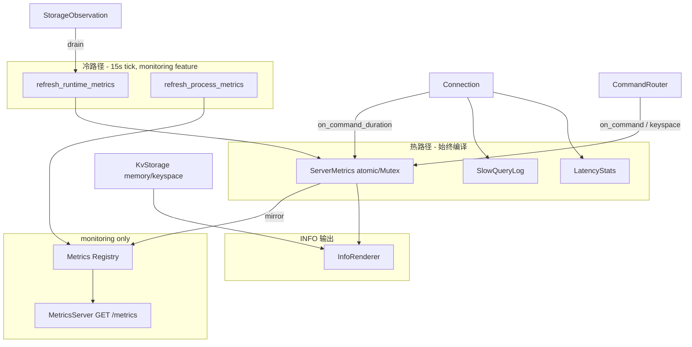
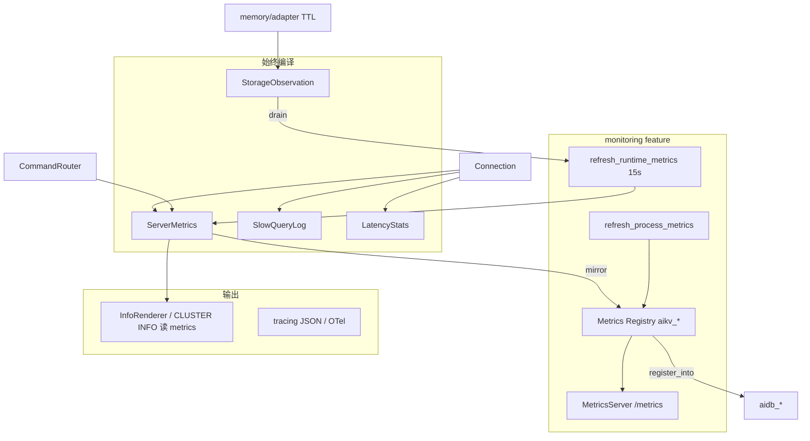
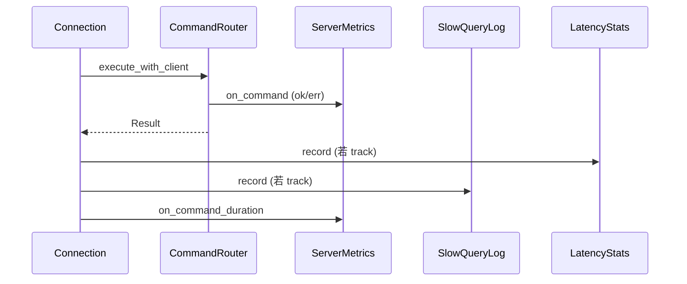

# Cursor transcript

---

## 1. User

## 文档整理 — 新会话

工作目录: `/root/code/database`

请先阅读 (不要跳过):
1. `AiKv-Workflow/backup/design.md` — 总规程
2. `AiKv-Workflow/backup/PROGRESS.md` — 当前进度
3. `AiKv-Workflow/backup/INDEX.md` — 本章索引 (若已有行则更新)

---

### 本次任务

| 项 | 值 |
|----|-----|
| PROGRESS 总步 | 12 (阶段 1 最后一篇 module) |
| 目标文件 | `aikv/docs/modules/observability.md` |
| 本次子步 | 从步 0 开始 |
| 对比深度 | **模块级** (非 design.md 加深章; 见对比深度表) |

### 必须遵守

- **确认门控**: 步 0→1→2→3→4, 每步先讨论, 我确认后再下一步
- **步 4**: 先出 Module Skill 正文 **草稿**, 我确认后再写入 aidb/aikv、更新 INDEX/PROGRESS
- **Module Skill 基础模板**: frontmatter `name` + `description` (含 `Use when`); 见 `design.md`
- **过程只进 backup/**: INDEX; aidb/aikv 不写迁移历史
- **旧文档顺序**: `backup/{aidb,aikv}/` → `*-oldmain` → WiQunTools inventory 段 → wiqun-*
- **待核实**: module 一行引用; 详情写入 **当前仓库** 根目录 `ISSUES.md` (`aikv/ISSUES.md`)
- **步 4 落盘前**: 对照 create-skill Summary Checklist 自检 (见 `design.md`)

### 上下文 (上一章已完成)

- 步 11 ✅ [`aikv/docs/modules/cluster.md`](aikv/docs/modules/cluster.md) — MOVED/ASK/CLUSTER/init_cluster; ISSUE-013~019
- **阶段 1 仅剩本章**; 完成后 12/12 modules 全部 ✅, 可进入阶段 2a (aidb 汇总)
- 前置 module:
  - [`aikv/docs/modules/server.md`](aikv/docs/modules/server.md) — Connection 内联命令 vs Router; `should_track_observability`; observability 子模块 **指向本章**
  - [`aikv/docs/modules/commands-extended.md`](aikv/docs/modules/commands-extended.md) — INFO/TIME/SLOWLOG/LATENCY/COMMAND dispatch
  - [`aikv/docs/modules/cluster.md`](aikv/docs/modules/cluster.md) — `aikv_cluster_redirects_total`, gossip/failover metrics, INFO cluster 段
  - [`aidb/docs/modules/observability.md`](aidb/docs/modules/observability.md) — `aidb_*` 指标、`register_into`; **不重复** aidb 侧

### 边界提示 (步 0 可细化)

- **本章**: `src/server/{slowlog,latency,info,metrics,metrics_server,process_metrics}.rs` + `storage/observation.rs` + `main.rs` monitoring/OTel 装配
- **横切**: Connection → latency/slowlog/metrics 钩子; `MetricsServer` HTTP `/metrics`; `feature monitoring`
- **不重复**: listener/connection 循环 → server.md; 命令语义 → commands-extended; cluster 协议 → cluster.md; **`aidb_raft_*` / engine metrics** → aidb observability.md
- **旧稿**: `backup/aikv/docs/superpowers/specs/2026-06-10-redis-observability-alignment-design.md`; WiQunTools `08-observability.md`; wiqun-factory dashboard 计划 (查漏)

### 本次不要

- 不要跳过未确认的步骤
- 不要一次写多篇 module
- 不要修改 `design.md` / 流程, 除非我明确要求
- 不要 commit, 除非我明确要求

---

请从步 0 开始, 给出本步交付物, 等我确认。

---

## 2. Assistant

先阅读规程、进度与索引，并查看 observability 相关源码与旧稿，以便给出步 0 交付物。

---

## 3. Assistant

正在核对 aikv 源码中与 observability 相关的文件结构，并查看前置 module 的边界表述。

---

## 4. Assistant

## 步 0 — 定范围

**章节**: PROGRESS 步 12 · `aikv/docs/modules/observability.md`  
**对比深度**: 模块级 (非 design.md 加深章)  
**Skill 名 (预定)**: `aikv-observability`

---

### 1. 本章边界

#### 归属本章 (正文覆盖)

| 域 | 说明 |
|----|------|
| **SlowQueryLog** | 环形缓冲、阈值/长度 CONFIG、SLOWLOG 命令数据源 |
| **LatencyStats** | 直方图/历史/LATENCY 命令数据源 |
| **ServerMetrics + Metrics** | 进程内计数 (atomic/Mutex) + Prometheus Registry (`aikv_*`); `register_into` 嵌入 `aidb_*` |
| **InfoRenderer** | Redis INFO / CLUSTER INFO 格式化; 与 metrics 单一数据源不变式 |
| **MetricsServer** | `monitoring` feature 下 HTTP `GET /metrics` |
| **process_metrics** | 进程 CPU/内存 gauge 刷新 |
| **StorageObservation** | 存储层 `expired_keys` 计数, 经 refresh 汇入 metrics/INFO |
| **main.rs 装配** | tracing subscriber、OTel (`AIKV_OTLP_ENDPOINT`)、metrics 后台 tick、`MetricsServer` spawn |
| **横切钩子** | Connection `record_command_observability` / `should_track_observability`; Router JSON/Lua metrics; cluster gossip/commands 写 cluster 相关 counter |

#### 明确不覆盖 (仅链出)

| 主题 | 归属 |
|------|------|
| TCP accept/read/pipeline、内联命令 vs Router | [server.md](aikv/docs/modules/server.md) |
| INFO/TIME/SLOWLOG/LATENCY/COMMAND **命令 dispatch** | [commands-extended.md](aikv/docs/modules/commands-extended.md) (`command/server.rs` 委托关系可一笔带过) |
| MOVED/ASK、gossip 协议、CLUSTER 子命令语义 | [cluster.md](aikv/docs/modules/cluster.md) (本章只写 cluster **指标/INFO 段**, 不写路由) |
| `aidb_*` / `aidb_raft_*` 指标定义与 `register_into` 细节 | [aidb observability.md](aidb/docs/modules/observability.md) |
| RESP 帧格式 | [protocol.md](aikv/docs/modules/protocol.md) |
| Grafana 面板 / wiqun-factory 部署 | 阶段 2 `DEPLOYMENT.md`; 步 2 仅查漏 |

#### 与 design.md modules↔src 表对照

design 表: `server/{slowlog,latency,info,metrics*}`, `storage/observation`  
**补充** (你给的边界提示): `process_metrics.rs`, `main.rs` monitoring/OTel 装配 — 纳入本章, 不归 server.md.

---

### 2. 拟读文件列表 (步 1 主读)

#### 2.1 核心源码 (~1792 行)

```shell
aikv/src/
├── main.rs                      # tracing/OTel init; MetricsServer spawn; refresh tick (~L509–696)
├── server/
│   ├── mod.rs                   # 模块导出; metrics_server #[cfg(monitoring)]
│   ├── config.rs                # ServerSharedState 持有 metrics/slowlog/latency/prometheus; refresh_runtime_metrics
│   ├── connection.rs            # record_command_observability; should_track_observability (~L909–934)
│   ├── slowlog.rs               # SlowQueryLog (171 行)
│   ├── latency.rs               # LatencyStats (249 行)
│   ├── info.rs                  # InfoRenderer; redis_mode/cluster sections (340 行)
│   ├── metrics.rs               # ServerMetrics + Metrics/Prometheus (804 行) ★ 最大
│   ├── metrics_server.rs        # GET /metrics (123 行, monitoring only)
│   └── process_metrics.rs       # 进程 gauge (81 行)
└── storage/
    └── observation.rs           # StorageObservation expired_keys (24 行)
```

#### 2.2 横切引用 (步 1 抽样, 不展开命令语义)

| 路径 | 读什么 |
|------|--------|
| `command/server.rs` | INFO/SLOWLOG/LATENCY → shared 字段的委托边界 |
| `command/router.rs` | `record_keyspace_lookup`, JSON/Lua `with_metrics` |
| `command/json.rs`, `command/script.rs` | `ServerMetrics` 注入 |
| `cluster/gossip.rs`, `cluster/commands.rs`, `cluster/state.rs` | cluster counter / InfoRenderer cluster 段输入 |
| `Cargo.toml` | `monitoring` feature 依赖链 (`aidb/monitoring`) |

#### 2.3 测试 (步 1 对照行为/不变式)

| 路径 | 用途 |
|------|------|
| `tests/modules/server/observability.rs` | INFO↔metrics 不变式、MetricsServer |
| `tests/modules/command/info_golden.rs` | P0 INFO 字段 golden |
| `tests/modules/command/info_alignment.rs` | section 对齐 |
| `tests/modules/cluster/observability.rs` | CLUSTER INFO / cluster metrics |
| `tests/fixtures/redis7_info_p0_fields.txt` | (若存在) golden 字段清单 |

#### 2.4 步 2 旧文档 (步 0 仅列路径, 步 2 再分类)

| 顺序 | 路径 |
|------|------|
| 1 | `AiKv-Workflow/backup/aikv/docs/superpowers/specs/2026-06-10-redis-observability-alignment-design.md` |
| 2 | `aikv-oldmain/docs/development/architecture/01-overview.md` (observability 段) |
| 2 | `aikv-oldmain/docs/development/api/01-commands.md` (INFO/SLOWLOG 段) |
| 3 | `WiQunTools/docs/wiqun-kv-inventory/08-observability.md` |
| 3 | `WiQunTools/docs/superpowers/plans/2026-05-28-phase17-observability.md` |
| 4 | `wiqun-factory/docs/MONITORING.md` + dashboard 计划 (查漏) |
| 4 | `wiqun-kv/docs/superpowers/specs/2026-06-10-redis-observability-alignment-design.md` (与 backup 重叠时二选一) |

#### 2.5 步 3 oldmain 代码 (模块级)

- `aikv-oldmain/src/server/{slowlog,latency,info,metrics,metrics_server}.rs`
- `wiqun-kv/src/server/*` (同名文件查漏)

---

### 3. 初判结构要点 (供步 4 参考, 非正文)

- **单一数据源**: `ServerMetrics` + 周期 `refresh_runtime_metrics` → INFO 与 `aikv_*` 对齐 (旧 spec G1/G6).
- **双 Registry 层**: 热路径 `ServerMetrics` (always) vs `Metrics`/`prometheus_metrics` (`monitoring` only).
- **feature 分界**: 无 `monitoring` 时仍有 slowlog/latency/INFO; 无 HTTP `/metrics`、无 OTel layer、无 Prometheus counter 导出.
- **篇幅**: `metrics.rs` 804 行 — 步 4 若正文 >400 行, 考虑 `observability-reference.md` 放指标表, 主文件保留架构与常见任务.

预定 frontmatter (步 4 再用):

```yaml
name: aikv-observability
description: AiKv observability — SlowQueryLog, LatencyStats, ServerMetrics, InfoRenderer, Prometheus /metrics, tracing/OTel. Use when changing src/server/{slowlog,latency,info,metrics,metrics_server,process_metrics}, storage/observation, main.rs monitoring wiring, or debugging INFO/SLOWLOG/LATENCY/metrics alignment.
```

---

### 4. 拟写入 INDEX 的本章行 (确认步 0 后落盘 backup/INDEX)

| 字段 | 内容 |
|------|------|
| 章节 | `aikv/docs/modules/observability.md` |
| 状态 | 🔄 步 0 已确认 |
| 覆盖 src | `server/{slowlog,latency,info,metrics,metrics_server,process_metrics}`, `storage/observation`, `main.rs` monitoring |
| 参考旧文档 | (步 2 填) |
| 备注 | 阶段 1 末篇; 完成后 12/12 ✅ |

---

### 5. 待你确认 / 可调整项

1. **边界**: `main.rs` tracing/OTel/metrics 装配是否全部纳入本章 (建议: 是)?
2. **cluster 指标**: gossip/commands 的 counter 在本章写「写入点 + INFO 段」, 路由语义仍指 cluster.md — 是否同意?
3. **metrics.rs 拆分**: 步 4 是否接受 `observability-reference.md` 承载完整 `aikv_*` 指标表?
4. **拟读列表**: 有无需增删的路径 (例如 `listener.rs` 里 rejected_connections 计数)?

---

请回复 **「可以」** 或具体调整; 确认后我进入 **步 1 (读新代码)**, 并更新 `backup/INDEX.md` 本章范围行.

---

## 5. User

可以

---

## 6. Assistant

步 0 已确认。正在更新 INDEX 范围行，并阅读核心源码以产出步 1 交付物。

---

## 7. Assistant

**步 0 已落盘**: `backup/INDEX.md` 本章行已更新为 🔄 步 0 ✅.

---

## 步 1 — 读新代码 (交付物)

以当前 `aikv` 源码为准, 梳理职责、代码地图与主流程. **尚未写 module 正文**, 等你确认后再进步 2.

---

### 1. 模块职责 (一句话)

AiKv 可观测性 = **进程内单一数据源 `ServerMetrics`** + **可选 Prometheus 镜像 (`Metrics`, `monitoring` feature)** + **Redis 兼容 INFO 格式化 (`InfoRenderer`)** + **命令级 slowlog/latency 侧车** + **HTTP `/metrics` scrape** + **main 装配 tracing/OTel/后台 refresh**.

---

### 2. 代码地图

| 路径 | 职责 | 入口 / 关键类型 |
|------|------|----------------|
| `server/metrics.rs` (804) | 热路径 atomic 计数 + per-cmd `CommandTotals`; Prometheus `Metrics` 注册 (`aikv_*` + `aidb::register_into`) | `ServerMetrics`, `Metrics::new` |
| `server/info.rs` (340) | Redis INFO section 渲染; 只读 `ServerMetrics` + `KvStorage` | `InfoRenderer::render`, `redis_mode()` |
| `server/slowlog.rs` (171) | 慢查询环形缓冲 (阈值默认 100ms, 容量 128) | `SlowQueryLog::record/get` |
| `server/latency.rs` (249) | 按命令延迟直方图 + 历史样本 (LATENCY 命令) | `LatencyStats::record/snapshot` |
| `server/config.rs` | `ServerSharedState` 聚合 observability 组件; 连接 gate; 周期 refresh | `try_register_connection`, `refresh_runtime_metrics` |
| `server/connection.rs` | 网络字节计数; Router 命令 latency/slowlog/duration 钩子 | `record_command_observability`, `should_track_observability` |
| `server/metrics_server.rs` (123) | Hyper HTTP: `/metrics`, `/health`, `/` | `MetricsServer::run` `[monitoring]` |
| `server/process_metrics.rs` (81) | Linux `/proc` RSS/CPU/IO | `read_*` `[monitoring]` |
| `storage/observation.rs` (24) | 存储层 expired key 计数, 与 server metrics 解耦 | `record_expired_key`, `drain_expired_keys` |
| `main.rs` (~L503–696) | JSON logging; OTel (`AIKV_OTLP_ENDPOINT`); MetricsServer + 15s refresh tick | `init_logging`, `create_otel_tracer` |

**横切写入点** (本章记录钩子, 语义见它章):

| 路径 | 写什么 |
|------|--------|
| `command/router.rs` | `on_command` (ok/err); keyspace hit/miss; cluster MOVED/ASK → `on_cluster_redirect` |
| `command/json.rs`, `command/script.rs` | JSON/Lua 专用 counter + duration |
| `command/server.rs` | INFO/SLOWLOG/LATENCY **读** shared 字段 (dispatch 属 commands-extended) |
| `cluster/gossip.rs` | `on_gossip_refresh` |
| `cluster/commands.rs` | `cluster_info()` 读 `cluster_messages_*`; failover → `on_failover` |
| `storage/memory.rs`, `storage/adapter.rs` | TTL 过期 → `StorageObservation::record_expired_key` |

---

### 3. 架构: 双轨 + 单一数据源



**要点**:

- **INFO 与 Prometheus 同源**: `InfoRenderer` 不独立计数; 字段来自 `ServerMetrics` 或 `KvStorage` 查询 (memory/keyspace).
- **`monitoring` 分界**: 无 feature 时 slowlog/latency/INFO/`ServerMetrics` 仍可用; **无** HTTP `/metrics`、无 OTel layer、无 Prometheus 双写; `main` **不** 启 15s refresh 后台任务.
- **内部命令过滤**: `is_client_command` 排除含 `.` 的伪命令 (`GOSSIP.tick`, `JSON.get`, `CLUSTER.redirect.moved`) → 不进 INFO `commandstats`.
- **aidb 边界**: `Metrics::new` 调 `aidb::metrics::register_into`; `aidb_*` 详情 → aidb observability.md.

---

### 4. 主流程

#### 4.1 启动装配 (`main.rs`)

1. `init_logging()` — `RUST_LOG` + 默认 JSON (`AIKV_JSON_LOG`, 默认 true).
2. `[monitoring]` + `AIKV_OTLP_ENDPOINT` → OTel tracer layer.
3. `StorageObservation::new()` → 传入 `build_storage`.
4. `ServerSharedState::new_with_backup_dir(..., observation)` — 构造 `SlowQueryLog` / `LatencyStats` / `ServerMetrics` (+ `Metrics` if monitoring).
5. `[monitoring]` spawn `MetricsServer` (`--metrics-addr` 默认 `127.0.0.1:9191`) + 15s loop: `refresh_runtime_metrics` + `refresh_process_metrics`.

#### 4.2 连接生命周期

- `Listener` → `try_register_connection`: 超 `max_clients` → `on_rejected_connection`; 否则 `on_connect`.
- 断连 → `on_disconnect`.
- 读/写 → `on_net_input_bytes` / `on_net_output_bytes`.

#### 4.3 命令可观测性 (Router 路径)

1. **排除跟踪**: `PING|ECHO|HELLO|QUIT|MONITOR|SLOWLOG` → 无 latency/slowlog/duration.
2. Router 内: `record_command_outcome` → `on_command` (calls/err counter).
3. Connection 返回后: `record_command_observability` → `latency_stats.record` + `slow_query_log.record` + `on_command_duration` (+ `[monitoring]` 超阈值 → `on_slow_query`).
4. 内联命令 (PING/ATOM/ASKING 等) **不经** 上述 Router 钩子.

#### 4.4 周期 refresh (`refresh_runtime_metrics`, 仅 monitoring 后台)

- `set_uptime_secs`, `sample_instantaneous_ops`, `sync_redis_aligned_gauges`
- `storage.db_key_counts` → `set_db_key_count`
- `storage.memory_usage_bytes` → `set_memory_bytes`
- `storage_observation.drain_expired_keys` → `record_expired_keys`

#### 4.5 INFO 渲染

- `InfoRenderer::render(section)` — 未知 section → **空 bulk string** (非 ERR).
- default: server → clients → memory → persistence → stats → replication → cpu → [cluster] → keyspace.
- `all`: + commandstats / errorstats / modules.
- `CLUSTER INFO` 文本在 `cluster/commands.rs::cluster_info`, 读 `ServerMetrics.cluster_messages_*` (ISSUE-013 另述).

---

### 5. 关键 invariant (步 4 应保留)

| ID | 不变式 |
|----|--------|
| I1 | INFO `used_memory` / `keyspace_hits` 等与同期 `aikv_*` gauge/counter 一致 (scrape 间隔内允许微小延迟) |
| I2 | `InfoRenderer` 禁止独立维护 stats 计数 (旧 placeholder 公式已移除) |
| I3 | `on_command` (Router) 与 `on_command_duration` (Connection) 分工: 前者计 calls/err, 后者计 usec/histogram |
| I4 | 含 `.` 的内部命令不进客户端 `commandstats` |
| I5 | `StorageObservation` 过期计数须经 `drain` 汇入 `ServerMetrics.expired_keys` |

---

### 6. 测试锚点

```bash
# 基础 (无 monitoring)
cargo test -p aikv observability info_alignment info_golden -- --test-threads=1

# 含 Prometheus /metrics
cargo test -p aikv --features monitoring observability -- --test-threads=1

# cluster metrics
cargo test -p aikv --features cluster observability -- --test-threads=1
```

| 测试文件 | 验证什么 |
|----------|----------|
| `tests/modules/server/observability.rs` | 连接计数、/metrics HTTP、INFO↔Prometheus 对齐、span 命名 |
| `tests/modules/command/info_golden.rs` | P0 字段 vs `fixtures/redis7_info_p0_fields.txt` |
| `tests/modules/command/info_alignment.rs` | memory 非 placeholder; stats 含 expired/rejected |
| `tests/modules/cluster/observability.rs` | gossip refresh → cluster_messages_* |

---

### 7. 步 2–3 初筛疑点 (暂不写 ISSUES, 供你预览)

| 疑点 | 现象 |
|------|------|
| `blocked_clients` | `AtomicUsize` 存在, 源码无 `fetch_add`; 恒 0 (测试也 assert 0) |
| refresh 与 feature | `refresh_runtime_metrics` 仅 `monitoring` 时 main 15s tick; 无 monitoring 时 `instantaneous_ops` / drained `expired_keys` 可能滞后 |
| CLUSTER INFO | `cluster_state:ok` 恒真 → 已有 ISSUE-013 |

---

请确认步 1 是否 **「可以」** (或指出需补充/修正的点). 确认后进入 **步 2 (查旧文档)**.

---

## 8. User

可以

---

## 9. Assistant

步 1 已确认。正在按旧文档查阅顺序检索并分类，产出步 2 交付物。

---

## 10. Assistant

## 步 2 — 查旧文档 (交付物)

按 `design.md` 查阅顺序整理. **尚未写 ISSUES / 未更新 INDEX 参考列** (等你确认后再落盘).

---

### 1. 旧文档清单与分类

| 顺序 | 路径 | 分类 | 结论 |
|------|------|------|------|
| 1 | `backup/aikv/docs/superpowers/specs/2026-06-10-redis-observability-alignment-design.md` | **仍有效** (历史设计) | Phase 1–4 目标与不变式 (G1/G6, INFO section 顺序, P0 字段) 与现码一致; **设计偏离**: 未新增 `observability.rs`/`RuntimeObservability`, 保留 `ServerMetrics` + `InfoRenderer`; refresh 周期 spec 写 1s, 现码 **15s** |
| 1 | `backup/aikv/CHANGELOG.md` (可观测性段) | **仍有效** | 实现 chronology; 与现 `src/server/{info,metrics,process_metrics}.rs` 吻合 |
| 1 | `backup/aikv/README.md`, `DEPLOYMENT.md` §metrics | **仍有效** (部分) | CLI `--metrics-port/addr`、9191、`monitoring` feature 仍对; **过时**: 指标名 `kv_*` 缺 `aikv_` 前缀; OTel 环境变量仍写 `WIQUN_*` 风格 (现码 `AIKV_*`) |
| 1 | `backup/aikv/ARCHITECTURE.md` §可观测性 | **仍有效** (概览) | 路径映射基本对; 文件名 `server_cmd.rs` 等旧名, 现 `command/server.rs` |
| 2 | `aikv-oldmain/docs/development/architecture/01-overview.md` §Observability | **已过时** | 描述 `src/observability/{LoggingManager,Metrics,SlowLog}` — 现无此目录 |
| 2 | `aikv-oldmain/src/observability/*` | **已过时** | 独立 observability 包 + 自定义 Counter/Gauge; 现并入 `server/metrics.rs` |
| 2 | `aikv-oldmain/docs/development/api/01-commands.md` §INFO/SLOWLOG | **查漏** | 命令语义 → commands-extended; 无新 observability 架构信息 |
| 2 | `aikv-oldmain/docs/guide/{01,02,03}-*.md` | **查漏** | redis-cli 运维示例 (INFO/CLUSTER INFO); 概念仍可用, 不迁入 module |
| 3 | `WiQunTools/docs/wiqun-kv-inventory/08-observability.md` | **仍有效** (查漏) | 三支柱架构、INFO↔Prometheus 不变式表、span 清单; 指标前缀 `wiqun_kv_*` → 现 `aikv_*`; blocked_clients「无 BLPOP 时为 0」仍成立 |
| 3 | `WiQunTools/docs/superpowers/plans/2026-05-28-phase17-observability.md` | **已过时** (大部分) | M1–M4 + Phase 17 主任务 ✅; **遗留**: 部分 span (bloom/aof/rdb/failover/migrate) 未完成 — 低优先级, 不归本章正文 |
| 4 | `wiqun-kv/docs/superpowers/specs/2026-06-10-redis-observability-alignment-design.md` | **跳过** | 与 backup/aikv 同 spec, 仅 `wiqun_*` 命名; 二选一 |
| 4 | `wiqun-factory/docs/MONITORING.md` | **仍有效** (运维查漏) | scrape/OTLP/Loki 流程; 环境变量 `WIQUN_*` → 现 `AIKV_*` + CLI; **提炼目标**: 阶段 2 `DEPLOYMENT.md`, 本章只链边界 |
| 4 | `wiqun-factory/docs/superpowers/specs/2026-06-10-wiqun-kv-dashboard-design.md` | **仍有效** (查漏) | PromQL 用 `wiqun_kv_*`/`wiqun_db_*`; module 注明现 scrape 为 `aikv_*`/`aidb_*`, 面板迁移不在本章 |

---

### 2. 旧文档 vs 现实现 — 关键对照

| 主题 | 旧文档说法 | 现码 | 文档应如何写 |
|------|-----------|------|-------------|
| 单一数据源 | spec: `RuntimeObservability` 新模块 | `ServerMetrics` + `InfoRenderer` | 写实际类型名; 原则 (INFO 只读 metrics) 不变 |
| INFO memory | 旧 bug: placeholder 公式 | `storage.memory_usage_bytes()` + fallback | ✅ 已实现, CHANGELOG 已记录 |
| 未知 INFO section | 旧: ERR | 空 bulk string | ✅ 已实现 (`info_alignment` 测试) |
| refresh 周期 | spec: 1s | `main.rs` 15s interval | 文档写 **15s**; 标 spec 偏差 |
| refresh 触发 | spec 隐含 always | 仅 `[monitoring]` 后台 task | 无 monitoring 时 `expired_keys`/`instantaneous_ops` 不自动 refresh |
| 指标命名 | `wiqun_kv_*` / oldmain `aikv_commands_duration_avg_us` | `aikv_*` histogram/counter | module 用现名; reference 表列全量 |
| OTel / JSON log | `WIQUN_OTLP_ENDPOINT`, `WIQUN_JSON_LOG` | `AIKV_OTLP_ENDPOINT`, `AIKV_JSON_LOG` | module 写现 env 名 |
| blocked_clients | inventory: 无 BLPOP 时为 0 | 字段存在但 **无写入点** | 文档写恒 0 + ISSUE |
| CLUSTER INFO | spec G3 P0 | 已实现; `cluster_state:ok` 恒真 | 引用 **ISSUE-013** (cluster 章已建) |
| aidb 指标 | 不映射 Redis INFO | `register_into` 同 Registry | 链 aidb observability.md |

---

### 3. 拟写 ISSUES (`aikv/ISSUES.md`)

步 2 门控内讨论, **确认后再写入**.

#### ISSUE-020: `blocked_clients` 无写入点 (拟新增, open)

- **现象**: `ServerMetrics.blocked_clients` 仅 default 0; `BlockingRegistry` 未同步计数
- **影响**: INFO clients / `aikv_blocked_clients` 恒 0; 实现 BLPOP 后仍不准
- **下一步**: doc-only 先描述现状; 接 blocking 时再修

#### ISSUE-021: `refresh_runtime_metrics` 仅 monitoring 后台 tick (拟新增, doc-only)

- **现象**: `main.rs` 15s loop 包在 `#[cfg(feature = "monitoring")]`; 无 monitoring 时不 drain `StorageObservation`、不 sample ops/sec
- **影响**: 无 feature 构建下 INFO `stats.expired_keys` / `instantaneous_ops_per_sec` 可能滞后; memory/keyspace 段仍可直接查 storage
- **下一步**: doc-only — module 写 refresh 条件与 15s 周期

#### ISSUE-022: metrics refresh 周期 15s vs 设计 spec 1s (拟新增, doc-only)

- **现象**: `2026-06-10-redis-observability-alignment-design.md` §R4 写 1s; 现 `Duration::from_secs(15)`
- **影响**: `instantaneous_ops_per_sec` 采样粒度粗于 spec; 文档以代码为准
- **下一步**: doc-only

#### 已有引用 (不重复开 ISSUE)

| ISSUE | 本章关系 |
|-------|----------|
| ISSUE-013 | CLUSTER INFO `cluster_state:ok` — module 待核实一行引用 |
| ISSUE-005 | BlockingRegistry 无后台 evict — 与 ISSUE-020 相关, 各写一句 |

---

### 4. 步 4 消化计划 (预览)

| 源文件 | 步 4 处理 |
|--------|----------|
| `backup/aikv/docs/superpowers/specs/2026-06-10-redis-observability-alignment-design.md` | 正文消化后 → `backup/archive/` 或删源 |
| `aikv-oldmain/docs/development/architecture/01-overview.md` §Observability | 不迁; 无单独删 (整库步 4 清理) |
| WiQunTools / wiqun-factory / wiqun-kv 重复 spec | 不删 (它库验收前保留); INDEX 记「查漏已用」 |
| `backup/aikv/CHANGELOG.md` 等根文档 | 保留至阶段 2b 汇总 |

---

### 5. 拟更新 INDEX 行 (确认步 2 后)

```
| docs/modules/observability.md | 🔄 步 2 ✅ | backup/aikv superpowers spec + CHANGELOG/DEPLOYMENT; WiQunTools 08 + phase17; wiqun-factory MONITORING/dashboard (查漏); oldmain 01-overview §observability (过时) | | ISSUE-020~022 拟新增; 013 引用; metrics.rs 或拆 reference |
```

---

请回复 **「可以」** 或调整 (ISSUE 编号/分类/是否要增删旧文档). 确认后我:

1. 写入 `aikv/ISSUES.md` ISSUE-020~022  
2. 更新 `backup/INDEX.md` 参考列  
3. 进入 **步 3 (oldmain 模块级代码对比)**

---

## 11. User

可以

---

## 12. Assistant

步 2 已确认。正在写入 ISSUES、更新 INDEX，并对照 oldmain 源码完成步 3。

---

## 13. Assistant

**步 2 已落盘**: `aikv/ISSUES.md` 新增 ISSUE-020~022; `backup/INDEX.md` 参考列已更新.

---

## 步 3 — 模块级 oldmain 对比 (交付物)

对比 **aikv-oldmain** (重构前) 与 **wiqun-kv** (重构中间态, 查漏) 相对现 `aikv` 的差异. **未写 module 正文**.

---

### 1. 路径映射 (oldmain → 现 aikv)

| oldmain | 现 aikv | 变化性质 |
|---------|---------|----------|
| `src/observability/metrics.rs` (~1000 行) | `server/metrics.rs` + `server/latency.rs` | **拆分**: 延迟直方图独立为 `LatencyStats`; Prometheus 独立 `Metrics` struct |
| `src/observability/logging.rs` (SlowQueryLog) | `server/slowlog.rs` | **迁移**: API 等价, 默认阈值不同 (见下) |
| `src/observability/{logging,tracing_setup}.rs` | `main.rs` `init_logging` + OTel | **合并**: 无 `LoggingManager` 动态级别; CONFIG loglevel 未保留 |
| `command/server.rs` `build_*_info()` ×12 | `server/info.rs` `InfoRenderer` | **抽取**: INFO 格式化与命令 dispatch 分离 |
| `observability/metrics.rs::export_prometheus()` | `metrics_server.rs` HTTP `/metrics` | **架构升级**: 字符串导出 → Registry + 独立端口 |
| `Server` 持有 `Arc<Metrics>` | `ServerSharedState` 聚合 metrics/slowlog/latency | **与 server 重构同步** (见 server.md) |
| `CommandExecutor` + 连接注入 metrics | `CommandRouter` + `record_command_outcome` | **路由层改名**; 计数钩子位置等价 |
| `Server::spawn_keyspace_refresh_task` + `KeyspaceCache` | `InfoRenderer::render_keyspace` 实时查 `KvStorage` | **策略变化**: 旧版后台 10s 缓存 scan; 现版 INFO 时 async 读 storage |
| (无) | `storage/observation.rs` | **新增**: expired_keys 跨引擎计数 + drain |
| (无) | `server/process_metrics.rs` | **新增**: /proc RSS/CPU/IO |

**wiqun-kv vs 现 aikv**: `slowlog/latency/info/metrics_server/process_metrics` **逻辑等价**; 主差异为 Prometheus 前缀 `wiqun_kv_*` → `aikv_*` 及 rustfmt. **无额外架构分歧**.

---

### 2. 行为差异表

| 维度 | oldmain | wiqun-kv / 现 aikv | 文档建议 |
|------|---------|-------------------|----------|
| **Slowlog 默认阈值** | 10_000 µs (10ms, 近 Redis) | 100_000 µs (100ms) | 写现默认值; 标与 Redis/oldmain 不同 → **拟 ISSUE-023** |
| **INFO memory** | RSS 为主 + 多字段 (`used_memory_rss`, fragmentation…) | `storage.memory_usage_bytes()` 优先, 字段较少 | 写现简化模型; 不恢复 oldmain 全字段 |
| **INFO stats** | 大量 Redis 7 占位 0 字段 + `get_stats_info()` | 精简 P0 字段集 | 以 golden 测试为准 |
| **INFO 未知 section** | 需核实 (可能 ERR) | 空 bulk string | ✅ 已对齐 Redis |
| **Prometheus 暴露** | `export_prometheus()` 无 HTTP server | `:9191/metrics` + `/health` | 写 monitoring feature 条件 |
| **指标命名** | `aikv_*` 部分 + `commands_duration_avg_us` gauge | `aikv_*` counter/histogram 全套 | reference 表用现名 |
| **Latency** | 嵌在 `Metrics.latency_histograms` RwLock | 独立 `LatencyStats` Mutex map | 写 `latency.rs` 入口 |
| **Keyspace INFO** | 10s 后台 `KeyspaceCache` (spawn_blocking) | 请求时 `storage.keyspace_stats` | 说明 heavy load 下可能慢 (storage 责任) |
| **Cluster metrics** | 无 gossip tick 计数 | `on_gossip_refresh` / `on_failover` / `on_cluster_redirect` | 写写入点, 语义见 cluster.md |
| **blocked_clients** | oldmain 亦未见写入 | 恒 0 | ISSUE-020 |
| **动态 log level** | `CONFIG SET loglevel` + `LoggingManager` | **已移除** | module「已知限制」一句 |

---

### 3. 主流程等价性

| 流程 | oldmain | 现 aikv | 等价? |
|------|---------|---------|-------|
| 连接 accept → 计数 | `metrics.connections.record_connection()` | `try_register_connection` → `on_connect` | ✅ |
| 命令完成 → 慢查询 | connection 内 record (需核实) | `record_command_observability` | ✅ (Router 路径) |
| 命令 ok/err 计数 | executor 内 | `record_command_outcome` | ✅ |
| SLOWLOG/LATENCY 命令 | `ServerCommands` 读 shared log/histogram | `command/server.rs` 读 `shared.*` | ✅ |
| INFO | inline `build_*` | `InfoRenderer` 委托 | ✅ (实现位置变) |
| Prometheus scrape | 无标准 HTTP | `MetricsServer` | ⬆️ 增强 |
| 周期 refresh | keyspace 10s; 无统一 runtime refresh | monitoring 15s `refresh_runtime_metrics` + process | ⚠️ 不同策略 (ISSUE-021/022) |

---

### 4. 拟增 ISSUE (步 3 发现, 确认步 3 后写入)

#### ISSUE-023: Slowlog 默认阈值 100ms vs Redis/oldmain 10ms (拟 doc-only)

- **现象**: `DEFAULT_SLOWLOG_THRESHOLD_US = 100_000`; oldmain/Redis 默认 10_000 µs
- **影响**: 新部署慢查询记录更少; CONFIG GET 返回 100000
- **下一步**: doc-only — module 写实际默认; 是否改代码另议

---

### 5. 文档应如何表述 (步 4 指引)

1. **架构段**: 以 `ServerMetrics` + `InfoRenderer` + 可选 `Metrics`/`MetricsServer` 为准; **不提** `RuntimeObservability` / `src/observability/` 旧布局.
2. **与 oldmain 差异**: 一句「重构后 observability 迁入 `server/*`, INFO 抽出 `InfoRenderer`, HTTP `/metrics` 替代字符串 export」即可; 不建对照表.
3. **指标表**: 放 `observability-reference.md` (或 module 附录), 列 `aikv_*`; 链 aidb observability 列 `aidb_*`.
4. **ISSUE 引用**: 020 (blocked), 021 (refresh 条件), 022 (15s), 023 (slowlog 默认), 013 (CLUSTER INFO).
5. **wiqun-factory**: 仅 note `WIQUN_*` env → `AIKV_*`; Grafana PromQL 前缀迁移属 DEPLOYMENT.

---

### 6. 拟更新 INDEX (确认步 3 后)

```
| docs/modules/observability.md | 🔄 步 3 ✅ | (同步 2) + oldmain src/observability/* vs server/*; wiqun-kv 等价查漏 | | ISSUE-020~023; 步 4 草稿待确认 |
```

---

请回复 **「可以」** 或调整 (尤其 ISSUE-023 是否写入、slowlog 默认是否标为 open bug). 确认后进入 **步 4 (Module Skill 正文草稿)**.

---

## 14. User

可以

---

## 15. Assistant

步 3 已确认。正在写入 ISSUE-023、更新 INDEX，并参照已完成 module 与 create-skill 清单起草步 4 正文。

---

## 16. Assistant

**步 3 已落盘**: ISSUE-023 已写入; INDEX 已更新为步 3 ✅.

---

## 步 4 — Module Skill 正文草稿 (待确认)

以下为拟写入 `aikv/docs/modules/observability.md` 的全文草稿. **确认前不落盘**; 完整 `aikv_*` 指标表拟拆至 `observability-reference.md` (主文件控在 ~400 行内).

---

```markdown
---
name: aikv-observability
description: AiKv observability — SlowQueryLog, LatencyStats, ServerMetrics, InfoRenderer, Prometheus /metrics, tracing/OTel wiring. Use when changing src/server/{slowlog,latency,info,metrics,metrics_server,process_metrics}, storage/observation, main.rs monitoring setup, or debugging INFO/SLOWLOG/LATENCY/metrics alignment.
---

# AiKv Observability (可观测性)

## 何时读本文

- 改 `server/{slowlog,latency,info,metrics,metrics_server,process_metrics}`、`storage/observation`, 或 `main.rs` tracing/OTel/metrics 装配
- 排查 INFO 与 Prometheus 数值不一致、慢查询/SLOWLOG、LATENCY 直方图、`/metrics` scrape
- 接集群 gossip/failover/redirect 计数、JSON/Lua 专用 metrics
- **不覆盖**: TCP 连接循环与内联命令 → [server.md](server.md)
- **不覆盖**: INFO/SLOWLOG/LATENCY/COMMAND **命令 dispatch** → [commands-extended.md](commands-extended.md)
- **不覆盖**: MOVED/ASK、CLUSTER 子命令语义 → [cluster.md](cluster.md) (本章只写 metrics/INFO 段写入点)
- **不覆盖**: `aidb_*` / `aidb_raft_*` 定义与引擎 span → [aidb observability.md](../../aidb/docs/modules/observability.md)
- **构建**: `--features monitoring` 启用 Prometheus HTTP + OTel; 默认 **不** 启用

## 架构: 单一数据源 + 可选 Prometheus 镜像



要点:

- **热路径**: `ServerMetrics` (atomic + `commands_total` Mutex) 为 INFO 与业务计数唯一源
- **冷路径**: `[monitoring]` 下 `main` 每 **15s** 调 `refresh_runtime_metrics` + `refresh_process_metrics`
- **无 monitoring**: slowlog/latency/INFO/`ServerMetrics` 仍可用; **无** HTTP `/metrics`、无 OTel layer、**无** 自动 refresh (见 ISSUE-021)
- **内部命令**: 含 `.` 的伪命令 (`GOSSIP.tick`, `JSON.get`, `CLUSTER.redirect.moved`) **不** 进 INFO `commandstats`

## 代码地图

| 路径 | 职责 | 入口 |
|------|------|------|
| `server/metrics.rs` | `ServerMetrics` 热路径计数; `[monitoring]` `Metrics` + `aikv_*` 注册 | `on_connect`, `on_command`, `Metrics::new` |
| `server/info.rs` | Redis INFO section 渲染 | `InfoRenderer::render`, `redis_mode()` |
| `server/slowlog.rs` | 慢查询环形缓冲 | `SlowQueryLog::record/get` |
| `server/latency.rs` | 按命令延迟直方图 + 历史 | `LatencyStats::record/snapshot` |
| `server/config.rs` | `ServerSharedState` 持有上述组件; refresh | `try_register_connection`, `refresh_runtime_metrics` |
| `server/connection.rs` | 网络字节; Router 命令 observability 钩子 | `record_command_observability`, `should_track_observability` |
| `server/metrics_server.rs` | HTTP `/metrics`, `/health`, `/` | `MetricsServer::run` `[monitoring]` |
| `server/process_metrics.rs` | Linux `/proc` RSS/CPU/IO | `read_*` `[monitoring]` |
| `storage/observation.rs` | 跨引擎 expired key 计数 | `record_expired_key`, `drain_expired_keys` |
| `main.rs` | JSON log, OTel, MetricsServer spawn, 15s tick | `init_logging`, `create_otel_tracer` (~L503–696) |

**横切写入点** (语义见它章, 本章只记钩子):

| 路径 | 调用 |
|------|------|
| `command/router.rs` | `on_command`, keyspace hit/miss, `on_cluster_redirect` |
| `command/json.rs`, `command/script.rs` | `on_json_command`, `on_lua_command`, `on_lua_execution` |
| `command/server.rs` | INFO/SLOWLOG/LATENCY **读** shared (dispatch → commands-extended) |
| `cluster/gossip.rs` | `on_gossip_refresh` |
| `cluster/commands.rs` | `cluster_info()` 读 `cluster_messages_*`; failover → `on_failover` |

完整 `aikv_*` 指标表 → [observability-reference.md](observability-reference.md).

## 关键 invariant (勿破坏)

- **I1 INFO↔Prometheus**: `InfoRenderer` / `CLUSTER INFO` stats 字段须与同期 `ServerMetrics` (及 refresh 后的 gauge) 一致; 禁止独立计数公式
- **I2 钩子分工**: Router `on_command` 计 calls/err; Connection `on_command_duration` 计 usec/histogram; **勿** 在 INFO 重复累加
- **I3 跟踪排除**: `PING|ECHO|HELLO|QUIT|MONITOR|SLOWLOG` 不经 `record_command_observability`
- **I4 客户端 commandstats**: `is_client_command` 过滤含 `.` 的内部 key
- **I5 expired_keys**: 存储 TTL 路径写 `StorageObservation`; 须经 `refresh_runtime_metrics` drain 汇入 `ServerMetrics`

## 数据流

### 启动 (`main.rs`)

1. `init_logging()` — `RUST_LOG`; JSON 默认开 (`AIKV_JSON_LOG`, 默认 `true`)
2. `[monitoring]` + `AIKV_OTLP_ENDPOINT` → OTel layer (`service.name=aikv`)
3. `StorageObservation::new()` → `build_storage` → `ServerSharedState::new_with_backup_dir`
4. `[monitoring]` spawn `MetricsServer` (`--metrics-addr` + `--metrics-port`, 默认 `127.0.0.1:9191`)
5. `[monitoring]` 15s loop: `refresh_runtime_metrics` + `refresh_process_metrics`

### 命令路径 (经 Router)



内联命令 (PING/ATOM/ASKING 等) **不** 走上述 Router 钩子.

### 周期 refresh (`refresh_runtime_metrics`)

- `set_uptime_secs`, `sample_instantaneous_ops`, `sync_redis_aligned_gauges`
- `storage.db_key_counts` → `set_db_key_count`
- `storage.memory_usage_bytes` → `set_memory_bytes`
- `storage_observation.drain_expired_keys` → `record_expired_keys`

### INFO 渲染 (`InfoRenderer`)

| 请求 | 行为 |
|------|------|
| `INFO` | default: server → clients → memory → persistence → stats → replication → cpu → [cluster] → keyspace |
| `INFO all` | default + commandstats + errorstats + modules |
| `INFO <section>` | 单 section, 大小写敏感 (Redis 段名) |
| `INFO nosuch` | 空 bulk string (非 ERR) |

`memory`: 优先 `KvStorage::memory_usage_bytes()`; fallback `ServerMetrics.used_memory_bytes`.

`CLUSTER INFO` 文本在 `cluster/commands.rs::cluster_info`, 读 `ServerMetrics.cluster_messages_*` (状态字段见 ISSUE-013).

### INFO ↔ Prometheus (P0 不变式)

| INFO 字段 | Prometheus | 备注 |
|-----------|------------|------|
| `used_memory` | `aikv_used_memory_bytes` | refresh 周期内相等 |
| `keyspace_hits` / `keyspace_misses` | `aikv_keyspace_*_total` | counter 当前值 |
| `instantaneous_ops_per_sec` | `aikv_instantaneous_ops_per_sec` | gauge |
| `expired_keys` | `aikv_expired_keys_total` | 需 refresh drain |
| `blocked_clients` | `aikv_blocked_clients` | 当前恒 0 (ISSUE-020) |
| `evicted_keys` | `aikv_evicted_keys_total` | 无 maxmemory eviction, 恒 0 |

Golden 字段: `tests/fixtures/redis7_info_p0_fields.txt`.

## 关键类型与 API

### `ServerSharedState` (observability 字段)

- `metrics: Arc<ServerMetrics>`
- `slow_query_log: Arc<SlowQueryLog>`
- `latency_stats: Arc<LatencyStats>`
- `[monitoring] prometheus_metrics: Arc<Metrics>`

### `ServerMetrics` (节选 pub 面)

| 方法 | 用途 |
|------|------|
| `on_connect` / `on_disconnect` | 连接计数 |
| `on_rejected_connection` | max_clients 拒绝 |
| `on_command` / `on_command_duration` | 命令 calls/err/usec |
| `on_keyspace_hit` / `on_keyspace_miss` | GET 类命中 |
| `on_gossip_refresh` / `on_failover` / `on_cluster_redirect` | 集群 metrics |
| `on_json_command` / `on_lua_*` | 扩展命令 |
| `client_command_totals()` | INFO commandstats/errorstats |
| `[monitoring] with_prometheus` | 双写 Prometheus |

### `SlowQueryLog`

- 默认阈值 **100ms** (`DEFAULT_SLOWLOG_THRESHOLD_US = 100_000`; 见 ISSUE-023)
- 默认容量 128; CONFIG 键 `slowlog-log-slower-than`, `slowlog-max-len`

### `MetricsServer`

- `GET /metrics` — Prometheus text 0.0.4
- `GET /health` — `200 OK`
- bind 失败时 error log 并退出 task (不 crash 主进程)

## 常见任务

### 启用 Prometheus + scrape

```bash
cargo build --features monitoring
cargo run --features monitoring -- --metrics-addr 0.0.0.0 --metrics-port 9191
curl -s http://127.0.0.1:9191/metrics | head
```

`Metrics::new()` 已 `aidb::metrics::register_into`; scrape 同一 Registry 含 `aidb_*` (engine 启用 monitoring 时).

### 启用 OTel trace

```bash
export AIKV_OTLP_ENDPOINT=http://127.0.0.1:4317
cargo run --features monitoring
```

无 endpoint 时仅 JSON/compact tracing, 无 OTel layer.

### 调整慢查询阈值

```bash
redis-cli CONFIG SET slowlog-log-slower-than 10000
redis-cli SLOWLOG GET 10
```

或改 `SlowQueryLog` 默认值 (见 ISSUE-023).

### 排查 INFO 与 /metrics 不一致

1. 确认 `--features monitoring` 且后台 15s refresh 在跑
2. 对 memory/expired/ops: 手动 `refresh_runtime_metrics` 后再比 (测试里常用)
3. 确认比的是 **同名** 字段 (INFO Redis 名 vs `aikv_*`)
4. scrape 间隔内 counter 允许微小延迟

### 新增业务 counter

1. 在 `ServerMetrics` 加 atomic 字段 + `on_*` 热路径
2. `[monitoring]` 在 `on_*` 内 mirror 到 `Metrics` 并 `register`
3. 若 INFO 需暴露: 扩展 `InfoRenderer::render_stats` (或对应 section)
4. 加 `info_alignment` / `observability` 契约测试

## 配置与 feature flags

| 项 | 位置 | 说明 |
|----|------|------|
| `monitoring` | `Cargo.toml` | `prometheus`, OTel, hyper; `aidb/monitoring`; 导出 `metrics_server` |
| `cluster` | 叠加 | `aikv_cluster_redirects_total`, gossip/failover counters |
| `--metrics-port` / `--metrics-addr` | `main.rs` CLI | 默认 9191 / 127.0.0.1 |
| `AIKV_JSON_LOG` | env | 默认 true → JSON tracing |
| `AIKV_OTLP_ENDPOINT` | env | `[monitoring]` OTel exporter |
| `RUST_LOG` | env | tracing filter |

运维 scrape/OTLP/Loki 部署流程 → 阶段 2 `DEPLOYMENT.md` (提炼自 wiqun-factory); 旧 env 名 `WIQUN_*` 已改为 `AIKV_*`.

## 测试

```bash
# 基础 (无 monitoring)
cargo test -p aikv observability info_alignment info_golden -- --test-threads=1

# Prometheus HTTP
cargo test -p aikv --features monitoring test_metrics_endpoint -- --test-threads=1

# 集群 metrics
cargo test -p aikv --features cluster gossip_refresh -- --test-threads=1
```

| 测试 | 覆盖 |
|------|------|
| `tests/modules/server/observability.rs` | 连接计数、/metrics、INFO↔Prom 对齐 |
| `tests/modules/command/info_golden.rs` | Redis 7 P0 字段 |
| `tests/modules/command/info_alignment.rs` | memory 非 placeholder、stats 字段 |
| `tests/modules/cluster/observability.rs` | gossip → cluster_messages |

## 已知限制

- **`blocked_clients` 恒 0** — BlockingRegistry 未同步 (ISSUE-020)
- **无 monitoring 时无自动 refresh** — `expired_keys` / `instantaneous_ops_per_sec` 可能滞后 (ISSUE-021)
- **refresh 周期 15s** — 非设计 spec 1s (ISSUE-022)
- **Slowlog 默认 100ms** — Redis/oldmain 为 10ms (ISSUE-023)
- **`evicted_keys` 恒 0** — 无 maxmemory eviction
- **无 `CONFIG SET loglevel`** — oldmain `LoggingManager` 已移除
- **Grafana 旧面板** 可能仍用 `wiqun_kv_*` PromQL — 现 scrape 为 `aikv_*`
- **`aidb_*` 不映射 Redis INFO** — 仅 `/metrics`

## 待核实

- 见 [ISSUES.md](../../ISSUES.md#issue-020) — blocked_clients 无写入点
- 见 [ISSUES.md](../../ISSUES.md#issue-021) — refresh 仅 monitoring 后台 tick
- 见 [ISSUES.md](../../ISSUES.md#issue-022) — refresh 周期 15s vs spec 1s
- 见 [ISSUES.md](../../ISSUES.md#issue-023) — slowlog 默认阈值 100ms
- 见 [ISSUES.md](../../ISSUES.md#issue-013) — CLUSTER INFO cluster_state 恒 ok
```

---

### 附: `observability-reference.md` 草稿 (指标表, 确认后同批落盘)

```markdown
---
name: aikv-observability-reference
description: AiKv Prometheus aikv_* metric catalog and INFO field cross-reference. Use when looking up metric names, labels, or INFO↔Prometheus mapping for aikv observability.
---

# AiKv Observability Reference

> 主文档: [observability.md](observability.md). `aidb_*` → [aidb observability.md](../../aidb/docs/modules/observability.md).

## aikv_* 指标 (`Metrics`, monitoring + 可选 cluster)

| 指标 | 类型 | labels | ServerMetrics 来源 |
|------|------|--------|-------------------|
| `aikv_commands_total` | CounterVec | command, status | `on_command` |
| `aikv_command_duration_seconds` | HistogramVec | command, status | `on_command_duration` |
| `aikv_connections_total` | Counter | — | `on_connect` |
| `aikv_connected_clients` | Gauge | — | connect/disconnect |
| `aikv_rejected_connections_total` | Counter | — | `on_rejected_connection` |
| `aikv_used_memory_bytes` | Gauge | — | `set_memory_bytes` |
| `aikv_used_memory_peak_bytes` | Gauge | — | 同上 |
| `aikv_keyspace_hits_total` | Counter | — | `on_keyspace_hit` |
| `aikv_keyspace_misses_total` | Counter | — | `on_keyspace_miss` |
| `aikv_expired_keys_total` | Counter | — | `record_expired_keys` |
| `aikv_evicted_keys_total` | Counter | — | (恒 0) |
| `aikv_instantaneous_ops_per_sec` | Gauge | — | `sample_instantaneous_ops` |
| `aikv_blocked_clients` | Gauge | — | `sync_redis_aligned_gauges` (恒 0) |
| `aikv_db_keys` | GaugeVec | db | `set_db_key_count` |
| `aikv_net_input_bytes_total` | Counter | — | `on_net_input_bytes` |
| `aikv_net_output_bytes_total` | Counter | — | `on_net_output_bytes` |
| `aikv_slow_queries_total` | CounterVec | command | 超阈值 `on_slow_query` |
| `aikv_uptime_seconds` | Gauge | — | refresh |
| `aikv_process_resident_memory_bytes` | Gauge | — | `/proc` RSS |
| `aikv_process_cpu_milliseconds_total` | Counter | — | `/proc` CPU delta |
| `aikv_process_read_bytes_total` | Counter | — | `/proc/io` |
| `aikv_process_write_bytes_total` | Counter | — | `/proc/io` |
| `aikv_lua_scripts_total` | Counter | — | `on_lua_command` |
| `aikv_lua_execution_duration_seconds` | Histogram | — | `on_lua_execution` |
| `aikv_json_commands_total` | CounterVec | command | `on_json_command` |
| `aikv_cluster_redirects_total` | CounterVec | type | `on_cluster_redirect` [cluster] |
| `aikv_gossip_messages_total` | Counter | — | `on_gossip_refresh` [cluster] |
| `aikv_failover_total` | Counter | — | `on_failover` [cluster] |

同一 HTTP `/metrics` 另含 `aidb::metrics::register_into` 注册的 `aidb_*` (及 `[cluster]` 时 `aidb_raft_*`).
```

---

### create-skill Summary Checklist 自检

| 项 | 状态 |
|----|------|
| description 含 WHAT + WHEN (第三人称) | ✅ |
| 主文件 <500 行 | ✅ (~280 行 + reference) |
| 术语一致 (`ServerMetrics`, `InfoRenderer`, `aikv_*`) | ✅ |
| 链接一层深度 (modules 互链 + ISSUES + reference) | ✅ |
| 无迁移历史 / 无 oldmain 对照表 | ✅ |
| 待核实 → ISSUES 一行引用 | ✅ |
| 过程不进正文 | ✅ |

---

### 步 4 确认后行政动作 (预览)

1. 写入 `aikv/docs/modules/observability.md` + `observability-reference.md`
2. 更新 `backup/INDEX.md` → ✅; `PROGRESS.md` 步 12 ✅
3. 消化 `backup/aikv/docs/superpowers/specs/2026-06-10-redis-observability-alignment-design.md` → `backup/archive/` (或删源)
4. **不** commit (除非你明确要求)

---

请回复 **「可以」** 或指出需改处 (例如: 是否拆 reference、slowlog 默认是否标为 bug、是否同步修 aidb observability 里 `wiqun_kv` 旧句). 确认后落盘并完成本章收尾.

---

## 17. User

可以

---

## 18. Assistant

正在落盘 module 正文、reference 文件，并更新 INDEX/PROGRESS 与归档旧稿。

---

## 19. Assistant

## 步 4 已完成 — 阶段 1 收官

### 已落盘

| 文件 | 说明 |
|------|------|
| [`aikv/docs/modules/observability.md`](aikv/docs/modules/observability.md) | Module Skill 正文 |
| [`aikv/docs/modules/observability-reference.md`](aikv/docs/modules/observability-reference.md) | `aikv_*` 指标表 |
| [`aikv/ISSUES.md`](aikv/ISSUES.md) | ISSUE-020 ~ 023 (步 3 已写入) |
| [`AiKv-Workflow/backup/INDEX.md`](AiKv-Workflow/backup/INDEX.md) | 本章 ✅ + 归档 log |
| [`AiKv-Workflow/backup/PROGRESS.md`](AiKv-Workflow/backup/PROGRESS.md) | 步 12 ✅; 阶段 1 12/12 ✅ |

### 连带修正

- [`aikv/docs/modules/cluster.md`](aikv/docs/modules/cluster.md) — 去掉 observability 链接上的「步 12」
- [`aidb/docs/modules/observability.md`](aidb/docs/modules/observability.md) — `wiqun_kv_*` → `aikv_*`; 去掉「步 12」

### 旧稿消化

- `backup/aikv/docs/superpowers/specs/2026-06-10-redis-observability-alignment-design.md` → 已移至 `backup/archive/aikv/docs/superpowers/specs/`

### 验证

```bash
cargo test observability info_ -- --test-threads=1          # 通过
cargo test --features monitoring test_metrics_endpoint     # 通过
```

---

**阶段 1 全部 12 篇 modules ✅**, 可开新会话进入 **阶段 2a (aidb 汇总, 步 13 `ARCHITECTURE.md`)**. 未做 git commit; 需要 commit 请说一声.

---

## 20. User

先使用 vibe-coding/scripts/archive-cursor-session.sh  帮我保存当前对话到 archive 里面 带 tool 和不带 tool 的都保存
