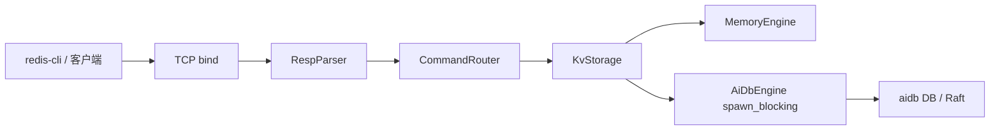

# Cursor transcript

---

## 1. User

## 文档整理 — 新会话

工作目录: `<workspace>` (含 aidb/、aikv/、aifactory/)

请先阅读 (不要跳过):
1. `AiKv-Workflow/backup/design.md` — 总规程
2. `AiKv-Workflow/backup/PROGRESS.md` — 当前进度
3. `AiKv-Workflow/backup/INDEX.md` — 本章索引 (若已有行则更新)

---

### 本次任务

| 项 | 值 |
|----|-----|
| PROGRESS 总步 | 22 (阶段 2b 第 4 篇) |
| 目标文件 | `aikv/README.md` |
| 本次子步 | 从步 0 开始 |
| 对比深度 | **模块级** (汇总文档; 项目入口与特性概览, 不加深章逐段) |

### 必须遵守

- **确认门控**: 步 0→1→2→3→4, 每步先讨论, 我确认后再下一步
- **步 4**: 先出 **正文草稿**, 我确认后再写入 `aikv/`、更新 INDEX/PROGRESS
- **汇总文档**: **不必** Module Skill frontmatter; 作为 **仓库入口** — 一句话定位、特性概览、最小 quick start、文档导航; **不重复** 根文档与 module 正文
- **过程只进 backup/**: INDEX; aikv 不写迁移历史
- **旧文档顺序**: `backup/aikv/README.md` (主) → `aikv-oldmain` 根目录 / `docs/guide/` → WiQunTools 查漏 → `wiqun-kv`
- **待核实**: 根文档至多简要提及; 详情仍引用 `aikv/ISSUES.md` (不展开排查过程)
- **步 4 落盘前**: 对照 design.md 验收项 — 链接有效、与 `Cargo.toml`/CLI (`main.rs`) 一致、与 ARCHITECTURE/DESIGN/DEPLOYMENT 不矛盾

### 上下文 (上一篇已完成)

- 步 21 ✅: [`aikv/DEPLOYMENT.md`](aikv/DEPLOYMENT.md) (构建/feature/CLI/集群/监控 scrape)
- 步 20 ✅: [`aikv/DESIGN.md`](aikv/DESIGN.md)
- 步 19 ✅: [`aikv/ARCHITECTURE.md`](aikv/ARCHITECTURE.md)
- 阶段 1 modules 7 篇全部 ✅; aidb 汇总步 13–18 ✅
- 旧稿: [`AiKv-Workflow/backup/aikv/README.md`](AiKv-Workflow/backup/aikv/README.md) (**过时**: 架构 mermaid 与 ARCHITECTURE 重复、`--port`/`--cluster-mode`、特性长表/Milestone、完整 CLI 表)
- 当前 `aikv/` **尚无** 根目录 `README.md` (步 4 新建)
- `ISSUES.md` 已有 ISSUE-001~023
- 范本: [`aidb/README.md`](aidb/README.md) (阶段 2a 步 16 同类入口)
- 本会话归档参考: [`aikv/archive/21-deployment.md`](aikv/archive/21-deployment.md); aidb 同类: [`aidb/archive/16-readme.md`](aidb/archive/16-readme.md)

### 边界提示 (步 0 可细化)

**README.md** — 回答「是什么、能做什么、30 秒怎么跑、下一步读哪」:

- 宜含: 标题 + 一句话定位 (RESP KV + 可选 Cluster); **能力特性** 短表/bullet (协议/类型/JSON/Lua/存储/cluster/observability — 现状级, 非完整命令表); 与 **AiDb** 关系一句; **最小 quick start** (`--features cluster`, `--bind`, `redis-cli` PING); **文档导航** (ARCHITECTURE / DESIGN / DEPLOYMENT / AGENTS / docs/modules / ISSUES); 当前版本 (`Cargo.toml` **0.10.5**); 许可 MIT
- 宜链: [`DEPLOYMENT.md`](aikv/DEPLOYMENT.md) (构建/feature/集群详例); [`e2e/README.md`](aikv/e2e/README.md) 一行; 已知限制 **极简** 一句 (链 DESIGN 或 ISSUES)
- 不重复: ARCHITECTURE 分层/mermaid/数据流; DESIGN trade-off; DEPLOYMENT CLI 全表与集群多节点示例; modules 命令表; AGENTS/CONTRIBUTING 全文
- 不宜含: `aikv-tool`、Milestone 长表、迁移对照、ISSUES 全文、过时 `--port`/`--cluster-mode`

**与相邻文档分工**

| 文档 | 回答 |
|------|------|
| **README (本篇)** | **项目入口**: 是什么、能做什么、怎么 30 秒跑起来、去哪读 |
| [`ARCHITECTURE.md`](aikv/ARCHITECTURE.md) | 分层、数据流、AiDb 边界 |
| [`DESIGN.md`](aikv/DESIGN.md) | 为什么这样设计 |
| [`DEPLOYMENT.md`](aikv/DEPLOYMENT.md) | 怎么构建、CLI、集群部署、监控 |
| [`CONTRIBUTING.md`](aikv/CONTRIBUTING.md) (步 23) | CI/hook/贡献流程 |

### 本次不要

- 不要跳过未确认的步骤
- 不要一步写步 23+ 或其它 aikv 根文档
- 不要修改 `design.md` / 流程, 除非我明确要求
- 不要 commit, 除非我明确要求

---

请从步 0 开始, 给出本步交付物, 等我确认。

---

## 2. Assistant

先阅读规程、进度与索引，再对照范本和现有材料准备步 0 交付物。

---

## 3. Assistant

继续核对 aikv 现状与范本归档，明确 README 章节的范围边界。

---

## 4. Assistant

## 步 0 — 定范围 (PROGRESS 步 22 · `aikv/README.md`)

对照 `design.md`、PROGRESS 与已完成相邻根文档, 本章是 **阶段 2b 汇总入口**, 对比深度 **模块级**. 本章 **不** 映射单一 `src/` 域, 而是汇总全 crate 的 **对外叙事**; 实现细节仍以 7 篇 modules + 步 19–21 根文档为准.

---

### 1. 本章定位 (一句话)

**仓库入口 README**: 回答「是什么、能做什么、30 秒怎么跑、下一步读哪」; **不** 承担架构 mermaid、设计 why、CLI 全表、集群多节点示例、modules 命令表.

---

### 2. 拟读文件列表 (步 1–4 依据)

| 优先级 | 路径 | 用途 |
|--------|------|------|
| **主** | [`aikv/Cargo.toml`](aikv/Cargo.toml) | 版本 **0.10.5**、feature (`cluster`/`monitoring`)、license **MIT** |
| **主** | [`aikv/src/main.rs`](aikv/src/main.rs) | quick start 对齐: `--bind` (非 `--port`)、`--engine`、`--data-dir`; cluster 用 `--cluster-*` (非 `--cluster-mode`) |
| **主** | [`aikv/src/lib.rs`](aikv/src/lib.rs) | 公共 re-export、feature gate |
| **邻** | [`aikv/ARCHITECTURE.md`](aikv/ARCHITECTURE.md) | 避免重复分层/mermaid/数据流 |
| **邻** | [`aikv/DESIGN.md`](aikv/DESIGN.md) | 避免重复 trade-off; 已知限制一句链出 |
| **邻** | [`aikv/DEPLOYMENT.md`](aikv/DEPLOYMENT.md) | feature 详表、构建、集群部署、监控 — **链出** 即可 |
| **邻** | [`aikv/AGENTS.md`](aikv/AGENTS.md) | 定位/AiDb 一句表述一致 |
| **邻** | [`aikv/docs/modules/*.md`](aikv/docs/modules/) (7 篇) | 文档导航 WHEN 一行 |
| **邻** | [`aikv/ISSUES.md`](aikv/ISSUES.md) | 根文档至多一行「待核实」 |
| **邻** | [`aikv/e2e/README.md`](aikv/e2e/README.md) | E2E 一行导航 |
| **范本** | [`aidb/README.md`](aidb/README.md) | 阶段 2a 步 16 同类入口结构 |
| **步 2 主** | [`AiKv-Workflow/backup/aikv/README.md`](AiKv-Workflow/backup/aikv/README.md) | 旧稿结构参考; **多处过时** (见下) |
| **步 2 查漏** | [`aikv-oldmain/README.md`](aikv-oldmain/README.md) | quick start / 特性 bullet 查漏 |
| **步 2 查漏** | `aikv-oldmain/docs/guide/` (`01-quick-start`, `02-deployment`) | 启动命令查漏; CLI 以 `main.rs` 为准 |
| **步 2 可选** | WiQunTools `docs/wiqun-kv-inventory/` | 仅查漏 README 是否遗漏能力 |
| **步 2 跳过** | `wiqun-kv` | 与 backup 重复 |
| **步 2 跳过** | `aikv-oldmain/aikv-tool/` | 用户边界: 不含 `aikv-tool` |
| **归档参考** | [`aidb/archive/16-readme.md`](aidb/archive/16-readme.md) | 同类步 0–4 会话形态 |

**步 1 不必深读** (汇总层仅引用): `src/protocol/*`, `src/command/*`, `src/cluster/*` 等 — 已由 modules 覆盖.

---

### 3. 本章边界

#### 宜含

| 区块 | 内容要点 |
|------|----------|
| 标题 + 定位 | Redis RESP 兼容 KV 服务 (Rust bin); 可选 Cluster |
| 能力特性 | 短表/bullet: 协议、数据结构、JSON、Lua、存储 (memory/aidb)、cluster、observability — **现状级**, 非完整命令表 |
| 与 AiDb | 一句: 协议/命令在 AiKv, LSM/Raft 在 AiDb; monorepo `../aidb` |
| Quick start | **最小**: `cargo build --release --features cluster` → `./target/release/aikv --bind 127.0.0.1:6379` → `redis-cli PING`; 持久化一句链 DEPLOYMENT |
| 文档导航 | ARCHITECTURE / DESIGN / DEPLOYMENT / AGENTS / docs/modules / ISSUES |
| 元信息 | 版本 **0.10.5**; 许可 **MIT** |
| 链接 | [DEPLOYMENT.md](aikv/DEPLOYMENT.md); [e2e/README.md](aikv/e2e/README.md) 一行 |
| 待核实 | **极简** 一句 → [ISSUES.md](aikv/ISSUES.md) 或 [DESIGN.md](aikv/DESIGN.md) |

#### 不重复 (链出即可)

| 内容 | 归属文档 |
|------|----------|
| 分层 mermaid、数据流 | [`ARCHITECTURE.md`](aikv/ARCHITECTURE.md) |
| 设计取舍 (无 RDB 主路径、feature gate 等) | [`DESIGN.md`](aikv/DESIGN.md) |
| CLI 全表、集群多节点示例、环境变量详表 | [`DEPLOYMENT.md`](aikv/DEPLOYMENT.md) |
| 域级命令/实现 | [`docs/modules/`](aikv/docs/modules/) |
| CI/hook/测试矩阵 | 步 23 [`CONTRIBUTING.md`](aikv/CONTRIBUTING.md) (尚未写) |
| AGENTS 全文 | [`AGENTS.md`](aikv/AGENTS.md) |

#### 不宜含

- `aikv-tool`、Milestone 长表、迁移对照
- ISSUES 全文或排查过程
- 过时 CLI: `--port`、`--cluster-mode`、`--cluster-addr`、`--node-id`
- backup 旧稿中的架构 mermaid (与 ARCHITECTURE 重复)
- backup 旧稿中的完整 CLI 参数表 (与 DEPLOYMENT 重复)

---

### 4. 与相邻根文档分工

| 文档 | 回答 |
|------|------|
| **README (本篇)** | **项目入口**: 是什么、能做什么、30 秒怎么跑、去哪读 |
| [`ARCHITECTURE.md`](aikv/ARCHITECTURE.md) | 分层、数据流、AiDb 边界 |
| [`DESIGN.md`](aikv/DESIGN.md) | 为什么这样设计 |
| [`DEPLOYMENT.md`](aikv/DEPLOYMENT.md) | 构建、CLI、集群部署、监控 |
| [`CONTRIBUTING.md`](aikv/CONTRIBUTING.md) (步 23) | CI/hook/贡献流程 |

---

### 5. 旧稿已知过时点 (步 2 预判, 供核对)

[`backup/aikv/README.md`](AiKv-Workflow/backup/aikv/README.md) 中 **不采纳**:

- 架构 mermaid → 已在 ARCHITECTURE
- `--port` / `--cluster-mode` / `--cluster-addr` / `--node-id` → 现为 `--bind`、`--cluster-node-id`、`--cluster-rpc-addr` 等
- 完整 CLI 表 → DEPLOYMENT
- 集群 3 节点长示例 → DEPLOYMENT 链出
- 特性长表含版本标注 (0.9.3) → 改为现状级 bullet, 版本以 Cargo.toml 为准
- 「未实现 AOF/RDB」可保留 **一句** 并链 DESIGN, 不展开

**可借鉴**: 标题、特性分类结构、E2E 一行、许可段.

---

### 6. INDEX 拟更新行 (步 4 确认后写入)

当前 INDEX 已有占位:

```text
| `README.md` | 待开始 | `backup/aikv/README.md` | 已移出 aikv | 最后修订入口 |
```

步 4 完成后拟改为 (与 aidb 步 16 对齐):

```text
| `README.md` (入口) | ✅ | `backup/aikv/README.md` (主); oldmain `README.md` + `docs/guide/` (查漏); WiQunTools/wiqun-kv 跳过 | 已写 `aikv/README.md` | 模块级; 弃 mermaid/过时 CLI/Milestone; ISSUES 根文档一行 |
```

---

### 7. 步 4 验收自检 (预告)

落盘前对照 `design.md`:

- [ ] 链接有效 (含 `../aidb` 相对路径、docs/modules 7 篇)
- [ ] 版本/feature/license 与 `Cargo.toml` 一致
- [ ] quick start CLI 与 `main.rs` `Args` 一致 (`--bind`, 非 `--port`)
- [ ] 与 ARCHITECTURE / DESIGN / DEPLOYMENT 无矛盾、无大段重复

---

**步 0 交付物**: 拟读文件列表 + 本章边界 + 旧稿过时预判 + INDEX 拟更新行.

请确认或调整 (例如: quick start 是否默认带 `--features cluster`、特性表粒度、待核实是否只链 ISSUES 不链 DESIGN). 确认后进入 **步 1** (读新代码, 梳理职责与对外叙事要点).

---

## 5. User

可以

---

## 6. Assistant

步 0 已确认，开始步 1：阅读新代码并梳理对外叙事要点。

---

## 7. Assistant

## 步 1 — 读新代码 (PROGRESS 步 22 · `aikv/README.md`)

以当前 `aikv/` 源码与已落盘根文档为准, 梳理 **对外叙事要点** (非域实现细节). 以下为步 1 交付物, 供确认后进入步 2.

---

### 1. 产品定位 (源码一致)

| 维度 | 结论 |
|------|------|
| 形态 | **bin + lib** — `[[bin]] aikv` (`src/main.rs`) + `lib.rs` 导出 `protocol` / `server` / `command` / `storage` / `cluster` (feature) |
| 一句话 | Redis **RESP2/3** 兼容 KV **网络服务** (Tokio async), 基于 sibling [AiDb](../aidb/) LSM + 可选 Raft |
| 版本 | **0.10.5** (`Cargo.toml`) |
| 许可 | **MIT** (单许可; 与 aidb 的 `MIT OR Apache-2.0` 不同) |
| 默认 feature | **空** — `cluster` / `monitoring` 均 off; CI/开发主路径 `--features cluster` |
| Monorepo | `aidb = { path = "../aidb" }`; 本地需 sibling `../aidb` |

与 [AGENTS.md](aikv/AGENTS.md)、[ARCHITECTURE.md](aikv/ARCHITECTURE.md) 定位 **一致**: 协议与命令在 AiKv; LSM/Raft 在 AiDb.

---

### 2. 代码地图 (README 级, 不画 mermaid)

```shell
aikv/
├── src/
│   ├── main.rs           # CLI、tracing、build_storage、init_cluster、Server 启动
│   ├── lib.rs            # 模块根; cluster feature gate
│   ├── protocol/         # RESP parser/encoder
│   ├── server/           # TCP Listener/Connection、SharedState、observability 子模块
│   ├── command/          # CommandRouter + 各数据结构/admin 命令
│   ├── storage/          # KvStorage; MemoryEngine / AiDbEngine / ClusterDataAdapter
│   └── cluster/          # [cluster] MOVED/ASK、CLUSTER 子命令、Gossip 展示
├── docs/modules/         # 7 篇域文档 (+ observability-reference)
├── e2e/                  # redis-cli smoke (memory 引擎)
└── examples/             # basic (内嵌 Server)、cluster (CRC16 演示)
```

README **只链** 上述层次, **不** 展开 `command/*` 文件级地图 (属 modules).

---

### 3. 主流程要点 (30 秒叙事依据)



**启动链** (`main.rs`):

1. `init_logging()` — `RUST_LOG` / `AIKV_JSON_LOG`; `monitoring` 时可选 OTel (`AIKV_OTLP_ENDPOINT`)
2. `Args::parse()` — **`--bind`** 默认 `127.0.0.1:6379` (非 `--port`)
3. `build_storage()` — `memory` 或 `aidb` (`--data-dir` 必填); cluster + aidb 时包 `ClusterDataAdapter`
4. `[cluster]` 若提供 `--cluster-node-id` + `--cluster-rpc-addr` → `init_cluster()` (MetaRaft/MultiRaft wiring)
5. `Server::run(bind)` — 接受连接, pipeline 循环
6. `[monitoring]` 可选 `MetricsServer` (`--metrics-addr`:`--metrics-port`, 默认 `127.0.0.1:9191`)

**Quick start 最小命令** (与代码/CI 对齐):

```bash
cargo build --release --features cluster
./target/release/aikv --bind 127.0.0.1:6379
redis-cli -p 6379 PING
```

持久化一句: `--engine aidb --data-dir /path` (详例链 [DEPLOYMENT.md](aikv/DEPLOYMENT.md)).

---

### 4. 能力特性草稿 (README 短表/bullet 素材)

按 **现状级** 分组, **非** 完整命令表:

| 类别 | 现状 (源码/modules 印证) |
|------|--------------------------|
| **协议** | RESP2/RESP3 (HELLO 协商); Pipeline; 仅数组形命令 (无 telnet 内联) |
| **数据结构** | String, Hash, List, Set, Sorted Set, Key/DB 管理 |
| **JSON** | JSON.SET/GET/DEL/TYPE/STRLEN/ARRLEN/OBJLEN, NUMINCRBY/ARRAPPEND/MSET 等 |
| **Lua** | EVAL/EVALSHA, SCRIPT LOAD/EXISTS/FLUSH; mlua 沙箱 + `redis.call` |
| **阻塞** | BLPOP/BRPOP/BLMOVE, BZPOPMIN/BZPOPMAX (`BlockingRegistry`) |
| **存储** | `memory` (默认, 无持久化) / `aidb` (WAL+LSM, 生产推荐) |
| **持久化** | SAVE/BGSAVE/LASTSAVE/SHUTDOWN → aidb `Checkpoint`; **非** 标准 RDB 主路径 |
| **集群** | `[cluster]` 16384 slot, MOVED/ASK, CLUSTER 子命令, slot 迁移, failover 子集; 共识在 AiDb MetaRaft/MultiRaft |
| **可观测** | SLOWLOG, LATENCY, INFO; `[monitoring]` 时 HTTP `/metrics` + OTel |
| **跨节点** | MIGRATE (单 key TCP restore); 部分子命令 stub/限制见 ISSUES |
| **验证** | `cargo test --features cluster`; [e2e/](aikv/e2e/) smoke; `examples/basic` |

**Feature 一览** (链 DEPLOYMENT 详表):

| Feature | 默认 | README 一句 |
|---------|------|-------------|
| (none) | ✅ | 单机 RESP, 无 cluster init, 无 HTTP metrics |
| `cluster` | ❌ | Redis Cluster 协议 + `aidb/cluster` |
| `monitoring` | ❌ | Prometheus `/metrics`, OTel, `aidb/monitoring` |

---

### 5. 与 AiDb 关系 (README 一句草稿)

> [AiDb](../aidb/) 提供同步 LSM 引擎与 MetaRaft/Multi-Raft; AiKv 在其上实现 TCP、Redis 命令语义与 Cluster **客户端协议**. Monorepo 内 `path = "../aidb"`.

---

### 6. 已知限制 (README 极简一句素材)

来自 [DESIGN.md](aikv/DESIGN.md) §与 Redis, **不展开**:

- 无标准 `dump.rdb` / memory AOF; 持久化走 aidb Checkpoint
- 非 100% Redis 命令兼容; stub/差异见 modules 与 [ISSUES.md](aikv/ISSUES.md)
- `CONFIG REWRITE` 未实现

**根文档「待核实」** 拟与 ARCHITECTURE/DEPLOYMENT 对齐, **合并为一行**:

> 集群 failover/stub 子命令与可观测性默认差异 — 见 [ISSUES.md](aikv/ISSUES.md).

(不逐条 ISSUE-001~023.)

---

### 7. 文档导航草稿 (README §文档)

| 文档 | 一句 |
|------|------|
| [ARCHITECTURE.md](aikv/ARCHITECTURE.md) | 分层、数据流、AiDb 边界 |
| [DESIGN.md](aikv/DESIGN.md) | 跨模块设计决策与取舍 |
| [DEPLOYMENT.md](aikv/DEPLOYMENT.md) | 构建、feature、CLI、集群部署、监控 |
| [CONTRIBUTING.md](aikv/CONTRIBUTING.md) | 步 23 待写; README 可占位链或略提 |
| [CHANGELOG.md](aikv/CHANGELOG.md) | 步 23 待写; 可略或占位 |
| [AGENTS.md](aikv/AGENTS.md) | AI 助手与 CI 入口 |
| [docs/modules/](aikv/docs/modules/) | 7 篇域文档 (protocol → observability) |
| [ISSUES.md](aikv/ISSUES.md) | 待核实项 |
| [e2e/README.md](aikv/e2e/README.md) | redis-cli smoke 测试 |

`docs/README.md` (步 24 hub) **本篇不建**, 可一句「开发文档 hub 见步 24 `docs/README.md`」或暂不提.

**examples** 可选一行 (aidb README 有): `cargo run --example basic` — 内嵌 memory Server, 非独立二进制路径.

---

### 8. 步 1 结论 (供步 2/4 用)

1. **README 叙事主轴**: RESP 服务 + 可选 Cluster + 双引擎; 30 秒 = `build --features cluster` → `--bind` → `redis-cli PING`.
2. **CLI 关键事实**: `--bind` (host:port 合一); cluster 用 `--cluster-node-id` / `--cluster-rpc-addr` / `--cluster-peers`; **无** `--port` / `--cluster-mode`.
3. **特性表**: 按协议/类型/JSON/Lua/存储/cluster/observability 分组 bullet 或短表; 不抄 backup 旧稿长表与版本标注 (0.9.3).
4. **不重复**: ARCHITECTURE mermaid、DEPLOYMENT CLI 全表、modules 命令注册表、AGENTS CI 全文.
5. **待核实**: 根文档一行链 ISSUES (与相邻根文档一致).
6. **许可**: MIT only (不写 Apache-2.0).

---

**步 1 交付物**: 定位、代码地图、主流程、能力/feature 草稿、AiDb 关系、限制一句、文档导航草稿.

请确认或调整 (例如: quick start 是否写 `memory` 还是默认即可、特性表用 bullet 还是表格、是否加 `examples` 一行). 确认后进入 **步 2** (查旧文档: `backup/aikv/README.md` → oldmain → WiQunTools 查漏).

---

## 8. User

可以

---

## 9. Assistant

步 1 已确认，开始步 2：按顺序查阅旧文档并分类。

---

## 10. Assistant

## 步 2 — 查旧文档 (交付物)

按 `backup/aikv/README.md` → `aikv-oldmain` → WiQunTools → `wiqun-kv` 顺序查阅, 对照步 1 结论与步 19–21 根文档. **尚未写正文.**

---

### 1. 旧文档清单与分类

| 来源 | 路径 | 分类 | 说明 |
|------|------|------|------|
| **主** | [`backup/aikv/README.md`](AiKv-Workflow/backup/aikv/README.md) | **部分仍有效** | 定位句、特性分类、E2E 提及、文档链、许可可借鉴; 架构 mermaid / CLI / quick start / 集群示例 **过时** |
| 查漏 | [`aikv-oldmain/README.md`](aikv-oldmain/README.md) | **已过时** | v0.1.0/路线图/90% 进度、100+ 命令枚举、`aikv-tool`、TOML `--config`、`cluster_port` 16379 gossip、性能基准、Docker/badge — **非当前 README 叙事** |
| 查漏 | [`aikv-oldmain/docs/guide/01-quick-start.md`](aikv-oldmain/docs/guide/01-quick-start.md) | **已过时** | 主路径 `aikv-tool cluster setup`; 方式三 `--config config.toml`; 长命令演示 — **不迁** |
| 查漏 | [`aikv-oldmain/docs/guide/02-deployment.md`](aikv-oldmain/docs/guide/02-deployment.md) | **已过时/链出** | 运维详例已在步 21 `DEPLOYMENT.md`; README 只链 DEPLOYMENT |
| 查漏 | `guide/03-troubleshooting.md`, `04-best-practices.md` | **跳过** | 运维专题, 非入口 |
| WiQunTools | `docs/wiqun-kv-inventory/01–08` | **无有效内容跳过** | 模块级 inventory; 能力点已在 7 篇 modules + 步 1 特性草稿覆盖 |
| 重叠 | [`wiqun-kv/README.md`](wiqun-kv/README.md) | **重复跳过** | 与 backup/aikv 旧稿同构 |

---

### 2. `backup/aikv/README.md` 逐段处理

| 旧稿段落 | 判定 | 新 README 处理 |
|----------|------|----------------|
| 首段定位 (RESP KV / memory+aidb / 可选集群) | ✅ 仍有效 | **保留**, 对齐 AGENTS/ARCHITECTURE 表述 |
| §架构 mermaid | ❌ 重复 | **删除**, 链 [ARCHITECTURE.md](aikv/ARCHITECTURE.md) |
| §特性长表 (含 ✅/未实现/0.9.3 标注) | ⚠️ 部分有效 | 改为 **现状级** bullet/短表; **不写** 版本里程碑标注 |
| 「未实现 AOF / RDB / CONFIG REWRITE」 | ✅ 仍有效 | **极简一句** + 链 [DESIGN.md](aikv/DESIGN.md) |
| Quick start `--port` / `--cluster-mode` | ❌ 过时 | → `--bind 127.0.0.1:6379`; cluster 链 DEPLOYMENT |
| 集群 3 节点 `--port`/`--cluster-addr`/`--node-id` 示例 | ❌ 过时 | **不迁**; 一句「集群见 DEPLOYMENT」 |
| §命令行参数全表 | ❌ 重复 | **不迁**; 链 DEPLOYMENT |
| §构建与测试 (`cargo test --features cluster`) | ⚠️ 部分有效 | README **不写** 测试矩阵; 可选一句链 DEPLOYMENT/CONTRIBUTING (步 23) |
| §E2E (`e2e/test_*.sh`) | ✅ 仍有效 | **一行** + 链 [e2e/README.md](aikv/e2e/README.md) |
| §设计文档 (3 链) | ✅ 仍有效 | **扩展**: + AGENTS、docs/modules、ISSUES、CONTRIBUTING/CHANGELOG (占位或略) |
| §许可 MIT | ✅ 仍有效 | 与 `Cargo.toml` **MIT** 一致 |

---

### 3. `aikv-oldmain` 查漏结论 (一律不采纳进 README)

| 旧表述 | 当前事实 |
|--------|----------|
| v0.1.0 / v1.0.0 2026.03.31 / 集群 90% | 当前 **0.10.5**; 无路线图长表 |
| 「100% Redis Cluster 兼容」 | **子集兼容**; stub/差异见 ISSUES + DESIGN |
| 100+ 命令逐项枚举 | 属 modules; README **分类概览** 即可 |
| `aikv-tool` / Docker Compose 一键部署 | **边界外**; 链 DEPLOYMENT 手工 CLI |
| `--config config.toml` / `[server] port` | 现为 **clap `--bind`** 等; 无 TOML 主配置 |
| `cluster_port = 16379` Cluster Bus gossip 共识 | 数据面 `rpc_port + offset`; 共识 **MetaRaft** (DESIGN/ARCHITECTURE) |
| Snappy 压缩 | aidb `compression` 占位; README **不写** |
| `SCRIPT KILL`、MONITOR、事务性回滚宣称 | 以 modules/DESIGN 为准; README **不写** 未核实细节 |
| redis-benchmark 性能数字 / P99 目标 | **不迁**; 非入口文档 |
| Badge (build/tests 177) | 步 0 已定 **不含 badge** |

**仍可借鉴 (oldmain, 压缩后):**

- 特性按「核心 / 集群 / 其他」分组思路 (改为无 emoji、无进度条)
- `redis-cli PING` + 少量 SET/GET 作为 quick start 验证 (比 oldmain 长演示短得多)

---

### 4. WiQunTools / wiqun-kv

| 检查项 | 结论 |
|--------|------|
| inventory 01 RESP/TCP | 已在 protocol + server module; README 写「RESP2/3 + Pipeline」即可 |
| 02 存储/命令 | 数据结构 bullet 已覆盖 |
| 03 extended / 04 JSON / 05 Lua | JSON/Lua/阻塞/MIGRATE 已在步 1 草稿 |
| 06 persistence | SAVE/BGSAVE → Checkpoint; 一句链 DESIGN |
| 07 cluster | MOVED/ASK/CLUSTER; 不重复 gossip 共识细节 |
| 08 observability | `/metrics` 需 `monitoring` feature; 链 DEPLOYMENT, 不展开 15s refresh |
| **README 遗漏能力?** | **无** — 无需新增 ISSUE |

---

### 5. ISSUES 结论

| 项 | 结论 |
|----|------|
| **新增 ISSUE** | **无** — README 不展开排查 |
| **根文档一行「待核实」** | 与 ARCHITECTURE/DEPLOYMENT 对齐, 合并为一句: |
| | `集群 failover/stub 子命令与可观测性默认差异 — 见 [ISSUES.md](aikv/ISSUES.md).` |
| **逐条 ISSUE-001~023** | README **不列** (属 modules/根文档 DESIGN 引用域) |

---

### 6. 步 4 正文素材汇总 (旧稿 → 新稿映射)

**从旧稿保留/改写:**

1. `# AiKv` + 定位 (backup 首段, 去「Phase」口吻).
2. **特性** — 由长表改为分组 bullet/短表 (协议 / 数据结构 / JSON / Lua / 存储 / 集群 / 可观测 / 验证).
3. **Feature 简表** — `cluster` / `monitoring` + 链 DEPLOYMENT (backup 无独立表).
4. **与 AiDb** — 新写一句 (backup 旧稿无; oldmain 混写 MultiRaft 细节 → 压缩).
5. **Quick start** — 3 行 shell: `build --features cluster` → `aikv --bind` → `redis-cli PING`; 持久化一句链 DEPLOYMENT.
6. **E2E** — 一行链 `e2e/README.md`.
7. **examples** — 可选一行 (`cargo run --example basic`), 对齐 aidb README.
8. **已知限制** — backup「未实现」一句 + DESIGN.
9. **文档导航** — 扩展至 ARCHITECTURE / DESIGN / DEPLOYMENT / AGENTS / modules / ISSUES.
10. **许可** — MIT.

**明确删除 (相对 backup/oldmain):**

- 架构 mermaid
- CLI 参数表、集群多节点 shell 块
- Milestone / 路线图 / 进度条
- `aikv-tool`、Docker、`--config`
- 性能 benchmark 表、badge、100+ 命令列表
- CONTRIBUTING/CI 全文 (步 23)

**拟章节骨架** (与 aidb 步 16 对齐, ~70–90 行):

```markdown
# AiKv
## 特性
## 与 AiDb
## 快速开始
## 示例          <!-- 可选一行 -->
## 文档
## 待核实        <!-- 一行 -->
## 许可
```

---

### 7. 拟写入 INDEX 的本章行 (步 4 确认后)

| 新文档章节 | 状态 | 参考的旧文档 | 处理 | 备注 |
|------------|------|--------------|------|------|
| `README.md` (入口) | 步 2 完成 | `backup/aikv/README.md` (主); oldmain `README.md` + `docs/guide/` (查漏); WiQunTools/wiqun-kv 跳过 | 待步 4 | 借鉴定位/特性/E2E/文档链; 弃 mermaid/过时 CLI/aikv-tool/Milestone; ISSUES 根文档一行 |

---

### 8. 步 2 自检

- [x] 旧文档顺序符合 design.md
- [x] 分类: 仍有效 / 已过时 / 设计偏离 / 跳过
- [x] 与步 19–21 无新增矛盾
- [x] 无新 ISSUE; 根文档引用方式已定
- [x] 未写 `aikv/README.md`

---

请确认步 2. 确认后进入 **步 3 (模块级对比)**: 主要对照 backup 旧 README 叙事 vs 当前 `main.rs`/feature/modules, 产出差异表与表述建议 (不加深章逐段).

---

## 11. User

可以

---

## 12. Assistant

步 2 已确认，开始步 3：做模块级旧代码对比。

---

## 13. Assistant

## 步 3 — 模块级旧代码对比 (交付物)

对照 **backup 旧 README 叙事**、**oldmain 产品表述** 与 **当前 `aikv/` 实现** (抽样: `main.rs`, `Cargo.toml`, `lib.rs`, modules 7 篇, 步 19–21 根文档). 对比深度 **模块级**, 不做 oldmain 逐文件对照.

---

### 1. 差异表 (旧 → 新 → README 应如何写)

| 维度 | 旧文档表述 | 当前实现 (模块级) | README 表述建议 |
|------|-----------|-------------------|-----------------|
| **产品形态** | backup: RESP KV 服务; oldmain: 「分布式 KV」+ 路线图 | **bin + lib**, Tokio TCP 服务; 集群为 **可选 feature** | 「Redis RESP 兼容 KV **网络服务** (Rust)」; 不写 v1.0/90% 进度 |
| **版本** | backup 特性表标 0.9.3; oldmain v0.1.0 | `Cargo.toml` **0.10.5** | 副标题或特性段末写 **0.10.5**; 不写 Milestone |
| **许可** | backup/oldmain MIT | `license = "MIT"` | 写 **MIT** (与 aidb 双许可区分) |
| **默认 feature** | oldmain `cargo build --release` 即跑; backup 集群示例隐含 cluster | **`default = []`**; CI/开发主路径 `--features cluster` | quick start **显式** `--features cluster`; feature 简表链 DEPLOYMENT |
| **监听地址** | `--port 6379` + `--bind 127.0.0.1` | **单一** `--bind 127.0.0.1:6379` (`Args`) | quick start 只用 `--bind`; **不提** `--port` |
| **集群开关** | `--cluster-mode` + `--cluster-addr` + `--node-id` (string) | `--cluster-node-id` (u64) + `--cluster-rpc-addr` + `--cluster-peers`; **无** `--cluster-mode` | README **不写** 集群启动示例; 一句链 DEPLOYMENT |
| **配置方式** | oldmain `--config config.toml` | **纯 clap**; 无 TOML 主配置 | **不写** `--config` |
| **存储引擎** | `--engine memory` / `aidb` | 一致; `aidb` 缺 `--data-dir` 则 exit 1 | quick start 默认 memory 即可; 持久化一句 `--engine aidb --data-dir` |
| **架构图** | backup mermaid 全栈 | 步 19 `ARCHITECTURE.md` 已有分层 mermaid | **删除**; 文档导航链 ARCHITECTURE |
| **协议** | RESP2/3, Pipeline, Tokio | `protocol/` + `server/`; 无 telnet 内联 | bullet: RESP2/3, Pipeline; **不写** 「完全兼容所有客户端」 |
| **数据结构** | backup 长表 6 类 | `commands-core` 覆盖 String~ZSet/Key/DB | bullet 列举类型名; **不** 枚举命令 |
| **JSON / Lua** | backup ✅; oldmain 7 JSON 命令 | `commands-extended` 扩展 JSON + EVAL/SCRIPT | bullet 各一行; Lua 写 EVAL/SCRIPT LOAD 等, **不写** 「SCRIPT KILL 完整支持」 |
| **阻塞命令** | backup「0.9.3 新增」 | BLPOP/BRPOP/BLMOVE/BZPOPMIN/BZPOPMAX | 并入特性 bullet; **不写** 版本号 |
| **持久化** | backup SAVE/BGSAVE ✅; 未实现 AOF/RDB | aidb `Checkpoint`; 非标准 RDB | 一句: SAVE/BGSAVE → Checkpoint; 限制链 DESIGN |
| **集群协议** | MOVED/ASK, CLUSTER *, slot 迁移 | `cluster/` + aidb MetaRaft/MultiRaft; gossip **展示** 非共识 | bullet: 16384 slot, MOVED/ASK, CLUSTER 子命令; **不写** 16379 gossip 共识 |
| **可观测** | backup「Prometheus :9191, OTel, slowlog」 | HTTP `/metrics` **仅** `[monitoring]`; slowlog/LATENCY/INFO 始终有 | bullet 分两层: 基础 INFO/SLOWLOG; monitoring 时 `/metrics`+OTel; 链 DEPLOYMENT |
| **部署工具** | oldmain `aikv-tool` 主路径 | 仓库内 **无** aikv-tool 目标结构 | **不提** aikv-tool/Docker |
| **E2E** | backup 列 5 个 `test_*.sh` | 现 **22** 个脚本; CI 主跑 `test_cluster_formation.sh` 等 | 一行链 `e2e/README.md`; **不** 列脚本名 |
| **测试** | oldmain 177 tests; backup `cargo test --features cluster` | workspace test + e2e job | **不写** 测试矩阵; 可选链 DEPLOYMENT/CONTRIBUTING (步 23) |
| **examples** | backup 无; 现有 `basic`/`cluster` | `examples/README.md` 2 例 | 可选一行 `cargo run --example basic` |
| **性能** | oldmain 80k–100k ops/s 表 | 无 README 级 bench 文档 | **不迁** |
| **MONITOR** | oldmain README 列出 | `connection.rs` 有 `MONITOR` 命令 | README **可不单列**; 非核心卖点 |
| **SCRIPT KILL** | oldmain/old backup 宣称支持 | `script_kill()` 恒 `NOTBUSY` (stub) | README Lua bullet **不写 KILL**; 属 DESIGN/ISSUE-012 域 |

---

### 2. 模块级等价性 (主流程是否仍成立)

| 旧 README 叙事 | 当前代码路径 | 结论 |
|----------------|-------------|------|
| Client → TCP → Parser → Router → Storage | `Server` → `Connection` → `CommandRouter` → `KvStorage` | ✅ 等价, 细节在 ARCHITECTURE |
| Memory / AiDb 双引擎 | `build_storage()` → `MemoryEngine` / `AiDbEngine` | ✅ 等价 |
| Cluster 重定向 | `[cluster]` `init_cluster` + `cluster_route` | ✅ 等价; **启动参数** 已变 |
| Prometheus metrics | `[monitoring]` `MetricsServer` + `--metrics-port` | ⚠️ 需 feature; backup 未强调 |
| E2E redis-cli smoke | `e2e/*.sh` + `utils.sh` | ✅ 等价; 脚本更多 |

**步 3 结论**: 产品叙事主线未变; **CLI、feature 默认、集群参数、metrics 门控** 为 README 必须对齐的硬差异.

---

### 3. 与相邻根文档交叉检查

| 检查项 | ARCHITECTURE | DESIGN | DEPLOYMENT | README 策略 |
|--------|--------------|--------|------------|-------------|
| AiDb 边界一句 | ✅ | ✅ | 链 aidb DEPLOYMENT | **复用** AGENTS/ARCHITECTURE 同款一句 |
| 无 RDB/AOF 主路径 | 提及 | §与 Redis 详述 | 持久化节 | **极简一句** + 链 DESIGN |
| `--bind` 非 `--port` | 端口角色 | — | CLI 表权威 | quick start **对齐 DEPLOYMENT** |
| `cluster` feature | feature 边界 | why gate | 构建矩阵 | 简表 + 链 DEPLOYMENT |
| ISSUES 根文档一行 | 2 行合并 | 2 行合并 | 3 条具体 | README **合并为 1 行** 链 ISSUES (不重复 DEPLOYMENT 的 ISSUE-020~022 枚举) |

无新增矛盾.

---

### 4. 步 4 表述建议 (汇总)

**一句话定位 (定稿倾向):**

> AiKv 是用 Rust 实现的 **Redis RESP 兼容 KV 服务**. 支持内存或 AiDb 持久化引擎, 可选 Redis Cluster 协议 (`--features cluster`).

**Quick start (定稿倾向):**

```bash
cargo build --release --features cluster
./target/release/aikv --bind 127.0.0.1:6379
redis-cli -p 6379 PING
```

持久化追加一句 (不展开):

```bash
./target/release/aikv --bind 127.0.0.1:6379 --engine aidb --data-dir /tmp/aikv-data
```

**特性组织 (定稿倾向):** 两组 — **单机能力** bullet + **可选 feature** 简表 (`cluster` / `monitoring`).

**待核实 (定稿倾向):** 与 ARCHITECTURE 同款合并一句, 不列 ISSUE 编号.

**篇幅:** ~70–90 行 (对齐 aidb README ~90 行).

---

### 5. ISSUES / 步 3 结论

| 项 | 结论 |
|----|------|
| 新 ISSUE | **无** — SCRIPT KILL stub 等已在 ISSUE-012 等; README 不展开 |
| 旧稿「100% 兼容」 | 文档表述修正为 **子集兼容**, 非新 ISSUE |

---

### 6. 步 3 自检

- [x] 模块级对照 backup 叙事 vs `main.rs` / feature / modules
- [x] 差异表 + README 表述建议
- [x] 与步 19–21 无矛盾
- [x] 无新 ISSUE
- [x] 未写 `aikv/README.md`

---

请确认步 3. 确认后进入 **步 4**: 先出 **`aikv/README.md` 正文草稿** 供讨论, 确认后再落盘并更新 INDEX/PROGRESS.

---

## 14. User

可以

---

## 15. Assistant

步 3 已确认，开始起草 README 正文草稿；落盘前先对照范本与相邻文档核对链接与表述。

---

## 16. Assistant

## 步 4 — 正文草稿 (讨论稿, 尚未落盘)

以下为拟写入 [`aikv/README.md`](aikv/README.md) 的全文草稿. **请确认或调整后再落盘**, 并更新 INDEX/PROGRESS.

---

```markdown
# AiKv

用 Rust 实现的 **Redis RESP 兼容 KV 网络服务** (bin + lib, 当前 **0.10.5**). 对外提供 RESP2/3 与 Redis 命令语义; 存储可选内存或 AiDb LSM 持久化; 集群与 HTTP 指标通过 Cargo feature 按需启用.

## 特性

**服务与协议** (始终可用):

- RESP2/RESP3 (HELLO 协商), Pipeline, Tokio 异步 TCP
- 数据结构: String, Hash, List, Set, Sorted Set, Key/DB 管理
- JSON 命令, Lua `EVAL`/`EVALSHA`/`SCRIPT`
- 阻塞列表/ZSet: BLPOP/BRPOP/BLMOVE, BZPOPMIN/BZPOPMAX
- 持久化运维: SAVE/BGSAVE/LASTSAVE/SHUTDOWN (aidb 路径走 `Checkpoint`, 非标准 RDB 主路径)
- 可观测: INFO, SLOWLOG, LATENCY 直方图

**存储引擎**:

| 引擎 | CLI | 说明 |
|------|-----|------|
| 内存 | `--engine memory` (默认) | 开发/测试; 重启数据丢失 |
| AiDb | `--engine aidb --data-dir <path>` | WAL + LSM; **生产与集群推荐** |

**可选能力** (feature):

| 能力 | Feature | 说明 |
|------|---------|------|
| Redis Cluster | `cluster` | MOVED/ASK, CLUSTER 子命令, slot 迁移; `aidb/cluster` |
| Prometheus / OTel | `monitoring` | HTTP `/metrics`, tracing 导出; `aidb/monitoring` |

Feature 组合、CLI 全表与集群多节点示例见 [DEPLOYMENT.md](DEPLOYMENT.md).

## 与 AiDb

[AiDb](../aidb/) 提供同步 LSM 引擎与 MetaRaft/Multi-Raft 共识; AiKv 在其上实现 TCP、Redis 命令与 Cluster **客户端协议**. Monorepo 内 `aidb = { path = "../aidb" }`; 本地开发需 sibling 布局 `../aidb`.

## 快速开始

```bash
# 确保 ../aidb 存在
cargo build --release --features cluster
./target/release/aikv --bind 127.0.0.1:6379

# 另开终端
redis-cli -p 6379 PING
```

持久化 (生产推荐):

```bash
./target/release/aikv --bind 127.0.0.1:6379 --engine aidb --data-dir /tmp/aikv-data
```

集群部署与 `monitoring` scrape 见 [DEPLOYMENT.md](DEPLOYMENT.md).

## 示例

内嵌 memory Server 演示 (无需单独起二进制):

```bash
cargo run --example basic
```

| 示例 | 说明 | 运行 |
|------|------|------|
| `basic` | PING/SET/GET/HSET/INFO 等 | `cargo run --example basic` |
| `cluster` | CRC16 槽位 / hash tag | `cargo run --features cluster --example cluster` |

详见 [examples/README.md](examples/README.md).

## E2E 测试

基于 `redis-cli` 的 shell smoke 测试 (需先 `cargo build --release --features cluster`):

```bash
./e2e/test_basic.sh
```

详见 [e2e/README.md](e2e/README.md).

## 文档

| 文档 | 内容 |
|------|------|
| [ARCHITECTURE.md](ARCHITECTURE.md) | 分层、数据流、与 AiDb 边界 |
| [DESIGN.md](DESIGN.md) | 跨模块设计决策与已知限制 |
| [DEPLOYMENT.md](DEPLOYMENT.md) | 构建、feature、CLI、集群部署、监控 |
| [AGENTS.md](AGENTS.md) | AI 助手与 CI 入口 |
| [docs/modules/protocol.md](docs/modules/protocol.md) | RESP parser/encoder |
| [docs/modules/server.md](docs/modules/server.md) | TCP Listener/Connection |
| [docs/modules/storage.md](docs/modules/storage.md) | KvStorage, MemoryEngine, AiDbEngine |
| [docs/modules/commands-core.md](docs/modules/commands-core.md) | 核心数据结构命令, Router |
| [docs/modules/commands-extended.md](docs/modules/commands-extended.md) | JSON, Lua, SAVE, INFO, MIGRATE |
| [docs/modules/cluster.md](docs/modules/cluster.md) | MOVED/ASK, CLUSTER 子命令 |
| [docs/modules/observability.md](docs/modules/observability.md) | slowlog, INFO, `/metrics` |
| [ISSUES.md](ISSUES.md) | 待核实项 |

## 已知限制

非 100% Redis 命令兼容; 无标准 `dump.rdb` / memory AOF 主路径. 详情见 [DESIGN.md §与 Redis](DESIGN.md#与-redis-兼容什么-放弃什么).

## 待核实

集群 failover/stub 子命令与可观测性默认差异 — 见 [ISSUES.md](ISSUES.md).

## 许可

[MIT](LICENSE) (见 [Cargo.toml](Cargo.toml)).
```

---

### 草稿说明

| 项 | 处理 |
|----|------|
| 篇幅 | ~95 行, 与 aidb README 同量级 |
| 未链 `CONTRIBUTING.md` / `CHANGELOG.md` | 步 23 尚未落盘, 避免死链 |
| 未链 `docs/README.md` | 步 24 hub 尚未建 |
| Quick start | `--bind` + `--features cluster`, 无 `--port` / `--cluster-mode` |
| 架构 mermaid / CLI 全表 | 已剔除, 链 ARCHITECTURE / DEPLOYMENT |
| `monitoring` | 特性表提及; quick start 不强制 (与 DEPLOYMENT 一致) |
| 待核实 | 合并一行链 ISSUES, 不枚举 ISSUE-001~023 |

### 步 4 落盘前验收自检 (预告)

- [ ] 链接均指向已存在文件
- [ ] 版本 `0.10.5`、许可 MIT 与 `Cargo.toml` 一致
- [ ] quick start CLI 与 `main.rs` 一致
- [ ] 与 ARCHITECTURE / DESIGN / DEPLOYMENT 无矛盾、无大段重复

---

请确认草稿 (或指出需改处). 确认后我将: 写入 `aikv/README.md`、更新 `backup/INDEX.md` 与 `backup/PROGRESS.md` (步 22 ✅). **不 commit**.

---

## 17. User

可以

---

## 18. Assistant

草稿已确认，正在写入 `aikv/README.md` 并更新 INDEX 与 PROGRESS。

---

## 19. Assistant

步 22 已完成落盘.

### 已写入

- [`aikv/README.md`](aikv/README.md) — 项目入口 (定位、特性、quick start、文档导航)
- [`AiKv-Workflow/backup/INDEX.md`](AiKv-Workflow/backup/INDEX.md) — README 行 ✅
- [`AiKv-Workflow/backup/PROGRESS.md`](AiKv-Workflow/backup/PROGRESS.md) — 步 22 ✅ (2026-06-18)

### 验收自检

- 文档内 16 个相对链接目标均存在
- 版本 **0.10.5**、许可 **MIT** 与 `Cargo.toml` 一致
- quick start 使用 `--bind` + `--features cluster`, 无过时 `--port` / `--cluster-mode`
- 未链步 23/24 尚未创建的 `CONTRIBUTING.md` / `CHANGELOG.md` / `docs/README.md`

### 阶段 2b 剩余

| 步 | 章节 | 状态 |
|----|------|------|
| 23 | `CONTRIBUTING.md` / `CHANGELOG.md` | ⬜ |
| 24 | `docs/README.md` | ⬜ |

未做 commit. 需要继续步 23 时开新会话或在本会话继续即可.

---

## 20. User

使用 vibe-coding/scripts/archive-cursor-session.sh  帮我保存当前对话到 archive 里面 带 tool 和不带 tool 的都保存
