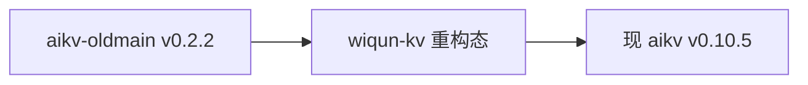

# Cursor transcript

---

## 1. User

## 文档整理 — 新会话

工作目录: `<workspace>` (含 aidb/、aikv/、aifactory/)

请先阅读 (不要跳过):
1. `AiKv-Workflow/backup/design.md` — 总规程
2. `AiKv-Workflow/backup/PROGRESS.md` — 当前进度
3. `AiKv-Workflow/backup/INDEX.md` — 本章索引 (若已有行则更新)

---

### 本次任务

| 项 | 值 |
|----|-----|
| PROGRESS 总步 | 23 (阶段 2b 第 5 篇) |
| 目标文件 | `aikv/CONTRIBUTING.md` + `aikv/CHANGELOG.md` |
| 本次子步 | 从步 0 开始 |
| 对比深度 | **模块级** (汇总文档; 贡献流程与版本记录, 不加深章逐段) |

### 必须遵守

- **确认门控**: 步 0→1→2→3→4, 每步先讨论, 我确认后再下一步
- **步 4**: 先出 **两篇正文草稿** (CONTRIBUTING + CHANGELOG), 我确认后再写入 `aikv/`、更新 INDEX/PROGRESS
- **汇总文档**: **不必** Module Skill frontmatter
- **过程只进 backup/**: INDEX; aikv 不写迁移历史
- **旧文档顺序**: `backup/aikv/CONTRIBUTING.md` / `backup/aikv/CHANGELOG.md` (主) → `aikv-oldmain` 根目录/CI 类 → WiQunTools 查漏 → `wiqun-kv`
- **待核实**: 根文档至多简要提及; 详情仍引用 `aikv/ISSUES.md` (不展开排查过程)
- **步 4 落盘前**: 对照 design.md 验收项 — CI/hooks 与当前 `.github/workflows/`、`install-hooks.sh`、`tests/`、`e2e/` 一致; CHANGELOG 版本与 `Cargo.toml` (**0.10.5**) 对齐; 与 README/DEPLOYMENT/AGENTS 不矛盾

### 上下文 (上一篇已完成)

- 步 22 ✅: [`aikv/README.md`](aikv/README.md) — 项目入口; 测试矩阵一句链 DEPLOYMENT/CONTRIBUTING
- 步 19–21 ✅: ARCHITECTURE / DESIGN / DEPLOYMENT
- 阶段 1 modules 7 篇全部 ✅; 阶段 2a aidb 汇总步 13–18 ✅
- 旧稿: [`AiKv-Workflow/backup/aikv/CONTRIBUTING.md`](AiKv-Workflow/backup/aikv/CONTRIBUTING.md)、[`CHANGELOG.md`](AiKv-Workflow/backup/aikv/CHANGELOG.md) (已移出 aikv; **CONTRIBUTING 目录树过时**: `persistence/`/`script/` 顶层、覆盖率 80%)
- 当前 `aikv/` **尚无** 上述两篇根文档 (步 4 新建)
- CI 详述在 [`aikv/.github/README.md`](aikv/.github/README.md); AGENTS 有精简 CI 块
- `docs/development.md` **尚未**创建 (本步可不写; 步 24 为 `docs/README.md` 导航)
- 范本 (同类步 17): [`aidb/CONTRIBUTING.md`](aidb/CONTRIBUTING.md)、[`aidb/CHANGELOG.md`](aidb/CHANGELOG.md)
- 本会话归档参考: [`aikv/archive/22-readme.md`](aikv/archive/22-readme.md); aidb 同类: [`aidb/archive/17-contributing-changelog.md`](aidb/archive/17-contributing-changelog.md)

### 边界提示 (步 0 可细化)

**CONTRIBUTING.md** — 回答「怎么贡献、怎么过门禁」:

- 宜含: 工具链 (`rust-toolchain.toml`)、sibling `../aidb`、`install-hooks.sh`、pre-commit 范围 (fmt + cluster clippy, **不含 test**)、与 CI 分工 (链 `.github/README.md` 详表)、**完整测试矩阵** (unit/integration/`--ignored` 慢测/e2e job)、commit message 约定、PR/CI 要求、`protoc` 说明 (cluster)
- 宜链: [`DEPLOYMENT.md`](aikv/DEPLOYMENT.md) (构建/feature 命令)、[`tests/README.md`](aikv/tests/README.md) (若有)、[`e2e/README.md`](aikv/e2e/README.md)
- 不重复: feature 矩阵与部署详例 → DEPLOYMENT; 架构/设计 → ARCHITECTURE/DESIGN; 项目入口 → README; AGENTS 全文
- 旧 CONTRIBUTING **可能过时**: 目录树、`cargo run -- --bind` 旧写法、覆盖率 80%/llvm-cov — 以当前仓库为准

**CHANGELOG.md** — 回答「版本变了什么」:

- 宜含: Keep a Changelog 格式说明、`[Unreleased]`、**保留** backup 旧稿历史条目 (按需续写至当前 **0.10.5**)
- 不写: 迁移对照、ISSUES 全文、Milestone 叙事
- 新版本条目须与 git tag / `Cargo.toml` 一致, 不臆造未发布版本

**与相邻文档分工**

| 文档 | 回答 |
|------|------|
| [`README.md`](aikv/README.md) | 30 秒入门、文档导航 |
| [`DEPLOYMENT.md`](aikv/DEPLOYMENT.md) | 构建、feature、CLI、集群部署 |
| **CONTRIBUTING (本篇)** | hooks、CI、测试矩阵、提交/PR 规范 |
| **CHANGELOG (本篇)** | 版本变更记录 |
| [`AGENTS.md`](aikv/AGENTS.md) | AI 助手入口 (可链 CONTRIBUTING, 不重复长命令块) |

### 本次不要

- 不要跳过未确认的步骤
- 不要一步写步 24 (`docs/README.md`) 或 `docs/development.md` (除非步 0 你我建议并入且我确认)
- 不要修改 `design.md` / 流程, 除非我明确要求
- 不要 commit, 除非我明确要求

---

请从步 0 开始, 给出本步交付物, 等我确认。

---

## 2. Assistant

先阅读规程、进度与索引，并核对当前仓库中与 CONTRIBUTING/CHANGELOG 相关的现状。

---

## 3. Assistant

继续核对当前仓库状态与范本, 为步 0 定范围。

---

## 4. Assistant

## 步 0 — 定范围

**PROGRESS 步 23** · 目标: `aikv/CONTRIBUTING.md` + `aikv/CHANGELOG.md` · 对比深度: **模块级** · 汇总文档, **不加** Module Skill frontmatter.

---

### 1. 本章边界

| 维度 | 纳入 | 不纳入 (链到别篇) |
|------|------|-------------------|
| **CONTRIBUTING** | 工具链、`../aidb` sibling、`install-hooks.sh`、pre-commit 范围、与 CI 分工、**完整测试矩阵**、commit/PR 规范、`protoc` (cluster) | feature/CLI/部署 → [DEPLOYMENT.md](aikv/DEPLOYMENT.md); 架构/设计 → ARCHITECTURE/DESIGN; 30 秒入门 → README; AGENTS 全文 |
| **CHANGELOG** | Keep a Changelog 说明、`[Unreleased]`、保留 backup 历史 (0.0.1→**0.10.5**) | 迁移对照、ISSUES 全文、Milestone 叙事 |
| **过程记录** | 仅 `backup/INDEX.md` (步 4 确认后更新) | `aikv/` 不写迁移历史 |
| **待核实** | 根文档至多一行, 链 [ISSUES.md](aikv/ISSUES.md) | 不展开排查 |
| **步 24** | 不在本步写 `docs/README.md` | — |
| **`docs/development.md`** | **建议本步不写** (与 aidb 步 17 一致: hub 在步 24 链 DEPLOYMENT + CONTRIBUTING) | 除非你确认并入 CONTRIBUTING |

**当前状态**: `aikv/` **尚无** 上述两篇; 旧稿在 `backup/aikv/`; `Cargo.toml` **0.10.5** 与 backup CHANGELOG 最新条目一致.

---

### 2. 「覆盖 src」说明 (汇总章, 非单 module)

本章**不**按单一 `src/` 域写 Skill, 而是横切 **开发/CI/版本**:

| 横切域 | 主要对照路径 | 步 1 深读? |
|--------|--------------|------------|
| 工具链 / hooks | `rust-toolchain.toml`, `install-hooks.sh`, `hooks/pre-commit` | ✅ |
| CI | `.github/workflows/{ci,security}.yml`, `.github/README.md` | ✅ |
| 测试 | `tests/` (9 个 integration target + `modules/`), `tests/README.md` | ✅ |
| E2E | `e2e/` (21 脚本; CI 仅 `test_cluster_*.sh`) | ✅ 概要 |
| 版本 | `Cargo.toml`, backup `CHANGELOG.md` | ✅ 对齐 |
| 业务实现 | `src/{protocol,server,command,storage,cluster}/` | ❌ 已由 7 篇 modules 覆盖 |

**当前 `src/` 树** (与 backup CONTRIBUTING **已过时** 处对照):

```shell
src/
├── main.rs      # CLI 入口
├── lib.rs       # 导出 protocol/server/command/storage/cluster(feature)
├── error.rs
├── protocol/    # RESP (非顶层 persistence/)
├── server/
├── command/     # 含 json/script/persistence 等 (非顶层 script/)
├── storage/
└── cluster/     # feature cluster
```

---

### 3. 拟读文件列表 (步 1→4)

**步 1 — 以当前代码为准**

| 优先级 | 路径 | 用途 |
|--------|------|------|
| P0 | `hooks/pre-commit`, `install-hooks.sh` | hook 实际行为 |
| P0 | `.github/workflows/ci.yml`, `security.yml` | job 名、命令、分支 |
| P0 | `.github/README.md` | CI 详表 (CONTRIBUTING 链入, 不重复 mermaid) |
| P0 | `tests/README.md`, `tests/*.rs`, `tests/modules/**` | 测试矩阵分层 |
| P0 | `e2e/README.md`, `e2e/test_cluster_*.sh` (CI 子集) | E2E 与 CI 边界 |
| P1 | `Cargo.toml`, `rust-toolchain.toml`, `deny.toml` | 版本、工具链、security |
| P1 | `AGENTS.md` §开发与 CI | 与 CONTRIBUTING 分工 (速查 vs 详表) |
| P1 | `README.md`, `DEPLOYMENT.md` §构建与验证 | 避免重复、步 4 后补链 |
| 参考 | [aidb/CONTRIBUTING.md](aidb/CONTRIBUTING.md), [aidb/CHANGELOG.md](aidb/CHANGELOG.md) | 步 17 范本 (按 aikv 差异改写) |

**步 2 — 旧文档 (按 design 顺序)**

| 顺序 | 路径 | 步 0 预判 |
|------|------|-----------|
| 1 | `backup/aikv/CONTRIBUTING.md` | **主参考**; 目录树/`persistence`/`script` 顶层、旧 CLI、`80%` 覆盖率 **过时** |
| 1 | `backup/aikv/CHANGELOG.md` | **主参考**; 0.0.1–0.10.5 可整段保留 |
| 2 | `aikv-oldmain/CONTRIBUTING.md` | Fork/行为准则/Conventional Commits — **查漏**, 个人开发可精简 |
| 2 | `aikv-oldmain` CI 类 (若有) | 查漏 |
| 3 | WiQunTools `wiqun-kv-inventory` | 查漏, 不迁入 |
| 4 | `wiqun-kv` | 与 backup 重叠则跳过 |

**步 3 — oldmain 模块级** (抽样, 不逐段)

- CI/hooks: 现 `test-cluster` 单主 job + 3 个 `needs` 子 job; **无** aidb 式 `test-default` / bench job
- pre-commit: **仅** `fmt` + `clippy --features cluster` (非 default+cluster 双跑)
- 测试: 无 `tests/regression/`、无 `benches/` — CONTRIBUTING **不写** aidb 同款回归/bench 节
- E2E: 本地 21 脚本; CI **只跑** `e2e/test_cluster_*.sh`

**步 4 验收锚点** (落盘前对照)

- hooks/CI 与上表一致
- CHANGELOG 顶版本 = `Cargo.toml` **0.10.5**
- 与 README/DEPLOYMENT/AGENTS 不矛盾; README 文档表 **补链** CONTRIBUTING/CHANGELOG (步 22 刻意未链)

---

### 4. 与相邻文档分工 (确认稿)

| 文档 | 回答 |
|------|------|
| [README.md](aikv/README.md) | 入门、特性、E2E 一行; 测试矩阵 **一句链 CONTRIBUTING** |
| [DEPLOYMENT.md](aikv/DEPLOYMENT.md) | 构建、feature、CLI、集群部署; 验证命令 **简表 + 链 CONTRIBUTING** |
| **CONTRIBUTING (本篇)** | hooks、CI 分工、**完整测试矩阵**、提交/PR |
| **CHANGELOG (本篇)** | 版本变更 |
| [AGENTS.md](aikv/AGENTS.md) | AI 入口; 保留短命令块, 链 CONTRIBUTING |

---

### 5. CONTRIBUTING 拟议大纲 (步 4 草稿骨架)

1. 开篇 + 链 README / DEPLOYMENT / `.github/README.md`
2. 仓库结构 (`directory-tree` 规范树, **无** persistence/script 顶层)
3. 工具链 + sibling `../aidb` + `protoc` (链 aidb DEPLOYMENT)
4. Git hooks (`install-hooks.sh`, pre-commit **不含 test**)
5. 本地验证 vs CI (表: pre-commit / test-cluster / stress / slow / e2e / security)
6. 推送前推荐命令 (与 AGENTS 一致)
7. **完整测试矩阵** (L0 lib / L1 per-target / cluster_* / `#[ignore]` 慢测 / E2E 本地 vs CI)
8. 开发与 PR 规范 (commit type、CHANGELOG 更新、PR checklist)
9. 相关文档表

**明确不写**: 覆盖率 80%、llvm-cov、bench、regression 目录 (aikv 无)、CLI 全表、feature 矩阵详表.

---

### 6. CHANGELOG 拟议策略

- 格式: Keep a Changelog + SemVer (与 backup 一致)
- `[Unreleased]`: 空 (与 aidb 步 17 一致, 除非 git 有未打 tag 变更需核实)
- 历史: **保留** `backup/aikv/CHANGELOG.md` 全部条目 (0.0.1 → **0.10.5**)
- 不臆造 >0.10.5 版本

---

### 7. 拟更新 INDEX (步 4 确认后写入, 步 0 仅草案)

| 新文档章节 | 状态 | 参考的旧文档 | 处理 | 备注 |
|------------|------|--------------|------|------|
| `CONTRIBUTING.md` | 待开始→步 4 后 ✅ | `backup/aikv/CONTRIBUTING`; oldmain CONTRIBUTING (查漏) | 已移出 aikv | 删覆盖率/过时目录树; 对齐现 CI |
| `CHANGELOG.md` | 待开始→步 4 后 ✅ | `backup/aikv/CHANGELOG.md` | 已移出 aikv | 保留 0.0.1–0.10.5 |

---

### 8. 步 0 结论

- **范围**: 两篇根汇总文档, 模块级对比, 过程只进 `backup/`
- **范本**: aidb 步 17, 按 aikv CI/测试结构 **减** bench/regression/default-job, **增** cluster 一体化测试与 E2E 分工说明
- **`docs/development.md`**: 建议跳过, 步 24 hub 处理

---

请确认步 0 (或指出调整, 例如: 是否并入 `development.md`、CONTRIBUTING 是否保留 TDD 建议、CHANGELOG 是否精简早期 0.0.x). 确认后进入 **步 1 — 读新代码**.

---

## 5. User

可以

---

## 6. Assistant

步 0 已确认。开始步 1：对照当前代码梳理职责、CI/hooks 与测试矩阵要点。

---

## 7. Assistant

## 步 1 — 读新代码

以当前 `aikv/` 源码与 CI/hooks 为准, 梳理贡献流程与版本记录所需要点.

---

### 1. 职责 (两篇文档各答什么)

| 文档 | 核心职责 |
|------|----------|
| **CONTRIBUTING** | 个人开发如何过门禁: sibling `../aidb`、hooks、CI 分工、**完整测试矩阵**、commit/PR 规范 |
| **CHANGELOG** | 版本历史; 当前发布版本 **0.10.5** (`Cargo.toml`); `[Unreleased]` 空 |

与 aidb 步 17 差异: aikv **无** `tests/regression/`、**无** `benches/`、CI **无** `test-default`/bench job; 开发与 CI **以 `--features cluster` 为主路径**.

---

### 2. 代码地图 (贡献相关, 非业务域)

```shell
aikv/
├── rust-toolchain.toml     # stable + clippy/rustfmt
├── Cargo.toml              # version 0.10.5; features: cluster, monitoring
├── install-hooks.sh        # 软链 hooks/* → .git/hooks/
├── hooks/pre-commit        # fmt + clippy(cluster); 检查 ../aidb
├── deny.toml               # cargo deny 策略
├── .github/
│   ├── README.md           # CI 详表 (mermaid + job 表)
│   └── workflows/
│       ├── ci.yml          # 4 jobs
│       └── security.yml    # audit + deny (并行, 不阻塞主 CI)
├── src/                    # lib: protocol/server/command/storage/cluster(feature)
├── tests/                  # 9 个 integration target + modules/
├── e2e/                    # 21 个 shell smoke (CI 只跑 9 个 cluster 脚本)
└── examples/               # CONTRIBUTING 可链, 不展开
```

**path 依赖**: `aidb = { path = "../aidb" }`; `cluster = ["aidb/cluster"]` → 本地 clippy/测试需 **protoc** (经 aidb gRPC).

---

### 3. 工具链与 hooks (实测行为)

| 项 | 现状 |
|----|------|
| 工具链 | `rust-toolchain.toml`: **stable**, components `clippy` + `rustfmt` |
| `install-hooks.sh` | 遍历 `hooks/*` 软链到 `.git/hooks/` |
| `pre-commit` | ① 检查 `../aidb/Cargo.toml` 存在 ② `cargo fmt --check` ③ `cargo clippy --all-targets --features cluster` (`RUSTFLAGS='-D warnings'`) |
| **不含** | `cargo test`; **不含** 无 cluster 的单独 clippy (与 aidb 双 clippy 不同) |

---

### 4. CI 分工 (与 `.github/workflows/ci.yml` 一致)

触发分支: `main`, `new/main`, `new/wiqun`. 同分支新 push **cancel** 未完成 run.

| Job | needs | 实际命令 |
|-----|-------|----------|
| **test-cluster** | — | checkout AiDb → `ln -sf` → `fmt --check` → `clippy --features cluster` → `cargo test --workspace --features cluster` |
| **test-server-stress** | test-cluster | `cargo test --test server --features cluster -- --ignored --test-threads=1` |
| **test-commands-slow** | test-cluster | `cargo test --test commands --features cluster -- --ignored --test-threads=1` |
| **e2e** | test-cluster | `cargo build --release --features cluster` + 遍历 `e2e/test_cluster_*.sh` (装 `redis-tools`) |
| **security** (并行) | — | `cargo audit` + `cargo deny check`; 每日 cron; **不阻塞** 主 CI |

**AiDb link**: CI checkout `wiqun/AiDb`, ref = `github.head_ref || github.ref_name`, path `.aidb` → `ln -sf ../aidb`.

---

### 5. 完整测试矩阵 (CONTRIBUTING 主战场)

#### 5.1 按层级

| 层级 | 入口 | 说明 | 约略规模 |
|------|------|------|----------|
| **L0** | `cargo test --lib --features cluster` | `src/**` 内 `#[cfg(test)]` | ~32 |
| **L1** | `--test resp` | RESP golden + parser 边界 | ~66 |
| **L1** | `--test storage` | MemoryEngine + aidb adapter | ~33 |
| **L1** | `--test commands` | CommandRouter 全命令族 | ~260 |
| **L2** | `--test server` | TCP listener + 内联命令 smoke | ~35 |
| **L3 cluster** | `cluster_{commands,creategroup,integration,routing,skeleton}` | 集群协议/路由/集成 (均需 `cluster` feature) | ~47 |
| **慢测** | `server` / `commands` + `--ignored` | 见下表; CI 独立 job | 3 |
| **E2E** | `e2e/test_*.sh` | 本地 21 脚本; CI **仅** 9 个 `test_cluster_*.sh` | — |

**全量 CI 等价** (~470+ 项, 含 lib):

```bash
cargo test --workspace --features cluster
```

`tests/README.md` 分层说明可链入, CONTRIBUTING 补 **cluster target 表** 与 **CI 对照** (README 未写).

#### 5.2 `#[ignore]` 慢测 (3 个, 与 `tests/README.md` 一致)

| 测试 | target | CI job |
|------|--------|--------|
| `test_tcp_malicious_slow_send` | `server` | `test-server-stress` |
| `test_tcp_pipeline_large_buffer` | `server` | `test-server-stress` |
| `test_px_expiry_real_wait` | `commands` | `test-commands-slow` |

#### 5.3 Feature 与 CI 覆盖

| Feature | 本地验证 | CI |
|---------|----------|-----|
| `cluster` | clippy + 全量 test (主路径) | `test-cluster` 及下游 |
| `monitoring` | `cargo build --features cluster,monitoring` | **无独立 job** (与 DEPLOYMENT 一致) |
| default (无 feature) | 可本地 `cargo build` | **无独立 job** |

#### 5.4 E2E 边界

- **本地**: `e2e/README.md` — 多数脚本用 **memory** 引擎 + `redis-cli`; 共 21 个 `test_*.sh`
- **CI `e2e` job**: 仅 `test_cluster_*.sh` (9 个): formation, routing, slots, failover, forget, announce, 3node_routing, data_consistency, aidb_persistence
- aidb 持久化 roundtrip: L1 `cargo test --test storage` (非 E2E 主路径)

#### 5.5 aikv **没有** (CONTRIBUTING 不写)

- `tests/regression/` — 无回归套件
- `benches/` — 无 bench job
- 覆盖率/llvm-cov 目标 — 仓库无此门禁

---

### 6. 开发与 PR 规范 (代码侧线索)

| 项 | 来源 |
|----|------|
| Commit type | backup CONTRIBUTING + oldmain: `feat/fix/refactor/test/docs/chore/perf` + 中文描述 (aidb 范本) |
| TDD | backup 写「建议」; 非硬性门禁 |
| PR | CI 4 job + security 须绿; 用户面向变更更新 CHANGELOG |
| Bug 修复 | **无** 强制 regression target; 可在对应 `tests/modules/*` 或 cluster test 补用例 |
| `AGENTS.md` | 已有精简 CI 块; CONTRIBUTING 写详表, AGENTS 链入 |

---

### 7. CHANGELOG 代码侧核实

| 项 | 结论 |
|----|------|
| `Cargo.toml` | `version = "0.10.5"` |
| backup `CHANGELOG.md` | 最新 `[0.10.5] - 2026-06-10`; 上溯至 `[0.0.1]` |
| `[Unreleased]` | backup 为空; 当前无 >0.10.5 tag 需臆造 |
| 步 4 策略 | **整段保留** backup 历史; 不新增未发布版本 |

---

### 8. 与相邻文档交叉 (步 4 注意)

| 文档 | 现状 | 步 4 动作 |
|------|------|-----------|
| `README.md` | 文档表 **未链** CONTRIBUTING/CHANGELOG (步 22 防死链) | 落盘后 **补两行** |
| `DEPLOYMENT.md` | §构建与验证 简表 + 链 AGENTS/`.github/README` | CONTRIBUTING 承接详矩阵; 互链即可 |
| `AGENTS.md` | 短命令块, 链 `.github/README` | 可补链 CONTRIBUTING (可选, 步 4 讨论) |
| `DEPLOYMENT.md` | 已占位「步 23 CONTRIBUTING」 | 改为实链 |

---

### 9. 步 1 草稿要点 (供步 2–4 引用)

**CONTRIBUTING 必写**:

1. 开篇分工表 (链 README/DEPLOYMENT/`.github/README`)
2. 仓库结构树 (当前 5 域, **无** persistence/script 顶层)
3. 工具链 + sibling `../aidb` + protoc (链 aidb DEPLOYMENT)
4. hooks 安装与 pre-commit 三步
5. 本地 vs CI 表 (5 层 + security 并行)
6. 推送前推荐命令 (与 AGENTS 一致)
7. **完整测试矩阵** (L0–L3 + cluster targets + ignore 慢测 + E2E 本地/CI 分工)
8. PR 规范 + checklist (无 regression/bench 项)
9. 相关文档表

**CHANGELOG 必写**:

1. Keep a Changelog 头 + `[Unreleased]` 空
2. 保留 backup 0.0.1→0.10.5 全部条目 (不删减)

---

请确认步 1 (或指出调整). 确认后进入 **步 2 — 查旧文档** (backup → oldmain → WiQunTools → wiqun-kv).

---

## 8. User

可以

---

## 9. Assistant

步 1 已确认。开始步 2：按 backup → oldmain → WiQunTools → wiqun-kv 顺序查阅旧文档并分类。

---

## 10. Assistant

## 步 2 — 查旧文档

按 design 顺序查阅, 分类为 **仍有效 / 已过时 / 设计偏离 / 待核实**. 本章为汇总文档, **无新 ISSUES** (均为文档表述问题).

---

### 1. 旧文档清单与分类

#### 1.1 `backup/aikv/` (主参考)

| 文件 | 分类 | 说明 |
|------|------|------|
| **CONTRIBUTING.md** | 混合 | 见下表 §2 |
| **CHANGELOG.md** | **仍有效** | 0.0.1→**0.10.5** 完整; `[Unreleased]` 空; 与 `Cargo.toml` 对齐 |

#### 1.2 `aikv-oldmain`

| 文件 | 分类 | 说明 |
|------|------|------|
| **CONTRIBUTING.md** | **已过时** (主) | Fork/行为准则、`pip pre-commit`、tarpaulin 覆盖率、`cargo bench`、`clippy --all-features`、hook 跑 test — 与现仓不符 |
| **`.github/workflows/ci.yml`** | **已过时** | `main/develop` 分支; `paths-ignore: **/*.md`; 独立 fmt/clippy/test/build/doc job; **无** `../aidb` link; **无** cluster/e2e/慢测 |
| `docs/guide/02-deployment.md` §测试 | **已过时** | 泛化 `cargo test` / docker; 无 cluster 矩阵 |
| `docs/development/workflow.md` | **已过时** | WiQunTools `acceptance.py` + `scripts/test_*.sh` 多阶段流水线 — 现仓无此路径 |

#### 1.3 WiQunTools (查漏)

| 文件 | 分类 | 说明 |
|------|------|------|
| `wiqun-kv-inventory/01-resp-tcp.md` §测试策略 | **概念仍有效** | L1/L2 分层与现 `tests/README.md` 同思路; 用例数/Phase 编号 **过时** — 不迁入 CONTRIBUTING |
| `wiqun-kv-inventory/08-observability.md` | **跳过** | tracing/metrics 实现 spec → 已在 observability module; 非本篇范围 |

#### 1.4 `wiqun-kv` (与 backup 重叠)

| 文件 | 分类 | 说明 |
|------|------|------|
| **CONTRIBUTING.md** | **已过时** | ≈ backup 旧稿 + `acceptance.py` + `--engine wiqun-db` — **二选一跳过** |
| **CHANGELOG.md** | **重复** | 与 `backup/aikv/CHANGELOG.md` 一致 (至 0.10.5) — **不另读** |

---

### 2. `backup/aikv/CONTRIBUTING.md` 逐段分类

| 段落 | 分类 | 步 4 处理 |
|------|------|-----------|
| 工具链 `rust-toolchain.toml` | ✅ 仍有效 | 保留 |
| sibling `../aidb` + CI link 说明 | ✅ 仍有效 | 保留; 补 **protoc** 链 aidb DEPLOYMENT |
| `install-hooks.sh` + pre-commit 不含 test | ✅ 仍有效 | 保留; 写明仅 `clippy --features cluster` |
| **仓库结构树** (`persistence/`、`script/` 顶层) | ❌ 已过时 | 改为现 5 域 (`command/` 含 json/script/persistence) |
| §构建与测试 命令块 | ⚠️ 部分有效 | 主路径改为 `--features cluster`; 删 `cargo run -- --bind`; clippy 仅 cluster |
| TDD 建议 | ✅ 仍有效 (软) | 保留「建议」, 非硬门禁 |
| **覆盖率 80%+** | ❌ 已过时 | **删除** (与 aidb 步 17 一致; 仓库无 tarpaulin/llvm-cov 门禁) |
| commit type 列表 | ✅ 仍有效 | 保留; 描述改中文 (aidb 范本) |
| PR: `ci.yml` + `security.yml` | ✅ 仍有效 | 保留 |
| E2E 发版前跑 `e2e/test_*.sh` | ⚠️ 部分有效 | 区分 **本地 21 脚本** vs **CI 仅 9 个 `test_cluster_*.sh`** |
| CI job 表 (4 job) | ✅ 仍有效 | 保留; 补 `--features cluster` / `--workspace` 细节 |
| 与 aidb `test-default` 类比一句 | ⚠️ 表述过时 | aikv **无** test-default — 改述为「单主 job + 3 个子 job」 |
| **§命令参考 CLI 表** | ❌ 已过时/重复 | 删整节 → 链 DEPLOYMENT (`--cluster-mode` 等非现 CLI) |

---

### 3. `backup/aikv/CHANGELOG.md` 核实

| 项 | 结论 |
|----|------|
| 版本范围 | `[0.0.1]` … `[0.10.5]` 共 30+ 个版本段 |
| 最新版 | `[0.10.5] - 2026-06-10` = `Cargo.toml` |
| `[Unreleased]` | 空 |
| 早期条目测试计数 (如 0.1.0「resp 66, server 13」) | **历史快照**, 保留不改 (Keep a Changelog 惯例) |
| Milestone/Phase 叙事 | 条目内 Phase 编号 — **保留** (属版本史, 非迁移对照) |
| 步 4 策略 | **整段回迁** backup 正文; 不删、不臆造 >0.10.5 |

---

### 4. oldmain / wiqun-kv 查漏结论 (不迁入)

| 主题 | oldmain / wiqun-kv 说法 | 现仓 | 文档应如何写 |
|------|-------------------------|------|--------------|
| pre-commit | `pip install pre-commit` + `.pre-commit-config.yaml` | `install-hooks.sh` + `hooks/pre-commit` | 只写 shell hook |
| hook 范围 | fmt + clippy + **test** | fmt + clippy(cluster), **无 test** | 明确分工 |
| 覆盖率 | tarpaulin / 80% | 无门禁 | 不写 |
| bench | `cargo bench` / criterion | 无 `benches/` | 不写 |
| CI 结构 | 6 独立 job, all-features | 4 job + security, cluster 主路径 | 以 `ci.yml` 为准 |
| 验收 | `acceptance.py` + JSON 脚本 | `cargo test` + e2e shell | 不写 WiQunTools |
| 引擎名 | `wiqun-db` | `aidb` | 全文 aidb |
| Fork/行为准则/发布流程 | oldmain 长篇 | 个人开发场景 | **精简或省略** (aidb 步 17 亦无 Fork 段) |

---

### 5. 与 aidb 步 17 范本差异 (步 3/4 预设)

| 维度 | aidb CONTRIBUTING | aikv 应写 |
|------|-------------------|-----------|
| 主 CI job | `test-default` + `test-cluster` | 仅 **`test-cluster`** (含全量 test) |
| pre-commit clippy | default + cluster 双跑 | **仅 cluster** |
| 测试矩阵 | L0–L4 + regression + bench | L0–L3 + cluster targets + ignore 慢测 + E2E |
| regression 规范 | 有 `tests/regression/` | **无此节** |
| bench | CI `bench` job | **无** |
| protoc | cluster job 需装 | 同; 链 aidb DEPLOYMENT |

---

### 6. ISSUES 结论

**无新 ISSUE**. 旧稿差异均为文档过时 (目录树、覆盖率、CLI、CI 结构), 不阻塞步 4.

根文档若提及待核实, 仍只链 [ISSUES.md](aikv/ISSUES.md) 一行 (与步 0 一致).

---

### 7. 步 4 写作结论 (步 2 产出)

**CONTRIBUTING** — 以 backup 为骨架 + aidb 步 17 结构, 替换为步 1 实测:

1. 删: 过时目录树、覆盖率、CLI 表、旧命令块、WiQunTools acceptance
2. 增: protoc、完整测试矩阵 (含 5 个 cluster integration target)、E2E 本地/CI 分工、`monitoring` 无 CI job
3. 链: DEPLOYMENT / `.github/README.md` / `tests/README.md` / `e2e/README.md`

**CHANGELOG** — 原样保留 backup 全文 (含 `[Unreleased]` 空段).

---

### 8. 拟更新 INDEX (步 4 确认后落盘)

| 新文档章节 | 参考的旧文档 | 处理 | 备注 |
|------------|--------------|------|------|
| `CONTRIBUTING.md` | backup/aikv/CONTRIBUTING; oldmain CONTRIBUTING + ci.yml (过时跳过); wiqun-kv CONTRIBUTING (重复跳过) | 已移出 aikv | 删覆盖率/CLI/过时树; 对齐现 CI |
| `CHANGELOG.md` | backup/aikv/CHANGELOG.md; wiqun-kv (重复跳过) | 已移出 aikv | 保留 0.0.1–0.10.5 |

---

请确认步 2 (或指出调整, 例如: CONTRIBUTING 是否保留 TDD 段、是否加极简「报告问题 → ISSUES.md」一句). 确认后进入 **步 3 — 对比旧代码** (模块级: oldmain CI/测试布局 vs 现仓).

---

## 11. User

可以

---

## 12. Assistant

步 2 已确认。开始步 3：对照 oldmain 与现仓，做模块级 CI/hooks/测试差异梳理。

---

## 13. Assistant

## 步 3 — 对比旧代码 (模块级)

对比 **oldmain** / **wiqun-kv** 与现 `aikv/` 在贡献门禁维度的差异, 并给出步 4 文档表述建议. 不逐段对照业务实现.

---

### 1. 总览: 三代布局



| 维度 | oldmain | wiqun-kv | 现 aikv |
|------|---------|----------|---------|
| 版本 | `0.2.2` | `0.10.5` 系 | `0.10.5` |
| path 依赖 | `../AiDb`, `aidb/raft-cluster` | `../WiQunDb` | `../aidb`, `aidb/cluster` |
| `src/` 顶层 | `observability`, `persistence` + 5 域 | 同现仓 5 域 | `protocol/server/command/storage/cluster` |
| 测试布局 | 10 个扁平 `tests/*_test.rs` | 9 target + `tests/modules/` | **同 wiqun-kv** |
| E2E | **无** | 21 shell | **同 wiqun-kv** |
| 本地 hook | `.pre-commit-config.yaml` (pip) | `install-hooks.sh` | **同 wiqun-kv** |
| CI 主路径 | `all-features`, 无 sibling checkout | `cluster` + WiQunDb link | `cluster` + AiDb link |

**结论**: 现仓与 **wiqun-kv 几乎同构**; 与 **oldmain 断层较大**. CONTRIBUTING 以现 `ci.yml` / `hooks/` / `tests/` 为准, oldmain 仅作「已废弃布局」说明.

---

### 2. `src/` 模块级差异

| oldmain 路径 | 现 aikv 路径 | 主流程是否等价 | 文档表述 |
|--------------|--------------|----------------|----------|
| `src/persistence/` (顶层) | `src/command/persistence.rs` 等 | 概念保留, 路径变 | 树中 **不写** `persistence/` 顶层 |
| `src/observability/` (顶层) | `src/server/{info,slowlog,latency,metrics*}.rs` | 拆入 server/cluster | 树中 **不写** `observability/` 顶层 |
| `src/command/script.rs` | 仍在 `command/` | ✅ | 树写 `command/`, **不写** `script/` 顶层 |
| `src/cluster/` + 内嵌 openraft/tonic | `src/cluster/` + **委托** `aidb/cluster` | 架构变, 对外 CLUSTER 语义延续 | CONTRIBUTING 只写 feature/protoc, 不讲 Raft 实现 |
| `lib.rs` 导出 7 模块 | 导出 5 域 + `cluster`(feature) | API 面收敛 | CONTRIBUTING 用现 5 域树 |

---

### 3. 测试体系差异

#### 3.1 Integration target

| oldmain (`tests/`) | 现 aikv | 说明 |
|--------------------|---------|------|
| `basic_commands_test.rs` 等 10 个扁平文件 | `resp/server/storage/commands` + 5×`cluster_*` | 按域拆分 + `tests/modules/` |
| `cluster_metaraft_tests.rs`, `cluster_new_tests.rs` | `cluster_{integration,commands,routing,...}` | 集群测迁入独立 target |
| 无 `#[ignore]` 慢测 job 概念 | 3 个 `#[ignore]` + 2 个独立 CI job | 见步 1 |

#### 3.2 wiqun-kv → 现 aikv (仅 CI 细分)

| 项 | wiqun-kv | 现 aikv |
|----|----------|---------|
| 慢测 job | 单 job: `cargo test -- --ignored` (全 target) | **拆分**: `test-server-stress` + `test-commands-slow` |
| 其余 test/e2e job | 同 | 同 |

**文档应写**: 现仓 4 job 结构; **不**写 wiqun-kv 单 `ignored` job.

#### 3.3 E2E

| | oldmain | 现 aikv |
|---|---------|---------|
| 目录 | 无 | `e2e/` 21 脚本 |
| CI | 无 | 仅 `test_cluster_*.sh` (9 个) |
| 本地 smoke | 无 | memory 引擎 + `redis-cli` |

---

### 4. CI / hooks 模块级差异

| 模块 | oldmain | wiqun-kv | 现 aikv | 文档主述 |
|------|---------|----------|---------|----------|
| **触发分支** | `main`, `develop` | `main` | `main`, `new/main`, `new/wiqun` | 现三分支 |
| **paths-ignore md** | ✅ | ❌ | ❌ | 现仓 **不 ignore** 文档 push |
| **sibling 依赖** | 无 checkout | WiQunDb + secret | `wiqun/AiDb` 同名分支 link | 现 `../aidb` |
| **fmt/clippy/test** | 3 独立 job | 1 job 串联 | `test-cluster` 串联 | 现单主 job |
| **clippy feature** | `--all-features` | `--features cluster` | `--features cluster` | 现仅 cluster |
| **慢测** | 无 | 1×`ignored` job | 2×按 target | 现拆分表 |
| **e2e** | 无 | `needs: test` | `needs: test-cluster` | 现 |
| **security** | audit+deny; 仅 `main`; ignore md | (需另查) | audit+deny; 三分支; 不阻塞主 CI | 现 |
| **release workflow** | 有 | — | 现仓 **无** | CONTRIBUTING **不写** release.yml |
| **本地 hook** | pip pre-commit + 跑 test | `install-hooks.sh` | 同 wiqun-kv; **不跑 test** | 现 shell hook |

---

### 5. CHANGELOG 版本线差异

| 来源 | 版本线 | 步 4 处理 |
|------|--------|-----------|
| oldmain `Cargo.toml` | `0.2.2` | **不合并** — 属重构前另一套编号 |
| backup / wiqun-kv / 现 `Cargo.toml` | `0.0.1`→`0.10.5` | **整段保留** backup CHANGELOG |
| git tag (若存在) | 可能低于 0.10.5 | 与 aidb 步 17 同: **以 Cargo.toml + backup 为准**, 不臆造 tag |

CHANGELOG **不写** oldmain→现仓版本映射; 读者只看连续 SemVer 史.

---

### 6. 差异表 + 文档表述建议 (步 4 直接用)

| # | 差异点 | 旧表述风险 | 步 4 应写 |
|---|--------|------------|-----------|
| 1 | 目录树 | backup 列 `persistence/`、`script/` 顶层 | 现 5 域 `directory-tree` |
| 2 | 开发主路径 | `cargo test` 无 feature | `cargo test --workspace --features cluster` |
| 3 | clippy | `--all-targets` 或 `--all-features` | `clippy --all-targets --features cluster` + protoc |
| 4 | pre-commit | pip / 含 test | `./install-hooks.sh`; fmt + cluster clippy only |
| 5 | 覆盖率 80% | backup/wiqun-kv | **删除** |
| 6 | WiQunTools acceptance | wiqun-kv CONTRIBUTING | **删除** |
| 7 | CLI 参数表 | `--cluster-mode`, 旧 bind 写法 | **删节** → 链 DEPLOYMENT |
| 8 | CI job 数 | oldmain 6 job / wiqun-kv 3 job | 现 **4 job + security 并行** |
| 9 | 慢测 | wiqun-kv 单 ignored job | **按 target** 两 job + 3 用例名 |
| 10 | E2E | backup 列 5 个 memory 脚本 | 本地 21 + CI 9 cluster; 链 `e2e/README.md` |
| 11 | 测试矩阵 | README 未写 | CONTRIBUTING **完整表** (步 1 §5) |
| 12 | regression/bench | oldmain 有 criterion dev-dep | aikv **无** benches/regression — 不写 |
| 13 | Fork/行为准则 | oldmain 长篇 | **省略** (个人开发, 同 aidb 步 17) |
| 14 | CHANGELOG | — | backup **原文回迁**; `[Unreleased]` 空 |

---

### 7. 步 4 后相邻文档补丁 (步 3 预定, 落盘时执行)

| 文件 | 动作 |
|------|------|
| `README.md` | 文档表增 `CONTRIBUTING.md`、`CHANGELOG.md` |
| `DEPLOYMENT.md` | 「步 23 占位」→ 实链 CONTRIBUTING |
| `AGENTS.md` | §进一步阅读 可补链 CONTRIBUTING (可选) |

---

### 8. 拟更新 INDEX (步 4 落盘)

| 新文档 | 模块级差异摘要 | 备注 |
|--------|----------------|------|
| `CONTRIBUTING.md` | oldmain 扁平测试/无 e2e/ pip hook → 现 9 target + modules + 4 CI job + shell hook; wiqun-kv 慢测单 job → 现按 target 拆分 | 以现仓为准 |
| `CHANGELOG.md` | oldmain 0.2.2 线废弃; 保留 backup 0.0.1–0.10.5 | 无新版本 |

---

### 9. ISSUES

**无新 ISSUE** (模块级差异均为重构后预期变化, 已在 ARCHITECTURE/DESIGN/modules 覆盖).

---

请确认步 3. 确认后进入 **步 4** — 先出 **CONTRIBUTING + CHANGELOG 两篇正文草稿** 供你审阅, 确认后再写入 `aikv/` 并更新 INDEX/PROGRESS.

---

## 14. User

可以

---

## 15. Assistant

步 3 已确认。开始步 4：对照验收项起草 CONTRIBUTING 与 CHANGELOG 全文草稿。

---

## 16. Assistant

## 步 4 — 正文草稿 (待确认)

以下为拟写入 `aikv/` 的正文. **确认前不落盘**, 不更新 INDEX/PROGRESS.

---

### 验收自检 (草稿阶段已对照)

| 项 | 状态 |
|----|------|
| hooks = `hooks/pre-commit` (fmt + cluster clippy, 无 test) | ✅ |
| CI = `ci.yml` 4 job + `security.yml` 并行 | ✅ |
| 测试 = `tests/README.md` + 9 integration target | ✅ |
| CHANGELOG 顶版本 = `Cargo.toml` **0.10.5** | ✅ |
| 无覆盖率/bench/regression (aikv 无) | ✅ |
| 与 DEPLOYMENT/AGENTS 命令一致 | ✅ |

**落盘时附带补丁** (你确认后一并做):

- `README.md` 文档表补 `CONTRIBUTING.md` / `CHANGELOG.md`
- `DEPLOYMENT.md` 「步 23 占位」→ 实链 CONTRIBUTING

---

## 草稿 1: `aikv/CONTRIBUTING.md`

```markdown
# 贡献指南

本文说明 **如何本地验证、通过门禁、运行测试与提交 PR**. 项目概览见 [README.md](README.md); 构建与 feature 见 [DEPLOYMENT.md](DEPLOYMENT.md); CI 流程图与 job 详表见 [.github/README.md](.github/README.md).

## 仓库结构

```shell
src/
├── main.rs      # CLI 入口
├── lib.rs       # 库入口 (导出 protocol/server/command/storage/cluster)
├── error.rs     # Error / Result
├── protocol/    # RESP2/3 编解码
├── server/      # TCP Listener/Connection, INFO/slowlog/latency
├── command/     # CommandRouter, 数据结构/JSON/Lua/持久化命令
├── storage/     # KvStorage, MemoryEngine, AiDbEngine
└── cluster/     # cluster feature — MOVED/ASK, CLUSTER 子命令
```

实现细节见 [docs/modules/](docs/modules/); 分层架构见 [ARCHITECTURE.md](ARCHITECTURE.md).

## 工具链与 Monorepo

[`rust-toolchain.toml`](rust-toolchain.toml) 固定 **stable**, 含 `clippy` / `rustfmt`, 与 GitHub Actions 一致. 进入仓库目录后 `rustup` 会自动切换; 可用 `rustup show` 确认.

**path 依赖**: `Cargo.toml` 中 `aidb = { path = "../aidb" }`. 本地需 sibling 布局:

```text
parent/
├── aidb/    # wiqun/AiDb
└── aikv/    # wiqun/AiKv
```

CI 会 checkout 同名分支的 `wiqun/AiDb` 并 `ln -sf` 到 `../aidb`; 只改 aikv 时, 远程也应有对应分支的 AiDb.

开发与 CI 以 **`--features cluster`** 为主路径. `cluster` 启用 `aidb/cluster` (gRPC), 本地 clippy/测试需本机 **protoc**:

```bash
# Debian/Ubuntu
sudo apt-get install -y protobuf-compiler
```

详见 [aidb/DEPLOYMENT.md §构建与验证](../aidb/DEPLOYMENT.md#构建与验证).

## Git hooks

推送前建议安装 pre-commit (fmt + clippy, **不含 test**):

```bash
./install-hooks.sh   # 软链 hooks/* → .git/hooks/
```

[`hooks/pre-commit`](hooks/pre-commit) 依次执行:

1. 检查 `../aidb/Cargo.toml` 存在
2. `cargo fmt --check`
3. `cargo clippy --all-targets --features cluster` (`RUSTFLAGS='-D warnings'`)

**注意**: hook **不跑** `cargo test`; 测试在 CI (或 push 前手动) 执行.

## 本地验证 vs CI

| 层级 | 做什么 | 何时失败 |
|------|--------|----------|
| pre-commit | fmt + clippy (`--features cluster`) | `git commit` |
| CI `test-cluster` | link aidb → fmt → clippy (cluster) → `cargo test --workspace --features cluster` | push / PR |
| CI `test-server-stress` | `--test server -- --ignored` (TCP 压测) | `test-cluster` 通过后 |
| CI `test-commands-slow` | `--test commands -- --ignored` (TTL 慢测) | `test-cluster` 通过后 |
| CI `e2e` | release 构建 + `e2e/test_cluster_*.sh` (需 redis-cli) | `test-cluster` 通过后 |
| Security | `cargo audit` + `cargo deny check` | push / PR / 每日 cron |

Security ([`.github/workflows/security.yml`](.github/workflows/security.yml)) 与主 CI **并行、互不阻塞**. 同一分支新 push 会 cancel 未完成的旧 CI run.

触发分支: `main`, `new/main`, `new/wiqun` (见 [`.github/workflows/ci.yml`](.github/workflows/ci.yml)).

### 推送前推荐命令

```bash
export RUSTFLAGS='-D warnings'
cargo fmt --check
cargo clippy --all-targets --features cluster   # 需 protoc
cargo test --workspace --features cluster -- --test-threads=1
```

慢测 (与 CI `test-server-stress` / `test-commands-slow` 一致):

```bash
cargo test --test server --features cluster -- --ignored --test-threads=1
cargo test --test commands --features cluster -- --ignored --test-threads=1
```

与 [AGENTS.md](AGENTS.md) 速查块相同; job 细节见 [.github/README.md](.github/README.md).

## 完整测试矩阵

README 仅链入本篇; 集成测 **推荐** `--test-threads=1`. 分层说明见 [`tests/README.md`](tests/README.md).

### 按层级

| 层级 | 命令 | 说明 |
|------|------|------|
| **L0** | `cargo test --lib --features cluster` | `src/**` 单元测试 |
| **L1** | `cargo test --test resp --features cluster -- --test-threads=1` | RESP golden + parser 边界 |
| **L1** | `cargo test --test storage --features cluster -- --test-threads=1` | MemoryEngine + AiDb adapter |
| **L1** | `cargo test --test commands --features cluster -- --test-threads=1` | CommandRouter 全命令族 |
| **L2** | `cargo test --test server --features cluster -- --test-threads=1` | TCP listener + 内联命令 smoke |
| **L3 cluster** | 见下表 | 集群协议/路由/集成 (需 `cluster` feature) |

### L1 模块入口

```bash
cargo test --test resp --features cluster -- --test-threads=1
cargo test --test storage --features cluster -- --test-threads=1
cargo test --test commands --features cluster -- --test-threads=1
cargo test --test server --features cluster -- --test-threads=1
```

### Cluster integration target (`--features cluster`)

```bash
cargo test --test cluster_commands --features cluster -- --test-threads=1
cargo test --test cluster_creategroup --features cluster -- --test-threads=1
cargo test --test cluster_integration --features cluster -- --test-threads=1
cargo test --test cluster_routing --features cluster -- --test-threads=1
cargo test --test cluster_skeleton --features cluster -- --test-threads=1
```

### `#[ignore]` 慢测

| 测试 | test target | CI job |
|------|-------------|--------|
| `test_tcp_malicious_slow_send` | `server` | `test-server-stress` |
| `test_tcp_pipeline_large_buffer` | `server` | `test-server-stress` |
| `test_px_expiry_real_wait` | `commands` | `test-commands-slow` |

`test-cluster` 默认跳过上述用例.

### Feature 与 CI

| Feature | 本地验证 | CI |
|---------|----------|-----|
| `cluster` | clippy + 全量 test (主路径) | `test-cluster` 及下游 3 job |
| `monitoring` | `cargo build --features cluster,monitoring` | **无独立 job** |
| default (无 feature) | `cargo build` | **无独立 job** |

### CI 全量 (与 push 门禁一致)

```bash
cargo test --workspace --features cluster -- --test-threads=1
```

### E2E

**本地** (需 `redis-cli`; 多数脚本用 memory 引擎):

```bash
cargo build --release --features cluster
chmod +x e2e/*.sh
./e2e/test_basic.sh
# … 共 21 个 test_*.sh, 见 e2e/README.md
```

**CI `e2e` job** 仅跑 `e2e/test_cluster_*.sh` (9 个): formation, routing, slots, failover, forget, announce, 3node_routing, data_consistency, aidb_persistence.

Aidb 持久化 roundtrip 由 L1 `cargo test --test storage` 覆盖; 详见 [e2e/README.md](e2e/README.md).

### 示例

| 示例 | 命令 |
|------|------|
| basic | `cargo run --example basic` |
| cluster | `cargo run --features cluster --example cluster` |

见 [examples/README.md](examples/README.md).

## 开发与 PR 规范

1. **TDD (建议)**: 先写测试 → 实现 → 重构.
2. **提交格式**: `type: 中文描述` — `feat`, `fix`, `refactor`, `test`, `docs`, `chore`, `perf`.
3. **修 bug**: 同一 PR 在对应 `tests/modules/*` 或 cluster integration test 添加复现用例.
4. **用户面向变更**: 更新 [CHANGELOG.md](CHANGELOG.md) 对应版本或 `[Unreleased]`.
5. **PR**: CI + Security 须绿; 相关文档一并更新.

### PR 检查清单

- [ ] `cargo fmt --check` 通过 (或已跑 `./install-hooks.sh`)
- [ ] `cargo clippy --all-targets --features cluster` 无警告 (`RUSTFLAGS='-D warnings'`)
- [ ] `cargo test --workspace --features cluster -- --test-threads=1` 通过
- [ ] 若改 TCP 压测/TTL 慢测相关: 对应 `--ignored` job 命令通过
- [ ] 用户面向 API/行为变更已写 CHANGELOG
- [ ] 模块文档或根文档已更新 (若适用)

## 相关文档

| 文档 | 内容 |
|------|------|
| [DEPLOYMENT.md](DEPLOYMENT.md) | 构建、feature、CLI、集群部署 |
| [.github/README.md](.github/README.md) | CI / Security 详表 |
| [tests/README.md](tests/README.md) | 测试分层与新增约定 |
| [e2e/README.md](e2e/README.md) | E2E smoke 脚本 |
| [CHANGELOG.md](CHANGELOG.md) | 版本变更记录 |
| [ISSUES.md](ISSUES.md) | 待核实项 |
```

---

## 草稿 2: `aikv/CHANGELOG.md`

**策略**: 与 [`backup/aikv/CHANGELOG.md`](AiKv-Workflow/backup/aikv/CHANGELOG.md) **逐字相同** (415 行), 无增删改.

**核对**:

- 格式头 + Keep a Changelog / SemVer 说明 — 保留
- `[Unreleased]` — 空
- 最新发布 `[0.10.5] - 2026-06-10` = `Cargo.toml`
- 历史至 `[0.0.1] - 2026-05-18` — 全部保留 (含条目内 Phase/测试计数等历史快照)

顶栏预览 (全文落盘时原样复制):

```markdown
# Changelog

本项目的所有重要变更都会记录在此文件中.

格式基于 [Keep a Changelog](https://keepachangelog.com/zh-CN/1.1.0/),
版本号遵循 [语义化版本](https://semver.org/lang/zh-CN/).

## [Unreleased]

## [0.10.5] - 2026-06-10
… (至 [0.0.1], 与 backup 一致)
```

---

### 步 4 确认后行政动作 (预览)

| 动作 | 文件 |
|------|------|
| 新建 | `aikv/CONTRIBUTING.md`, `aikv/CHANGELOG.md` |
| 补丁 | `aikv/README.md` 文档表 +2 行 |
| 补丁 | `aikv/DEPLOYMENT.md` 去掉「步 23」占位 |
| 更新 | `backup/INDEX.md` 两行 ✅ |
| 更新 | `backup/PROGRESS.md` 步 23 ✅ |

---

请确认两篇草稿 (或指出修改点). 回复 **可以** 后落盘并收尾 INDEX/PROGRESS.

---

## 17. User

可以

---

## 18. Assistant

步 4 已确认，开始落盘并更新 INDEX/PROGRESS 与相邻文档链接。

---

## 19. Assistant

## 步 23 已完成

两篇根文档已落盘, 相邻链接与过程记录已更新.

### 新建

| 文件 | 说明 |
|------|------|
| [`aikv/CONTRIBUTING.md`](aikv/CONTRIBUTING.md) | 201 行 — hooks、CI 分工、完整测试矩阵、PR 规范 |
| [`aikv/CHANGELOG.md`](aikv/CHANGELOG.md) | 与 `backup/aikv/CHANGELOG.md` 逐字一致; 最新 **0.10.5** |

### 补丁

| 文件 | 变更 |
|------|------|
| [`aikv/README.md`](aikv/README.md) | 文档表 + `CONTRIBUTING.md` / `CHANGELOG.md` |
| [`aikv/DEPLOYMENT.md`](aikv/DEPLOYMENT.md) | 「步 23」占位 → 实链 CONTRIBUTING |
| [`backup/INDEX.md`](AiKv-Workflow/backup/INDEX.md) | 两行 ✅ |
| [`backup/PROGRESS.md`](AiKv-Workflow/backup/PROGRESS.md) | 步 23 ✅ (2026-06-18) |

### 验收

- hooks / CI / 测试命令与现仓库一致
- CHANGELOG `0.10.5` = `Cargo.toml`
- 未写覆盖率、bench、regression (aikv 无)
- 未 commit (按你的要求)

---

**阶段 2b 剩余**: 步 24 [`aikv/docs/README.md`](aikv/docs/README.md) 导航 hub. 需要继续时开新会话或在本会话说「继续步 24」即可.

---

## 20. User

使用 vibe-coding/scripts/archive-cursor-session.sh  帮我保存当前对话到 archive 里面 带 tool 和不带 tool 的都保存
