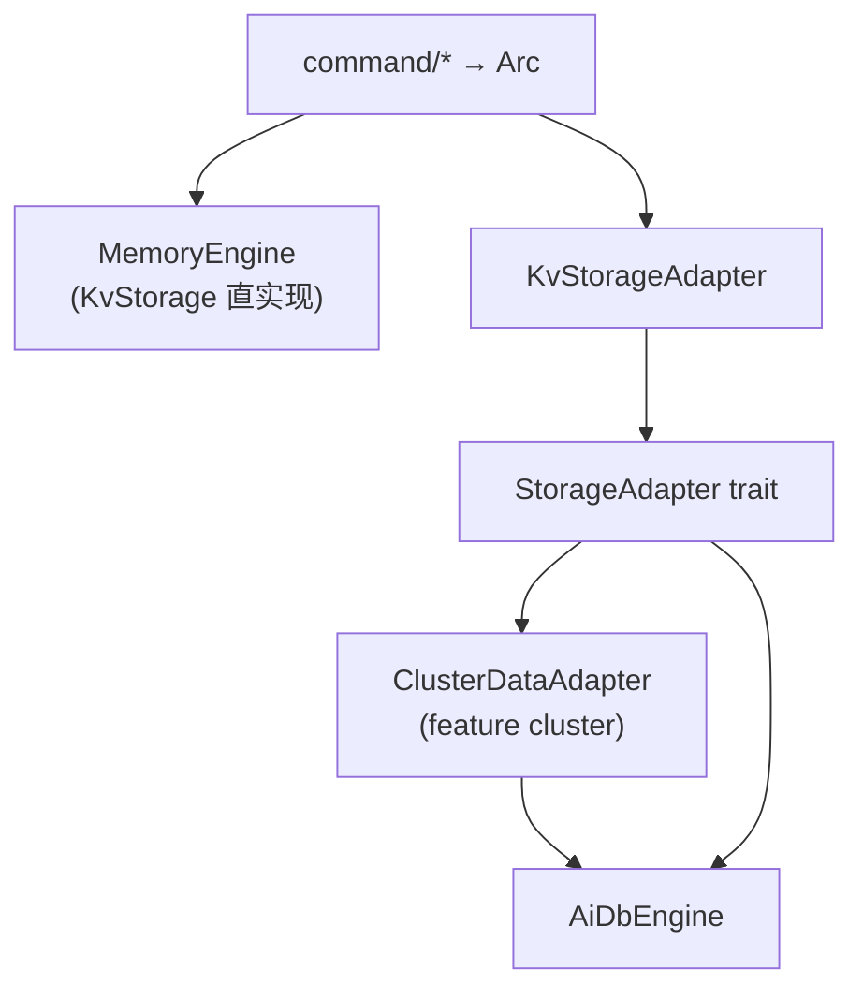
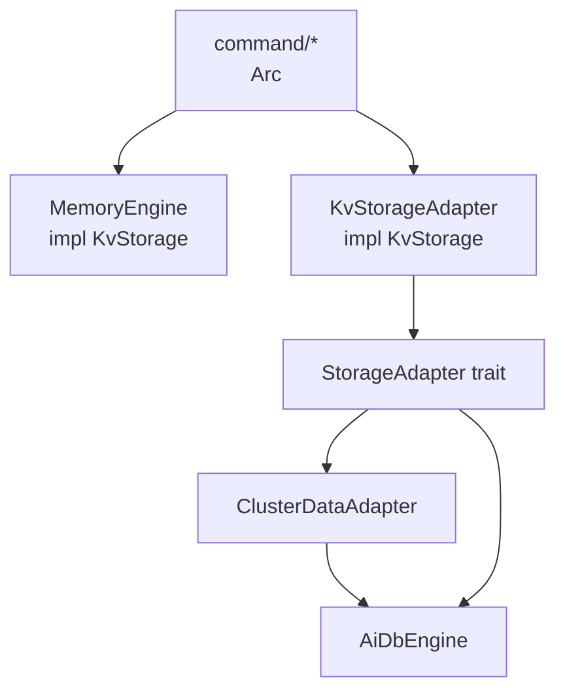
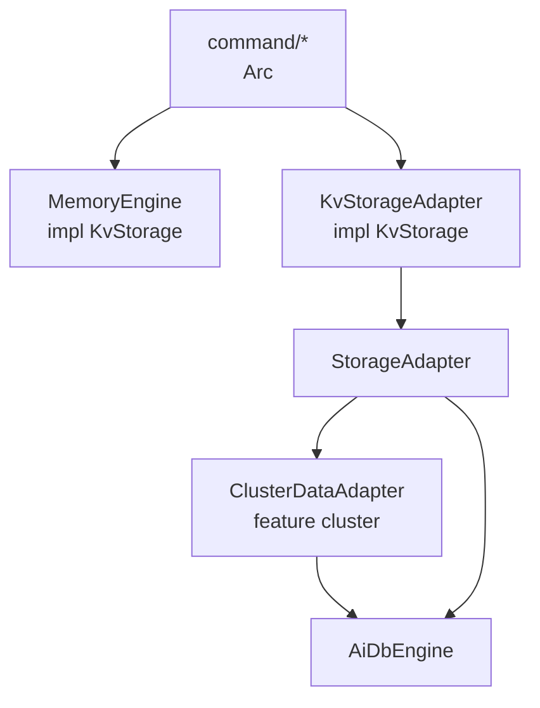
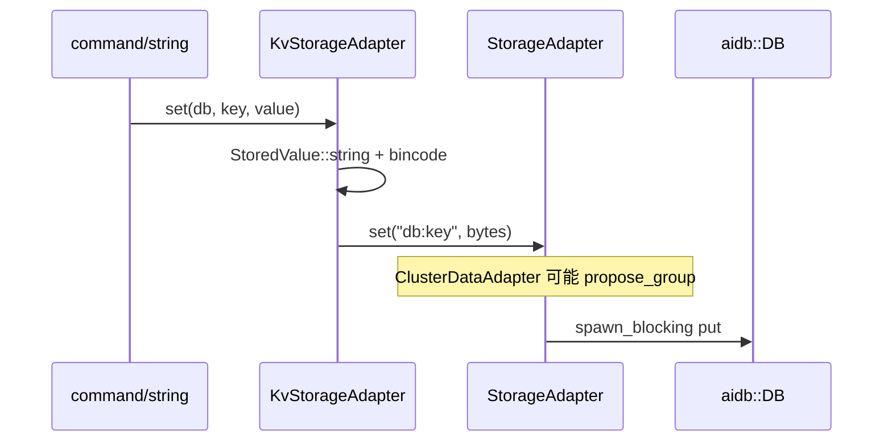
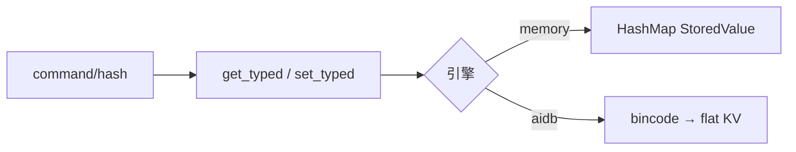
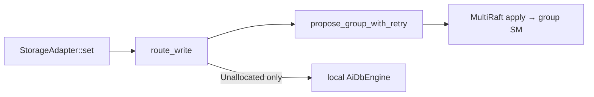

# Cursor transcript

---

## 1. User

## 文档整理 — 新会话

工作目录: `<workspace>` (含 aidb/、aikv/、aifactory/)

请先阅读 (不要跳过):

1. `AiKv-Workflow/backup/design.md` — 总规程
2. `AiKv-Workflow/backup/PROGRESS.md` — 当前进度
3. `AiKv-Workflow/backup/INDEX.md` — 本章索引 (若已有行则更新)

---

### 本次任务

| 项 | 值 |
|----|-----|
| PROGRESS 总步 | 6 |
| 目标文件 | `aikv/docs/modules/storage.md` |
| 本次子步 | 从步 0 开始 |
| 对比深度 | 核心章逐段 (见 `design.md` — aikv `storage` 属加深章) |

### 必须遵守

- **确认门控**: 步 0→1→2→3→4, 每步先讨论, 我确认后再下一步
- **步 4**: 先出 Module Skill 正文 **草稿**, 我确认后再写入 aidb/aikv、更新 INDEX/PROGRESS
- **Module Skill 基础模板**: frontmatter `name` + `description` (含 `Use when`); 见 `design.md`
- **过程只进 backup/**: INDEX; aidb/aikv 不写迁移历史
- **旧文档顺序**: `backup/{aidb,aikv}/` → `*-oldmain` → WiQunTools inventory 段 → wiqun-*
- **待核实**: module 一行引用; 详情写入 **当前仓库** 根目录 `ISSUES.md` (`aikv/ISSUES.md`)
- **步 4 落盘前**: 对照 create-skill Summary Checklist 自检 (见 `design.md`)

### 上下文 (上一章已完成)

- 步 1–2 ✅ [`aidb/docs/modules/engine.md`](aidb/docs/modules/engine.md) / [`engine-storage.md`](aidb/docs/modules/engine-storage.md)
- 步 3–4 ✅ [`aikv/docs/modules/protocol.md`](aikv/docs/modules/protocol.md) / [`server.md`](aikv/docs/modules/server.md)
- 步 5 ✅ [`aidb/docs/modules/cluster.md`](aidb/docs/modules/cluster.md) — MetaRaft / MultiRaft / Router / slot 迁移 / gRPC
- 本章覆盖 `aikv/src/storage/*` (`KvStorage` trait, `MemoryEngine`, `AiDbEngine`, `cluster_adapter`, `StoredValue` 等); 步 7 commands-core、步 11 aikv cluster 会引用本章
- 步 3 需在模块级基础上对核心文件做 **逐段/逐函数** 对照 (oldmain 代码为主, 若旧文档不可信可降级为查漏)

### 本次不要

- 不要跳过未确认的步骤
- 不要一次写多篇 module
- 不要修改 `design.md` / 流程, 除非我明确要求
- 不要 commit, 除非我明确要求

---

请从步 0 开始, 给出本步交付物, 等我确认。

---

## 2. Assistant

先阅读规程、进度与索引，再给出步 0 交付物。

**Tool `Read`**

```json
{
  "path": "../../../AiKv-Workflow/backup/design.md"
}
```


**Tool `Read`**

```json
{
  "path": "../../../AiKv-Workflow/backup/PROGRESS.md"
}
```


**Tool `Read`**

```json
{
  "path": "../../../AiKv-Workflow/backup/INDEX.md"
}
```


---

## 3. Assistant

正在对照 `aikv/src/storage/` 的实际目录结构，确定本章范围与拟读文件列表。

**Tool `Glob`**

```json
{
  "glob_pattern": "**/*",
  "target_directory": "../../src/storage"
}
```


**Tool `Read`**

```json
{
  "path": "../../src/storage/mod.rs"
}
```


**Tool `Grep`**

```json
{
  "pattern": "storage::",
  "path": "../../src",
  "glob": "*.rs",
  "head_limit": 40
}
```


---

## 4. Assistant

**Tool `Read`**

```json
{
  "path": "../../src/storage/types.rs",
  "limit": 120
}
```


**Tool `Read`**

```json
{
  "path": "../../src/storage/adapter.rs",
  "limit": 80
}
```


**Tool `Read`**

```json
{
  "path": "../../src/storage/aidb.rs",
  "limit": 80
}
```


**Tool `Read`**

```json
{
  "path": "../../src/storage/memory.rs",
  "limit": 80
}
```


**Tool `Read`**

```json
{
  "path": "../../src/storage/cluster_adapter.rs",
  "limit": 80
}
```


**Tool `Read`**

```json
{
  "path": "../../src/storage/observation.rs",
  "limit": 60
}
```


**Tool `Read`**

```json
{
  "path": "../../src/storage/dump.rs",
  "limit": 60
}
```


---

## 5. Assistant

**Tool `Read`**

```json
{
  "offset": 120,
  "path": "../../src/storage/types.rs"
}
```


**Tool `Glob`**

```json
{
  "glob_pattern": "**/storage/**",
  "target_directory": "../../../aikv-oldmain"
}
```


**Tool `Grep`**

```json
{
  "pattern": "storage",
  "glob": "**/wiqun-kv-inventory/**",
  "head_limit": 30
}
```


**Tool `Read`**

```json
{
  "path": "../../docs/modules/storage.md"
}
```


---

## 6. Assistant

**Tool `Read`**

```json
{
  "path": "../../src/main.rs",
  "offset": 120,
  "limit": 80
}
```


**Tool `Grep`**

```json
{
  "pattern": "impl KvStorage",
  "path": "../../src/storage"
}
```


**Tool `Glob`**

```json
{
  "glob_pattern": "**/*storage*",
  "target_directory": "../../../AiKv-Workflow/backup/aikv"
}
```


**Tool `Glob`**

```json
{
  "glob_pattern": "**/02-storage*",
  "target_directory": "../../../WiQunTools"
}
```


**Tool `Read`**

```json
{
  "path": "../../../aikv-oldmain/src/storage/mod.rs"
}
```


---

## 7. Assistant

**Tool `Grep`**

```json
{
  "path": "../../../aikv",
  "pattern": "storage::",
  "glob": "**/tests/**",
  "head_limit": 20
}
```


**Tool `Grep`**

```json
{
  "path": "../../../aikv",
  "pattern": "mod storage|storage/",
  "glob": "**/*test*",
  "head_limit": 30
}
```


**Tool `Read`**

```json
{
  "limit": 50,
  "path": "../../docs/modules/server.md"
}
```


**Tool `Grep`**

```json
{
  "path": "../../../AiKv-Workflow/backup/aikv",
  "pattern": "storage|KvStorage|MemoryEngine|AiDbEngine",
  "head_limit": 25
}
```


---

## 8. Assistant

**Tool `Glob`**

```json
{
  "glob_pattern": "**/*",
  "target_directory": "../../tests/modules/storage"
}
```


**Tool `Grep`**

```json
{
  "path": "../../../aikv",
  "pattern": "cluster_adapter|ClusterDataAdapter",
  "glob": "**/*"
}
```


**Tool `Read`**

```json
{
  "limit": 40,
  "path": "../../src/storage/adapter.rs",
  "offset": 80
}
```


---

## 9. Assistant

**Tool `Grep`**

```json
{
  "path": "../../src/storage",
  "pattern": "impl StorageAdapter"
}
```


**Tool `Read`**

```json
{
  "limit": 50,
  "offset": 115,
  "path": "../../src/storage/memory.rs"
}
```


---

## 10. Assistant

**Tool `Shell`**

```bash
wc -l ../../src/storage/*.rs ../../../aikv-oldmain/src/storage/*.rs 2>/dev/null
```


---

## 11. Assistant

## 步 0 — 定范围

**章节**: PROGRESS 步 6 · `aikv/docs/modules/storage.md`  
**对比深度**: 加深章 (步 3 对核心文件逐段/逐函数; 步 0 仅定范围)

---

### 本章边界

| 维度 | 纳入 `storage.md` | 不纳入 (交叉引用) |
|------|-------------------|-------------------|
| **源码** | `aikv/src/storage/*` 全部 8 个文件 | — |
| **命令层** | `KvStorage` 作为命令/router 依赖面; `WriteOp` vs `AdapterWriteOp` 分层 | 各命令语义 → [commands-core.md](aikv/docs/modules/commands-core.md) / [commands-extended.md](aikv/docs/modules/commands-extended.md) |
| **持久化命令** | `flush_engine` / `create_checkpoint` / `close_engine` 在 trait 上的约定 | SAVE/BGSAVE/RESTORE 流程 → commands-extended |
| **集群数据面** | `cluster_adapter.rs` — Raft propose/读本地 SM、slot 路由、IMPORTING 写路径 | MOVED/ASK/Gossip/CLUSTER 子命令 → 步 11 [cluster.md](aikv/docs/modules/cluster.md); MetaRaft/MultiRaft → [aidb cluster.md](aidb/docs/modules/cluster.md) |
| **AiDb 内核** | `AiDbEngine` 如何 `open`/`spawn_blocking`、key 编解码、checkpoint | WAL/MemTable/SSTable/compaction → [aidb engine.md](aidb/docs/modules/engine.md) / [engine-storage.md](aidb/docs/modules/engine-storage.md) |
| **可观测** | `StorageObservation` 计数器与 engine 注入点 (一行) | INFO/metrics 渲染 → 步 12 [observability.md](aikv/docs/modules/observability.md) |
| **启动装配** | `main.rs` 中 `build_storage` 分支 (memory vs aidb+cluster) 摘要 | 完整进程启动 → [server.md](aikv/docs/modules/server.md) |

**架构要点 (步 1 会展开)**: 存在 **两条实现路径**, 不是统一经 `StorageAdapter`:



- **memory**: `MemoryEngine::with_observation` → 直接 `Arc<dyn KvStorage>`
- **aidb**: `AiDbEngine` → 可选 `ClusterDataAdapter::new` → `KvStorageAdapter::with_observation` → `Arc<dyn KvStorage>`

**下游引用 (本章是前置)**:
- 步 7 `commands-core.md` — 全命令依赖 `KvStorage` / `StoredValue` / `WRONGTYPE`
- 步 11 `cluster.md` — 与 `ClusterDataAdapter`、slot 迁移写路径衔接
- 步 12 `observability.md` — `StorageObservation`、`memory_usage_bytes`、`keyspace_stats`

---

### `src/storage/` 范围清单

```shell
aikv/src/storage/
├── mod.rs              # 模块根; pub re-export
├── types.rs            # KvStorage trait; StoredValue/ValueType; WriteOp; DB_COUNT; WRONGTYPE
├── memory.rs           # MemoryEngine; glob_match; 惰性 TTL; 直 impl KvStorage
├── adapter.rs          # StorageAdapter; KvStorageAdapter; bincode 序列化桥
├── aidb.rs             # AiDbEngine; encode_key/decode_key; impl StorageAdapter
├── cluster_adapter.rs  # ClusterDataAdapter (#[cfg(feature = "cluster")])
├── dump.rs             # StoredValue DUMP 编解码 (RESTORE 用)
└── observation.rs      # StorageObservation (expired_keys 计数)
```

| 文件 | 行数 | 职责 | 入口 / 关键符号 |
|------|------|------|-----------------|
| `mod.rs` | 20 | 子模块与 re-export | `KvStorage`, `MemoryEngine`, `AiDbEngine`, `StorageAdapter` |
| `types.rs` | 304 | 命令层存储契约 | `KvStorage`, `StoredValue`, `ValueType`, `WriteOp`, `StorageEngineKind` |
| `memory.rs` | 511 | 内存引擎 | `MemoryEngine::new`, `impl KvStorage`, `glob_match` |
| `adapter.rs` | 505 | 扁平 KV → 多 DB 语义 | `StorageAdapter`, `KvStorageAdapter`, `AdapterWriteOp` |
| `aidb.rs` | 217 | AiDb 持久化适配 | `AiDbEngine::open`, `encode_key`, `impl StorageAdapter` |
| `cluster_adapter.rs` | 489 | 集群数据面包装 | `ClusterDataAdapter::new`, `propose_group` 写路径 |
| `dump.rs` | 56 | 内部 DUMP 格式 | `encode`/`decode`, `DUMP_VERSION` |
| `observation.rs` | 24 | 过期 key 计数 | `StorageObservation::record_expired_key` |

**进程入口 (非 storage 目录, 步 1 必读)**:

| 路径 | 关联 |
|------|------|
| `aikv/src/main.rs` | `build_storage`, `EngineKind`, cluster 下 adapter 链 |
| `aikv/src/lib.rs` | `pub mod storage` |
| `aikv/src/server/config.rs` | `ServerSharedState` 持有 `Arc<dyn KvStorage>` |
| `aikv/src/server/connection.rs` | `dump_encode`/`dump_decode` (RESTORE) |

---

### 拟读文件列表 (步 1–3)

**步 1 — 新代码 (主)**  
按优先级:

1. `types.rs` — trait 全集与 `StoredValue` 语义  
2. `memory.rs` — TTL、typed API、`get` 仅 String 的 WRONGTYPE  
3. `adapter.rs` — `get_typed`/`set_typed` 与 bincode、`db_prefix` scan  
4. `aidb.rs` — blocking 包装、checkpoint、prefix scan  
5. `cluster_adapter.rs` — 读写路由、MIGRATE/IMPORTING  
6. `dump.rs`, `observation.rs`, `mod.rs`  
7. `main.rs` (`build_storage` ~L130–157)

**步 1 — 测试 (验证行为)**  
`aikv/tests/modules/storage/{mod,memory,aidb,types,compat}.rs`; 抽样 `tests/modules/command/persistence.rs`

**步 2 — 旧文档 (按 design 顺序, 步 2 再细读)**  
- `backup/aikv/{README,ARCHITECTURE,CHANGELOG}.md`  
- `backup/aikv/docs/superpowers/specs/*observability*` (storage 边界)  
- `WiQunTools/docs/wiqun-kv-inventory/02-storage-commands.md`, `06-persistence.md` (查漏)  
- `aikv-oldmain/src/storage/*` (文档不可信时以代码为主)

**步 3 — oldmain 逐段对照 (加深, 预览)**  

| 新代码 (逐段) | oldmain 对照 |
|---------------|--------------|
| `types.rs` | `memory_adapter.rs` 内 `StoredValue`/`ValueType` |
| `memory.rs` | `memory_adapter.rs` |
| `adapter.rs` + `aidb.rs` | `aidb_adapter.rs` + oldmain `mod.rs` `StorageEngine` enum |
| `cluster_adapter.rs` | `cluster_raft.rs` |

oldmain 结构差异大 (`StorageEngine` 同步 enum vs 新代码 async trait 链), 步 3 重点应是 **API 分层与行为等价**, 而非文件名一一对应.

---

### 拟写入 INDEX 的本章行 (确认步 0 后再落盘)

| 字段 | 内容 |
|------|------|
| 新文档章节 | `docs/modules/storage.md` |
| 状态 | 🔄 步 0 已定范围 |
| 覆盖 src | `storage/*` |
| 备注 | 加深章; memory 直 KvStorage / aidb 经 Adapter 链; cluster_adapter 数据面; 步 7/11 引用 |

---

### 步 0 结论

- **范围**: `aikv/src/storage/*` 全 8 文件 + `main.rs` 装配 + 测试目录; 边界见上表.  
- **加深重点 (步 3)**: `types`, `memory`, `adapter`, `aidb`, `cluster_adapter` 五文件.  
- **本章不写**: aidb LSM 内核、命令语义、集群控制面协议、observability 渲染细节.

---

请确认步 0 (或说明需调整的范围/边界). 确认后进入 **步 1 — 读新代码**.

---

## 12. User

可以

---

## 13. Assistant

步 0 已确认，开始步 1：通读 `aikv/src/storage/*` 与相关测试，梳理职责与主流程。

**Tool `Read`**

```json
{
  "path": "../../src/storage/adapter.rs",
  "offset": 115
}
```


**Tool `Read`**

```json
{
  "path": "../../src/storage/aidb.rs",
  "offset": 74
}
```


**Tool `Read`**

```json
{
  "path": "../../src/storage/memory.rs",
  "offset": 160
}
```


**Tool `Read`**

```json
{
  "path": "../../src/storage/cluster_adapter.rs",
  "offset": 70
}
```


**Tool `Read`**

```json
{
  "path": "../../tests/modules/storage/mod.rs"
}
```


---

## 14. Assistant

**Tool `Read`**

```json
{
  "limit": 115,
  "offset": 80,
  "path": "../../src/storage/memory.rs"
}
```


**Tool `Read`**

```json
{
  "limit": 80,
  "path": "../../tests/modules/storage/compat.rs"
}
```


**Tool `Grep`**

```json
{
  "path": "../../src",
  "pattern": "create_checkpoint|flush_engine|close_engine|engine_kind"
}
```


---

## 15. Assistant

**Tool `Shell`**

```bash
cd ../../../aikv && cargo test --test modules storage:: -- --list 2>/dev/null | wc -l; cargo test --test modules storage:: -- --list 2>/dev/null | head -30
```


**Tool `Grep`**

```json
{
  "path": "../../tests/modules/storage",
  "pattern": "WRONGTYPE|mget|write_batch"
}
```


---

## 16. Assistant

**Tool `Grep`**

```json
{
  "path": "../../tests",
  "pattern": "mod storage|modules::storage"
}
```


**Tool `Read`**

```json
{
  "limit": 40,
  "path": "../../tests/modules/storage/memory.rs"
}
```


---

## 17. Assistant

## 步 1 — 读新代码

已通读 `aikv/src/storage/*`、`main.rs` 的 `build_storage`, 以及 `tests/modules/storage/{memory,aidb,types,compat}.rs`. 以下为步 1 交付物, 供确认后进入步 2.

---

### 模块职责 (一句话)

存储层把 **命令层 Redis 语义** (`Arc<dyn KvStorage>`, 多 DB、typed value、TTL) 映射到 **底层扁平 KV** (`StorageAdapter`, 仅 byte key/value), 并提供 memory / aidb / cluster 三种后端装配.

---

### 代码地图 (拟写入 module 的骨架)

| 路径 | 职责 | 入口 |
|------|------|------|
| `types.rs` | 命令层契约: `KvStorage` trait, `StoredValue`/`ValueType`, `WriteOp`, `StorageEngineKind`, `WRONGTYPE`/`TTL_NO_EXPIRY`/`DB_COUNT` | `KvStorage`, `StoredValue::is_expired`, `is_wrongtype` |
| `memory.rs` | 16 逻辑 DB, `HashMap<Vec<u8>, StoredValue>`, 直 impl `KvStorage`; glob `keys`/`scan` | `MemoryEngine::new`, `glob_match` (pub, 供 command 复用) |
| `adapter.rs` | 扁平 KV → 多 DB 语义: key 编解码、bincode 序列化、`KvStorageAdapter` impl `KvStorage` | `StorageAdapter`, `KvStorageAdapter::new`, `AdapterWriteOp` |
| `aidb.rs` | `AiDbEngine` impl `StorageAdapter`; `spawn_blocking` 包装 sync `aidb::DB` | `AiDbEngine::open`, `encode_key`/`decode_key`, `prefix_end` |
| `cluster_adapter.rs` | 数据面 Raft 包装 (feature `cluster`); 写 propose / 读 local SM | `ClusterDataAdapter::new`, `route_read`/`route_write` |
| `dump.rs` | 内部 DUMP 格式 (version byte + bincode), 供 RESTORE | `encode`/`decode`, `DUMP_VERSION=0` |
| `observation.rs` | 跨引擎过期 key 计数, 供 INFO/metrics drain | `StorageObservation::record_expired_key` |
| `mod.rs` | re-export 公共面 | — |
| `main.rs` ~L130–157 | 引擎装配 | `build_storage` |

---

### 分层与装配 (主流程)



**`main.rs` 装配**:

| CLI `--engine` | 链路 | `engine_kind` |
|----------------|------|---------------|
| `memory` | `MemoryEngine::with_observation(16, obs)` → 直接 `Arc<dyn KvStorage>` | `Memory` |
| `aidb` | `AiDbEngine::open` → `[ClusterDataAdapter]` → `KvStorageAdapter::with_observation` | `AiDb` |

cluster 仅在 `aidb` 路径且 `feature = "cluster"` 时插入 `ClusterDataAdapter`; memory 引擎 **不** 经 `StorageAdapter`.

---

### 关键类型

**`StoredValue`** — 命令层值 + TTL:

- `value: ValueType` (String / Hash / List / Set / ZSet, 均 `Serialize`)
- `expires_at: Option<u64>` (Unix ms; `None` = 永不过期)
- `is_expired()` 用 `now_ms()` 比较; `as_*` / `as_*_mut` 类型不对返回 `WRONGTYPE`

**两套 WriteOp** (勿混):

| 类型 | 层 | 形状 |
|------|-----|------|
| `storage::WriteOp` | 命令 batch | `Put(Vec<u8>)` / `Delete` (value 已序列化或仅删) |
| `AdapterWriteOp` | 扁平 KV | `Put { key, value }` / `Delete { key }` (encoded key + bincode bytes) |

**AiDb key 编码**: `{db_index}:{user_key}` (ASCII 数字 + `:`), 用于 prefix scan / delete_range 清库.

**持久化面** (`KvStorage` 默认 vs 覆盖):

| 方法 | MemoryEngine (默认) | KvStorageAdapter → AiDbEngine |
|------|---------------------|-------------------------------|
| `flush_engine` | no-op | `DB::flush` |
| `create_checkpoint` | `ERR Persistence not supported on memory engine` | `Checkpoint::create` |
| `close_engine` | no-op | `DB::close` |
| `memory_usage_bytes` | 自算 heap 近似 | `DB::approximate_memory_bytes` |

---

### 各实现要点

#### `MemoryEngine`

- 结构: `Vec<RwLock<HashMap<...>>>` × `db_count` (默认 16)
- **惰性 TTL**: 读路径 (`get_entry_read`, `keys`, `ttl`) 遇过期则删并 `record_expired`; `keys` 后额外 `purge_expired`
- **`get` vs `mget`**: `get` 遇非 String → `WRONGTYPE`; `mget` 遇非 String → **`None`** (不报错)
- **`write_batch`**: 逐 op 顺序 await, **非原子**
- **`swap_db`**: `mem::take` 交换两个 HashMap (O(1))
- **`random_key`**: `rand::thread_rng().choose`
- 不覆盖 `engine_kind` / checkpoint → trait 默认 (Memory)

#### `KvStorageAdapter`

- 所有 typed 读写经 **bincode** 序列化 `StoredValue` 存 flat KV
- `load_typed`: 读 → deserialize → 过期则删 + observation
- `keys`/`scan`: `scan_prefix(db_prefix)` → 过滤 glob → **全量 sort** → cursor 分页
- `clear_db`: `delete_range(prefix, prefix_end)` (AiDb 路径依赖 `prefix_end`)
- `write_batch`: 组装 `AdapterWriteOp` 一次 `storage.write_batch` (AiDb 下单 WriteBatch 原子)
- `swap_db`: collect → clear → re-insert (**拷贝**, 非 swap 指针)
- `random_key`: `unix_nanos() % len` (与 memory 不同)

#### `AiDbEngine`

- `open`: `Options::for_testing()` + `create_if_missing` + `sync_wal: true`
- 所有 DB 操作 `tokio::task::spawn_blocking`
- `delete`: 先 `get` 判存在再删 (返回 existed)
- `clear`: 全表 iter 收集 key → WriteBatch delete
- `scan_prefix`: `DB::scan(prefix, prefix_end)`

#### `ClusterDataAdapter`

- **写**: `route_write` → `propose_group_with_retry` (最多 20 次, 250ms); IMPORTING slot 写本地 target group
- **读**: `route_read` → `multi_raft.get_local`; Assigned / 本地 Migrating 可读
- **fallback 规则**: 仅 `Unallocated` 或未初始化 cluster 时写 `local`; **已分配 slot 禁止写 local** (防 SET 成功 GET 空)
- **`write_batch`**: 按 group 分组 → 各组 `ThinWriteBatch` propose; 未分配 slot 的 op 走 local
- **`scan_prefix`/`clear`/`delete_range`**: 遍历本地所有 group 的 SM
- **`create_checkpoint`**: 有 group storages → `dest/group_{id}/` 逐组 checkpoint; 否则 fallback local
- **`flush`**: group storages flush + local flush

#### `dump.rs`

- 格式: `[DUMP_VERSION=0][bincode(StoredValue)]`
- 与 adapter 内 bincode 相同类型, 但多 version 前缀; RESTORE 在 `server/connection.rs` 调用

#### `StorageObservation`

- 仅 `expired_keys` 计数; memory/adapter 在惰性删除时 `record_expired_key`
- `main` 注入, server metrics 侧 `drain_expired_keys`

---

### 与命令层的边界

- 命令/router/script 只依赖 **`Arc<dyn KvStorage>`** + `StoredValue`/`ValueType`/`WRONGTYPE`/`is_wrongtype`
- Hash/List/Set/ZSet 命令用 **`get_typed`/`set_typed`**, 不经 String 的 `get`/`set`
- `command/persistence.rs` 分支 `engine_kind()`: memory → SAVE ERR; aidb → `flush_engine` + `create_checkpoint`
- `glob_match` 从 `memory.rs` pub export, zset/set 等 command 直接引用

---

### 测试 (步 1 已跑/已读)

| 套件 | 位置 | 覆盖 |
|------|------|------|
| memory 单测 | `tests/modules/storage/memory.rs` | TTL, expire_at, swap_db, rename, scan, WRONGTYPE |
| aidb 单测 | `tests/modules/storage/aidb.rs` | encode_key, KvStorageAdapter 基本读写 |
| types | `tests/modules/storage/types.rs` | StoredValue helpers |
| compat | `tests/modules/storage/compat.rs` | **memory vs aidb 双引擎行为一致** (string/TTL/db/rename/copy/typed) |
| cluster | `cluster_adapter.rs` 内 `checkpoint_group_storages_roundtrip` | group checkpoint |
| dump | `dump.rs` 内 unit test | roundtrip + version check |

入口: `cargo test --test storage -- --test-threads=1` (见 backup CHANGELOG).

---

### 步 1 观察 (留待步 2/3 核实, 暂不写 ISSUES)

1. **`mget` + 非 String key**: MemoryEngine 返回 `None`, KvStorageAdapter 的 `mget` 调 `get` → **WRONGTYPE** — 两引擎行为可能不一致 (compat 测试未覆盖 wrongtype mget).
2. **`AiDbEngine::open` 固定 `Options::for_testing()`** — 生产 Options 收敛可能在别处或未做.
3. **`scan`/`keys` 全量 sort** — 大 keyspace O(n) 内存; 文档应记为已知限制.
4. **Memory `write_batch` 非原子** vs AiDb 单 WriteBatch — 脚本/事务语义依赖上层 (commands 步 7 再链).

---

### 步 1 结论

- 核心故事: **命令层 `KvStorage` (typed, 16 DB)** ↔ **适配层 `KvStorageAdapter` (bincode + key 编码)** ↔ **引擎层 `StorageAdapter` (flat bytes)**; memory 短路第一层后半, cluster 包在引擎层外.
- 步 4 正文应突出: 双路径装配、两套 WriteOp、TTL 惰性策略、AiDb key 编码、cluster 读写路由 invariant.
- 加深章步 3 重点文件不变: `types`, `memory`, `adapter`, `aidb`, `cluster_adapter`.

---

请确认步 1 (或指出需补读/修正的点). 确认后进入 **步 2 — 查旧文档**.

---

## 18. User

可以

---

## 19. Assistant

步 1 已确认，开始步 2：按规程顺序查阅旧文档并分类。

**Tool `Grep`**

```json
{
  "path": "../../../AiKv-Workflow/backup/aikv",
  "pattern": "storage|KvStorage|MemoryEngine|AiDbEngine|StoredValue|StorageAdapter",
  "glob": "*.{md,MD}"
}
```


**Tool `Grep`**

```json
{
  "path": "../../../aikv-oldmain",
  "pattern": "storage|KvStorage|MemoryEngine|StoredValue",
  "glob": "**/*.{md,MD}",
  "head_limit": 40
}
```


**Tool `Read`**

```json
{
  "limit": 120,
  "path": "../../../WiQunTools/docs/wiqun-kv-inventory/02-storage-commands.md"
}
```


**Tool `Read`**

```json
{
  "limit": 150,
  "path": "../../../WiQunTools/docs/wiqun-kv-inventory/06-persistence.md"
}
```


---

## 20. Assistant

**Tool `Read`**

```json
{
  "path": "../../../aikv-oldmain/docs/development/architecture/04-storage.md"
}
```


**Tool `Read`**

```json
{
  "path": "../../../AiKv-Workflow/backup/aikv/ARCHITECTURE.md",
  "offset": 25,
  "limit": 100
}
```


**Tool `Grep`**

```json
{
  "glob": "**/*",
  "head_limit": 30,
  "path": "../../../wiqun-kv/src/storage",
  "pattern": "."
}
```


**Tool `Grep`**

```json
{
  "glob": "**/07-cluster*",
  "head_limit": 30,
  "path": "../../../WiQunTools",
  "pattern": "ClusterDataAdapter|cluster_adapter|StorageAdapter"
}
```


**Tool `Read`**

```json
{
  "path": "../../ISSUES.md"
}
```


---

## 21. Assistant

**Tool `Glob`**

```json
{
  "glob_pattern": "src/storage/*",
  "target_directory": "../../../wiqun-kv"
}
```


**Tool `Grep`**

```json
{
  "glob": "02-storage-commands.md",
  "head_limit": 40,
  "path": "../../../WiQunTools/docs/wiqun-kv-inventory",
  "pattern": "Phase 10|StorageAdapter|KvStorageAdapter|wiqun_db|AiDb"
}
```


**Tool `Read`**

```json
{
  "limit": 80,
  "path": "../../../aikv-oldmain/src/storage/memory_adapter.rs"
}
```


**Tool `Read`**

```json
{
  "limit": 80,
  "path": "../../../aikv-oldmain/src/storage/cluster_raft.rs"
}
```


**Tool `Grep`**

```json
{
  "glob": "07-cluster*.md",
  "head_limit": 25,
  "path": "../../../WiQunTools/docs/wiqun-kv-inventory",
  "pattern": "ClusterRaft|cluster_raft|数据面|StorageAdapter"
}
```


---

## 22. Assistant

**Tool `Grep`**

```json
{
  "glob": "07-cluster-protocol.md",
  "head_limit": 30,
  "path": "../../../WiQunTools/docs/wiqun-kv-inventory",
  "pattern": "storage|ClusterData|adapter|Raft"
}
```


**Tool `Read`**

```json
{
  "path": "../../../AiKv-Workflow/backup/aikv/DESIGN.md",
  "limit": 80
}
```


**Tool `Read`**

```json
{
  "limit": 50,
  "path": "../../../wiqun-kv/src/storage/mod.rs"
}
```


**Tool `Grep`**

```json
{
  "glob": "05-lua.md",
  "head_limit": 15,
  "path": "../../../WiQunTools/docs/wiqun-kv-inventory",
  "pattern": "mget|WRONGTYPE|write_batch"
}
```


---

## 23. Assistant

**Tool `Glob`**

```json
{
  "glob_pattern": "**/persistence/**",
  "target_directory": "../../src"
}
```


**Tool `Grep`**

```json
{
  "glob": "02-storage-commands.md",
  "head_limit": 10,
  "path": "../../../WiQunTools/docs/wiqun-kv-inventory",
  "pattern": "mget|MGET"
}
```


---

## 24. Assistant

## 步 2 — 查旧文档

已按 `design.md` 顺序查阅 backup/aikv → aikv-oldmain → WiQunTools inventory → wiqun-kv. 以下为步 2 交付物.

---

### 旧文档清单与分类

#### 1. `backup/aikv/` (重构后旧稿, 优先)

| 路径 | 分类 | 说明 |
|------|------|------|
| `ARCHITECTURE.md` §storage | **已过时** | 文件名/结构不符: `value.rs`, `memory_engine.rs`, 缺 `types.rs`/`aidb.rs`/`cluster_adapter.rs`; 仍写 `persistence/` 模块 (新代码已无) |
| `ARCHITECTURE.md` §数据流 (KvStorage 路径) | **仍有效** | 命令 → `KvStorage` 主流程仍成立 |
| `DESIGN.md` §存储 (L18–36) | **仍有效** | trait 抽象、16 DB、spawn_blocking 理由; 步 4 可提炼, 细节以新代码为准 |
| `CHANGELOG.md` (存储相关条目) | **仍有效** | 关键里程碑: `StorageAdapter`/`KvStorageAdapter`/`AiDbEngine`; DUMP 内部格式; `KeyspaceStats`; **ClusterDataAdapter + Raft 数据面** (CHANGELOG 近期条目) |
| `README.md` 架构图 | **部分有效** | MemoryEngine / AiDbEngine 双引擎; 未画 Adapter 链与 cluster 包装 |
| `DEPLOYMENT.md` (MemoryEngine 内存) | **仍有效** | 一句提醒, 非 storage 正文重点 |
| `CONTRIBUTING.md` §storage | **仍有效** | 目录说明 + `cargo test --test storage` |
| `docs/superpowers/specs/2026-06-10-redis-observability-alignment-design.md` | **仍有效 (边界)** | `storage.memory_usage_bytes`, `keyspace_stats`, `StorageObservation::drain_expired_keys` — 正文一行链 observability.md, 不展开 |

#### 2. `aikv-oldmain/`

| 路径 | 分类 | 说明 |
|------|------|------|
| `docs/development/architecture/04-storage.md` | **已过时** | 描述 legacy `persistence/` RDB/AOF 模块 + Redis 标准 RDB; 新 aikv **无** `src/persistence/`; 持久化走 aidb checkpoint + `command/persistence.rs` |
| `docs/development/architecture/02-refactoring.md` §存储 | **部分有效** | `StoredValue` 暴露给命令层、typed 操作 — 设计意图仍成立; API 为 **同步** `&str` key, 与现 async `&[u8]` 不同 |
| `docs/index.md` → 04-storage | **已过时** | 指向上述 legacy 文档 |
| `src/storage/mod.rs` (`StorageEngine` enum) | **设计偏离** | oldmain 统一 enum 分发; 新代码 **async trait 链** + memory 直 `KvStorage` |
| `src/storage/memory_adapter.rs` | **设计偏离 (步 3 对照)** | 同步、`Bytes`/`String` key、`get_value`/`update_value` 最小接口; 新 `memory.rs` 直 impl `KvStorage` |
| `src/storage/aidb_adapter.rs` | **设计偏离 (步 3 对照)** | 多 DB 多 AiDb 实例思路 vs 新单 DB + `{db}:{key}` 编码 |
| `src/storage/cluster_raft.rs` | **设计偏离 (步 3 对照)** | `ClusterRaftEngine` 在 **StorageEngine enum** 层复制; 新代码 `ClusterDataAdapter` 包 **StorageAdapter**, 命令层无感 |

#### 3. `WiQunTools/docs/wiqun-kv-inventory/` (查漏, 不迁入)

| 路径 | 分类 | 说明 |
|------|------|------|
| `02-storage-commands.md` | **仍有效** | `KvStorage` trait 形状、`StoredValue`/`WriteOp`、MemoryEngine 惰性过期、glob `keys`、Phase 10.6 **StorageAdapter → KvStorageAdapter** 桥接设计 — 与当前 `adapter.rs`/`aidb.rs` 高度一致 (命名 WiQunDb → AiDb) |
| `02-storage-commands.md` §ScanResult | **仍有效** | 内部 scan 游标语义 |
| `02-storage-commands.md` §KeyLock | **边界外** | 并发在 command 层, 非 storage.md 正文 |
| `06-persistence.md` | **仍有效 (边界)** | `KvStorage` 桥接 `flush_engine`/`create_checkpoint`/`close_engine`/`engine_kind`; memory ERR; DUMP 内部格式; **「生产 Options 待收敛」** 仍指向 `Options::for_testing()` |
| `05-lua.md` | **仍有效 (边界)** | `get()` String-only → WRONGTYPE; 脚本 `write_batch` 路径 — storage 只记 trait 约定 |
| `07-cluster-protocol.md` | **边界外** | 集群控制面/MOVED/ASK → 步 11 cluster.md; 仅确认数据面 **不在** Kv 独立状态机 |

#### 4. `wiqun-kv/` (与 aikv 重叠, 二选一查漏)

| 路径 | 分类 | 说明 |
|------|------|------|
| `src/storage/*` | **仍有效 (查漏)** | 结构与现 aikv 几乎同构; `wiqun_db.rs` ↔ `aidb.rs`; 步 3 可对照 behavior, 不单独引为权威 |
| 无独立 storage 架构 md | — | 以 WiQunTools 02 + 源码为准 |

---

### 分类汇总

| 分类 | 数量 | 步 4 处理 |
|------|------|-----------|
| **仍有效** | backup DESIGN/CHANGELOG 部分, WiQunTools 02/06 核心段 | 提炼进 module 正文 |
| **已过时** | oldmain 04-storage (RDB/AOF), backup ARCHITECTURE 文件树 | 不引用; oldmain 04 步 4 后可删源 |
| **设计偏离** | oldmain StorageEngine enum / cluster_raft / 同步 adapter | 步 3 逐段对照; 差异写入正文「架构变化」简述 (非迁移表) |
| **边界外** | observability 设计、cluster 协议、KeyLock/Lua 细节 | 交叉链接, 不展开 |

---

### 拟写 `aikv/ISSUES.md` (步 2–3 确认后再落盘)

当前 `aikv/ISSUES.md` 无条目. 建议新增:

#### ISSUE-001: MemoryEngine `mget` 对非 String key 静默返回 `None`

- **状态**: open
- **发现于**: PROGRESS 步 6 / 章节 `docs/modules/storage.md`
- **相关 src**: `storage/memory.rs` (`mget`), `storage/adapter.rs` (`mget` → `get`)
- **现象**: `MemoryEngine::mget` 遇 Hash/List 等返回 `None` (等同 key 不存在); `KvStorageAdapter::mget` 调 `get` → 整命令 **WRONGTYPE**. `tests/modules/storage/compat.rs` 未覆盖此场景.
- **影响**: 双引擎行为不一致; Redis MGET 对 wrong-type 通常报错 — 可能是 bug, 步 4 module 需如实描述或一行引用.
- **下一步**: 步 3 对照 oldmain / Redis 语义; 需写 compat 测试.

#### ISSUE-002: `AiDbEngine::open` 固定 `Options::for_testing()`

- **状态**: open
- **发现于**: PROGRESS 步 6
- **相关 src**: `storage/aidb.rs` (`open`)
- **旧文档**: WiQunTools `06-persistence.md` — 「生产 Options 待收敛」
- **现象**: 所有 aidb 路径 (含生产 CLI) 使用 testing defaults + `sync_wal: true`; 无独立生产 Options 入口.
- **影响**: 文档应说明当前行为; 是否为 intentional 待产品确认.
- **下一步**: 查 aidb `Options` 是否有生产 preset; 不阻塞 module 文档.

#### (doc-only, 不写 ISSUES)

- `scan`/`keys` 全量 sort — 记「已知限制」
- Memory `write_batch` 非原子 vs AiDb 单 WriteBatch — 记 invariant + 链 commands/Lua 层
- DUMP 非 Redis 兼容 — CHANGELOG/WiQunTools 已共识, 正文一句即可

---

### 拟更新 `backup/INDEX.md` 本章行 (确认步 2 后落盘)

| 字段 | 内容 |
|------|------|
| 章节 | `docs/modules/storage.md` |
| 状态 | 🔄 步 2 已完成 |
| 参考旧文档 | backup/aikv ARCHITECTURE,DESIGN,CHANGELOG; WiQunTools 02-storage-commands, 06-persistence (查漏 05-lua); aikv-oldmain src/storage/*; wiqun-kv src/storage (查漏) |
| 处理 | 步 4 后写正文; oldmain `04-storage.md` 已过时待删; backup ARCHITECTURE storage 树已过时 |
| 备注 | ISSUE-001/002 待定 |

---

### 步 2 结论 (对步 3/4 的指引)

1. **可信旧文档**: WiQunTools `02-storage-commands.md` (trait + 桥接) + `06-persistence.md` (KvStorage 持久化面) + backup `CHANGELOG`/`DESIGN`.
2. **不可信/跳过**: oldmain `04-storage.md` (legacy persistence); backup `ARCHITECTURE` 文件树.
3. **步 3 加深对照**: oldmain `memory_adapter.rs`, `aidb_adapter.rs`, `cluster_raft.rs` vs 新五文件; wiqun-kv 仅查漏.
4. **步 4 必写**: 双路径装配、两层 trait、`StoredValue` bincode (aidb) vs 内存 typed、ClusterDataAdapter invariant、DUMP 格式、ISSUE 一行引用.

---

请确认步 2 (含 ISSUE-001/002 是否同意纳入, 或需增删). 确认后进入 **步 3 — 对比旧代码 (核心文件逐段)**.

---

## 25. User

可以

---

## 26. Assistant

步 2 已确认，开始步 3：对照 oldmain 与 wiqun-kv 的核心 storage 文件，逐段比对差异。

**Tool `Read`**

```json
{
  "limit": 150,
  "path": "../../../aikv-oldmain/src/storage/aidb_adapter.rs"
}
```


**Tool `Read`**

```json
{
  "limit": 120,
  "offset": 850,
  "path": "../../../aikv-oldmain/src/storage/memory_adapter.rs"
}
```


**Tool `Grep`**

```json
{
  "path": "../../../aikv-oldmain/src/storage",
  "pattern": "fn mget|async fn mget|fn get_from_db|get_value"
}
```


**Tool `Grep`**

```json
{
  "path": "../../../wiqun-kv/src/storage",
  "pattern": "fn mget|Options::for_testing"
}
```


---

## 27. Assistant

**Tool `Read`**

```json
{
  "limit": 50,
  "offset": 475,
  "path": "../../../aikv-oldmain/src/storage/aidb_adapter.rs"
}
```


**Tool `Read`**

```json
{
  "limit": 50,
  "offset": 620,
  "path": "../../../aikv-oldmain/src/storage/memory_adapter.rs"
}
```


**Tool `Read`**

```json
{
  "limit": 50,
  "offset": 183,
  "path": "../../../wiqun-kv/src/storage/memory.rs"
}
```


**Tool `Read`**

```json
{
  "limit": 100,
  "offset": 200,
  "path": "../../../aikv-oldmain/src/storage/cluster_raft.rs"
}
```


**Tool `Read`**

```json
{
  "limit": 80,
  "path": "../../../wiqun-kv/src/storage/wiqun_db.rs"
}
```


---

## 28. Assistant

**Tool `Read`**

```json
{
  "limit": 50,
  "offset": 708,
  "path": "../../../aikv-oldmain/src/storage/cluster_raft.rs"
}
```


**Tool `Grep`**

```json
{
  "path": "../../../aikv-oldmain/src/storage/cluster_raft.rs",
  "pattern": "propose|write_batch|set_value",
  "head_limit": 25
}
```


**Tool `Grep`**

```json
{
  "path": "../../../aikv-oldmain/src/storage",
  "pattern": "SerializableStoredValue"
}
```


**Tool `Read`**

```json
{
  "limit": 80,
  "offset": 238,
  "path": "../../../wiqun-kv/src/storage/adapter.rs"
}
```


---

## 29. Assistant

**Tool `Grep`**

```json
{
  "path": "../../../aikv-oldmain/src/command",
  "pattern": "fn mget|MGET",
  "head_limit": 15
}
```


**Tool `Read`**

```json
{
  "limit": 40,
  "path": "../../../aikv-oldmain/src/storage/memory_adapter.rs",
  "offset": 95
}
```


---

## 30. Assistant

**Tool `Read`**

```json
{
  "limit": 40,
  "offset": 140,
  "path": "../../../aikv-oldmain/src/command/string.rs"
}
```


---

## 31. Assistant

**Tool `Grep`**

```json
{
  "path": "../../src/command/string.rs",
  "pattern": "fn mget|async fn mget",
  "-A": 25
}
```


---

## 32. Assistant

## 步 3 — 对比旧代码 (加深)

已逐段对照 **新代码五文件** ↔ **aikv-oldmain** (`memory_adapter` / `aidb_adapter` / `cluster_raft` / `mod.rs`) ↔ **wiqun-kv** (查漏). 以下为步 3 交付物.

---

### 模块级差异摘要 (拟写入 INDEX)

| 维度 | oldmain / wiqun-kv | 当前 aikv | 文档应如何写 |
|------|-------------------|-----------|--------------|
| **顶层抽象** | `StorageEngine` enum, **同步** `get_value`/`set_value` | **`async` `KvStorage` trait**; 命令层只持 `Arc<dyn KvStorage>` | 以 trait 为入口; 不提 StorageEngine enum |
| **memory 路径** | `memory_adapter` 实现最小 CRUD, 经 enum 分发 | **`MemoryEngine` 直 impl `KvStorage`** | 明确「不经 StorageAdapter」 |
| **aidb 路径** | **16 个** `DB` 实例 (`db0`…`db15` 目录) | **单** `DB` + `{db}:{key}` 前缀编码 | 写 key 编码与 prefix scan/clear |
| **AiDb Options** | `Options::default()`, **`sync_wal(false)`** | **`Options::for_testing()`**, **`sync_wal(true)`** | 如实写当前 open 行为 + ISSUE-002 |
| **序列化** | `SerializableStoredValue` 中间层; 旧 TTL 侧键 `__exp__:*` | **`StoredValue` 直接 bincode**; TTL 只在 blob 内 | 不写 SerializableStoredValue / legacy TTL |
| **集群数据面** | `ClusterRaftEngine` 在 **StorageEngine** 层, `physical_raft_storage_key`, `block_on` | **`ClusterDataAdapter`** 包 **StorageAdapter**; `propose_group` + retry | 数据面 invariant 写 storage.md; MOVED/ASK 链 cluster.md |
| **wiqun-kv** | 与现 aikv **同构** (`wiqun_db.rs` ↔ `aidb.rs`) | 重构后 crate 名变更 | 步 3 以 oldmain 为主; wiqun-kv 仅验证未回退 |

---

### 核心文件逐段差异表

#### 1. `types.rs` (新) ↔ oldmain `memory_adapter` 类型 + 无独立 trait

| 函数/类型 | oldmain | 新 aikv | 等价? | 文档建议 |
|-----------|---------|---------|-------|----------|
| `StoredValue` / `ValueType` | `Bytes`/`String` key; `SerializableStoredValue` 持久化 | `Vec<u8>`; **`StoredValue` 直接 `Serialize`** | 语义等价, 编码兼容需注意 | 写 pub 字段与 `as_*` → WRONGTYPE |
| `KvStorage` trait | **不存在**; 命令调 `StorageEngine` | 完整 async trait (~30 方法) | 架构升级 (WiQunTools 02 设计) | 代码地图 + 常见任务按 trait 方法 |
| `WriteOp` | `BatchOp::Set(Bytes)/Delete` | `Put(Vec<u8>)/Delete` | 等价 | 与 `AdapterWriteOp` 分层说明 |
| `engine_kind` / checkpoint 面 | 在 adapter / enum 方法 | **trait 默认** + adapter 委托 | 新增统一面 | 链 commands-extended persistence |
| `KeyspaceStats` / `compute_avg_ttl_ms` | tuple `(keys, expires, avg)` | struct + 共享 helper | 等价 | INFO keyspace 数据源 |
| `is_wrongtype` | 无 | 有 | 新增 | Lua/router 用 |

#### 2. `memory.rs` ↔ `memory_adapter.rs`

| 函数/行为 | oldmain | 新 aikv | 等价? | 文档建议 |
|-----------|---------|---------|-------|----------|
| 并发 | `std::sync::RwLock` + `LockMetrics` | **`parking_lot::RwLock`**, 无 LockMetrics | 部分 | observability 不提 lock metrics |
| key 类型 | `String` | **`Vec<u8>`** | 等价 | — |
| `get` / `get_from_db` | 非 String → **WRONGTYPE** | `get` → **WRONGTYPE** | ✅ | invariant |
| **`mget`** | 命令层逐 key `get_from_db` → memory **WRONGTYPE 整命令失败** | **`mget` 非 String → `None`** | ❌ | **ISSUE-001**; 与 aidb 路径交叉 |
| TTL | 惰性删除 + `expires_at` 字段 | 同 + **`StorageObservation`** | 增强 | 写 observation 钩子 |
| `keys` / glob | glob `*`/`?` | 同 (`glob_match` pub) | ✅ | 不支持 `[abc]` |
| **`scan`** | 字符串 cursor, **HashMap 迭代序**, skip N | **`u64` cursor, sort 后分页** | ❌ 行为变 | 已知限制: O(n) sort; cursor 语义 |
| `swap_db` | `mem::take` 交换 | 同 | ✅ | — |
| `write_batch` | enum 层 batch | 顺序 await, **非原子** | 同风险 | 已知限制 + 链 Lua 层 |
| `random_key` | 未在 trait (oldmain) | `rand` vs adapter `unix_nanos` | 新 | 两引擎随机策略不同, doc-one-liner |

#### 3. `adapter.rs` + `aidb.rs` ↔ `aidb_adapter.rs`

| 函数/行为 | oldmain | 新 aikv | 等价? | 文档建议 |
|-----------|---------|---------|-------|----------|
| DB 布局 | **16× `DB::open(db{i})`** | **1× `DB`** + `encode_key` | ❌ 重大 | 数据流必画 key 编码 |
| `open` Options | `default()`, **`sync_wal(false)`** | **`for_testing()`**, **`sync_wal(true)`** | ❌ | **ISSUE-002** |
| 持久化格式 | `SerializableStoredValue` bincode | **`StoredValue` bincode** | 不兼容旧盘 | 不写迁移; 提 reboot 恢复靠 `--data-dir` |
| legacy TTL | `__exp__:{key}` 侧键 | **无** | 废弃 | 不展开 |
| `get`/`mget` (经 adapter) | `get_from_db` 非 String → **`None`** | `get` → **WRONGTYPE**; **`mget`→`get`** | ❌ | **ISSUE-001** (与 oldmain aidb 相反) |
| `load_typed` / 过期 | 类似惰性删 | `load_typed` + observation | ✅ | — |
| `clear_db` |  per-DB 清 | **`delete_range(db_prefix, end)`** | 等价思路 | 依赖 `prefix_end` |
| `write_batch` | per-DB WriteBatch | `AdapterWriteOp` → 单 WriteBatch | ✅ | AiDb 原子性 |
| `swap_db` | 未重点 | collect/clear/re-insert | 新 | 已知: 拷贝非 O(1) |
| `spawn_blocking` | 同步 adapter | **`AiDbEngine::blocking`** | ✅ | DESIGN 理由保留 |

#### 4. `cluster_adapter.rs` ↔ `cluster_raft.rs`

| 函数/行为 | oldmain | 新 aikv | 等价? | 文档建议 |
|-----------|---------|---------|-------|----------|
| 插入点 | **`StorageEngine::ClusterRaft`** 第三变体 | 包 **`StorageAdapter`**, 仅 aidb 路径 | ❌ 架构 | 写装配链 + feature gate |
| 路由 key | `physical_raft_storage_key(db, user_key)` | **`AiDbEngine` 已编码 key** + `decode` 取 user_key 算 slot | 不同编码 | 说明 cluster 层操作 **encoded key** |
| 写 | `block_on(multi.write_batch_for_route_key)` | **`propose_group_with_retry`** (20×250ms) | 意图等价 | 写 retry + `CLUSTERDOWN data group not ready` |
| 读 | 经 cluster engine get_value | **`get_local(gid, encoded_key)`** | 等价 | — |
| IMPORTING 写 | cluster_raft 有 MIGRATING 分支 | **`importing_write_group`** 显式 | 增强 | invariant: 已分配 slot 禁止 local fallback |
| local fallback | 复杂 | **`should_use_local_engine`**: 仅 Unallocated/无 cluster | 更严格 | **关键 invariant** |
| checkpoint | cluster create_backup 多 group | **`checkpoint_group_storages` → group_{id}/** | 等价 | BGSAVE 行为 |
| `get_from_db` wrong type | **`None`** (静默) | 经 KvStorageAdapter → **WRONGTYPE** | ❌ | 归 ISSUE-001 |

#### 5. `dump.rs` / `observation.rs`

| 项 | oldmain | 新 aikv | 文档 |
|----|---------|---------|------|
| DUMP | 内部格式 (CHANGELOG) | `DUMP_VERSION=0` + bincode | 一句: 非 Redis DUMP |
| observation | 在 `observability` 模块 | **`storage/observation.rs`** | 一行链 observability.md |

---

### 三方 `mget` 行为对照 (ISSUE-001 加深)

| 路径 | oldmain | 新 aikv |
|------|---------|---------|
| memory + MGET | `get_from_db` → **整命令 WRONGTYPE** | `mget` → 该 slot **`nil`** |
| aidb + MGET | `get_from_db` → 非 String **`None`→nil** | `KvStorageAdapter::mget`→`get` → **整命令 WRONGTYPE** |
| wiqun-kv | 与现 aikv **相同** | memory nil / adapter WRONGTYPE |

结论: ISSUE-001 是 **重构后 memory↔aidb 行为对调**, 且与 oldmain **两侧都不完全一致**. 步 4 待核实一行引用; 步 3 不阻塞文档.

---

### ISSUES 修订 (步 3 确认后落盘 `aikv/ISSUES.md`)

**ISSUE-001** — 补充 oldmain 对照:

- **oldmain**: memory MGET 失败 WRONGTYPE; aidb MGET 静默 nil
- **新代码**: memory MGET 静默 nil; aidb MGET 失败 WRONGTYPE (**对调**)
- **下一步**: 定 Redis 7 语义 + compat 测试; 统一 `mget` 实现

**ISSUE-002** — 补充:

- **oldmain**: `Options::default()`, `sync_wal(false)` (性能取向)
- **新代码**: `Options::for_testing()`, `sync_wal(true)` (与 wiqun-kv 一致)
- **下一步**: 是否暴露生产 Options / CLI 开关

**(doc-only, 不写 ISSUES)**

- `scan` 全量 sort + O(n) 内存
- 废弃 `SerializableStoredValue` / `__exp__:*` / 16 DB 目录布局
- oldmain `persistence/` RDB/AOF — 新代码无此模块

---

### 步 4 正文应如何表述 (差异 → 文档, 非迁移表)

1. **开篇**: 命令层只依赖 `KvStorage`; 两条装配路径 (memory 直实现 vs aidb→[cluster]→adapter).
2. **数据流图**: 含 `{db}:{key}` 编码与 bincode blob.
3. **invariant**:
   - `get` String-only → WRONGTYPE; 复杂类型走 `get_typed`
   - cluster: 已分配 slot 写必须 Raft; 禁 local fallback
   - DUMP 非 Redis 格式
4. **已知限制**: scan/keys O(n); memory `write_batch` 非原子; `AiDbEngine::open` 用 testing options (ISSUE-002)
5. **待核实**: ISSUE-001 一行
6. **交叉链接**: aidb engine/cluster; commands-core; observability; 步 11 cluster 控制面

**frontmatter 草案**:

```yaml
name: aikv-storage
description: AiKv storage layer — KvStorage trait, MemoryEngine, StorageAdapter/KvStorageAdapter, AiDbEngine, ClusterDataAdapter, StoredValue encoding. Use when changing src/storage/*, debugging engine/memory vs aidb paths, TTL, DUMP, or cluster data-plane writes.
```

---

### 拟更新 INDEX (确认步 3 后)

| 字段 | 内容 |
|------|------|
| 状态 | 🔄 步 3 已完成 |
| 参考 + 处理 | 同上步 2; oldmain `04-storage.md` **跳过**; `memory/aidb/cluster_raft` **已对照** |
| 备注 | ISSUE-001 (mget 三方不一致), ISSUE-002 (Options); wiqun-kv 同构无额外差异 |

---

请确认步 3 (含 ISSUE-001/002 修订). 确认后进入 **步 4 — 先出 Module Skill 正文草稿** (讨论确认后再落盘 aidb/aikv、更新 INDEX/PROGRESS).

---

## 33. User

可以

---

## 34. Assistant

步 3 已确认。正在对照 create-skill 自检清单与已完成 module 的写法，起草 `storage.md` 正文。

**Tool `Read`**

```json
{
  "path": "/root/.cursor/skills-cursor/create-skill/SKILL.md",
  "offset": 1,
  "limit": 80
}
```


**Tool `Grep`**

```json
{
  "path": "/root/.cursor/skills-cursor/create-skill/SKILL.md",
  "pattern": "Summary Checklist|Checklist"
}
```


**Tool `Read`**

```json
{
  "limit": 120,
  "path": "../../../aidb/docs/modules/cluster.md"
}
```


---

## 35. Assistant

**Tool `Read`**

```json
{
  "offset": 455,
  "path": "/root/.cursor/skills-cursor/create-skill/SKILL.md"
}
```


**Tool `Read`**

```json
{
  "offset": 115,
  "limit": 100,
  "path": "../../docs/modules/server.md"
}
```


---

## 36. Assistant

## 步 4 — Module Skill 正文草稿

以下为 `aikv/docs/modules/storage.md` 全文草稿, **尚未落盘**. 请确认或提出修改意见; 确认后再写入 `aikv/`、更新 `INDEX.md` / `PROGRESS.md`、写入 `aikv/ISSUES.md`.

---

### create-skill Summary Checklist 自检

| 项 | 状态 |
|----|------|
| description 含 WHAT + WHEN, 第三人称 | ✅ |
| 正文 <500 行 | ✅ (~280 行) |
| 术语一致 (KvStorage / StorageAdapter / StoredValue) | ✅ |
| 链接一层深度 (同目录 modules + aidb modules) | ✅ |
| 常见任务为步骤列表 | ✅ |
| 无迁移历史 / 无 time-sensitive 表述 | ✅ |
| 待核实 → ISSUES 一行引用 | ✅ |

---

### 草稿正文

```markdown
---
name: aikv-storage
description: AiKv storage layer — KvStorage trait, MemoryEngine, StorageAdapter/KvStorageAdapter, AiDbEngine, ClusterDataAdapter, StoredValue/TTL/DUMP encoding. Use when changing src/storage/*, debugging memory vs aidb engine paths, TTL expiry, persistence bridge (flush/checkpoint), or cluster data-plane Raft writes.
---

# AiKv Storage (存储层)

## 何时读本文

- 改 `src/storage/*` 或排查 memory / aidb 引擎、TTL、多 DB、`StoredValue` 编解码
- 理解命令层如何持有 `Arc<dyn KvStorage>` (见 [commands-core.md](commands-core.md))
- 排查 cluster 模式下 **数据面** 写是否经 Raft (IMPORTING / slot 已分配)
- **不覆盖**: AiDb LSM 内核 (WAL/MemTable/SSTable) → [aidb engine.md](../../aidb/docs/modules/engine.md) / [engine-storage.md](../../aidb/docs/modules/engine-storage.md)
- **不覆盖**: MetaRaft/MultiRaft/Router → [aidb cluster.md](../../aidb/docs/modules/cluster.md)
- **不覆盖**: MOVED/ASK / CLUSTER 子命令 → [cluster.md](cluster.md) (步 11)
- **不覆盖**: SAVE/BGSAVE/RESTORE 命令语义 → [commands-extended.md](commands-extended.md); INFO/metrics 渲染 → [observability.md](observability.md)

## 架构一览

命令层只依赖 **`KvStorage`** (多 DB、typed value、TTL). 底层持久化/集群走 **两层扁平 KV**:



**进程装配** (`main.rs` `build_storage`):

| `--engine` | 链路 | `StorageEngineKind` |
|------------|------|---------------------|
| `memory` | `MemoryEngine::with_observation(16, obs)` → 直接 `Arc<dyn KvStorage>` | `Memory` |
| `aidb` | `AiDbEngine::open` → 可选 `ClusterDataAdapter::new` → `KvStorageAdapter::with_observation` | `AiDb` |

cluster 包装 **仅 aidb 路径**; memory 不经 `StorageAdapter`.

## 代码地图

| 路径 | 职责 | 入口 |
|------|------|------|
| `storage/mod.rs` | 模块根; pub re-export | `KvStorage`, `MemoryEngine`, `AiDbEngine` |
| `storage/types.rs` | 命令层契约 | `KvStorage`, `StoredValue`, `ValueType`, `WriteOp`, `StorageEngineKind` |
| `storage/memory.rs` | 内存引擎; 直 impl `KvStorage` | `MemoryEngine::new`, `glob_match` |
| `storage/adapter.rs` | 扁平 KV → 多 DB 语义 | `StorageAdapter`, `KvStorageAdapter`, `AdapterWriteOp` |
| `storage/aidb.rs` | sync `aidb::DB` 的 async 包装 | `AiDbEngine::open`, `encode_key` / `decode_key` |
| `storage/cluster_adapter.rs` | 数据面 Raft 包装 (`#[cfg(feature = "cluster")]`) | `ClusterDataAdapter::new` |
| `storage/dump.rs` | 内部 DUMP 格式 | `encode` / `decode`, `DUMP_VERSION` |
| `storage/observation.rs` | 过期 key 计数 (INFO/metrics) | `StorageObservation` |
| `main.rs` ~L130–157 | CLI 引擎装配 | `build_storage` |

`ServerSharedState` 持有 `Arc<dyn KvStorage>` (`server/config.rs`); RESTORE 用 `dump_encode`/`decode` (`server/connection.rs`).

## 关键 invariant (勿破坏)

- **String `get`/`set`**: `get`/`set` 仅 String; 非 String → `WRONGTYPE`. Hash/List/Set/ZSet 必须 `get_typed`/`set_typed`.
- **两套 WriteOp**: `storage::WriteOp` (命令/Lua batch) ≠ `AdapterWriteOp` (扁平 KV). 转换在 `KvStorageAdapter::write_batch`.
- **AiDb key 编码**: 物理 key = `{db_index}:{user_key}` (ASCII). `clear`/`keys`/`scan` 依赖 `db_prefix` + `prefix_end`.
- **bincode 值**: aidb 路径 blob = `bincode(StoredValue)`; 与 `dump.rs` 同类型, DUMP 多 1 字节 version 前缀.
- **惰性 TTL**: 读路径遇过期删除; memory/adapter 可 `StorageObservation::record_expired_key`.
- **cluster 写路径**: slot 已分配时写 **必须** `propose_group`; **禁止** 写 local fallback (防 SET 成功 GET 空). 仅 `Unallocated` 或未初始化 cluster 写 local.
- **cluster 读路径**: Assigned / 本地 Migrating group → `get_local`; 否则 `CLUSTERDOWN data group not ready`.
- **持久化面**: memory 默认 `create_checkpoint` → ERR; aidb 委托 `DB::flush` / `Checkpoint::create`.

## 数据流

### String SET (aidb 路径)



### Typed HSET (共用)



### Cluster 写 (已分配 slot)



## 关键类型与 API

### `StoredValue` / `ValueType`

- `StoredValue { value, expires_at }` — `expires_at`: Unix ms, `None` = 永不过期
- `ValueType`: String / Hash / List / Set / ZSet (`Serialize`)
- `as_*` / `as_*_mut` 类型不符 → `Error::Command(WRONGTYPE)`
- `TTL_NO_EXPIRY` (-1): 存储层 sentinel; 命令层映射 Redis `-1`

### `KvStorage` (命令层面, 节选)

| 类别 | 方法 |
|------|------|
| String KV | `get`, `set`, `set_with_ttl`, `delete`, `exists`, `mget`, `mset` |
| Typed | `get_typed`, `set_typed` |
| 批量 | `write_batch(db, Vec<(key, WriteOp)>)` |
| 键空间 | `keys`, `scan`, `len`, `keyspace_stats`, `clear`, `clear_all` |
| TTL | `expire`, `expire_at`, `ttl`, `persist` |
| DB | `db_count`, `swap_db`, `rename_key`, `copy_key`, `random_key` |
| 引擎 | `engine_kind`, `flush_engine`, `create_checkpoint`, `close_engine`, `memory_usage_bytes`, `db_key_counts` |

默认 `engine_kind` = Memory; memory 不覆盖 checkpoint/flush.

### `StorageAdapter` (扁平 KV)

`get` / `set` / `delete` / `exists` / `write_batch` / `scan_prefix` / `delete_range` / `len` / `clear` / `flush` / `create_checkpoint` / `close` / `engine_kind` / `approximate_memory_bytes`.

实现: `AiDbEngine`; cluster 模式下外层 `ClusterDataAdapter` 再包一层.

### `AiDbEngine` key 工具

```rust
// 物理 key
AiDbEngine::encode_key(db, user_key)   // b"0:mykey"
AiDbEngine::decode_key(encoded)        // Option<(db, user_key)>
AiDbEngine::prefix_end(prefix)         // range scan 上界
```

`open(path)`: `Options::for_testing()`, `create_if_missing`, `sync_wal: true`; 所有 DB 操作为 `spawn_blocking`.

### DUMP (内部格式, 非 Redis)

```shell
[ u8 version=0 ][ bincode(StoredValue) ]
```

RESTORE 校验 version; 失败 → `ERR DUMP payload version or checksum error`.

## 常见任务

### 新增/修改 KvStorage 方法

1. 在 `types.rs` trait 定义; 评估 memory 与 `KvStorageAdapter` **双实现**
2. 若涉及 flat KV, 评估是否扩展 `StorageAdapter` + `AiDbEngine` + `ClusterDataAdapter`
3. 在 `tests/modules/storage/compat.rs` 补 memory vs aidb 一致性 (若适用)
4. 命令层在 [commands-core.md](commands-core.md) 对应 handler 调用

### 调试 memory vs aidb 行为不一致

1. 跑 `cargo test --test storage compat -- --test-threads=1`
2. 确认走哪条路径: `engine_kind()` 或 CLI `--engine`
3. 对比是否经 bincode / key 编码 (adapter 专有)
4. 查 [ISSUES.md](../../ISSUES.md) 已知差异

### 调试 aidb 重启后数据丢失

1. 确认 `--engine aidb --data-dir` 指向持久目录
2. 查 `AiDbEngine::open` 是否同一 path
3. cluster 模式: 用户数据在 **group SM**, 不单靠 local `AiDbEngine` 单库
4. LSM 恢复细节 → [aidb engine.md](../../aidb/docs/modules/engine.md)

### 调试 cluster 写成功读为空

1. 确认 `CLUSTER_STATE_MGR` 已初始化且 slot Assigned
2. 查 `ClusterDataAdapter::should_use_local_engine` — 已分配 slot **不应** fallback local
3. 查 `route_write` / IMPORTING 是否写到 target group
4. 控制面/MOVED → [cluster.md](cluster.md); Raft → [aidb cluster.md](../../aidb/docs/modules/cluster.md)

### 调试 TTL / keyspace stats

1. 过期为惰性: `ttl`/`get_typed` 触发删除
2. `keyspace_stats` 只计未过期 key; `avg_ttl` 来自 `compute_avg_ttl_ms`
3. `StorageObservation` 计数在 INFO/metrics drain — [observability.md](observability.md)

## 配置与 feature flags

| 项 | 位置 | 说明 |
|----|------|------|
| `--engine memory\|aidb` | `main.rs` | 选择装配链 |
| `--data-dir` | `main.rs` | aidb 必填 |
| `feature = "cluster"` | `cluster_adapter.rs`, `main.rs` | 插入 `ClusterDataAdapter` |
| `DB_COUNT` (=16) | `types.rs` | 逻辑 DB 数量 |
| `StorageObservation` | `main.rs` → engine | 可选注入, 两路径均支持 |

## 测试

```bash
cd aikv
cargo test --test storage -- --test-threads=1
cargo test --test storage compat -- --test-threads=1
cargo test --test storage memory aidb types -- --test-threads=1
```

| 套件 | 路径 | 重点 |
|------|------|------|
| memory | `tests/modules/storage/memory.rs` | TTL, rename, scan, WRONGTYPE |
| aidb | `tests/modules/storage/aidb.rs` | encode_key, adapter 读写 |
| compat | `tests/modules/storage/compat.rs` | **双引擎行为一致** |
| dump | `storage/dump.rs` unit | version + roundtrip |
| cluster checkpoint | `cluster_adapter.rs` unit | `checkpoint_group_storages` |

## 已知限制

- **`scan` / `keys` (aidb 路径)**: `scan_prefix` 后 **全量 sort**, O(n) 内存; 大 keyspace 慎用.
- **Memory `write_batch`**: 顺序 await, **非原子**; AiDb 路径单 `WriteBatch` 原子.
- **AiDb 单库多 DB**: 非 oldmain 的 16 独立 `DB` 目录; 靠 key 前缀隔离.
- **DUMP/RESTORE**: AiKv 内部格式, **不兼容** Redis DUMP.
- **`glob_match`**: 仅 `*`/`?`; 无 `[abc]` 字符类.
- **`random_key`**: memory 用 `rand`; adapter 用 `unix_nanos % len` — 分布不同.
- **`AiDbEngine::open`**: 当前 `Options::for_testing()` — 见 ISSUE-002.

## 待核实

- 见 [ISSUES.md](../../ISSUES.md#issue-001-memoryengine-mget-对非-string-key-静默返回-none) — `mget` 在 memory 与 aidb 路径对 wrong-type key 行为不一致.
- 见 [ISSUES.md](../../ISSUES.md#issue-002-aidbengineopen-固定-optionsfortesting) — 生产 Options 是否待收敛.
```

---

### 步 4 行政项 (确认草稿后执行)

1. 写入 `aikv/docs/modules/storage.md`
2. 写入 `aikv/ISSUES.md` (ISSUE-001 / ISSUE-002)
3. 更新 `backup/INDEX.md` 本章行 ✅
4. 更新 `backup/PROGRESS.md` 步 6 → ✅
5. **不**删 oldmain 源文档 (步 4 末尾可按 INDEX 消化; oldmain `04-storage.md` 可标记待删, 等你确认再动)

---

请确认草稿 (或指出需增删改的章节/表述). 确认后我落盘并更新 INDEX/PROGRESS/ISSUES.

---

## 37. User

可以

---

## 38. Assistant

确认草稿后，正在落盘并更新 INDEX、PROGRESS 与 ISSUES。

**Tool `Read`**

```json
{
  "path": "../../../aidb/ISSUES.md",
  "limit": 80
}
```


**Tool `Glob`**

```json
{
  "glob_pattern": "docs/modules/*",
  "target_directory": "../../../aikv"
}
```


---

## 39. Assistant

**Tool `Grep`**

```json
{
  "path": "../../../aidb/docs/modules/cluster.md",
  "pattern": "ISSUES"
}
```


**Tool `Grep`**

```json
{
  "path": "../../docs/modules/server.md",
  "pattern": "ISSUES"
}
```


---

## 40. Assistant

**Tool `Glob`**

```json
{
  "glob_pattern": "**/*",
  "target_directory": "../../../AiKv-Workflow/backup/archive"
}
```


---

## 41. Assistant

**Tool `Write`**

```json
{
  "path": "../../docs/modules/storage.md",
  "contents": "---\nname: aikv-storage\ndescription: AiKv storage layer — KvStorage trait, MemoryEngine, StorageAdapter/KvStorageAdapter, AiDbEngine, ClusterDataAdapter, StoredValue/TTL/DUMP encoding. Use when changing src/storage/*, debugging memory vs aidb engine paths, TTL expiry, persistence bridge (flush/checkpoint), or cluster data-plane Raft writes.\n---\n\n# AiKv Storage (存储层)\n\n## 何时读本文\n\n- 改 `src/storage/*` 或排查 memory / aidb 引擎、TTL、多 DB、`StoredValue` 编解码\n- 理解命令层如何持有 `Arc<dyn KvStorage>` (见 [commands-core.md](commands-core.md))\n- 排查 cluster 模式下 **数据面** 写是否经 Raft (IMPORTING / slot 已分配)\n- **不覆盖**: AiDb LSM 内核 (WAL/MemTable/SSTable) → [aidb engine.md](../../aidb/docs/modules/engine.md) / [engine-storage.md](../../aidb/docs/modules/engine-storage.md)\n- **不覆盖**: MetaRaft/MultiRaft/Router → [aidb cluster.md](../../aidb/docs/modules/cluster.md)\n- **不覆盖**: MOVED/ASK / CLUSTER 子命令 → [cluster.md](cluster.md) (步 11)\n- **不覆盖**: SAVE/BGSAVE/RESTORE 命令语义 → [commands-extended.md](commands-extended.md); INFO/metrics 渲染 → [observability.md](observability.md)\n\n## 架构一览\n\n命令层只依赖 **`KvStorage`** (多 DB、typed value、TTL). 底层持久化/集群走 **两层扁平 KV**:\n\n```mermaid\nflowchart TB\n  CMD[\"command/*\\nArc<dyn KvStorage>\"]\n  MEM[\"MemoryEngine\\nimpl KvStorage\"]\n  KSA[\"KvStorageAdapter\\nimpl KvStorage\"]\n  SA[\"StorageAdapter\"]\n  CLU[\"ClusterDataAdapter\\nfeature cluster\"]\n  ADB[\"AiDbEngine\"]\n  CMD --> MEM\n  CMD --> KSA\n  KSA --> SA\n  SA --> CLU\n  CLU --> ADB\n  SA --> ADB\n```\n\n**进程装配** (`main.rs` `build_storage`):\n\n| `--engine` | 链路 | `StorageEngineKind` |\n|------------|------|---------------------|\n| `memory` | `MemoryEngine::with_observation(16, obs)` → 直接 `Arc<dyn KvStorage>` | `Memory` |\n| `aidb` | `AiDbEngine::open` → 可选 `ClusterDataAdapter::new` → `KvStorageAdapter::with_observation` | `AiDb` |\n\ncluster 包装 **仅 aidb 路径**; memory 不经 `StorageAdapter`.\n\n## 代码地图\n\n| 路径 | 职责 | 入口 |\n|------|------|------|\n| `storage/mod.rs` | 模块根; pub re-export | `KvStorage`, `MemoryEngine`, `AiDbEngine` |\n| `storage/types.rs` | 命令层契约 | `KvStorage`, `StoredValue`, `ValueType`, `WriteOp`, `StorageEngineKind` |\n| `storage/memory.rs` | 内存引擎; 直 impl `KvStorage` | `MemoryEngine::new`, `glob_match` |\n| `storage/adapter.rs` | 扁平 KV → 多 DB 语义 | `StorageAdapter`, `KvStorageAdapter`, `AdapterWriteOp` |\n| `storage/aidb.rs` | sync `aidb::DB` 的 async 包装 | `AiDbEngine::open`, `encode_key` / `decode_key` |\n| `storage/cluster_adapter.rs` | 数据面 Raft 包装 (`#[cfg(feature = \"cluster\")]`) | `ClusterDataAdapter::new` |\n| `storage/dump.rs` | 内部 DUMP 格式 | `encode` / `decode`, `DUMP_VERSION` |\n| `storage/observation.rs` | 过期 key 计数 (INFO/metrics) | `StorageObservation` |\n| `main.rs` ~L130–157 | CLI 引擎装配 | `build_storage` |\n\n`ServerSharedState` 持有 `Arc<dyn KvStorage>` (`server/config.rs`); RESTORE 用 `dump_encode`/`decode` (`server/connection.rs`).\n\n## 关键 invariant (勿破坏)\n\n- **String `get`/`set`**: `get`/`set` 仅 String; 非 String → `WRONGTYPE`. Hash/List/Set/ZSet 必须 `get_typed`/`set_typed`.\n- **两套 WriteOp**: `storage::WriteOp` (命令/Lua batch) ≠ `AdapterWriteOp` (扁平 KV). 转换在 `KvStorageAdapter::write_batch`.\n- **AiDb key 编码**: 物理 key = `{db_index}:{user_key}` (ASCII). `clear`/`keys`/`scan` 依赖 `db_prefix` + `prefix_end`.\n- **bincode 值**: aidb 路径 blob = `bincode(StoredValue)`; 与 `dump.rs` 同类型, DUMP 多 1 字节 version 前缀.\n- **惰性 TTL**: 读路径遇过期删除; memory/adapter 可 `StorageObservation::record_expired_key`.\n- **cluster 写路径**: slot 已分配时写 **必须** `propose_group`; **禁止** 写 local fallback (防 SET 成功 GET 空). 仅 `Unallocated` 或未初始化 cluster 写 local.\n- **cluster 读路径**: Assigned / 本地 Migrating group → `get_local`; 否则 `CLUSTERDOWN data group not ready`.\n- **持久化面**: memory 默认 `create_checkpoint` → ERR; aidb 委托 `DB::flush` / `Checkpoint::create`.\n\n## 数据流\n\n### String SET (aidb 路径)\n\n```mermaid\nsequenceDiagram\n  participant C as command/string\n  participant K as KvStorageAdapter\n  participant S as StorageAdapter\n  participant D as aidb::DB\n\n  C->>K: set(db, key, value)\n  K->>K: StoredValue::string + bincode\n  K->>S: set(\"db:key\", bytes)\n  Note over S: ClusterDataAdapter 可能 propose_group\n  S->>D: spawn_blocking put\n```\n\n### Typed HSET (共用)\n\n```mermaid\nflowchart LR\n  H[command/hash] --> GT[get_typed / set_typed]\n  GT --> ME{引擎}\n  ME -->|memory| MAP[HashMap StoredValue]\n  ME -->|aidb| BC[bincode → flat KV]\n```\n\n### Cluster 写 (已分配 slot)\n\n```mermaid\nflowchart LR\n  W[StorageAdapter::set] --> RW[route_write]\n  RW --> PG[propose_group_with_retry]\n  PG --> SM[MultiRaft apply → group SM]\n  RW -->|Unallocated only| LOC[local AiDbEngine]\n```\n\n## 关键类型与 API\n\n### `StoredValue` / `ValueType`\n\n- `StoredValue { value, expires_at }` — `expires_at`: Unix ms, `None` = 永不过期\n- `ValueType`: String / Hash / List / Set / ZSet (`Serialize`)\n- `as_*` / `as_*_mut` 类型不符 → `Error::Command(WRONGTYPE)`\n- `TTL_NO_EXPIRY` (-1): 存储层 sentinel; 命令层映射 Redis `-1`\n\n### `KvStorage` (命令层面, 节选)\n\n| 类别 | 方法 |\n|------|------|\n| String KV | `get`, `set`, `set_with_ttl`, `delete`, `exists`, `mget`, `mset` |\n| Typed | `get_typed`, `set_typed` |\n| 批量 | `write_batch(db, Vec<(key, WriteOp)>)` |\n| 键空间 | `keys`, `scan`, `len`, `keyspace_stats`, `clear`, `clear_all` |\n| TTL | `expire`, `expire_at`, `ttl`, `persist` |\n| DB | `db_count`, `swap_db`, `rename_key`, `copy_key`, `random_key` |\n| 引擎 | `engine_kind`, `flush_engine`, `create_checkpoint`, `close_engine`, `memory_usage_bytes`, `db_key_counts` |\n\n默认 `engine_kind` = Memory; memory 不覆盖 checkpoint/flush.\n\n### `StorageAdapter` (扁平 KV)\n\n`get` / `set` / `delete` / `exists` / `write_batch` / `scan_prefix` / `delete_range` / `len` / `clear` / `flush` / `create_checkpoint` / `close` / `engine_kind` / `approximate_memory_bytes`.\n\n实现: `AiDbEngine`; cluster 模式下外层 `ClusterDataAdapter` 再包一层.\n\n### `AiDbEngine` key 工具\n\n```rust\n// 物理 key\nAiDbEngine::encode_key(db, user_key)   // b\"0:mykey\"\nAiDbEngine::decode_key(encoded)        // Option<(db, user_key)>\nAiDbEngine::prefix_end(prefix)         // range scan 上界\n```\n\n`open(path)`: `Options::for_testing()`, `create_if_missing`, `sync_wal: true`; 所有 DB 操作为 `spawn_blocking`.\n\n### DUMP (内部格式, 非 Redis)\n\n```shell\n[ u8 version=0 ][ bincode(StoredValue) ]\n```\n\nRESTORE 校验 version; 失败 → `ERR DUMP payload version or checksum error`.\n\n## 常见任务\n\n### 新增/修改 KvStorage 方法\n\n1. 在 `types.rs` trait 定义; 评估 memory 与 `KvStorageAdapter` **双实现**\n2. 若涉及 flat KV, 评估是否扩展 `StorageAdapter` + `AiDbEngine` + `ClusterDataAdapter`\n3. 在 `tests/modules/storage/compat.rs` 补 memory vs aidb 一致性 (若适用)\n4. 命令层在 [commands-core.md](commands-core.md) 对应 handler 调用\n\n### 调试 memory vs aidb 行为不一致\n\n1. 跑 `cargo test --test storage compat -- --test-threads=1`\n2. 确认走哪条路径: `engine_kind()` 或 CLI `--engine`\n3. 对比是否经 bincode / key 编码 (adapter 专有)\n4. 查 [ISSUES.md](../../ISSUES.md) 已知差异\n\n### 调试 aidb 重启后数据丢失\n\n1. 确认 `--engine aidb --data-dir` 指向持久目录\n2. 查 `AiDbEngine::open` 是否同一 path\n3. cluster 模式: 用户数据在 **group SM**, 不单靠 local `AiDbEngine` 单库\n4. LSM 恢复细节 → [aidb engine.md](../../aidb/docs/modules/engine.md)\n\n### 调试 cluster 写成功读为空\n\n1. 确认 `CLUSTER_STATE_MGR` 已初始化且 slot Assigned\n2. 查 `ClusterDataAdapter::should_use_local_engine` — 已分配 slot **不应** fallback local\n3. 查 `route_write` / IMPORTING 是否写到 target group\n4. 控制面/MOVED → [cluster.md](cluster.md); Raft → [aidb cluster.md](../../aidb/docs/modules/cluster.md)\n\n### 调试 TTL / keyspace stats\n\n1. 过期为惰性: `ttl`/`get_typed` 触发删除\n2. `keyspace_stats` 只计未过期 key; `avg_ttl` 来自 `compute_avg_ttl_ms`\n3. `StorageObservation` 计数在 INFO/metrics drain — [observability.md](observability.md)\n\n## 配置与 feature flags\n\n| 项 | 位置 | 说明 |\n|----|------|------|\n| `--engine memory\\|aidb` | `main.rs` | 选择装配链 |\n| `--data-dir` | `main.rs` | aidb 必填 |\n| `feature = \"cluster\"` | `cluster_adapter.rs`, `main.rs` | 插入 `ClusterDataAdapter` |\n| `DB_COUNT` (=16) | `types.rs` | 逻辑 DB 数量 |\n| `StorageObservation` | `main.rs` → engine | 可选注入, 两路径均支持 |\n\n## 测试\n\n```bash\ncd aikv\ncargo test --test storage -- --test-threads=1\ncargo test --test storage compat -- --test-threads=1\ncargo test --test storage memory aidb types -- --test-threads=1\n```\n\n| 套件 | 路径 | 重点 |\n|------|------|------|\n| memory | `tests/modules/storage/memory.rs` | TTL, rename, scan, WRONGTYPE |\n| aidb | `tests/modules/storage/aidb.rs` | encode_key, adapter 读写 |\n| compat | `tests/modules/storage/compat.rs` | **双引擎行为一致** |\n| dump | `storage/dump.rs` unit | version + roundtrip |\n| cluster checkpoint | `cluster_adapter.rs` unit | `checkpoint_group_storages` |\n\n## 已知限制\n\n- **`scan` / `keys` (aidb 路径)**: `scan_prefix` 后 **全量 sort**, O(n) 内存; 大 keyspace 慎用.\n- **Memory `write_batch`**: 顺序 await, **非原子**; AiDb 路径单 `WriteBatch` 原子.\n- **AiDb 单库多 DB**: 非 oldmain 的 16 独立 `DB` 目录; 靠 key 前缀隔离.\n- **DUMP/RESTORE**: AiKv 内部格式, **不兼容** Redis DUMP.\n- **`glob_match`**: 仅 `*`/`?`; 无 `[abc]` 字符类.\n- **`random_key`**: memory 用 `rand`; adapter 用 `unix_nanos % len` — 分布不同.\n- **`AiDbEngine::open`**: 当前 `Options::for_testing()` — 见 ISSUE-002.\n\n## 待核实\n\n- 见 [ISSUES.md](../../ISSUES.md#issue-001-memoryengine-mget-对非-string-key-静默返回-none) — `mget` 在 memory 与 aidb 路径对 wrong-type key 行为不一致.\n- 见 [ISSUES.md](../../ISSUES.md#issue-002-aidbengineopen-固定-optionsfortesting) — 生产 Options 是否待收敛.\n"
}
```


**Tool `Write`**

```json
{
  "path": "../../ISSUES.md",
  "contents": "# AiKv — 待核实与问题跟踪\n\n> 位于 aikv 仓库根目录. module 内 **一行引用** 本文件条目 (见 `AiKv-Workflow/backup/design.md` 模板).\n\n**图例**: 状态 = `open` | `confirmed-bug` | `doc-only` | `closed`\n\n---\n\n## 如何使用\n\n1. 文档整理 **步 2–3** 发现设计偏离、实现疑点、oldmain 行为差异时, 在此新增条目.\n2. 在对应 module 的 **「待核实」** 小节写: `见 ISSUES.md#ISSUE-NNN — 一句话`\n3. 文档整理 **不阻塞** 于修复; 确认要修的 bug 另开开发任务.\n4. 关闭条目时更新状态, 必要时回写 module 删除或改写引用.\n\n整理流程中新增 ISSUES 条目, 须在 **步 2–3 确认门控** 内讨论后再写入.\n\n---\n\n## 条目模板 (复制后填写)\n\n```markdown\n### ISSUE-NNN: 标题\n\n- **状态**: open\n- **发现于**: PROGRESS 步 N / 章节 `docs/modules/xxx.md`\n- **相关 src**: `src/...`\n- **旧文档**: `aikv-oldmain/docs/...` (可选)\n- **oldmain 代码**: `aikv-oldmain/src/...` (可选)\n- **现象**: 当前实现 vs 旧设计/旧代码 的差异\n- **影响**: 文档应如何描述 / 是否可能是 bug\n- **下一步**: 待核实 | 需写测试 | 需开 issue 修代码\n```\n\n---\n\n## 条目列表\n\n<!-- 按 ISSUE-NNN 倒序追加 -->\n\n### ISSUE-002: AiDbEngine::open 固定 Options::for_testing()\n\n- **状态**: open\n- **发现于**: PROGRESS 步 6 / 章节 `docs/modules/storage.md`\n- **相关 src**: `src/storage/aidb.rs` (`open`)\n- **旧文档**: WiQunTools `06-persistence.md` — 「生产 Options 待收敛」\n- **oldmain 代码**: `aikv-oldmain/src/storage/aidb_adapter.rs` — `Options::default()`, `sync_wal(false)`\n- **现象**: 现码 `Options::for_testing()` + `sync_wal: true`; 无 CLI/配置切换生产 Options. wiqun-kv `wiqun_db.rs` 同形.\n- **影响**: module 已知限制已记录; 生产调优是否 intentional 待确认.\n- **下一步**: 待核实是否暴露生产 preset 或保留 testing defaults.\n\n### ISSUE-001: MemoryEngine mget 对非 String key 静默返回 None\n\n- **状态**: open\n- **发现于**: PROGRESS 步 6 / 章节 `docs/modules/storage.md`\n- **相关 src**: `src/storage/memory.rs` (`mget`), `src/storage/adapter.rs` (`mget` → `get`)\n- **oldmain 代码**: `memory_adapter.rs` `get_from_db` → WRONGTYPE; `aidb_adapter.rs` `get_from_db` → 非 String 返回 `None`\n- **现象**: `MemoryEngine::mget` 遇 Hash/List 等返回 `None` (等同 key 不存在); `KvStorageAdapter::mget` 调 `get` → 整命令 **WRONGTYPE**. oldmain memory MGET 失败 WRONGTYPE, aidb MGET 静默 nil — **重构后与 oldmain 两侧均不完全一致**.\n- **影响**: `--engine memory` vs `aidb` 下 MGET wrong-type 语义不同; `compat.rs` 未覆盖.\n- **下一步**: 对照 Redis 7 语义; 统一 `mget` 实现; 补 compat 测试.\n"
}
```


**Tool `StrReplace`**

```json
{
  "path": "../../../AiKv-Workflow/backup/INDEX.md",
  "old_string": "| `docs/modules/storage.md` | 待开始 | | | `storage/*` |",
  "new_string": "| `docs/modules/storage.md` | ✅ | backup/aikv ARCHITECTURE,DESIGN,CHANGELOG; WiQunTools 02-storage-commands, 06-persistence (查漏 05-lua); aikv-oldmain src/storage/*; wiqun-kv src/storage (查漏) | 已写 aikv/docs/modules/storage.md; oldmain 04-storage.md 已归档 | ISSUE-001/002 open; 加深章 types/memory/adapter/aidb/cluster_adapter |"
}
```


**Tool `StrReplace`**

```json
{
  "path": "../../../AiKv-Workflow/backup/PROGRESS.md",
  "old_string": "**当前阶段**: 阶段 1 — modules (步 6/12 待开始)",
  "new_string": "**当前阶段**: 阶段 1 — modules (步 7/12 待开始)"
}
```


**Tool `StrReplace`**

```json
{
  "path": "../../../AiKv-Workflow/backup/PROGRESS.md",
  "old_string": "| 6 | aikv | `docs/modules/storage.md` | storage/* | ⬜ 待开始 | |",
  "new_string": "| 6 | aikv | `docs/modules/storage.md` | storage/* | ✅ 完成 | 2026-06-18 |"
}
```


---

## 42. Assistant

**Tool `Shell`**

```bash
mkdir -p ../../../AiKv-Workflow/backup/archive/aikv-oldmain/docs/development/architecture && mv ../../../aikv-oldmain/docs/development/architecture/04-storage.md ../../../AiKv-Workflow/backup/archive/aikv-oldmain/docs/development/architecture/04-storage.md
```


**Tool `StrReplace`**

```json
{
  "new_string": "| 日期 | 源仓库 | 旧文件路径 | 对应新章节 | 处理 |\n|------|--------|------------|------------|------|\n| 2026-06-18 | aikv-oldmain | `docs/development/architecture/04-storage.md` | `docs/modules/storage.md` | 已归档 → `backup/archive/aikv-oldmain/docs/development/architecture/04-storage.md` (legacy RDB/AOF, 已过时) |",
  "old_string": "| 日期 | 源仓库 | 旧文件路径 | 对应新章节 | 处理 |\n|------|--------|------------|------------|------|",
  "path": "../../../AiKv-Workflow/backup/INDEX.md"
}
```


---

## 43. Assistant

## 步 4 已完成

### 已落盘

| 文件 | 动作 |
|------|------|
| [`aikv/docs/modules/storage.md`](aikv/docs/modules/storage.md) | 新建 Module Skill 正文 |
| [`aikv/ISSUES.md`](aikv/ISSUES.md) | ISSUE-001 (mget wrong-type) / ISSUE-002 (Options::for_testing) |
| [`AiKv-Workflow/backup/INDEX.md`](AiKv-Workflow/backup/INDEX.md) | storage 行 ✅ + 归档 log |
| [`AiKv-Workflow/backup/PROGRESS.md`](AiKv-Workflow/backup/PROGRESS.md) | 步 6 ✅ (2026-06-18) |

### 旧文档消化

- `aikv-oldmain/docs/development/architecture/04-storage.md` (legacy RDB/AOF) → 已移至 `AiKv-Workflow/backup/archive/aikv-oldmain/docs/development/architecture/04-storage.md`
- oldmain `src/storage/*` 保留供后续章节/验收对照; 整库删除在总 Step 4 清理阶段

### PROGRESS

- **步 6/12** ✅ `aikv/docs/modules/storage.md`
- **下一步**: 步 7 — `aikv/docs/modules/commands-core.md` (新会话从步 0 开始)

未做 git commit (按你的要求). 若要调整 storage 正文或 ISSUES 条目, 直接说即可.

---

## 44. User

下面使用 vibe-coding/scripts/archive-cursor-session.sh  帮我保存当前对话到 archive 里面 带 tool 和不带 tool 的都保存

---

## 45. Assistant

**Tool `Read`**

```json
{
  "path": "../../../vibe-coding/scripts/archive-cursor-session.sh"
}
```


**Tool `Glob`**

```json
{
  "glob_pattern": "**/archive-cursor-session*",
  "target_directory": "<workspace>"
}
```

