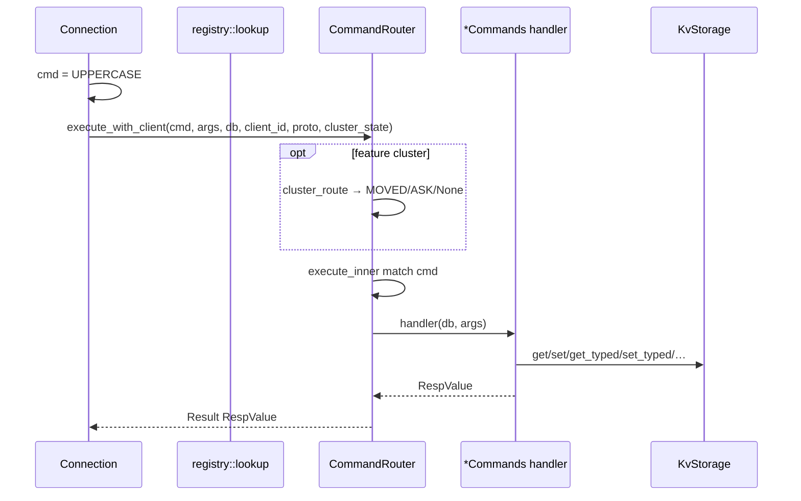
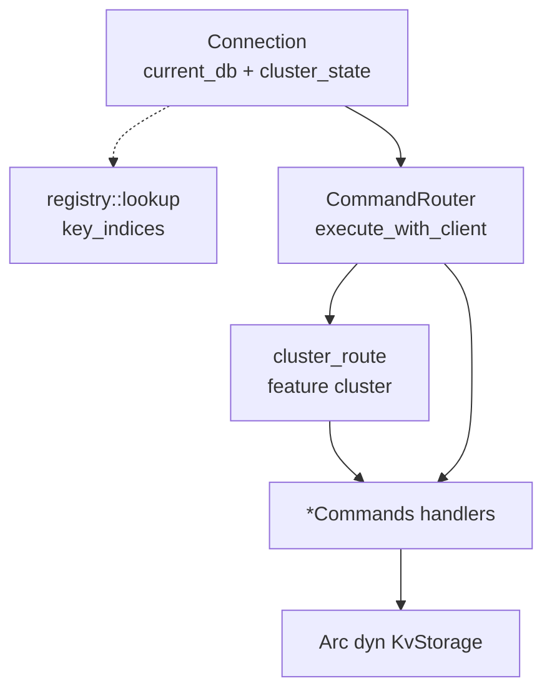
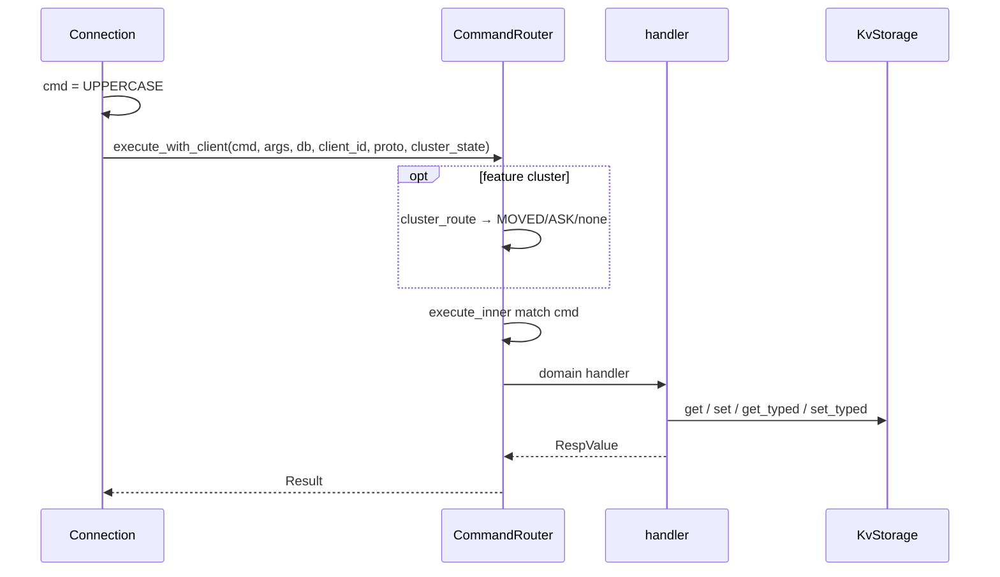

# Cursor transcript

---

## 1. User

## 文档整理 — 新会话

工作目录: `/root/code/database`

请先阅读 (不要跳过):

1. `AiKv-Workflow/backup/design.md` — 总规程
2. `AiKv-Workflow/backup/PROGRESS.md` — 当前进度
3. `AiKv-Workflow/backup/INDEX.md` — 本章索引 (若已有行则更新)

---

### 本次任务

| 项 | 值 |
|----|-----|
| PROGRESS 总步 | 7 |
| 目标文件 | `aikv/docs/modules/commands-core.md` |
| 本次子步 | 从步 0 开始 |
| 对比深度 | 模块级 (见 `design.md` — aikv `commands-core` 非加深章) |

### 必须遵守

- **确认门控**: 步 0→1→2→3→4, 每步先讨论, 我确认后再下一步
- **步 4**: 先出 Module Skill 正文 **草稿**, 我确认后再写入 aidb/aikv、更新 INDEX/PROGRESS
- **Module Skill 基础模板**: frontmatter `name` + `description` (含 `Use when`); 见 `design.md`
- **过程只进 backup/**: INDEX; aidb/aikv 不写迁移历史
- **旧文档顺序**: `backup/{aidb,aikv}/` → `*-oldmain` → WiQunTools inventory 段 → wiqun-*
- **待核实**: module 一行引用; 详情写入 **当前仓库** 根目录 `ISSUES.md` (`aikv/ISSUES.md`)
- **步 4 落盘前**: 对照 create-skill Summary Checklist 自检 (见 `design.md`)

### 上下文 (上一章已完成)

- 步 6 ✅ [`aikv/docs/modules/storage.md`](aikv/docs/modules/storage.md) — `KvStorage` / `MemoryEngine` / `StorageAdapter` 链 / `ClusterDataAdapter` / `StoredValue`; ISSUE-001 (mget wrong-type), ISSUE-002 (Options::for_testing)
- 前置 module: [`protocol.md`](aikv/docs/modules/protocol.md), [`server.md`](aikv/docs/modules/server.md) — Connection → `CommandRouter::execute_with_client`
- 本章覆盖 `aikv/src/command/{string,hash,list,set,zset,key,database,registry,router}`; 步 8 commands-extended、步 11 cluster 会引用本章
- WiQunTools 查漏重点: `02-storage-commands.md` (Phase 9 命令集 + Router)

### 本次不要

- 不要跳过未确认的步骤
- 不要一次写多篇 module
- 不要修改 `design.md` / 流程, 除非我明确要求
- 不要 commit, 除非我明确要求

---

请从步 0 开始, 给出本步交付物, 等我确认。

---

## 2. Assistant

正在阅读规程、进度与索引，随后给出步 0 交付物。

**Tool `Read`**

```json
{
  "path": "/root/code/database/AiKv-Workflow/backup/design.md"
}
```


**Tool `Read`**

```json
{
  "path": "/root/code/database/AiKv-Workflow/backup/PROGRESS.md"
}
```


**Tool `Read`**

```json
{
  "path": "/root/code/database/AiKv-Workflow/backup/INDEX.md"
}
```


---

## 3. Assistant

对照 `design.md` 的 modules↔src 映射，正在扫描 `aikv/src/command/` 目录结构以确定本章范围。

**Tool `Glob`**

```json
{
  "glob_pattern": "**/*",
  "target_directory": "/root/code/database/aikv/src/command"
}
```


**Tool `Read`**

```json
{
  "path": "/root/code/database/aikv/src/command/mod.rs"
}
```


**Tool `Grep`**

```json
{
  "pattern": "command::",
  "path": "/root/code/database/aikv/src",
  "glob": "*.rs",
  "head_limit": 40
}
```


**Tool `Read`**

```json
{
  "path": "/root/code/database/aikv/docs/modules/storage.md",
  "limit": 80
}
```


---

## 4. Assistant

**Tool `Read`**

```json
{
  "limit": 120,
  "path": "/root/code/database/aikv/src/command/router.rs"
}
```


**Tool `Read`**

```json
{
  "limit": 150,
  "path": "/root/code/database/aikv/src/command/registry.rs"
}
```


**Tool `Grep`**

```json
{
  "pattern": "scan_util",
  "path": "/root/code/database/aikv/src/command"
}
```


**Tool `Glob`**

```json
{
  "glob_pattern": "**/02-storage-commands*",
  "target_directory": "/root/code/database"
}
```


---

## 5. Assistant

**Tool `Grep`**

```json
{
  "path": "/root/code/database/aikv/src/command/router.rs",
  "pattern": "pub async fn|fn dispatch|match cmd"
}
```


**Tool `Read`**

```json
{
  "limit": 80,
  "path": "/root/code/database/aikv/src/command/key.rs"
}
```


**Tool `Read`**

```json
{
  "limit": 60,
  "path": "/root/code/database/WiQunTools/docs/wiqun-kv-inventory/02-storage-commands.md"
}
```


**Tool `Grep`**

```json
{
  "path": "/root/code/database/aikv/src",
  "pattern": "cluster_commands|ClusterCommands"
}
```


**Tool `Shell`**

```bash
wc -l /root/code/database/aikv/src/command/{string,hash,list,set,zset,key,database,registry,router,scan_util}.rs 2>/dev/null
```


---

## 6. Assistant

**Tool `Read`**

```json
{
  "offset": 160,
  "limit": 220,
  "path": "/root/code/database/aikv/src/command/router.rs"
}
```


**Tool `Grep`**

```json
{
  "path": "/root/code/database/aikv/src/command/key.rs",
  "pattern": "pub async fn|migrate|restore|dump|scan|keys|rename",
  "-i": true
}
```


**Tool `Grep`**

```json
{
  "path": "/root/code/database/aikv/src/command/list.rs",
  "pattern": "blocking|BLPOP|pub async fn"
}
```


**Tool `Glob`**

```json
{
  "glob_pattern": "**/*command*",
  "target_directory": "/root/code/database/AiKv-Workflow/backup/aikv"
}
```


**Tool `Glob`**

```json
{
  "glob_pattern": "**/*command*",
  "target_directory": "/root/code/database/aikv-oldmain"
}
```


---

## 7. Assistant

**Tool `Read`**

```json
{
  "limit": 80,
  "path": "/root/code/database/aikv-oldmain/docs/development/api/01-commands.md"
}
```


**Tool `Read`**

```json
{
  "offset": 150,
  "limit": 140,
  "path": "/root/code/database/aikv/src/command/registry.rs"
}
```


**Tool `Grep`**

```json
{
  "path": "/root/code/database/aikv/docs/modules/server.md",
  "pattern": "CommandRouter|commands-core"
}
```


**Tool `Glob`**

```json
{
  "glob_pattern": "**/commands*.rs",
  "target_directory": "/root/code/database/aikv/tests"
}
```


---

## 8. Assistant

**Tool `Glob`**

```json
{
  "glob_pattern": "**/*",
  "target_directory": "/root/code/database/aikv/tests/modules"
}
```


**Tool `Read`**

```json
{
  "limit": 50,
  "path": "/root/code/database/aikv/tests/commands.rs"
}
```


**Tool `Grep`**

```json
{
  "path": "/root/code/database/aikv/src/command/router.rs",
  "pattern": "^            \\\"",
  "head_limit": 80
}
```


---

## 9. Assistant

**Tool `Glob`**

```json
{
  "glob_pattern": "commands-core.md",
  "target_directory": "/root/code/database/aikv"
}
```


**Tool `Read`**

```json
{
  "limit": 30,
  "path": "/root/code/database/aikv/docs/modules/server.md",
  "offset": 110
}
```


---

## 10. Assistant

## 步 0 — 定范围

**PROGRESS 步 7** · 目标: `aikv/docs/modules/commands-core.md` · 对比深度: **模块级** (非加深章)

---

### 1. 本章定位

命令层 **核心数据结构 + 路由骨架**: 从 `Connection` 进入 `CommandRouter::execute_with_client` 后, 经 `registry` 元数据与 `router` 分发, 调用各 `*Commands` handler, 读写 `Arc<dyn KvStorage>`.

**上游 (已完成, 仅引用)**:
- [protocol.md](aikv/docs/modules/protocol.md) — RESP 帧
- [server.md](aikv/docs/modules/server.md) — `Connection` → Router 调用链
- [storage.md](aikv/docs/modules/storage.md) — `KvStorage` / `StoredValue` / WRONGTYPE 约定

**下游 (本章写完后被引用)**:
- 步 8 `commands-extended.md` — JSON/Lua/阻塞基础设施/持久化/Server 命令
- 步 11 `cluster.md` — `router::cluster_route` 与 MOVED/ASK

---

### 2. 覆盖 `src/` (design.md 映射)

```shell
aikv/src/command/
├── database.rs    # SELECT / DBSIZE / FLUSH* / SWAPDB / MOVE
├── hash.rs        # Hash 命令 + HSCAN
├── key.rs         # 过期 / KEYS / SCAN / RENAME / TYPE / COPY / DUMP / RESTORE / MIGRATE
├── list.rs        # List 命令 + BLPOP/BRPOP/BLMOVE (阻塞)
├── registry.rs    # COMMAND_TABLE / lookup / key_indices
├── router.rs      # CommandRouter / KeyLock / execute_inner match / 公共 helper
├── set.rs         # Set 命令 + SSCAN
├── string.rs      # String 命令 (含 DEL/EXISTS 等通用 key 操作)
├── zset.rs        # ZSet 命令 + ZSCAN + BZPOP*
├── mod.rs         # 模块根; pub re-export CommandRouter / registry
└── scan_util.rs   # HSCAN/SSCAN/ZSCAN 分页 helper (design 未单列, 见 §4)
```

**规模**: 上述 10 个文件合计 ~4524 行; 最大单文件 `zset.rs` (907), `router.rs` (746).

**`mod.rs` pub 面** (跨模块入口):

```22:25:aikv/src/command/mod.rs
pub use json::JsonCommands;
pub use registry::{all_commands, command_count, key_indices, lookup, CommandInfo};
pub use router::{CommandRouter, KeyLock, KeyLocksGuard};
pub use script::ScriptCommands;
```

本章文档重点: `CommandRouter`, `registry::*`, `KeyLock`; `JsonCommands`/`ScriptCommands` 仅作「Router 持有但实现见 extended」一笔带过.

---

### 3. 本章边界

#### ✅ 纳入

| 域 | 主要命令 (registry 段) | Handler 文件 |
|----|------------------------|--------------|
| String | GET/SET/MGET/MSET, INCR*, SETBIT, SETEX… | `string.rs` |
| Hash | HSET/HGET/HSCAN… | `hash.rs` |
| List | LPUSH/LRANGE/LMOVE, **BLPOP/BRPOP/BLMOVE** | `list.rs` |
| Set | SADD/SINTER/SSCAN… | `set.rs` |
| ZSet | ZADD/ZRANGE/ZUNION, **BZPOPMIN/MAX** | `zset.rs` |
| Database | SELECT/DBSIZE/FLUSHDB/FLUSHALL/SWAPDB/MOVE | `database.rs` |
| Key | EXPIRE/TTL, KEYS/SCAN, RENAME/TYPE/COPY, DUMP/RESTORE/**MIGRATE** | `key.rs` |
| 路由 | `execute_with_client` → `execute_inner` match, `KeyLock`, RESP helper | `router.rs` |
| 元数据 | `CommandInfo`, `lookup`, `key_indices`, 全表维护约定 | `registry.rs` |
| Scan 辅助 | cursor/MATCH/COUNT 解析, 内存分页 | `scan_util.rs` |

#### ❌ 不纳入 (链到其它 module)

| 路径 | 归属 | 本章处理方式 |
|------|------|--------------|
| `json*.rs`, `script/` | 步 8 extended | Router match 分支一行指向 extended |
| `blocking.rs` | 步 8 extended | list/zset 阻塞命令 **handler 仍属 core**; `BlockingRegistry` 机制链 extended |
| `migrate.rs` | 步 8 extended | `key.rs::migrate` 为入口; TCP RESTORE 发送细节链 extended |
| `persistence.rs`, `server.rs` | 步 8 extended | Router 内 INFO/SAVE 等 dispatch 链 extended |
| `cluster/*` | 步 11 | `router::cluster_route` 仅摘要 + 链 cluster.md |
| `server/connection.rs` 内联 PING/HELLO/ATOM | server.md | 不重复 |

#### ⚠️ 边界待你确认 (3 点)

1. **`scan_util.rs`**: design 未列, 但仅被 core 的 HSCAN/SSCAN/ZSCAN 使用 → 建议 **纳入 core** (作为 scan 子节, 不单独成章).
2. **阻塞命令**: 实现落在 `list.rs`/`zset.rs`, 依赖 `blocking.rs` → 建议 **命令语义写 core**, **BlockingRegistry/唤醒模型写 extended** (交叉链接).
3. **`registry.rs` 含全量命令表** (含 JSON/Lua/INFO/CLUSTER 等) → 建议 **registry 维护机制写 core**, extended/cluster 命令条目 **不展开语义**, 只注明「表内已有, 实现见 X」.

若以上 3 点无异议, 可按此执行步 1–4.

---

### 4. 拟读文件列表 (步 1–3)

**步 1 — 新代码 (必读, 按优先级)**

| 优先级 | 文件 | 目的 |
|--------|------|------|
| P0 | `command/router.rs` | 入口、match 表、KeyLock、cluster_route 边界 |
| P0 | `command/registry.rs` | 元数据、flags、key 索引算法 |
| P0 | `command/mod.rs` | 模块装配 |
| P1 | `command/{string,hash,list,set,zset,key,database}.rs` | 各域 handler 模式 |
| P1 | `command/scan_util.rs` | SCAN 系列共用逻辑 |
| P2 | `server/connection.rs` (Router 调用段) | 与 server.md 对齐 |
| P2 | `storage/types.rs` (`KvStorage` trait) | handler 如何调用 storage |

**步 1 — 测试**

| 路径 | 说明 |
|------|------|
| `tests/commands.rs` + `tests/modules/command/{string,hash,list,set,zset,key,database,router}.rs` | L1 命令测试 |
| `tests/modules/server/tcp.rs` | L2 SET/GET/SELECT smoke |

**步 2 — 旧文档 (按 design 顺序)**

| 顺序 | 来源 | 路径 |
|------|------|------|
| 1 | backup/aikv | `ARCHITECTURE.md`, `DESIGN.md`, `CHANGELOG.md` (命令层段落) |
| 2 | aikv-oldmain | `docs/development/api/01-commands.md` (4500+ 行命令参考, 查漏) |
| 3 | WiQunTools | `docs/wiqun-kv-inventory/02-storage-commands.md` (Phase 9 命令集 + Router) |
| 4 | wiqun-kv | `src/command/*` (与 aikv 重叠, 二选一查漏) |

**步 3 — oldmain 代码对照 (模块级)**

- `aikv-oldmain/src/command/` (若存在) 或 wiqun-kv 同源
- `aikv-oldmain/src/cluster/commands.rs` — 仅确认 cluster 子命令 **不在** 本章

---

### 5. 拟 INDEX 行 (确认步 0 后写入)

| 字段 | 内容 |
|------|------|
| 新文档章节 | `docs/modules/commands-core.md` |
| 状态 | 🔄 步 0 已确认 |
| 覆盖 src | `command/{string,hash,list,set,zset,key,database,registry,router}` + `scan_util` |
| 参考的旧文档 | (步 2 填) backup/aikv; WiQunTools 02-storage-commands; aikv-oldmain 01-commands |
| 备注 | 阻塞/MIGRATE 跨 extended; cluster_route → cluster.md |

---

### 6. 步 0 自检

- [x] 对照 PROGRESS 步 7 与 design modules↔src 表
- [x] 列出 `src/` 路径与入口 (`CommandRouter`, `registry::lookup`)
- [x] 明确上下游 module 边界
- [x] 标注 3 处跨章依赖待确认
- [ ] **未写** aidb/aikv 正文 / INDEX / PROGRESS (等你确认)

---

请确认步 0: **可以** / **调整…** (尤其 §3 三条边界). 确认后进入 **步 1 — 读新代码**.

---

## 11. User

可以

---

## 12. Assistant

步 0 已确认。正在更新 INDEX 并阅读核心命令层源码，整理步 1 交付物。

**Tool `StrReplace`**

```json
{
  "path": "/root/code/database/AiKv-Workflow/backup/INDEX.md",
  "old_string": "| `docs/modules/commands-core.md` | 待开始 | | | string/hash/list/set/zset/key/db + router |",
  "new_string": "| `docs/modules/commands-core.md` | 🔄 步 0 ✅ | (步 2 填) backup/aikv; WiQunTools 02-storage-commands; aikv-oldmain 01-commands | | `command/{string,hash,list,set,zset,key,database,registry,router}` + `scan_util`; 阻塞/MIGRATE 跨 extended; cluster_route → cluster.md |"
}
```


**Tool `Read`**

```json
{
  "path": "/root/code/database/aikv/src/command/database.rs"
}
```


**Tool `Read`**

```json
{
  "path": "/root/code/database/aikv/src/command/scan_util.rs"
}
```


**Tool `Read`**

```json
{
  "limit": 120,
  "path": "/root/code/database/aikv/src/command/string.rs"
}
```


**Tool `Read`**

```json
{
  "limit": 100,
  "path": "/root/code/database/aikv/src/command/hash.rs"
}
```


---

## 13. Assistant

**Tool `Read`**

```json
{
  "limit": 80,
  "offset": 108,
  "path": "/root/code/database/aikv/src/command/router.rs"
}
```


**Tool `Read`**

```json
{
  "limit": 80,
  "offset": 430,
  "path": "/root/code/database/aikv/src/command/router.rs"
}
```


**Tool `Read`**

```json
{
  "limit": 80,
  "offset": 650,
  "path": "/root/code/database/aikv/src/command/router.rs"
}
```


**Tool `Read`**

```json
{
  "limit": 100,
  "path": "/root/code/database/aikv/src/command/set.rs"
}
```


**Tool `Read`**

```json
{
  "limit": 100,
  "path": "/root/code/database/aikv/src/command/list.rs"
}
```


---

## 14. Assistant

**Tool `Read`**

```json
{
  "limit": 80,
  "offset": 500,
  "path": "/root/code/database/aikv/src/command/router.rs"
}
```


**Tool `Read`**

```json
{
  "limit": 120,
  "offset": 120,
  "path": "/root/code/database/aikv/src/command/string.rs"
}
```


**Tool `Read`**

```json
{
  "limit": 100,
  "path": "/root/code/database/aikv/src/command/zset.rs"
}
```


**Tool `Read`**

```json
{
  "limit": 100,
  "offset": 130,
  "path": "/root/code/database/aikv/src/command/key.rs"
}
```


**Tool `Read`**

```json
{
  "limit": 60,
  "path": "/root/code/database/aikv/tests/modules/command/mod.rs"
}
```


---

## 15. Assistant

**Tool `Read`**

```json
{
  "limit": 80,
  "offset": 250,
  "path": "/root/code/database/aikv/src/command/hash.rs"
}
```


**Tool `Read`**

```json
{
  "limit": 80,
  "offset": 400,
  "path": "/root/code/database/aikv/src/command/list.rs"
}
```


**Tool `Grep`**

```json
{
  "path": "/root/code/database/aikv/src/command/router.rs",
  "pattern": "normalize|to_ascii|execute_inner"
}
```


**Tool `Shell`**

```bash
cd /root/code/database/aikv && cargo test --test commands string:: hash:: list:: set:: zset:: key:: database:: router:: -- --test-threads=4 2>&1 | tail -30
```


---

## 16. Assistant

**Tool `Read`**

```json
{
  "limit": 40,
  "offset": 730,
  "path": "/root/code/database/aikv/src/command/router.rs"
}
```


**Tool `Shell`**

```bash
cd /root/code/database/aikv && cargo test --test commands 2>&1 | tail -20
```


---

## 17. Assistant

**Tool `Grep`**

```json
{
  "path": "/root/code/database/aikv/src/server/connection.rs",
  "pattern": "execute_with_client|to_ascii_uppercase|cmd_name",
  "head_limit": 30
}
```


**Tool `Read`**

```json
{
  "limit": 30,
  "path": "/root/code/database/aikv/tests/modules/command/router.rs"
}
```


---

## 18. Assistant

## 步 1 — 读新代码

已对照 `aikv/src/command/*` 与 `tests/commands.rs` (258 passed). 以下为讨论稿, **未写** module 正文.

---

### 1. 模块职责 (一句话)

命令层 = **RESP 命令名 → handler → `KvStorage` 读写** 的实现域; `registry` 提供 Redis 兼容元数据 (arity/flags/key 索引), `router` 统一分发、加锁、metrics 与 (可选) cluster 前置路由.

---

### 2. 代码地图

| 路径 | 职责 | 入口类型 / 函数 |
|------|------|-----------------|
| `command/mod.rs` | 模块根; re-export | `CommandRouter`, `lookup`, `KeyLock` |
| `command/router.rs` | 分发中枢 + 公共 helper | `CommandRouter::new` / `new_with_shared`, `execute_with_client`, `execute_inner`, `KeyLock`, `ok`/`bulk`/`wrongtype` |
| `command/registry.rs` | 全量 `COMMAND_TABLE` (~131+ 条) | `lookup`, `key_indices`, `all_commands` |
| `command/string.rs` | String + 通用 key 删查 | `StringCommands`; `get`/`set`/`mget`/`del`/`exists`/INCR*/SETBIT… |
| `command/hash.rs` | Hash | `HashCommands`; `load_or_create_hash`, `hscan` |
| `command/list.rs` | List + 阻塞 pop/move | `ListCommands`; `push`/`pop`/`lmove`, `blpop`/`blocking_pop` |
| `command/set.rs` | Set + 集合运算 | `SetCommands`; `sunion`/`sinter`/`sdiff*`, `sscan` |
| `command/zset.rs` | ZSet + 聚合 + 阻塞 pop | `ZSetCommands`; `BTreeMap` score, `zinter`/`zunion`/`zdiff`, `bzpop*` |
| `command/database.rs` | 逻辑 DB | `DatabaseCommands`; `select` 改 `*db`, `flush*`/`swapdb`/`move` |
| `command/key.rs` | Key 元操作 | `KeyCommands`; 过期/TTL, `keys`/`scan`, rename/type/copy, dump/restore/migrate |
| `command/scan_util.rs` | HSCAN/SSCAN/ZSCAN 共用 | `parse_scan_options`, `paginate_slice`, `scan_response_bulk` |

**Handler 共性模式** (Hash/List/Set/ZSet):

1. `router::require_*` 校验参数
2. 写路径: `key_lock.lock(key)` → `get_typed` / `load_or_create_*` → 改 `ValueType::*` → `set_typed` (空容器则 `delete`)
3. 读路径: `load_*` → WRONGTYPE 或 nil
4. String 用 `get`/`set` (仅 String 类型); 复杂类型一律 `get_typed`/`set_typed`

---

### 3. 主流程

#### 3.1 请求路径 (与 server.md 衔接)



- `Connection` 在入 Router 前已将命令名 **大写**; `execute_inner` 用 `"GET"` 等字面 match.
- `SELECT` 是唯一在 handler 内 **修改 `*db`** 的核心命令 (`database::select`).
- `new_with_shared` 额外注入 `ServerCommands` / `PersistenceCommands` / metrics; `new` 仅 storage (测试用).

#### 3.2 CommandRouter 装配

- 共享 **1024 桶** `KeyLock` 注入 String/Hash/List/Set/ZSet/Key/Json/Script.
- `DatabaseCommands` **无** KeyLock (DB 级操作).
- Json/Script 实例始终创建; Server/Persistence 仅 `new_with_shared`.

#### 3.3 KeyLock 使用场景

| 场景 | API |
|------|-----|
| 单 key 写 (SET NX/XX, HSET, LPUSH, INCR…) | `lock(key)` |
| RENAME / 双 key | `lock_two(a, b)` 字典序, 同 key 不重入 |
| 多 key (Lua/事务外较少) | `lock_keys_sorted` |

#### 3.4 registry 与 Connection 协作

- `lookup`: 大小写不敏感 (内部转 upper).
- `key_indices`: Redis `COMMAND GETKEYS` 语义; `first_key=0` → 无 key (SELECT/SCAN/FLUSH…).
- Connection 用 `lookup` + `key_indices` 做 **WATCH 键追踪**、写命令判定 (ATOM 事务), 本章文档需点出此跨模块用途.

#### 3.5 两类 SCAN

| 命令 | 实现 | 游标语义 |
|------|------|----------|
| `SCAN` | `key.rs` → `storage.scan` | 引擎级 (memory/aidb 各自实现) |
| `HSCAN`/`SSCAN`/`ZSCAN` | 读全量 → 内存 filter/paginate | `scan_util::paginate_slice`; 非 Redis 的 incremental hash slot |

#### 3.6 阻塞命令 (handler 在 core, 机制在 extended)

- `LPUSH`/`ZADD` 成功后 `BlockingRegistry::global().notify(key, …)` 唤醒等待者.
- `BLPOP`/`BRPOP`/`BLMOVE`/`BZPOP*`: 先 `try_pop`, 失败则 register + 轮询 `try_recv` + 超时 nil.
- 步 4 正文: core 写 **命令语义与 notify 触发点**; `BlockingRegistry` 细节链 `commands-extended.md`.

#### 3.7 DUMP / RESTORE / MIGRATE

- `DUMP`: `[u8 version=0][bincode(StoredValue)]` — **非 Redis 格式** (storage.md 同源).
- `RESTORE`: `dump_decode` + TTL 选项 + `set_typed`; REPLACE 先删.
- `MIGRATE`: 本地 `dump_encode` → `migrate::send_restore` (TCP RESTORE); 实现细节链 extended.

#### 3.8 metrics 钩子 (router 层)

- `record_keyspace_hit/miss`: GET/MGET/HGET/EXISTS 等读路径.
- `record_command_outcome`: 每条命令成功/失败 → `ServerMetrics::on_command`.

#### 3.9 cluster 边界 (本章摘要, 详述留步 11)

- `execute_with_client` 在 `execute_inner` 前调用 `cluster_route`.
- 多 key 命令 CROSSSLOT 检查; `SCAN`/`MIGRATE` 等列入 admin 白名单不按键路由.
- `classify_command` 区分 Read/Write 供 `ClusterRouter::decide`.

---

### 4. 关键 invariant (步 4 应保留)

- **类型分轨**: String API (`get`/`set`) vs typed API (`get_typed`/`set_typed`); 混用 → `WRONGTYPE`.
- **空容器删除**: Hash/List/Set/ZSet 删至空 → `delete`, 不留 tombstone key.
- **HMSET 兼容**: 走 `hset` 逻辑但返回 `OK` 而非新增字段数.
- **INCR 族**: 空 key 当 0; 整数字符串或 float 字符串; overflow/NaN 报错.
- **SET 条件写**: NX/XX 必须持锁再查 exists.
- **MOVE (db)**: 目标已有同名 key → 返回 0, 不覆盖.
- **registry 与 router 双维护**: 新命令须同时加 `COMMAND_TABLE` 与 `execute_inner` match (或子 dispatch).

---

### 5. 命令覆盖速查 (registry 核心段, ~110 条 handler 在本章)

| 域 | 代表命令 | 备注 |
|----|----------|------|
| String | GET/SET/MGET/MSET, INCR*, SETBIT, SETEX/SETNX/GETEX/GETDEL | DEL/EXISTS 实现在 `string.rs` |
| Hash | HSET/HGET/HSCAN, HINCRBY(FLOAT) | |
| List | LPUSH/LPOP/LMOVE, BLPOP/BRPOP/BLMOVE | 阻塞见 §3.6 |
| Set | SADD/SINTER/SUNION/SDIFF*, SMOVE, SSCAN | store 类多 key 无 KeyLock (读路径) |
| ZSet | ZADD/ZRANGE/ZINTER/ZUNION/ZDIFF, BZPOPMIN/MAX | score 用 `BTreeMap<member, score>` |
| Database | SELECT/DBSIZE/FLUSHDB/FLUSHALL/SWAPDB/MOVE | `DB_COUNT` 上限 |
| Key | EXPIRE/TTL/PERSIST, KEYS/SCAN, RENAME/TYPE/COPY, DUMP/RESTORE/MIGRATE | SCAN 走 storage; MIGRATE 跨 extended |

registry 内 JSON/Lua/INFO/SAVE/CLUSTER 等条目: **表内登记**, handler 在 extended/cluster 章.

---

### 6. 测试

```bash
cd aikv && cargo test --test commands
# 核心子模块: tests/modules/command/{string,hash,list,set,zset,key,database,router}.rs
# L2: tests/modules/server/tcp.rs
```

已跑: **258 passed**, 0 failed.

---

### 7. 步 1 初判 (供步 2/3 关注, 非 ISSUE)

| 点 | 说明 |
|----|------|
| HSCAN/SSCAN/ZSCAN | 全量加载 + 内存分页, 大 key O(n) |
| `OBJECT ENCODING` | 固定返回 embstr/raw/listpack, 非真实 Redis 编码 |
| MGET + wrong-type | storage 层 ISSUE-001 已开; 命令层文档一行引用即可 |
| 阻塞 timeout=0 | 非阻塞尝试后立即 nil, 与 Redis 一致 |

---

步 0 已写入 `INDEX.md` 范围行. 步 1 **未改** PROGRESS (仍 ⬜, 待章末 ✅).

请确认步 1: **可以** / **调整…**. 确认后进入 **步 2 — 查旧文档**.

---

## 19. User

可以

---

## 20. Assistant

步 1 已确认。正在按旧文档查阅顺序检索 commands-core 相关参考，整理步 2 交付物。

**Tool `Grep`**

```json
{
  "path": "/root/code/database/AiKv-Workflow/backup/aikv",
  "pattern": "command|CommandRouter|Phase 9|HSET|registry",
  "glob": "*.md",
  "head_limit": 60
}
```


**Tool `Glob`**

```json
{
  "glob_pattern": "**/*",
  "target_directory": "/root/code/database/aikv-oldmain/src/command"
}
```


**Tool `Glob`**

```json
{
  "glob_pattern": "**/*",
  "target_directory": "/root/code/database/wiqun-kv/src/command"
}
```


**Tool `Grep`**

```json
{
  "path": "/root/code/database/WiQunTools/docs/wiqun-kv-inventory/02-storage-commands.md",
  "pattern": "CommandRouter|registry|List|ZSet|Phase 10",
  "head_limit": 40
}
```


---

## 21. Assistant

**Tool `Grep`**

```json
{
  "glob": "*.md",
  "head_limit": 40,
  "path": "/root/code/database/AiKv-Workflow/backup/aikv/ARCHITECTURE.md",
  "pattern": "command|CommandRouter|KeyLock|registry"
}
```


**Tool `Grep`**

```json
{
  "glob": "*.md",
  "head_limit": 40,
  "path": "/root/code/database/AiKv-Workflow/backup/aikv/DESIGN.md",
  "pattern": "command|CommandRouter|KeyLock|registry|WRONGTYPE"
}
```


**Tool `Read`**

```json
{
  "path": "/root/code/database/aikv/ISSUES.md"
}
```


**Tool `Read`**

```json
{
  "path": "/root/code/database/aikv-oldmain/src/command/mod.rs"
}
```


**Tool `Glob`**

```json
{
  "glob_pattern": "**/*",
  "target_directory": "/root/code/database/AiKv-Workflow/backup/archive"
}
```


---

## 22. Assistant

**Tool `Grep`**

```json
{
  "path": "/root/code/database/aikv-oldmain",
  "pattern": "KeyLock|registry|CommandRouter|BlockingRegistry|GETRANGE|BLPOP",
  "glob": "*.rs",
  "head_limit": 40
}
```


**Tool `Grep`**

```json
{
  "path": "/root/code/database/aikv/src/command/string.rs",
  "pattern": "GETRANGE|SETRANGE"
}
```


**Tool `Read`**

```json
{
  "limit": 80,
  "offset": 140,
  "path": "/root/code/database/AiKv-Workflow/backup/aikv/ARCHITECTURE.md"
}
```


**Tool `Grep`**

```json
{
  "path": "/root/code/database/aikv-oldmain/docs/development/api/01-commands.md",
  "pattern": "DUMP|HSCAN|registry|CommandExecutor",
  "head_limit": 30
}
```


---

## 23. Assistant

**Tool `Grep`**

```json
{
  "path": "/root/code/database/aikv/src/command",
  "pattern": "GETRANGE|SETRANGE|UNLINK|TOUCH"
}
```


**Tool `Grep`**

```json
{
  "path": "/root/code/database/aikv-oldmain/src/command/list.rs",
  "pattern": "BLPOP|blocking"
}
```


**Tool `Read`**

```json
{
  "limit": 50,
  "path": "/root/code/database/AiKv-Workflow/backup/aikv/ARCHITECTURE.md"
}
```


**Tool `Grep`**

```json
{
  "path": "/root/code/database/WiQunTools/docs/wiqun-kv-inventory/02-storage-commands.md",
  "pattern": "GETRANGE|registry|HSCAN|DUMP|blocking"
}
```


---

## 24. Assistant

**Tool `Grep`**

```json
{
  "path": "/root/code/database/wiqun-kv/src/command",
  "pattern": "GETRANGE|registry"
}
```


**Tool `Grep`**

```json
{
  "path": "/root/code/database/aikv-oldmain/docs/development/api/01-commands.md",
  "pattern": "GETRANGE"
}
```


**Tool `Read`**

```json
{
  "limit": 40,
  "path": "/root/code/database/aikv-oldmain/docs/development/api/01-commands.md"
}
```


**Tool `Glob`**

```json
{
  "glob_pattern": "**/*",
  "target_directory": "/root/code/database/aikv-oldmain/docs/development"
}
```


---

## 25. Assistant

**Tool `Grep`**

```json
{
  "path": "/root/code/database/aikv/src/command",
  "pattern": "MSETNX|GETRANGE|UNLINK"
}
```


**Tool `Grep`**

```json
{
  "path": "/root/code/database/aikv-oldmain/src/command/mod.rs",
  "pattern": "MSETNX|GETRANGE"
}
```


**Tool `Read`**

```json
{
  "limit": 80,
  "path": "/root/code/database/aikv-oldmain/docs/development/architecture/01-overview.md"
}
```


**Tool `Grep`**

```json
{
  "path": "/root/code/database/AiKv-Workflow/backup/aikv/CHANGELOG.md",
  "pattern": "List|ZSet|registry|KeyLock|GETRANGE|blocking"
}
```


---

## 26. Assistant

**Tool `Grep`**

```json
{
  "path": "/root/code/database/aikv",
  "pattern": "MSETNX"
}
```


**Tool `Grep`**

```json
{
  "path": "/root/code/database/aikv-oldmain/src/command/key.rs",
  "pattern": "dump|DUMP",
  "head_limit": 15
}
```


**Tool `Read`**

```json
{
  "limit": 50,
  "offset": 330,
  "path": "/root/code/database/aikv-oldmain/docs/development/api/01-commands.md"
}
```


---

## 27. Assistant

**Tool `Grep`**

```json
{
  "path": "/root/code/database/wiqun-kv",
  "pattern": "GETRANGE|MSETNX"
}
```


**Tool `Read`**

```json
{
  "limit": 30,
  "offset": 720,
  "path": "/root/code/database/WiQunTools/docs/wiqun-kv-inventory/02-storage-commands.md"
}
```


---

## 28. Assistant

**Tool `Grep`**

```json
{
  "path": "/root/code/database",
  "pattern": "MSETNX|msetnx",
  "glob": "**/aikv/**"
}
```


---

## 29. Assistant

## 步 2 — 查旧文档

已按 `design.md` 顺序查阅. 以下为讨论稿; **未写** `commands-core.md` / **未写** `ISSUES.md` (等你确认后再落盘).

---

### 1. 旧文档清单与分类

| 顺序 | 来源 | 路径 | 分类 | 处理建议 |
|:--:|------|------|------|----------|
| 1 | backup/aikv | `ARCHITECTURE.md` (command/ 段) | **已过时** | 仍写 `key_lock.rs`/`keys.rs`/`command_registry.rs`/独立 `script/`; 与现 `command/{router,registry,key}.rs` 不符 → **不迁入** |
| 1 | backup/aikv | `DESIGN.md` (KeyLock 字典序) | **仍有效** | 与现 `KeyLock::lock_two`/`lock_keys_sorted` 一致 → 步 4 保留 invariant |
| 1 | backup/aikv | `CHANGELOG.md` (Phase 9–10 命令增量) | **仍有效** (历史) | 时间线查漏: P9 String/Hash/DB/Key → P10 List/Set/ZSet → KeyLock/scan_util/registry |
| 1 | backup/aikv | `CONTRIBUTING.md` | **仍有效** | `cargo test --test commands` 矩阵 |
| 1 | backup/aikv | `README.md` | **部分有效** | 高层 Parser→Router 图可用; 细节以现码为准 |
| 2 | aikv-oldmain | `docs/development/api/01-commands.md` (~4500 行) | **部分有效** | 命令语义/示例查漏; 含 **未实现** 命令 (GETRANGE 等); **勿整篇回迁** |
| 2 | aikv-oldmain | `docs/development/architecture/01-overview.md` | **已过时** | `CommandExecutor` + 同步 `StorageEngine`; 集群路由 per-command 内联 |
| 2 | aikv-oldmain | `src/command/mod.rs` (`CommandExecutor`) | **已过时** (步 3 对照) | 无 `registry.rs`/`router.rs`; 无 `BlockingRegistry` |
| 2 | aikv-oldmain | `src/command/{string,key}.rs` | **设计偏离** | GETRANGE/SETRANGE 有; DUMP 为 **Redis RDB 风格** (checksum) |
| 3 | WiQunTools | `wiqun-kv-inventory/02-storage-commands.md` | **部分有效** | Phase 9 (9.1–9.7) 与现 core **一致**; Phase 10 List/Set/ZSet/SCAN 等标注「未做」→ **已实现**; `keys.rs`→`key.rs` |
| 4 | wiqun-kv | `src/command/{router,registry,*} ` | **仍有效** | 与 aikv 几乎同构; **二选一对照** 即可 (与 aikv 差异极小) |
| — | backup/archive | `aikv-oldmain/.../04-storage.md` | **已过时** | storage 章已归档; 本章不引用 |

**步 4 消化候选** (确认步 4 后再删/归档): 无本章专属旧稿 (aikv 仓库内从未有 `commands-core.md`); `01-commands.md` 留在 oldmain 作查漏, 步 4 后不整篇迁移.

---

### 2. 旧文档 vs 现码 — 要点对照

| 主题 | 旧文档/旧码 | 现码 | 文档应如何写 |
|------|-------------|------|--------------|
| 路由组件 | oldmain `CommandExecutor` (sync, 单文件 match) | `CommandRouter` + `registry` + 分文件 `*Commands` (async) | 以 Router/registry 为准; oldmain 仅步 3 差异摘要 |
| KeyLock | oldmain 主要在 Lua `KeyLockManager` | 命令层 `KeyLock` (1024 桶) + Lua 复用 `lock_keys_sorted` | invariant: 字典序 / 同 key 不重入 |
| 命令元数据 | oldmain 无独立 registry | `registry.rs` 全表 + `COMMAND`/`key_indices` | 写「双维护」: registry + router match |
| Phase 9 范围 | WiQunTools 仅 String/Hash/DB/Key 过期 | 已扩展 List/Set/ZSet/SCAN/阻塞/DUMP… | 不复制 inventory 表; 列现 registry 核心段即可 |
| DUMP | oldmain Redis-like + CRC; 01-commands 称 Redis 格式 | `[u8 ver=0][bincode(StoredValue)]` | **已知限制**: 非 Redis 互操作 (storage.md 已述) |
| HSCAN/SSCAN/ZSCAN | 01-commands 按 Redis 语义 | 全量加载 + `scan_util` 内存分页 | **已知限制**: 大 key O(n) |
| OBJECT ENCODING | 01-commands 未强调 | 固定 embstr/raw/listpack | **已知限制**: 非真实编码探测 |
| GETRANGE/SETRANGE | oldmain 有实现 + 01-commands 有文档 | **未实现** (registry/router 均无) | 见拟 ISSUE-003 |
| MSETNX | 01-commands 可能有 | cluster 注释预留, **无 handler** | 见拟 ISSUE-004 |
| MGET wrong-type | oldmain memory WRONGTYPE / aidb nil | memory nil / adapter WRONGTYPE | 引用已有 ISSUE-001 |
| 阻塞命令 | oldmain list 无 BLPOP | list/zset + `BlockingRegistry` | handler 写 core; 机制链 extended |
| cluster 路由 | oldmain 每命令 `check_key_routing` | `router::cluster_route` 集中 | 摘要 + 链 cluster.md (步 11) |

---

### 3. WiQunTools 02-storage-commands 查漏摘要

**仍可直接用的段落**:
- `KvStorage` 命令层契约 (与 storage.md 重叠, 本章只引用)
- `CommandRouter` + `KeyLock` 设计意图 (Phase 9.3)
- String/Hash/Database/Key 过期命令语义边界
- HMSET 返回 OK、MOVE/SWAPDB 边界、过期负数删 key

**已过时 / 勿照搬**:
- 「Phase 9 不做 List/Set/ZSet/SCAN/KEYS」— 现已实现
- 目录名 `keys.rs`、`command_registry.rs`
- 「MULTI/EXEC 不考虑」— 已在 server 层 ATOM 实现
- WiQunDbEngine 命名 → 现 `AiDbEngine`

---

### 4. 拟写 ISSUES (确认步 2 后写入 `aikv/ISSUES.md`)

#### 沿用 (module 一行引用, 不新建)

- **ISSUE-001**: MGET 非 String → memory nil vs aidb WRONGTYPE (`storage.md` 已开; `commands-core.md` MGET 小节引用)

#### 拟新增

**ISSUE-003: GETRANGE/SETRANGE 旧 main 有、现码未实现**

- **状态**: open
- **发现于**: PROGRESS 步 7 / 章节 `docs/modules/commands-core.md`
- **相关 src**: (无) — `registry`/`router`/`string.rs` 均无
- **旧文档**: `aikv-oldmain/docs/development/api/01-commands.md` §GETRANGE
- **oldmain 代码**: `aikv-oldmain/src/command/string.rs`, `mod.rs` match
- **现象**: 重构线 (aikv/wiqun-kv) 移除; oldmain 测试 `data_types_test.rs` 仍覆盖
- **影响**: 文档「已知限制」; Redis 客户端若依赖 substring 命令会失败
- **下一步**: 待核实是否刻意裁剪或遗漏

**ISSUE-004: cluster_route 预留 MSETNX 但命令未注册/未实现**

- **状态**: open
- **发现于**: PROGRESS 步 7
- **相关 src**: `command/router.rs` L259–260 (`is_mset` 含 `msetnx`); `registry.rs` 无 `MSETNX` 条目
- **现象**: CROSSSLOT 分支引用不存在的命令; 客户端发 MSETNX → `ERR unknown command`
- **影响**: 文档可不单列; 若写 cluster 多 key 语义需知此为 dead branch
- **下一步**: 待核实 — 实现 MSETNX 或删 cluster 注释中的 `msetnx`

#### 仅 module「已知限制」, 不开 ISSUE

| 项 | 理由 |
|----|------|
| DUMP/RESTORE 非 Redis 格式 |  intentional; storage/key 已说明 |
| HSCAN/SSCAN/ZSCAN 全量内存分页 | 实现策略; 性能限制 |
| OBJECT ENCODING 桩 | 兼容 INFO/客户端探测, 非 bug |
| registry 与 router 双份维护 | 架构选择; 文档写维护约定即可 |

---

### 5. 拟更新 INDEX 行 (步 2 确认后)

```
| docs/modules/commands-core.md | 🔄 步 2 ✅ | backup/aikv CHANGELOG,DESIGN; WiQunTools 02-storage-commands; aikv-oldmain 01-commands + src/command/mod.rs; wiqun-kv src/command (查漏) | | ISSUE-001 引用; 拟 ISSUE-003/004 |
```

---

### 6. 步 2 自检

- [x] 按 backup → oldmain → WiQunTools → wiqun-kv 顺序查阅
- [x] 分类: 仍有效 / 已过时 / 设计偏离 / 待核实
- [x] 拟 ISSUES 2 条新增 + 1 条沿用
- [ ] 未写 aidb/aikv 正文 / ISSUES 落盘 (等你确认)

---

请确认步 2: **可以** / **调整…** (尤其 ISSUE-003/004 是否写入, 或 HSCAN 性能是否也开 ISSUE). 确认后进入 **步 3 — 对比旧代码 (模块级)**.

---

## 30. User

可以

---

## 31. Assistant

步 2 已确认。正在写入 ISSUES、更新 INDEX，并对照 oldmain 做模块级代码对比。

**Tool `StrReplace`**

```json
{
  "new_string": "| `docs/modules/commands-core.md` | 🔄 步 2 ✅ | backup/aikv CHANGELOG,DESIGN; WiQunTools 02-storage-commands; aikv-oldmain 01-commands + src/command/mod.rs; wiqun-kv src/command (查漏) | | ISSUE-001 引用; ISSUE-003/004 open |",
  "old_string": "| `docs/modules/commands-core.md` | 🔄 步 0 ✅ | (步 2 填) backup/aikv; WiQunTools 02-storage-commands; aikv-oldmain 01-commands | | `command/{string,hash,list,set,zset,key,database,registry,router}` + `scan_util`; 阻塞/MIGRATE 跨 extended; cluster_route → cluster.md |",
  "path": "/root/code/database/AiKv-Workflow/backup/INDEX.md"
}
```


**Tool `StrReplace`**

```json
{
  "new_string": "- **下一步**: 对照 Redis 7 语义; 统一 `mget` 实现; 补 compat 测试.\n\n### ISSUE-004: cluster_route 预留 MSETNX 但命令未注册/未实现\n\n- **状态**: open\n- **发现于**: PROGRESS 步 7 / 章节 `docs/modules/commands-core.md`\n- **相关 src**: `src/command/router.rs` (`cluster_route` `is_mset` 含 `msetnx`); `src/command/registry.rs` 无 `MSETNX`\n- **现象**: CROSSSLOT 分支引用不存在的命令; 客户端发 MSETNX → `ERR unknown command`\n- **影响**: cluster 多 key 语义文档需注明 dead branch; 或补实现/删注释\n- **下一步**: 待核实 — 实现 MSETNX 或从 cluster 注释移除 `msetnx`\n\n### ISSUE-003: GETRANGE/SETRANGE oldmain 有、现码未实现\n\n- **状态**: open\n- **发现于**: PROGRESS 步 7 / 章节 `docs/modules/commands-core.md`\n- **相关 src**: (无) — `registry`/`router`/`string.rs` 均无\n- **旧文档**: `aikv-oldmain/docs/development/api/01-commands.md` §GETRANGE\n- **oldmain 代码**: `aikv-oldmain/src/command/string.rs`, `mod.rs` match\n- **现象**: 重构线 (aikv/wiqun-kv) 移除; oldmain 测试 `data_types_test.rs` 仍覆盖\n- **影响**: module「已知限制」; Redis 客户端 substring 命令不可用\n- **下一步**: 待核实是否刻意裁剪或遗漏\n",
  "old_string": "- **下一步**: 对照 Redis 7 语义; 统一 `mget` 实现; 补 compat 测试.\n",
  "path": "/root/code/database/aikv/ISSUES.md"
}
```


**Tool `Read`**

```json
{
  "limit": 80,
  "path": "/root/code/database/aikv-oldmain/src/command/string.rs"
}
```


**Tool `Read`**

```json
{
  "limit": 60,
  "path": "/root/code/database/aikv-oldmain/src/command/database.rs"
}
```


**Tool `Read`**

```json
{
  "limit": 60,
  "path": "/root/code/database/aikv-oldmain/src/command/hash.rs"
}
```


**Tool `Shell`**

```bash
diff -q /root/code/database/aikv/src/command/string.rs /root/code/database/wiqun-kv/src/command/string.rs 2>/dev/null; diff -q /root/code/database/aikv/src/command/registry.rs /root/code/database/wiqun-kv/src/command/registry.rs 2>/dev/null; diff -q /root/code/database/aikv/src/command/router.rs /root/code/database/wiqun-kv/src/command/router.rs 2>/dev/null; wc -l /root/code/database/aikv-oldmain/src/command/*.rs | tail -1
```


---

## 32. Assistant

**Tool `Grep`**

```json
{
  "path": "/root/code/database/aikv/src/storage/types.rs",
  "pattern": "DB_COUNT"
}
```


**Tool `Grep`**

```json
{
  "path": "/root/code/database/aikv-oldmain/src/command",
  "pattern": "BLPOP|HSCAN|blocking"
}
```


**Tool `Grep`**

```json
{
  "path": "/root/code/database/aikv-oldmain/src/command/list.rs",
  "pattern": "pub fn"
}
```


**Tool `Grep`**

```json
{
  "path": "/root/code/database/aikv-oldmain/src/command/key.rs",
  "pattern": "pub fn"
}
```


**Tool `Shell`**

```bash
diff --stat /root/code/database/aikv/src/command/ /root/code/database/wiqun-kv/src/command/ 2>/dev/null | tail -5; diff /root/code/database/aikv/src/command/string.rs /root/code/database/wiqun-kv/src/command/string.rs | head -40
```


---

## 33. Assistant

**Tool `Grep`**

```json
{
  "path": "/root/code/database/aikv-oldmain/src/command/zset.rs",
  "pattern": "pub fn z"
}
```


**Tool `Grep`**

```json
{
  "path": "/root/code/database/aikv-oldmain/src/command/set.rs",
  "pattern": "pub fn s"
}
```


**Tool `Read`**

```json
{
  "limit": 50,
  "offset": 78,
  "path": "/root/code/database/aikv-oldmain/src/command/string.rs"
}
```


**Tool `Read`**

```json
{
  "limit": 40,
  "offset": 88,
  "path": "/root/code/database/aikv-oldmain/src/command/key.rs"
}
```


---

## 34. Assistant

**Tool `Grep`**

```json
{
  "path": "/root/code/database/aikv/src/command/string.rs",
  "pattern": "EXAT|PXAT|GETEX"
}
```


**Tool `Grep`**

```json
{
  "path": "/root/code/database/aikv-oldmain/src/command/string.rs",
  "pattern": "mget|fn mget"
}
```


**Tool `Read`**

```json
{
  "limit": 30,
  "offset": 91,
  "path": "/root/code/database/aikv/src/command/key.rs"
}
```


---

## 35. Assistant

**Tool `Grep`**

```json
{
  "path": "/root/code/database/aikv-oldmain",
  "pattern": "ZINTER|ZUNION|ZDIFF"
}
```


**Tool `Grep`**

```json
{
  "path": "/root/code/database/aikv-oldmain/src/command/string.rs",
  "pattern": "SETEX|GETEX|EXAT"
}
```


---

## 36. Assistant

**Tool `Grep`**

```json
{
  "path": "/root/code/database/aikv-oldmain/src/command/string.rs",
  "pattern": "EXAT|KEEPTTL"
}
```


**Tool `Read`**

```json
{
  "limit": 80,
  "offset": 380,
  "path": "/root/code/database/aikv/src/command/string.rs"
}
```


---

## 37. Assistant

## 步 3 — 对比旧代码 (模块级)

已对照 `aikv-oldmain/src/command/*` 与 `wiqun-kv/src/command/*` (查漏). **ISSUE-003/004 已写入** [`aikv/ISSUES.md`](aikv/ISSUES.md); INDEX 步 2 行已更新.

---

### 1. 路径映射 (oldmain → 现码)

| oldmain | 现 aikv | 变化摘要 |
|---------|---------|----------|
| `command/mod.rs` (`CommandExecutor`) | `router.rs` + `registry.rs` + `mod.rs` | 单文件 sync match → async `CommandRouter` + 独立元数据表 |
| (无) | `registry.rs` | 新增 `CommandInfo` / `lookup` / `key_indices` |
| (无) | `router.rs` (`KeyLock`) | 命令层分桶锁; oldmain 仅 Lua `KeyLockManager` |
| `string.rs` 等 9 文件 | 同名 + `scan_util.rs` | 同域拆分; API 从 `StorageEngine` sync → `Arc<dyn KvStorage>` async |
| `server.rs` 内嵌 COMMAND 表 | `registry.rs` + `server.rs` | 元数据集中维护 |
| per-command `check_key_routing` | `router::cluster_route` | 集群前置路由集中化 (详述留 cluster.md) |
| (无) | `blocking.rs` + list/zset 阻塞 | 重构线新增 |
| `wiqun-kv/src/command/*` | `aikv/src/command/*` | **结构同构**; 差异主要为 storage 引擎命名/branding, 命令逻辑基本一致 |

---

### 2. 模块级差异表

| 模块 | oldmain | 现 aikv | 主流程是否等价 | 文档应如何表述 |
|------|---------|---------|:--------------:|----------------|
| **路由骨架** | `CommandExecutor::execute` sync; 1140 行 match 在 `mod.rs` | `CommandRouter::execute_with_client` async; match 在 `router.rs`; metrics/cluster 包装 | 等价 (职责) | 以 Router + registry 为入口; **不提** CommandExecutor |
| **registry** | 无; COMMAND 信息散落 `server.rs` | `COMMAND_TABLE` + `lookup` + `key_indices` | N/A (新增) | 写双维护约定; Connection WATCH/写判定依赖 `key_indices` |
| **KeyLock** | 无 (SET NX/XX 无锁) | 1024 桶 Mutex; `lock`/`lock_two`/`lock_keys_sorted` | **增强** | invariant: 写路径竞态防护; Lua/JSON 复用 `lock_keys_sorted` |
| **string** | sync; key 经 UTF-8 `String`; 有 **GETRANGE/SETRANGE** | async; **二进制 key**; 无 GETRANGE; SET 支持 EX/PX/**EXAT/PXAT**/NX/XX; INCR 同构 | 大部分等价 | 已知限制: ISSUE-003; MGET → ISSUE-001; SET 过期选项写全 |
| **hash** | sync; 无 KeyLock; HSCAN 在 hash.rs | async + KeyLock; `scan_util` 分页; 空 hash 删 key | 等价 | 强调 `load_or_create_hash` + WRONGTYPE |
| **list** | sync; 无 BLPOP/BLMOVE | async + **BLPOP/BRPOP/BLMOVE** + BlockingRegistry.notify | **扩展** | 非阻塞命令写 core; 阻塞机制链 extended |
| **set** | sync; 无 SMOVE 以外差异 | async + KeyLock; store 类多 key 读无锁 | 等价 | SUNION/SINTER 等多 key 集群 CROSSSLOT 见 cluster |
| **zset** | sync; 无 ZINTER/ZUNION/ZDIFF; 无 BZPOP* | async + 聚合命令 + **BZPOPMIN/MAX** | **扩展** | oldmain TODO 未做项已实现; 不写 oldmain 缺失列表 |
| **database** | sync; `DB_COUNT=16` 硬编码 | async; `storage::DB_COUNT` (16) | 等价 | SELECT 改 `*db`; MOVE 语义同 (目标占则 0) |
| **key** | sync; KEYS 用 **线程 + 60s 超时**; DUMP **Redis RDB 风格** | async; KEYS 直调 `storage.keys`; DUMP **bincode StoredValue** | 部分等价 | KEYS 无 oldmain 超时行为 → 已知限制; DUMP 非 Redis 互操作; MIGRATE 入口在 key、发送在 extended |
| **scan_util** | HSCAN/SSCAN/ZSCAN 各文件内联 | 共用 `scan_util.rs` | 实现收敛 | 说明内存分页, 非 Redis incremental |
| **cluster 路由** | 每个命令前 `check_key_routing` | `cluster_route` 白名单 + CROSSSLOT + forward | 架构不同, 语义目标一致 | 一段摘要 + 链 cluster.md; MSETNX dead branch → ISSUE-004 |

---

### 3. 命令集 diff 摘要 (相对 oldmain)

**重构线新增 (oldmain 无 / TODO 未做)**:
- 阻塞: BLPOP, BRPOP, BLMOVE, BZPOPMIN, BZPOPMAX
- ZSet 聚合: ZINTER, ZUNION, ZDIFF
- SET 选项: EXAT/PXAT (oldmain SET 仅 EX/PX)
- `registry` + `COMMAND GETKEYS` 算法

**oldmain 有、现码无**:
- GETRANGE, SETRANGE → **ISSUE-003**

**行为变更 (非 ISSUE, 写已知限制)**:
- Key: 二进制安全 (oldmain UTF-8 lossy)
- DUMP/RESTORE: 内部 bincode, 与 oldmain Redis dump **不兼容**
- KEYS: 无 60s 线程超时
- MGET wrong-type: 见 **ISSUE-001** (storage 层, 命令文档引用)

**wiqun-kv vs aikv**: 命令层同构; 步 3 未检出影响 commands-core 正文的结构性差异.

---

### 4. 步 4 文档表述建议

| 章节 | 建议内容 |
|------|----------|
| 何时读本文 | 改 `command/{string..router}`; 加/改核心 Redis 命令; 不覆盖 JSON/Lua/cluster 详述 |
| 代码地图 | 步 1 表 + 注明 registry/router 为中枢 |
| 数据流 | Connection → `execute_with_client` → handler → KvStorage (mermaid) |
| 命令注册 | registry 字段含义 + **双维护** checklist |
| KeyLock | 何时加锁; 与 extended (Lua) 共享实例 |
| 各 `*Commands` | 统一四步 handler 模式; 按域列代表命令 (不 dump 全表) |
| 阻塞命令 | 语义 + notify 触发点; 链 extended |
| cluster | 3–5 行 + 链 cluster.md |
| 已知限制 | GETRANGE; DUMP 格式; HSCAN 类 O(n); OBJECT ENCODING 桩; KEYS 无超时 |
| 待核实 | ISSUE-001 (MGET); ISSUE-003 (GETRANGE); ISSUE-004 (MSETNX) 各一行 |

**不写进 module**: oldmain CommandExecutor、迁移对照表、WiQunTools Phase 9 表格.

---

### 5. 拟 INDEX 追加 (步 3 确认后)

```
备注: oldmain CommandExecutor→CommandRouter; 新增 registry/KeyLock/阻塞/ZINTER*; 移除 GETRANGE; DUMP 改 bincode
```

---

### 6. 步 3 自检

- [x] oldmain 模块级对照 (抽样入口 + 全文件命令列表)
- [x] wiqun-kv 查漏 (与 aikv 同构)
- [x] 差异表 + 步 4 表述建议
- [x] ISSUE-003/004 已落盘
- [ ] 未写 `commands-core.md` 正文 (步 4 草稿待确认)

---

请确认步 3: **可以** / **调整…**. 确认后进入 **步 4 — 出 Module Skill 正文草稿** (确认后再落盘 aidb/aikv、更新 PROGRESS).

---

## 38. User

可以

---

## 39. Assistant

步 3 已确认。正在对照 create-skill 清单与已完成 module 的写法，起草步 4 正文。

**Tool `Read`**

```json
{
  "path": "/root/.cursor/skills-cursor/create-skill/SKILL.md",
  "offset": -80
}
```


**Tool `Read`**

```json
{
  "limit": 100,
  "path": "/root/code/database/aikv/docs/modules/storage.md"
}
```


---

## 40. Assistant

## 步 4 — Module Skill 正文草稿

以下为 `aikv/docs/modules/commands-core.md` **讨论稿** (未落盘). 请确认后再写入仓库并更新 INDEX/PROGRESS.

---

### create-skill 自检 (草稿阶段)

| 项 | 状态 |
|----|------|
| description 含 WHAT + WHEN, 第三人称 | ✅ |
| 正文 <500 行 | ✅ (~280 行) |
| 术语一致 (CommandRouter / KvStorage / registry) | ✅ |
| 链接一层深度 | ✅ |
| 无迁移/oldmain 对照 | ✅ |
| 待核实 → ISSUES 一行引用 | ✅ |

---

### 草稿正文

```markdown
---
name: aikv-commands-core
description: AiKv core Redis commands — String/Hash/List/Set/ZSet/Key/Database handlers, CommandRouter dispatch, registry metadata, KeyLock. Use when changing src/command/{string,hash,list,set,zset,key,database,registry,router}, adding core data-structure commands, debugging WRONGTYPE/routing/key_indices, or cluster CROSSSLOT before handler runs.
---

# AiKv Commands Core (核心命令层)

## 何时读本文

- 改 `src/command/{string,hash,list,set,zset,key,database,registry,router}` 或 `scan_util.rs`
- 新增/修改 **核心数据结构** Redis 命令 (非 JSON/Lua/INFO/SAVE)
- 排查 WRONGTYPE、命令未注册、`COMMAND GETKEYS`、写路径竞态
- 理解 `Connection` 如何进入命令 handler (上游见 [server.md](server.md))
- **不覆盖**: `KvStorage` / `StoredValue` 契约 → [storage.md](storage.md)
- **不覆盖**: JSON/Lua/阻塞基础设施/MIGRATE TCP/持久化/Server 命令 → [commands-extended.md](commands-extended.md)
- **不覆盖**: MOVED/ASK / CLUSTER 子命令详述 → [cluster.md](cluster.md)

## 架构一览



**装配** (`server/config.rs`):

| 构造 | 用途 |
|------|------|
| `CommandRouter::new(storage)` | 测试; 无 INFO/SAVE |
| `CommandRouter::new_with_shared(storage, state)` | 生产; 注入 `ServerCommands` / `PersistenceCommands` / metrics |

共享 **1024 桶** `KeyLock` 注入 String/Hash/List/Set/ZSet/Key/Json/Script handler.

## 代码地图

| 路径 | 职责 | 入口 |
|------|------|------|
| `command/mod.rs` | 模块根; re-export | `CommandRouter`, `lookup`, `KeyLock` |
| `command/router.rs` | 分发、KeyLock、RESP helper、metrics 钩子 | `execute_with_client`, `execute_inner` |
| `command/registry.rs` | 全量命令元数据 (~131+ 条, 含 extended 条目) | `lookup`, `key_indices`, `all_commands` |
| `command/string.rs` | String + DEL/EXISTS | `StringCommands` |
| `command/hash.rs` | Hash + HSCAN | `HashCommands` |
| `command/list.rs` | List + BLPOP/BRPOP/BLMOVE | `ListCommands` |
| `command/set.rs` | Set + 集合运算 + SSCAN | `SetCommands` |
| `command/zset.rs` | ZSet + 聚合 + BZPOP* + ZSCAN | `ZSetCommands` |
| `command/database.rs` | 逻辑 DB | `DatabaseCommands` |
| `command/key.rs` | 过期/KEYS/SCAN/rename/DUMP/RESTORE/MIGRATE 入口 | `KeyCommands` |
| `command/scan_util.rs` | HSCAN/SSCAN/ZSCAN 共用分页 | `parse_scan_options`, `paginate_slice` |

Extended handler (`json`, `script`, `server`, `persistence`) 由 Router match 转发; 实现见 [commands-extended.md](commands-extended.md).

## 关键 invariant (勿破坏)

- **类型分轨**: String 用 `get`/`set`; Hash/List/Set/ZSet 用 `get_typed`/`set_typed`; 混用 → `WRONGTYPE`.
- **空容器删除**: 结构化类型删至空 → `delete`, 不留空 key.
- **二进制 key**: handler 使用 `&[u8]`/`Bytes`, 不做 UTF-8 强制转换.
- **KeyLock 写路径**: SET NX/XX、INCR、HSET、LPUSH 等 mutating 单 key 写需 `lock(key)`; RENAME/COPY 等双 key 用 `lock_two` (字典序, 同 key 不重入).
- **registry ↔ router 双维护**: 新命令须同时更新 `COMMAND_TABLE` 与 `execute_inner` match (或子 dispatch).
- **SELECT**: 唯一在 handler 内修改 `*db` 的核心命令 (`database::select`).
- **HMSET**: 走 HSET 逻辑, 返回 `OK` (非新增字段数).
- **DUMP 格式**: `[u8 version=0][bincode(StoredValue)]` — 非 Redis DUMP; 与 [storage.md](storage.md) `dump.rs` 一致.

## 数据流

### 请求分发



`Connection` 另用 `registry::lookup` + `key_indices` 做 ATOM WATCH 键追踪与写命令判定 (见 [server.md](server.md)).

### Typed 写路径 (Hash/List/Set/ZSet 共用模式)

1. `require_*` 校验参数
2. `key_lock.lock(key)` (写路径)
3. `load_or_create_*` 或 `get_typed` → 改 `ValueType::*`
4. `set_typed` 或空则 `delete`

### 阻塞 pop (handler 在 core)

1. `try_pop` / `try_pop_any` 非阻塞尝试
2. 失败 → `BlockingRegistry::register` + 轮询 (详见 extended)
3. `LPUSH`/`ZADD` 等写成功后 `BlockingRegistry::notify(key, …)` 唤醒等待者

## CommandRouter

| API | 说明 |
|-----|------|
| `execute(cmd, args, db)` | 测试便捷; 无 client_id/cluster |
| `execute_with_client(...)` | 生产路径; 可选 `cluster_route` + metrics |
| `storage()` | 克隆 `Arc<dyn KvStorage>` (Script/测试用) |

**metrics** (仅 `new_with_shared`): GET/MGET/HGET/EXISTS 等记录 keyspace hit/miss; 每条命令 `on_command` 成功/失败.

**cluster 前置** (`feature cluster`): `cluster_route` 在 `execute_inner` 之前 — admin 白名单 (SCAN/MIGRATE/SELECT/…)、多 key CROSSSLOT、单 key MOVED/ASK. 详述 → [cluster.md](cluster.md).

## registry (命令元数据)

```rust
pub struct CommandInfo {
    pub name: &'static str,
    pub arity: i64,           // 负值 = 至少 |arity| 个参数
    pub flags: &'static [&'static str],
    pub first_key: i64,
    pub last_key: i64,
    pub step: i64,
}
```

| 函数 | 用途 |
|------|------|
| `lookup(name)` | 大小写不敏感查表 |
| `key_indices(info, argc)` | Redis COMMAND GETKEYS 语义; `first_key=0` → 无 key |
| `all_commands()` / `command_count()` | `COMMAND` 子命令 |

表内包含 JSON/Lua/INFO/CLUSTER 等条目; **本章只维护机制**, 扩展命令语义见对应 module.

## KeyLock

| API | 场景 |
|-----|------|
| `lock(key)` | 单 key 写 |
| `lock_two(a, b)` | RENAME、LMOVE、SMOVE、COPY (双 key) |
| `lock_keys_sorted(keys)` | 多 key 字典序 (Lua/JSON.MSET 等) |

分桶 `DefaultHasher(key) % 1024`; 避免同 key Mutex 重入死锁.

## 命令域速查

| 域 | 文件 | 代表命令 | 备注 |
|----|------|----------|------|
| String | `string.rs` | GET/SET/MGET/MSET, INCR*, SETBIT, SETEX, GETEX | DEL/EXISTS 在此文件 |
| Hash | `hash.rs` | HSET/HGET/HSCAN, HINCRBY(FLOAT) | `scan_util` 分页 |
| List | `list.rs` | LPUSH/LRANGE/LMOVE, BLPOP/BRPOP/BLMOVE | 阻塞链 extended |
| Set | `set.rs` | SADD/SINTER/SUNION/SDIFF*, SMOVE, SSCAN | store 类多 key 读不加锁 |
| ZSet | `zset.rs` | ZADD/ZRANGE, ZINTER/ZUNION/ZDIFF, BZPOP* | score: `BTreeMap<member, f64>` |
| Database | `database.rs` | SELECT/DBSIZE/FLUSH*/SWAPDB/MOVE | `DB_COUNT=16` |
| Key | `key.rs` | EXPIRE/TTL, KEYS/SCAN, RENAME/TYPE/COPY, DUMP/RESTORE/MIGRATE | SCAN→`storage.scan`; MIGRATE 发送见 extended |

## 两类 SCAN

| 命令 | 实现 | 注意 |
|------|------|------|
| `SCAN` | `key.rs` → `KvStorage::scan` | 引擎级游标 (memory/aidb 各自实现) |
| `HSCAN`/`SSCAN`/`ZSCAN` | 读全量 → filter → `scan_util::paginate_slice` | 大 key O(n); 非 Redis incremental |

## 常见任务

### 新增核心命令

1. 在 `registry.rs` `COMMAND_TABLE` 增加 `cmd!(...)`.
2. 在 `router.rs` `execute_inner` 增加 match 分支 → handler 方法.
3. 在对应 `*Commands` 实现 handler; 写路径评估是否需 `KeyLock`.
4. 写路径用正确 API: String → `get`/`set`; 其它 → `get_typed`/`set_typed`.
5. 补测试: `tests/modules/command/<domain>.rs`.
6. 若影响 cluster 多 key/slot: 同步 `cluster_route` / `is_multi_key_cmd` (见 cluster.md).

### 排查 WRONGTYPE

1. 确认 key 上实际 `ValueType` (`TYPE` 或 `get_typed`).
2. String 命令误用 `get`/`set` 访问 Hash 等 → 预期 WRONGTYPE.
3. MGET 遇非 String: 见 ISSUE-001 (memory nil vs aidb WRONGTYPE).

### 排查命令 unknown

1. `registry::lookup` 是否命中.
2. `execute_inner` 是否有对应分支 (表内有但 match 漏 → bug).
3. 扩展命令 (JSON/EVAL/INFO) 是否误在本章范围.

## 配置与 feature flags

| 项 | 位置 | 说明 |
|----|------|------|
| `feature cluster` | `router::cluster_route` | MOVED/ASK/CROSSSLOT 前置 |
| `ServerMetrics` | `new_with_shared` | keyspace + command 计数 |
| `DB_COUNT` | `storage/types.rs` | SELECT/MOVE 上限 16 |

## 测试

```bash
cd aikv
cargo test --test commands
# 核心: tests/modules/command/{string,hash,list,set,zset,key,database,router}.rs
# L2: tests/modules/server/tcp.rs
```

## 已知限制

- **GETRANGE/SETRANGE**: 未实现 (oldmain 曾有).
- **DUMP/RESTORE**: 内部 bincode 格式, 与 Redis 不互操作.
- **HSCAN/SSCAN/ZSCAN**: 内存全量分页, 大 key 开销高.
- **OBJECT ENCODING**: 固定 embstr/raw/listpack, 非真实探测.
- **KEYS**: 直调 `storage.keys`, 无 oldmain 60s 线程超时.
- **MSETNX**: 未实现; cluster 注释预留 (ISSUE-004).

## 待核实

- 见 [ISSUES.md](../../ISSUES.md#ISSUE-001) — MGET 非 String 时 memory vs aidb 语义不一致.
- 见 [ISSUES.md](../../ISSUES.md#ISSUE-003) — GETRANGE/SETRANGE 是否刻意裁剪.
- 见 [ISSUES.md](../../ISSUES.md#ISSUE-004) — MSETNX cluster dead branch.
```

---

### 落盘计划 (你确认后执行)

1. 写入 `aikv/docs/modules/commands-core.md`
2. `storage.md` 已有链到 commands-core — 无需改 (除非你要双向微调)
3. 更新 `INDEX.md`: 状态 ✅, 步 3 备注, 处理结论
4. 更新 `PROGRESS.md`: 步 7 ✅ + 日期
5. **不删** oldmain 源文档 (本章无专属旧稿需消化; `01-commands.md` 留作仓库外参考)

---

请确认步 4 草稿: **可以落盘** / **调整…** (指出需改的章节或措辞).

---

## 41. User

可以

---

## 42. Assistant

正在落盘 `commands-core.md`，并更新 INDEX 与 PROGRESS。

**Tool `Write`**

```json
{
  "path": "/root/code/database/aikv/docs/modules/commands-core.md",
  "contents": "---\nname: aikv-commands-core\ndescription: AiKv core Redis commands — String/Hash/List/Set/ZSet/Key/Database handlers, CommandRouter dispatch, registry metadata, KeyLock. Use when changing src/command/{string,hash,list,set,zset,key,database,registry,router}, adding core data-structure commands, debugging WRONGTYPE/routing/key_indices, or cluster CROSSSLOT before handler runs.\n---\n\n# AiKv Commands Core (核心命令层)\n\n## 何时读本文\n\n- 改 `src/command/{string,hash,list,set,zset,key,database,registry,router}` 或 `scan_util.rs`\n- 新增/修改 **核心数据结构** Redis 命令 (非 JSON/Lua/INFO/SAVE)\n- 排查 WRONGTYPE、命令未注册、`COMMAND GETKEYS`、写路径竞态\n- 理解 `Connection` 如何进入命令 handler (上游见 [server.md](server.md))\n- **不覆盖**: `KvStorage` / `StoredValue` 契约 → [storage.md](storage.md)\n- **不覆盖**: JSON/Lua/阻塞基础设施/MIGRATE TCP/持久化/Server 命令 → [commands-extended.md](commands-extended.md)\n- **不覆盖**: MOVED/ASK / CLUSTER 子命令详述 → [cluster.md](cluster.md)\n\n## 架构一览\n\n```mermaid\nflowchart TB\n  Conn[\"Connection\\ncurrent_db + cluster_state\"]\n  Reg[\"registry::lookup\\nkey_indices\"]\n  R[\"CommandRouter\\nexecute_with_client\"]\n  CR[\"cluster_route\\nfeature cluster\"]\n  H[\"*Commands handlers\"]\n  KV[\"Arc dyn KvStorage\"]\n\n  Conn --> R\n  Conn -.-> Reg\n  R --> CR\n  CR --> H\n  R --> H\n  H --> KV\n```\n\n**装配** (`server/config.rs`):\n\n| 构造 | 用途 |\n|------|------|\n| `CommandRouter::new(storage)` | 测试; 无 INFO/SAVE |\n| `CommandRouter::new_with_shared(storage, state)` | 生产; 注入 `ServerCommands` / `PersistenceCommands` / metrics |\n\n共享 **1024 桶** `KeyLock` 注入 String/Hash/List/Set/ZSet/Key/Json/Script handler.\n\n## 代码地图\n\n| 路径 | 职责 | 入口 |\n|------|------|------|\n| `command/mod.rs` | 模块根; re-export | `CommandRouter`, `lookup`, `KeyLock` |\n| `command/router.rs` | 分发、KeyLock、RESP helper、metrics 钩子 | `execute_with_client`, `execute_inner` |\n| `command/registry.rs` | 全量命令元数据 (~131+ 条, 含 extended 条目) | `lookup`, `key_indices`, `all_commands` |\n| `command/string.rs` | String + DEL/EXISTS | `StringCommands` |\n| `command/hash.rs` | Hash + HSCAN | `HashCommands` |\n| `command/list.rs` | List + BLPOP/BRPOP/BLMOVE | `ListCommands` |\n| `command/set.rs` | Set + 集合运算 + SSCAN | `SetCommands` |\n| `command/zset.rs` | ZSet + 聚合 + BZPOP* + ZSCAN | `ZSetCommands` |\n| `command/database.rs` | 逻辑 DB | `DatabaseCommands` |\n| `command/key.rs` | 过期/KEYS/SCAN/rename/DUMP/RESTORE/MIGRATE 入口 | `KeyCommands` |\n| `command/scan_util.rs` | HSCAN/SSCAN/ZSCAN 共用分页 | `parse_scan_options`, `paginate_slice` |\n\nExtended handler (`json`, `script`, `server`, `persistence`) 由 Router match 转发; 实现见 [commands-extended.md](commands-extended.md).\n\n## 关键 invariant (勿破坏)\n\n- **类型分轨**: String 用 `get`/`set`; Hash/List/Set/ZSet 用 `get_typed`/`set_typed`; 混用 → `WRONGTYPE`.\n- **空容器删除**: 结构化类型删至空 → `delete`, 不留空 key.\n- **二进制 key**: handler 使用 `&[u8]`/`Bytes`, 不做 UTF-8 强制转换.\n- **KeyLock 写路径**: SET NX/XX、INCR、HSET、LPUSH 等 mutating 单 key 写需 `lock(key)`; RENAME/COPY 等双 key 用 `lock_two` (字典序, 同 key 不重入).\n- **registry ↔ router 双维护**: 新命令须同时更新 `COMMAND_TABLE` 与 `execute_inner` match (或子 dispatch).\n- **SELECT**: 唯一在 handler 内修改 `*db` 的核心命令 (`database::select`).\n- **HMSET**: 走 HSET 逻辑, 返回 `OK` (非新增字段数).\n- **DUMP 格式**: `[u8 version=0][bincode(StoredValue)]` — 非 Redis DUMP; 与 [storage.md](storage.md) `dump.rs` 一致.\n\n## 数据流\n\n### 请求分发\n\n```mermaid\nsequenceDiagram\n  participant C as Connection\n  participant R as CommandRouter\n  participant H as handler\n  participant K as KvStorage\n\n  C->>C: cmd = UPPERCASE\n  C->>R: execute_with_client(cmd, args, db, client_id, proto, cluster_state)\n  opt feature cluster\n    R->>R: cluster_route → MOVED/ASK/none\n  end\n  R->>R: execute_inner match cmd\n  R->>H: domain handler\n  H->>K: get / set / get_typed / set_typed\n  H-->>R: RespValue\n  R-->>C: Result\n```\n\n`Connection` 另用 `registry::lookup` + `key_indices` 做 ATOM WATCH 键追踪与写命令判定 (见 [server.md](server.md)).\n\n### Typed 写路径 (Hash/List/Set/ZSet 共用模式)\n\n1. `require_*` 校验参数\n2. `key_lock.lock(key)` (写路径)\n3. `load_or_create_*` 或 `get_typed` → 改 `ValueType::*`\n4. `set_typed` 或空则 `delete`\n\n### 阻塞 pop (handler 在 core)\n\n1. `try_pop` / `try_pop_any` 非阻塞尝试\n2. 失败 → `BlockingRegistry::register` + 轮询 (详见 extended)\n3. `LPUSH`/`ZADD` 等写成功后 `BlockingRegistry::notify(key, …)` 唤醒等待者\n\n## CommandRouter\n\n| API | 说明 |\n|-----|------|\n| `execute(cmd, args, db)` | 测试便捷; 无 client_id/cluster |\n| `execute_with_client(...)` | 生产路径; 可选 `cluster_route` + metrics |\n| `storage()` | 克隆 `Arc<dyn KvStorage>` (Script/测试用) |\n\n**metrics** (仅 `new_with_shared`): GET/MGET/HGET/EXISTS 等记录 keyspace hit/miss; 每条命令 `on_command` 成功/失败.\n\n**cluster 前置** (`feature cluster`): `cluster_route` 在 `execute_inner` 之前 — admin 白名单 (SCAN/MIGRATE/SELECT/…)、多 key CROSSSLOT、单 key MOVED/ASK. 详述 → [cluster.md](cluster.md).\n\n## registry (命令元数据)\n\n```rust\npub struct CommandInfo {\n    pub name: &'static str,\n    pub arity: i64,           // 负值 = 至少 |arity| 个参数\n    pub flags: &'static [&'static str],\n    pub first_key: i64,\n    pub last_key: i64,\n    pub step: i64,\n}\n```\n\n| 函数 | 用途 |\n|------|------|\n| `lookup(name)` | 大小写不敏感查表 |\n| `key_indices(info, argc)` | Redis COMMAND GETKEYS 语义; `first_key=0` → 无 key |\n| `all_commands()` / `command_count()` | `COMMAND` 子命令 |\n\n表内包含 JSON/Lua/INFO/CLUSTER 等条目; **本章只维护机制**, 扩展命令语义见对应 module.\n\n## KeyLock\n\n| API | 场景 |\n|-----|------|\n| `lock(key)` | 单 key 写 |\n| `lock_two(a, b)` | RENAME、LMOVE、SMOVE、COPY (双 key) |\n| `lock_keys_sorted(keys)` | 多 key 字典序 (Lua/JSON.MSET 等) |\n\n分桶 `DefaultHasher(key) % 1024`; 避免同 key Mutex 重入死锁.\n\n## 命令域速查\n\n| 域 | 文件 | 代表命令 | 备注 |\n|----|------|----------|------|\n| String | `string.rs` | GET/SET/MGET/MSET, INCR*, SETBIT, SETEX, GETEX | DEL/EXISTS 在此文件 |\n| Hash | `hash.rs` | HSET/HGET/HSCAN, HINCRBY(FLOAT) | `scan_util` 分页 |\n| List | `list.rs` | LPUSH/LRANGE/LMOVE, BLPOP/BRPOP/BLMOVE | 阻塞链 extended |\n| Set | `set.rs` | SADD/SINTER/SUNION/SDIFF*, SMOVE, SSCAN | store 类多 key 读不加锁 |\n| ZSet | `zset.rs` | ZADD/ZRANGE, ZINTER/ZUNION/ZDIFF, BZPOP* | score: `BTreeMap<member, f64>` |\n| Database | `database.rs` | SELECT/DBSIZE/FLUSH*/SWAPDB/MOVE | `DB_COUNT=16` |\n| Key | `key.rs` | EXPIRE/TTL, KEYS/SCAN, RENAME/TYPE/COPY, DUMP/RESTORE/MIGRATE | SCAN→`storage.scan`; MIGRATE 发送见 extended |\n\n## 两类 SCAN\n\n| 命令 | 实现 | 注意 |\n|------|------|------|\n| `SCAN` | `key.rs` → `KvStorage::scan` | 引擎级游标 (memory/aidb 各自实现) |\n| `HSCAN`/`SSCAN`/`ZSCAN` | 读全量 → filter → `scan_util::paginate_slice` | 大 key O(n); 非 Redis incremental |\n\n## 常见任务\n\n### 新增核心命令\n\n1. 在 `registry.rs` `COMMAND_TABLE` 增加 `cmd!(...)`.\n2. 在 `router.rs` `execute_inner` 增加 match 分支 → handler 方法.\n3. 在对应 `*Commands` 实现 handler; 写路径评估是否需 `KeyLock`.\n4. 写路径用正确 API: String → `get`/`set`; 其它 → `get_typed`/`set_typed`.\n5. 补测试: `tests/modules/command/<domain>.rs`.\n6. 若影响 cluster 多 key/slot: 同步 `cluster_route` / `is_multi_key_cmd` (见 cluster.md).\n\n### 排查 WRONGTYPE\n\n1. 确认 key 上实际 `ValueType` (`TYPE` 或 `get_typed`).\n2. String 命令误用 `get`/`set` 访问 Hash 等 → 预期 WRONGTYPE.\n3. MGET 遇非 String: 见 ISSUE-001 (memory nil vs aidb WRONGTYPE).\n\n### 排查命令 unknown\n\n1. `registry::lookup` 是否命中.\n2. `execute_inner` 是否有对应分支 (表内有但 match 漏 → bug).\n3. 扩展命令 (JSON/EVAL/INFO) 是否误在本章范围.\n\n## 配置与 feature flags\n\n| 项 | 位置 | 说明 |\n|----|------|------|\n| `feature cluster` | `router::cluster_route` | MOVED/ASK/CROSSSLOT 前置 |\n| `ServerMetrics` | `new_with_shared` | keyspace + command 计数 |\n| `DB_COUNT` | `storage/types.rs` | SELECT/MOVE 上限 16 |\n\n## 测试\n\n```bash\ncd aikv\ncargo test --test commands\n# 核心: tests/modules/command/{string,hash,list,set,zset,key,database,router}.rs\n# L2: tests/modules/server/tcp.rs\n```\n\n## 已知限制\n\n- **GETRANGE/SETRANGE**: 未实现 (oldmain 曾有).\n- **DUMP/RESTORE**: 内部 bincode 格式, 与 Redis 不互操作.\n- **HSCAN/SSCAN/ZSCAN**: 内存全量分页, 大 key 开销高.\n- **OBJECT ENCODING**: 固定 embstr/raw/listpack, 非真实探测.\n- **KEYS**: 直调 `storage.keys`, 无 oldmain 60s 线程超时.\n- **MSETNX**: 未实现; cluster 注释预留 (ISSUE-004).\n\n## 待核实\n\n- 见 [ISSUES.md](../../ISSUES.md#ISSUE-001) — MGET 非 String 时 memory vs aidb 语义不一致.\n- 见 [ISSUES.md](../../ISSUES.md#ISSUE-003) — GETRANGE/SETRANGE 是否刻意裁剪.\n- 见 [ISSUES.md](../../ISSUES.md#ISSUE-004) — MSETNX cluster dead branch.\n"
}
```


**Tool `StrReplace`**

```json
{
  "new_string": "| `docs/modules/commands-core.md` | ✅ | backup/aikv CHANGELOG,DESIGN; WiQunTools 02-storage-commands; aikv-oldmain 01-commands + src/command/mod.rs; wiqun-kv src/command (查漏) | 已写 aikv/docs/modules/commands-core.md | ISSUE-001 引用; ISSUE-003/004 open; oldmain CommandExecutor→Router |",
  "old_string": "| `docs/modules/commands-core.md` | 🔄 步 2 ✅ | backup/aikv CHANGELOG,DESIGN; WiQunTools 02-storage-commands; aikv-oldmain 01-commands + src/command/mod.rs; wiqun-kv src/command (查漏) | | ISSUE-001 引用; ISSUE-003/004 open |",
  "path": "/root/code/database/AiKv-Workflow/backup/INDEX.md"
}
```


**Tool `StrReplace`**

```json
{
  "new_string": "**当前阶段**: 阶段 1 — modules (步 8/12 待开始)",
  "old_string": "**当前阶段**: 阶段 1 — modules (步 7/12 待开始)",
  "path": "/root/code/database/AiKv-Workflow/backup/PROGRESS.md"
}
```


**Tool `StrReplace`**

```json
{
  "new_string": "| 7 | aikv | `docs/modules/commands-core.md` | string~router | ✅ 完成 | 2026-06-18 |",
  "old_string": "| 7 | aikv | `docs/modules/commands-core.md` | string~router | ⬜ 待开始 | |",
  "path": "/root/code/database/AiKv-Workflow/backup/PROGRESS.md"
}
```


---

## 43. Assistant

## 步 4 已完成

### 落盘

- 新建 [`aikv/docs/modules/commands-core.md`](aikv/docs/modules/commands-core.md) — Module Skill 正文 (~280 行)
- 更新 [`AiKv-Workflow/backup/INDEX.md`](AiKv-Workflow/backup/INDEX.md) — 步 7 ✅
- 更新 [`AiKv-Workflow/backup/PROGRESS.md`](AiKv-Workflow/backup/PROGRESS.md) — 步 7 ✅ · 2026-06-18; 当前 **步 8/12**

### ISSUES (步 2 已写入)

- **ISSUE-001** — MGET wrong-type (module 一行引用)
- **ISSUE-003** — GETRANGE/SETRANGE 未实现
- **ISSUE-004** — MSETNX cluster dead branch

### 旧文档

本章无专属旧稿需从 aidb/aikv 删除; `aikv-oldmain/docs/development/api/01-commands.md` 仍作仓库外查漏参考.

---

**阶段 1 进度**: 7/12 ✅. 下一章 **步 8** — `aikv/docs/modules/commands-extended.md`. 新开对话时复制 `SESSION-PROMPT.md` 模板即可.

---

## 44. User

下面使用 vibe-coding/scripts/archive-cursor-session.sh  帮我保存当前对话到 archive 里面 带 tool 和不带 tool 的都保存

---

## 45. Assistant

**Tool `Read`**

```json
{
  "path": "/root/code/database/vibe-coding/scripts/archive-cursor-session.sh"
}
```


**Tool `Glob`**

```json
{
  "glob_pattern": "**/archive-cursor-session*",
  "target_directory": "/root/code/database"
}
```

