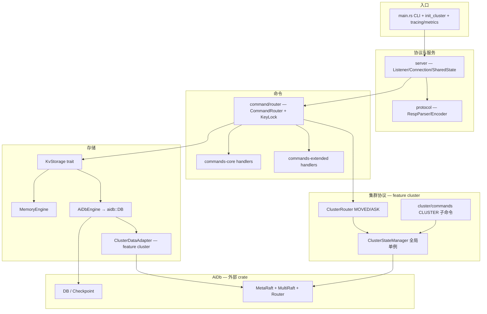
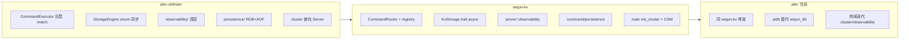
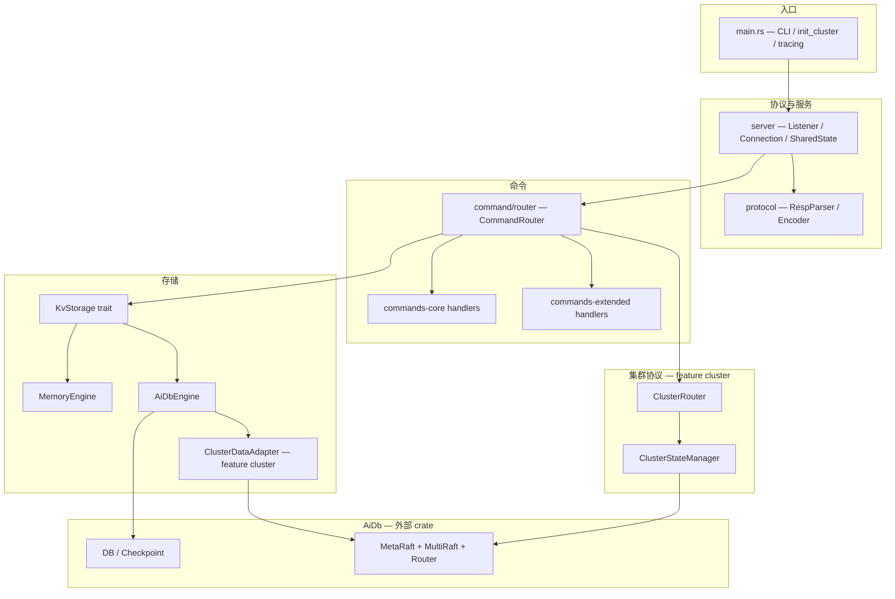
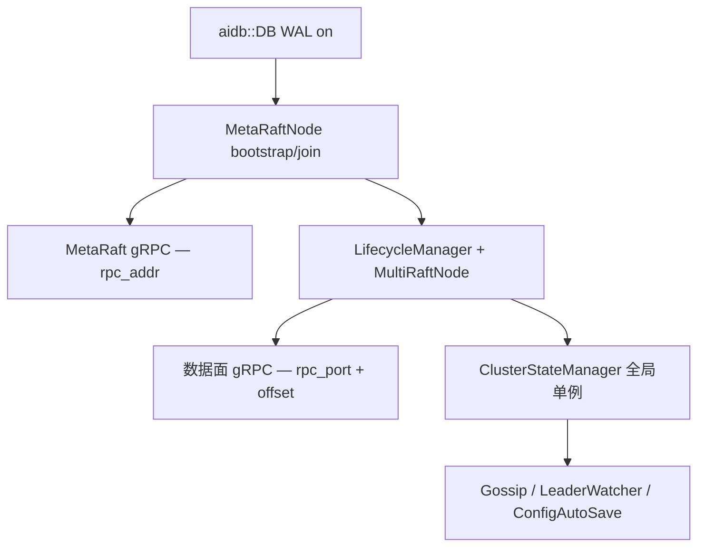

# Cursor transcript

---

## 1. User

## 文档整理 — 新会话

工作目录: `<workspace>` (含 aidb/、aikv/、aifactory/)

请先阅读 (不要跳过):
1. `AiKv-Workflow/backup/design.md` — 总规程
2. `AiKv-Workflow/backup/PROGRESS.md` — 当前进度
3. `AiKv-Workflow/backup/INDEX.md` — 本章索引 (若已有行则更新)

---

### 本次任务

| 项 | 值 |
|----|-----|
| PROGRESS 总步 | 19 (阶段 2b 第 1 篇, **aikv 汇总开篇**) |
| 目标文件 | `aikv/ARCHITECTURE.md` |
| 本次子步 | 从步 0 开始 |
| 对比深度 | **模块级** (汇总文档; 从 7 篇 modules 提炼, 不加深章逐段) |

### 必须遵守

- **确认门控**: 步 0→1→2→3→4, 每步先讨论, 我确认后再下一步
- **步 4**: 先出 **正文草稿**, 我确认后再写入 `aikv/`、更新 INDEX/PROGRESS
- **汇总文档**: **不必** Module Skill frontmatter
- **过程只进 backup/**: INDEX; aikv 不写迁移历史
- **旧文档顺序**: `backup/aikv/` → `aikv-oldmain` (`docs/guide/`, `docs/development/`) → WiQunTools 查漏 → `wiqun-kv`
- **待核实**: 根文档至多简要提及; 详情仍引用 `aikv/ISSUES.md` (不展开排查过程)
- **步 4 落盘前**: 对照 design.md 验收项 — 与 7 篇 modules 一致、链有效; **含与 aidb 的分工边界**; 不重复 module 正文

### 上下文 (上一阶段已完成)

- **阶段 2a aidb 汇总** 步 13–18 ✅ (可参考 [`aidb/ARCHITECTURE.md`](aidb/ARCHITECTURE.md) 写法与篇幅)
- **阶段 1 aikv modules** 7 篇全部 ✅ (`docs/modules/*.md`, 含 `observability-reference.md`)
- 当前 `aikv/` 根目录 **尚无** `ARCHITECTURE.md` (旧稿在 `AiKv-Workflow/backup/aikv/ARCHITECTURE.md`)
- 仅有 `AGENTS.md`, `CLAUDE.md`, `ISSUES.md` (ISSUE-001~023)
- 本会话归档参考 (aidb 同类): [`aidb/archive/13-architecture.md`](aidb/archive/13-architecture.md)

### 边界提示 (步 0 可细化)

**ARCHITECTURE.md** — 回答「aikv 是什么、怎么分层、数据怎么走、与 AiDb 边界」:

- 宜含: 产品定位 (Redis RESP 服务); 分层图 (protocol → server → command → storage → cluster); 与 **AiDb** 边界表; 数据流 (客户端 → aikv → aidb); 链到 7 篇 modules (WHEN 或域名, 不摘抄)
- 不重复: modules 代码地图 / 命令表; DESIGN 的 why; DEPLOYMENT 构建运维; AGENTS CI 细节
- 旧稿: `backup/aikv/ARCHITECTURE.md` 目录树可能过时 (如独立 `persistence/`、`script/` 路径); 以 **当前 `aikv/src/`** 为准

**与相邻文档分工**

| 文档 | 回答 |
|------|------|
| [`AGENTS.md`](aikv/AGENTS.md) | AI 入口; 已有简要分层与数据流 |
| **ARCHITECTURE.md (本篇)** | 系统架构总审; modules 之上 |
| 日后 `DESIGN.md` (步 20) | 跨模块设计决策 |
| `docs/modules/*.md` | 域级 Skill 正文 |

### 本次不要

- 不要跳过未确认的步骤
- 不要一步写步 20+ 或其它 aikv 根文档
- 不要修改 `design.md` / 流程, 除非我明确要求
- 不要 commit, 除非我明确要求

---

请从步 0 开始, 给出本步交付物, 等我确认。

---

## 2. Assistant

先阅读规程、进度与索引，并对照 aidb 汇总稿与 aikv 模块文档，准备步 0 交付物。

**Tool `Read`**

```json
{
  "path": "../../../AiKv-Workflow/backup/design.md"
}
```


**Tool `Read`**

```json
{
  "path": "../../../AiKv-Workflow/backup/PROGRESS.md"
}
```


**Tool `Read`**

```json
{
  "path": "../../../AiKv-Workflow/backup/INDEX.md"
}
```


**Tool `Read`**

```json
{
  "path": "../../../aidb/ARCHITECTURE.md",
  "limit": 120
}
```


**Tool `Glob`**

```json
{
  "glob_pattern": "aikv/docs/modules/*.md"
}
```


---

## 3. Assistant

**Tool `Glob`**

```json
{
  "glob_pattern": "aikv/src/**/*"
}
```


**Tool `Read`**

```json
{
  "path": "../../AGENTS.md",
  "limit": 80
}
```


**Tool `Read`**

```json
{
  "path": "../../../AiKv-Workflow/backup/aikv/ARCHITECTURE.md",
  "limit": 100
}
```


**Tool `Read`**

```json
{
  "path": "../../../aidb/archive/13-architecture.md",
  "limit": 120
}
```


---

## 4. Assistant

**Tool `Read`**

```json
{
  "offset": 120,
  "path": "../../../aidb/ARCHITECTURE.md"
}
```


**Tool `Read`**

```json
{
  "path": "../../src/lib.rs"
}
```


**Tool `Read`**

```json
{
  "limit": 50,
  "path": "../../src/main.rs"
}
```


**Tool `Grep`**

```json
{
  "pattern": "^---\n|^name:|^description:",
  "glob": "aikv/docs/modules/*.md",
  "head_limit": 30
}
```


---

## 5. Assistant

**Tool `Read`**

```json
{
  "limit": 15,
  "path": "../../docs/modules/protocol.md"
}
```


**Tool `Read`**

```json
{
  "limit": 15,
  "path": "../../docs/modules/server.md"
}
```


**Tool `Read`**

```json
{
  "limit": 15,
  "path": "../../docs/modules/storage.md"
}
```


**Tool `Read`**

```json
{
  "limit": 15,
  "path": "../../docs/modules/commands-core.md"
}
```


**Tool `Read`**

```json
{
  "limit": 15,
  "path": "../../docs/modules/commands-extended.md"
}
```


**Tool `Read`**

```json
{
  "limit": 15,
  "path": "../../docs/modules/cluster.md"
}
```


**Tool `Read`**

```json
{
  "limit": 15,
  "path": "../../docs/modules/observability.md"
}
```


**Tool `Glob`**

```json
{
  "glob_pattern": "aikv/ARCHITECTURE.md"
}
```


---

## 6. Assistant

**Tool `Read`**

```json
{
  "path": "../../src/server/mod.rs"
}
```


**Tool `Grep`**

```json
{
  "pattern": "^\\[features\\]",
  "path": "../../Cargo.toml",
  "-A": 20
}
```


**Tool `Read`**

```json
{
  "offset": 76,
  "limit": 40,
  "path": "../../AGENTS.md"
}
```


---

## 7. Assistant

## 步 0 — 定范围 (PROGRESS 步 19 · `aikv/ARCHITECTURE.md`)

对照 `design.md` 步 0: 本章为**汇总文档**, 覆盖 aikv 全库架构全景, 深度**模块级** (从 7 篇 modules 提炼, 不逐段展开). 以下为交付物, **尚未写入** `aikv/`、`INDEX.md` 或 `PROGRESS.md`.

---

### 1. 本章定位

| 项 | 说明 |
|----|------|
| 文档类型 | 根目录汇总 (无 Module Skill frontmatter) |
| 读者 | 新人 / 与 AiDb 协作方 / 跨模块改动前的鸟瞰 |
| 信息源 | 当前 `aikv/src/` + 7 篇 `docs/modules/*.md`; 旧稿 `backup/aikv/ARCHITECTURE.md` 仅结构参考 (**目录树已过时**) |
| 参照范本 | 已完成 [`aidb/ARCHITECTURE.md`](aidb/ARCHITECTURE.md) (篇幅、分层图、边界表、模块导航、数据流粒度) |
| 与 `AGENTS.md` | AGENTS = AI 入口 + CI + 简要分层; ARCHITECTURE = 系统总审 + 与 AiDb 边界表 + 完整数据流 |
| 与 `DESIGN.md` (步 20) | 本篇只**点到**设计取向; trade-off 与决策表留给 DESIGN |

---

### 2. 本章边界 (含 / 不含)

**宜含**

- 产品定位: **Redis RESP 兼容 KV 服务** (bin + lib), async Tokio
- 系统分层: `protocol` → `server` → `command` → `storage` → `cluster` (feature) → **AiDb**
- **与 AiDb 分工边界表** (形态、存储、集群、持久化、指标 — 与 aidb ARCHITECTURE 互链)
- **Mermaid** 分层图 + **数据流总览** (单机命令路径、集群初始化、集群路由 — 各 1 段, 不展开命令表)
- **目录树** (`src/` 按 domain 聚合, directory-tree 规范; 以当前源码为准)
- **模块导航表**: 7 篇 module ↔ `src/` ↔ WHEN (链到 `docs/modules/*.md`, 不摘抄)
- **Cargo feature**: `cluster`, `monitoring` (及与 `aidb/cluster`, `aidb/monitoring` 的传递关系)
- **代码入口**: `main.rs`, `lib.rs`, `server/listener.rs`, `command/router.rs`, `storage/mod.rs`, `cluster/mod.rs` (feature)
- **待核实**: 至多一行/条指向 [`ISSUES.md`](aikv/ISSUES.md), 不展开

**不宜含** (链到 modules 或其它根文档)

| 主题 | 去向 |
|------|------|
| RESP 帧语法 / parser limits | [protocol.md](aikv/docs/modules/protocol.md) |
| TCP 循环 / HELLO / ATOM 事务 | [server.md](aikv/docs/modules/server.md) |
| `KvStorage` / `StoredValue` / AiDbEngine | [storage.md](aikv/docs/modules/storage.md) |
| String~ZSet / Router / KeyLock | [commands-core.md](aikv/docs/modules/commands-core.md) |
| JSON/Lua/SAVE/INFO/CONFIG/MIGRATE | [commands-extended.md](aikv/docs/modules/commands-extended.md) |
| MOVED/ASK / CLUSTER 子命令 | [cluster.md](aikv/docs/modules/cluster.md) |
| slowlog/latency/INFO/metrics | [observability.md](aikv/docs/modules/observability.md) |
| WAL/MemTable/Raft/slot 状态机 | [aidb docs/modules/](aidb/docs/modules/) |
| 设计决策 trade-off | 步 20 `DESIGN.md` |
| 构建/运维/CI | `DEPLOYMENT.md` / `CONTRIBUTING.md` / `AGENTS.md` |

---

### 3. 覆盖 `src/` 与 modules 对应 (本章汇总范围)

汇总文档**不新增** domain, 与 `design.md` modules↔src 表一致:

| Module 文档 | 覆盖 `src/` | 本章仅提炼 |
|-------------|-------------|------------|
| [protocol.md](aikv/docs/modules/protocol.md) | `protocol/{types,parser,encoder}` | 协议层在栈中的位置; 与 server 衔接点 |
| [server.md](aikv/docs/modules/server.md) | `server/{config,listener,connection}` + observability 子模块见下 | 请求循环骨架; 与 Router 分发边界 |
| [storage.md](aikv/docs/modules/storage.md) | `storage/{mod,types,memory,adapter,aidb,cluster_adapter,dump,observation}` | `KvStorage` 抽象; memory vs aidb; 委托 AiDb 的边界 |
| [commands-core.md](aikv/docs/modules/commands-core.md) | `command/{string,hash,list,set,zset,key,database,registry,router,scan_util}` | 命令层职责; Router 为中枢 (不列命令表) |
| [commands-extended.md](aikv/docs/modules/commands-extended.md) | `command/{json,jsonpath,script,blocking,migrate,persistence,server}` | 扩展命令域划分 (JSON/Lua/持久化/admin 在 `command/` 下, **非** 独立 `persistence/`、`script/` 目录) |
| [cluster.md](aikv/docs/modules/cluster.md) | `cluster/*`, `command/router.rs` 的 `cluster_route` | Redis Cluster 协议在 aikv; 共识在 aidb |
| [observability.md](aikv/docs/modules/observability.md) | `server/{slowlog,latency,info,metrics,metrics_server,process_metrics}`, `storage/observation` | HTTP `/metrics` 在 aikv; `aidb_*` 经 `register_into` |

**横切**: `error.rs`, `main.rs` (CLI + `init_cluster` + 引擎/监控装配) — 在入口与 feature 节说明, 不单开 module.

**旧稿需丢弃的结构** (`backup/aikv/ARCHITECTURE.md`):

- 独立 `persistence/`、`script/`、`metrics.rs` 根模块
- `protocol/value.rs`, `storage/value.rs`, `memory_engine.rs`, `command/cluster_commands.rs` 等路径/命名

以当前 `aikv/src/` (60 个 `.rs` 文件) 为准.

---

### 4. 拟读文件列表 (步 1–4)

**步 1 — 新代码 (主)**

| 类别 | 路径 |
|------|------|
| 入口 | `aikv/src/main.rs`, `lib.rs`, `error.rs` |
| 分层入口 | `protocol/mod.rs`, `server/{mod,listener,connection}.rs`, `command/{mod,router}.rs`, `storage/mod.rs` |
| 集群 | `cluster/mod.rs`, `main.rs` 中 `init_cluster` (feature) |
| 构建 | `aikv/Cargo.toml` (features, aidb path) |

**步 1 — 提炼源 (7 篇 modules, 不重复正文)**

- `aikv/docs/modules/{protocol,server,storage,commands-core,commands-extended,cluster,observability}.md`
- 必要时 `observability-reference.md` 仅查漏, 不进 ARCHITECTURE 正文

**步 2 — 旧文档 (按 design 顺序)**

1. `AiKv-Workflow/backup/aikv/ARCHITECTURE.md` (主, 结构参考; 目录树过时)
2. `backup/aikv/{DESIGN,README,CHANGELOG}.md` (边界/分工查漏)
3. `aikv-oldmain/docs/guide/`, `docs/development/` (尤其 `architecture/01-overview` 等)
4. WiQunTools `wiqun-kv-inventory` 对应段 (查漏)
5. `wiqun-kv` (与 2–3 重叠时二选一)

**步 2 — 邻接文档 (边界对齐, 非旧稿)**

- [`aidb/ARCHITECTURE.md`](aidb/ARCHITECTURE.md) §与 AiKv 嵌入关系 (本篇写**镜像边界表**, 避免重复 aidb 侧细节)
- [`aikv/AGENTS.md`](aikv/AGENTS.md) (避免与 AI 入口重复)

**步 3 — 对比深度: 模块级**

- 旧路径 → 新路径 (如 `CommandExecutor` → `CommandRouter`, 命令/脚本/持久化并入 `command/`)
- 分层与主流程是否仍等价; **不**对 `storage/`、`cluster/` 做关键文件逐段 (那是阶段 1 已完成的事)

**步 4 — 验收自检 (落盘前)**

- 与 7 篇 modules 一致、链有效
- 含 **AiDb 分工边界表**
- 不重复 module 代码地图/命令表
- 待核实仅引用 `ISSUES.md` (ISSUE-001~023 中架构相关项按需一行, 如 storage TTL、cluster failover 等 — 步 2 再定)

---

### 5. 拟写入 INDEX 的本章行 (确认步 4 后更新)

| 新文档章节 | 状态 | 参考的旧文档 | 处理 | 备注 |
|------------|------|--------------|------|------|
| `ARCHITECTURE.md` (总审) | 待开始 → 🔄 | `backup/aikv/ARCHITECTURE.md`; oldmain `docs/guide/`, `docs/development/architecture/`; WiQunTools wiqun-kv-inventory 查漏; wiqun-kv 重复跳过 | 步 4 后写 `aikv/ARCHITECTURE.md` | 模块级汇总; 含 AiDb 边界; ISSUES 根文档一行 |

---

### 6. 与 aidb 步 13 的对齐预期

| 维度 | aidb ARCHITECTURE (已完成) | 本篇 aikv ARCHITECTURE (拟) |
|------|---------------------------|----------------------------|
| 篇幅 | ~200 行 | 相近 (~180–220 行) |
| 章节骨架 | 定位边界 → 分层图 → 目录树 → 模块导航 → feature → 入口 → 数据流 → 嵌入关系 → 设计摘要 → 进一步阅读 | 同构; **嵌入关系**改为「与 AiDb 边界表」(更详 than aidb 侧一笔带过) |
| 数据流 | 写/读/compaction/集群/备份/可观测 | 命令执行 / 集群启动 / 集群路由 (+ 可选 persistence 委托 aidb 一句) |
| Mermaid | flowchart TB + LR | 至少 1 个分层 TB + 1–2 个数据流 |

---

请确认步 0: **范围与边界**、**7 篇 modules 覆盖表**、**拟读文件列表**、**INDEX 拟更新行** 是否 OK. 回复「可以」或具体调整意见后, 我再进入**步 1** (读新代码, 输出职责/主流程要点).

---

## 8. User

可以

---

## 9. Assistant

步 0 已确认，开始步 1：以当前 `aikv/src/` 为准梳理职责与主流程。

**Tool `Read`**

```json
{
  "path": "../../src/main.rs",
  "offset": 50,
  "limit": 200
}
```


**Tool `Read`**

```json
{
  "path": "../../src/command/router.rs",
  "limit": 120
}
```


**Tool `Read`**

```json
{
  "path": "../../src/storage/mod.rs"
}
```


**Tool `Read`**

```json
{
  "path": "../../src/cluster/mod.rs"
}
```


**Tool `Read`**

```json
{
  "path": "../../src/server/listener.rs",
  "limit": 80
}
```


**Tool `Read`**

```json
{
  "path": "../../src/server/connection.rs",
  "limit": 100
}
```


---

## 10. Assistant

**Tool `Read`**

```json
{
  "limit": 200,
  "offset": 248,
  "path": "../../src/main.rs"
}
```


**Tool `Read`**

```json
{
  "limit": 80,
  "path": "../../src/cluster/router.rs"
}
```


**Tool `Read`**

```json
{
  "limit": 80,
  "path": "../../src/storage/types.rs"
}
```


**Tool `Read`**

```json
{
  "limit": 60,
  "path": "../../src/command/mod.rs"
}
```


**Tool `Read`**

```json
{
  "limit": 80,
  "offset": 550,
  "path": "../../src/main.rs"
}
```


---

## 11. Assistant

**Tool `Read`**

```json
{
  "limit": 80,
  "offset": 625,
  "path": "../../src/main.rs"
}
```


**Tool `Grep`**

```json
{
  "pattern": "cluster_route|execute_with",
  "path": "../../src/command/router.rs",
  "head_limit": 25
}
```


**Tool `Read`**

```json
{
  "limit": 60,
  "path": "../../src/storage/aidb.rs"
}
```


**Tool `Read`**

```json
{
  "limit": 50,
  "path": "../../src/storage/cluster_adapter.rs"
}
```


**Tool `Read`**

```json
{
  "limit": 40,
  "path": "../../src/protocol/mod.rs"
}
```


---

## 12. Assistant

**Tool `Read`**

```json
{
  "limit": 80,
  "path": "../../src/server/config.rs"
}
```


**Tool `Read`**

```json
{
  "limit": 80,
  "offset": 165,
  "path": "../../src/command/router.rs"
}
```


**Tool `Read`**

```json
{
  "limit": 50,
  "offset": 440,
  "path": "../../src/main.rs"
}
```


---

## 13. Assistant

## 步 1 — 读新代码 (PROGRESS 步 19 · `aikv/ARCHITECTURE.md`)

以当前 `aikv/src/` + 7 篇 modules 为准梳理. 以下为交付物, **尚未写入** 任何仓库文件.

---

### 1. 产品形态 (源码确认)

| 项 | 结论 |
|----|------|
| Crate | **bin + lib** (`main.rs` 启动; `lib.rs` 导出 `command/protocol/server/storage`, feature `cluster` 时导出 `cluster`) |
| 对外 | Redis RESP2/3 TCP 服务, 标准数组命令 (不支持 telnet 内联) |
| 对内 | **不实现** LSM/Raft; 委托 `aidb` (`path = "../aidb"`, cluster 时 `aidb/cluster`) |
| 运行时 | Tokio async; 存储 I/O 经 `spawn_blocking` (AiDbEngine) |
| 引擎 | `MemoryEngine` (内存, 无持久化) / `AiDbEngine` (WAL+LSM); cluster 生产推荐 `--engine aidb` |
| 开发默认 | CI 以 `--features cluster` 为主; `monitoring` 独立 feature |

---

### 2. 系统分层 (依赖方向)



**横切**: `error.rs` (统一 `Error`/`Result`); observability 数据结构在 `server/{slowlog,latency,info,metrics*}`, 计数桥在 `storage/observation`.

---

### 3. 代码地图 (域级, 非逐文件)

| 域 | `src/` | 职责 | 关键入口 |
|----|--------|------|----------|
| **protocol** | `protocol/{types,parser,encoder}` | RESP2/3 编解码, 解析限制, pipeline buffer | `RespParser::feed/parse`, `RespValue` |
| **server** | `server/{config,listener,connection}` + observability 子模块 | TCP accept, 单连接读写循环, HELLO 协商, 内联命令, ATOM 事务, `ServerSharedState` 装配 | `Server::run`, `Connection::handle/run` |
| **command** | `command/{string~zset,key,database,registry,router,scan_util}` + extended 子域 | Redis 命令实现; `CommandRouter` 统一 dispatch + `KeyLock` | `CommandRouter::execute_with_client`, `registry::lookup` |
| **storage** | `storage/{types,memory,adapter,aidb,cluster_adapter,dump,observation}` | `KvStorage` 抽象; `{db}:{key}` 编码; memory/aidb 引擎; cluster 写走 Raft | `KvStorage` trait, `AiDbEngine::open`, `ClusterDataAdapter` |
| **cluster** | `cluster/{state,router,connection,commands,gossip,forward,replication,announce,config_auto_save}` | Redis Cluster 协议; MOVED/ASK; CLUSTER 子命令; 与 aidb 控制/数据面 wiring | `ClusterRouter::decide`, `CLUSTER_STATE_MGR`, `main::init_cluster` |
| **入口** | `main.rs`, `lib.rs` | CLI, 存储构建, 集群/bootstrap, metrics HTTP, 启动 TCP | `build_storage`, `init_cluster`, `main` |

**与旧稿差异 (步 3 会展开, 此处先记)**:

- JSON/Lua/持久化/MIGRATE 均在 `command/` 下, **无** 顶层 `persistence/`、`script/`
- observability **无** 根级 `metrics.rs`; 在 `server/` + `storage/observation`
- cluster 命令在 `cluster/commands.rs`, 路由 hook 在 `command/router.rs::cluster_route`

---

### 4. 主流程要点

#### 4.1 进程启动 (`main.rs`)

1. `init_logging()` — tracing; `monitoring` 时可选 OTel (`AIKV_OTLP_ENDPOINT`)
2. `build_storage()` — `MemoryEngine` 或 `AiDbEngine`; cluster+aidb 时 **`ClusterDataAdapter` 包裹** → `KvStorageAdapter` + `StorageObservation`
3. `ServerSharedState::new_with_backup_dir()` — 持有 `Arc<dyn KvStorage>`, metrics/slowlog/latency, 懒初始化 `CommandRouter`
4. **[cluster]** 若 `--cluster-node-id` + `--cluster-rpc-addr` → **`init_cluster()` 同步 await** (确保 `CLUSTER_STATE_MGR` 就绪后再 accept)
5. **[monitoring]** spawn `MetricsServer` (`/metrics`) + 后台刷新 runtime/process 指标; `aidb::metrics::register_into`
6. `Server::run(bind, state)` — 阻塞 accept 循环

#### 4.2 单机命令路径

```text
TcpListener.accept
  → Connection::handle (per-connection task)
  → read loop: RespParser feed/parse (pipeline)
  → 内联命令? (PING/ECHO/HELLO/QUIT/READONLY/ASKING/…) → 直接回复
  → ATOM 事务? (MULTI/EXEC/WATCH) → connection 层排队/冲突检测
  → CommandRouter::execute_with_client
       [cluster] cluster_route → MOVED/ASK/CROSSSLOT/CLUSTERDOWN 或继续
       → execute_inner → 各 *Commands handler
       → KvStorage (get/set/scan/…)
  → adapt_for_protocol (RESP3 null 线格式门控)
  → write RESP; metrics + slowlog/latency 采样
```

#### 4.3 集群初始化 (`init_cluster`, ~18 步)

| 阶段 | 动作 |
|------|------|
| 数据 | 复用/打开 `aidb::DB` (WAL 必须) |
| 控制面 | `MetaRaftNode` bootstrap 或 join peers; 共享 `RaftServiceDispatcher` |
| gRPC | MetaRaft 在 `cluster_rpc_addr`; MultiRaft 在 `rpc_port + data_port_offset` (默认 +10000) |
| 数据面 | `LifecycleManager` + `MultiRaftNode::start_lifecycle_with_data` 自动建/毁 group |
| 协议层 | `ClusterStateManager` 全局单例 + `MembershipCoordinator` + `SlotMigrationManager` |
| 辅助 | `GossipState` 刷新 CLUSTER NODES 展示; `LeaderChangeWatcher` 同步 leader 缓存; `ConfigAutoSave` |
| 客户端地址 | `AIKV_CLIENT_ADDR` 或推导; 后台 `spawn_client_addr_sync` 写 MetaRaft |

**分工**: MetaRaft/MultiRaft/Router/slot 迁移状态机在 **aidb**; aikv 负责启动 wiring + Redis 语义 (MOVED/ASK/CLUSTER).

#### 4.4 集群命令路由

- **前置**: `CommandRouter::cluster_route` — admin 命令 bypass; 多 key 检查 CROSSSLOT
- **决策**: `ClusterRouter::decide(key, Read|Write|Admin, asking, readonly)` — 读 `CLUSTER_STATE_MGR` + aidb `Router` 缓存
- **结果**: `Execute` / `-MOVED` / `-ASK` / `-CLUSTERDOWN`
- **数据写**: 本地 leader slot → `ClusterDataAdapter` → `propose_group` → aidb Raft apply

#### 4.5 持久化边界

- **memory**: 无 checkpoint; `SAVE/BGSAVE` 受引擎限制
- **aidb**: `AiDbEngine` + `command/persistence` → `flush` / `Checkpoint::create` (委托 aidb)
- 标准 RDB `dump.rdb` **未** 作为持久化主路径 (见 AGENTS 已知限制)

---

### 5. 与 AiDb 边界 (步 4 正文核心表, 此处先列事实)

| 维度 | AiKv | AiDb |
|------|------|------|
| 形态 | 网络服务 (async) | 嵌入式 lib (sync API) |
| 协议 | RESP, Redis 命令语义 | 无网络层 |
| 类型编码 | `StoredValue` / `ValueType` → 扁平 key | 字节 KV + tombstone |
| 单机存储 | `MemoryEngine` 或 `AiDbEngine` | `DB::put/get/...` |
| 集群客户端协议 | MOVED/ASK, CLUSTER *, ASKING/READONLY | — |
| 共识 / slot | 启动与 glue (`init_cluster`, `ClusterStateManager`) | MetaRaft, MultiRaft, Router, slot 迁移 |
| 数据面写 | `ClusterDataAdapter::propose_group` | `OpenRaftNode` + `ShardedStorage` |
| 备份 | `BGSAVE` 命令 → Checkpoint | `Checkpoint::create` |
| 指标 | HTTP `/metrics`, `aikv_*` | `aidb_*`, `register_into` |

---

### 6. Feature 与构建

| Feature | 启用内容 | 依赖 |
|---------|----------|------|
| (default) | 单机 protocol/server/command/storage | — |
| `cluster` | `cluster/*`, `storage/cluster_adapter`, `main::init_cluster`, router `cluster_route` | `aidb/cluster` |
| `monitoring` | `metrics_server`, OTel, Prometheus | `aidb/monitoring` + hyper 等 |

---

### 7. 关键入口文件 (ARCHITECTURE 宜列)

| 能力 | 入口 |
|------|------|
| 进程启动 | `main.rs` |
| 库导出 | `lib.rs` |
| TCP 服务 | `server/listener.rs` — `Server::run` |
| 连接循环 | `server/connection.rs` — `Connection::handle` |
| 命令分发 | `command/router.rs` — `CommandRouter::execute_with_client` |
| 存储抽象 | `storage/types.rs` — `KvStorage`; `storage/mod.rs` |
| AiDb 适配 | `storage/aidb.rs` — `AiDbEngine::open` |
| 集群数据写 | `storage/cluster_adapter.rs` — `ClusterDataAdapter` |
| 集群路由 | `cluster/router.rs` — `ClusterRouter::decide` |
| 集群状态 | `cluster/state.rs` — `ClusterStateManager`, `CLUSTER_STATE_MGR` |
| 集群启动 | `main.rs` — `init_cluster` |
| 指标 HTTP | `server/metrics_server.rs` (feature `monitoring`) |

---

### 8. 与 7 篇 modules 对齐检查

| Module | 步 1 结论 |
|--------|-----------|
| protocol | ✅ `types/parser/encoder` 三分; 与 server 边界 (HELLO/null 线在 connection) 一致 |
| server | ✅ Listener/Connection/SharedState; observability 子模块同目录 |
| storage | ✅ trait + memory/aidb + cluster_adapter; key 编码 `{db}:{user_key}` |
| commands-core | ✅ Router 聚合 string~database + registry; KeyLock 在 router |
| commands-extended | ✅ json/script/blocking/migrate/persistence/server 均在 `command/` |
| cluster | ✅ 协议层在 aikv; Raft 在 aidb; `cluster_route` 在 router |
| observability | ✅ slowlog/latency/info/metrics 在 server; observation 桥 storage |

未发现 modules 与 `src/` 结构性冲突 (旧稿目录树问题已在步 0 标记).

---

### 9. 步 4 架构文建议章节 (基于步 1, 供后续对齐)

1. 定位与边界 (含 **AiDb 分工表**)
2. 系统分层 (Mermaid TB)
3. 目录结构 (`src/` domain 树)
4. 模块导航 (7 篇 WHEN 链)
5. Feature 边界
6. 代码入口表
7. 数据流总览 (启动 / 命令 / 集群 init / 集群路由 — 各一段 Mermaid 或 text)
8. 设计取向摘要 (1 段, 详述留步 20 DESIGN)
9. 进一步阅读 + 待核实 (ISSUES 一行)

篇幅目标: 对齐 [`aidb/ARCHITECTURE.md`](aidb/ARCHITECTURE.md) (~200 行).

---

请确认步 1: **分层/代码地图/主流程** 是否与你的理解一致. 回复「可以」或调整意见后, 我再进入**步 2** (按序查旧文档, 输出旧文档清单 + 分类结论).

---

## 14. User

可以

---

## 15. Assistant

步 1 已确认，开始步 2：按规程顺序查阅旧文档并分类。

**Tool `Glob`**

```json
{
  "glob_pattern": "AiKv-Workflow/backup/aikv/**/*.md"
}
```


**Tool `Glob`**

```json
{
  "glob_pattern": "aikv-oldmain/docs/**/*.md"
}
```


**Tool `Glob`**

```json
{
  "glob_pattern": "wiqun-kv/**/*.md"
}
```


**Tool `Glob`**

```json
{
  "glob_pattern": "WiQunTools/docs/wiqun-kv-inventory/**"
}
```


---

## 16. Assistant

**Tool `Read`**

```json
{
  "offset": 100,
  "path": "../../../AiKv-Workflow/backup/aikv/ARCHITECTURE.md"
}
```


**Tool `Read`**

```json
{
  "limit": 80,
  "path": "../../../AiKv-Workflow/backup/aikv/DESIGN.md"
}
```


**Tool `Read`**

```json
{
  "limit": 80,
  "path": "../../../AiKv-Workflow/backup/aikv/README.md"
}
```


**Tool `Read`**

```json
{
  "path": "../../../aikv-oldmain/docs/development/architecture/01-overview.md"
}
```


**Tool `Read`**

```json
{
  "limit": 80,
  "path": "../../../aikv-oldmain/docs/development/architecture/03-cluster.md"
}
```


**Tool `Read`**

```json
{
  "limit": 100,
  "path": "../../../wiqun-kv/ARCHITECTURE.md"
}
```


---

## 17. Assistant

**Tool `Grep`**

```json
{
  "path": "../../ISSUES.md",
  "pattern": "^## ISSUE-"
}
```


**Tool `Read`**

```json
{
  "limit": 40,
  "path": "../../../aikv-oldmain/docs/index.md"
}
```


**Tool `Read`**

```json
{
  "limit": 50,
  "path": "../../../WiQunTools/docs/wiqun-kv-inventory/07-cluster-protocol.md"
}
```


**Tool `Read`**

```json
{
  "limit": 40,
  "path": "../../../AiKv-Workflow/backup/aikv/DEPLOYMENT.md"
}
```


---

## 18. Assistant

**Tool `Read`**

```json
{
  "limit": 80,
  "path": "../../ISSUES.md"
}
```


**Tool `Glob`**

```json
{
  "glob_pattern": "aikv-oldmain/docs/development/architecture/03-cluster.md"
}
```


**Tool `Read`**

```json
{
  "limit": 60,
  "path": "../../../aikv-oldmain/docs/development/architecture/02-refactoring.md"
}
```


---

## 19. Assistant

**Tool `Grep`**

```json
{
  "path": "../../../aidb/archive/13-architecture.md",
  "pattern": "步 2",
  "-A": 80
}
```


---

## 20. Assistant

## 步 2 — 查旧文档 (交付物)

按 `design.md` 顺序查阅完毕. **未写入** `aikv/`、`INDEX.md`、`PROGRESS.md`、`ISSUES.md`.

---

### 1. 旧文档清单与分类

| # | 路径 | 分类 | 对 ARCHITECTURE 的用途 |
|---|------|------|------------------------|
| **1** | `backup/aikv/ARCHITECTURE.md` | **仍有效 (数据流骨架)** + **过时 (目录树/部分路径)** | 主参考: 命令/集群 init/集群路由/Lua 四段数据流; **勿**照搬 `src/` 树 |
| **1b** | `backup/aikv/README.md` | **部分有效** | Mermaid 分层 (Client→Router→Storage) 可借鉴; 特性表/CLI (`--port`) 过时 → 步 22 README |
| **1c** | `backup/aikv/DESIGN.md` | **仍有效 (内容)** | 决策 rationale 留给 **步 20 DESIGN**; 本篇至多 2–3 句 + 链接 |
| **1d** | `backup/aikv/DEPLOYMENT.md` | **不适用本篇** | 步 21; `--port`/`--bind` 等与现 CLI 不一致 |
| **1e** | `backup/aikv/CHANGELOG.md` | **查漏** | 版本叙事; 不进 ARCHITECTURE |
| **1f** | `backup/aikv/docs/superpowers/{specs,plans}/*` | **历史设计** | cluster announce、MetaRaft barrier、failover 等 — 概念已在 modules; ARCHITECTURE 不展开 |
| **2a** | `aikv-oldmain/docs/development/architecture/01-overview.md` | **仍有效 (宏观分层)** + **大量过时** | ASCII 五层图、MetaRaft 非 gossip 概念可用; trait/API/模块路径/性能数字/设计模式长文 **跳过** |
| **2b** | `aikv-oldmain/docs/development/architecture/02-refactoring.md` | **已过时 (历史)** | 存储层重构 **已完成** (`KvStorage` + 命令层分离); 仅作迁移背景, 不写 ARCHITECTURE |
| **2c** | `aikv-oldmain/docs/development/architecture/03-cluster.md` | **不适用 (运维)** | 实为集群初始化排障/aikv-tool, 非架构总览; 步 21 DEPLOYMENT 可参考 |
| **2d** | `aikv-oldmain/docs/development/architecture/04-storage.md` | **已归档** | INDEX 已记 legacy RDB/AOF → `backup/archive/` |
| **2e** | `aikv-oldmain/docs/development/architecture/05-lua-scripting.md` | **不适用本篇** | Lua 细节 → `commands-extended.md` |
| **2f** | `aikv-oldmain/docs/development/api/*` | **不适用** | 命令/API 参考, 非架构 |
| **2g** | `aikv-oldmain/docs/guide/*` | **不适用** | 用户指南 → README/DEPLOYMENT |
| **2h** | `aikv-oldmain/docs/archive/*` | **已过时** | 版本迁移/对比记录 — **跳过** |
| **2i** | `aikv-oldmain/docs/index.md` | **索引过时** | 文档结构参考; 路径/描述与现仓库不符 |
| **3** | WiQunTools `wiqun-kv-inventory/01–08` | **查漏, 不迁入** | 01 RESP、02 storage、07 cluster 协议分工与现 modules **一致**; 08 observability 已知 ISSUE-020~023 |
| **3b** | WiQunTools `wiqun-kv-inventory/07-cluster-protocol.md` | **仍有效 (概念)** + **命名过时** | Kv 适配层 vs Db Raft 分工叙事正确; `WiQunDb`/`wiqun_db` → 现 `aidb` |
| **4** | `wiqun-kv/ARCHITECTURE.md` | **与 backup/aikv 几乎相同** | 二选一; **以 backup/aikv 为主**, wiqun-kv 不另读 |

**邻接 (非旧稿, 边界对齐)**:

| 路径 | 用途 |
|------|------|
| [`aidb/ARCHITECTURE.md`](aidb/ARCHITECTURE.md) §与 AiKv 嵌入关系 | 本篇写**镜像边界表**, 避免重复 aidb 侧 LSM/Raft 细节 |
| [`aikv/AGENTS.md`](aikv/AGENTS.md) | 避免重复 CI/AI 入口; 分层一句即可互链 |

---

### 2. 仍有效 → 步 4 宜保留/提炼

| 主题 | 来源 | 新稿写法 |
|------|------|----------|
| Redis RESP 服务 + Tokio async | 三处一致 | 定位节 |
| 分层: protocol → server → command → storage → cluster → aidb | backup 数据流 + oldmain §系统架构 | Mermaid TB + 目录树 |
| `KvStorage` trait 双引擎 (memory / aidb) | backup + DESIGN + 步 1 | 存储层 1 段; 链 storage.md |
| `spawn_blocking` 包装同步 AiDb | backup DESIGN | 边界表一行 |
| MetaRaft 控制面 + MultiRaft 数据面; **无** Redis 16379 gossip 共识 | oldmain 01-overview | 集群 init 总览; 详述链 aidb cluster.md |
| 数据面端口 `rpc + offset` (默认 10000) | backup 数据流 + AGENTS | 集群小节 1 句 |
| MOVED/ASK/CROSSSLOT/CLUSTERDOWN | backup 集群路由段 | 数据流 1 段; 链 cluster.md |
| `ClusterDataAdapter` 写走 Raft | modules/storage (步 1) | 边界表 + 数据流一句 |
| Gossip 仅拓扑展示; 故障判定走 MetaRaft | AGENTS | 边界表/集群节 1 句 |
| `SharedState` + `CommandRouter` 中枢 | backup 命令路径 | server/command 衔接 |
| Prometheus `/metrics`、OTel 在 aikv | backup README | feature `monitoring` 节; `aidb::register_into` |
| Lua/JSON 在 command 层 | backup Lua 路径 | **不**单独目录; 链 commands-extended |
| 关键决策 (tokio/KvStorage/mlua/feature gate 等) | backup ARCHITECTURE 决策表 | **压缩 2–3 行** + 「详见 DESIGN.md (步 20)」 |

---

### 3. 已过时 / 不宜写入 ARCHITECTURE

| 旧内容 | 问题 | 新稿处理 |
|--------|------|----------|
| 独立 `persistence/`、`script/`、`metrics.rs` | 已并入 `command/`、`server/` | 以步 1 目录树为准 |
| `protocol/value.rs`, `storage/value.rs`, `memory_engine.rs` | 现为 `types.rs`, `memory.rs` | domain 级 tree, 不列过时文件名 |
| `command/{keys,server_cmd,cluster_commands,key_lock}.rs` | 现为 `key.rs`, `server.rs`, `cluster/commands.rs`, KeyLock 在 `router.rs` | 不写旧名 |
| `server/monitor.rs` (backup 树) | 当前 connection 内 MONITOR | 不写 monitor 模块路径 |
| `StorageBackend` / `StorageEngine` enum / `CommandExecutor` | oldmain 01-overview | 写 `KvStorage` + `CommandRouter` |
| `src/observability/` 独立目录 | 现 `server/*` + `storage/observation` | observability 节指向 server 域 |
| `ClusterNode` / `MultiRaftService` / `MigrationManager` (Kv 侧) | 现 `ClusterStateManager` + aidb `SlotMigrationManager` | 用现组件名; 迁移状态机在 aidb |
| oldmain 写入流程 (WAL→MemTable 逐步) | 属 **AiDb** 写路径 | ARCHITECTURE 写「委托 aidb」+ 链 aidb modules |
| 「200k+ ops/sec」「AiDb v0.6.3」 | 未维护/版本过时 | **不写** 性能/marketing 数字 |
| oldmain 设计模式/扩展性长章 (Adapter/Command/Observer) | 教程体, 非当前文档风格 | **跳过** |
| backup/README `--port` | 现 `--bind host:port` | 不写 CLI (DEPLOYMENT) |
| WiQunTools `WiQunDb`/`wiqun_db` 命名 | 已 rename aidb | 统一写 AiDb |
| wiqun-kv ARCHITECTURE 全文 | 与 backup 重复 | 不读 |

---

### 4. 设计偏离 (已知, 不阻塞 ARCHITECTURE)

modules 阶段已记入 [`aikv/ISSUES.md`](aikv/ISSUES.md) (ISSUE-001~023). 汇总文档 **至多简要提及**, 不展开.

| ISSUE | ARCHITECTURE 是否提及 | 方式 |
|-------|----------------------|------|
| ISSUE-013~014, 016 | 可选 | 集群边界/限制一句 + 链 ISSUES |
| ISSUE-001~012 | **不写** | 命令/storage 域细节 |
| ISSUE-020~023 | 可选 | 可观测性节一句「指标/慢查默认见 ISSUES」 |
| ISSUE-019 等 cluster stub | **不写** | cluster module 已引用 |

**步 2 结论: 无需新增 ISSUE 条目.** ARCHITECTURE 为汇总层, 沿用 modules 已有引用即可.

---

### 5. 步 4 正文结构建议 (旧稿 + 步 1)

| 章节 | 旧稿来源 | 新稿策略 |
|------|----------|----------|
| 定位与边界 | AGENTS + aidb ARCHITECTURE 镜像 | **AiDb 分工表** (本篇核心增量) |
| 系统分层 | backup README Mermaid + 步 1 | Mermaid flowchart TB |
| 目录结构 | backup ARCHITECTURE §目录 (修正) | domain 级 shell tree |
| 模块导航 | (新) | 7 modules WHEN 表 |
| Feature 边界 | Cargo.toml + 步 1 | `cluster` / `monitoring` |
| 代码入口 | backup 隐含 + 步 1 | 表格 |
| 数据流总览 | backup 四段数据流 | 启动 / 命令 / 集群 init / 集群路由 — 各精简 Mermaid 或 text |
| 设计取向摘要 | backup 决策表 | 2–3 行 + 链 DESIGN (步 20) |
| 进一步阅读 | backup 链 DESIGN | modules + AGENTS + aidb ARCHITECTURE + DESIGN + ISSUES |
| 待核实 | (新) | 一行 → ISSUES.md |

**明确拆分**:

| 文档 | 回答 |
|------|------|
| **ARCHITECTURE (本篇)** | 是什么、怎么分层、数据怎么走、与 AiDb 边界 |
| **DESIGN (步 20)** | 为什么 (完整决策表 + trade-off) |
| **DEPLOYMENT (步 21)** | 怎么跑、端口、集群部署 |
| **AGENTS** | AI 入口 + CI |

---

### 6. 拟更新 INDEX 行 (确认步 2 后, 步 4 落盘时写入)

| 新文档章节 | 状态 | 参考的旧文档 | 处理 | 备注 |
|------------|------|--------------|------|------|
| `ARCHITECTURE.md` (总审) | 🔄 步 2 已查旧 | `backup/aikv/{ARCHITECTURE,README,DESIGN}.md`; `aikv-oldmain/docs/development/architecture/01-overview.md` (概念); `03-cluster` 运维跳过; `04-storage` 已归档; WiQunTools wiqun-kv-inventory 查漏; wiqun-kv 与 backup 重复跳过 | 步 4 落盘 | 模块级汇总; 含 AiDb 边界; 无新 ISSUE |

---

请确认步 2: 回复 **「可以」** 进入 **步 3** (aikv-oldmain / wiqun-kv **模块级**代码对比), 或说明需调整的分类/结构建议.

---

## 21. User

可以

---

## 22. Assistant

步 2 已确认，开始对 oldmain / wiqun-kv 做模块级代码对比。

**Tool `Glob`**

```json
{
  "glob_pattern": "aikv-oldmain/src/**/*"
}
```


**Tool `Glob`**

```json
{
  "glob_pattern": "wiqun-kv/src/**/*"
}
```


**Tool `Read`**

```json
{
  "path": "../../../aikv-oldmain/src/lib.rs"
}
```


**Tool `Read`**

```json
{
  "path": "../../../wiqun-kv/src/lib.rs"
}
```


---

## 23. Assistant

**Tool `Read`**

```json
{
  "path": "../../../aikv-oldmain/src/command/mod.rs"
}
```


**Tool `Read`**

```json
{
  "path": "../../../aikv-oldmain/src/storage/mod.rs"
}
```


**Tool `Read`**

```json
{
  "path": "../../../aikv-oldmain/src/cluster/mod.rs"
}
```


**Tool `Read`**

```json
{
  "limit": 80,
  "path": "../../../aikv-oldmain/src/main.rs"
}
```


**Tool `Shell`**

```bash
diff -rq ../../src ../../../wiqun-kv/src 2>/dev/null | head -40
```


---

## 24. Assistant

**Tool `Read`**

```json
{
  "path": "../../../aikv-oldmain/src/server/mod.rs"
}
```


**Tool `Read`**

```json
{
  "limit": 30,
  "path": "../../../wiqun-kv/src/storage/wiqun_db.rs"
}
```


**Tool `Shell`**

```bash
diff -q ../../src/lib.rs ../../../wiqun-kv/src/lib.rs; diff -q ../../src/storage/mod.rs ../../../wiqun-kv/src/storage/mod.rs 2>/dev/null; ls ../../src/ | sort; echo "---"; ls ../../../aikv-oldmain/src/ | sort
```


---

## 25. Assistant

## 步 3 — 对比旧代码 (模块级)

抽样对照 `aikv-oldmain/src/`、`wiqun-kv/src/` 与当前 `aikv/src/` (不逐函数). **未写入** 任何仓库文件.

---

### 1. 三代架构演进 (总览)



**结论**: **主流程叙事** (RESP → Router → KvStorage → AiDb) 从 wiqun-kv 代起已稳定; oldmain 为**上一代**形态. 当前 aikv 与 wiqun-kv **模块级同构**, 差异主要为依赖 rename 与局部增强.

---

### 2. 模块级差异总表

| 域 | aikv-oldmain | wiqun-kv | aikv 当前 | 主流程等价? | ARCHITECTURE 表述建议 |
|----|--------------|----------|-----------|-------------|----------------------|
| **Crate 根** | `observability`, `persistence` + `StorageEngine` re-export | 薄 lib: protocol/server/command/storage/cluster | 同 wiqun-kv; `Error` 非 `AikvError` | wiqun↔aikv ✅ | 五域 + feature cluster; **不提** persistence/observability 顶层 |
| **protocol** | `types/parser` (无独立 encoder) | `types/parser/encoder` | 同 wiqun-kv | ✅ | `protocol/` 三分 |
| **server** | `connection` + `monitor`; **集群/init 在 Server** | `listener/connection/config` + observability 子模块 | 同 wiqun-kv | 请求循环 ✅; 启动 wiring **变** | Listener/Connection/SharedState; init 在 `main` |
| **command** | `CommandExecutor` ~1100 行 match; `atom.rs` | `router/registry` + extended 子域; ATOM 在 connection | 同 wiqun-kv | 语义 ✅; 实现 **重构** | 写 `CommandRouter` 中枢; 不写 CommandExecutor |
| **storage** | `StorageEngine` enum; `memory_adapter`/`aidb_adapter`; cluster 时 `ClusterRaftEngine` **替换**引擎 | `KvStorage` trait; `MemoryEngine`/`WiQunDbEngine`; `ClusterDataAdapter` **包裹** | `AiDbEngine` + 同 adapter 模式 | ✅ (cluster 模型 **改进**) | trait + memory/aidb; cluster **adapter 包裹** |
| **cluster** | `ClusterNode` + `ClusterCommands` + `raft_service`; 路由在 executor 内 | `state/router/gossip/...` + `CLUSTER_STATE_MGR`; `init_cluster` in main | 同 wiqun-kv + aidb API 演进 | MetaRaft/MultiRaft 概念 ✅ | CSM + ClusterRouter; 共识在 aidb |
| **persistence** | 顶层 `persistence/{rdb,aof}` | **无**; `command/persistence` + aidb Checkpoint | 同 wiqun-kv | RDB/AOF **移除** | 不写 RDB/AOF 模块; BGSAVE→aidb |
| **observability** | 顶层 `observability/{logging,metrics}` | `server/{slowlog,latency,info,metrics*}` + `storage/observation` | 同 wiqun-kv | ✅ 职责; 路径 **迁移** | observability 在 server 域 |
| **入口** | TOML 配置 + `Server::new` + `initialize_cluster` in Server | clap + `build_storage` + `init_cluster` in main | 同 wiqun-kv | ✅ 能力; **装配点**不同 | `main.rs` 统一装配 |

---

### 3. wiqun-kv ↔ aikv (模块级)

| 项 | 结论 |
|----|------|
| 目录布局 | **同构** (60 vs 60 个 `.rs`; 仅 `wiqun_db.rs` → `aidb.rs`) |
| 分层 | protocol → server → command → storage → cluster → **aidb** |
| 差异性质 | 逐文件 diff (命名/bugfix/集群增强); **非**架构重组 |
| 文档处理 | wiqun-kv **不单独对照**; 以当前 `aikv/src` + modules 为准 |

---

### 4. aikv-oldmain → 当前 (关键代际差)

| 变更 | oldmain | 当前 | 文档写法 |
|------|---------|------|----------|
| 命令路由 | 每命令 inline `check_key_routing` + handler | `router::cluster_route` + `registry` | 集群路由在 Router 前置 |
| 存储 API | 同步 `StorageEngine`, `&str` key | async `Arc<dyn KvStorage>`, `&[u8]` | 写 trait + spawn_blocking |
| 集群存储 | 集群模式 **切换**为 `ClusterRaftEngine` | **AiDbEngine + ClusterDataAdapter** 包裹 | adapter 模式, 不单换引擎 enum |
| 集群启动 | `Server::initialize_cluster`; 单 gRPC 端口 | `main::init_cluster`; MetaRaft + MultiRaft **双端口** (+offset) | 写 init_cluster 18 步总览 |
| MetaRaft API | `MultiRaftNode::initialize_meta_cluster` | 独立 `MetaRaftNode` + `LifecycleManager` + shared `RaftServiceDispatcher` | 用现组件名; 不写 oldmain API |
| WAL (cluster) | cluster 时 `use_wal(false)` | cluster **必须** WAL (`use_wal: true`) | 不写 oldmain 行为; 写现要求 |
| 事务 | `command/atom.rs` JSON batch | `connection` ATOM MULTI/EXEC/WATCH | 写 connection 层 |
| 持久化 | RDB/AOF 模块 | 无; aidb Checkpoint | 已知限制一句 |

**主流程等价性 (oldmain → 当前)**:

| 流程 | 等价? |
|------|-------|
| TCP → RESP parse → 命令 → 存储 | ✅ |
| MOVED/ASK / slot 路由 | ✅ (实现位置变) |
| MetaRaft + MultiRaft 集群 | ✅ (启动/wiring **增强**) |
| memory / aidb 双引擎 | ✅ |
| RDB/AOF 持久化 | ❌ **移除** |
| 独立 observability crate 模块 | ❌ → server 子模块 |

---

### 5. 抽样入口对照

| 能力 | aikv-oldmain | wiqun-kv / aikv 当前 |
|------|--------------|----------------------|
| TCP 监听 | `server/mod.rs` `Server::run` | `server/listener.rs` `Server::run` |
| 连接循环 | `server/connection.rs` + `CommandExecutor` | `connection.rs` + `CommandRouter` |
| 命令分发 | `command/mod.rs` `CommandExecutor::execute` | `command/router.rs` `execute_with_client` |
| 存储打开 | `StorageEngine::new_aidb` | `AiDbEngine::open` / `build_storage` |
| 集群路由 | `ClusterCommands::check_key_slot` | `ClusterRouter::decide` |
| 集群全局状态 | 无 (per-connection ClusterCommands) | `cluster/state.rs` `CLUSTER_STATE_MGR` |
| 集群启动 | `Server::initialize_cluster` | `main.rs` `init_cluster` |
| 数据面 Raft 写 | `storage/cluster_raft.rs` | `storage/cluster_adapter.rs` |
| Metrics HTTP | oldmain 无独立 metrics_server | `server/metrics_server.rs` (feature) |

---

### 6. ARCHITECTURE 正文应如何表述 (步 4 指导)

| 主题 | 建议 |
|------|------|
| 分层 | 以 **当前五域** 为准; 不写 oldmain 六层/独立 observability |
| 目录树 | domain 聚合; **禁止** persistence/、script/、metrics.rs 根模块 |
| 命令层 | `CommandRouter` + 7 篇 modules 导航; 不提 CommandExecutor |
| 存储 | `KvStorage` → MemoryEngine / AiDbEngine; cluster 时 **ClusterDataAdapter 包裹** |
| 集群 | `init_cluster` in `main`; CSM + aidb MetaRaft/MultiRaft; **不写** ClusterNode |
| 与 AiDb 边界 | 协议/aikv; LSM/Raft/slot 状态机/aidb — **边界表为核心** |
| 历史 | **不写** oldmain/wiqun 迁移对照 |
| 设计决策表 | 2–3 行摘要 → 链步 20 `DESIGN.md` |

---

### 7. ISSUES

步 3 **无需新增 ISSUE**. 模块级差异已在阶段 1 modules 步 2–3 覆盖 (ISSUE-001~023).

ARCHITECTURE 根文档建议:

- 集群相关: 可选一句链 [`ISSUES.md`](aikv/ISSUES.md) (如 ISSUE-013/014)
- 可观测性: 可选一句 (ISSUE-020~023)
- **不展开** storage/commands 域 open 项

---

### 8. 拟更新 INDEX 行 (确认步 3 后)

| 新文档章节 | 状态 | 参考 | 处理 | 备注 |
|------------|------|------|------|------|
| `ARCHITECTURE.md` (总审) | 🔄 步 3 已对比 | 步 2 旧文档 + oldmain/wiqun-kv **模块级** src 对照 | 步 4 落盘 | oldmain→wiqun-kv→aikv 三代; wiqun-kv 同构跳过; 无新 ISSUE |

---

请确认步 3: 回复 **「可以」** 进入 **步 4** (输出 **正文草稿**, 确认后再落盘 `aikv/ARCHITECTURE.md` 并更新 INDEX/PROGRESS).

---

## 26. User

可以

---

## 27. Assistant

步 3 已确认。对照 aidb 范本与步 1–3 结论，撰写 `ARCHITECTURE.md` 正文草稿。

**Tool `Read`**

```json
{
  "path": "../../../aidb/ARCHITECTURE.md"
}
```


**Tool `Read`**

```json
{
  "offset": 76,
  "limit": 30,
  "path": "../../AGENTS.md"
}
```


---

## 28. Assistant

## 步 4 — 正文草稿 (`aikv/ARCHITECTURE.md`)

以下为完整草稿, **尚未落盘**. 请确认后我再写入 `aikv/ARCHITECTURE.md` 并更新 `INDEX.md` / `PROGRESS.md`.

---

```markdown
# AiKv 架构

AiKv 是用 Rust 实现的 **Redis RESP 兼容 KV 服务** (bin + lib). 对外提供 RESP2/3、Redis 命令与 Redis Cluster 协议; 对内 **不实现** LSM/Raft, 持久化与共识委托 sibling 库 [AiDb](../aidb/ARCHITECTURE.md).

日常改代码优先读 [docs/modules/](docs/modules/) 域文档; 本文提供系统分层、与 AiDb 边界、模块关系与数据流总览.

## 定位与边界

| 维度 | AiKv | AiDb |
|------|------|------|
| 形态 | 网络服务, async (Tokio) | lib crate, **同步** API |
| 协议 | RESP, Redis 命令语义, MOVED/ASK | 无网络层 |
| 类型编码 | `StoredValue` / `ValueType` → 扁平 key `{db}:{user_key}` | 字节 KV + tombstone |
| 单机存储 | `MemoryEngine` 或 `AiDbEngine` (`spawn_blocking`) | `DB::put/get/...`, MVCC, LSM |
| 集群客户端 | MOVED/ASK, CLUSTER *, ASKING/READONLY | — |
| 集群共识 | `init_cluster` wiring + `ClusterStateManager` | MetaRaft, Multi-Raft, Router, slot 迁移 |
| 数据面写 | `ClusterDataAdapter` → `propose_group` | `OpenRaftNode` + `ShardedStorage` |
| 持久化 | `SAVE`/`BGSAVE` → `Checkpoint` (aidb 路径) | WAL, flush, `Checkpoint::create` |
| 指标 | HTTP `/metrics`, `aikv_*`; `aidb::metrics::register_into` | `aidb_*` 库内系列 |

**分工原则**: Redis 协议与命令在 AiKv; LSM 写路径、Raft 状态机、slot 表与 gRPC 在 AiDb. Gossip 在 AiKv 侧为 **轻量拓扑刷新** (CLUSTER NODES 展示); 故障判定走 MetaRaft, 非 Redis 16379 gossip 共识.

本地开发需 sibling 布局 `../aidb`; CI checkout 同名分支 AiDb 并 link.

## 系统分层



## 目录结构

按域聚合 (非逐文件 listing). 完整路径见各 [module 文档](docs/modules/).

```shell
aikv/src/
├── main.rs              # CLI, build_storage, init_cluster, metrics 装配
├── lib.rs               # crate 根; feature cluster 导出 cluster
├── error.rs             # Error / Result
├── protocol/            # RESP2/3 编解码
│   ├── types.rs         # RespValue, ProtocolVersion
│   ├── parser.rs        # RespParser feed/parse
│   └── encoder.rs       # 序列化
├── server/              # TCP 与连接状态
│   ├── config.rs        # ServerSharedState, ConnectionConfig
│   ├── listener.rs      # Server::run accept 循环
│   ├── connection.rs    # 读写循环, HELLO, ATOM 事务, 内联命令
│   ├── slowlog.rs       # 慢查询 (见 observability module)
│   ├── latency.rs       # LATENCY 直方图
│   ├── info.rs          # INFO 段渲染
│   └── metrics*.rs      # ServerMetrics; metrics_server (feature monitoring)
├── command/             # Redis 命令实现
│   ├── router.rs        # CommandRouter, KeyLock, cluster_route
│   ├── registry.rs      # COMMAND 元数据
│   ├── string~zset, key, database, scan_util  # 核心数据结构
│   ├── json*, script/, blocking, migrate, persistence, server  # 扩展命令
│   └── mod.rs
├── storage/             # 存储抽象与引擎
│   ├── types.rs         # KvStorage trait, StoredValue
│   ├── memory.rs        # MemoryEngine
│   ├── aidb.rs          # AiDbEngine
│   ├── adapter.rs       # KvStorageAdapter / StorageAdapter
│   ├── cluster_adapter.rs  # ClusterDataAdapter (feature cluster)
│   ├── dump.rs          # DUMP/RESTORE 编码
│   └── observation.rs   # 存储侧计数桥
└── cluster/             # Redis Cluster 协议 (feature cluster)
    ├── state.rs         # ClusterStateManager, CLUSTER_STATE_MGR
    ├── router.rs        # ClusterRouter MOVED/ASK
    ├── commands.rs      # CLUSTER 子命令
    ├── connection.rs    # ASKING / READONLY 连接状态
    ├── gossip.rs        # 拓扑刷新
    └── forward, replication, announce, config_auto_save, ...
```

## 模块导航

| Module 文档 | 覆盖 `src/` | 何时深入 |
|-------------|-------------|----------|
| [protocol.md](docs/modules/protocol.md) | `protocol/*` | RESP 帧解析/编码, pipeline 边界 |
| [server.md](docs/modules/server.md) | `server/{config,listener,connection}` | TCP 循环, HELLO, ATOM 事务 |
| [storage.md](docs/modules/storage.md) | `storage/*` | `KvStorage`, memory/aidb, cluster 数据面写 |
| [commands-core.md](docs/modules/commands-core.md) | `command/{string~router,...}` | 核心命令, Router, KeyLock |
| [commands-extended.md](docs/modules/commands-extended.md) | `command/{json,script,blocking,...}` | JSON/Lua/SAVE/INFO/MIGRATE |
| [cluster.md](docs/modules/cluster.md) | `cluster/*`, router `cluster_route` | MOVED/ASK, CLUSTER 子命令, init  wiring |
| [observability.md](docs/modules/observability.md) | `server/{slowlog,latency,info,metrics*}`, `storage/observation` | SLOWLOG, INFO, `/metrics` |

AiDb 域文档: [engine](../aidb/docs/modules/engine.md), [engine-storage](../aidb/docs/modules/engine-storage.md), [cluster](../aidb/docs/modules/cluster.md).

## Feature 边界

| Feature | Default | 启用内容 | 构建注意 |
|---------|---------|----------|----------|
| (none) | — | protocol, server, command, storage | 单机二进制 |
| `cluster` | no | `cluster/*`, `storage/cluster_adapter`, `main::init_cluster` | `aidb/cluster`; CI 主测 `--features cluster` |
| `monitoring` | no | `metrics_server`, OTel, Prometheus | 传递 `aidb/monitoring` |

开发与 CI 以 `--features cluster` 为主; `monitoring` 按需启用 HTTP scrape 与 OTel.

## 代码入口

| 能力 | 入口 |
|------|------|
| 进程启动 | `main.rs` |
| 库导出 | `lib.rs` |
| TCP 服务 | `server/listener.rs` — `Server::run` |
| 连接循环 | `server/connection.rs` — `Connection::handle` |
| 命令分发 | `command/router.rs` — `CommandRouter::execute_with_client` |
| 存储抽象 | `storage/types.rs` — `KvStorage` |
| AiDb 适配 | `storage/aidb.rs` — `AiDbEngine::open` |
| 集群数据写 | `storage/cluster_adapter.rs` — `ClusterDataAdapter` |
| 集群路由 | `cluster/router.rs` — `ClusterRouter::decide` |
| 集群状态 | `cluster/state.rs` — `CLUSTER_STATE_MGR` |
| 集群启动 | `main.rs` — `init_cluster` |
| Metrics HTTP | `server/metrics_server.rs` (feature `monitoring`) |

## 数据流总览

### 进程启动

```mermaid
flowchart LR
  A[init_logging] --> B[build_storage]
  B --> C[ServerSharedState]
  C --> D{cluster CLI?}
  D -->|是| E[init_cluster await]
  D -->|否| F[Server::run]
  E --> F
  B --> G[MemoryEngine | AiDbEngine]
  G --> H{cluster+aidb?}
  H -->|是| I[ClusterDataAdapter 包裹]
```

1. `build_storage`: `MemoryEngine` 或 `AiDbEngine`; cluster+aidb 时 **`ClusterDataAdapter` 包裹** → `KvStorageAdapter`.
2. **[cluster]** `--cluster-node-id` + `--cluster-rpc-addr` → **`init_cluster` 同步 await** (确保 `CLUSTER_STATE_MGR` 就绪).
3. **[monitoring]** spawn `MetricsServer` + 后台 refresh; `aidb::metrics::register_into`.
4. `Server::run` 进入 accept 循环.

细节: [server.md](docs/modules/server.md), [storage.md](docs/modules/storage.md).

### 命令执行 (单机 / 集群本地)

```text
accept → Connection read loop
  → RespParser pipeline parse
  → 内联命令 (PING/HELLO/…) 或 ATOM 事务
  → CommandRouter::execute_with_client
       [cluster] cluster_route → MOVED/ASK/CROSSSLOT 或继续
       → handler → KvStorage
  → adapt_for_protocol → write RESP; metrics / slowlog
```

细节: [protocol.md](docs/modules/protocol.md), [commands-core.md](docs/modules/commands-core.md), [commands-extended.md](docs/modules/commands-extended.md).

### 集群初始化 (feature `cluster`)



- **控制面**: MetaRaft (group_id=0) — 节点/Group/SlotTable/迁移状态.
- **数据面**: MultiRaft + `LifecycleManager::tick` 自动建/毁 group DB.
- **协议层**: `ClusterStateManager` + `MembershipCoordinator` + `SlotMigrationManager` (aidb) glue.
- **端口**: 客户端 RESP 在 `--bind`; MetaRaft 在 `--cluster-rpc-addr`; 数据 Raft 在 `rpc_port + --cluster-data-port-offset` (默认 10000).

MetaRaft/MultiRaft/Router 实现见 [aidb cluster.md](../aidb/docs/modules/cluster.md); Redis 语义见 [cluster.md](docs/modules/cluster.md).

### 集群命令路由

- `CommandRouter::cluster_route`: admin 命令 bypass; 多 key → CROSSSLOT 检查.
- `ClusterRouter::decide` → Execute / MOVED / ASK / CLUSTERDOWN.
- 本地 leader slot 写 → `ClusterDataAdapter::propose_group` → aidb Raft apply.

### 持久化

- **memory**: 无 checkpoint; 生产不推荐.
- **aidb**: `command/persistence` → `flush` / `Checkpoint::create` (委托 AiDb).
- 标准 RDB `dump.rdb` 非主路径; memory AOF / `CONFIG REWRITE` 未实现 — 见 [AGENTS.md](AGENTS.md).

### 可观测性

- **Tracing**: 始终编译; 命令/连接 span.
- **Prometheus / OTel**: `monitoring` feature; HTTP `/metrics` 在 AiKv; `aidb_*` 经 `register_into`.
- **INFO / SLOWLOG / LATENCY**: 数据结构在 `server/*`; 命令 dispatch 在 [commands-extended.md](docs/modules/commands-extended.md).

详情: [observability.md](docs/modules/observability.md).

## 与 AiDb 的分工 (嵌入关系)

AiKv 通过 `Cargo.toml` `aidb = { path = "../aidb" }` 依赖 AiDb:

1. **单机**: `AiDbEngine::open` 包装 `DB`; 用户 key 编码 `{db_index}:{user_key}`; 同步 I/O 经 `spawn_blocking`.
2. **集群**: `main::init_cluster` 启动 MetaRaft/MultiRaft; `ClusterDataAdapter` 将已分配 slot 的写路由到数据面 Raft; MOVED/ASK 与 CLUSTER 子命令留在 aikv `cluster/`.
3. **存在性/删除**: 须走 AiDb `DB::get` 与 tombstone 规则, 不在 storage adapter 绕过.
4. **指标**: 启动时 `aidb::metrics::register_into`; HTTP 暴露在 aikv `MetricsServer`.

AiDb 侧总览: [aidb/ARCHITECTURE.md](../aidb/ARCHITECTURE.md).

## 设计取向 (摘要)

- **协议与存储解耦**: `KvStorage` trait; memory/aidb 可切换; 命令层不感知 LSM.
- **RESP 双版本**: RESP2 默认兼容; HELLO 协商 RESP3 — 详见 [DESIGN.md](DESIGN.md) (步 20).
- **集群**: 同一二进制, `#[cfg(feature = "cluster")]`; Redis Cluster 客户端协议 + AiDb MetaRaft/Multi-Raft.
- **async + blocking 分离**: Tokio 服务层; AiDb 同步 API 在 blocking pool.

完整决策与 trade-off 见 [DESIGN.md](DESIGN.md).

## 进一步阅读

- [AGENTS.md](AGENTS.md) — AI 助手与 CI 入口
- [docs/modules/](docs/modules/) — 域级 Skill 文档
- [aidb/ARCHITECTURE.md](../aidb/ARCHITECTURE.md) — AiDb 分层与嵌入边界
- [DESIGN.md](DESIGN.md) — 设计决策 (汇总)
- [DEPLOYMENT.md](DEPLOYMENT.md) — 构建、feature、运行 (汇总)
- [ISSUES.md](ISSUES.md) — 待核实项

## 待核实

- 集群 failover / stub 子命令等待核实项 — 见 [ISSUES.md](ISSUES.md) (ISSUE-013~016, ISSUE-019 等, 详情在 modules 一行引用).
- 可观测性默认与 metrics 刷新 — 见 [ISSUES.md](ISSUES.md) (ISSUE-020~023).
```

---

### 草稿自检 (对照 design.md 验收项)

| 项 | 状态 |
|----|------|
| 与 7 篇 modules 一致 | ✅ 导航表 + 链到各 module |
| 链有效 | ✅ 相对路径已核对 |
| 含 AiDb 分工边界 | ✅ 定位表 + 「与 AiDb 的分工」节 |
| 不重复 module 正文 | ✅ 无命令表/代码地图 dump |
| 无 Module Skill frontmatter | ✅ |
| 无迁移历史 | ✅ |
| 篇幅 | ~210 行, 对齐 aidb ARCHITECTURE |

---

请确认步 4 草稿: 回复 **「可以」** (或指出需改章节/措辞), 确认后我将:

1. 写入 `aikv/ARCHITECTURE.md`
2. 更新 `AiKv-Workflow/backup/INDEX.md` 与 `PROGRESS.md` (步 19 ✅)

---

## 29. User

可以

---

## 30. Assistant

正在将确认的草稿写入 `aikv/ARCHITECTURE.md`，并更新 INDEX 与 PROGRESS。

**Tool `Write`**

```json
{
  "path": "../../ARCHITECTURE.md",
  "contents": "# AiKv 架构\n\nAiKv 是用 Rust 实现的 **Redis RESP 兼容 KV 服务** (bin + lib). 对外提供 RESP2/3、Redis 命令与 Redis Cluster 协议; 对内 **不实现** LSM/Raft, 持久化与共识委托 sibling 库 [AiDb](../aidb/ARCHITECTURE.md).\n\n日常改代码优先读 [docs/modules/](docs/modules/) 域文档; 本文提供系统分层、与 AiDb 边界、模块关系与数据流总览.\n\n## 定位与边界\n\n| 维度 | AiKv | AiDb |\n|------|------|------|\n| 形态 | 网络服务, async (Tokio) | lib crate, **同步** API |\n| 协议 | RESP, Redis 命令语义, MOVED/ASK | 无网络层 |\n| 类型编码 | `StoredValue` / `ValueType` → 扁平 key `{db}:{user_key}` | 字节 KV + tombstone |\n| 单机存储 | `MemoryEngine` 或 `AiDbEngine` (`spawn_blocking`) | `DB::put/get/...`, MVCC, LSM |\n| 集群客户端 | MOVED/ASK, CLUSTER *, ASKING/READONLY | — |\n| 集群共识 | `init_cluster` wiring + `ClusterStateManager` | MetaRaft, Multi-Raft, Router, slot 迁移 |\n| 数据面写 | `ClusterDataAdapter` → `propose_group` | `OpenRaftNode` + `ShardedStorage` |\n| 持久化 | `SAVE`/`BGSAVE` → `Checkpoint` (aidb 路径) | WAL, flush, `Checkpoint::create` |\n| 指标 | HTTP `/metrics`, `aikv_*`; `aidb::metrics::register_into` | `aidb_*` 库内系列 |\n\n**分工原则**: Redis 协议与命令在 AiKv; LSM 写路径、Raft 状态机、slot 表与 gRPC 在 AiDb. Gossip 在 AiKv 侧为 **轻量拓扑刷新** (CLUSTER NODES 展示); 故障判定走 MetaRaft, 非 Redis 16379 gossip 共识.\n\n本地开发需 sibling 布局 `../aidb`; CI checkout 同名分支 AiDb 并 link.\n\n## 系统分层\n\n```mermaid\nflowchart TB\n  subgraph entry [入口]\n    MAIN[main.rs — CLI / init_cluster / tracing]\n  end\n\n  subgraph wire [协议与服务]\n    PROTO[protocol — RespParser / Encoder]\n    SRV[server — Listener / Connection / SharedState]\n  end\n\n  subgraph cmd [命令]\n    ROUTER[command/router — CommandRouter]\n    CORE[commands-core handlers]\n    EXT[commands-extended handlers]\n  end\n\n  subgraph store [存储]\n    KV[KvStorage trait]\n    MEM[MemoryEngine]\n    ADB[AiDbEngine]\n    CDA[ClusterDataAdapter — feature cluster]\n  end\n\n  subgraph cl [集群协议 — feature cluster]\n    CR[ClusterRouter]\n    CSM[ClusterStateManager]\n  end\n\n  subgraph aidb [AiDb — 外部 crate]\n    DB[DB / Checkpoint]\n    MR[MetaRaft + MultiRaft + Router]\n  end\n\n  MAIN --> SRV\n  SRV --> PROTO\n  SRV --> ROUTER\n  ROUTER --> CORE\n  ROUTER --> EXT\n  ROUTER --> KV\n  KV --> MEM\n  KV --> ADB\n  ADB --> CDA\n  CDA --> MR\n  ADB --> DB\n  ROUTER --> CR\n  CR --> CSM\n  CSM --> MR\n```\n\n## 目录结构\n\n按域聚合 (非逐文件 listing). 完整路径见各 [module 文档](docs/modules/).\n\n```shell\naikv/src/\n├── main.rs              # CLI, build_storage, init_cluster, metrics 装配\n├── lib.rs               # crate 根; feature cluster 导出 cluster\n├── error.rs             # Error / Result\n├── protocol/            # RESP2/3 编解码\n│   ├── encoder.rs       # 序列化\n│   ├── parser.rs        # RespParser feed/parse\n│   └── types.rs         # RespValue, ProtocolVersion\n├── server/              # TCP 与连接状态\n│   ├── config.rs        # ServerSharedState, ConnectionConfig\n│   ├── connection.rs    # 读写循环, HELLO, ATOM 事务, 内联命令\n│   ├── info.rs          # INFO 段渲染\n│   ├── latency.rs       # LATENCY 直方图\n│   ├── listener.rs      # Server::run accept 循环\n│   ├── metrics.rs       # ServerMetrics\n│   ├── metrics_server.rs  # HTTP /metrics (feature monitoring)\n│   ├── process_metrics.rs\n│   └── slowlog.rs       # 慢查询\n├── command/             # Redis 命令实现\n│   ├── router.rs        # CommandRouter, KeyLock, cluster_route\n│   ├── registry.rs      # COMMAND 元数据\n│   ├── string.rs        # 核心数据结构命令\n│   ├── hash.rs\n│   ├── list.rs\n│   ├── set.rs\n│   ├── zset.rs\n│   ├── key.rs\n│   ├── database.rs\n│   ├── scan_util.rs\n│   ├── json.rs          # 扩展: JSON / Lua / 阻塞 / MIGRATE / 持久化 / admin\n│   ├── jsonpath.rs\n│   ├── script/\n│   ├── blocking.rs\n│   ├── migrate.rs\n│   ├── persistence.rs\n│   └── server.rs\n├── storage/             # 存储抽象与引擎\n│   ├── types.rs         # KvStorage trait, StoredValue\n│   ├── memory.rs        # MemoryEngine\n│   ├── aidb.rs          # AiDbEngine\n│   ├── adapter.rs       # KvStorageAdapter / StorageAdapter\n│   ├── cluster_adapter.rs  # ClusterDataAdapter (feature cluster)\n│   ├── dump.rs          # DUMP/RESTORE 编码\n│   └── observation.rs   # 存储侧计数桥\n└── cluster/             # Redis Cluster 协议 (feature cluster)\n    ├── state.rs         # ClusterStateManager, CLUSTER_STATE_MGR\n    ├── router.rs        # ClusterRouter MOVED/ASK\n    ├── commands.rs      # CLUSTER 子命令\n    ├── connection.rs    # ASKING / READONLY 连接状态\n    ├── gossip.rs        # 拓扑刷新\n    ├── forward.rs\n    ├── replication.rs\n    ├── announce.rs\n    └── config_auto_save.rs\n```\n\n## 模块导航\n\n| Module 文档 | 覆盖 `src/` | 何时深入 |\n|-------------|-------------|----------|\n| [protocol.md](docs/modules/protocol.md) | `protocol/*` | RESP 帧解析/编码, pipeline 边界 |\n| [server.md](docs/modules/server.md) | `server/{config,listener,connection}` | TCP 循环, HELLO, ATOM 事务 |\n| [storage.md](docs/modules/storage.md) | `storage/*` | `KvStorage`, memory/aidb, cluster 数据面写 |\n| [commands-core.md](docs/modules/commands-core.md) | `command/{string~router,...}` | 核心命令, Router, KeyLock |\n| [commands-extended.md](docs/modules/commands-extended.md) | `command/{json,script,blocking,...}` | JSON/Lua/SAVE/INFO/MIGRATE |\n| [cluster.md](docs/modules/cluster.md) | `cluster/*`, router `cluster_route` | MOVED/ASK, CLUSTER 子命令, init wiring |\n| [observability.md](docs/modules/observability.md) | `server/{slowlog,latency,info,metrics*}`, `storage/observation` | SLOWLOG, INFO, `/metrics` |\n\nAiDb 域文档: [engine](../aidb/docs/modules/engine.md), [engine-storage](../aidb/docs/modules/engine-storage.md), [cluster](../aidb/docs/modules/cluster.md).\n\n## Feature 边界\n\n| Feature | Default | 启用内容 | 构建注意 |\n|---------|---------|----------|----------|\n| (none) | — | protocol, server, command, storage | 单机二进制 |\n| `cluster` | no | `cluster/*`, `storage/cluster_adapter`, `main::init_cluster` | `aidb/cluster`; CI 主测 `--features cluster` |\n| `monitoring` | no | `metrics_server`, OTel, Prometheus | 传递 `aidb/monitoring` |\n\n开发与 CI 以 `--features cluster` 为主; `monitoring` 按需启用 HTTP scrape 与 OTel.\n\n## 代码入口\n\n| 能力 | 入口 |\n|------|------|\n| 进程启动 | `main.rs` |\n| 库导出 | `lib.rs` |\n| TCP 服务 | `server/listener.rs` — `Server::run` |\n| 连接循环 | `server/connection.rs` — `Connection::handle` |\n| 命令分发 | `command/router.rs` — `CommandRouter::execute_with_client` |\n| 存储抽象 | `storage/types.rs` — `KvStorage` |\n| AiDb 适配 | `storage/aidb.rs` — `AiDbEngine::open` |\n| 集群数据写 | `storage/cluster_adapter.rs` — `ClusterDataAdapter` |\n| 集群路由 | `cluster/router.rs` — `ClusterRouter::decide` |\n| 集群状态 | `cluster/state.rs` — `CLUSTER_STATE_MGR` |\n| 集群启动 | `main.rs` — `init_cluster` |\n| Metrics HTTP | `server/metrics_server.rs` (feature `monitoring`) |\n\n## 数据流总览\n\n### 进程启动\n\n```mermaid\nflowchart LR\n  A[init_logging] --> B[build_storage]\n  B --> C[ServerSharedState]\n  C --> D{cluster CLI?}\n  D -->|是| E[init_cluster await]\n  D -->|否| F[Server::run]\n  E --> F\n  B --> G[MemoryEngine | AiDbEngine]\n  G --> H{cluster+aidb?}\n  H -->|是| I[ClusterDataAdapter 包裹]\n```\n\n1. `build_storage`: `MemoryEngine` 或 `AiDbEngine`; cluster+aidb 时 **`ClusterDataAdapter` 包裹** → `KvStorageAdapter`.\n2. **[cluster]** `--cluster-node-id` + `--cluster-rpc-addr` → **`init_cluster` 同步 await** (确保 `CLUSTER_STATE_MGR` 就绪).\n3. **[monitoring]** spawn `MetricsServer` + 后台 refresh; `aidb::metrics::register_into`.\n4. `Server::run` 进入 accept 循环.\n\n细节: [server.md](docs/modules/server.md), [storage.md](docs/modules/storage.md).\n\n### 命令执行 (单机 / 集群本地)\n\n```text\naccept → Connection read loop\n  → RespParser pipeline parse\n  → 内联命令 (PING/HELLO/…) 或 ATOM 事务\n  → CommandRouter::execute_with_client\n       [cluster] cluster_route → MOVED/ASK/CROSSSLOT 或继续\n       → handler → KvStorage\n  → adapt_for_protocol → write RESP; metrics / slowlog\n```\n\n细节: [protocol.md](docs/modules/protocol.md), [commands-core.md](docs/modules/commands-core.md), [commands-extended.md](docs/modules/commands-extended.md).\n\n### 集群初始化 (feature `cluster`)\n\n```mermaid\nflowchart TB\n  DB[aidb::DB WAL on] --> MR[MetaRaftNode bootstrap/join]\n  MR --> GRPC1[MetaRaft gRPC — rpc_addr]\n  MR --> LM[LifecycleManager + MultiRaftNode]\n  LM --> GRPC2[数据面 gRPC — rpc_port + offset]\n  LM --> CSM[ClusterStateManager 全局单例]\n  CSM --> G[Gossip / LeaderWatcher / ConfigAutoSave]\n```\n\n- **控制面**: MetaRaft (group_id=0) — 节点/Group/SlotTable/迁移状态.\n- **数据面**: MultiRaft + `LifecycleManager::tick` 自动建/毁 group DB.\n- **协议层**: `ClusterStateManager` + `MembershipCoordinator` + `SlotMigrationManager` (aidb) glue.\n- **端口**: 客户端 RESP 在 `--bind`; MetaRaft 在 `--cluster-rpc-addr`; 数据 Raft 在 `rpc_port + --cluster-data-port-offset` (默认 10000).\n\nMetaRaft/MultiRaft/Router 实现见 [aidb cluster.md](../aidb/docs/modules/cluster.md); Redis 语义见 [cluster.md](docs/modules/cluster.md).\n\n### 集群命令路由\n\n- `CommandRouter::cluster_route`: admin 命令 bypass; 多 key → CROSSSLOT 检查.\n- `ClusterRouter::decide` → Execute / MOVED / ASK / CLUSTERDOWN.\n- 本地 leader slot 写 → `ClusterDataAdapter::propose_group` → aidb Raft apply.\n\n### 持久化\n\n- **memory**: 无 checkpoint; 生产不推荐.\n- **aidb**: `command/persistence` → `flush` / `Checkpoint::create` (委托 AiDb).\n- 标准 RDB `dump.rdb` 非主路径; memory AOF / `CONFIG REWRITE` 未实现 — 见 [AGENTS.md](AGENTS.md).\n\n### 可观测性\n\n- **Tracing**: 始终编译; 命令/连接 span.\n- **Prometheus / OTel**: `monitoring` feature; HTTP `/metrics` 在 AiKv; `aidb_*` 经 `register_into`.\n- **INFO / SLOWLOG / LATENCY**: 数据结构在 `server/*`; 命令 dispatch 在 [commands-extended.md](docs/modules/commands-extended.md).\n\n详情: [observability.md](docs/modules/observability.md).\n\n## 与 AiDb 的分工 (嵌入关系)\n\nAiKv 通过 `Cargo.toml` `aidb = { path = \"../aidb\" }` 依赖 AiDb:\n\n1. **单机**: `AiDbEngine::open` 包装 `DB`; 用户 key 编码 `{db_index}:{user_key}`; 同步 I/O 经 `spawn_blocking`.\n2. **集群**: `main::init_cluster` 启动 MetaRaft/MultiRaft; `ClusterDataAdapter` 将已分配 slot 的写路由到数据面 Raft; MOVED/ASK 与 CLUSTER 子命令留在 aikv `cluster/`.\n3. **存在性/删除**: 须走 AiDb `DB::get` 与 tombstone 规则, 不在 storage adapter 绕过.\n4. **指标**: 启动时 `aidb::metrics::register_into`; HTTP 暴露在 aikv `MetricsServer`.\n\nAiDb 侧总览: [aidb/ARCHITECTURE.md](../aidb/ARCHITECTURE.md).\n\n## 设计取向 (摘要)\n\n- **协议与存储解耦**: `KvStorage` trait; memory/aidb 可切换; 命令层不感知 LSM.\n- **RESP 双版本**: RESP2 默认兼容; HELLO 协商 RESP3 — 详见 [DESIGN.md](DESIGN.md).\n- **集群**: 同一二进制, `#[cfg(feature = \"cluster\")]`; Redis Cluster 客户端协议 + AiDb MetaRaft/Multi-Raft.\n- **async + blocking 分离**: Tokio 服务层; AiDb 同步 API 在 blocking pool.\n\n完整决策与 trade-off 见 [DESIGN.md](DESIGN.md).\n\n## 进一步阅读\n\n- [AGENTS.md](AGENTS.md) — AI 助手与 CI 入口\n- [docs/modules/](docs/modules/) — 域级 Skill 文档\n- [aidb/ARCHITECTURE.md](../aidb/ARCHITECTURE.md) — AiDb 分层与嵌入边界\n- [DESIGN.md](DESIGN.md) — 设计决策 (汇总)\n- [DEPLOYMENT.md](DEPLOYMENT.md) — 构建、feature、运行 (汇总)\n- [ISSUES.md](ISSUES.md) — 待核实项\n\n## 待核实\n\n- 集群 failover / stub 子命令等待核实项 — 见 [ISSUES.md](ISSUES.md) (ISSUE-013~016, ISSUE-019 等, 详情在 modules 一行引用).\n- 可观测性默认与 metrics 刷新 — 见 [ISSUES.md](ISSUES.md) (ISSUE-020~023).\n"
}
```


**Tool `StrReplace`**

```json
{
  "path": "../../../AiKv-Workflow/backup/INDEX.md",
  "old_string": "| `ARCHITECTURE.md` (总审) | 待开始 | `backup/aikv/ARCHITECTURE.md` | 已移出 aikv | modules 完成后定稿 |",
  "new_string": "| `ARCHITECTURE.md` (总审) | ✅ | `backup/aikv/{ARCHITECTURE,README,DESIGN}.md`; oldmain `docs/development/architecture/01-overview.md` (概念); `03-cluster` 运维跳过; `04-storage` 已归档; WiQunTools wiqun-kv-inventory 查漏; wiqun-kv 与 backup 重复跳过 | 已写 `aikv/ARCHITECTURE.md` | 模块级汇总; 含 AiDb 边界; ISSUES 根文档两行 |"
}
```


**Tool `StrReplace`**

```json
{
  "path": "../../../AiKv-Workflow/backup/PROGRESS.md",
  "old_string": "| 19 | `ARCHITECTURE.md` | ⬜ 待开始 | |",
  "new_string": "| 19 | `ARCHITECTURE.md` | ✅ 完成 | 2026-06-18 |"
}
```


---

## 31. Assistant

## 步 4 完成 — PROGRESS 步 19 ✅

已落盘并更新过程文档:

| 文件 | 动作 |
|------|------|
| [`aikv/ARCHITECTURE.md`](aikv/ARCHITECTURE.md) | 新建 (系统分层、AiDb 边界表、目录树、7 篇 modules 导航、feature/入口、数据流、设计摘要) |
| [`AiKv-Workflow/backup/INDEX.md`](AiKv-Workflow/backup/INDEX.md) | `ARCHITECTURE.md` 行 → ✅ |
| [`AiKv-Workflow/backup/PROGRESS.md`](AiKv-Workflow/backup/PROGRESS.md) | 步 19 → ✅ 完成 (2026-06-18) |

**未做**: git commit (未要求); 旧稿 `backup/aikv/ARCHITECTURE.md` 保留作参考 (与 aidb 步 13 一致).

---

**阶段 2b 进度**: 步 19 ✅ · 下一步 **步 20 `DESIGN.md`**

新开会话时可复制 SESSION-PROMPT, 填 PROGRESS 步 20、`对比深度: 模块级`. 需要的话我可以直接在本会话继续步 20 的步 0.

---

## 32. User

使用 vibe-coding/scripts/archive-cursor-session.sh  帮我保存当前对话到 archive 里面 带 tool 和不带 tool 的都保存

---

## 33. Assistant

**Tool `Glob`**

```json
{
  "glob_pattern": "**/archive-cursor-session.sh"
}
```


**Tool `Glob`**

```json
{
  "glob_pattern": "vibe-coding/scripts/**"
}
```

