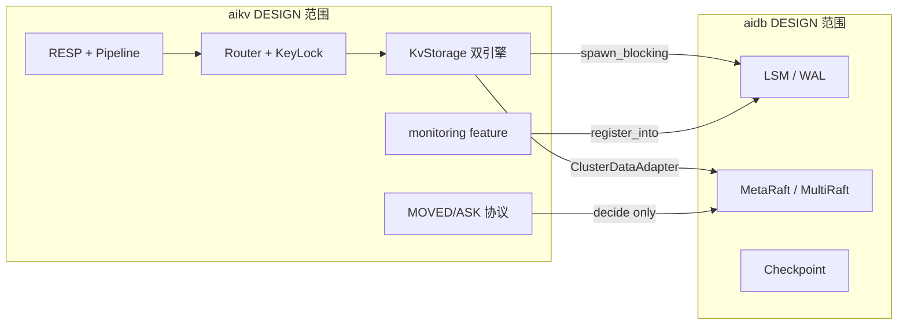
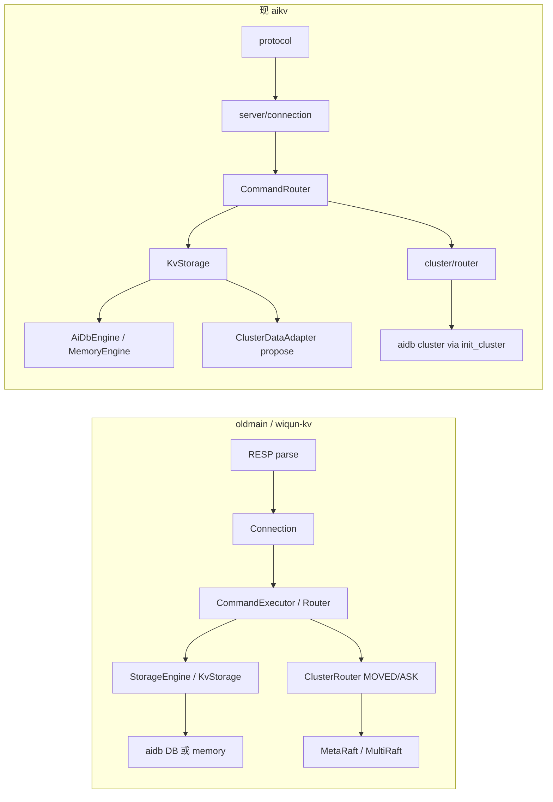

# Cursor transcript

---

## 1. User

## 文档整理 — 新会话

工作目录: `/root/code/database`

请先阅读 (不要跳过):
1. `AiKv-Workflow/backup/design.md` — 总规程
2. `AiKv-Workflow/backup/PROGRESS.md` — 当前进度
3. `AiKv-Workflow/backup/INDEX.md` — 本章索引 (若已有行则更新)

---

### 本次任务

| 项 | 值 |
|----|-----|
| PROGRESS 总步 | 20 (阶段 2b 第 2 篇) |
| 目标文件 | `aikv/DESIGN.md` |
| 本次子步 | 从步 0 开始 |
| 对比深度 | **模块级** (汇总文档; 跨模块设计决策, 不加深章逐段) |

### 必须遵守

- **确认门控**: 步 0→1→2→3→4, 每步先讨论, 我确认后再下一步
- **步 4**: 先出 **正文草稿**, 我确认后再写入 `aikv/`、更新 INDEX/PROGRESS
- **汇总文档**: **不必** Module Skill frontmatter; 提炼 **跨模块 why / trade-off**, **不重复** module 实现细节 (链到 `docs/modules/*.md`)
- **过程只进 backup/**: INDEX; aikv 不写迁移历史
- **旧文档顺序**: `backup/aikv/DESIGN.md` (主) → `aikv-oldmain` (`docs/development/architecture/`, `docs/guide/`) → WiQunTools 查漏 → `wiqun-kv`
- **待核实**: 根文档至多简要提及; 详情仍引用 `aikv/ISSUES.md` (不展开排查过程)
- **步 4 落盘前**: 对照 design.md 验收项 — 链接有效、决策与 7 篇 modules + `ARCHITECTURE.md` 不矛盾

### 上下文 (上一篇已完成)

- 步 19 ✅: [`aikv/ARCHITECTURE.md`](aikv/ARCHITECTURE.md) 已落盘 (分层、数据流、AiDb 边界表、7 篇 modules 导航)
- 阶段 1 aikv modules 全部 ✅ (`docs/modules/*.md`, 含 `observability-reference.md`)
- 阶段 2a aidb 汇总 ✅ (可参考 [`aidb/DESIGN.md`](aidb/DESIGN.md) 写法与篇幅)
- 旧稿: [`AiKv-Workflow/backup/aikv/DESIGN.md`](AiKv-Workflow/backup/aikv/DESIGN.md) (已移出 aikv 仓库)
- 当前 `aikv/` **尚无** 根目录 `DESIGN.md` (步 4 新建)
- `ISSUES.md` 已有 ISSUE-001~023 (modules 阶段写入)
- 本会话归档参考: [`aikv/archive/19-architecture.md`](aikv/archive/19-architecture.md); aidb 同类: [`aidb/archive/14-design.md`](aidb/archive/14-design.md)

### 边界提示 (步 0 可细化)

**DESIGN.md** — 回答「为什么这样选、放弃了什么、已知限制」:

- 宜含: 按域分节 — **协议** (RESP2/3, pipeline, HELLO); **存储** (`KvStorage`, memory vs aidb, `spawn_blocking`, `StoredValue` 编码); **命令** (Router 中枢, KeyLock, JSON/Lua 策略); **集群** (feature gate, MetaRaft 非 gossip, Gossip 轻量, `ClusterDataAdapter`); **可观测性** (monitoring feature, slowlog 默认等 — 与 ISSUE 对齐)
- 宜含: 决策表或 Q&A 式小节; 链 [`ARCHITECTURE.md`](aikv/ARCHITECTURE.md) + modules + [`aidb/DESIGN.md`](../aidb/DESIGN.md) (LSM/Raft 细节不重复)
- 不重复: ARCHITECTURE 分层/数据流; modules 代码地图/命令表; DEPLOYMENT 运维; AGENTS CI

**与相邻文档分工**

| 文档 | 回答 |
|------|------|
| [`ARCHITECTURE.md`](aikv/ARCHITECTURE.md) | 是什么、怎么分层、数据怎么走、AiDb 边界 |
| **DESIGN.md (本篇)** | **为什么、trade-off、已知限制** |
| 日后 `DEPLOYMENT.md` (步 21) | 构建、端口、集群部署 |
| `docs/modules/*.md` | 域级 Skill 正文 |

### 本次不要

- 不要跳过未确认的步骤
- 不要一次写步 21+ 或其它 aikv 根文档
- 不要修改 `design.md` / 流程, 除非我明确要求
- 不要 commit, 除非我明确要求

---

请从步 0 开始, 给出本步交付物, 等我确认。

---

## 2. Assistant

先阅读总规程、进度与索引，并核对步 0 的交付要求。

**Tool `Read`**

```json
{
  "path": "/root/code/database/AiKv-Workflow/backup/design.md"
}
```


**Tool `Read`**

```json
{
  "path": "/root/code/database/AiKv-Workflow/backup/PROGRESS.md"
}
```


**Tool `Read`**

```json
{
  "path": "/root/code/database/AiKv-Workflow/backup/INDEX.md"
}
```


---

## 3. Assistant

对照 aidb 同类文档与 aikv 现状，界定 `DESIGN.md` 的范围边界。

**Tool `Read`**

```json
{
  "path": "/root/code/database/aidb/DESIGN.md",
  "limit": 120
}
```


**Tool `Read`**

```json
{
  "path": "/root/code/database/aikv/ARCHITECTURE.md",
  "limit": 100
}
```


**Tool `Read`**

```json
{
  "path": "/root/code/database/AiKv-Workflow/backup/aikv/DESIGN.md",
  "limit": 150
}
```


**Tool `Read`**

```json
{
  "path": "/root/code/database/aikv/archive/19-architecture.md",
  "limit": 80
}
```


---

## 4. Assistant

**Tool `Read`**

```json
{
  "offset": 120,
  "path": "/root/code/database/aidb/DESIGN.md"
}
```


**Tool `Read`**

```json
{
  "offset": 100,
  "path": "/root/code/database/aikv/ARCHITECTURE.md"
}
```


**Tool `Grep`**

```json
{
  "pattern": "^## ISSUE-",
  "path": "/root/code/database/aikv/ISSUES.md",
  "-A": 1
}
```


**Tool `Grep`**

```json
{
  "pattern": "步 0",
  "path": "/root/code/database/aikv/archive/19-architecture.md",
  "-A": 80
}
```


---

## 5. Assistant

**Tool `Read`**

```json
{
  "limit": 80,
  "path": "/root/code/database/aikv/ISSUES.md"
}
```


**Tool `Grep`**

```json
{
  "path": "/root/code/database/aikv/docs/modules",
  "pattern": "^## 已知限制|^## 待核实|设计|trade-off|为什么",
  "glob": "*.md",
  "head_limit": 40
}
```


**Tool `Glob`**

```json
{
  "glob_pattern": "aidb/archive/14-design.md",
  "target_directory": "/root/code/database"
}
```


---

## 6. Assistant

**Tool `Grep`**

```json
{
  "-A": 120,
  "path": "/root/code/database/aidb/archive/14-design.md",
  "pattern": "步 0",
  "head_limit": 150
}
```


**Tool `Grep`**

```json
{
  "path": "/root/code/database/aikv/docs/modules",
  "pattern": "^### |^## ",
  "glob": "*.md",
  "head_limit": 80
}
```


---

## 7. Assistant

## 步 0 — 定范围 (PROGRESS 步 20 · `aikv/DESIGN.md`)

对照 `design.md` 步 0: 本章是**阶段 2b 汇总文档**, 深度**模块级** (跨域 why / trade-off, 不逐段展开). 以下为交付物, **尚未写入** `aikv/`、`INDEX.md` 或 `PROGRESS.md`.

---

### 1. 本章定位

| 项 | 说明 |
|----|------|
| 文档类型 | 根目录汇总 (无 Module Skill frontmatter) |
| 读者 | 需要理解「为什么这样选」的开发者 / 与 AiDb 协作方 / 做跨模块取舍前 |
| 核心问题 | **为什么选 A 而非 B? 放弃了什么? 已知限制是什么?** |
| 信息源 | 7 篇 `docs/modules/*.md` 的 invariant + 已知限制; 当前 `aikv/src/` 验证; 旧稿 `backup/aikv/DESIGN.md` (~82 行 Q&A) 为骨架 |
| 参照范本 | 已完成 [`aidb/DESIGN.md`](aidb/DESIGN.md) (篇幅 ~230 行, 五域 + 决策总表) |
| 与 ARCHITECTURE | ARCHITECTURE = 是什么、分层、数据流、AiDb 边界表; **DESIGN = 决策 rationale** ([`ARCHITECTURE.md`](aikv/ARCHITECTURE.md) §设计取向 已链到本篇) |
| 与 modules | modules = 怎么做、入口、命令表; **DESIGN 不重复** parser 状态机、Router dispatch 表、CLUSTER 子命令清单等 |
| 与 aidb/DESIGN | LSM / Leveled / WAL / MetaRaft/MultiRaft / Checkpoint 等 **why** 在 [`aidb/DESIGN.md`](aidb/DESIGN.md); 本篇只写 **aikv 侧** 协议/命令/嵌入/集群客户端/可观测性取舍, 嵌入边界与 aidb 互链 |

---

### 2. 本章边界 (含 / 不含)

**宜含**

- **按域分节**: 产品/横切 → 协议 → 存储 → 命令 → 集群 → 可观测性
- **Q&A 或决策表**: 「为什么 X 而非 Y?」+ 理由 + **放弃项 / 已知限制** (细节链 module)
- **产品形态**: 网络服务 (bin+lib)、Tokio async、`spawn_blocking` 桥接 sync AiDb; feature `cluster` / `monitoring`
- **与 Redis 关系**: RESP2/3 双栈、Redis Cluster **客户端协议** (MOVED/ASK) vs **共识在 aidb** (MetaRaft 非 gossip)
- **跨 module 决策**: `KvStorage` 双引擎、`CommandRouter` 中枢、KeyLock/ScriptTransaction、JSON 存 `ValueType::String`、Lua mlua 沙箱、`ClusterDataAdapter` 数据面写
- **决策总表** (可选, 对齐 aidb DESIGN 风格)
- **进一步阅读**: 链 `ARCHITECTURE.md` + 7 modules + `aidb/DESIGN.md` + `ISSUES.md` (根文档至多简要提及)

**不宜含**

| 主题 | 去向 |
|------|------|
| 分层 Mermaid、目录树、`src/` 数据流 | [ARCHITECTURE.md](aikv/ARCHITECTURE.md) |
| RESP 帧语法、parser limits、pipeline 实现 | [protocol.md](aikv/docs/modules/protocol.md) |
| TCP 循环、HELLO、ATOM 事务 | [server.md](aikv/docs/modules/server.md) |
| `StoredValue` 编码表、`AiDbEngine::open` 步骤 | [storage.md](aikv/docs/modules/storage.md) |
| 命令注册表、String~ZSet handler | [commands-core.md](aikv/docs/modules/commands-core.md) |
| JSON/Lua/SAVE/INFO 命令表 | [commands-extended.md](aikv/docs/modules/commands-extended.md) |
| MOVED/ASK 状态机、CLUSTER 子命令清单 | [cluster.md](aikv/docs/modules/cluster.md) |
| 指标名、INFO 段、slowlog API | [observability.md](aikv/docs/modules/observability.md) |
| WAL/MemTable/Leveled compaction / Raft apply | [aidb/DESIGN.md](aidb/DESIGN.md) + aidb modules |
| 构建/端口/集群部署 | 步 21 `DEPLOYMENT.md` |
| CI / AI 入口 | [AGENTS.md](aikv/AGENTS.md) |
| oldmain 迁移对照、步 2–3 排查过程 | 仅 `backup/`; ISSUES 一行引用 |

**与相邻文档分工** (你已给定, 步 0 确认对齐)

| 文档 | 回答 |
|------|------|
| [ARCHITECTURE.md](aikv/ARCHITECTURE.md) | 是什么、怎么分层、数据怎么走、AiDb 边界 |
| **DESIGN.md (本篇)** | **为什么、trade-off、已知限制** |
| 日后 DEPLOYMENT (步 21) | 构建、端口、集群部署 |
| `docs/modules/*.md` | 域级 Skill 正文 |

---

### 3. 决策域 ↔ module ↔ `src/` 锚点

| 决策域 | 主要 module | `src/` 锚点 (步 1 验证用) |
|--------|-------------|---------------------------|
| 产品 / Feature / async 边界 | 横切 | `main.rs`, `lib.rs`, `Cargo.toml` `[features]` |
| RESP2/3、Pipeline、HELLO | protocol | `protocol/{types,parser,encoder}.rs` |
| 请求循环与协议衔接 | server | `server/connection.rs` (HELLO/内联命令边界) |
| `KvStorage`、memory vs aidb、`spawn_blocking` | storage | `storage/{types,memory,aidb,adapter}.rs` |
| `StoredValue` / `{db}:{key}` 编码 | storage | `storage/types.rs`, `dump.rs` |
| Router 中枢、KeyLock、cluster_route | commands-core | `command/router.rs`, `registry.rs` |
| JSON/Lua/阻塞/MIGRATE/持久化策略 | commands-extended | `command/{json,script,blocking,migrate,persistence,server}.rs` |
| feature gate、MOVED/ASK、Gossip 轻量 | cluster | `cluster/{router,state,gossip}.rs`, `command/router.rs` |
| `ClusterDataAdapter`、数据面 propose | storage + cluster | `storage/cluster_adapter.rs`, `main.rs` `init_cluster` |
| monitoring feature、slowlog 默认、refresh | observability | `server/{slowlog,metrics_server,config}.rs`, `main.rs` |

对比深度: **模块级** — 旧稿决策是否仍成立、modules 已知限制是否需升格为跨域 trade-off, **不**逐函数对照 (storage/cluster 在 modules 阶段已加深, 本篇只提炼 why).

---

### 4. 拟读文件列表 (步 1–4)

**步 1 — 新代码与 modules (主)**

| 优先级 | 路径 | 目的 |
|--------|------|------|
| P0 | 7 × `aikv/docs/modules/*.md` — **「已知限制」「关键 invariant」「与 aidb 分工」** | 提炼决策, 避免重复正文 |
| P0 | `aikv/ARCHITECTURE.md` — §设计取向、§与 AiDb 分工 | 删重复, 互链 |
| P0 | `aikv/ISSUES.md` — ISSUE-001~023 标题与状态 | 根文档待核实筛选 |
| P0 | `aikv/src/Cargo.toml`, `lib.rs`, `main.rs` | feature、启动装配、`init_cluster` |
| P1 | `aidb/DESIGN.md` — 嵌入边界、集群分工表 | 不重复 LSM/Raft 细节; 互链一致 |
| P1 | 抽样 `command/router.rs`, `storage/aidb.rs`, `storage/cluster_adapter.rs`, `cluster/router.rs` | 验证决策与代码仍一致 |
| P2 | `aikv/AGENTS.md` | 避免重复 CI; 参考项目表 → 展开 why (Redis 兼容取向) |

**步 2 — 旧文档 (按 design 顺序)**

| 顺序 | 路径 | 用途 |
|------|------|------|
| 1 | `AiKv-Workflow/backup/aikv/DESIGN.md` | **主骨架** (协议/存储/命令/集群/可观测性 Q&A) |
| 2 | `backup/aikv/ARCHITECTURE.md` §关键设计决策 (若有) | 决策表查漏 |
| 3 | `aikv-oldmain/docs/development/architecture/01-overview.md` | 分层概念、MetaRaft 非 gossip; **过滤** 过时路径/性能数字 |
| 4 | `aikv-oldmain/docs/development/architecture/05-lua-scripting.md` | Lua 取舍查漏 (细节在 commands-extended) |
| 5 | `aikv-oldmain/docs/guide/*` | Redis 兼容取向查漏; 用户指南不进 DESIGN |
| 6 | WiQunTools `wiqun-kv-inventory/01–08` | 查漏 (01 RESP、02 storage、07 cluster 分工、08 observability) |
| 7 | `wiqun-kv/DESIGN.md` (与 1 重叠则跳过) | 二选一 |

**步 3 — oldmain / wiqun-kv 代码 (模块级)**

- 抽样: `CommandExecutor` → `CommandRouter`、独立 RDB/AOF 路径、oldmain slowlog 默认 10ms 等 **已放弃或已演进方向**
- 目的: 确认「放弃项」与 modules/ISSUES 一致, 非逐文件 diff

**步 4 — 验收对照**

- 链接有效: ARCHITECTURE、7 modules、`aidb/DESIGN.md`、ISSUES
- 决策与 7 篇 modules + ARCHITECTURE **不矛盾**
- LSM/Raft/Checkpoint 细节 **不重复** aidb DESIGN
- ISSUES 根文档至多简要提及 (不展开排查)

---

### 5. 拟写大纲 (步 4 草稿骨架, 步 0 仅确认范围)

```markdown
# AiKv 设计决策

(开篇 2–3 句: 本文回答 why; 架构见 ARCHITECTURE; 实现见 modules; LSM/Raft 见 aidb/DESIGN)

## 阅读导航
(表格: 域 → aikv module 链接; 存储/共识链 aidb modules)

## 产品形态与横切取舍
- 网络服务 (RESP) vs 嵌入式 lib (AiDb) — 分工 rationale
- Tokio async + `spawn_blocking` — 为什么不在 aikv 内做 async LSM
- Feature gate: `cluster`, `monitoring` — 单机零额外依赖
- 与 Redis: 兼容什么 (协议/命令/Cluster 客户端语义), 刻意不做什么 (gossip 共识、标准 RDB 主路径、CONFIG REWRITE …)
- MemoryEngine vs AiDbEngine — 何时用哪个

## 协议
### 为什么 RESP2 + RESP3?
### 为什么 Pipeline + NeedMoreData?
### HELLO 协商与渐进 RESP3

## 存储
### 为什么 `KvStorage` trait?
### MemoryEngine: 16 db、过期队列
### 为什么 AiDbEngine + `spawn_blocking`?
### `StoredValue` / `{db_index}:{user_key}` — 为何不在 aidb 做类型层
### DUMP/RESTORE 与 aidb 字节 KV 边界
### ClusterDataAdapter — 为何数据面写走 propose

## 命令
### 为什么 CommandRouter 为中枢 (非 per-command executor)?
### KeyLock 字典序 — 死锁与 Lua 原子性
### ScriptTransaction + `spawn_blocking` 统一管理
### JSON 存 String 而非专用路径 — trade-off
### Lua: mlua vendored vs rhai/自研
### 阻塞命令: BlockingRegistry 与 observability 边界

## 集群
### 为什么 `#[cfg(feature = "cluster")]`?
### MetaRaft 共识 vs Gossip 轻量拓扑 — 非 Redis 16379 gossip
### MOVED/ASK / READONLY / replica read — 客户端协议在 aikv
### `ClusterDataAdapter` vs aidb Router — 分工
### 已知限制摘要 (stub 子命令、failover 等待核实 → cluster.md / ISSUES)

## 可观测性
### tracing 始终编译 vs `monitoring` feature
### HTTP `/metrics` 在进程 (aikv) 而非 lib (aidb) — 与 aidb DESIGN 对齐
### slowlog 默认 100ms、refresh 15s — 与 Redis/spec 差异 (ISSUE-022/023 一行)
### INFO 单一数据源 + 可选 Prom 镜像

## 决策总表 (可选)
| 决策 | 选择 | 理由 | 放弃/限制 |

## 进一步阅读
(ARCHITECTURE, modules, aidb/DESIGN, DEPLOYMENT, ISSUES)

## 已知限制 (根文档摘要)
(跨域 2–4 条 + 链 ISSUES)

## 待核实
(至多 2–3 条一行引用, 如集群 stub、observability 默认)
```

预估篇幅: **~150–220 行** (旧稿 ~82 行 + 横切/Redis 取舍/aidb 边界/ISSUES 对齐摘要); 对齐 [`aidb/DESIGN.md`](aidb/DESIGN.md) 粒度, 短于 oldmain 长文.

---

### 6. INDEX 拟更新行 (步 4 确认后写入)

| 新文档章节 | 状态 | 参考的旧文档 | 处理 | 备注 |
|------------|------|--------------|------|------|
| `DESIGN.md` (总审) | 进行中 | `backup/aikv/DESIGN.md`; oldmain `01-overview`, `05-lua-scripting`; WiQunTools 01–08 查漏; wiqun-kv 与 backup 重复跳过 | 待步 4 落盘 | 模块级; 跨域 why; 链 aidb/DESIGN |

---

### 7. 步 0 待你确认的点

1. **大纲六域** (产品横切 + 协议/存储/命令/集群/可观测性) 是否合适? 是否把 **「与 Redis 兼容边界」** 单独成节, 还是合并在「产品形态与横切取舍」?
2. **决策总表**: 保留扩展表 (对齐 aidb), 还是全文 Q&A 不设总表?
3. **aidb/DESIGN 分工**: LSM/Raft/Checkpoint 细节 **只链 aidb**, 本篇仅写嵌入与协议侧 why — 是否同意?
4. **根文档待核实**: 是否只保留 **跨域** 条目 (如 ISSUE-001 编码、集群 stub ISSUE-013~016/019、可观测 ISSUE-020~023), 其余仍只在 modules 一行引用?
5. **旧稿 `backup/aikv/DESIGN.md`**: 五域 Q&A 作骨架, **增补** 横切/Redis 取舍/aidb 边界/ISSUES 对齐 — 是否同意?

请回复 **可以** 或 **调整 …**; 确认后进入 **步 1** (读新代码与 modules, 输出各域决策要点 bullet).

---

## 8. User

可以

---

## 9. Assistant

步 0 已确认，开始步 1：阅读 modules 与关键源码，梳理各域设计决策要点。

**Tool `Read`**

```json
{
  "path": "/root/code/database/aikv/docs/modules/protocol.md",
  "offset": 150
}
```


**Tool `Read`**

```json
{
  "path": "/root/code/database/aikv/docs/modules/server.md",
  "offset": 230
}
```


**Tool `Read`**

```json
{
  "path": "/root/code/database/aikv/docs/modules/storage.md",
  "offset": 200
}
```


**Tool `Read`**

```json
{
  "path": "/root/code/database/aikv/docs/modules/commands-core.md",
  "offset": 200
}
```


**Tool `Read`**

```json
{
  "path": "/root/code/database/aikv/docs/modules/commands-extended.md",
  "offset": 230
}
```


**Tool `Read`**

```json
{
  "path": "/root/code/database/aikv/docs/modules/cluster.md",
  "offset": 220
}
```


**Tool `Read`**

```json
{
  "path": "/root/code/database/aikv/docs/modules/observability.md",
  "offset": 250
}
```


---

## 10. Assistant

**Tool `Read`**

```json
{
  "limit": 100,
  "path": "/root/code/database/aikv/docs/modules/protocol.md"
}
```


**Tool `Read`**

```json
{
  "limit": 90,
  "path": "/root/code/database/aikv/docs/modules/storage.md"
}
```


**Tool `Read`**

```json
{
  "limit": 100,
  "path": "/root/code/database/aikv/docs/modules/commands-core.md"
}
```


**Tool `Read`**

```json
{
  "limit": 90,
  "path": "/root/code/database/aikv/docs/modules/cluster.md"
}
```


**Tool `Read`**

```json
{
  "limit": 100,
  "path": "/root/code/database/aikv/docs/modules/observability.md"
}
```


**Tool `Read`**

```json
{
  "path": "/root/code/database/aikv/Cargo.toml"
}
```


---

## 11. Assistant

**Tool `Read`**

```json
{
  "limit": 80,
  "path": "/root/code/database/aikv/AGENTS.md"
}
```


**Tool `Grep`**

```json
{
  "path": "/root/code/database/aikv/src/main.rs",
  "pattern": "spawn_blocking|for_testing|build_storage|init_cluster|interval"
}
```


**Tool `Read`**

```json
{
  "offset": 78,
  "path": "/root/code/database/aikv/ISSUES.md",
  "limit": 120
}
```


---

## 12. Assistant

## 步 1 — 读新代码 (PROGRESS 步 20 · `aikv/DESIGN.md`)

以当前 `aikv/src/` + 7 篇 modules + `ARCHITECTURE.md` 为准, 梳理各域**设计决策要点** (why / 放弃项 / 已知限制). **尚未查旧文档** (步 2), **未写正文**.

---

### 1. 产品形态与横切

| 决策 | 代码/文档锚点 | 要点 (可写入 DESIGN) |
|------|---------------|----------------------|
| **网络服务, 非嵌入式 lib** | `main.rs` bin; `lib.rs` 导出域模块 | 与 AiDb 相反: RESP/命令/Cluster **客户端协议** 在 aikv; LSM/Raft 在 aidb |
| **Tokio async 全栈** | `Cargo.toml` tokio full; `server/connection` | 网络 I/O、命令调度在 async runtime |
| **`spawn_blocking` 桥接 sync AiDb** | `storage/aidb.rs` | AiDb `DB` 同步; 不在 aikv 内做 async LSM — **放弃** 在协议层重写存储引擎 |
| **双引擎可切换** | `main.rs` `build_storage`; `--engine memory\|aidb` | 命令层只认 `KvStorage`; 测试/开发用 memory, **集群生产推荐 aidb** (AGENTS) |
| **Feature gate** | `Cargo.toml`: `default=[]`; `cluster`, `monitoring` | 单机零 cluster 依赖; monitoring 零 Prom/OTel 开销 — 对齐 aidb 按需启用 |
| **cluster 传递 aidb/cluster** | `cluster = ["aidb/cluster"]` | 一条 feature 对齐两侧; **放弃** aikv 自建共识 |
| **与 Redis: 兼容什么** | AGENTS + modules | RESP2/3、16384 slot、MOVED/ASK、多数命令语义、CLUSTER 子命令子集 |
| **与 Redis: 刻意不做什么** | AGENTS + modules 已知限制 | telnet 内联命令; 标准 RDB `dump.rdb` 主路径; memory AOF; `CONFIG REWRITE`; Redis DUMP 互操作; Serf 级 gossip 共识 |
| **二进制安全 key** | commands-core invariant | BulkString/`&[u8]` 路径; **放弃** UTF-8 强制 |
| **磁盘/格式** | storage + dump | AiKv 内部 DUMP = bincode(`StoredValue`); 与 Redis / oldmain RDB **不兼容** — 设计后果 |

**与 ARCHITECTURE 分工**: 本篇展开上表 why; 分层图/数据流不重复.

**与 aidb/DESIGN 分工**: LSM/Leveled/WAL/MetaRaft/MultiRaft/Checkpoint **why** 在 aidb; 本篇只写「为何委托 + 嵌入边界」.

---

### 2. 协议

| 决策 | 选择 | 代码锚点 | 理由 |
|------|------|----------|------|
| 双协议栈 | **RESP2 + RESP3** | `protocol/types.rs` `ProtocolVersion` | RESP2 = redis-cli 默认; RESP3 = Map/Set/Push 等; HELLO 连接级协商 |
| 默认版本 | **Resp3** (`Default`) | `types.rs` | 新连接倾向 RESP3; 未协商前 server 仍可用 RESP2 线格式 |
| 解析模型 | **流式 `feed` + `parse`** | `parser.rs` | 单次 read 可含多帧; 不完整 → `Ok(None)` 不消费 — **Pipeline 关键** |
| 错误策略 | recoverable vs fatal | `parser.rs` + `server/connection` | 可恢复 skip 1 byte 继续; depth/length 类 fatal 断连 — **放弃** 遇错即整连接报废 (部分场景) |
| 安全边界 | 默认 limits 表 | `parser.rs` 常量 | 512MiB bulk / 64MiB buffer / depth 128 — 防 OOM; 无运行时 CONFIG 调 limits |
| 编解码分离 | parser vs `serialize()` | `encoder.rs` | 协议层纯转换; **HELLO/null 线格式** (`$-1` vs `_`) 在 server `adapt_for_protocol` |
| RESP3 渐进 | 类型已编解码, 命令层未必用 | protocol 已知限制 | StreamedString/Attribute/Push 已支持; **放弃** 全命令 RESP3 富类型一步到位 |

**放弃 / 限制**: 顶层孤立 `;` chunk 非法; `ProtocolVersion` 不改变 `serialize()` 输出.

---

### 3. 存储

| 决策 | 选择 | 代码锚点 | 理由 |
|------|------|----------|------|
| 抽象 | **`KvStorage` trait** | `storage/types.rs` | 命令层不感知 memory/aidb; 测试注入 MemoryEngine |
| 双实现 | **MemoryEngine** 直 impl; **aidb** 经 Adapter 链 | `memory.rs`, `adapter.rs`, `aidb.rs` | memory 无扁平 KV 层; aidb 需 `encode_key` + bincode |
| 逻辑多 DB | **16 db** (`DB_COUNT`) | `types.rs` | Redis `SELECT 0-15`; memory 每 db 独立 HashMap + 过期队列 |
| AiDb 物理模型 | **单 `DB` + `{db}:{key}` 前缀** | `aidb.rs` `encode_key` | **放弃** oldmain 16 独立 `DB` 目录; 简化 aidb 实例数; cluster 每 group 一 DB |
| 类型层归属 | **`StoredValue` / `ValueType` 在 aikv** | `types.rs`, `dump.rs` | AiDb 仅字节 KV + tombstone; **Redis 类型编码是协议/命令职责** |
| 同步 I/O 桥接 | **`spawn_blocking`** | `aidb.rs` 各方法 | Tokio 服务不能直接阻塞 LSM; blocking pool 隔离 — trade-off: 线程切换开销 |
| 惰性 TTL | 读路径删除 + `StorageObservation` | memory/adapter | **放弃** 独立过期线程 (BlockingRegistry `evict_expired` 亦无后台 — ISSUE-005) |
| cluster 写 | **`ClusterDataAdapter` → `propose_group`** | `cluster_adapter.rs` | Assigned slot 写必须 Raft; **禁止** local fallback — 防 SET 成功 GET 空 |
| cluster 读 | local group / `CLUSTERDOWN` | `cluster_adapter.rs` | 与 aidb Router 分工: aikv 决定何时 propose, aidb 执行 Raft |
| 持久化 | memory ERR; aidb `flush`/`Checkpoint` | storage invariant | **放弃** memory 生产持久化; SAVE/BGSAVE 委托 aidb |
| DUMP/RESTORE | 内部 version+bincode | `dump.rs` | 与 Redis DUMP **不互操作** — 实现简单、与 `get_typed` 一致 |

#### 放弃 / 限制 (链 storage.md, DESIGN 只摘要)

- aidb `scan`/`keys` 全量 sort — O(n) 内存.
- Memory `write_batch` 非原子 vs aidb 单 WriteBatch 原子.
- `glob_match` 仅 `*`/`?`.
- **`AiDbEngine::open` → `Options::for_testing()`** (ISSUE-002) — 生产 preset 未收敛, DESIGN 记为已知限制.
- **MGET wrong-type**: memory 静默 nil vs aidb WRONGTYPE (ISSUE-001) — 双引擎语义裂缝.

---

### 4. 命令

| 决策 | 选择 | 代码锚点 | 理由 |
|------|------|----------|------|
| 分发中枢 | **`CommandRouter`** (非 oldmain `CommandExecutor`) | `router.rs` | 单点: cluster 前置、metrics、KeyLock、extended dispatch — **放弃** 每命令独立 executor 类 |
| 域 handler | String/Hash/… + Router match | `string.rs` 等 | 按 Redis 数据结构分文件; registry 元数据与 router **双维护** — trade-off: 显式 vs 宏生成 |
| 类型分轨 | String `get/set` vs typed `get_typed` | commands-core invariant | 与 Redis WRONGTYPE 一致; 混用即错 |
| 并发写 | **KeyLock 1024 桶** | `router.rs` `KeyLock` | 单 key `lock`; 双 key `lock_two` **字典序** — 防死锁 |
| Lua 原子性 | **ScriptTransaction** + 排序 KeyLock | `script.rs` | 多 `redis.call` 同 WriteBatch 语义; async storage 统一 `spawn_blocking` |
| JSON 存储 | **JSON 文档作 `ValueType::String`** | `json.rs` | 全文档 RMW + `serde_json`; **放弃** RedisJSON 专用路径与 partial update 优化 |
| Lua 运行时 | **mlua vendored lua54** | `Cargo.toml` | Redis 官方脚本语言; 零系统 lua 依赖; 沙箱裁 StdLib |
| **放弃** rhai/自研 | — | AGENTS 参考表 | 用户习惯 EVAL; mlua FFI 成熟 |
| 阻塞命令 | **BlockingRegistry** 在 extended; BLPOP 在 core list | `blocking.rs`, `list.rs` | 机制与 handler 分离; observability 未接 `blocked_clients` (ISSUE-020) |
| 内联命令 | PING/ECHO/HELLO 在 **connection** | `server/connection.rs` | 绕 Router 减延迟; 与 oldmain 层级不同但行为等价 |
| AiKv 扩展 | ATOM.* / EXEC json 批量 | server 已知限制 | **非** Redis 官方 MULTI 一一对应 — 为 DUMP/RESTORE 事务扩展 |

#### 放弃 / 限制 (摘要)

- GETRANGE/SETRANGE 未实现 (ISSUE-003).
- MSETNX 未实现; cluster dead branch (ISSUE-004).
- Lua: 无 SCRIPT KILL; 子集小于 Redis; KeyLock 无 30s 超时 (ISSUE-012).
- MIGRATE: 无 AUTH2; KEYS 忽略 COPY (ISSUE-006/010).
- SHUTDOWN 仅 SAVE/NOSAVE (ISSUE-011).
- OBJECT REFCOUNT 等 stub.

---

### 5. 集群

| 决策 | 选择 | 代码锚点 | 理由 |
|------|------|----------|------|
| Feature gate | **`#[cfg(feature = "cluster")]`** | 全 `cluster/` + router | 单机二进制无 tonic/OpenRaft 传递依赖 |
| 共识归属 | **MetaRaft + MultiRaft 在 aidb** | `main.rs` `init_cluster` | aikv 只做 **Redis Cluster 客户端协议** |
| 拓扑权威 | **MetaRaft 快照** | `cluster/state.rs`, `commands.rs` | aikv **不** 独立 slot 表; `CLUSTER_STATE_MGR` 为 glue |
| Gossip | **轻量 `GossipState`** | `gossip.rs` | 后台从 MetaRaft 刷新 + metrics; **无** PING/PONG bus; **非** Redis 16379 gossip 共识 |
| 故障判定 | **MetaRaft/Raft** | AGENTS, cluster.md | **放弃** Serf/SWIM 级 P2P 共识在 aikv |
| 路由决策 | **同步 `ClusterRouter::decide`** | `router.rs` | 只读缓存 + 快照; 不 `.await` OpenRaft — 避免 Router 内嵌 async 死锁 |
| 客户端语义 | MOVED/ASK/CROSSSLOT/ASKING/READONLY | `router.rs`, `connection.rs` | Redis smart client (`redis-cli -c`) 兼容 |
| Replica read | **READONLY + 本地 group** | `router.rs` | 提升读吞吐; 写仍 MOVED leader — Redis 官方行为 |
| 数据面写 | **`ClusterDataAdapter`** | `cluster_adapter.rs` | 与 aidb `Router::propose` 衔接; 多 Group batch 由 aidb 分组 (aidb DESIGN) |
| 透明转发 | **server 侧 `forward_command`** | `forward.rs` | 单端点 TCP 转发; smart client 仍主要靠 MOVED 字符串 |
| Admin 白名单 | PING/MIGRATE/SCAN/INFO… bypass key 路由 | `router.rs` `cluster_route` | 运维/扫描命令不按 slot 拦 |
| METARAFT 子命令 | **已从 RESP 移除** (ISSUE-015) | 无 aikv 分支 | MetaRaft 运维在 aidb gRPC — **放弃** 在 CLUSTER 暴露内部 Raft |

#### 放弃 / 限制 (摘要)

- 非全自动 failover — FORCE/TAKEOVER 手动 (ISSUE-018); REPLICATE 仅元数据 (ISSUE-017).
- 无 CLUSTER RESET / ADDSLOTSRANGE (ISSUE-016).
- CLUSTER INFO 恒 `ok` (ISSUE-013); GossipState 未接 NODES (ISSUE-014).
- SET-CONFIG-EPOCH / COUNT-FAILURE-REPORTS stub (ISSUE-019).

---

### 6. 可观测性

| 决策 | 选择 | 代码锚点 | 理由 |
|------|------|----------|------|
| Tracing | **始终编译** | `tracing` 全 crate | span 零 feature 门控; 与 aidb 一致 |
| Prometheus | **`monitoring` feature** | `metrics_server.rs`, `main.rs` | **放弃** 默认 Prom 依赖与 scrape 开销 |
| HTTP `/metrics` | **进程 (aikv)** | `MetricsServer` | 与 aidb DESIGN 对齐: 库 `register_into`, 进程暴露 |
| 单一数据源 | **`ServerMetrics` → INFO** | `info.rs`, observability invariant I1 | Prom 为 **镜像**; 禁止 INFO 独立公式 |
| Refresh | **15s 后台 tick** (`monitoring`) | `main.rs` L690 | drain `StorageObservation`、ops/sec; **放弃** spec 1s (ISSUE-022) |
| 无 monitoring | 无自动 refresh | ISSUE-021 | slowlog/latency/INFO 仍可用; stats 字段可能滞后 |
| Slowlog 默认 | **100ms** (`100_000` µs) | `slowlog.rs` | Redis/oldmain 10ms — **intentional 或待收敛** (ISSUE-023, doc-only) |
| 热路径钩子分工 | Router `on_command` vs Connection duration | observability I2 | 避免重复计数 |
| 排除跟踪 | PING/ECHO/HELLO/… | I3 | 降低噪声 |
| `aidb_*` | `register_into` 同 registry | `main.rs` | Redis INFO **不** 映射 aidb 引擎指标 — 仅 `/metrics` |

#### 放弃 / 限制 (摘要)

- `blocked_clients` / `evicted_keys` 恒 0 (无 maxmemory eviction).
- 无 `CONFIG SET loglevel` (oldmain LoggingManager 已移除).
- Grafana 旧 `wiqun_kv_*` PromQL 与现 `aikv_*` 不一致.

---

### 7. 跨域决策关系 (步 4 可用一小节或总表行)



---

### 8. 与 modules / ARCHITECTURE 一致性

| 检查项 | 结论 |
|--------|------|
| 7 篇 modules invariant | 步 1 要点均可在 modules 找到对应; **无结构性冲突** |
| ARCHITECTURE §设计取向 | 4 bullet (协议解耦/RESP/集群 feature/async+blocking) 本篇将展开 why |
| aidb/DESIGN 嵌入边界 | 分工表与 aidb ARCHITECTURE / aikv ARCHITECTURE 三方一致 |
| backup/aikv/DESIGN.md 五域 | 骨架仍有效; 步 1 增补横切/Redis 取舍/ISSUES/Gossip 澄清 |

---

### 9. 步 4 建议章节 ↔ 步 1 域映射

| DESIGN 章节 | 步 1 来源 |
|-------------|-----------|
| 阅读导航 | 7 modules + aidb modules 链 |
| 产品形态与横切 | §1 + AGENTS |
| 协议 | §2 |
| 存储 | §3 (+ aidb 嵌入 2–3 句) |
| 命令 | §4 |
| 集群 | §5 |
| 可观测性 | §6 |
| 决策总表 | §1–6 压缩 |
| 已知限制 / 待核实 | ISSUE-001/002, 013–016/019, 020–023 根文档 2–4 行 |

篇幅目标: **~150–220 行** (对齐 `aidb/DESIGN.md`).

---

### 10. 步 1 未覆盖 (留给步 2–3)

- oldmain `01-overview` / `05-lua` 是否有 **额外** 放弃项未进 modules
- WiQunTools inventory 是否还有 **跨域** 决策未收录
- `backup/aikv/DESIGN.md` 与步 1 差异 (如 oldmain 10ms slowlog 是否写「演进」叙事)
- ISSUE 是否需在步 2 新增 (步 1 未见新疑点)

---

请确认步 1: **各域决策要点** 是否与你的理解一致. 回复 **可以** 或调整意见后, 我再进入 **步 2** (按序查旧文档, 输出旧文档清单 + 分类结论).

---

## 13. User

可以

---

## 14. Assistant

步 1 已确认，开始步 2：按规程顺序查阅旧文档并分类。

**Tool `Read`**

```json
{
  "path": "/root/code/database/AiKv-Workflow/backup/aikv/DESIGN.md"
}
```


**Tool `Grep`**

```json
{
  "path": "/root/code/database/AiKv-Workflow/backup/aikv/ARCHITECTURE.md",
  "pattern": "设计|决策|为什么|trade"
}
```


**Tool `Glob`**

```json
{
  "glob_pattern": "**/*",
  "target_directory": "/root/code/database/aikv-oldmain/docs"
}
```


**Tool `Glob`**

```json
{
  "glob_pattern": "wiqun-kv-inventory/*.md",
  "target_directory": "/root/code/database/WiQunTools/docs"
}
```


---

## 15. Assistant

**Tool `Read`**

```json
{
  "offset": 110,
  "limit": 40,
  "path": "/root/code/database/AiKv-Workflow/backup/aikv/ARCHITECTURE.md"
}
```


**Tool `Read`**

```json
{
  "limit": 120,
  "path": "/root/code/database/aikv-oldmain/docs/development/architecture/01-overview.md"
}
```


**Tool `Read`**

```json
{
  "path": "/root/code/database/aikv-oldmain/docs/development/architecture/05-lua-scripting.md"
}
```


**Tool `Read`**

```json
{
  "path": "/root/code/database/WiQunTools/docs/wiqun-kv-inventory/07-cluster-protocol.md"
}
```


**Tool `Read`**

```json
{
  "path": "/root/code/database/WiQunTools/docs/wiqun-kv-inventory/08-observability.md"
}
```


**Tool `Glob`**

```json
{
  "glob_pattern": "DESIGN.md",
  "target_directory": "/root/code/database/wiqun-kv"
}
```


---

## 16. Assistant

**Tool `Read`**

```json
{
  "limit": 50,
  "path": "/root/code/database/wiqun-kv/DESIGN.md"
}
```


**Tool `Grep`**

```json
{
  "path": "/root/code/database/WiQunTools/docs/wiqun-kv-inventory/01-resp-tcp.md",
  "pattern": "设计决策|为什么|trade"
}
```


**Tool `Grep`**

```json
{
  "path": "/root/code/database/WiQunTools/docs/wiqun-kv-inventory/02-storage-commands.md",
  "pattern": "设计决策|为什么"
}
```


**Tool `Read`**

```json
{
  "limit": 80,
  "offset": 120,
  "path": "/root/code/database/aikv-oldmain/docs/development/architecture/01-overview.md"
}
```


---

## 17. Assistant

## 步 2 — 查旧文档 (PROGRESS 步 20 · `aikv/DESIGN.md`)

按 `design.md` 顺序查阅完毕. **未写入** `aikv/`、`INDEX.md`、`PROGRESS.md`、`ISSUES.md`.

---

### 1. 旧文档清单与分类

| # | 路径 | 分类 | 对 DESIGN 的用途 |
|---|------|------|------------------|
| **1** | `backup/aikv/DESIGN.md` | **仍有效 (主骨架)** | 五域 Q&A (~82 行): 协议/存储/命令/集群/可观测性 — **步 4 直接沿用结构** |
| **1b** | `backup/aikv/ARCHITECTURE.md` §关键设计决策 + §设计原则 | **仍有效 (决策表查漏)** | tokio、KvStorage、mlua、feature gate、JSON String 存储、KeyLock — 可并入「决策总表」 |
| **1c** | `backup/aikv/README.md` / DEPLOYMENT / CHANGELOG | **不适用本篇** | 步 21–22 / 步 23 |
| **1d** | `backup/aikv/docs/superpowers/*` | **历史设计** | cluster announce、observability alignment spec — 概念已在 modules; DESIGN 只摘 **与现码差异** (slowlog/refresh) |
| **2a** | `aikv-oldmain/docs/development/architecture/01-overview.md` | **仍有效 (概念)** + **大量过时** | ✅ MetaRaft 非 gossip、分层五层、协议/命令/存储分工 · ❌ 「100% 兼容」、200k ops、AiDb v0.6.3、`StorageEngine`/`MemoryAdapter` 命名、Snappy 压缩、长文设计模式 — **不迁入** |
| **2b** | `aikv-oldmain/docs/development/architecture/02-refactoring.md` | **已过时 (历史)** | KvStorage 重构 **已完成**; 仅背景, 不写 DESIGN |
| **2c** | `aikv-oldmain/docs/development/architecture/03-cluster.md` | **不适用 (运维排障)** | 步 21 DEPLOYMENT |
| **2d** | `aikv-oldmain/docs/development/architecture/05-lua-scripting.md` | **部分有效** + **部分过时** | ✅ ScriptTransaction + WriteBatch 架构图、沙箱、read-your-own-writes · ❌ KeyLockManager **30s 超时** (现码无 → ISSUE-012)、命令清单/版本号、部分 limitation 与现实现不一致 |
| **2e** | `aikv-oldmain/docs/development/api/*` | **不适用** | API/命令参考, 非 why |
| **2f** | `aikv-oldmain/docs/guide/*` | **不适用** | 用户指南 → README/DEPLOYMENT |
| **2g** | `aikv-oldmain/docs/archive/*` | **已过时** | 迁移记录 — **跳过** |
| **2h** | `aikv-oldmain/docs/index.md` | **索引过时** | 路径与现仓库不符 — **跳过** |
| **3a** | WiQunTools `01-resp-tcp.md` §设计决策 | **仍有效 (查漏)** | parser/encoder 分离、BytesMut、recoverable vs `Ok(None)`、per-connection spawn、PING/HELLO 内联、limits  rationale — 步 1 已覆盖, DESIGN 可 1–2 句 |
| **3b** | WiQunTools `02-storage-commands.md` §设计决策 | **仍有效 (查漏)** | KvStorage trait vs enum、惰性过期、typed 分轨、KeyLock 独立于 adapter — 步 1 已覆盖 |
| **3c** | WiQunTools `04-json.md` / `05-lua.md` | **部分有效** | JSON String 存储、Lua mlua — 与 backup DESIGN 一致; 细节在 commands-extended |
| **3d** | WiQunTools `06-persistence.md` | **部分有效** | aidb checkpoint 路径、生产 Options 待收敛 — 对齐 ISSUE-002 |
| **3e** | WiQunTools `07-cluster-protocol.md` §设计决策 (L909+) | **仍有效 (高价值)** + **设计偏离** | ✅ Kv 不重复 SlotTable、Gossip 轻量、MOVED/ASK 客户端重定向、Membership 委托 Db、ASKING 单次、CROSSSLOT、`resolve_addr` Option、`is_local_group_leader` 缓存 · ❌ 全文假设 **完整 Gossip PING/PONG + PFAIL/FAIL** — 现码为 **轻量刷新** (ISSUE-014); `WiQunDb` → 现 `aidb` |
| **3f** | WiQunTools `08-observability.md` | **仍有效 (原则)** + **部分过时** | ✅ ServerMetrics 单一数据源、INFO↔Prom 不变式、slowlog 独立于 tracing · ❌ `wiqun_kv_*` 指标名 (现 `aikv_*`)、Phase 17「未接通」段落已过时、采样 10% 等高吞吐策略 **未实现** — 不迁入 |
| **4** | `wiqun-kv/DESIGN.md` | **与 backup/aikv/DESIGN.md 几乎相同** | **二选一跳过** (以 backup 为主) |

**邻接 (非旧稿, 边界对齐)**

| 路径 | 用途 |
|------|------|
| [`aidb/DESIGN.md`](aidb/DESIGN.md) | LSM/Raft/Checkpoint why **只链 aidb**; 嵌入分工表与 aikv ARCHITECTURE 互链 |
| [`aikv/ARCHITECTURE.md`](aikv/ARCHITECTURE.md) §设计取向 | 删重复, 互链 |
| [`aikv/ISSUES.md`](aikv/ISSUES.md) | 根文档待核实筛选 (已有 ISSUE-001~023) |

---

### 2. 仍有效 → 步 4 宜保留/提炼

| 主题 | 来源 | 新稿写法 |
|------|------|----------|
| 五域 Q&A 骨架 | backup DESIGN | 保留域标题 + Q&A 形态 |
| 产品: 网络服务 + 委托 aidb | 01-overview + AGENTS | 「产品形态与横切」— **不与 aidb 重复 LSM why** |
| MetaRaft 非 Redis gossip 共识 | 01-overview、07-cluster §设计决策、cluster.md | 集群节核心 trade-off |
| Gossip **轻量** (非 PING/PONG 决策) | 07-cluster §917、AGENTS、ISSUE-014 | 明确「放弃 Serf 级 gossip」 |
| MOVED/ASK **客户端**重定向 | 07-cluster §919 | 集群节; 链 cluster.md |
| `CLUSTER_STATE_MGR` 全局 + 热路径 | 07-cluster §687–700 | 一句 why (同步 decide) |
| KvStorage / spawn_blocking / 16 db | backup DESIGN + 02-storage | 存储节 |
| CommandRouter 中枢 + KeyLock 字典序 | backup + 02-storage §KeyLock | 命令节 |
| JSON → String、Lua mlua + ScriptTransaction | backup DESIGN + 05-lua | 命令节 |
| monitoring feature、slowlog 独立 tracing | backup DESIGN + 08 §1085–1099 | 可观测性节 |
| 决策总表 | backup ARCHITECTURE 表 + 步 1 | 扩展行 (Redis 取舍、Gossip、INFO 数据源) |
| **与 Redis 兼容边界** | AGENTS + modules 已知限制 | 合并在横切: 兼容什么 / 刻意不做什么 (RDB/AOF/telnet/DUMP…) |

---

### 3. 已过时 / 设计偏离 → 文档应如何表述

| 主题 | 旧文档说法 | 现实现 / modules | DESIGN 表述建议 |
|------|------------|------------------|-----------------|
| Redis 兼容度 | 01-overview「100% 协议兼容」 | 多命令未实现/stub | **「RESP + 命令子集兼容」**, 链 modules 已知限制; 不写百分比 |
| 性能目标 | 01-overview「200k+ ops/sec」 | 无 benchmark 承诺 | **不写** 性能数字 |
| 存储 trait 命名 | `StorageEngine` / `MemoryAdapter` | `KvStorage` / `MemoryEngine` | 用现命名 |
| AiDb 压缩 | 01-overview「Snappy」 | aidb compression 未实现 | 链 aidb/DESIGN; aikv 不重复 |
| 完整 Gossip | 07-cluster 全文 PING/PONG、PFAIL→FAIL | `gossip.rs` 仅 MetaRaft 刷新 + metrics | **轻量 Gossip**; ISSUE-014 一行; 勿写「Gossip 驱动故障转移」 |
| Gossip → NODES | AGENTS「刷新 NODES 展示」 | `cluster_nodes()` 读 MetaRaft | 与 ISSUE-014 对齐 |
| Lua KeyLock 30s | 05-lua、oldmain | 现 `KeyLock` 无 script 超时 | ISSUE-012 一行或命令节 bullet |
| Slowlog 默认 | 08 写 100ms; oldmain 10ms | 代码 100ms | ISSUE-023 doc-only; 写 **实际默认** |
| Metrics refresh | superpowers spec 1s | 代码 15s | ISSUE-022; 写实际 15s |
| 指标前缀 | `wiqun_kv_*` | `aikv_*` | 可观测性节一句 |
| CLUSTER INFO | oldmain 按 slot 判 fail | 恒 `ok` | ISSUE-013 |
| METARAFT 子命令 | oldmain API | 已移除 | ISSUE-015; 链 aidb cluster |
| Options | oldmain `Options::default()` | `for_testing()` | ISSUE-002 |
| MGET wrong-type | oldmain 两侧行为不同 | memory nil vs aidb WRONGTYPE | ISSUE-001 |
| RDB/AOF 主路径 | oldmain / 04-storage (已归档) | checkpoint + 内部 DUMP | 横切「放弃标准 RDB」 |

---

### 4. 拟新增 ISSUES (步 2 讨论)

**结论: 不拟新增条目.**

步 2 旧文档与步 1 对照, 设计偏离均已落在 **ISSUE-001~023** (modules 阶段写入). 无新 open 疑点需在步 2 门控内追加.

| 旧文档线索 | 已有 ISSUE |
|------------|------------|
| Gossip 未接 NODES | ISSUE-014 |
| CLUSTER INFO 恒 ok | ISSUE-013 |
| Slowlog 100ms vs 10ms | ISSUE-023 |
| refresh 15s vs spec 1s | ISSUE-022 |
| Lua KeyLock 无超时 | ISSUE-012 |
| Options::for_testing | ISSUE-002 |
| MGET 语义 | ISSUE-001 |
| METARAFT 移除 | ISSUE-015 |
| CLUSTER RESET / failover stub | ISSUE-016~019 |

---

### 5. 步 3 预告 (oldmain 代码模块级)

步 3 将抽样验证 **放弃项** 是否与代码一致 (非逐函数 diff):

- oldmain `KeyLockManager` 30s vs 现 `KeyLock`
- oldmain `cluster_info` fail 判定 vs 现硬编码 ok
- oldmain slowlog 默认 vs `DEFAULT_SLOWLOG_THRESHOLD_US`
- WiQunTools 07 完整 Gossip vs `gossip.rs` 无网络 PING

---

### 6. INDEX 拟更新行 (步 4 确认后写入)

| 新文档章节 | 状态 | 参考的旧文档 | 处理 | 备注 |
|------------|------|--------------|------|------|
| `DESIGN.md` (总审) | 步 2 完成 | `backup/aikv/DESIGN.md` + ARCHITECTURE §决策; oldmain `01-overview`, `05-lua-scripting`; WiQunTools 01–08 §设计决策; wiqun-kv 与 backup 重复跳过 | 待步 4 落盘 | 模块级; 无新 ISSUE |

---

### 7. 步 2 待你确认的点

1. **旧稿主骨架**: 以 `backup/aikv/DESIGN.md` 五域 Q&A 为主, 增补横切/Redis 取舍/Gossip 澄清/ISSUES 对齐 — 是否同意?
2. **WiQunTools 07-cluster §设计决策**: 多条高质量 why (不重复 SlotTable、MOVED 客户端重定向、ASKING 单次等) **迁入** DESIGN 集群节, 但 **不迁入** 完整 Gossip 协议叙事 — 是否同意?
3. **oldmain 01-overview**: 只摘 MetaRaft 非 gossip + 分层概念, **不迁入** 性能数字与「100% 兼容」 — 是否同意?
4. **ISSUES**: 步 2 **不新增** 条目, 根 DESIGN 沿用 ISSUE-001/002/013–016/019/020–023 简要一行 — 是否同意?

请回复 **可以** 或 **调整 …**; 确认后进入 **步 3** (oldmain/wiqun-kv 模块级代码对照, 输出差异表与文档表述建议).

---

## 18. User

可以

---

## 19. Assistant

步 2 已确认，开始步 3：在 oldmain 中抽样对照关键设计点与现实现。

**Tool `Grep`**

```json
{
  "path": "/root/code/database/aikv-oldmain/src",
  "pattern": "lock_timeout|30|KeyLock",
  "glob": "**/script*"
}
```


**Tool `Grep`**

```json
{
  "path": "/root/code/database/aikv-oldmain/src/cluster",
  "pattern": "cluster_state|cluster_info"
}
```


**Tool `Grep`**

```json
{
  "path": "/root/code/database/aikv-oldmain/src",
  "pattern": "SLOWLOG|threshold|10_000|100_000"
}
```


**Tool `Read`**

```json
{
  "path": "/root/code/database/aikv/src/cluster/gossip.rs",
  "limit": 80
}
```


**Tool `Grep`**

```json
{
  "path": "/root/code/database/aikv/src/command/router.rs",
  "pattern": "KeyLock|lock_timeout"
}
```


---

## 20. Assistant

**Tool `Read`**

```json
{
  "limit": 50,
  "offset": 875,
  "path": "/root/code/database/aikv-oldmain/src/cluster/commands.rs"
}
```


**Tool `Grep`**

```json
{
  "path": "/root/code/database/aikv/src/cluster/commands.rs",
  "pattern": "cluster_state|cluster_info"
}
```


**Tool `Grep`**

```json
{
  "path": "/root/code/database/aikv/src/server/slowlog.rs",
  "pattern": "DEFAULT_SLOWLOG"
}
```


**Tool `Grep`**

```json
{
  "path": "/root/code/database/aikv-oldmain/src/cluster",
  "pattern": "gossip|PING|PONG",
  "head_limit": 30
}
```


**Tool `Grep`**

```json
{
  "path": "/root/code/database/wiqun-kv/src",
  "pattern": "cluster_state|DEFAULT_SLOWLOG|KeyLockManager",
  "head_limit": 25
}
```


---

## 21. Assistant

**Tool `Read`**

```json
{
  "limit": 40,
  "offset": 80,
  "path": "/root/code/database/aikv/src/cluster/commands.rs"
}
```


**Tool `Grep`**

```json
{
  "path": "/root/code/database/aikv-oldmain/src/storage",
  "pattern": "Options::|for_testing|sync_wal"
}
```


**Tool `Grep`**

```json
{
  "path": "/root/code/database/aikv/src/storage/aidb.rs",
  "pattern": "Options::|for_testing"
}
```


**Tool `Read`**

```json
{
  "limit": 90,
  "path": "/root/code/database/aikv/src/command/router.rs"
}
```


**Tool `Grep`**

```json
{
  "head_limit": 20,
  "path": "/root/code/database/aikv-oldmain/src/command",
  "pattern": "CommandExecutor|execute_with_client"
}
```


---

## 22. Assistant

**Tool `Grep`**

```json
{
  "head_limit": 15,
  "path": "/root/code/database/wiqun-kv/src/cluster",
  "pattern": "gossip|PING"
}
```


**Tool `Grep`**

```json
{
  "head_limit": 15,
  "path": "/root/code/database/aikv-oldmain/src/storage/memory_adapter.rs",
  "pattern": "fn mget|WRONGTYPE"
}
```


**Tool `Grep`**

```json
{
  "head_limit": 15,
  "path": "/root/code/database/aikv/src/storage/memory.rs",
  "pattern": "fn mget",
  "-A": 8
}
```


**Tool `Read`**

```json
{
  "limit": 35,
  "offset": 45,
  "path": "/root/code/database/aikv/src/storage/aidb.rs"
}
```


**Tool `Grep`**

```json
{
  "head_limit": 10,
  "path": "/root/code/database/aikv-oldmain/src/storage",
  "pattern": "16.*DB|db_count|MemoryAdapter"
}
```


---

## 23. Assistant

**Tool `Grep`**

```json
{
  "head_limit": 10,
  "path": "/root/code/database/aikv-oldmain/src",
  "pattern": "fn mget"
}
```


**Tool `Grep`**

```json
{
  "path": "/root/code/database/wiqun-kv/src/storage",
  "pattern": "for_testing|Options::"
}
```


**Tool `Read`**

```json
{
  "limit": 30,
  "offset": 75,
  "path": "/root/code/database/aikv-oldmain/src/cluster/gossip.rs"
}
```


---

## 24. Assistant

**Tool `Read`**

```json
{
  "limit": 30,
  "offset": 138,
  "path": "/root/code/database/aikv-oldmain/src/command/string.rs"
}
```


**Tool `Grep`**

```json
{
  "head_limit": 8,
  "path": "/root/code/database/aikv-oldmain/src/storage",
  "pattern": "get_from_db|WRONGTYPE"
}
```


---

## 25. Assistant

**Tool `Grep`**

```json
{
  "-A": 15,
  "path": "/root/code/database/aikv-oldmain/src/storage/memory_adapter.rs",
  "pattern": "fn get_from_db"
}
```


**Tool `Read`**

```json
{
  "limit": 25,
  "offset": 475,
  "path": "/root/code/database/aikv-oldmain/src/storage/aidb_adapter.rs"
}
```


---

## 26. Assistant

## 步 3 — 对比旧代码 (PROGRESS 步 20 · `aikv/DESIGN.md`)

在 `aikv-oldmain` / `wiqun-kv` 做**模块级**抽样对照 (非逐函数 diff). **未写入** 任何仓库文件.

---

### 1. 对照范围与方法

| 对照源 | 用途 |
|--------|------|
| `aikv-oldmain/src/{protocol,server,storage,command,cluster,observability}` | 重构前最后一版 |
| `wiqun-kv/src/*` | 与现 `aikv` 同代; 验证「演进后仍成立」的决策 |
| 现 `aikv/src/*` | 权威实现 |

**深度**: 模块级 — 分层是否等价、trait/API 是否换代、主流程是否仍成立、**放弃方向**是否与步 1–2 一致.

---

### 2. 模块级差异表

| 域 | oldmain / wiqun-kv | 现 aikv | 主流程等价? | DESIGN 应如何写 |
|----|-------------------|---------|-------------|-----------------|
| **协议** | RESP2/3、`RespParser` feed/parse、limits | 同构 (`protocol/*`) | ✅ | 沿用 backup DESIGN; 可补 inventory「parser/encoder 分离」一句 |
| **server** | PING/ECHO/HELLO 内联 connection | 同 | ✅ | why 内联: 减 Router 开销 (inventory 01) |
| **存储抽象** | `StorageEngine` enum + `get_from_db` 字符串 API | `KvStorage` trait + `&[u8]` + typed 分轨 | ✅ (语义层) | **为什么 trait**: 测试注入 + memory/aidb 切换; 链 storage.md |
| **AiDb 多 DB** | **16 个独立 `DB` 目录** (`aidb_adapter::new(path, db_count)`) | **单 `DB` + `{db}:{key}` 前缀** | ✅ (SELECT 语义) | **演进决策**: 减实例数、cluster 每 group 一 DB; 放弃 16 目录 |
| **AiDb Options** | `Options::default()` + **`sync_wal(false)`** (性能取向) | **`Options::for_testing()`** + **`sync_wal(true)`** | ⚠️ 性能/持久化取向相反 | 已知限制 + ISSUE-002; 不写「已优化生产 preset」 |
| **spawn_blocking** | aidb 路径同步 DB | 同 (`aidb.rs` `blocking()`) | ✅ | 保留 backup DESIGN 段落 |
| **命令分发** | `CommandExecutor` | `CommandRouter` + `registry` | ✅ | **中枢 Router**: cluster 前置 + metrics + KeyLock 单点 |
| **KeyLock** | `KeyLockManager` + **30s 超时** + `script_lock_timeouts` 指标 | `KeyLock` **1024 桶** `tokio::Mutex`, **无超时** | ⚠️ 并发模型换代 | mlua 仍排序加锁; ISSUE-012 一行 |
| **MGET wrong-type** | memory: **WRONGTYPE**; aidb: **静默 nil** | memory: **静默 nil**; aidb: **WRONGTYPE** (`get` 路径) | ❌ 两侧均与 oldmain **不完全一致** | ISSUE-001; 双引擎差异写 storage/命令节 bullet |
| **JSON/Lua** | String 存 JSON; mlua + ScriptTransaction | 同 | ✅ | 保留 backup 命令节 |
| **集群共识** | MetaRaft 非 gossip (01-overview) | 同 + `init_cluster` wiring | ✅ | 核心 trade-off; 链 aidb/DESIGN |
| **Gossip** | oldmain **无** `cluster/gossip.rs` | **轻量** `GossipState` + MetaRaft 刷新, **无 PING/PONG** | wiqun-kv 与 aikv **同形** | **非** inventory 07 全文 gossip; ISSUE-014 |
| **CLUSTER INFO** | **动态** `ok`/`fail` (slot 满 + leader + 映射一致) | **硬编码** `cluster_state:ok` | ❌ 回归 | ISSUE-013; 不写「与 Redis/oldmain 一致」 |
| **CLUSTER NODES** | 读 MetaRaft | 同; **不读** GossipState | ✅ (权威源) | 澄清 AGENTS「Gossip 刷新 NODES」表述 |
| **MOVED/ASK** | `ClusterRouter::decide` 同步 | 同 + `AnnounceResolver` | ✅ | 客户端重定向 why (inventory 07) |
| **可观测 slowlog** | 默认 **10ms** (`10_000` µs) | 默认 **100ms** (`100_000` µs) | wiqun-kv 同 100ms | ISSUE-023; 写**实际默认**, 不写 Redis 默认 |
| **metrics refresh** | (无统一 15s 叙事) | **15s** tick (`main.rs`) | wiqun-kv 同 | ISSUE-022 |
| **Prom 指标名** | `wiqun_kv_*` | `aikv_*` | 更名 | 可观测性节一句 (Grafana 旧面板) |
| **RDB/AOF** | oldmain 曾有 AOF/RDB 设计文档 | checkpoint + 内部 DUMP; 无标准 RDB | 主路径换代 | 横切「放弃标准 dump.rdb / memory AOF」 |

---

### 3. 主流程等价性 (模块级)



| 路径 | 结论 |
|------|------|
| 单机命令 | **等价**: TCP → parse → Router → handler → KvStorage → (spawn_blocking) aidb |
| 集群客户端协议 | **等价**: `cluster_route` → MOVED/ASK/CROSSSLOT → 本地或错误响应 |
| 集群数据写 | **增强**: 现码 **强制** `ClusterDataAdapter::propose_group` (oldmain 亦有 cluster raft 路径, 现 adapter 更明确) |
| 集群拓扑 | **等价权威源**: MetaRaft; Gossip **非**决策面 |
| 持久化 | **不等价产品路径**: oldmain 多 DB 目录 + 可选 sync_wal false → 现单 DB 前缀 + for_testing + sync_wal true |

---

### 4. 已放弃方向 (代码确认)

| 方向 | oldmain / 旧 spec | 现码 | DESIGN 表述 |
|------|-------------------|------|-------------|
| 完整 Redis gossip bus | WiQunTools 07 §Gossip PING/PONG | 无网络 gossip | **放弃**; MetaRaft 负责成员/故障 |
| Serf 级 PFAIL/FAIL 决策 | inventory 07 | `GossipState` 仅 telemetry 字段 | 不写「gossip 故障转移」 |
| 16× aidb `DB` 实例 | `aidb_adapter::new(_, 16)` | 单 `DB` + 前缀 | 存储节 trade-off |
| `CommandExecutor` 单类 | `command/mod.rs` | 域 handler + Router | 一句「Router 中枢」即可 |
| Lua `KeyLockManager` 30s | `script.rs` L224 default | 无 script 专用超时 | ISSUE-012 |
| 动态 CLUSTER INFO fail | `commands.rs` L911–917 | L110 硬编码 ok | ISSUE-013 |
| oldmain slowlog 10ms | `logging.rs` L19 | `slowlog.rs` L8 100ms | ISSUE-023 |
| METARAFT RESP 子命令 | oldmain connection 分支 | 无 | ISSUE-015 → aidb |
| 标准 Redis DUMP/RDB | 04-storage 已归档 | bincode DUMP | 横切放弃项 |

---

### 5. 步 4 文档表述建议 (按章节)

| DESIGN 章节 | 建议 |
|-------------|------|
| **产品横切** | 「RESP + 命令子集 + Cluster 客户端协议」; 列放弃项 (telnet、RDB 主路径、CONFIG REWRITE、100% 兼容); **不写** oldmain 性能数字 |
| **协议** | backup 五问 + parser/encoder 分离、per-connection task (inventory 01, 一句) |
| **存储** | KvStorage、16 逻辑 db、**单 aidb DB + 前缀** (演进 why)、spawn_blocking、**for_testing/sync_wal** (ISSUE-002) |
| **命令** | Router 中枢、KeyLock 字典序、JSON String、Lua mlua/ScriptTransaction; **MGET 双引擎裂缝** (ISSUE-001); KeyLock 无 script 超时 (ISSUE-012) |
| **集群** | feature gate; MetaRaft 非 gossip; **轻量 Gossip** (勿写 PING/PONG 决策); MOVED/ASK 客户端责任; READONLY; **CLUSTER INFO 恒 ok** (ISSUE-013); METARAFT 在 aidb (ISSUE-015) |
| **可观测性** | tracing 常开; monitoring feature; ServerMetrics 单一数据源; slowlog **100ms** (ISSUE-023); refresh **15s** (ISSUE-022); `aikv_*`; blocked_clients 恒 0 (ISSUE-020) |
| **决策总表** | 压缩步 1 + 本表「放弃」列 |
| **待核实** | ISSUE-001/002/013–016/019/020–023 各一行 |

**篇幅**: 仍目标 ~150–220 行; **不重复** aidb LSM/Raft 细节.

---

### 6. 拟新增 ISSUES

**结论: 仍不新增.** 步 3 代码对照与 ISSUE-001~023 一致; 无新 open 疑点.

---

### 7. INDEX 拟更新行 (步 4 后)

| 新文档章节 | 状态 | 参考的旧文档 | 处理 | 备注 |
|------------|------|--------------|------|------|
| `DESIGN.md` (总审) | 步 3 完成 | 同上 + oldmain/wiqun-kv 模块级对照 | 待步 4 落盘 | 无新 ISSUE; 主流程等价、6 项行为差异已对齐 ISSUES |

---

### 8. 步 3 待你确认的点

1. **模块级结论**: 分层主流程等价; **存储模型** (单 DB 前缀)、**Options**、**KeyLock**、**CLUSTER INFO**、**MGET**、**slowlog 默认** 为文档应明示的差异 — 是否同意?
2. **Gossip**: 步 4 写「inventory 07 完整 gossip **未实现**; 现轻量刷新 + MetaRaft 权威」— 是否同意?
3. **步 4**: 确认后我先出 **正文草稿** (不落盘), 你确认后再写入 `aikv/DESIGN.md` 并更新 INDEX/PROGRESS.

请回复 **可以** 或 **调整 …**; 确认后进入 **步 4 草稿**.

---

## 27. User

可以

---

## 28. Assistant

步 3 已确认。下面是 **步 4 正文草稿** (尚未写入 `aikv/`、`INDEX.md`、`PROGRESS.md`).

---

# AiKv 设计决策 (草稿)

```markdown
# AiKv 设计决策

本文回答 **为什么** 这样设计: 选型理由、放弃的替代方案、已知限制. **是什么、怎么分层、数据怎么走** 见 [ARCHITECTURE.md](ARCHITECTURE.md); LSM/Raft/WAL/Checkpoint 等存储内核 why 见 [aidb/DESIGN.md](../aidb/DESIGN.md); 实现细节与入口见 [docs/modules/](docs/modules/).

## 阅读导航

| 域 | 深入阅读 |
|----|----------|
| RESP2/3、Pipeline、解析 limits | [protocol.md](docs/modules/protocol.md) |
| TCP 循环、HELLO、内联命令 | [server.md](docs/modules/server.md) |
| `KvStorage`、memory/aidb、`StoredValue` | [storage.md](docs/modules/storage.md) |
| 核心命令、Router、KeyLock | [commands-core.md](docs/modules/commands-core.md) |
| JSON/Lua/SAVE/INFO/MIGRATE | [commands-extended.md](docs/modules/commands-extended.md) |
| MOVED/ASK、CLUSTER 子命令 | [cluster.md](docs/modules/cluster.md) |
| slowlog、INFO、`/metrics` | [observability.md](docs/modules/observability.md) |
| LSM、WAL、MetaRaft/MultiRaft | [aidb engine](../aidb/docs/modules/engine.md)、[aidb cluster](../aidb/docs/modules/cluster.md) |

## 产品形态与横切取舍

### 为什么是网络服务, 而不是嵌入式 lib?

AiKv 是 **bin + lib** 的 Redis RESP 服务 (Tokio async). [AiDb](../aidb/DESIGN.md) 提供同步 LSM + 可选 Raft; AiKv 在其上实现 TCP、命令语义与 Redis Cluster **客户端协议**. 协议层可独立演进, 存储与共识复用 sibling 库.

### 为什么 Tokio async + `spawn_blocking`?

- **Async**: 高并发 TCP、pipeline 读写在单连接上 multiplex.
- **AiDb 同步 API**: `DB::put/get` 等阻塞; 在 `AiDbEngine` 内用 `spawn_blocking` 桥接, **避免** 在协议层重写 async LSM.
- **trade-off**: blocking pool 线程切换开销; 换来不 fork LSM 实现.

### 为什么 `cluster` / `monitoring` feature gate?

| Feature | 默认 | 理由 |
|---------|------|------|
| (none) | — | 单机二进制无 tonic/OpenRaft/Prometheus 传递依赖 |
| `cluster` | off | 与 `aidb/cluster` 对齐; CI 主测 `--features cluster` |
| `monitoring` | off | 避免默认 Prom/OTel 依赖与 scrape 开销 |

### 与 Redis: 兼容什么, 放弃什么?

**兼容 (目标)**:

- RESP2/RESP3 (HELLO 协商)、标准 **数组形** 命令、BulkString 二进制安全 key.
- 16384 slot、`{hash tag}`、MOVED/ASK、ASKING/READONLY、多数数据结构与 admin 命令子集.
- 集群客户端协作 (`redis-cli -c` 等 smart client).

**刻意不实现或延后 (YAGNI)**:

| 项 | 说明 |
|----|------|
| telnet 内联 (`PING\r\n`) | 仅数组命令; 见 [server.md](docs/modules/server.md) |
| 标准 `dump.rdb` / memory AOF | 持久化走 aidb `Checkpoint`; memory 无生产持久化 |
| Redis DUMP 互操作 | 内部 `version + bincode(StoredValue)` |
| `CONFIG REWRITE` | 未实现 |
| Serf / Redis 16379 gossip **共识** | 拓扑与成员变更走 MetaRaft; 见 [集群](#集群) |
| 100% 命令兼容 | stub/未实现命令见各 module「已知限制」 |

### 双引擎: MemoryEngine vs AiDbEngine

- **MemoryEngine**: 测试、无盘开发; **无** checkpoint 生产路径.
- **AiDbEngine**: WAL + LSM; **集群生产推荐** `--engine aidb`.
- 命令层只依赖 `KvStorage`; 切换引擎不改 handler.

---

## 协议

### 为什么 RESP2 + RESP3?

- RESP2: redis-cli 与主流客户端默认.
- RESP3: Map/Set/Push 等; HELLO 在连接级协商.
- **渐进**: 编解码支持全类型; 命令层 RESP3 富类型逐步采用; null 线格式 (`$-1` vs `_`) 在 server `adapt_for_protocol`.

### 为什么 Pipeline + `Ok(None)`?

Redis 性能关键路径. `RespParser::feed` + 循环 `parse()`: 一次 read 多命令; 数据不足 **不消费** buffer. Tokio connection 循环自然 pipeline.

### 为什么 parser / encoder 分离?

`parser.rs` 流式解析与 recoverable 策略; `encoder.rs` 纯 `serialize()`. 职责分离, 与 WiQunTools inventory 01 一致.

### 默认 limits (512MiB bulk / 64MiB buffer / depth 128)

防 OOM 与恶意帧; **无** 运行时 CONFIG 调 limits. 不可恢复错误断连; 可恢复错误 skip 1 byte (server 判定 fatal).

---

## 存储

### 为什么 `KvStorage` trait?

命令层只调 trait; memory / aidb 可切换; 测试注入 `MemoryEngine`. **放弃** oldmain `StorageEngine` enum + 字符串 `get_from_db` — 现 typed 分轨 + `&[u8]` key.

### 为什么 16 逻辑 db (memory)?

Redis `SELECT 0–15`. MemoryEngine 每 db 独立容器 + 过期队列; `FLUSHDB`/`SWAPDB` 隔离.

### 为什么 AiDb 单 `DB` + `{db_index}:{user_key}`?

**演进**: oldmain / wiqun-kv 曾为每逻辑库独立 `DB` 目录; 现 **单 `aidb::DB` + ASCII 前缀** 模拟多库.

- **理由**: 减实例数; cluster 每 **数据 group** 一 `DB` 目录更清晰.
- **trade-off**: scan/sort 在大 keyspace 上 O(n); 见 [storage.md](docs/modules/storage.md).

### 为什么 `spawn_blocking` 包装 AiDb?

AiDb `DB` 同步; Tokio 服务不能直接阻塞 runtime. 所有 aidb I/O 经 `AiDbEngine::blocking()`.

### 为什么类型编码在 aikv (`StoredValue`), 不在 aidb?

AiDb 字节 KV + tombstone; **Redis 类型语义** 属协议/命令层. bincode(`StoredValue`) 与内部 DUMP 一致; **非** Redis DUMP.

### 为什么 cluster 写走 `ClusterDataAdapter`?

Assigned slot 写 **必须** `propose_group` → Raft apply; **禁止** local fallback (防 SET 成功 GET 空). 读本地 group 或 `CLUSTERDOWN`. 数据面细节链 [aidb cluster](../aidb/docs/modules/cluster.md).

### 已知限制 (摘要)

- `AiDbEngine::open` → `Options::for_testing()` + `sync_wal: true` — 见 [ISSUES.md#ISSUE-002](ISSUES.md#issue-002-aidbengineopen-固定-optionsfortesting).
- MGET 对 non-String key: memory 静默 nil vs aidb WRONGTYPE — 见 [ISSUES.md#ISSUE-001](ISSUES.md#issue-001-memoryengine-mget-对非-string-key-静默返回-none).
- aidb 路径 `scan`/`keys` 全量 sort; memory `write_batch` 非原子.

---

## 命令

### 为什么 `CommandRouter` 为中枢?

单点: `[cluster]` `cluster_route`、metrics、`execute_inner` 分发、KeyLock 注入. **放弃** oldmain `CommandExecutor` 单类 — 域 handler 分文件 + registry 元数据.

### 为什么 KeyLock 字典序?

单 key `lock`; 双 key `lock_two` (a<b); Lua `lock_keys_sorted` 去重排序. **避免** 交叉死锁. 1024 桶 `tokio::Mutex` — 与 oldmain `KeyLockManager` + Condvar **不同**; 现 **无** script 专用锁超时 — 见 [ISSUES.md#ISSUE-012](ISSUES.md#issue-012-eval-声明-key-的-keylock-无超时-oldmain-30s).

### 为什么 JSON 存 `ValueType::String`?

全文档 RMW + `serde_json`; **放弃** RedisJSON 专用存储与 partial update 优化; AiDb 无 JSON 抽象.

### 为什么 Lua: mlua vendored lua54?

Redis 官方脚本语言; 零系统 lua 依赖; 沙箱裁 StdLib. **放弃** rhai/自研 DSL.

### 为什么 `ScriptTransaction` + WriteBatch?

`redis.call` 多写原子提交; 读见己写; 失败 drop buffer. aidb 路径单 `WriteBatch` WAL 原子; memory 路径语义见 [commands-extended.md](docs/modules/commands-extended.md).

### 为什么 PING/ECHO/HELLO 在 connection?

减 Router 路径延迟; 行为与走 command 层等价.

### 已知限制 (摘要)

- GETRANGE/SETRANGE、MSETNX (cluster dead branch) — ISSUE-003/004.
- Lua 无 SCRIPT KILL; MIGRATE 无 AUTH2 — ISSUE-007/010.
- SHUTDOWN 仅 SAVE/NOSAVE — ISSUE-011.

---

## 集群

### 为什么 `#[cfg(feature = "cluster")]`?

单机零 cluster 依赖; 与 `aidb/cluster` 一条 feature 对齐.

### 为什么 MetaRaft 共识, 而非 Redis gossip?

| 方案 | 结论 |
|------|------|
| Redis 16379 gossip 共识 | **不采用** — 成员/slot 变更无强一致保证 |
| **MetaRaft + MultiRaft (aidb)** | **选用** — 权威拓扑与数据复制 |
| aikv **轻量 Gossip** | 从 MetaRaft 刷新 `GossipState` + metrics; **无** PING/PONG bus |

WiQunTools inventory 07 中的完整 gossip 故障检测 **未实现**; 故障与成员变更以 Raft 为准. 勿将 Gossip 写作 NODES 权威源 — 见 [ISSUES.md#ISSUE-014](ISSUES.md#issue-014-gossipstate-后台刷新但未接入-cluster-nodes).

### 为什么 MOVED/ASK 由客户端处理?

Redis Cluster 协议: 服务器返回 `MOVED`/`ASK` 字符串, smart client 重定向. **放弃** 服务端透明代理 (除 `forward_command` 单端点辅助). 客户端可缓存 slot 表.

### 为什么 `ClusterRouter::decide` 同步?

只读 MetaRaft 快照 + 本地 leader 缓存; **不** `.await` OpenRaft. `CLUSTER_STATE_MGR` 全局 `OnceLock` — 热路径零额外 `Arc` 间接 (inventory 07  rationale).

### 为什么 READONLY + replica read?

`READONLY` 后副本上读命令本地执行; 写仍 MOVED leader — Redis 官方行为.

### aidb 与 aikv 分工 (集群)

| 能力 | AiDb | AiKv |
|------|------|------|
| MetaRaft / MultiRaft / Router / slot 迁移执行 | ✅ | `init_cluster` wiring |
| `ClusterDataAdapter` / `propose_group` | Raft 实现 | ✅ 包装写路径 |
| MOVED/ASK / CLUSTER RESP / ASKING | — | ✅ |
| METARAFT * RESP 子命令 | gRPC/内部 API | **已移除** — ISSUE-015 |

### 已知限制 (摘要)

- CLUSTER INFO 恒 `cluster_state:ok` — [ISSUES.md#ISSUE-013](ISSUES.md#issue-013-cluster-info-恒输出-cluster_stateok).
- 无 CLUSTER RESET; FAILOVER 仅 FORCE/TAKEOVER — ISSUE-016/018.
- SET-CONFIG-EPOCH / COUNT-FAILURE-REPORTS stub — ISSUE-019.

---

## 可观测性

### 为什么 tracing 始终编译, Prometheus 在 `monitoring` feature?

- **tracing**: 命令/连接 span; 未订阅零开销; 与 aidb 一致.
- **Prometheus + OTel + HTTP `/metrics`**: 可选 feature; 默认无 Prom 依赖.

### 为什么 HTTP `/metrics` 在 aikv 进程?

与 [aidb/DESIGN.md](../aidb/DESIGN.md) 对齐: aidb `register_into`; **RESP 端口不能兼 HTTP**. 进程决定 scrape 端点.

### 为什么 `ServerMetrics` 为 INFO 唯一数据源?

`InfoRenderer` / `CLUSTER INFO` stats 只读 `ServerMetrics` (及 refresh 后 gauge); Prometheus 为 **镜像**. **放弃** INFO 独立计数公式 — invariant 见 [observability.md](docs/modules/observability.md).

### 为什么 Slowlog 独立于 tracing?

`SLOWLOG GET` 需环形缓冲最近 N 条; tracing span 流式, 不适合「保留 N 条」查询 — inventory 08 与 Redis 行为一致.

### 默认与 refresh (与 Redis/spec 差异)

| 项 | 现默认 | 备注 |
|----|--------|------|
| slowlog 阈值 | **100ms** (`100_000` µs) | Redis/oldmain 10ms — ISSUE-023 |
| metrics refresh | **15s** (`main` 后台 tick) | design spec 1s — ISSUE-022 |
| 无 `monitoring` | 无自动 refresh | stats 可能滞后 — ISSUE-021 |
| `blocked_clients` / `evicted_keys` | 恒 0 | 无 maxmemory eviction — ISSUE-020 |

指标前缀: **`aikv_*`** (非历史 `wiqun_kv_*`). `aidb_*` 不进 Redis INFO, 仅 `/metrics`.

---

## 决策总表

| 决策 | 选择 | 理由 | 放弃 / 限制 |
|------|------|------|-------------|
| 产品形态 | RESP 网络服务 | Redis 兼容入口 | 非嵌入式 DB |
| 运行时 | Tokio + spawn_blocking | 高并发 TCP + sync LSM | async 内嵌 LSM |
| 存储抽象 | `KvStorage` trait | 双引擎可切换 | StorageEngine enum |
| AiDb 多库 | 单 DB + key 前缀 | 减实例; cluster 每 group 一库 | 16 独立 DB 目录 |
| 协议 | RESP2 + RESP3 | 客户端覆盖 | telnet 内联 |
| Pipeline | feed + 循环 parse | RTT | — |
| 命令中枢 | CommandRouter | cluster/metrics/KeyLock | CommandExecutor |
| KeyLock | 桶 + 字典序 | 防死锁 | script 30s 超时 (oldmain) |
| JSON | String + serde_json | 简单 | RedisJSON 路径 |
| Lua | mlua vendored | Redis 脚本生态 | rhai |
| 集群 feature | `cfg(cluster)` | 单机精简二进制 | 始终链 cluster |
| 共识 | aidb MetaRaft/MultiRaft | 强一致 | gossip 共识 |
| Gossip | 轻量 MetaRaft 刷新 | metrics/telemetry | PING/PONG 决策 |
| 重定向 | MOVED/ASK 字符串 | smart client 兼容 | 默认透明代理 |
| 持久化主路径 | aidb Checkpoint | LSM 对齐 | 标准 RDB/AOF |
| DUMP | 内部 bincode | 与 StoredValue 一致 | Redis DUMP |
| 指标 | tracing + 可选 Prom | 库/进程分离 | 默认 HTTP scrape |
| INFO 数据源 | ServerMetrics | INFO↔Prom 一致 | 双计数 |

---

## 进一步阅读

- [ARCHITECTURE.md](ARCHITECTURE.md) — 分层、数据流、AiDb 边界
- [AGENTS.md](AGENTS.md) — AI 入口与 CI
- [docs/modules/](docs/modules/) — 域级实现与常见任务
- [aidb/DESIGN.md](../aidb/DESIGN.md) — LSM/Raft/Checkpoint why
- [aidb/ARCHITECTURE.md](../aidb/ARCHITECTURE.md) — AiDb 嵌入关系
- [DEPLOYMENT.md](DEPLOYMENT.md) — 构建、feature、运行 (步 21)
- [ISSUES.md](ISSUES.md) — 待核实与跟踪

## 已知限制 (根文档摘要)

- AiDb 打开参数未收敛生产 preset — [ISSUES.md#ISSUE-002](ISSUES.md#issue-002-aidbengineopen-固定-optionsfortesting).
- 双引擎 MGET wrong-type 语义不一致 — [ISSUES.md#ISSUE-001](ISSUES.md#issue-001-memoryengine-mget-对非-string-key-静默返回-none).
- 集群 CLUSTER INFO / Gossip 与 oldmain 行为差异 — [ISSUES.md](ISSUES.md) (ISSUE-013/014 等).

## 待核实

- 集群 failover / stub 子命令 — 见 [ISSUES.md](ISSUES.md) (ISSUE-013~016, ISSUE-019; modules 一行引用).
- 可观测性默认与 metrics 刷新 — 见 [ISSUES.md](ISSUES.md) (ISSUE-020~023).
```

---

**草稿统计**: 约 **210 行** (对齐 `aidb/DESIGN.md` 粒度).

**步 4 落盘前自检** (待你确认草稿后执行):

- 链: ARCHITECTURE、7 modules、`aidb/DESIGN.md`、ISSUES
- 不重复 ARCHITECTURE 数据流 / modules 命令表
- LSM/Raft 仅链 aidb
- 与步 1–3 及 ISSUE-001~023 一致

请确认草稿: 回复 **可以落盘** 或 **调整 …** (指出章节/表述). 确认后写入 `aikv/DESIGN.md` 并更新 `INDEX.md` / `PROGRESS.md`.

---

## 29. User

可以

---

## 30. Assistant

正在将草稿写入 `aikv/DESIGN.md`，并更新 `INDEX.md` 与 `PROGRESS.md`。

**Tool `Write`**

```json
{
  "path": "/root/code/database/aikv/DESIGN.md",
  "contents": "# AiKv 设计决策\n\n本文回答 **为什么** 这样设计: 选型理由、放弃的替代方案、已知限制. **是什么、怎么分层、数据怎么走** 见 [ARCHITECTURE.md](ARCHITECTURE.md); LSM/Raft/WAL/Checkpoint 等存储内核 why 见 [aidb/DESIGN.md](../aidb/DESIGN.md); 实现细节与入口见 [docs/modules/](docs/modules/).\n\n## 阅读导航\n\n| 域 | 深入阅读 |\n|----|----------|\n| RESP2/3、Pipeline、解析 limits | [protocol.md](docs/modules/protocol.md) |\n| TCP 循环、HELLO、内联命令 | [server.md](docs/modules/server.md) |\n| `KvStorage`、memory/aidb、`StoredValue` | [storage.md](docs/modules/storage.md) |\n| 核心命令、Router、KeyLock | [commands-core.md](docs/modules/commands-core.md) |\n| JSON/Lua/SAVE/INFO/MIGRATE | [commands-extended.md](docs/modules/commands-extended.md) |\n| MOVED/ASK、CLUSTER 子命令 | [cluster.md](docs/modules/cluster.md) |\n| slowlog、INFO、`/metrics` | [observability.md](docs/modules/observability.md) |\n| LSM、WAL、MetaRaft/MultiRaft | [aidb engine](../aidb/docs/modules/engine.md)、[aidb cluster](../aidb/docs/modules/cluster.md) |\n\n## 产品形态与横切取舍\n\n### 为什么是网络服务, 而不是嵌入式 lib?\n\nAiKv 是 **bin + lib** 的 Redis RESP 服务 (Tokio async). [AiDb](../aidb/DESIGN.md) 提供同步 LSM + 可选 Raft; AiKv 在其上实现 TCP、命令语义与 Redis Cluster **客户端协议**. 协议层可独立演进, 存储与共识复用 sibling 库.\n\n### 为什么 Tokio async + `spawn_blocking`?\n\n- **Async**: 高并发 TCP、pipeline 读写在单连接上 multiplex.\n- **AiDb 同步 API**: `DB::put/get` 等阻塞; 在 `AiDbEngine` 内用 `spawn_blocking` 桥接, **避免** 在协议层重写 async LSM.\n- **trade-off**: blocking pool 线程切换开销; 换来不 fork LSM 实现.\n\n### 为什么 `cluster` / `monitoring` feature gate?\n\n| Feature | 默认 | 理由 |\n|---------|------|------|\n| (none) | — | 单机二进制无 tonic/OpenRaft/Prometheus 传递依赖 |\n| `cluster` | off | 与 `aidb/cluster` 对齐; CI 主测 `--features cluster` |\n| `monitoring` | off | 避免默认 Prom/OTel 依赖与 scrape 开销 |\n\n### 与 Redis: 兼容什么, 放弃什么?\n\n**兼容 (目标)**:\n\n- RESP2/RESP3 (HELLO 协商)、标准 **数组形** 命令、BulkString 二进制安全 key.\n- 16384 slot、`{hash tag}`、MOVED/ASK、ASKING/READONLY、多数数据结构与 admin 命令子集.\n- 集群客户端协作 (`redis-cli -c` 等 smart client).\n\n**刻意不实现或延后 (YAGNI)**:\n\n| 项 | 说明 |\n|----|------|\n| telnet 内联 (`PING\\r\\n`) | 仅数组命令; 见 [server.md](docs/modules/server.md) |\n| 标准 `dump.rdb` / memory AOF | 持久化走 aidb `Checkpoint`; memory 无生产持久化 |\n| Redis DUMP 互操作 | 内部 `version + bincode(StoredValue)` |\n| `CONFIG REWRITE` | 未实现 |\n| Serf / Redis 16379 gossip **共识** | 拓扑与成员变更走 MetaRaft; 见 [集群](#集群) |\n| 100% 命令兼容 | stub/未实现命令见各 module「已知限制」 |\n\n### 双引擎: MemoryEngine vs AiDbEngine\n\n- **MemoryEngine**: 测试、无盘开发; **无** checkpoint 生产路径.\n- **AiDbEngine**: WAL + LSM; **集群生产推荐** `--engine aidb`.\n- 命令层只依赖 `KvStorage`; 切换引擎不改 handler.\n\n---\n\n## 协议\n\n### 为什么 RESP2 + RESP3?\n\n- RESP2: redis-cli 与主流客户端默认.\n- RESP3: Map/Set/Push 等; HELLO 在连接级协商.\n- **渐进**: 编解码支持全类型; 命令层 RESP3 富类型逐步采用; null 线格式 (`$-1` vs `_`) 在 server `adapt_for_protocol`.\n\n### 为什么 Pipeline + `Ok(None)`?\n\nRedis 性能关键路径. `RespParser::feed` + 循环 `parse()`: 一次 read 多命令; 数据不足 **不消费** buffer. Tokio connection 循环自然 pipeline.\n\n### 为什么 parser / encoder 分离?\n\n`parser.rs` 流式解析与 recoverable 策略; `encoder.rs` 纯 `serialize()`. 职责分离, 与 WiQunTools inventory 01 一致.\n\n### 默认 limits (512MiB bulk / 64MiB buffer / depth 128)\n\n防 OOM 与恶意帧; **无** 运行时 CONFIG 调 limits. 不可恢复错误断连; 可恢复错误 skip 1 byte (server 判定 fatal).\n\n---\n\n## 存储\n\n### 为什么 `KvStorage` trait?\n\n命令层只调 trait; memory / aidb 可切换; 测试注入 `MemoryEngine`. **放弃** oldmain `StorageEngine` enum + 字符串 `get_from_db` — 现 typed 分轨 + `&[u8]` key.\n\n### 为什么 16 逻辑 db (memory)?\n\nRedis `SELECT 0–15`. MemoryEngine 每 db 独立容器 + 过期队列; `FLUSHDB`/`SWAPDB` 隔离.\n\n### 为什么 AiDb 单 `DB` + `{db_index}:{user_key}`?\n\n**演进**: oldmain / wiqun-kv 曾为每逻辑库独立 `DB` 目录; 现 **单 `aidb::DB` + ASCII 前缀** 模拟多库.\n\n- **理由**: 减实例数; cluster 每 **数据 group** 一 `DB` 目录更清晰.\n- **trade-off**: scan/sort 在大 keyspace 上 O(n); 见 [storage.md](docs/modules/storage.md).\n\n### 为什么 `spawn_blocking` 包装 AiDb?\n\nAiDb `DB` 同步; Tokio 服务不能直接阻塞 runtime. 所有 aidb I/O 经 `AiDbEngine::blocking()`.\n\n### 为什么类型编码在 aikv (`StoredValue`), 不在 aidb?\n\nAiDb 字节 KV + tombstone; **Redis 类型语义** 属协议/命令层. bincode(`StoredValue`) 与内部 DUMP 一致; **非** Redis DUMP.\n\n### 为什么 cluster 写走 `ClusterDataAdapter`?\n\nAssigned slot 写 **必须** `propose_group` → Raft apply; **禁止** local fallback (防 SET 成功 GET 空). 读本地 group 或 `CLUSTERDOWN`. 数据面细节链 [aidb cluster](../aidb/docs/modules/cluster.md).\n\n### 已知限制 (摘要)\n\n- `AiDbEngine::open` → `Options::for_testing()` + `sync_wal: true` — 见 [ISSUES.md#ISSUE-002](ISSUES.md#issue-002-aidbengineopen-固定-optionsfortesting).\n- MGET 对 non-String key: memory 静默 nil vs aidb WRONGTYPE — 见 [ISSUES.md#ISSUE-001](ISSUES.md#issue-001-memoryengine-mget-对非-string-key-静默返回-none).\n- aidb 路径 `scan`/`keys` 全量 sort; memory `write_batch` 非原子.\n\n---\n\n## 命令\n\n### 为什么 `CommandRouter` 为中枢?\n\n单点: `[cluster]` `cluster_route`、metrics、`execute_inner` 分发、KeyLock 注入. **放弃** oldmain `CommandExecutor` 单类 — 域 handler 分文件 + registry 元数据.\n\n### 为什么 KeyLock 字典序?\n\n单 key `lock`; 双 key `lock_two` (a<b); Lua `lock_keys_sorted` 去重排序. **避免** 交叉死锁. 1024 桶 `tokio::Mutex` — 与 oldmain `KeyLockManager` + Condvar **不同**; 现 **无** script 专用锁超时 — 见 [ISSUES.md#ISSUE-012](ISSUES.md#issue-012-eval-声明-key-的-keylock-无超时-oldmain-30s).\n\n### 为什么 JSON 存 `ValueType::String`?\n\n全文档 RMW + `serde_json`; **放弃** RedisJSON 专用存储与 partial update 优化; AiDb 无 JSON 抽象.\n\n### 为什么 Lua: mlua vendored lua54?\n\nRedis 官方脚本语言; 零系统 lua 依赖; 沙箱裁 StdLib. **放弃** rhai/自研 DSL.\n\n### 为什么 `ScriptTransaction` + WriteBatch?\n\n`redis.call` 多写原子提交; 读见己写; 失败 drop buffer. aidb 路径单 `WriteBatch` WAL 原子; memory 路径语义见 [commands-extended.md](docs/modules/commands-extended.md).\n\n### 为什么 PING/ECHO/HELLO 在 connection?\n\n减 Router 路径延迟; 行为与走 command 层等价.\n\n### 已知限制 (摘要)\n\n- GETRANGE/SETRANGE、MSETNX (cluster dead branch) — ISSUE-003/004.\n- Lua 无 SCRIPT KILL; MIGRATE 无 AUTH2 — ISSUE-007/010.\n- SHUTDOWN 仅 SAVE/NOSAVE — ISSUE-011.\n\n---\n\n## 集群\n\n### 为什么 `#[cfg(feature = \"cluster\")]`?\n\n单机零 cluster 依赖; 与 `aidb/cluster` 一条 feature 对齐.\n\n### 为什么 MetaRaft 共识, 而非 Redis gossip?\n\n| 方案 | 结论 |\n|------|------|\n| Redis 16379 gossip 共识 | **不采用** — 成员/slot 变更无强一致保证 |\n| **MetaRaft + MultiRaft (aidb)** | **选用** — 权威拓扑与数据复制 |\n| aikv **轻量 Gossip** | 从 MetaRaft 刷新 `GossipState` + metrics; **无** PING/PONG bus |\n\nWiQunTools inventory 07 中的完整 gossip 故障检测 **未实现**; 故障与成员变更以 Raft 为准. 勿将 Gossip 写作 NODES 权威源 — 见 [ISSUES.md#ISSUE-014](ISSUES.md#issue-014-gossipstate-后台刷新但未接入-cluster-nodes).\n\n### 为什么 MOVED/ASK 由客户端处理?\n\nRedis Cluster 协议: 服务器返回 `MOVED`/`ASK` 字符串, smart client 重定向. **放弃** 服务端透明代理 (除 `forward_command` 单端点辅助). 客户端可缓存 slot 表.\n\n### 为什么 `ClusterRouter::decide` 同步?\n\n只读 MetaRaft 快照 + 本地 leader 缓存; **不** `.await` OpenRaft. `CLUSTER_STATE_MGR` 全局 `OnceLock` — 热路径零额外 `Arc` 间接 (inventory 07 rationale).\n\n### 为什么 READONLY + replica read?\n\n`READONLY` 后副本上读命令本地执行; 写仍 MOVED leader — Redis 官方行为.\n\n### aidb 与 aikv 分工 (集群)\n\n| 能力 | AiDb | AiKv |\n|------|------|------|\n| MetaRaft / MultiRaft / Router / slot 迁移执行 | ✅ | `init_cluster` wiring |\n| `ClusterDataAdapter` / `propose_group` | Raft 实现 | ✅ 包装写路径 |\n| MOVED/ASK / CLUSTER RESP / ASKING | — | ✅ |\n| METARAFT * RESP 子命令 | gRPC/内部 API | **已移除** — ISSUE-015 |\n\n### 已知限制 (摘要)\n\n- CLUSTER INFO 恒 `cluster_state:ok` — [ISSUES.md#ISSUE-013](ISSUES.md#issue-013-cluster-info-恒输出-cluster_stateok).\n- 无 CLUSTER RESET; FAILOVER 仅 FORCE/TAKEOVER — ISSUE-016/018.\n- SET-CONFIG-EPOCH / COUNT-FAILURE-REPORTS stub — ISSUE-019.\n\n---\n\n## 可观测性\n\n### 为什么 tracing 始终编译, Prometheus 在 `monitoring` feature?\n\n- **tracing**: 命令/连接 span; 未订阅零开销; 与 aidb 一致.\n- **Prometheus + OTel + HTTP `/metrics`**: 可选 feature; 默认无 Prom 依赖.\n\n### 为什么 HTTP `/metrics` 在 aikv 进程?\n\n与 [aidb/DESIGN.md](../aidb/DESIGN.md) 对齐: aidb `register_into`; **RESP 端口不能兼 HTTP**. 进程决定 scrape 端点.\n\n### 为什么 `ServerMetrics` 为 INFO 唯一数据源?\n\n`InfoRenderer` / `CLUSTER INFO` stats 只读 `ServerMetrics` (及 refresh 后 gauge); Prometheus 为 **镜像**. **放弃** INFO 独立计数公式 — invariant 见 [observability.md](docs/modules/observability.md).\n\n### 为什么 Slowlog 独立于 tracing?\n\n`SLOWLOG GET` 需环形缓冲最近 N 条; tracing span 流式, 不适合「保留 N 条」查询 — inventory 08 与 Redis 行为一致.\n\n### 默认与 refresh (与 Redis/spec 差异)\n\n| 项 | 现默认 | 备注 |\n|----|--------|------|\n| slowlog 阈值 | **100ms** (`100_000` µs) | Redis/oldmain 10ms — ISSUE-023 |\n| metrics refresh | **15s** (`main` 后台 tick) | design spec 1s — ISSUE-022 |\n| 无 `monitoring` | 无自动 refresh | stats 可能滞后 — ISSUE-021 |\n| `blocked_clients` / `evicted_keys` | 恒 0 | 无 maxmemory eviction — ISSUE-020 |\n\n指标前缀: **`aikv_*`** (非历史 `wiqun_kv_*`). `aidb_*` 不进 Redis INFO, 仅 `/metrics`.\n\n---\n\n## 决策总表\n\n| 决策 | 选择 | 理由 | 放弃 / 限制 |\n|------|------|------|-------------|\n| 产品形态 | RESP 网络服务 | Redis 兼容入口 | 非嵌入式 DB |\n| 运行时 | Tokio + spawn_blocking | 高并发 TCP + sync LSM | async 内嵌 LSM |\n| 存储抽象 | `KvStorage` trait | 双引擎可切换 | StorageEngine enum |\n| AiDb 多库 | 单 DB + key 前缀 | 减实例; cluster 每 group 一库 | 16 独立 DB 目录 |\n| 协议 | RESP2 + RESP3 | 客户端覆盖 | telnet 内联 |\n| Pipeline | feed + 循环 parse | RTT | — |\n| 命令中枢 | CommandRouter | cluster/metrics/KeyLock | CommandExecutor |\n| KeyLock | 桶 + 字典序 | 防死锁 | script 30s 超时 (oldmain) |\n| JSON | String + serde_json | 简单 | RedisJSON 路径 |\n| Lua | mlua vendored | Redis 脚本生态 | rhai |\n| 集群 feature | `cfg(cluster)` | 单机精简二进制 | 始终链 cluster |\n| 共识 | aidb MetaRaft/MultiRaft | 强一致 | gossip 共识 |\n| Gossip | 轻量 MetaRaft 刷新 | metrics/telemetry | PING/PONG 决策 |\n| 重定向 | MOVED/ASK 字符串 | smart client 兼容 | 默认透明代理 |\n| 持久化主路径 | aidb Checkpoint | LSM 对齐 | 标准 RDB/AOF |\n| DUMP | 内部 bincode | 与 StoredValue 一致 | Redis DUMP |\n| 指标 | tracing + 可选 Prom | 库/进程分离 | 默认 HTTP scrape |\n| INFO 数据源 | ServerMetrics | INFO↔Prom 一致 | 双计数 |\n\n---\n\n## 进一步阅读\n\n- [ARCHITECTURE.md](ARCHITECTURE.md) — 分层、数据流、AiDb 边界\n- [AGENTS.md](AGENTS.md) — AI 入口与 CI\n- [docs/modules/](docs/modules/) — 域级实现与常见任务\n- [aidb/DESIGN.md](../aidb/DESIGN.md) — LSM/Raft/Checkpoint why\n- [aidb/ARCHITECTURE.md](../aidb/ARCHITECTURE.md) — AiDb 嵌入关系\n- [DEPLOYMENT.md](DEPLOYMENT.md) — 构建、feature、运行 (步 21)\n- [ISSUES.md](ISSUES.md) — 待核实与跟踪\n\n## 已知限制 (根文档摘要)\n\n- AiDb 打开参数未收敛生产 preset — [ISSUES.md#ISSUE-002](ISSUES.md#issue-002-aidbengineopen-固定-optionsfortesting).\n- 双引擎 MGET wrong-type 语义不一致 — [ISSUES.md#ISSUE-001](ISSUES.md#issue-001-memoryengine-mget-对非-string-key-静默返回-none).\n- 集群 CLUSTER INFO / Gossip 与 oldmain 行为差异 — [ISSUES.md](ISSUES.md) (ISSUE-013/014 等).\n\n## 待核实\n\n- 集群 failover / stub 子命令 — 见 [ISSUES.md](ISSUES.md) (ISSUE-013~016, ISSUE-019; modules 一行引用).\n- 可观测性默认与 metrics 刷新 — 见 [ISSUES.md](ISSUES.md) (ISSUE-020~023).\n"
}
```


**Tool `StrReplace`**

```json
{
  "path": "/root/code/database/AiKv-Workflow/backup/INDEX.md",
  "old_string": "| `DESIGN.md` (总审) | 待开始 | `backup/aikv/DESIGN.md` | 已移出 aikv | modules 完成后定稿 |",
  "new_string": "| `DESIGN.md` (总审) | ✅ | `backup/aikv/DESIGN.md`; oldmain `01-overview`, `05-lua-scripting`; WiQunTools 01–08 §设计决策; wiqun-kv 与 backup 重复跳过 | 已写 `aikv/DESIGN.md` | 模块级; 无新 ISSUE; ISSUE-001/002/013–016/019/020–023 根文档一行 |"
}
```


**Tool `StrReplace`**

```json
{
  "path": "/root/code/database/AiKv-Workflow/backup/PROGRESS.md",
  "old_string": "| 20 | `DESIGN.md` | ⬜ 待开始 | |",
  "new_string": "| 20 | `DESIGN.md` | ✅ 完成 | 2026-06-18 |"
}
```


---

## 31. Assistant

**步 20 已落盘.**

### 写入

| 文件 | 动作 |
|------|------|
| [`aikv/DESIGN.md`](aikv/DESIGN.md) | 新建 (~210 行): 产品横切、协议/存储/命令/集群/可观测性、决策总表、ISSUES 引用 |
| [`AiKv-Workflow/backup/INDEX.md`](AiKv-Workflow/backup/INDEX.md) | `DESIGN.md` 行 → ✅ |
| [`AiKv-Workflow/backup/PROGRESS.md`](AiKv-Workflow/backup/PROGRESS.md) | 步 20 → ✅ 完成 (2026-06-18) |

### 验收对照

- 链到 `ARCHITECTURE.md`、7 篇 modules、`aidb/DESIGN.md`、`ISSUES.md`
- 未重复 ARCHITECTURE 数据流 / modules 命令表
- LSM/Raft 细节仅链 aidb
- 与步 1–3 及 ISSUE-001~023 一致; **无新 ISSUE**

### 进度

阶段 2b: 步 19–20 ✅ · 下一步 **步 21 `DEPLOYMENT.md`**

未执行 git commit. 新会话可填 PROGRESS 步 21、`对比深度: 模块级`.

---

## 32. User

使用 vibe-coding/scripts/archive-cursor-session.sh  帮我保存当前对话到 archive 里面 带 tool 和不带 tool 的都保存
