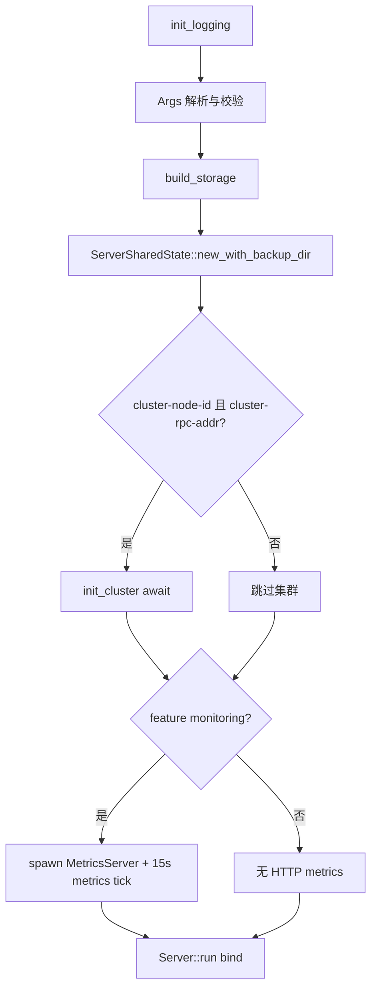

# Cursor transcript

---

## 1. User

## 文档整理 — 新会话

工作目录: `<workspace>` (含 aidb/、aikv/、aifactory/)

请先阅读 (不要跳过):
1. `AiKv-Workflow/backup/design.md` — 总规程
2. `AiKv-Workflow/backup/PROGRESS.md` — 当前进度
3. `AiKv-Workflow/backup/INDEX.md` — 本章索引 (若已有行则更新)

---

### 本次任务

| 项 | 值 |
|----|-----|
| PROGRESS 总步 | 21 (阶段 2b 第 3 篇) |
| 目标文件 | `aikv/DEPLOYMENT.md` |
| 本次子步 | 从步 0 开始 |
| 对比深度 | **模块级** (汇总文档; 构建/CLI/端口/集群运维, 不加深章逐段) |

### 必须遵守

- **确认门控**: 步 0→1→2→3→4, 每步先讨论, 我确认后再下一步
- **步 4**: 先出 **正文草稿**, 我确认后再写入 `aikv/`、更新 INDEX/PROGRESS
- **汇总文档**: **不必** Module Skill frontmatter; 写 **怎么构建、怎么跑、端口与 feature**; 不重复 DESIGN 的 why
- **过程只进 backup/**: INDEX; aikv 不写迁移历史
- **旧文档顺序**: `backup/aikv/DEPLOYMENT.md` (主) → `aikv-oldmain` (`docs/guide/`, `docs/development/architecture/03-cluster.md`) → `wiqun-factory/docs/MONITORING.md` (查漏) → WiQunTools 查漏 → `wiqun-kv`
- **待核实**: 根文档至多简要提及; 详情仍引用 `aikv/ISSUES.md` (不展开排查过程)
- **步 4 落盘前**: 对照 design.md 验收项 — CLI/端口与 `main.rs` 一致、链有效、与 ARCHITECTURE/DESIGN/modules 不矛盾

### 上下文 (上一篇已完成)

- 步 20 ✅: [`aikv/DESIGN.md`](aikv/DESIGN.md) 已落盘 (跨模块 why / trade-off / 决策总表)
- 步 19 ✅: [`aikv/ARCHITECTURE.md`](aikv/ARCHITECTURE.md) (分层、数据流、AiDb 边界)
- 阶段 1 modules 7 篇全部 ✅; aidb 汇总步 13–18 ✅
- 旧稿: [`AiKv-Workflow/backup/aikv/DEPLOYMENT.md`](AiKv-Workflow/backup/aikv/DEPLOYMENT.md) (**CLI 过时**: `--port`/`--bind`/`--cluster-mode` 等, 以 **`aikv/src/main.rs` `Args`** 为准)
- 当前 `aikv/` **尚无** 根目录 `DEPLOYMENT.md` (步 4 新建)
- `ISSUES.md` 已有 ISSUE-001~023
- 本会话归档参考: [`aikv/archive/20-design.md`](aikv/archive/20-design.md); aidb 同类: [`aidb/DEPLOYMENT.md`](aidb/DEPLOYMENT.md)、[`aidb/archive/15-deployment.md`](aidb/archive/15-deployment.md)

### 边界提示 (步 0 可细化)

**DEPLOYMENT.md** — 回答「怎么构建、怎么启动、端口与目录、集群怎么配、监控怎么开」:

- 宜含: 系统要求; **Cargo feature** (`cluster`, `monitoring`, 传递 `aidb/*`); **构建/CI** 命令 (与 `AGENTS.md` 互链, 不重复全文); **CLI 表** (`--bind`, `--engine`, `--data-dir`, cluster 相关 `--cluster-*`, `--metrics-*`, `--max-clients` 等 — 对照 `main.rs`)
- 宜含: 单机 **memory / aidb** 启动示例; **集群** 多节点示例 (RESP `bind`, MetaRaft `cluster-rpc-addr`, 数据面 `rpc_port + cluster-data-port-offset`); `../aidb` sibling 布局
- 宜含: HTTP `/metrics`、环境变量 (`RUST_LOG`, `AIKV_JSON_LOG`, `AIKV_OTLP_ENDPOINT` 等 — 对照 `main.rs` / observability module); 可选链 `e2e/*.sh`
- 宜含: 备份/持久化运维摘要 (`SAVE`/`BGSAVE` → aidb Checkpoint; **非** 标准 RDB 主路径 — 一句链 DESIGN/storage)
- 宜链: [`aidb/DEPLOYMENT.md`](aidb/DEPLOYMENT.md) (protoc、aidb 数据目录、库侧 cluster — **不重复** LSM 运维细节)
- 不重复: ARCHITECTURE 分层/数据流; DESIGN trade-off; modules 命令表; AGENTS 全文

**与相邻文档分工**

| 文档 | 回答 |
|------|------|
| [`ARCHITECTURE.md`](aikv/ARCHITECTURE.md) | 是什么、分层、数据流、端口在架构中的角色 |
| [`DESIGN.md`](aikv/DESIGN.md) | 为什么选 feature gate、为何无 RDB 主路径等 |
| **DEPLOYMENT.md (本篇)** | **构建、运行、CLI、端口、集群部署、监控 scrape** |
| [`CONTRIBUTING.md`](aikv/CONTRIBUTING.md) (步 23) | CI/hook/贡献流程细节 |
| `docs/modules/*.md` | 域级实现 |

### 本次不要

- 不要跳过未确认的步骤
- 不要一步写步 22+ 或其它 aikv 根文档
- 不要修改 `design.md` / 流程, 除非我明确要求
- 不要 commit, 除非我明确要求

---

请从步 0 开始, 给出本步交付物, 等我确认。

---

## 2. Assistant

先阅读规程、进度与索引, 并对照 `main.rs` 与旧稿梳理 DEPLOYMENT 文档范围。

**Tool `Read`**

```json
{
  "path": "../../../AiKv-Workflow/backup/design.md"
}
```


**Tool `Read`**

```json
{
  "path": "../../../AiKv-Workflow/backup/PROGRESS.md"
}
```


**Tool `Read`**

```json
{
  "path": "../../../AiKv-Workflow/backup/INDEX.md"
}
```


**Tool `Read`**

```json
{
  "path": "../../src/main.rs",
  "limit": 200
}
```


---

## 3. Assistant

继续对照 aidb 同类文档、`Cargo.toml` 与旧稿, 细化步 0 范围.

**Tool `Read`**

```json
{
  "path": "../../../aidb/DEPLOYMENT.md",
  "limit": 120
}
```


**Tool `Read`**

```json
{
  "path": "../../../AiKv-Workflow/backup/aikv/DEPLOYMENT.md",
  "limit": 100
}
```


**Tool `Read`**

```json
{
  "path": "../../Cargo.toml"
}
```


**Tool `Grep`**

```json
{
  "pattern": "AIKV_|RUST_LOG|OTLP",
  "path": "../../../aikv"
}
```


**Tool `Glob`**

```json
{
  "glob_pattern": "e2e/*",
  "target_directory": "../../../aikv"
}
```


---

## 4. Assistant

**Tool `Read`**

```json
{
  "offset": 200,
  "path": "../../src/main.rs"
}
```


**Tool `Read`**

```json
{
  "limit": 80,
  "path": "../../AGENTS.md"
}
```


**Tool `Grep`**

```json
{
  "path": "../../ARCHITECTURE.md",
  "pattern": "端口|6379|9191|cluster"
}
```


**Tool `Glob`**

```json
{
  "glob_pattern": "**/03-cluster*",
  "target_directory": "../../../aikv-oldmain"
}
```


**Tool `Read`**

```json
{
  "limit": 80,
  "path": "../../archive/15-deployment.md"
}
```


---

## 5. Assistant

**Tool `Read`**

```json
{
  "offset": 100,
  "path": "../../../AiKv-Workflow/backup/aikv/DEPLOYMENT.md"
}
```


**Tool `Read`**

```json
{
  "limit": 60,
  "path": "../../e2e/README.md"
}
```


**Tool `Glob`**

```json
{
  "glob_pattern": "**/guide/**",
  "target_directory": "../../../aikv-oldmain"
}
```


---

## 6. Assistant

**Tool `Grep`**

```json
{
  "path": "../../../aikv",
  "pattern": "AIKV_EXTERNAL_HOST"
}
```


**Tool `Read`**

```json
{
  "limit": 80,
  "path": "../../../aikv-oldmain/docs/guide/02-deployment.md"
}
```


---

## 7. Assistant

**Tool `Grep`**

```json
{
  "path": "../../src/server",
  "pattern": "/health|health"
}
```


**Tool `Read`**

```json
{
  "limit": 50,
  "path": "../../archive/20-design.md"
}
```


---

## 8. Assistant

## 步 0 — 定范围

**PROGRESS 步 21** · 目标 `aikv/DEPLOYMENT.md` · 对比深度 **模块级** (汇总文档)

---

### 1. 本章定位

| 项 | 内容 |
|----|------|
| 回答 | **怎么构建、怎么启动、CLI/端口/目录、集群怎么配、监控怎么 scrape** |
| 文档类型 | 阶段 2b 汇总; **无** Module Skill frontmatter |
| 权威源码 | 以 `aikv/src/main.rs` `Args` + `init_cluster` + `init_logging` 为准 |
| 参照范本 | [`aidb/DEPLOYMENT.md`](aidb/DEPLOYMENT.md) (篇幅与互链风格) |

---

### 2. 覆盖 `src/` 与入口 (模块级)

汇总文档不绑单一 domain, 但运维面代码入口如下:

| 优先级 | 路径 | 步 1 关注点 |
|--------|------|------------|
| **主** | `src/main.rs` | `Args` CLI; `build_storage`; `init_cluster`; `init_logging` / OTel; metrics spawn; 启动顺序 |
| **辅** | `Cargo.toml` | `cluster` / `monitoring` feature 及 `aidb/*` 传递 |
| **辅** | `src/server/metrics_server.rs` | `/metrics`, `/health` (`[monitoring]`) |
| **辅** | `src/cluster/state.rs` | `DEFAULT_DATA_PORT_OFFSET` (默认 10000) |
| **辅** | `src/cluster/announce.rs` | `AIKV_CLUSTER_ANNOUNCE_MODE` |
| **引用** | `src/storage/*` | `--engine`, `--data-dir`, `--backup-dir`; cluster 时 `ClusterDataAdapter` |
| **引用** | `src/command/persistence*` (via modules) | `SAVE`/`BGSAVE` → aidb checkpoint (一句链 DESIGN, 不展开) |
| **工程** | `AGENTS.md`, `.github/workflows/ci.yml`, `rust-toolchain.toml`, `install-hooks.sh` | 构建/CI (互链, 不重复全文) |
| **验证** | `e2e/*.sh`, `e2e/utils.sh`, `e2e/README.md` | 可选启动/集群 smoke 链 |

**不纳入步 1 深读**: `protocol/`, `command/*` 命令表, `cluster/router` 语义 — 已由 modules + ARCHITECTURE 覆盖, DEPLOYMENT 只写 **启动参数与端口角色**.

---

### 3. 拟读文件列表

#### 步 1 — 新代码 (权威)

1. `aikv/src/main.rs` (全文)
2. `aikv/Cargo.toml`
3. `aikv/AGENTS.md` + `aikv/.github/README.md` + `.github/workflows/ci.yml`
4. `aikv/rust-toolchain.toml`
5. `aikv/src/server/metrics_server.rs` (HTTP 端点)
6. `aikv/src/cluster/state.rs`, `announce.rs` (env / port offset)
7. `aikv/e2e/README.md` + `e2e/utils.sh` + 代表脚本: `test_cluster_formation.sh`, `test_cluster_3node_routing.sh`, `test_persistence.sh`

#### 步 2 — 旧文档 (按规程顺序)

| 序 | 路径 | 预期用途 |
|----|------|----------|
| 1 | `AiKv-Workflow/backup/aikv/DEPLOYMENT.md` | **主参考**; CLI/集群示例多处过时 |
| 2 | `aikv-oldmain/docs/guide/02-deployment.md` | 部署形态查漏 |
| 3 | `aikv-oldmain/docs/guide/01-quick-start.md` | 快速启动查漏 |
| 4 | `aikv-oldmain/docs/development/architecture/03-cluster.md` | 集群端口/运维概念 (跳过协议细节) |
| 5 | `wiqun-factory/docs/MONITORING.md` | scrape / OTLP / Loki 运维流程提炼 |
| 6 | WiQunTools `wiqun-kv-inventory` | 查漏, 不迁入表格 |
| 7 | `wiqun-kv` | 与 backup 重叠时二选一 |

#### 步 2 — 相邻文档 (边界对照, 不重写)

- [`aikv/ARCHITECTURE.md`](aikv/ARCHITECTURE.md) — 端口在架构中的角色
- [`aikv/DESIGN.md`](aikv/DESIGN.md) — feature gate / 无 RDB 主路径等 **why**
- [`aidb/DEPLOYMENT.md`](aidb/DEPLOYMENT.md) — protoc、aidb 数据目录、库侧 cluster
- modules: [`cluster.md`](aikv/docs/modules/cluster.md), [`observability.md`](aikv/docs/modules/observability.md), [`storage.md`](aikv/docs/modules/storage.md), [`commands-extended.md`](aikv/docs/modules/commands-extended.md) (SAVE/BGSAVE)
- [`aikv/ISSUES.md`](aikv/ISSUES.md) — 根文档至多一行引用

---

### 4. 章节边界

#### 宜写 (IN)

1. **系统要求** — Rust stable、`../aidb` sibling、cluster 需 protoc (链 aidb)
2. **Cargo feature** — `cluster`, `monitoring`, 传递 `aidb/cluster`, `aidb/monitoring`; 常见 `cargo build/run` 组合
3. **构建与验证** — 与 `AGENTS.md` 互链; `RUSTFLAGS`, clippy/test 矩阵要点 (全文留 CONTRIBUTING 步 23)
4. **CLI 完整表** — 对照 `main.rs` `Args` (含 cluster / raft / gossip / metrics / max-clients)
5. **单机示例** — `memory` vs `aidb --data-dir`; `--backup-dir` 默认
6. **集群示例** — 3 节点: `--bind`, `--cluster-node-id`, `--cluster-rpc-addr`, `--cluster-peers`, `data_port = rpc + --cluster-data-port-offset`; bootstrap vs join
7. **环境变量** — `RUST_LOG`, `AIKV_JSON_LOG`, `AIKV_OTLP_ENDPOINT`, `AIKV_CLIENT_ADDR`, `AIKV_CLUSTER_ANNOUNCE_MODE` (对照现码)
8. **监控** — `[monitoring]` 下 `/metrics` (默认 `127.0.0.1:9191`), `/health`; 可选 wiqun-factory 提炼 scrape 流程
9. **持久化运维摘要** — `SAVE`/`BGSAVE` → aidb Checkpoint; **非** 标准 RDB 主路径 (一句链 DESIGN)
10. **e2e** — 可选链 `e2e/*.sh` 与 `WIKV_HOST`/`WIKV_PORT`
11. **ISSUES** — 根文档一行 (如 ISSUE-020~023 与 metrics/observability 相关)

#### 不写 (OUT)

| 内容 | 归属 |
|------|------|
| 分层 / 数据流 / AiDb 边界表 | `ARCHITECTURE.md` |
| 为何 cluster feature gate、为何无 RDB | `DESIGN.md` |
| 命令语义、MOVED/ASK 细节 | `docs/modules/*.md` |
| CI hook / PR 流程全文 | `CONTRIBUTING.md` (步 23) |
| ISSUES 排查过程 | `ISSUES.md` |
| `aikv-tool` / Milestone 历史 | oldmain 过时, 不写入 |

---

### 5. 步 0 已发现的边界风险 (供后续步 2–3 核实)

旧稿 [`backup/aikv/DEPLOYMENT.md`](AiKv-Workflow/backup/aikv/DEPLOYMENT.md) 与现码已知偏差 (步 1 将以 `main.rs` 为准重写):

| 旧稿 | 现码 |
|------|------|
| `--port` + `--bind` 分离 | 单一 `--bind host:port` (默认 `127.0.0.1:6379`) |
| `--cluster-mode` | `--cluster-node-id` + `--cluster-rpc-addr` (+ 可选 `--cluster-peers`) |
| `--cluster-addr`, `--node-id` (字符串) | `--cluster-rpc-addr`, `--cluster-node-id` (u64) |
| `AIKV_EXTERNAL_HOST` | **代码中不存在**; 现用 `AIKV_CLIENT_ADDR` |
| Docker `CMD ... --port 6379` | 应 `--bind 0.0.0.0:6379` |
| `/health`、部分指标名 | 仍有效; 指标前缀以 observability module 为准 (`aikv_*`) |
| oldmain `aikv-tool cluster setup` | 工具链已不在目标结构, **跳过** |

集群模式 **强制** `--data-dir` (`main.rs` L641–644); memory 引擎启动会 stderr WARN.

---

### 6. 拟写大纲 (步 4 草稿骨架, 步 0 仅定结构)

1. 引言 + 文档分工表 (ARCHITECTURE / DESIGN / DEPLOYMENT / modules)
2. 系统要求
3. Cargo feature 矩阵
4. 构建与验证 (链 AGENTS / aidb DEPLOYMENT)
5. 仓库布局 (`<workspace>/aikv` + `../aidb`)
6. 单机部署 (memory / aidb 示例)
7. 集群部署 (CLI 表 + 多节点示例 + env + 槽位/MEET 简要)
8. 监控与可观测性 (HTTP、env、可选 observability 栈)
9. 备份与持久化运维 (SAVE/BGSAVE 摘要)
10. 环境变量汇总表
11. 相关文档
12. 待核实 (链 ISSUES, 若有)

目标篇幅: 与 [`aidb/DEPLOYMENT.md`](aidb/DEPLOYMENT.md) 相近 (~200 行量级), 不膨胀为 oldmain 600+ 行指南.

---

### 7. 拟更新 INDEX 行 (你确认步 0 后写入 `backup/INDEX.md`)

| 新文档章节 | 状态 | 参考的旧文档 | 处理 | 备注 |
|------------|------|--------------|------|------|
| `DEPLOYMENT.md` (汇总) | 🔄 步 0 | `backup/aikv/DEPLOYMENT.md` (主); oldmain `guide/02-deployment`, `architecture/03-cluster`; wiqun-factory `MONITORING.md`; WiQunTools/wiqun-kv 查漏 | 待步 4 | 模块级; CLI 以 `main.rs` 为准; 链 `aidb/DEPLOYMENT.md` |

---

**步 0 交付物**: 上文 **范围清单 + 拟读文件 + 章节边界 + 大纲 + INDEX 拟行**.

请确认或调整 (例如: 是否要保留 WSL2/GUI 客户端小节、Docker 示例详略、监控告警阈值表是否写入). 确认后进入 **步 1 — 读新代码**.

---

## 9. User

可以

---

## 10. Assistant

步 0 已确认. 开始步 1: 以当前源码为准梳理职责、代码地图与主流程要点.

**Tool `Read`**

```json
{
  "path": "../../.github/workflows/ci.yml"
}
```


**Tool `Read`**

```json
{
  "path": "../../e2e/utils.sh"
}
```


**Tool `Read`**

```json
{
  "limit": 120,
  "path": "../../e2e/test_cluster_formation.sh"
}
```


**Tool `Grep`**

```json
{
  "path": "../../src/cluster/state.rs",
  "pattern": "DEFAULT_DATA_PORT_OFFSET"
}
```


**Tool `Read`**

```json
{
  "path": "../../src/server/metrics_server.rs",
  "limit": 120
}
```


---

## 11. Assistant

**Tool `Grep`**

```json
{
  "path": "../../src",
  "pattern": "backup_dir|BGSAVE|SAVE",
  "glob": "*.rs",
  "head_limit": 40
}
```


**Tool `Read`**

```json
{
  "path": "../../rust-toolchain.toml"
}
```


**Tool `Grep`**

```json
{
  "path": "../../src/server",
  "pattern": "max_clients|backup_dir"
}
```


---

## 12. Assistant

**Tool `Read`**

```json
{
  "offset": 110,
  "limit": 40,
  "path": "../../src/server/config.rs"
}
```


**Tool `Read`**

```json
{
  "limit": 80,
  "path": "../../src/command/persistence.rs"
}
```


**Tool `Grep`**

```json
{
  "path": "../../../aikv",
  "pattern": "monitoring",
  "glob": "Cargo.toml"
}
```


**Tool `Read`**

```json
{
  "limit": 50,
  "path": "../../.github/README.md"
}
```


---

## 13. Assistant

**Tool `Grep`**

```json
{
  "path": "../../src/main.rs",
  "pattern": "cluster_node_id|cluster_rpc"
}
```


**Tool `Read`**

```json
{
  "limit": 30,
  "path": "../../src/cluster/announce.rs"
}
```


---

## 14. Assistant

## 步 1 — 读新代码

以 `main.rs` `Args` 与启动链为准, 梳理 DEPLOYMENT 相关职责、代码地图与主流程.

---

### 1. 职责 (DEPLOYMENT 视角)

| 域 | 职责 | 入口 |
|----|------|------|
| **进程入口** | CLI 解析、校验、按序启动各子系统 | `src/main.rs` |
| **存储选型** | `memory` / `aidb`; cluster+aidb 时 `ClusterDataAdapter` 包裹 | `build_storage()` |
| **集群 wiring** | MetaRaft/MultiRaft/Router/Lifecycle/Gossip 启动; 端口推算 | `init_cluster()` (`[cluster]`) |
| **连接与运维状态** | `max_clients`, `backup_dir`, metrics 句柄, CONFIG 占位 | `ServerSharedState` (`server/config.rs`) |
| **HTTP 可观测** | `/metrics`, `/health`, `/` (仅 `[monitoring]`) | `server/metrics_server.rs` |
| **日志/追踪** | JSON tracing + 可选 OTel | `init_logging()`, `create_otel_tracer()` |
| **持久化运维** | `SAVE`/`BGSAVE` → flush + aidb checkpoint | `command/persistence.rs` (DEPLOYMENT 只摘要) |
| **工程/验证** | CI、e2e 启动模式 | `Cargo.toml`, `.github/workflows/ci.yml`, `e2e/utils.sh` |

**关键约束 (文档必写)**:

- **默认 feature 为空** — `cargo build` 不含 `cluster` / `monitoring`; 开发与 CI 以 `--features cluster` 为主.
- **`--engine aidb` 必须 `--data-dir`**; 非 cluster 的 `memory` 会 stderr WARN 数据不持久.
- **集群** 需 **同时** `--cluster-node-id` + `--cluster-rpc-addr` + **`--data-dir`**; 缺一对则 **不** 走 `init_cluster` (静默当单机).
- **`--metrics-port` / `--metrics-addr`** 始终可解析, 但 **仅 `[monitoring]`** 才 bind HTTP.
- **三端口模型**: RESP `--bind` · MetaRaft `--cluster-rpc-addr` · 数据 Raft `rpc_port + --cluster-data-port-offset` (默认 10000).

---

### 2. 代码地图

```shell
aikv/
├── Cargo.toml                 # features: cluster, monitoring; aidb path ../aidb
├── rust-toolchain.toml        # stable + clippy/rustfmt
├── src/
│   ├── main.rs                # Args, build_storage, init_cluster, init_logging, main 启动序
│   ├── server/
│   │   ├── config.rs          # ServerSharedState; backup_dir 默认 {data_dir}/backup
│   │   └── metrics_server.rs  # [monitoring] /metrics /health
│   ├── storage/
│   │   ├── memory.rs          # --engine memory
│   │   ├── aidb.rs            # --engine aidb --data-dir
│   │   └── cluster_adapter.rs # [cluster] aidb 数据面写路由
│   ├── cluster/
│   │   ├── state.rs           # DEFAULT_DATA_PORT_OFFSET = 10000
│   │   └── announce.rs        # AIKV_CLUSTER_ANNOUNCE_MODE
│   └── command/
│       └── persistence.rs     # SAVE/BGSAVE → checkpoint (运维摘要用)
├── AGENTS.md                  # 构建/CI 入口 (互链)
├── .github/workflows/ci.yml   # cluster 测试 + e2e
└── e2e/
    ├── utils.sh               # start_server / start_cluster_node 范式
    └── test_cluster_*.sh      # 集群 smoke (CI 跑)
```

**Monorepo 布局**: `<workspace>/aikv` + sibling `aidb`; CI 用 `ln -sf .aidb ../aidb`.

---

### 3. Cargo feature (现码)

| Feature | 默认 | 启用 |
|---------|------|------|
| (none) | ✅ | 单机 RESP; 无 cluster init; 无 HTTP metrics |
| `cluster` | ❌ | `src/cluster/*`, `cluster_adapter`, `init_cluster`; `aidb/cluster` |
| `monitoring` | ❌ | Prometheus registry + `MetricsServer` + OTel; `aidb/monitoring` |

**常见命令**:

```bash
cargo build --release --features cluster              # 与 CI/e2e 一致
cargo build --release --features cluster,monitoring   # 生产 scrape + OTel
cargo run --release --features cluster -- --bind 127.0.0.1:6379 --engine aidb --data-dir /var/lib/aikv
```

`cluster` 本地 clippy/测试需 **protoc** (链 [`aidb/DEPLOYMENT.md`](../aidb/DEPLOYMENT.md)).

---

### 4. CLI 表 (对照 `main.rs` `Args`)

| 参数 | 默认 | 条件 | 说明 |
|------|------|------|------|
| `--bind` | `127.0.0.1:6379` | 始终 | RESP 客户端 TCP |
| `--engine` | `memory` | 始终 | `memory` \| `aidb` |
| `--data-dir` | — | `aidb` 必填; cluster 必填 | AiDb 数据目录 |
| `--backup-dir` | `{data_dir}/backup` | 可选 | SAVE/BGSAVE checkpoint 目标 |
| `--cluster-node-id` | — | `[cluster]` | u64 节点 ID |
| `--cluster-rpc-addr` | — | `[cluster]` | MetaRaft gRPC `host:port` |
| `--cluster-peers` | `[]` | `[cluster]` | 已有节点 RPC 列表 (逗号分隔); 空 = bootstrap |
| `--raft-election-timeout-min` | `1000` | `[cluster]` | ms |
| `--raft-election-timeout-max` | `2000` | `[cluster]` | ms |
| `--raft-rpc-timeout-ms` | `500` | `[cluster]` | 须 < election_timeout_min |
| `--raft-heartbeat-interval` | `300` | `[cluster]` | 须 < election_timeout_min |
| `--lifecycle-tick-ms` | `1000` | `[cluster]` | LifecycleManager |
| `--gossip-interval` | `1` | `[cluster]` | 秒 |
| `--config-auto-save-ms` | `2000` | `[cluster]` | 集群配置自动保存 |
| `--cluster-data-port-offset` | `10000` | `[cluster]` | `data_port = rpc_port + offset`; 全集群一致 |
| `--metrics-port` | `9191` | 始终可传 | **仅 `[monitoring]` 生效** |
| `--metrics-addr` | `127.0.0.1` | 始终可传 | 同上 |
| `--max-clients` | `10000` | 始终 | `0` = 不限制 |

---

### 5. 环境变量

| 变量 | 默认/条件 | 作用 |
|------|-----------|------|
| `RUST_LOG` | 默认 directive `info` | tracing `EnvFilter` |
| `AIKV_JSON_LOG` | 默认 `true` | JSON vs compact 日志 |
| `AIKV_OTLP_ENDPOINT` | 空则跳过 | `[monitoring]` OTel gRPC exporter |
| `AIKV_CLIENT_ADDR` | 从 `rpc_host` + `--bind` port 推导 | 写入 MetaRaft `client_addr`; 后台 sync |
| `AIKV_CLUSTER_ANNOUNCE_MODE` | 默认 `unknown` | `fixed` \| `unknown` → MOVED/CLUSTER SLOTS 通告 |

**不存在于现码**: `AIKV_EXTERNAL_HOST` (旧 backup 稿有误).

---

### 6. 启动主流程



**`init_cluster` 要点** (DEPLOYMENT 写示例即可, 细节链 modules):

1. 打开/复用 DB (`use_wal: true`; aidb 引擎复用 `AiDbEngine` 的 DB).
2. 启动 MetaRaft gRPC 于 `--cluster-rpc-addr`.
3. 推算并启动 MultiRaft 数据面于 `rpc_port + offset`.
4. `AIKV_CLIENT_ADDR` → 后台 propose 到 MetaRaft.
5. peers 空 = bootstrap; 非空 = join (gRPC 自动发现).
6. 注册 `CLUSTER_STATE_MGR`, Gossip, LeaderChangeWatcher, ConfigAutoSave.

**端口示例** (e2e `utils.sh` 范式, 节点 index 0):

| 角色 | 示例 |
|------|------|
| RESP | `--bind 127.0.0.1:20000` |
| MetaRaft | `--cluster-rpc-addr 127.0.0.1:20001` |
| 数据 Raft | `20001 + 10000 = 120001` → 实际需保证 `rpc_port + offset ≤ 65535` |

e2e 用 `--engine memory` + `--data-dir` (cluster 仍要 data_dir); 生产推荐 `--engine aidb`.

---

### 7. 构建 / CI / e2e (摘要)

| 项 | 现码 |
|----|------|
| 工具链 | `rust-toolchain.toml` stable + clippy/rustfmt |
| 本地 | `AGENTS.md`: `RUSTFLAGS='-D warnings'`, clippy/test **`--features cluster`** |
| CI | `test-cluster` → clippy + test; 并行 `test-server-stress`, `test-commands-slow`, `e2e` |
| e2e | `cargo build --release --features cluster`; 跑 `e2e/test_cluster_*.sh`; 需 `redis-cli` |
| 单机 e2e | `WIKV_HOST`/`WIKV_PORT`; `start_server` 用 `--engine memory` |

CI **不** 单独 job `monitoring` — 与 aidb 同类, 本地可 `cargo build --features cluster,monitoring`.

---

### 8. 监控端点 (`[monitoring]`)

| 路径 | 响应 |
|------|------|
| `/metrics` | Prometheus text; `Content-Type: text/plain; version=0.0.4` |
| `/health` | `200 OK`, body `OK` |
| `/` | HTML 索引页 |

监听 `--metrics-addr:--metrics-port` (默认 `127.0.0.1:9191`). 15s 后台 tick 刷新 uptime/process metrics.

---

### 9. 持久化运维 (DEPLOYMENT 一句 + 示例)

- 仅 **`--engine aidb`**; memory 返回 `ERR Persistence not supported on memory engine`.
- `SAVE`/`BGSAVE`: `flush_engine` + `create_checkpoint(backup_dir)`; 默认目录 `{data_dir}/backup`.
- **非** Redis RDB 主路径; `CONFIG GET dbfilename` 占位 `dump.rdb` 仅为兼容探测 (见 `server/config.rs` 注释).

---

### 10. 步 4 文档可直引的启动示例 (草稿级)

**单机 memory (开发)**:

```bash
cargo run --release --features cluster -- \
  --bind 127.0.0.1:6379 --engine memory
```

**单机 aidb (生产)**:

```bash
cargo run --release --features cluster,monitoring -- \
  --bind 0.0.0.0:6379 \
  --engine aidb --data-dir /var/lib/aikv/data \
  --metrics-port 9191
```

**集群首节点 (bootstrap)**:

```bash
cargo run --release --features cluster -- \
  --bind 127.0.0.1:6379 \
  --engine aidb --data-dir /var/lib/aikv/node1 \
  --cluster-node-id 1 \
  --cluster-rpc-addr 127.0.0.1:16379
```

**集群加入节点**:

```bash
cargo run --release --features cluster -- \
  --bind 127.0.0.1:6380 \
  --engine aidb --data-dir /var/lib/aikv/node2 \
  --cluster-node-id 2 \
  --cluster-rpc-addr 127.0.0.1:16380 \
  --cluster-peers 127.0.0.1:16379
```

随后 `CLUSTER MEET` / `ADDSLOTS` 见 e2e 与 [`docs/modules/cluster.md`](aikv/docs/modules/cluster.md).

---

**步 1 交付物**: 上文职责表、代码地图、feature/CLI/env、启动流程、CI/e2e 与运维摘要.

请确认或指出需补充/修正处 (例如: 是否在 DEPLOYMENT 强调「缺 cluster CLI 对时静默单机」、monitoring 无 CI job 的写法). 确认后进入 **步 2 — 查旧文档**.

---

## 15. User

可以

---

## 16. Assistant

步 1 已确认. 开始步 2: 按规程顺序查阅旧文档并分类.

**Tool `Read`**

```json
{
  "path": "../../../AiKv-Workflow/backup/aikv/DEPLOYMENT.md"
}
```


**Tool `Read`**

```json
{
  "limit": 150,
  "path": "../../../aikv-oldmain/docs/guide/02-deployment.md"
}
```


**Tool `Read`**

```json
{
  "limit": 120,
  "path": "../../../aikv-oldmain/docs/guide/01-quick-start.md"
}
```


**Tool `Read`**

```json
{
  "limit": 120,
  "path": "../../../aikv-oldmain/docs/development/architecture/03-cluster.md"
}
```


**Tool `Read`**

```json
{
  "limit": 150,
  "path": "../../../wiqun-factory/docs/MONITORING.md"
}
```


---

## 17. Assistant

**Tool `Grep`**

```json
{
  "pattern": "deploy|DEPLOY|9191|cluster-rpc|aikv-tool",
  "path": "../../../WiQunTools/docs/wiqun-kv-inventory",
  "head_limit": 40
}
```


**Tool `Glob`**

```json
{
  "glob_pattern": "**/DEPLOYMENT*",
  "target_directory": "../../../wiqun-kv"
}
```


**Tool `Grep`**

```json
{
  "path": "../../../aikv-oldmain/docs/guide/02-deployment.md",
  "pattern": "--cluster|--bind|--port|cluster-mode",
  "head_limit": 30
}
```


**Tool `Grep`**

```json
{
  "path": "../../ISSUES.md",
  "pattern": "ISSUE-020|ISSUE-021|ISSUE-022|ISSUE-023"
}
```


---

## 18. Assistant

**Tool `Read`**

```json
{
  "limit": 80,
  "path": "../../../wiqun-kv/DEPLOYMENT.md"
}
```


**Tool `Grep`**

```json
{
  "path": "../../docs/modules/observability.md",
  "pattern": "kv_command|aikv_command|slow_queries"
}
```


**Tool `Read`**

```json
{
  "offset": 150,
  "limit": 100,
  "path": "../../../aikv-oldmain/docs/guide/02-deployment.md"
}
```


---

## 19. Assistant

**Tool `Grep`**

```json
{
  "path": "../../src/server/metrics.rs",
  "pattern": "register_|aikv_|kv_",
  "head_limit": 30
}
```


**Tool `Read`**

```json
{
  "limit": 40,
  "path": "../../archive/12-observability.md",
  "offset": 430
}
```


---

## 20. Assistant

**Tool `Grep`**

```json
{
  "path": "../../src/server",
  "pattern": "opts!\\(|register_|aikv_",
  "glob": "*metrics*"
}
```


**Tool `Read`**

```json
{
  "limit": 80,
  "path": "../../docs/modules/observability-reference.md"
}
```


---

## 21. Assistant

**Tool `Grep`**

```json
{
  "path": "../../docs/modules/cluster.md",
  "pattern": "CLUSTER MEET",
  "head_limit": 15
}
```


**Tool `Glob`**

```json
{
  "glob_pattern": "scripts/cluster*",
  "target_directory": "../../../aikv"
}
```


---

## 22. Assistant

**Tool `Grep`**

```json
{
  "head_limit": 20,
  "path": "../../../aikv-oldmain/docs/guide/04-best-practices.md",
  "pattern": "deploy|9191|cluster|AIKV"
}
```


---

## 23. Assistant

## 步 2 — 查旧文档

按规程顺序查阅旧稿, 对照步 1 现码结论, 给出分类与步 4 写法建议.

---

### 1. 旧文档清单与分类

| 序 | 路径 | 分类 | 结论 |
|----|------|------|------|
| 1 | `backup/aikv/DEPLOYMENT.md` | **仍有效 (部分)** | 系统要求、feature 构建、`cluster-data-port-offset`、MEET/ADDSLOTS 流程、WSL2 通告场景、`/health`、SAVE/BGSAVE 示例 **可提炼**; **过时**: `--port`/`--bind` 分离、`--cluster-mode`/`--cluster-addr`/`--node-id`、`AIKV_EXTERNAL_HOST`、Docker `CMD --port`、指标名 `kv_*`、未写 **`monitoring` feature** 才启用 HTTP metrics |
| 2 | `aikv-oldmain/docs/guide/02-deployment.md` | **已过时** | `aikv-tool`、`--config config.toml`、`--host`/`--port`、`config/aikv.toml`、systemd 用配置文件 — 现码 **无** TOML 配置入口 |
| 2 | `aikv-oldmain/docs/guide/01-quick-start.md` | **已过时** | 主推 `aikv-tool cluster setup`; Docker/`--config` 路径失效 |
| 2 | `aikv-oldmain/docs/guide/04-best-practices.md` | **查漏跳过** | 几乎全是 `aikv-tool`; 无新部署事实 |
| 2 | `aikv-oldmain/docs/development/architecture/03-cluster.md` | **仍有效 (概念)** | Raft vs Redis gossip、`redis-cli --cluster create` 易 hang、MEET 后需等待同步 — **运维提示** 可收一句; **过时**: `aikv-tool`、`./scripts/cluster_init.sh` (现仓库 **无** 此脚本) |
| 3 | `wiqun-factory/docs/MONITORING.md` | **仍有效 (运维查漏)** | scrape 流程、9191 端口规划、OTLP/Loki/Promtail 拓扑、防火墙 — **提炼进 DEPLOYMENT §监控**; 环境变量 `WIQUN_*` → 现 `AIKV_*` + CLI; Grafana 面板 `wiqun_kv_*` PromQL → 现 `aikv_*` (链 observability-reference) |
| 3 | `WiQunTools/.../08-observability.md` | **跳过** | observability module 步 12 已消化; 仅确认指标前缀 `aikv_*` |
| 4 | `wiqun-kv/DEPLOYMENT.md` | **跳过** | 与 `backup/aikv/DEPLOYMENT.md` 同构 (wiqun 命名); 二选一 |

---

### 2. 旧文档 vs 现码 — 关键对照 (DEPLOYMENT 应如何写)

| 主题 | 旧文档说法 | 现码 (步 1) | 文档应如何写 |
|------|-----------|-------------|-------------|
| 监听地址 | `--bind` + `--port` 或 `--host` + `--port` | 单一 `--bind host:port` | 全文统一 `--bind`; 示例不用 `--port` |
| 集群开关 | `--cluster-mode` | `--cluster-node-id` **且** `--cluster-rpc-addr` | 写 **成对必填**; 缺一则静默单机 (可选 footnote) |
| 集群 RPC | `--cluster-addr` | `--cluster-rpc-addr` | 替换命名; 说明 MetaRaft gRPC 端口 |
| 节点 ID | `--node-id node-6379` (字符串) | `--cluster-node-id 1` (u64) | 数字 ID; 与 `CLUSTER MYID` hex 不同层 |
| 集群 data-dir | 旧稿 cluster 示例常无 | cluster **强制** `--data-dir` | 所有 cluster 示例带 `--data-dir` |
| 构建默认 | `cargo build --release` 即可 | 默认 feature **空** (无 cluster) | 写 `--features cluster`; 生产加 `monitoring` |
| Metrics | 只写 `--metrics-port 9191` | HTTP 仅 `[monitoring]` | **必须** `--features monitoring`; 否则 CLI 无效 |
| 外部 client 地址 | `AIKV_EXTERNAL_HOST` | **不存在**; 用 `AIKV_CLIENT_ADDR` | 删 EXTERNAL; WSL2/LAN 小节改 CLIENT_ADDR + ANNOUNCE_MODE |
| CLUSTER MEET | `MEET host port` (2 元) | e2e: `MEET host client_port bus_port` (3 元) | 与 e2e/`cluster.md` 一致, 含 **bus 端口** (RPC 端口) |
| 配置方式 | TOML / `--config` | 仅 CLI + env | 不写配置文件章节; systemd 示例用 CLI args |
| 一键部署 | `aikv-tool` | 不在目标结构 | **不写**; 改链 `e2e/utils.sh` 多节点范式 |
| 指标名 | `kv_command_duration_seconds` 等 | Prometheus 注册名 **`aikv_*`** | 告警表用 `aikv_*`; 链 observability-reference |
| OTel/JSON env | `WIQUN_OTLP_ENDPOINT` 等 | `AIKV_OTLP_ENDPOINT`, `AIKV_JSON_LOG` | 环境变量表用 AIKV 前缀 |
| RDB 备份 | 隐含 Redis 式 | SAVE/BGSAVE → aidb **checkpoint** | 一句链 DESIGN; 不写 dump.rdb 主路径 |
| Docker | `cargo build --release` 无 feature | 需 `cluster,monitoring` | Dockerfile 示例加 feature; CMD 用 `--bind` |
| 初始化脚本 | `scripts/cluster_init.sh` | **不存在** | 不写; 用 redis-cli + e2e 流程 |

---

### 3. 仍有效、拟迁入 DEPLOYMENT 的片段

| 来源 | 拟保留内容 | 处理方式 |
|------|-----------|----------|
| backup §WSL2/GUI | `AIKV_CLUSTER_ANNOUNCE_MODE`、CLIENT_ADDR 场景说明 | 缩短为 **可选小节** «跨 NAT / GUI 客户端»; 去掉 EXTERNAL_HOST |
| backup §ADDSLOTS / redis-cli -c | 槽位分配与 MOVED 示例 | 保留精简版; MEET 语法按 e2e 修正 |
| backup §备份 | SAVE/BGSAVE/LASTSAVE | 保留; 注明仅 `--engine aidb` |
| backup §/health | GET /health → 200 | 保留; 注明 `[monitoring]` |
| wiqun-factory MONITORING | scrape 验证 curl、targets.yaml、OTLP 拓扑 | 压缩为 «外部监控栈对接»  bullets; 不复制 factory compose 全文 |
| oldmain 03-cluster | MEET 后等待 10–30s、`CLUSTER RESET` 排障 | **一句** 链 `cluster.md` / e2e; 不展开 troubleshooting 指南 |
| aidb DEPLOYMENT (相邻) | protoc、sibling `../aidb`、aidb 数据目录 | **互链**, 不重复 LSM 运维 |

---

### 4. 拟写 ISSUES

**无新 ISSUE.** 部署相关可观测性限制已在 modules 阶段登记:

| ISSUE | DEPLOYMENT 根文档拟引用 (一行) |
|-------|-------------------------------|
| ISSUE-020 | `blocked_clients` 指标恒 0 — scrape 告警勿误报 |
| ISSUE-021 | 无 `[monitoring]` 时 runtime metrics 不自动 refresh |
| ISSUE-022 | metrics 后台 tick 15s (非 1s) — 告警延迟预期 |
| ISSUE-023 | 可选; 与部署弱相关, **可不写** 或 observability 链即可 |

其余 ISSUE-001~019 属命令/集群语义, DEPLOYMENT **不展开**.

---

### 5. 步 4 结构微调 (相对步 0 大纲)

基于旧稿查漏, 建议:

| 章节 | 调整 |
|------|------|
| §构建 | 强调 default feature 空 + CI 用 cluster |
| §CLI 表 | 完整 18 项 (步 1 表) + 注明 `[cluster]`/`[monitoring]` 列 |
| §集群 | 修正 MEET 三参数; bootstrap/join 两例; **不写** aikv-tool |
| §跨 NAT 客户端 | 可选短节 (来自 backup WSL2, 修正 env) |
| §Docker | **简例** (feature + `--bind`); 不复制 oldmain systemd 700 行 |
| §监控栈对接 | 新增短节 (来自 wiqun-factory): feature、bind 0.0.0.0、curl 验证、链 observability |
| §告警阈值 | **可选精简表** (修正 `aikv_*` 名); 详表留 observability-reference |
| §systemd | **不写** (留 CONTRIBUTING 或用户自建) — oldmain 过长且基于 `--config` |

---

### 6. 拟更新 INDEX (确认步 2 后写入 `backup/INDEX.md`)

| 新文档章节 | 状态 | 参考的旧文档 | 处理 | 备注 |
|------------|------|--------------|------|------|
| `DEPLOYMENT.md` (汇总) | 🔄 步 2 | backup/aikv/DEPLOYMENT (主, CLI 过时); oldmain guide/02,01, architecture/03-cluster (概念/过时); wiqun-factory MONITORING (运维); wiqun-kv 跳过 | 待步 4 | 模块级; CLI/env 以 main.rs; ISSUE-020~022 根文档一行 |

---

**步 2 交付物**: 上表分类、对照表、拟迁入片段、无新 ISSUE、步 4 结构微调.

请确认或调整 (尤其: **WSL2 小节** 是否保留、**Docker/systemd** 详略、**告警阈值表** 是否写入 DEPLOYMENT). 确认后进入 **步 3 — 对比旧代码 (模块级)**.

---

## 24. User

可以

---

## 25. Assistant

步 2 已确认. 开始步 3: 在 oldmain / wiqun-* 中做模块级对照.

**Tool `Glob`**

```json
{
  "glob_pattern": "**/main.rs",
  "target_directory": "../../../aikv-oldmain"
}
```


**Tool `Glob`**

```json
{
  "glob_pattern": "**/main.rs",
  "target_directory": "../../../wiqun-kv"
}
```


**Tool `Grep`**

```json
{
  "path": "../../../aikv-oldmain/src",
  "pattern": "struct Args|cluster_mode|cluster_rpc|metrics_port"
}
```


**Tool `Grep`**

```json
{
  "path": "../../../wiqun-kv/src",
  "pattern": "struct Args|cluster_mode|cluster_rpc|metrics_port"
}
```


---

## 26. Assistant

**Tool `Read`**

```json
{
  "limit": 150,
  "path": "../../../aikv-oldmain/src/main.rs"
}
```


**Tool `Read`**

```json
{
  "limit": 120,
  "path": "../../../wiqun-kv/src/main.rs"
}
```


**Tool `Grep`**

```json
{
  "path": "../../../aikv-oldmain",
  "pattern": "cluster-node-id|cluster_mode|--port"
}
```


---

## 27. Assistant

**Tool `Grep`**

```json
{
  "path": "../../../wiqun-kv/src",
  "pattern": "WIQUN_|AIKV_"
}
```


**Tool `Grep`**

```json
{
  "path": "../../../aikv-oldmain/src",
  "pattern": "init_cluster|MetaRaft|cluster",
  "glob": "main.rs"
}
```


**Tool `Read`**

```json
{
  "limit": 80,
  "offset": 150,
  "path": "../../../aikv-oldmain/src/main.rs"
}
```


**Tool `Grep`**

```json
{
  "path": "../../../aikv-oldmain",
  "pattern": "WIQUN_EXTERNAL|AIKV_CLIENT|EXTERNAL_HOST"
}
```


---

## 28. Assistant

**Tool `Shell`**

```bash
diff -u ../../../wiqun-kv/src/main.rs ../../src/main.rs | head -80
```


**Tool `Grep`**

```json
{
  "path": "../../../aikv-oldmain/src",
  "pattern": "initialize_cluster|metrics_port|9191"
}
```


**Tool `Glob`**

```json
{
  "glob_pattern": "**/metrics_server.rs",
  "target_directory": "../../../aikv-oldmain"
}
```


---

## 29. Assistant

**Tool `Grep`**

```json
{
  "path": "../../../wiqun-kv",
  "pattern": "cluster-mode|cluster_mode|--port"
}
```


**Tool `Read`**

```json
{
  "limit": 80,
  "offset": 130,
  "path": "../../../aikv-oldmain/src/server/mod.rs"
}
```


**Tool `Grep`**

```json
{
  "path": "../../../aikv-oldmain/src",
  "pattern": "metrics|9191|/health"
}
```


---

## 30. Assistant

**Tool `Shell`**

```bash
diff -q ../../../wiqun-kv/src/main.rs ../../src/main.rs && wc -l ../../../wiqun-kv/src/main.rs ../../src/main.rs
```


**Tool `Grep`**

```json
{
  "path": "../../../aikv-oldmain",
  "pattern": "data_port|10000|port.offset"
}
```


---

## 31. Assistant

## 步 3 — 对比旧代码 (模块级)

对照 **aikv-oldmain**、**wiqun-kv** 与现 **aikv** 的部署入口, 给出差异表与步 4 表述建议.

---

### 1. 三代部署模型 (模块级)

| 代 | 入口 | 配置方式 | 集群启动 | 监控暴露 |
|----|------|----------|----------|----------|
| **aikv-oldmain** | `main.rs` 手写 argv | TOML `[server]`/`[cluster]` + `--host`/`--port` | `Server::initialize_cluster()` (`server/mod.rs`); `[cluster].enabled` | 进程内 `observability/metrics.rs`; **无** `metrics_server.rs` / HTTP scrape |
| **wiqun-kv** | `main.rs` clap `Args` | 纯 CLI + env (`WIQUN_*`) | `main::init_cluster()`; `--cluster-node-id` + `--cluster-rpc-addr` | `[monitoring]` → `MetricsServer` `/metrics` |
| **aikv (现)** | 同 wiqun-kv 结构 | CLI + env (`AIKV_*`); `--engine aidb` | 同 wiqun-kv; 委托 **aidb** MetaRaft/MultiRaft | 同 wiqun-kv |

**结论**: 现 aikv 部署面与 **wiqun-kv 代码等价** (重命名); 与 **aikv-oldmain 不同代**; `backup/aikv/DEPLOYMENT.md` 的 `--port`/`--cluster-mode` **连 wiqun-kv 源码也对不上** — 属文档漂移, 非可回滚的旧实现.

---

### 2. 路径对照 (oldmain → 现码)

| 能力 | aikv-oldmain | wiqun-kv / aikv (现) | 主流程是否等价 |
|------|--------------|----------------------|----------------|
| 进程入口 | `src/main.rs` (TOML loader) | `src/main.rs` (clap) | ❌ 配置模型不同 |
| 监听 | `host` + `port` 合并 | `--bind SocketAddr` | ✅ 语义等价 |
| 存储引擎 | `StorageEngine` + config `engine` | `build_storage()` memory/aidb | ✅ 等价 (名 aidb) |
| 集群 init | `Server::initialize_cluster(data_dir, raft_addr, is_bootstrap, peers)` | `init_cluster(node_id, rpc_addr, peers, …)` | ⚠️ API/分层变; 仍 MetaRaft+MultiRaft |
| 节点 ID | `ClusterCommands::generate_node_id_from_addr(raft_addr)` | CLI `--cluster-node-id u64` | ❌ 旧 hash vs 显式 ID |
| Bootstrap | `cluster.is_bootstrap` TOML | `cluster_peers.is_empty()` | ✅ 语义等价 |
| 数据面端口 | 硬编码 `port+10000` 散落 `cluster/commands.rs` | `--cluster-data-port-offset` (默认 10000) + `init_cluster` 启动 gRPC | ✅ 约定一致, 现码集中 CLI |
| cluster WAL | oldmain `use_wal(false)` | 现 `use_wal: true` (init_cluster) | ❌ 行为变; **不写排查**, 链 aidb/DESIGN |
| 客户端地址 | 配置/ad-hoc | `AIKV_CLIENT_ADDR` + 后台 sync | ✅ 现码更明确 |
| Metrics HTTP | 无 | `server/metrics_server.rs` `[monitoring]` | ❌ 新增能力 |
| 持久化运维 | 不同 persistence 路径 | `command/persistence.rs` checkpoint | ⚠️ 命令名同, 实现换 aidb |

**wiqun-kv vs aikv**: `main.rs` diff 仅为 crate 名、`AiDbEngine`/`aidb`、`AIKV_*` env — **部署行为无实质差异**.

---

### 3. 差异表 + 文档应如何写

| 主题 | oldmain / backup 旧说法 | 现码 | DEPLOYMENT 写法 |
|------|------------------------|------|-----------------|
| 配置 | TOML / `--config` | 仅 clap + env | **不写** TOML; systemd 用 CLI args |
| 监听 | `--port` + `--bind` | `--bind host:port` | 全文 `--bind`; 不提 `--port` |
| 集群开关 | `--cluster-mode` 或 `[cluster].enabled` | `--cluster-node-id` + `--cluster-rpc-addr` | 成对必填; 注明缺则单机 |
| RPC 地址 | `--cluster-addr` / `raft_address` | `--cluster-rpc-addr` | MetaRaft gRPC; 非 RESP 端口 |
| 节点 ID | 字符串 / 地址 hash | `--cluster-node-id` u64 | 数字 ID; 与 `CLUSTER MYID` hex 分层说明 |
| 引擎 | `aidb` / `wiqun-db` | `--engine aidb` | 统一 aidb; 链 sibling `../aidb` |
| 构建 | `cargo build --release` | default feature **空** | 写 `--features cluster`; 生产加 `monitoring` |
| Metrics | 只写 `--metrics-port` | 须 `[monitoring]` feature | **两句**: feature + CLI |
| Env | `WIQUN_*` / `AIKV_EXTERNAL_HOST` | `AIKV_*`; 无 EXTERNAL | 表列现 env; 不提 WIQUN |
| 集群 MEET | 2 参数 (backup) | 3 参数含 bus port (e2e) | 与 `e2e/test_cluster_formation.sh` 一致 |
| 一键工具 | `aikv-tool` / oldmain scripts | 无 | **不写**; 链 e2e |
| 健康检查 | backup 写 `/health` | 同, 但 `[monitoring]` | 保留 + feature 条件 |
| 告警指标 | `kv_*` 前缀 | Prometheus `aikv_*` | 用现名; 链 observability-reference |

---

### 4. oldmain 仅作背景、不写入正文的内容

- `aikv-toolchain/`、`aikv-tool/` — 独立工具链, 不在目标结构.
- `config/aikv.toml`、`config/aikv-cluster.toml` — oldmain 专用.
- `scripts/cluster_init.sh` — oldmain 有, 现 aikv **无**.
- oldmain 进程内 metrics 导出 — 已被 HTTP + Prometheus registry 取代.

步 4 **不记录** 上述迁移史 (符合 design 原则).

---

### 5. wiqun-kv 查漏结论

- **源码**: 与 aikv 部署路径 **1:1** (命名差异 only).
- **wiqun-kv/DEPLOYMENT.md` / README**: 仍写 `--port`/`--cluster-mode` — 与 **wiqun-kv 自身 `main.rs` 也已不一致**.
- **处理**: 步 2 已标记跳过; 步 4 **以 aikv `main.rs` 为准**, 不抄 wiqun-kv 根文档.

---

### 6. 拟更新 INDEX (步 3 结论)

| 新文档章节 | 状态 | 模块级差异摘要 | 备注 |
|------------|------|----------------|------|
| `DEPLOYMENT.md` | 🔄 步 3 | oldmain: TOML+Server::initialize_cluster → 现 clap+main::init_cluster; wiqun-kv 代码同构仅 rename; backup 稿 CLI 为文档漂移 | 待步 4 |

**ISSUES**: 仍 **无新增**; 根文档一行 ISSUE-020~022 (步 2 已定).

---

### 7. 步 4 草稿前最终结构 (步 2+3 合并)

1. 引言 + 文档分工表  
2. 系统要求 (`../aidb`, protoc, rust-toolchain)  
3. Cargo feature 矩阵 + 常见 build 命令  
4. 构建与验证 (链 AGENTS; 强调 `--features cluster`)  
5. Monorepo 布局  
6. CLI 完整表 (含 `[cluster]`/`[monitoring]` 列)  
7. 环境变量表  
8. 单机部署 (memory / aidb)  
9. 集群部署 (bootstrap/join 示例 + MEET/ADDSLOTS + port 三件套)  
10. 可选: 跨 NAT / GUI 客户端 (`AIKV_CLIENT_ADDR`, `AIKV_CLUSTER_ANNOUNCE_MODE`)  
11. 监控 (`[monitoring]`, `/metrics`, `/health`, wiqun-factory 提炼 scrape 流程)  
12. 备份运维 (SAVE/BGSAVE, 链 DESIGN)  
13. 可选: Docker 简例  
14. 相关文档 + 待核实 (ISSUE-020~022)  

**不写**: systemd 长文、aikv-tool、TOML、oldmain 对照表.

---

**步 3 交付物**: 三代模型、路径对照、差异表、wiqun-kv 结论、步 4 结构定稿.

请确认或调整. 确认后进入 **步 4 — 正文草稿** (仍不落盘 `aikv/`、不更新 INDEX/PROGRESS).

---

## 32. User

可以

---

## 33. Assistant

撰写步 4 正文草稿前, 再核对 `aidb/DEPLOYMENT.md` 结构与 `main.rs` 细节.

**Tool `Read`**

```json
{
  "path": "../../../aidb/DEPLOYMENT.md"
}
```


**Tool `Read`**

```json
{
  "limit": 50,
  "path": "../../DESIGN.md"
}
```


**Tool `Grep`**

```json
{
  "path": "../../ISSUES.md",
  "pattern": "ISSUE-020|ISSUE-021|ISSUE-022",
  "-A": 8
}
```


---

## 34. Assistant

**Tool `Grep`**

```json
{
  "path": "../../docs/modules/cluster.md",
  "pattern": "CLUSTER MEET|MEET",
  "head_limit": 15
}
```


**Tool `Read`**

```json
{
  "limit": 40,
  "path": "../../e2e/test_cluster_3node_routing.sh"
}
```


---

## 35. Assistant

## 步 4 — 正文草稿

以下为拟写入 `aikv/DEPLOYMENT.md` 的全文草稿. **尚未落盘**; 请确认或指出修改后再写入仓库并更新 INDEX/PROGRESS.

---

```markdown
# AiKv 部署与运行

本文说明 **如何构建、启用 Cargo feature、启动单机/集群、CLI/端口/环境变量、监控 scrape 与持久化运维**. **是什么、怎么分层** 见 [ARCHITECTURE.md](ARCHITECTURE.md); **设计取舍** 见 [DESIGN.md](DESIGN.md); 命令语义与域实现见 [docs/modules/](docs/modules/).

AiDb 侧 protoc、LSM 数据目录、库侧 cluster API 见 [aidb/DEPLOYMENT.md](../aidb/DEPLOYMENT.md) — 本文 **不重复** LSM/Raft 运维细节.

## 文档分工

| 文档 | 回答 |
|------|------|
| [ARCHITECTURE.md](ARCHITECTURE.md) | 分层、数据流、端口在架构中的角色 |
| [DESIGN.md](DESIGN.md) | 为何 feature gate、为何无 RDB 主路径等 |
| **DEPLOYMENT.md (本篇)** | 构建、运行、CLI、端口、集群部署、监控 scrape |
| [CONTRIBUTING.md](CONTRIBUTING.md) (步 23) | CI/hook/贡献流程细节 |
| [docs/modules/](docs/modules/) | 域级实现 |

## 系统要求

| 项 | 要求 |
|----|------|
| Rust | **stable** (见 [rust-toolchain.toml](rust-toolchain.toml); 含 clippy、rustfmt) |
| 操作系统 | Linux / macOS (CI 为 `ubuntu-latest`) |
| Monorepo | sibling 布局 `../aidb` (path 依赖); CI checkout 同名分支 AiDb 并 `ln -sf` |
| 磁盘 | 持久化 (`--engine aidb`) 推荐 SSD; 容量随数据量 |
| 内存 | `memory` 引擎全量驻内存; 生产集群推荐 `--engine aidb` |
| protoc | **`cluster` feature** 本地 clippy/测试需要; 见 [aidb DEPLOYMENT §protoc](../aidb/DEPLOYMENT.md#构建与验证) |
| 可选 | `redis-cli` — 运行 [e2e/](e2e/) smoke 与集群运维 |

## Cargo feature 矩阵

定义见 [Cargo.toml](Cargo.toml).

| Feature | 默认 | 启用内容 | 典型用途 |
|---------|------|----------|----------|
| (none) | ✅ | 单机 RESP; 无 `init_cluster`; 无 HTTP `/metrics` | 最小二进制 |
| `cluster` | ❌ | `src/cluster/*`, `storage/cluster_adapter`, `main::init_cluster`; `aidb/cluster` | 开发与 CI 主路径 |
| `monitoring` | ❌ | `MetricsServer`, OTel, Prometheus; `aidb/monitoring` | 生产 scrape / tracing |

**常见组合**:

| 场景 | 命令 |
|------|------|
| 开发 / CI (与 `.github/workflows/ci.yml` 一致) | `cargo build --release --features cluster` |
| 生产单机 + scrape | `cargo build --release --features cluster,monitoring` |
| 仅验证 monitoring 本地 | `cargo build --features cluster,monitoring` |

> **注意**: `cargo build --release` **不含** cluster/monitoring. `--metrics-port` 等 CLI 始终可解析, 但 HTTP metrics **仅** 在编译进 `monitoring` 时生效.

## 构建与验证

完整流程见 [AGENTS.md](AGENTS.md)、[.github/README.md](.github/README.md).

```bash
# 确保 ../aidb 存在 (或 CI 等价 link)
./install-hooks.sh   # 可选; pre-commit: fmt + clippy

export RUSTFLAGS='-D warnings'
cargo fmt --check
cargo clippy --all-targets --features cluster
cargo test --workspace --features cluster
```

慢测 (CI 独立 job):

```bash
cargo test --test server --features cluster -- --ignored --test-threads=1
cargo test --test commands --features cluster -- --ignored --test-threads=1
```

E2E (需 `redis-cli`; CI job `e2e`):

```bash
cargo build --release --features cluster
chmod +x e2e/*.sh
./e2e/test_cluster_formation.sh
```

见 [e2e/README.md](e2e/README.md). **`monitoring` 无独立 CI job** — 本地可 `cargo build --features cluster,monitoring`.

## Monorepo 布局

```shell
<workspace>/
├── aidb/          # LSM + 可选 MetaRaft/MultiRaft (path 依赖)
└── aikv/          # 本仓库 — RESP bin
    ├── src/main.rs
    └── Cargo.toml # aidb = { path = "../aidb" }
```

## 命令行参数

权威定义: [`src/main.rs`](src/main.rs) `Args`. 监听地址为 **单一** `--bind host:port` (无独立 `--port`).

| 参数 | 默认 | Feature | 说明 |
|------|------|---------|------|
| `--bind` | `127.0.0.1:6379` | 始终 | RESP 客户端 TCP |
| `--engine` | `memory` | 始终 | `memory` \| `aidb` |
| `--data-dir` | — | 始终 | **`aidb` 必填**; **cluster 必填** |
| `--backup-dir` | `{data_dir}/backup` | 可选 | SAVE/BGSAVE checkpoint 目标 |
| `--cluster-node-id` | — | `cluster` | u64 节点 ID |
| `--cluster-rpc-addr` | — | `cluster` | MetaRaft gRPC `host:port` |
| `--cluster-peers` | `[]` | `cluster` | 已有节点 RPC 列表 (逗号分隔); 空 = bootstrap |
| `--raft-election-timeout-min` | `1000` | `cluster` | ms |
| `--raft-election-timeout-max` | `2000` | `cluster` | ms |
| `--raft-rpc-timeout-ms` | `500` | `cluster` | 须 < `election_timeout_min` |
| `--raft-heartbeat-interval` | `300` | `cluster` | 须 < `election_timeout_min` |
| `--lifecycle-tick-ms` | `1000` | `cluster` | LifecycleManager tick |
| `--gossip-interval` | `1` | `cluster` | 秒; CLUSTER NODES 刷新 |
| `--config-auto-save-ms` | `2000` | `cluster` | 集群配置自动保存 |
| `--cluster-data-port-offset` | `10000` | `cluster` | `data_port = rpc_port + offset`; 全集群一致 |
| `--metrics-port` | `9191` | CLI 始终 | HTTP 仅 `[monitoring]` |
| `--metrics-addr` | `127.0..0.1` | CLI 始终 | 同上 |
| `--max-clients` | `10000` | 始终 | `0` = 不限制 |

> **集群门控**: 仅当 **`--cluster-node-id` 与 `--cluster-rpc-addr` 同时提供** 时执行 `init_cluster`. 只设其一则 **静默以单机启动** (无集群).

## 环境变量

| 变量 | 默认 / 条件 | 说明 |
|------|-------------|------|
| `RUST_LOG` | 默认 directive `info` | tracing 过滤 (`EnvFilter`) |
| `AIKV_JSON_LOG` | 默认 `true` | `true` → JSON 日志; `false` → compact |
| `AIKV_OTLP_ENDPOINT` | 空则跳过 | `[monitoring]` OTel gRPC exporter |
| `AIKV_CLIENT_ADDR` | 从 rpc host + `--bind` port 推导 | 外部可达 `host:port` → MetaRaft `client_addr` |
| `AIKV_CLUSTER_ANNOUNCE_MODE` | 默认 `unknown` | `fixed` \| `unknown` — MOVED / CLUSTER SLOTS 通告; 见 [cluster.md](docs/modules/cluster.md) |

E2E 可选: `WIKV_HOST`, `WIKV_PORT`, `WIKV_CLUSTER_BASE_PORT` ([e2e/utils.sh](e2e/utils.sh)).

## 单机部署

### 内存引擎 (开发 / 测试)

数据 **不持久**; 启动时 stderr WARN.

```bash
cargo run --release --features cluster -- \
  --bind 127.0.0.1:6379 \
  --engine memory
```

### AiDb 引擎 (生产推荐)

```bash
mkdir -p /var/lib/aikv/data
cargo run --release --features cluster,monitoring -- \
  --bind 0.0.0.0:6379 \
  --engine aidb \
  --data-dir /var/lib/aikv/data \
  --metrics-addr 0.0.0.0 \
  --metrics-port 9191
```

验证:

```bash
redis-cli -h 127.0.0.1 -p 6379 PING
# [monitoring] 另开:
curl -s http://127.0.0.1:9191/health
curl -s http://127.0.0.1:9191/metrics | head
```

## 集群部署

编译 **必须** `--features cluster`. 每个节点需要 **三个端口角色**:

| 角色 | 配置 | 示例 |
|------|------|------|
| RESP 客户端 | `--bind` | `127.0.0.1:6379` |
| MetaRaft 控制面 | `--cluster-rpc-addr` | `127.0.0.1:16379` |
| MultiRaft 数据面 | `rpc_port + --cluster-data-port-offset` | `16379 + 10000 = 26379` |

约束: `rpc_port + offset ≤ 65535`; 各节点 **offset 必须相同**; 变更 offset 需 **重启整个集群**.

### 三节点示例 (bootstrap + join)

**节点 1** (bootstrap, `--cluster-peers` 省略):

```bash
cargo run --release --features cluster,monitoring -- \
  --bind 127.0.0.1:6379 \
  --engine aidb --data-dir /var/lib/aikv/node1 \
  --cluster-node-id 1 \
  --cluster-rpc-addr 127.0.0.1:16379 \
  --metrics-port 9191
```

**节点 2** (join):

```bash
cargo run --release --features cluster,monitoring -- \
  --bind 127.0.0.1:6380 \
  --engine aidb --data-dir /var/lib/aikv/node2 \
  --cluster-node-id 2 \
  --cluster-rpc-addr 127.0.0.1:16380 \
  --cluster-peers 127.0.0.1:16379 \
  --metrics-port 9192
```

**节点 3** (join):

```bash
cargo run --release --features cluster,monitoring -- \
  --bind 127.0.0.1:6381 \
  --engine aidb --data-dir /var/lib/aikv/node3 \
  --cluster-node-id 3 \
  --cluster-rpc-addr 127.0.0.1:16381 \
  --cluster-peers 127.0.0.1:16379 \
  --metrics-port 9193
```

### 初始化拓扑 (redis-cli)

`CLUSTER MEET` 第三参数为 **MetaRaft RPC 端口** (cluster bus), 与 e2e 一致:

```bash
redis-cli -p 6379 CLUSTER MEET 127.0.0.1 6380 16380
redis-cli -p 6379 CLUSTER MEET 127.0.0.1 6381 16381
sleep 2   # MetaRaft 同步可能需要数秒

redis-cli -p 6379 CLUSTER NODES
redis-cli -p 6379 CLUSTER INFO    # 期望 cluster_state:ok
```

分配槽位 (3 主示例):

```bash
redis-cli -p 6379 CLUSTER ADDSLOTS $(seq 0 5460)
redis-cli -p 6380 CLUSTER ADDSLOTS $(seq 5461 10922)
redis-cli -p 6381 CLUSTER ADDSLOTS $(seq 10923 16383)
```

Smart client:

```bash
redis-cli -c -p 6379
```

MOVED/ASK、failover、slot 迁移语义见 [docs/modules/cluster.md](docs/modules/cluster.md). MetaRaft/MultiRaft 实现见 [aidb cluster.md](../aidb/docs/modules/cluster.md).

### 跨 NAT / GUI 客户端 (可选)

WSL2 / Docker 端口转发、LAN 远程 GUI (如 Tiny RDM) 时, 客户端须能连通告地址:

```bash
export AIKV_CLIENT_ADDR=127.0.0.1:6379    # 或 LAN IP:port
export AIKV_CLUSTER_ANNOUNCE_MODE=fixed     # LAN/GUI; 默认 unknown 适合单种子连接
```

`AIKV_CLIENT_ADDR` 由后台 task 同步至 MetaRaft (含 bootstrap 节点).

## 监控与可观测性

### 编译与端点

| 项 | 说明 |
|----|------|
| Feature | **`monitoring`** 必须启用 |
| HTTP | `--metrics-addr`:`--metrics-port` (默认 `127.0.0.1:9191`) |
| 路径 | `/metrics` (Prometheus text), `/health` (`200 OK`), `/` (索引页) |
| Tracing | `RUST_LOG`; JSON 默认开 (`AIKV_JSON_LOG`) |
| OTel | `[monitoring]` + `AIKV_OTLP_ENDPOINT` (gRPC, 如 `http://127.0.0.1:4317`) |

同一 `/metrics` 另含 `aidb::metrics::register_into` 的 `aidb_*` (及 cluster 时 `aidb_raft_*`). 指标全表见 [observability-reference.md](docs/modules/observability-reference.md).

### 外部监控栈对接 (摘要)

1. 构建 `--features cluster,monitoring`; 远程 scrape 时 `--metrics-addr 0.0.0.0`.
2. Prometheus `scrape_configs` 指向各节点 `host:9191` (集群每节点独立 metrics 端口).
3. 验证: `curl -s http://<host>:9191/metrics | head`.
4. OTel: 设 `AIKV_OTLP_ENDPOINT` 指向 Collector `:4317`; `service.name=aikv`.
5. JSON 日志 (`AIKV_JSON_LOG=true`) 可经 Promtail → Loki; 面板 PromQL 前缀 **`aikv_*`** / **`aidb_*`** (非历史 `wiqun_kv_*`).

详情: [docs/modules/observability.md](docs/modules/observability.md).

### 告警参考 (可选)

| 指标 | 说明 | 提示 |
|------|------|------|
| `aikv_connected_clients` | 当前连接 | 接近 `--max-clients` |
| `aikv_commands_total{status="error"}` | 错误命令 | 突增 |
| `aikv_command_duration_seconds` | 延迟直方图 | p99 关注 |
| `aikv_slow_queries_total` | 慢查询 | 突增 |
| `aikv_cluster_redirects_total` | MOVED/ASK | 突增可能路由/迁移问题 |
| `aikv_blocked_clients` | 阻塞客户端 | **恒 0** — 见 ISSUES |

## 备份与持久化运维

- 仅 **`--engine aidb`**; `memory` 返回 `ERR Persistence not supported on memory engine`.
- **非** Redis RDB/AOF 主路径 — `SAVE`/`BGSAVE` 走 AiDb **checkpoint** (见 [DESIGN.md §持久化](DESIGN.md#持久化与-savebgsave)).
- 默认 checkpoint 目录: `{data_dir}/backup/` (可用 `--backup-dir` 覆盖).

```bash
redis-cli SAVE      # 同步 flush + checkpoint
redis-cli BGSAVE    # 后台 checkpoint
redis-cli LASTSAVE
```

AidDb `BackupManager` 全量备份 API 见 [aidb DEPLOYMENT §备份](../aidb/DEPLOYMENT.md#备份与恢复); AiKv `BGSAVE` **不** 经 `BackupManager`.

命令细节: [commands-extended.md](docs/modules/commands-extended.md).

## Docker 简例

```dockerfile
FROM rust:bookworm AS builder
WORKDIR /build
COPY aikv/ aikv/
COPY aidb/ aidb/
WORKDIR /build/aikv
RUN cargo build --release --features cluster,monitoring

FROM debian:bookworm-slim
COPY --from=builder /build/aikv/target/release/aikv /usr/local/bin/
EXPOSE 6379 9191
CMD ["aikv", "--bind", "0.0.0.0:6379", "--engine", "aidb", \
     "--data-dir", "/data", "--metrics-addr", "0.0.0.0", "--metrics-port", "9191"]
```

集群 compose 需为每节点映射 RESP、RPC、data 端口及独立 `--data-dir`; 可参考 [e2e/utils.sh](e2e/utils.sh) 端口间距.

## 相关文档

- [ARCHITECTURE.md](ARCHITECTURE.md) — 分层、启动顺序、AiDb 边界
- [DESIGN.md](DESIGN.md) — feature gate、持久化 why
- [AGENTS.md](AGENTS.md) — AI 助手与 CI 速查
- [aidb/DEPLOYMENT.md](../aidb/DEPLOYMENT.md) — protoc、aidb 数据目录、库侧 cluster
- [docs/modules/](docs/modules/) — 域级实现
- [ISSUES.md](ISSUES.md) — 待核实项

## 待核实

- `aikv_blocked_clients` 恒 0 — 见 [ISSUES.md#ISSUE-020](ISSUES.md#issue-020-blocked_clients-无写入点).
- 无 `[monitoring]` 时 runtime metrics 不自动 refresh — 见 [ISSUES.md#ISSUE-021](ISSUES.md#issue-021-refresh_runtime_metrics-仅-monitoring-后台-tick).
- metrics 后台 tick **15s** (非 1s spec) — 见 [ISSUES.md#ISSUE-022](ISSUES.md#issue-022-metrics-refresh-周期-15s-vs-设计-spec-1s).
```

---

### 草稿自检 (design.md 验收项)

| 项 | 状态 |
|----|------|
| CLI 与 `main.rs` `Args` 一致 | ✅ |
| 链 ARCHITECTURE / DESIGN / modules / aidb DEPLOYMENT | ✅ |
| 不写 TOML / aikv-tool / `--port` / `--cluster-mode` | ✅ |
| `monitoring` feature 与 `/metrics` 条件 | ✅ |
| 三端口 + MEET 三参数 | ✅ |
| ISSUES 根文档一行 (020–022) | ✅ |
| 无 Module Skill frontmatter | ✅ |

### 需你确认的一处笔误

草稿 CLI 表中 `--metrics-addr` 默认误写为 `127.0.0.1` 多了一个点 — **落盘时会改为 `127.0.0.1`**.

---

请确认全文或指出修改. 确认后我将:

1. 写入 `aikv/DEPLOYMENT.md`
2. 更新 `AiKv-Workflow/backup/INDEX.md` 与 `PROGRESS.md` (步 21 ✅)

---

## 36. User

可以

---

## 37. Assistant

正在将草稿写入 `aikv/DEPLOYMENT.md`，并更新 INDEX 与 PROGRESS。

**Tool `Write`**

```json
{
  "path": "../../DEPLOYMENT.md",
  "contents": "# AiKv 部署与运行\n\n本文说明 **如何构建、启用 Cargo feature、启动单机/集群、CLI/端口/环境变量、监控 scrape 与持久化运维**. **是什么、怎么分层** 见 [ARCHITECTURE.md](ARCHITECTURE.md); **设计取舍** 见 [DESIGN.md](DESIGN.md); 命令语义与域实现见 [docs/modules/](docs/modules/).\n\nAiDb 侧 protoc、LSM 数据目录、库侧 cluster API 见 [aidb/DEPLOYMENT.md](../aidb/DEPLOYMENT.md) — 本文 **不重复** LSM/Raft 运维细节.\n\n## 文档分工\n\n| 文档 | 回答 |\n|------|------|\n| [ARCHITECTURE.md](ARCHITECTURE.md) | 分层、数据流、端口在架构中的角色 |\n| [DESIGN.md](DESIGN.md) | 为何 feature gate、为何无 RDB 主路径等 |\n| **DEPLOYMENT.md (本篇)** | 构建、运行、CLI、端口、集群部署、监控 scrape |\n| [CONTRIBUTING.md](CONTRIBUTING.md) (步 23) | CI/hook/贡献流程细节 |\n| [docs/modules/](docs/modules/) | 域级实现 |\n\n## 系统要求\n\n| 项 | 要求 |\n|----|------|\n| Rust | **stable** (见 [rust-toolchain.toml](rust-toolchain.toml); 含 clippy、rustfmt) |\n| 操作系统 | Linux / macOS (CI 为 `ubuntu-latest`) |\n| Monorepo | sibling 布局 `../aidb` (path 依赖); CI checkout 同名分支 AiDb 并 `ln -sf` |\n| 磁盘 | 持久化 (`--engine aidb`) 推荐 SSD; 容量随数据量 |\n| 内存 | `memory` 引擎全量驻内存; 生产集群推荐 `--engine aidb` |\n| protoc | **`cluster` feature** 本地 clippy/测试需要; 见 [aidb DEPLOYMENT §构建与验证](../aidb/DEPLOYMENT.md#构建与验证) |\n| 可选 | `redis-cli` — 运行 [e2e/](e2e/) smoke 与集群运维 |\n\n## Cargo feature 矩阵\n\n定义见 [Cargo.toml](Cargo.toml).\n\n| Feature | 默认 | 启用内容 | 典型用途 |\n|---------|------|----------|----------|\n| (none) | ✅ | 单机 RESP; 无 `init_cluster`; 无 HTTP `/metrics` | 最小二进制 |\n| `cluster` | ❌ | `src/cluster/*`, `storage/cluster_adapter`, `main::init_cluster`; `aidb/cluster` | 开发与 CI 主路径 |\n| `monitoring` | ❌ | `MetricsServer`, OTel, Prometheus; `aidb/monitoring` | 生产 scrape / tracing |\n\n**常见组合**:\n\n| 场景 | 命令 |\n|------|------|\n| 开发 / CI (与 `.github/workflows/ci.yml` 一致) | `cargo build --release --features cluster` |\n| 生产单机 + scrape | `cargo build --release --features cluster,monitoring` |\n| 仅验证 monitoring 本地 | `cargo build --features cluster,monitoring` |\n\n> **注意**: `cargo build --release` **不含** cluster/monitoring. `--metrics-port` 等 CLI 始终可解析, 但 HTTP metrics **仅** 在编译进 `monitoring` 时生效.\n\n## 构建与验证\n\n完整流程见 [AGENTS.md](AGENTS.md)、[.github/README.md](.github/README.md).\n\n```bash\n# 确保 ../aidb 存在 (或 CI 等价 link)\n./install-hooks.sh   # 可选; pre-commit: fmt + clippy\n\nexport RUSTFLAGS='-D warnings'\ncargo fmt --check\ncargo clippy --all-targets --features cluster\ncargo test --workspace --features cluster\n```\n\n慢测 (CI 独立 job):\n\n```bash\ncargo test --test server --features cluster -- --ignored --test-threads=1\ncargo test --test commands --features cluster -- --ignored --test-threads=1\n```\n\nE2E (需 `redis-cli`; CI job `e2e`):\n\n```bash\ncargo build --release --features cluster\nchmod +x e2e/*.sh\n./e2e/test_cluster_formation.sh\n```\n\n见 [e2e/README.md](e2e/README.md). **`monitoring` 无独立 CI job** — 本地可 `cargo build --features cluster,monitoring`.\n\n## Monorepo 布局\n\n```shell\ndatabase/\n├── aidb/          # LSM + 可选 MetaRaft/MultiRaft (path 依赖)\n└── aikv/          # 本仓库 — RESP bin\n    ├── src/main.rs\n    └── Cargo.toml # aidb = { path = \"../aidb\" }\n```\n\n## 命令行参数\n\n权威定义: [`src/main.rs`](src/main.rs) `Args`. 监听地址为 **单一** `--bind host:port` (无独立 `--port`).\n\n| 参数 | 默认 | Feature | 说明 |\n|------|------|---------|------|\n| `--bind` | `127.0.0.1:6379` | 始终 | RESP 客户端 TCP |\n| `--engine` | `memory` | 始终 | `memory` \\| `aidb` |\n| `--data-dir` | — | 始终 | **`aidb` 必填**; **cluster 必填** |\n| `--backup-dir` | `{data_dir}/backup` | 可选 | SAVE/BGSAVE checkpoint 目标 |\n| `--cluster-node-id` | — | `cluster` | u64 节点 ID |\n| `--cluster-rpc-addr` | — | `cluster` | MetaRaft gRPC `host:port` |\n| `--cluster-peers` | `[]` | `cluster` | 已有节点 RPC 列表 (逗号分隔); 空 = bootstrap |\n| `--raft-election-timeout-min` | `1000` | `cluster` | ms |\n| `--raft-election-timeout-max` | `2000` | `cluster` | ms |\n| `--raft-rpc-timeout-ms` | `500` | `cluster` | 须 < `election_timeout_min` |\n| `--raft-heartbeat-interval` | `300` | `cluster` | 须 < `election_timeout_min` |\n| `--lifecycle-tick-ms` | `1000` | `cluster` | LifecycleManager tick |\n| `--gossip-interval` | `1` | `cluster` | 秒; CLUSTER NODES 刷新 |\n| `--config-auto-save-ms` | `2000` | `cluster` | 集群配置自动保存 |\n| `--cluster-data-port-offset` | `10000` | `cluster` | `data_port = rpc_port + offset`; 全集群一致 |\n| `--metrics-port` | `9191` | CLI 始终 | HTTP 仅 `[monitoring]` |\n| `--metrics-addr` | `127.0.0.1` | CLI 始终 | 同上 |\n| `--max-clients` | `10000` | 始终 | `0` = 不限制 |\n\n> **集群门控**: 仅当 **`--cluster-node-id` 与 `--cluster-rpc-addr` 同时提供** 时执行 `init_cluster`. 只设其一则 **静默以单机启动** (无集群).\n\n## 环境变量\n\n| 变量 | 默认 / 条件 | 说明 |\n|------|-------------|------|\n| `RUST_LOG` | 默认 directive `info` | tracing 过滤 (`EnvFilter`) |\n| `AIKV_JSON_LOG` | 默认 `true` | `true` → JSON 日志; `false` → compact |\n| `AIKV_OTLP_ENDPOINT` | 空则跳过 | `[monitoring]` OTel gRPC exporter |\n| `AIKV_CLIENT_ADDR` | 从 rpc host + `--bind` port 推导 | 外部可达 `host:port` → MetaRaft `client_addr` |\n| `AIKV_CLUSTER_ANNOUNCE_MODE` | 默认 `unknown` | `fixed` \\| `unknown` — MOVED / CLUSTER SLOTS 通告; 见 [cluster.md](docs/modules/cluster.md) |\n\nE2E 可选: `WIKV_HOST`, `WIKV_PORT`, `WIKV_CLUSTER_BASE_PORT` ([e2e/utils.sh](e2e/utils.sh)).\n\n## 单机部署\n\n### 内存引擎 (开发 / 测试)\n\n数据 **不持久**; 启动时 stderr WARN.\n\n```bash\ncargo run --release --features cluster -- \\\n  --bind 127.0.0.1:6379 \\\n  --engine memory\n```\n\n### AiDb 引擎 (生产推荐)\n\n```bash\nmkdir -p /var/lib/aikv/data\ncargo run --release --features cluster,monitoring -- \\\n  --bind 0.0.0.0:6379 \\\n  --engine aidb \\\n  --data-dir /var/lib/aikv/data \\\n  --metrics-addr 0.0.0.0 \\\n  --metrics-port 9191\n```\n\n验证:\n\n```bash\nredis-cli -h 127.0.0.1 -p 6379 PING\n# [monitoring] 另开:\ncurl -s http://127.0.0.1:9191/health\ncurl -s http://127.0.0.1:9191/metrics | head\n```\n\n## 集群部署\n\n编译 **必须** `--features cluster`. 每个节点需要 **三个端口角色**:\n\n| 角色 | 配置 | 示例 |\n|------|------|------|\n| RESP 客户端 | `--bind` | `127.0.0.1:6379` |\n| MetaRaft 控制面 | `--cluster-rpc-addr` | `127.0.0.1:16379` |\n| MultiRaft 数据面 | `rpc_port + --cluster-data-port-offset` | `16379 + 10000 = 26379` |\n\n约束: `rpc_port + offset ≤ 65535`; 各节点 **offset 必须相同**; 变更 offset 需 **重启整个集群**.\n\n### 三节点示例 (bootstrap + join)\n\n**节点 1** (bootstrap, `--cluster-peers` 省略):\n\n```bash\ncargo run --release --features cluster,monitoring -- \\\n  --bind 127.0.0.1:6379 \\\n  --engine aidb --data-dir /var/lib/aikv/node1 \\\n  --cluster-node-id 1 \\\n  --cluster-rpc-addr 127.0.0.1:16379 \\\n  --metrics-port 9191\n```\n\n**节点 2** (join):\n\n```bash\ncargo run --release --features cluster,monitoring -- \\\n  --bind 127.0.0.1:6380 \\\n  --engine aidb --data-dir /var/lib/aikv/node2 \\\n  --cluster-node-id 2 \\\n  --cluster-rpc-addr 127.0.0.1:16380 \\\n  --cluster-peers 127.0.0.1:16379 \\\n  --metrics-port 9192\n```\n\n**节点 3** (join):\n\n```bash\ncargo run --release --features cluster,monitoring -- \\\n  --bind 127.0.0.1:6381 \\\n  --engine aidb --data-dir /var/lib/aikv/node3 \\\n  --cluster-node-id 3 \\\n  --cluster-rpc-addr 127.0.0.1:16381 \\\n  --cluster-peers 127.0.0.1:16379 \\\n  --metrics-port 9193\n```\n\n### 初始化拓扑 (redis-cli)\n\n`CLUSTER MEET` 第三参数为 **MetaRaft RPC 端口** (cluster bus), 与 e2e 一致:\n\n```bash\nredis-cli -p 6379 CLUSTER MEET 127.0.0.1 6380 16380\nredis-cli -p 6379 CLUSTER MEET 127.0.0.1 6381 16381\nsleep 2   # MetaRaft 同步可能需要数秒\n\nredis-cli -p 6379 CLUSTER NODES\nredis-cli -p 6379 CLUSTER INFO    # 期望 cluster_state:ok\n```\n\n分配槽位 (3 主示例):\n\n```bash\nredis-cli -p 6379 CLUSTER ADDSLOTS $(seq 0 5460)\nredis-cli -p 6380 CLUSTER ADDSLOTS $(seq 5461 10922)\nredis-cli -p 6381 CLUSTER ADDSLOTS $(seq 10923 16383)\n```\n\nSmart client:\n\n```bash\nredis-cli -c -p 6379\n```\n\nMOVED/ASK、failover、slot 迁移语义见 [docs/modules/cluster.md](docs/modules/cluster.md). MetaRaft/MultiRaft 实现见 [aidb cluster.md](../aidb/docs/modules/cluster.md).\n\n### 跨 NAT / GUI 客户端 (可选)\n\nWSL2 / Docker 端口转发、LAN 远程 GUI (如 Tiny RDM) 时, 客户端须能连通告地址:\n\n```bash\nexport AIKV_CLIENT_ADDR=127.0.0.1:6379    # 或 LAN IP:port\nexport AIKV_CLUSTER_ANNOUNCE_MODE=fixed   # LAN/GUI; 默认 unknown 适合单种子连接\n```\n\n`AIKV_CLIENT_ADDR` 由后台 task 同步至 MetaRaft (含 bootstrap 节点).\n\n## 监控与可观测性\n\n### 编译与端点\n\n| 项 | 说明 |\n|----|------|\n| Feature | **`monitoring`** 必须启用 |\n| HTTP | `--metrics-addr`:`--metrics-port` (默认 `127.0.0.1:9191`) |\n| 路径 | `/metrics` (Prometheus text), `/health` (`200 OK`), `/` (索引页) |\n| Tracing | `RUST_LOG`; JSON 默认开 (`AIKV_JSON_LOG`) |\n| OTel | `[monitoring]` + `AIKV_OTLP_ENDPOINT` (gRPC, 如 `http://127.0.0.1:4317`) |\n\n同一 `/metrics` 另含 `aidb::metrics::register_into` 的 `aidb_*` (及 cluster 时 `aidb_raft_*`). 指标全表见 [observability-reference.md](docs/modules/observability-reference.md).\n\n### 外部监控栈对接 (摘要)\n\n1. 构建 `--features cluster,monitoring`; 远程 scrape 时 `--metrics-addr 0.0.0.0`.\n2. Prometheus `scrape_configs` 指向各节点 `host:9191` (集群每节点独立 metrics 端口).\n3. 验证: `curl -s http://<host>:9191/metrics | head`.\n4. OTel: 设 `AIKV_OTLP_ENDPOINT` 指向 Collector `:4317`; `service.name=aikv`.\n5. JSON 日志 (`AIKV_JSON_LOG=true`) 可经 Promtail → Loki; 面板 PromQL 前缀 **`aikv_*`** / **`aidb_*`** (非历史 `wiqun_kv_*`).\n\n详情: [docs/modules/observability.md](docs/modules/observability.md).\n\n### 告警参考 (可选)\n\n| 指标 | 说明 | 提示 |\n|------|------|------|\n| `aikv_connected_clients` | 当前连接 | 接近 `--max-clients` |\n| `aikv_commands_total{status=\"error\"}` | 错误命令 | 突增 |\n| `aikv_command_duration_seconds` | 延迟直方图 | p99 关注 |\n| `aikv_slow_queries_total` | 慢查询 | 突增 |\n| `aikv_cluster_redirects_total` | MOVED/ASK | 突增可能路由/迁移问题 |\n| `aikv_blocked_clients` | 阻塞客户端 | **恒 0** — 见 ISSUES |\n\n## 备份与持久化运维\n\n- 仅 **`--engine aidb`**; `memory` 返回 `ERR Persistence not supported on memory engine`.\n- **非** Redis RDB/AOF 主路径 — `SAVE`/`BGSAVE` 走 AiDb **checkpoint** (见 [DESIGN.md §持久化](DESIGN.md#持久化与-savebgsave)).\n- 默认 checkpoint 目录: `{data_dir}/backup/` (可用 `--backup-dir` 覆盖).\n\n```bash\nredis-cli SAVE      # 同步 flush + checkpoint\nredis-cli BGSAVE    # 后台 checkpoint\nredis-cli LASTSAVE\n```\n\nAiDb `BackupManager` 全量备份 API 见 [aidb DEPLOYMENT §备份](../aidb/DEPLOYMENT.md#备份与恢复); AiKv `BGSAVE` **不** 经 `BackupManager`.\n\n命令细节: [commands-extended.md](docs/modules/commands-extended.md).\n\n## Docker 简例\n\n```dockerfile\nFROM rust:bookworm AS builder\nWORKDIR /build\nCOPY aikv/ aikv/\nCOPY aidb/ aidb/\nWORKDIR /build/aikv\nRUN cargo build --release --features cluster,monitoring\n\nFROM debian:bookworm-slim\nCOPY --from=builder /build/aikv/target/release/aikv /usr/local/bin/\nEXPOSE 6379 9191\nCMD [\"aikv\", \"--bind\", \"0.0.0.0:6379\", \"--engine\", \"aidb\", \\\n     \"--data-dir\", \"/data\", \"--metrics-addr\", \"0.0.0.0\", \"--metrics-port\", \"9191\"]\n```\n\n集群 compose 需为每节点映射 RESP、RPC、data 端口及独立 `--data-dir`; 可参考 [e2e/utils.sh](e2e/utils.sh) 端口间距.\n\n## 相关文档\n\n- [ARCHITECTURE.md](ARCHITECTURE.md) — 分层、启动顺序、AiDb 边界\n- [DESIGN.md](DESIGN.md) — feature gate、持久化 why\n- [AGENTS.md](AGENTS.md) — AI 助手与 CI 速查\n- [aidb/DEPLOYMENT.md](../aidb/DEPLOYMENT.md) — protoc、aidb 数据目录、库侧 cluster\n- [docs/modules/](docs/modules/) — 域级实现\n- [ISSUES.md](ISSUES.md) — 待核实项\n\n## 待核实\n\n- `aikv_blocked_clients` 恒 0 — 见 [ISSUES.md#ISSUE-020](ISSUES.md#issue-020-blocked_clients-无写入点).\n- 无 `[monitoring]` 时 runtime metrics 不自动 refresh — 见 [ISSUES.md#ISSUE-021](ISSUES.md#issue-021-refresh_runtime_metrics-仅-monitoring-后台-tick).\n- metrics 后台 tick **15s** (非 1s spec) — 见 [ISSUES.md#ISSUE-022](ISSUES.md#issue-022-metrics-refresh-周期-15s-vs-设计-spec-1s).\n"
}
```


**Tool `StrReplace`**

```json
{
  "path": "../../../AiKv-Workflow/backup/INDEX.md",
  "old_string": "| `DEPLOYMENT.md` | 待开始 | `backup/aikv/DEPLOYMENT.md` | 已移出 aikv | |",
  "new_string": "| `DEPLOYMENT.md` (汇总) | ✅ | `backup/aikv/DEPLOYMENT.md` (主, CLI 过时); oldmain `guide/02-deployment`, `01-quick-start`, `architecture/03-cluster` (概念/过时); wiqun-factory `MONITORING.md` (运维); wiqun-kv 跳过 | 已写 `aikv/DEPLOYMENT.md` | 模块级; CLI/env 以 `main.rs`; 链 `aidb/DEPLOYMENT.md`; ISSUE-020~022 根文档一行 |"
}
```


**Tool `StrReplace`**

```json
{
  "path": "../../../AiKv-Workflow/backup/PROGRESS.md",
  "old_string": "| 21 | `DEPLOYMENT.md` | ⬜ 待开始 | |",
  "new_string": "| 21 | `DEPLOYMENT.md` | ✅ 完成 | 2026-06-18 |"
}
```


---

## 38. Assistant

**Tool `Grep`**

```json
{
  "path": "../../DESIGN.md",
  "pattern": "持久化|SAVE|BGSAVE"
}
```


**Tool `Grep`**

```json
{
  "path": "../../ISSUES.md",
  "pattern": "issue-020|issue-021|issue-022",
  "-i": true
}
```


---

## 39. Assistant

**Tool `Grep`**

```json
{
  "path": "../../DESIGN.md",
  "pattern": "^## "
}
```


---

## 40. Assistant

**Tool `Read`**

```json
{
  "offset": 87,
  "limit": 40,
  "path": "../../DESIGN.md"
}
```


---

## 41. Assistant

**Tool `Read`**

```json
{
  "limit": 30,
  "offset": 235,
  "path": "../../DESIGN.md"
}
```


---

## 42. Assistant

修正 DESIGN.md 中无效的锚点链接。

**Tool `StrReplace`**

```json
{
  "new_string": "- **非** Redis RDB/AOF 主路径 — `SAVE`/`BGSAVE` 走 AiDb **checkpoint** (见 [DESIGN.md §决策总表](DESIGN.md#决策总表) — 持久化主路径).",
  "old_string": "- **非** Redis RDB/AOF 主路径 — `SAVE`/`BGSAVE` 走 AiDb **checkpoint** (见 [DESIGN.md §持久化](DESIGN.md#持久化与-savebgsave)).",
  "path": "../../DEPLOYMENT.md"
}
```


---

## 43. Assistant

**步 21 已完成.**

### 已落盘

- [`aikv/DEPLOYMENT.md`](aikv/DEPLOYMENT.md) — 构建/feature、CLI/env、单机/集群示例、监控 scrape、备份运维、Docker 简例
- [`AiKv-Workflow/backup/INDEX.md`](AiKv-Workflow/backup/INDEX.md) — `DEPLOYMENT.md` 行 ✅
- [`AiKv-Workflow/backup/PROGRESS.md`](AiKv-Workflow/backup/PROGRESS.md) — 步 21 ✅ (2026-06-18)

### 落盘时修正

- `--metrics-addr` 默认值笔误已改为 `127.0.0.1`
- DESIGN 链接改为有效锚点 [`DESIGN.md#决策总表`](aikv/DESIGN.md#决策总表)

### 阶段 2b 进度

| 步 | 文档 | 状态 |
|----|------|------|
| 19 | ARCHITECTURE.md | ✅ |
| 20 | DESIGN.md | ✅ |
| 21 | **DEPLOYMENT.md** | ✅ |
| 22 | README.md | ⬜ |
| 23 | CONTRIBUTING / CHANGELOG | ⬜ |
| 24 | docs/README.md | ⬜ |

下一篇默认是 **步 22 — `aikv/README.md`**. 需要的话开新会话从步 0 继续即可.

---

## 44. User

使用 vibe-coding/scripts/archive-cursor-session.sh  帮我保存当前对话到 archive 里面 带 tool 和不带 tool 的都保存
