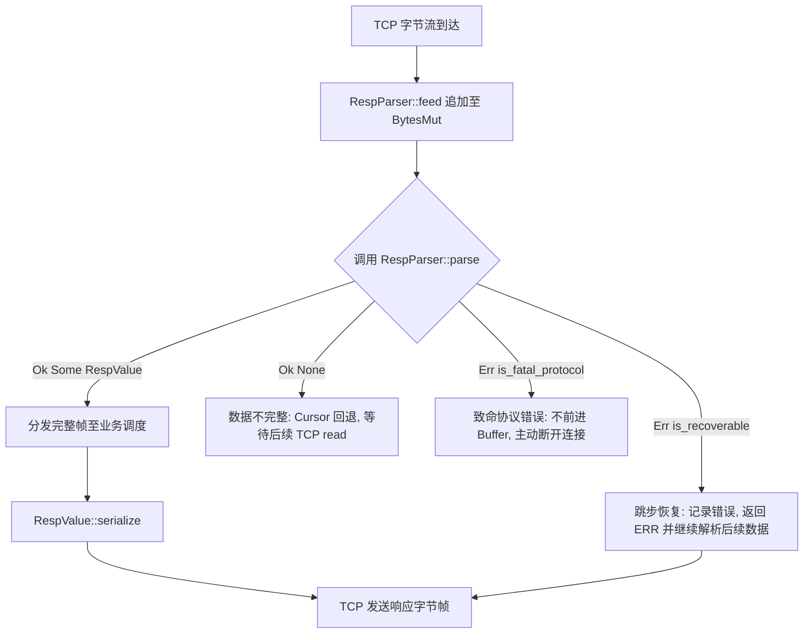

# AiKv Protocol (RESP 编解码)

## 何时读本文

- 修改 `src/protocol/{types.rs, parser.rs, encoder.rs, mod.rs}` 或 `RespParser` / `RespValue` 协议 API;
- 排查 RESP 帧流式解析失败、序列化编码 Roundtrip、缓冲区超限、嵌套深度错误或协议兼容性异常;
- **不覆盖**: TCP 连接读写循环、`HELLO` 协议协商、Null 线格式自适应 → [server.md](02-server.md);
- **不覆盖**: 命令参数拆解与业务执行 → [commands-core.md](04-commands-core.md).

---

## 代码地图

| 文件路径 | 模块核心职责 | 公共接口与核心入口 |
| :--- | :--- | :--- |
| [`src/protocol/mod.rs`](../../src/protocol/mod.rs) | 协议模块根; 统一 re-export 协议核心类型与断连判定函数 | `RespParser`, `RespValue`, `ProtocolVersion`, `is_fatal_protocol` |
| [`src/protocol/types.rs`](../../src/protocol/types.rs) | RESP2 与 RESP3 17 种值类型 AST 定义及协议版本枚举 | `RespValue`, `ProtocolVersion` |
| [`src/protocol/parser.rs`](../../src/protocol/parser.rs) | 流式帧解析器、缓冲区生命周期、防御性 Limits 校验与错误恢复 | `RespParser::new`, `feed`, `parse`, `is_fatal_protocol` |
| [`src/protocol/encoder.rs`](../../src/protocol/encoder.rs) | 不可变 AST 序列化为 RESP 字节帧 (二进制安全) | `RespValue::serialize`, `encode_into` |

---

## 关键 Invariants (勿破坏规则)

- **单帧消费语义**: 每次调用 `parse()` 至多从 buffer 头部消费 **一个** 完整顶层 `RespValue`; Pipeline 流式处理由调用方在连接循环中连续调用 `parse()` 实现.
- **数据不足不消费**: 接收数据不足以构成完整帧时, 必须返回 `Ok(None)`, 内部 Cursor 自动回退至帧头, 缓冲区保留完整数据待后续 `feed`.
- **可恢复错误 (`is_recoverable`)**:
  - `unknown type marker`: 自动跳过整行数据 (消费至第一个 `\n`, 若无 `\n` 则清空 buffer), 避免对垃圾输入逐字节报错;
  - 其他可恢复错误跳过 1 字节并返回 `Err(Protocol)`, 上层服务可向客户端写 `-ERR` 并继续处理后续帧.
- **不可恢复致命错误 (`is_fatal_protocol`)**:
  - 包括解析深度超限 (`max_parse_depth`)、Buffer 超限 (`max_buffer_size`)、行长度超限 (`max_line_len`)、数据超大及损坏长度格式;
  - 遇到致命错误时 **不前进 Buffer**, 上层服务识别后必须**立即断开 TCP 连接**, 防止恶意死循环刷屏.
- **防御性 Limits (不可由客户端动态调优)**:

| 限制配置项 | 常量默认值 | 超限错误信息 / 行为 |
| :--- | :--- | :--- |
| `max_bulk_len` | `512 MiB` (536,870,912 B) | `Protocol("bulk string too large")` |
| `max_buffer_size` | `64 MiB` (67,108,864 B) | Server 在 `feed` 前预检并主动断开连接 |
| `max_parse_depth` | `128` 级 | `Protocol("parse depth exceeded")` |
| `max_array_len` | `4 MiB` 元素 (4,194,304) | `Protocol("array/map/set/push/attribute too large")` |
| `max_line_len` | `1 MiB` (1,048,576 B) | `Protocol("line too long")` |

---

## 协议类型与帧格式

AiKv 支持 RESP2 与 RESP3 全类型编解码:

| 类型标记符 | RESP 类型 | RespValue 变体 | 编码示例 |
| :---: | :--- | :--- | :--- |
| `+` | Simple String | `SimpleString(String)` | `+OK\r\n` |
| `-` | Simple Error | `Error(String)` | `-ERR unknown command\r\n` |
| `:` | Integer | `Integer(i64)` | `:1000\r\n` |
| `$` | Bulk String | `BulkString(Option<Bytes>)` | `$5\r\nhello\r\n` / `$-1\r\n` |
| `*` | Array | `Array(Option<Vec<RespValue>>)` | `*2\r\n$3\r\nfoo\r\n$3\r\nbar\r\n` |
| `_` | Null (RESP3) | `Null` | `_\r\n` |
| `#` | Boolean (RESP3) | `Boolean(bool)` | `#t\r\n` / `#f\r\n` |
| `,` | Double (RESP3) | `Double(f64)` | `,3.14\r\n` / `,inf\r\n` |
| `(` | Big Number (RESP3) | `BigNumber(String)` | `(3492890328409238509324850943850943825024385\r\n` |
| `!` | Bulk Error (RESP3) | `BulkError(String)` | `!21\r\nSYNTAX invalid syntax\r\n` |
| `=` | Verbatim String | `VerbatimString { format, data }` | `=15\r\ntxt:Some string\r\n` |
| `%` | Map (RESP3) | `Map(Vec<(K, V)>)` | `%1\r\n+key\r\n:1\r\n` |
| `~` | Set (RESP3) | `Set(Vec<RespValue>)` | `~2\r\n+a\r\n+b\r\n` |
| `>` | Push (RESP3) | `Push(Vec<RespValue>)` | `>2\r\n+message\r\n+channel\r\n` |
| `\|` | Attribute (RESP3) | `Attribute { attributes, data }` | `\|1\r\n+ttl\r\n:3600\r\n+OK\r\n` |
| `$?` | Streamed String | `StreamedString(Vec<Bytes>)` | `$?\r\n;4\r\npart\r\n;0\r\n` |

---

## 数据流与 Pipeline

### Pipeline 处理机制

客户端连续发送多条命令时, 多个 RESP 帧滞留在同一个 `BytesMut` 缓冲区中. `Connection::handle` 在单次 `read` 后调用 `feed`, 随后通过内层循环连续执行 `parse()`, 直到返回 `Ok(None)` 为止, 实现零系统调用延迟的 Pipeline 批处理.
