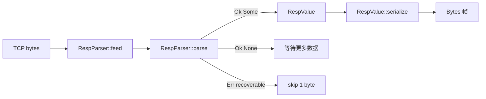

# AiKv Protocol (RESP 编解码)

## 何时读本文

- 改 `protocol/{types,parser,encoder}` 或 `RespParser` / `RespValue` 公共 API
- 排查 RESP 帧解析失败、编码 roundtrip、buffer 超限、嵌套深度错误
- **不覆盖**: TCP 读写循环 / HELLO 协商 / null 线格式转换 → [server.md](02-server.md); 命令参数拆解 → [commands-core.md](04-commands-core.md)

## 代码地图

| 路径 | 职责 | 入口 |
|------|------|------|
| `protocol/mod.rs` | 模块根; re-export | `RespParser`, `RespValue`, `ProtocolVersion` |
| `protocol/types.rs` | RESP 值 AST; 协议版本枚举 | `RespValue`, `ProtocolVersion` |
| `protocol/parser.rs` | 流式解析; limits; recoverable 策略 | `RespParser::new`, `with_limits`, `feed`, `parse` |
| `protocol/encoder.rs` | 值 → 字节帧 | `RespValue::serialize` |

公共 re-export (`lib.rs`): `protocol` 模块同上.

解析错误类型: `crate::error::Error::Protocol(String)`.

## 关键 invariant (勿破坏)

- **单帧语义**: 每次 `parse()` 至多消费 buffer 头部 **一个** 完整顶层 `RespValue`; pipeline 由调用方循环 `parse()` (见 [server.md](02-server.md)).
- **不完整不消费**: 数据不足 → `Ok(None)`, cursor 回退, buffer 保留待 `feed`.
- **可恢复错误**: `is_recoverable` 命中时 `advance(1)` 后返回 `Err`; 调用方可写 ERR 响应并继续 (fatal 判定在 server).
- **不可恢复错误**: depth / too large / line too long / length 类错误不 advance; server 应断连.
- **默认 limits**: 见下表; 生产路径 `RespParser::new()` 使用默认值.
- **命令请求形态**: AiKv 期望顶层 `Array` of bulk strings; 由 `server::process_value` 校验, parser 不 enforce.

### 默认 limits

| 字段 | 默认值 | 超限错误 |
|------|--------|----------|
| `max_bulk_len` | 512 MiB | `bulk string too large` |
| `max_buffer_size` | 64 MiB | server 在 `feed` 前检查并断连 |
| `max_parse_depth` | 128 | `parse depth exceeded` |
| `max_array_len` | 4 MiB 元素 | `array/map/set/push/attribute too large` |
| `max_line_len` | 1 MiB | `line too long` |

## 数据流



Pipeline (协议层视角): 连续帧留在同一 `BytesMut`; 每次 `parse()` 成功后 buffer 已 `advance`, 剩余字节留给下一帧.

## 关键类型与 API

### `RespValue`

RESP2 + RESP3 共 17 变体. 命令层最常用: `SimpleString`, `Error`, `Integer`, `BulkString`, `Array`, `Null`, `Map`.

| marker | 变体 | 备注 |
|--------|------|------|
| `+` | `SimpleString` | |
| `-` | `Error` | |
| `:` | `Integer` | |
| `$` | `BulkString` | `None` = `$-1` |
| `*` | `Array` | `None` = `*-1` |
| `_` | `Null` | RESP3 |
| `#` | `Boolean` | |
| `,` | `Double` | nan/inf/-inf/-0 特判 |
| `(` | `BigNumber` | |
| `!` | `BulkError` | |
| `=` | `VerbatimString` | `format` 须 3 字符 + `:` + data |
| `%` | `Map` | |
| `~` | `Set` | |
| `>` | `Push` | |
| `\|` | `Attribute` | attrs + `data` |
| `$?`…`;0` | `StreamedString` | 多块 bulk |

载荷用 `bytes::Bytes`, bulk string 二进制安全.

### `ProtocolVersion`

```rust
pub enum ProtocolVersion { Resp2, Resp3 }  // Default = Resp3
```

- 定义在 `protocol/types.rs`; 默认 **Resp3**
- `HELLO` 协商、`protocol_negotiated` 门控、响应 null 线格式 (`$-1` vs `_`) 在 [server.md](02-server.md), 不在本模块

### `RespParser`

```rust
impl RespParser {
    pub fn new() -> Self;
    pub fn with_limits(max_bulk_len, max_buffer_size, max_parse_depth,
                       max_array_len, max_line_len) -> Self;
    pub fn feed(&mut self, data: &[u8]);
    pub fn buffer_len(&self) -> usize;
    pub fn max_buffer_size(&self) -> usize;
    pub fn parse(&mut self) -> Result<Option<RespValue>>;
}
```

`parse()` 返回语义:

| 结果 | 含义 |
|------|------|
| `Ok(Some(v))` | 完整帧已解析并消费 |
| `Ok(None)` | 需更多字节 |
| `Err(e)` recoverable | 已 skip 1 字节, 可重试 |
| `Err(e)` fatal | buffer 未前进, 应断连 |

## 常见任务

### 调试 RESP roundtrip

1. 构造 `RespValue`
2. `let bytes = value.serialize()`
3. `parser.feed(&bytes)` → `parser.parse()?`
4. `assert_eq!(parsed, value)` 且 `parser.buffer_len() == 0`

参考 `tests/modules/resp/parser.rs` 中 `roundtrip()` helper.

### 复现 pipeline 解析

```rust
let mut parser = RespParser::new();
parser.feed(b"+PONG\r\n+PONG\r\n");
assert_eq!(parser.parse()?.unwrap(), RespValue::SimpleString("PONG".into()));
assert_eq!(parser.parse()?.unwrap(), RespValue::SimpleString("PONG".into()));
assert!(parser.parse()?.is_none());
```

### 调低 limits 写边界测试

用 `RespParser::with_limits(...)` 注入小阈值, 见 `test_parse_depth_limit`, `test_parse_bulk_string_too_large` 等.

### 新增 RESP3 变体编解码

1. 在 `types.rs` 加枚举变体
2. `parser.rs` `parse_value` match 加分支 + 私有解析函数
3. `encoder.rs` `encode_into` 加分支
4. 在 `tests/modules/resp/{types,parser}.rs` 加 golden + roundtrip

## 配置与 feature flags

| 项 | 位置 | 说明 |
| --- | --- | --- |
| 解析 limits | `parser.rs` 常量 + `with_limits` | 无运行时配置; 默认见上表 |
| feature flags | — | protocol 模块无 `cfg(feature)` |

## 测试

```bash
cargo test --test resp           # types + parser (66)
cargo test --test resp parser    # 仅 parser (37)
cargo test --test resp types     # 仅 golden encode (29)
```

集成: `tests/modules/server/tcp.rs` 覆盖 HELLO/PING pipeline (属 server, 非本模块单元测试).

## 已知限制

- 顶层孤立 `;` chunk marker 返回 `unexpected streamed chunk marker` (须在 `$?` streamed string 上下文内).
- `StreamedString` / `Attribute` / `Push` 已编解码, 命令层未必使用.
- `ProtocolVersion` 不影响 `serialize()` 输出; 版本相关线格式适配在 server `adapt_for_protocol`.

## 待核实

- 无.
