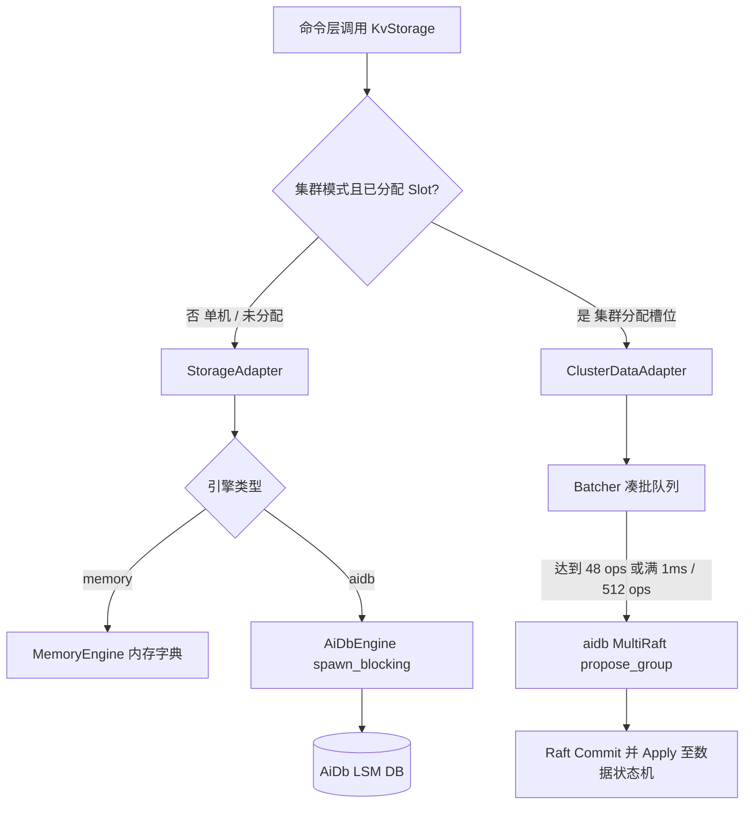

# AiKv Storage (存储适配层)

## 何时读本文

- 修改 `src/storage/{adapter.rs, cluster_adapter.rs, cluster_batcher.rs, aidb.rs, memory.rs, subkey.rs, dump.rs, ttl_filter.rs, types.rs, mod.rs}` 源码;
- 排查 `KvStorage` 接口行为、内存引擎 (`MemoryEngine`) 与持久化引擎 (`AiDbEngine`) 路径差异;
- 排查 Subkey 扁平化编码、TTL 惰性过期机制、DUMP/RESTORE 编解码;
- 排查集群模式下数据面写操作的 MultiRaft 批处理 (`ClusterDataAdapter` / `propose_group`);
- **不覆盖**: 底层 LSM 存储引擎 (WAL/MemTable/SSTable/Compaction) → [AiDb Engine 文档](../../../aidb/docs/modules/01-engine.md);
- **不覆盖**: MetaRaft 控制面拓扑与 Slot 迁移状态机 → [AiDb Cluster 文档](../../../aidb/docs/modules/03-cluster.md);
- **不覆盖**: 集群 MOVED/ASK 重定向与 CLUSTER 命令 → [cluster.md](06-cluster.md);
- **不覆盖**: 命令具体业务实现 → [commands-core.md](04-commands-core.md).

---

## 代码地图

| 文件路径 | 模块核心职责 | 公共接口与核心入口 |
| :--- | :--- | :--- |
| [`src/storage/mod.rs`](../../src/storage/mod.rs) | 存储模块根; 统一 re-export 核心 Trait、引擎实现与辅助类型 | `KvStorage`, `StorageAdapter`, `AiDbEngine`, `MemoryEngine` |
| [`src/storage/adapter.rs`](../../src/storage/adapter.rs) | `KvStorageAdapter` Trait 定义与通用的存储层统一调度适配器 | `StorageAdapter`, `AdapterWriteOp` |
| [`src/storage/types.rs`](../../src/storage/types.rs) | 核心存储 Trait (`KvStorage`)、`StoredValue`、`ValueType` 与 `WriteOp` | `KvStorage`, `StoredValue`, `ValueType`, `WriteOp` |
| [`src/storage/memory.rs`](../../src/storage/memory.rs) | 纯内存存储实现 (16 个独立 DB 容器, 用于开发与单元测试) | `MemoryEngine` |
| [`src/storage/aidb.rs`](../../src/storage/aidb.rs) | AiDb LSM 同步存储引擎适配 (基于 `spawn_blocking` 桥接 Tokio) | `AiDbEngine` |
| [`src/storage/aidb_options.rs`](../../src/storage/aidb_options.rs) | LSM 存储参数预设映射 (`default`, `high-write`, `high-read`) | `server_db_options_with_preset`, `DbPreset` |
| [`src/storage/cluster_adapter.rs`](../../src/storage/cluster_adapter.rs) | 集群数据面存储适配器: 槽位判断、写批处理 (`Batcher`) 与 Raft propose | `ClusterDataAdapter` (feature = "cluster") |
| [`src/storage/cluster_batcher.rs`](../../src/storage/cluster_batcher.rs) | `GroupSetBatcher` 写凑批 actor; 入口仍是 `ClusterDataAdapter` | `GroupSetBatcher` (feature = "cluster") |
| [`src/storage/subkey.rs`](../../src/storage/subkey.rs) | 复杂数据结构 (Hash/List/Set/ZSet) 扁平化 Subkey 前缀编解码 | `encode_data_key`, `encode_meta_key`, `decode_key` |
| [`src/storage/dump.rs`](../../src/storage/dump.rs) | `DUMP` / `RESTORE` 紧凑 postcard 序列化与版本校验 | `dump_encode`, `dump_decode`, `DUMP_VERSION` |
| [`src/storage/ttl_filter.rs`](../../src/storage/ttl_filter.rs) | 结合 Compaction Filter 的 TTL 物理清理与惰性删除判定 | `TtlExpireFilter` |
| [`src/storage/observation.rs`](../../src/storage/observation.rs) | 存储层点查、批写与扫描延迟与吞吐监控统计 | `StorageObservation` |

---

## 关键 Invariants (勿破坏规则)

- **`KvStorage` 抽象隔离**: 上层命令处理器仅持有 `Arc<dyn KvStorage>`, 禁止直接向下转型获取具体引擎实例.
- **单 `DB` 与多库隔离**:
  - 底层 AiDb 为单实例, 采用 `{db_index}:{user_key}` 前缀区分 Redis 0~15 号逻辑数据库;
  - `MemoryEngine` 在内部维护 16 个独立内存 Map, 两者上层 API 表现完全一致.
- **Subkey 编码隔离**:
  - 元数据键: `{db}:{user_key}` (记录类型标记、版本号与元素数量);
  - 数据键: `{db}:{user_key}:{field/index}` (记录单字段或元素值);
  - 集合删除时同时清理元数据与对应前缀的 Subkey 数据键.
- **集群写必须走 Raft (`ClusterDataAdapter`)**:
  - 当集群已初始化且 Key 属于已分配 Slot 时, 写操作**必须**经过 `propose_group` 提交 MultiRaft, **严禁**绕过 Raft 回退本地写 (避免 SET 成功后读 Raft 为空);
  - 仅在单机模式或 Slot 未分配时写入本地存储.
- **Batcher 批处理参数常量**:
  - `SET_BATCH_MAX_OPS = 512`: 单批次最大聚合操作数;
  - `SET_BATCH_MAX_DELAY = 1ms`: 凑批等待时间上限;
  - `DEFAULT_EAGER_FLUSH = 48`: 达到该阈值时无需等待 1ms, 立即触发异步 Propose.
- **Leader 专有惰性删除**:
  - 读路径发现过期 Key 时, 仅当本节点是该 Key 所在 Data Group 的 Raft Leader 时才执行物理删除;
  - 只读副本 (`READONLY`) 发现过期 Key 仅在内存中返回 Nil, 不触发跨节点写入.

---

## 存储架构与批处理数据流



---

## 数据编码规则

### 1. `StoredValue` 内存与持久化结构

```rust
pub struct StoredValue {
    pub value_type: ValueType,
    pub expire_at: Option<u64>, // 绝对毫秒时间戳, None 表示永不过期
    pub data: Bytes,            // 二进制载荷
}
```

### 2. DUMP / RESTORE 内部格式

`DUMP` / `RESTORE` 使用内部格式 `[u8 version=1][postcard(StoredValue)]`, 非 Redis DUMP 兼容. 开发期无旧 `DUMP_VERSION=0` 载荷兼容义务.

### 3. Subkey 编码规范

- **String / JSON**: 直接写入 `{db}:{key}` 作为完整 `StoredValue`;
- **Hash**: 
  - 元数据: `{db}:{key}` -> `StoredValue { type: Hash, data: field_count }`
  - 字段数据: `{db}:{key}\x00f\x00{field}` -> `StoredValue { type: String, data: field_val }`
- **List / Set / ZSet**: 类似 Hash, 使用专有子前缀分隔符进行编码.
