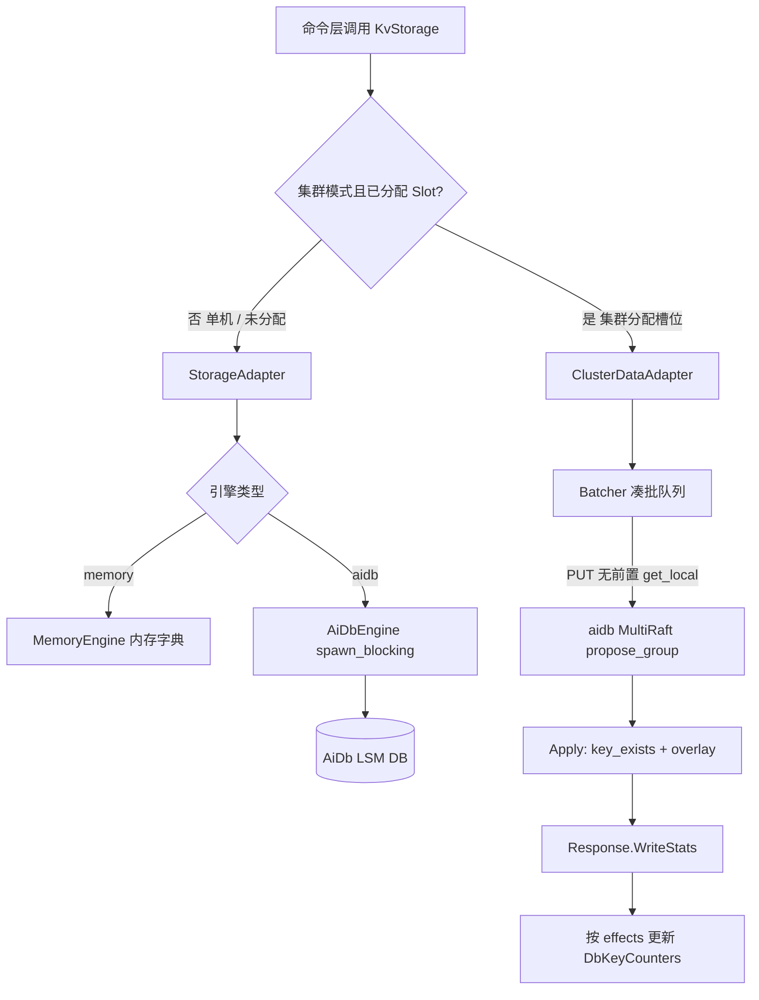

# AiKv Storage (存储适配层)

## 何时读本文

- 修改 `src/storage/{adapter.rs, cluster_adapter.rs, cluster_batcher.rs, aidb.rs, memory.rs, subkey.rs, dump.rs, ttl_filter.rs, types.rs, watch_version.rs, watch_registry.rs, mod.rs}` 源码;
- 排查 `KvStorage` 接口行为、内存引擎 (`MemoryEngine`) 与持久化引擎 (`AiDbEngine`) 路径差异;
- 排查 Subkey 扁平化编码、TTL 惰性过期机制、DUMP/RESTORE 编解码;
- 排查集群模式下数据面写操作的 MultiRaft 批处理 (`ClusterDataAdapter` / `propose_group`);
- **不覆盖**: 底层 LSM 存储引擎 (WAL/MemTable/SSTable/Compaction) → [AiDb Engine 文档](https://github.com/wiqun/AiDb/blob/main/docs/modules/01-engine.md);
- **不覆盖**: MetaRaft 控制面拓扑与 Slot 迁移状态机 → [AiDb Cluster 文档](https://github.com/wiqun/AiDb/blob/main/docs/modules/03-cluster.md);
- **不覆盖**: 集群 MOVED/ASK 重定向与 CLUSTER 命令 → [cluster.md](06-cluster.md);
- **不覆盖**: 命令具体业务实现 → [commands-core.md](04-commands-core.md).

---

## 代码地图

| 文件路径 | 模块核心职责 | 公共接口与核心入口 |
| :--- | :--- | :--- |
| [`src/storage/mod.rs`](../../src/storage/mod.rs) | 存储模块根; 统一 re-export 核心 Trait、引擎实现与辅助类型 | `KvStorage`, `StorageAdapter`, `AiDbEngine`, `MemoryEngine` |
| [`src/storage/adapter.rs`](../../src/storage/adapter.rs) | `KvStorageAdapter` Trait 定义与通用的存储层统一调度适配器 | `StorageAdapter`, `AdapterWriteOp` |
| [`src/storage/types.rs`](../../src/storage/types.rs) | 核心存储 Trait (`KvStorage`)、`StoredValue`、`ValueType` 与 `WriteOp` | `KvStorage`, `StoredValue`, `ValueType`, `WriteOp` |
| [`src/storage/memory.rs`](../../src/storage/memory.rs) | 纯内存存储实现 (16 个独立 DB 容器, 用于开发与单元测试) | `MemoryEngine` |
| [`src/storage/aidb.rs`](../../src/storage/aidb.rs) | AiDb LSM 同步存储引擎适配 (基于 `spawn_blocking` 桥接 Tokio) | `AiDbEngine` |
| [`src/storage/aidb_options.rs`](../../src/storage/aidb_options.rs) | LSM 存储参数预设映射 (`default`, `high-write`, `high-read`) | `server_db_options_with_preset`, `DbPreset` |
| [`src/storage/cluster_adapter.rs`](../../src/storage/cluster_adapter.rs) | 集群数据面存储适配器: 槽位判断、写批处理 (`Batcher`) 与 Raft propose | `ClusterDataAdapter` (feature = "cluster") |
| [`src/storage/watch_registry.rs`](../../src/storage/watch_registry.rs) | 本节点 WATCH 引用计数; 无人 watch 时跳过 meta 写 | `WatchRegistry` |
| [`src/storage/watch_version.rs`](../../src/storage/watch_version.rs) | WATCH 版本 meta key 编码 (`{hash_tag}` 前缀保证同 slot) | `meta_user_key`, `is_watch_meta_user_key` |
| [`src/storage/subkey.rs`](../../src/storage/subkey.rs) | 复杂数据结构 (Hash/List/Set/ZSet) 扁平化 Subkey 前缀编解码 | `encode_data_key`, `encode_meta_key`, `decode_key` |
| [`src/storage/dump.rs`](../../src/storage/dump.rs) | `DUMP` / `RESTORE` 紧凑 postcard 序列化与版本校验 | `dump_encode`, `dump_decode`, `DUMP_VERSION` |
| [`src/storage/ttl_filter.rs`](../../src/storage/ttl_filter.rs) | TTL compaction filter 与 Version 安装后的键计数移除监听 | `TtlExpireFilter`, `DbKeyCounterRemovalListener` |
| [`src/storage/counter_batch.rs`](../../src/storage/counter_batch.rs) | `write_batch` 成功/失败后的计数增减与 `ExpireDecrGate` 处理 | `apply_successful_batch`, `release_live_puts` |
| [`src/storage/observation.rs`](../../src/storage/observation.rs) | 存储层点查、批写与扫描延迟与吞吐监控统计 | `StorageObservation` |

---

## 关键 Invariants (勿破坏规则)

- **`KvStorage` 抽象隔离**: 上层命令处理器仅持有 `Arc<dyn KvStorage>`, 禁止直接向下转型获取具体引擎实例.
- **单 `DB` 与多库隔离**:
  - 底层 AiDb 为单实例, 采用 `{db_index}:{user_key}` 前缀区分 Redis 0~15 号逻辑数据库;
  - `MemoryEngine` 在内部维护 16 个独立内存 Map, 两者上层 API 表现完全一致.
- **Subkey 编码隔离**:
  - 元数据键: `{db}:{user_key}` (记录类型标记、版本号与元素数量);
  - 数据键: `{db}:{user_key}:{field/index}` (记录单字段或元素值);
  - 集合删除时同时清理元数据与对应前缀的 Subkey 数据键.
- **集群写必须走 Raft (`ClusterDataAdapter`)**:
  - 当集群已初始化且 Key 属于已分配 Slot 时, 写操作**必须**经过 `propose_group` 提交 MultiRaft, **严禁**绕过 Raft 回退本地写 (避免 SET 成功后读 Raft 为空);
  - 仅在单机模式或 Slot 未分配时写入本地存储.
- **Batcher 批处理参数常量**:
  - `SET_BATCH_MAX_OPS = 512`: 单批次最大聚合操作数;
  - `SET_BATCH_MAX_DELAY = 1ms`: 凑批等待时间上限;
  - `DEFAULT_EAGER_FLUSH = 48`: 达到该阈值时无需等待 1ms, 立即触发异步 Propose.
- **Leader 专有惰性删除**:
  - 读路径发现过期 Key 时, 仅当本节点是该 Key 所在 Data Group 的 Raft Leader 时才执行物理删除;
  - 只读副本 (`READONLY`) 发现过期 Key 仅在内存中返回 Nil, 不触发跨节点写入.
- **DbKeyCounters 与 O(1) 键计数 (回传法)**:
  - `KvStorageAdapter` 持有 `DbKeyCounters` (`[AtomicU64; 16]`), 跟踪各 DB 逻辑 user key 数量 (跳过 subkey); 计数真源在 aikv, 不依赖 aidb `total_key_count`.
  - **单机写路径**: `AiDbEngine::set` / `write_batch` 消费引擎 `put`→`bool` / `EngineWriteStats`; `exists` 走 `DB::key_exists` (不物化 Value). 禁止跨任务 `exists + put` 二次读.
  - **集群写路径 (Plain / 迁移 PUT / `write_batch`)**: `submit_write_op` / `submit_write_ops` 与 `ClusterDataAdapter::apply_writes` **禁止** propose 前 `get_local` / `exists` 判定 insert; 摘要来自 apply 回传的 `Response::WriteStats.effects`. DELETE Plain **保留**前置 `get_local` 短路 (不存在则跳过 propose). Batcher 按 key 做 last-write-wins reverse-dedup; 丢掉的中间 op ack 映射为 `false`.
  - **WATCH meta 与用户写同一次 propose (Issue #83)**: 仅当 `WatchRegistry` 显示本节点有连接 WATCH 该 key 时, `set_typed` / `DEL` / `write_batch` 才把 user key 与 `{hash_tag}\xff\xff/aikv/watch/{user_key}` 送进同一 `put_many` / `apply_writes`; 集群走 `submit_write_ops` (全部入队后再等 ack). 压测热路径无人 WATCH, 因此只写用户 key. meta 复用 Redis hash tag, 保证与 user key 同 slot. `DbKeyCounters` 只计用户 key, 不计 meta.
  - **消费者 fail-fast**: 数据写成功响应须显式匹配 `WriteStats` (或控制面路径的 `Ok`); 禁止宽松 `_ => Ok(())` 吞掉意外 `Response` 变体. 仅支持同版本集群滚动.
  - `set_typed` / `write_batch` 成功后: 仅当 `inserted` 时 `incr`; **无论 `inserted` 真假均 `expire_gate.release`** (覆盖写也要释放门闩). `write_batch` 对全部 Delete op `try_claim` 门闩, 计数仍用 `stats.deleted` (禁止按删除条数截前缀).
  - 热路径计数含尚未惰性清理的过期 key; 惰性删除成功时 `decr`;
  - 冷启动 `open` / `rebuild_counters` 按未过期存活 key 填充, 并可能顺带 lazy 清理;
  - Compaction: listener 持 `Weak<DB>` 以免与引擎循环引用; Version 安装后仅当 `get==None` 且赢得 `ExpireDecrGate` 时 `decr`; `get` 失败记 warn 且不扣; 惰性删/`DEL` 同样需赢得门闩并持有至 `set_typed` / `write_batch` Put 重生;
  - 集群: 命令写路径成功后维护计数; `init_cluster` 后先等待本节点 data group 打开, 再 `rebuild_key_counts` (首次 `open` 时 MultiRaft 尚未就绪). group 等待或 rebuild 失败则进程退出, 禁止带着 0 对外服务;
  - `db_key_counts()` / `DBSIZE` / `len` 为 $O(1)$; **`keyspace_stats` (含 `expires` / `avg_ttl`) 仍为 $O(N)$ 全库扫描**, 且其 keys 统计为未过期存活 key, 可与 `DBSIZE` (含未清理过期) 暂时不一致;
  - `MemoryEngine` 仍自维护 `len` (含惰性过期过滤语义), 不经 `DbKeyCounters`; 生产路径为 AiDb;
  - 后台 15s 指标任务直接读取 `db_key_counts()` ($O(1)$), 避免为键数量全库 SSTable 迭代.

---

## 存储架构与批处理数据流



---

## 数据编码规则

### 1. `StoredValue` 内存与持久化结构

```rust
pub struct StoredValue {
    pub value_type: ValueType,
    pub expire_at: Option<u64>, // 绝对毫秒时间戳, None 表示永不过期
    pub data: Bytes,            // 二进制载荷
}
```

### 2. DUMP / RESTORE 内部格式

`DUMP` / `RESTORE` 使用内部格式 `[u8 version=1][postcard(StoredValue)]`, 非 Redis DUMP 兼容. 开发期无旧 `DUMP_VERSION=0` 载荷兼容义务.

### 3. Subkey 编码规范

- **String / JSON**: 直接写入 `{db}:{key}` 作为完整 `StoredValue`;
- **Hash**:
  - 元数据: `{db}:{key}` -> `StoredValue { type: Hash, data: field_count }`
  - 字段数据: `{db}:{key}\x00f\x00{field}` -> `StoredValue { type: String, data: field_val }`
- **List / Set / ZSet**: 类似 Hash, 使用专有子前缀分隔符进行编码.
