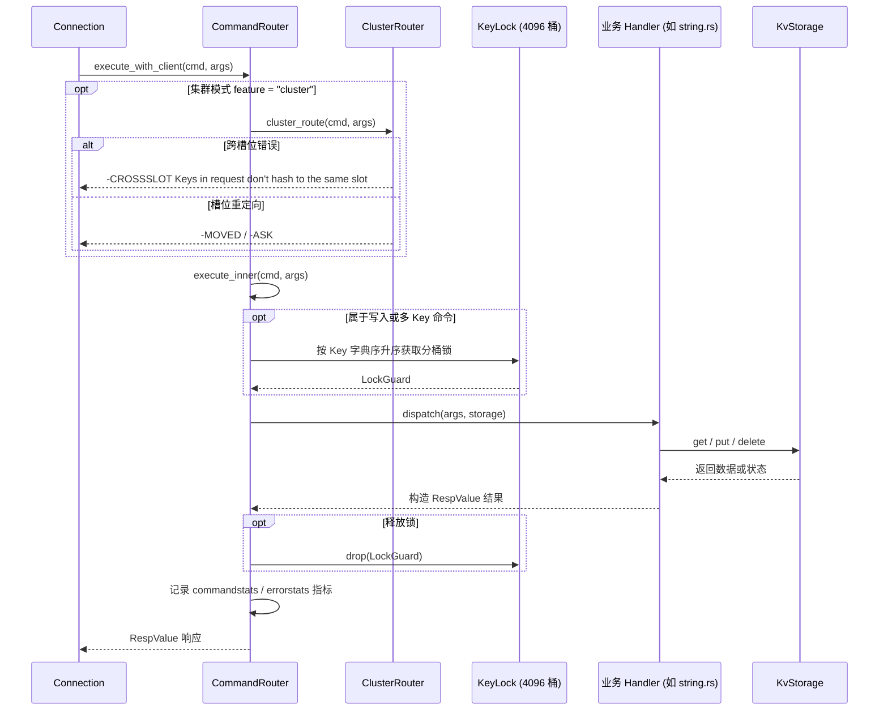

# AiKv Commands Core (核心命令层)

## 何时读本文

- 修改 `src/command/{router.rs, registry.rs, string.rs, hash.rs, list.rs, set.rs, zset.rs, key.rs, database.rs, scan_util.rs}` 源码;
- 新增或修改 String, Hash, List, Set, Sorted Set, Key 或 Database 相关 Redis 命令;
- 排查 WRONGTYPE 报错、命令注册表与路由分发不一致、`COMMAND GETKEYS` 提取错误、并发写数据竞争与死锁;
- **不覆盖**: `KvStorage` 接口与底层 Subkey 编码规则 → [storage.md](03-storage.md);
- **不覆盖**: JSON / Lua / 阻塞队列 / MIGRATE / 持久化与服务端管理命令 → [commands-extended.md](05-commands-extended.md);
- **不覆盖**: 集群 MOVED/ASK 重定向判定与 CLUSTER 子命令 → [cluster.md](06-cluster.md).

---

## 代码地图

| 文件路径 | 模块核心职责 | 公共接口与核心入口 |
| :--- | :--- | :--- |
| [`src/command/mod.rs`](../../src/command/mod.rs) | 命令模块根; 子模块组织与对外导出 | `CommandRouter`, `CommandRegistry` |
| [`src/command/router.rs`](../../src/command/router.rs) | `CommandRouter` 分发中枢、4096 桶 `KeyLock` 写锁与 metrics 埋点 | `CommandRouter::execute_with_client`, `execute_inner` |
| [`src/command/registry.rs`](../../src/command/registry.rs) | Redis 命令元数据表 (`COMMAND_TABLE`)、`CommandFlags` 与参数规则 | `CommandRegistry::lookup`, `CommandFlags` |
| [`src/command/string.rs`](../../src/command/string.rs) | String 系列命令 (GET, SET, MGET, MSET, INCR, INCRBYFLOAT, GETRANGE 等) | `string::dispatch` |
| [`src/command/hash.rs`](../../src/command/hash.rs) | Hash 系列命令 (HGET, HSET, HDEL, HGETALL, HINCRBY, HEXISTS 等) | `hash::dispatch` |
| [`src/command/list.rs`](../../src/command/list.rs) | List 系列命令 (LPUSH, RPUSH, LPOP, RPOP, LRANGE, LLEN, LINDEX 等) | `list::dispatch` |
| [`src/command/set.rs`](../../src/command/set.rs) | Set 系列命令 (SADD, SREM, SMEMBERS, SISMEMBER, SCARD, SINTER 等) | `set::dispatch` |
| [`src/command/zset.rs`](../../src/command/zset.rs) | Sorted Set 系列命令 (ZADD, ZREM, ZRANGE, ZSCORE, ZCARD, ZINCRBY 等) | `zset::dispatch` |
| [`src/command/key.rs`](../../src/command/key.rs) | Key 通用命令 (DEL, EXISTS, TYPE, EXPIRE, PEXPIRE, TTL, PTTL, PERSIST) | `key::dispatch` |
| [`src/command/database.rs`](../../src/command/database.rs) | DB 管理命令 (SELECT, FLUSHDB, FLUSHALL, DBSIZE, SWAPDB) | `database::dispatch` |
| [`src/command/scan_util.rs`](../../src/command/scan_util.rs) | SCAN / HSCAN / SSCAN / ZSCAN 游标编码与前缀迭代器辅助 | `encode_cursor`, `decode_cursor` |

---

## 关键 Invariants (勿破坏规则)

- **`KeyLock` 死锁防护与并发隔离**:
  - `KeyLock` 内部采用 **4096** 个独立分桶互斥锁 (`tokio::sync::Mutex<()>`);
  - **单 Key 写**: `KeyLock::lock(key)` 加锁 (如 SET NX/XX, INCR, HSET, LPUSH 等);
  - **双 Key 命令**: `KeyLock::lock_two(k1, k2)` 按照 Key 字节序比较升序获取锁 (如 RENAME, COPY, LMOVE, SMOVE);
  - **多 Key / Lua 事务**: `KeyLock::lock_keys_sorted(keys)` 自动去重并按字典序升序排序加锁, 彻底杜绝并发死锁.
- **双维护一致性约束 (Registry ↔ Router)**:
  - 新增命令必须**同时更新** `registry.rs` 中的 `COMMAND_TABLE` 和 `router.rs` 中的 `execute_inner` (或子领域 dispatch match);
  - 严禁在 `registry.rs` 中声明但在 `router.rs` 中遗漏分发, 避免出现 `COMMAND` 命令可查但执行报未知命令的 Bug.
- **WRONGTYPE 强制校验**:
  - 对已存在的 Key 执行不匹配的数据结构操作时, 必须立即返回 `-WRONGTYPE Operation against a key holding the wrong kind of value\r\n`;
  - 严禁静默覆盖已有不同类型的 Key (除非是 `SET` 强制覆盖).
- **空容器自动删除**:
  - 当通过 `HDEL`, `LPOP`, `SREM`, `ZREM` 等操作移除最后一个元素导致集合为空时, 必须同时物理删除其元数据 Key, 保持与 Redis 规范一致 (即 `EXISTS key` 返回 0).

---

## 命令分发与加锁执行流

---

## 核心数据结构支持列表

| 数据结构 | 支持的核心命令清单 |
| :--- | :--- |
| **String** | `GET`, `SET` (含 EX/PX/NX/XX/GET/KEEPTTL), `MGET`, `MSET`, `MSETNX`, `INCR`, `INCRBY`, `INCRBYFLOAT`, `DECR`, `DECRBY`, `APPEND`, `STRLEN`, `GETRANGE`, `SETRANGE`, `GETSET`, `GETDEL`, `GETEX` |
| **Hash** | `HGET`, `HSET`, `HMGET`, `HMSET`, `HDEL`, `HEXISTS`, `HLEN`, `HKEYS`, `HVALS`, `HGETALL`, `HINCRBY`, `HINCRBYFLOAT`, `HSETNX`, `HRANDFIELD`, `HSCAN`, `HSTRLEN` |
| **List** | `LPUSH`, `RPUSH`, `LPUSHX`, `RPUSHX`, `LPOP`, `RPOP`, `LRANGE`, `LLEN`, `LINDEX`, `LSET`, `LTRIM`, `LREM`, `LINSERT`, `LPOS`, `LMOVE`, `RPOPLPUSH` |
| **Set** | `SADD`, `SREM`, `SMEMBERS`, `SISMEMBER`, `SMISMEMBER`, `SCARD`, `SPOP`, `SRANDMEMBER`, `SINTER`, `SUNION`, `SDIFF`, `SINTERSTORE`, `SUNIONSTORE`, `SDIFFSTORE`, `SSCAN`, `SMOVE` |
| **ZSet** | `ZADD` (含 NX/XX/GT/LT/CH/INCR), `ZREM`, `ZSCORE`, `ZMSCORE`, `ZCARD`, `ZCOUNT`, `ZRANK`, `ZREVRANK`, `ZRANGE`, `ZREVRANGE`, `ZRANGEBYSCORE`, `ZREVRANGEBYSCORE`, `ZINCRBY`, `ZPOPMIN`, `ZPOPMAX`, `ZSCAN` |
| **Key** | `DEL`, `EXISTS`, `TYPE`, `EXPIRE`, `PEXPIRE`, `EXPIREAT`, `PEXPIREAT`, `TTL`, `PTTL`, `PERSIST`, `EXPIRETIME`, `PEXPIRETIME`, `RENAME`, `RENAMENX`, `COPY`, `KEYS`, `SCAN`, `RANDOMKEY`, `TOUCH` |
| **DB** | `SELECT`, `FLUSHDB`, `FLUSHALL`, `DBSIZE`, `SWAPDB` |
