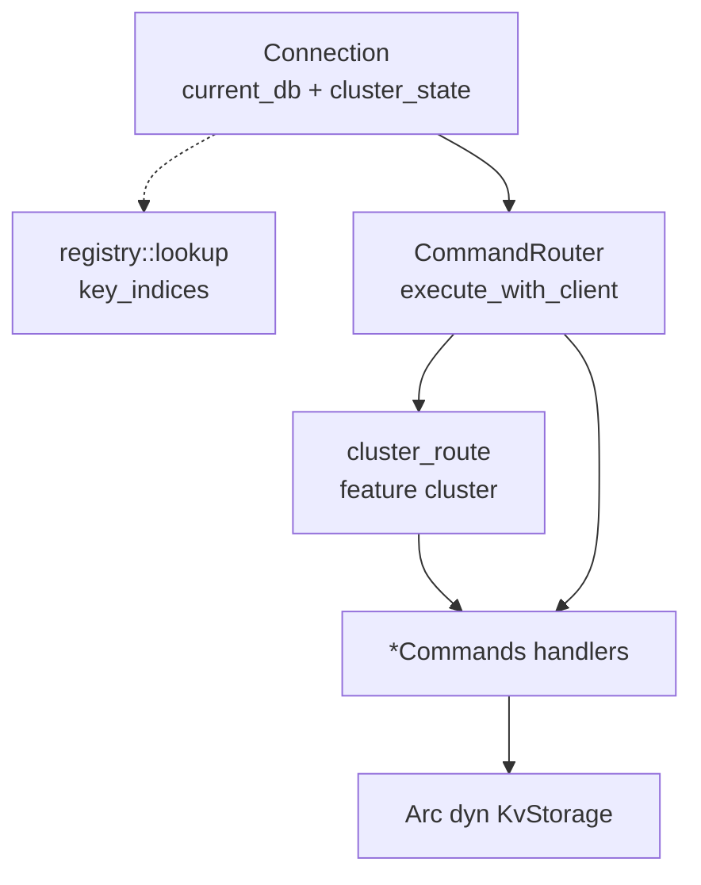
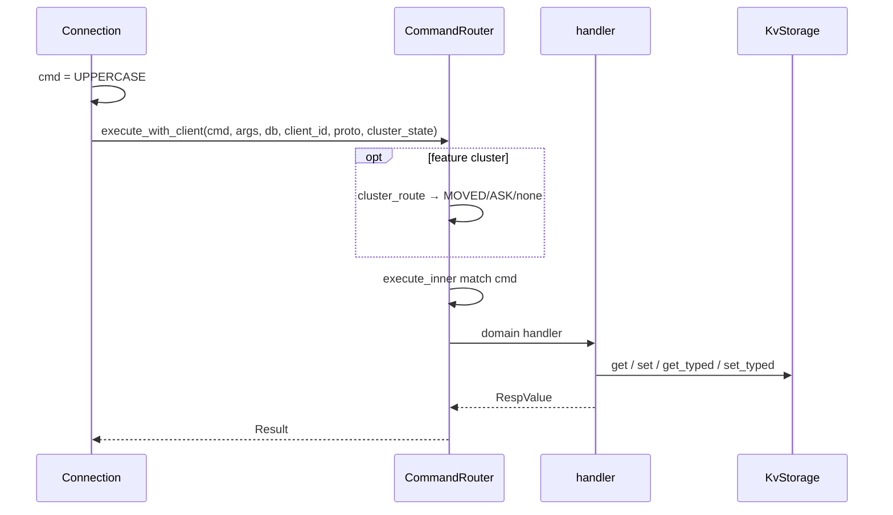

# AiKv Commands Core (核心命令层)

## 何时读本文

- 改 `src/command/{string,hash,list,set,zset,key,database,registry,router}` 或 `scan_util.rs`
- 新增/修改 **核心数据结构** Redis 命令 (非 JSON/Lua/INFO/SAVE)
- 排查 WRONGTYPE、命令未注册、`COMMAND GETKEYS`、写路径竞态
- 理解 `Connection` 如何进入命令 handler (上游见 [server.md](02-server.md))
- **不覆盖**: `KvStorage` / `StoredValue` 契约 → [storage.md](03-storage.md)
- **不覆盖**: JSON/Lua/阻塞基础设施/MIGRATE TCP/持久化/Server 命令 → [commands-extended.md](05-commands-extended.md)
- **不覆盖**: MOVED/ASK / CLUSTER 子命令详述 → [cluster.md](06-cluster.md)

## 架构一览



**装配** (`server/config.rs`):

| 构造 | 用途 |
|------|------|
| `CommandRouter::new(storage)` | 测试; 无 INFO/SAVE |
| `CommandRouter::new_with_shared(storage, state)` | 生产; 注入 `ServerCommands` / `PersistenceCommands` / metrics |

共享 **4096 桶** `KeyLock` 注入 String/Hash/List/Set/ZSet/Key/Json/Script handler.

## 代码地图

| 路径 | 职责 | 入口 |
|------|------|------|
| `command/mod.rs` | 模块根; re-export | `CommandRouter`, `lookup`, `KeyLock` |
| `command/router.rs` | 分发、KeyLock、RESP helper、metrics 钩子 | `execute_with_client`, `execute_inner` |
| `command/registry.rs` | 全量命令元数据 (~131+ 条, 含 extended 条目) | `lookup`, `key_indices`, `all_commands` |
| `command/string.rs` | String + DEL/EXISTS | `StringCommands` |
| `command/hash.rs` | Hash + HSCAN | `HashCommands` |
| `command/list.rs` | List + BLPOP/BRPOP/BLMOVE | `ListCommands` |
| `command/set.rs` | Set + 集合运算 + SSCAN | `SetCommands` |
| `command/zset.rs` | ZSet + 聚合 + BZPOP* + ZSCAN | `ZSetCommands` |
| `command/database.rs` | 逻辑 DB | `DatabaseCommands` |
| `command/key.rs` | 过期/KEYS/SCAN/rename/DUMP/RESTORE/MIGRATE 入口 | `KeyCommands` |
| `command/scan_util.rs` | HSCAN/SSCAN/ZSCAN 共用分页 | `parse_scan_options`, `paginate_slice` |

Extended handler (`json`, `script`, `server`, `persistence`) 由 Router match 转发; 实现见 [commands-extended.md](05-commands-extended.md).

## 关键 invariant (勿破坏)

- **类型分轨**: String 用 `get`/`set`; Hash/List/Set/ZSet 用 `get_typed`/`set_typed`; 混用 → `WRONGTYPE`.
- **空容器删除**: 结构化类型删至空 → `delete`, 不留空 key.
- **二进制 key**: handler 使用 `&[u8]`/`Bytes`, 不做 UTF-8 强制转换.
- **KeyLock 写路径**: SET NX/XX、INCR、HSET、LPUSH 等 mutating 单 key 写需 `lock(key)`; RENAME/COPY 等双 key 用 `lock_two` (字典序, 同 key 不重入).
- **registry ↔ router 双维护**: 新命令须同时更新 `COMMAND_TABLE` 与 `execute_inner` match (或子 dispatch).
- **SELECT**: 唯一在 handler 内修改 `*db` 的核心命令 (`database::select`).
- **HMSET**: 走 HSET 逻辑, 返回 `OK` (非新增字段数).
- **DUMP 格式**: `[u8 version=0][bincode(StoredValue)]` — 非 Redis DUMP; 与 [storage.md](03-storage.md) `dump.rs` 一致.

## 数据流

### 请求分发



`Connection` 另用 `registry::lookup` + `key_indices` 做 ATOM WATCH 键追踪与写命令判定 (见 [server.md](02-server.md)).

### Typed 写路径 (Hash/List/Set/ZSet 共用模式)

1. `require_*` 校验参数
2. `key_lock.lock(key)` (写路径)
3. `load_or_create_*` 或 `get_typed` → 改 `ValueType::*`
4. `set_typed` 或空则 `delete`

### 阻塞 pop (handler 在 core)

1. `try_pop` / `try_pop_any` 非阻塞尝试
2. 失败 → `BlockingRegistry::register` + 轮询 (详见 extended)
3. `LPUSH`/`ZADD` 等写成功后 `BlockingRegistry::notify(key, …)` 唤醒等待者

## CommandRouter

| API | 说明 |
|-----|------|
| `execute(cmd, args, db)` | 测试便捷; 无 client_id/cluster |
| `execute_with_client(...)` | 生产路径; 可选 `cluster_route` + metrics |
| `storage()` | 克隆 `Arc<dyn KvStorage>` (Script/测试用) |

**metrics** (仅 `new_with_shared`): GET/MGET/HGET/EXISTS 等记录 keyspace hit/miss; 每条命令 `on_command` 成功/失败.

**cluster 前置** (`feature cluster`): `cluster_route` 在 `execute_inner` 之前 — admin 白名单 (SCAN/MIGRATE/SELECT/…)、多 key CROSSSLOT、单 key MOVED/ASK. 详述 → [cluster.md](06-cluster.md).

## registry (命令元数据)

```rust
pub struct CommandInfo {
    pub name: &'static str,
    pub arity: i64,           // 负值 = 至少 |arity| 个参数
    pub flags: &'static [&'static str],
    pub first_key: i64,
    pub last_key: i64,
    pub step: i64,
}
```

| 函数 | 用途 |
|------|------|
| `lookup(name)` | 大小写不敏感查表 |
| `key_indices(info, argc)` | Redis COMMAND GETKEYS 语义; `first_key=0` → 无 key |
| `all_commands()` / `command_count()` | `COMMAND` 子命令 |

表内包含 JSON/Lua/INFO/CLUSTER 等条目; **本章只维护机制**, 扩展命令语义见对应 module.

## KeyLock

| API | 场景 |
|-----|------|
| `lock(key)` | 单 key 写 |
| `lock_two(a, b)` | RENAME、LMOVE、SMOVE、COPY (双 key) |
| `lock_keys_sorted(keys)` | 多 key 字典序 (JSON.MSET 等; 无超时) |
| `lock_keys_sorted_with_timeout(keys, timeout)` | 多 key 字典序 (EVAL/EVALSHA; 默认 30s) |

分桶 `DefaultHasher(key) % locks.len()` (4096 桶); 避免同 key Mutex 重入死锁.

## 命令域速查

| 域 | 文件 | 代表命令 | 备注 |
|----|------|----------|------|
| String | `string.rs` | GET/SET/MGET/MSET, GETRANGE/SETRANGE, INCR*, SETBIT, SETEX, GETEX | DEL/EXISTS 在此文件 |
| Hash | `hash.rs` | HSET/HGET/HSCAN, HINCRBY(FLOAT) | `scan_util` 分页 |
| List | `list.rs` | LPUSH/LRANGE/LMOVE, BLPOP/BRPOP/BLMOVE | 阻塞链 extended |
| Set | `set.rs` | SADD/SINTER/SUNION/SDIFF*, SMOVE, SSCAN | store 类多 key 读不加锁 |
| ZSet | `zset.rs` | ZADD/ZRANGE, ZINTER/ZUNION/ZDIFF, BZPOP* | score: `BTreeMap<member, f64>` |
| Database | `database.rs` | SELECT/DBSIZE/FLUSH*/SWAPDB/MOVE | `DB_COUNT=16` |
| Key | `key.rs` | EXPIRE/TTL, KEYS/SCAN, RENAME/TYPE/COPY, DUMP/RESTORE/MIGRATE | SCAN→`storage.scan`; MIGRATE 发送见 extended |

## 两类 SCAN

| 命令 | 实现 | 注意 |
|------|------|------|
| `SCAN` | `key.rs` → `KvStorage::scan` | 引擎级游标 (memory/aidb 各自实现) |
| `HSCAN`/`SSCAN`/`ZSCAN` | 读全量 → filter → `scan_util::paginate_slice` | 大 key O(n); 非 Redis incremental |

## 常见任务

### 新增核心命令

1. 在 `registry.rs` `COMMAND_TABLE` 增加 `cmd!(...)`.
2. 在 `router.rs` `execute_inner` 增加 match 分支 → handler 方法.
3. 在对应 `*Commands` 实现 handler; 写路径评估是否需 `KeyLock`.
4. 写路径用正确 API: String → `get`/`set`; 其它 → `get_typed`/`set_typed`.
5. 补测试: `tests/modules/command/<domain>.rs`.
6. 若影响 cluster 多 key/slot: 同步 `cluster_route` / `is_multi_key_cmd` (见 cluster.md).

### 排查 WRONGTYPE

1. 确认 key 上实际 `ValueType` (`TYPE` 或 `get_typed`).
2. String 命令误用 `get`/`set` 访问 Hash 等 → 预期 WRONGTYPE.
3. MGET 遇非 String: 对齐 Redis 7, per-key 返回 `nil` (非 WRONGTYPE); 见 [storage.md](03-storage.md) invariant.

### 排查命令 unknown

1. `registry::lookup` 是否命中.
2. `execute_inner` 是否有对应分支 (表内有但 match 漏 → bug).
3. 扩展命令 (JSON/EVAL/INFO) 是否误在本章范围.

## 配置与 feature flags

| 项 | 位置 | 说明 |
|----|------|------|
| `feature cluster` | `router::cluster_route` | MOVED/ASK/CROSSSLOT 前置 |
| `ServerMetrics` | `new_with_shared` | keyspace + command 计数 |
| `DB_COUNT` | `storage/types.rs` | SELECT/MOVE 上限 16 |

## 测试

```bash
cd aikv
cargo test --test commands
# 核心: tests/modules/command/{string,hash,list,set,zset,key,database,router}.rs
# L2: tests/modules/server/tcp.rs
```

## 已知限制

- **DUMP/RESTORE**: 内部 bincode 格式, 与 Redis 不互操作.
- **HSCAN/SSCAN/ZSCAN**: 内存全量分页, 大 key 开销高.
- **OBJECT ENCODING**: 固定 embstr/raw/listpack, 非真实探测.
- **KEYS**: 直调 `storage.keys`, 无 oldmain 60s 线程超时.
- **MSETNX**: 未实现 (oldmain 亦无); 单 key 用 `SETNX`; 客户端发 MSETNX → `ERR unknown command`.
