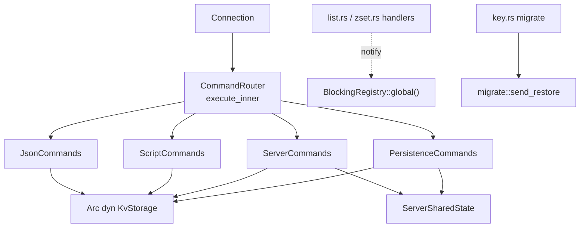
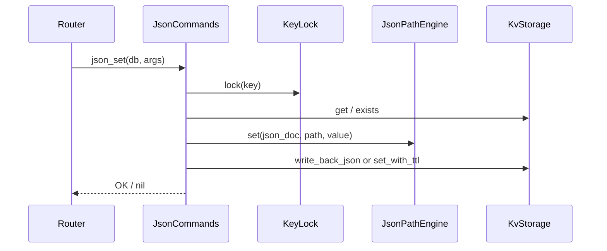
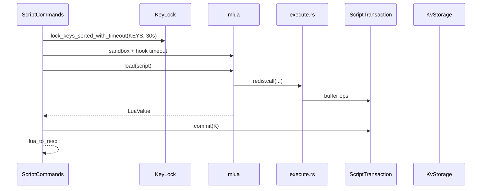

# AiKv Commands Extended (扩展命令层)

## 何时读本文

- 改 `src/command/{json,jsonpath,jsonpath_util,script,blocking,migrate,persistence,server}` 或 `router.rs` 中 extended match / `dispatch_object|config|client`
- 新增/修改 JSON.*、EVAL/SCRIPT、SAVE/BGSAVE、INFO/CONFIG/CLIENT/COMMAND、MIGRATE 网络传输
- 排查 JSONPath filter、Lua `redis.call`、脚本沙箱/超时、BGSAVE/checkpoint、阻塞唤醒
- **不覆盖**: String~ZSet/Key/DB handler、KeyLock 机制 → [commands-core.md](04-commands-core.md)
- **不覆盖**: ATOM.MULTI/EXEC/WATCH → [server.md](02-server.md) (`connection.rs`)
- **不覆盖**: MOVED/ASK、CLUSTER 子命令 → [cluster.md](06-cluster.md)
- **不覆盖**: slowlog 环形缓冲、latency 直方图、InfoRenderer 字段、Prometheus → [observability.md](07-observability.md)

## 架构一览



**装配** (见 [commands-core.md](04-commands-core.md)):

| 构造 | extended 能力 |
|------|----------------|
| `CommandRouter::new(storage)` | JSON + Lua; **无** INFO/SAVE (`require_server` → ERR) |
| `CommandRouter::new_with_shared(storage, shared)` | + `ServerCommands` + `PersistenceCommands` + JSON/Lua metrics |

## 代码地图

| 路径 | 职责 | 入口 |
|------|------|------|
| `command/json.rs` | 12 条 `JSON.*` | `JsonCommands::{json_set, json_get, json_mget, …}` |
| `command/jsonpath.rs` | JSONPath extract/set/delete/incr/append | `JsonPathEngine` |
| `command/jsonpath_util.rs` | 表达式拆分、JSON 比较 | `split_top_level`, `json_compare` |
| `command/script.rs` | EVAL / EVALSHA / SCRIPT | `ScriptCommands::{eval, evalsha, script}` |
| `command/script/cache.rs` | SCRIPT LOAD LRU 缓存 | `ScriptCache` (max 256) |
| `command/script/sandbox.rs` | mlua 沙箱 | `new_sandbox_lua` |
| `command/script/execute.rs` | `redis.call` / `redis.pcall` | `redis_call_async` |
| `command/script/json_exec.rs` | Lua 内 JSON 子集 | `exec_json_*` |
| `command/script/transaction.rs` | 脚本写缓冲 + commit | `ScriptTransaction::commit` |
| `command/script/convert.rs` | Lua ↔ RESP | `lua_to_resp`, `pcall_error_table` |
| `command/blocking.rs` | 阻塞等待基础设施 | `BlockingRegistry::{register, notify, evict_expired}`; `start_background_eviction` |
| `command/migrate.rs` | MIGRATE 目标 TCP 客户端 | `send_restore`, `RestoreTarget` |
| `command/persistence.rs` | SAVE / BGSAVE / LASTSAVE / SHUTDOWN | `PersistenceCommands` |
| `command/server.rs` | INFO / TIME / CONFIG / CLIENT / COMMAND / SLOWLOG / LATENCY | `ServerCommands` |
| `command/router.rs` | extended match; `dispatch_object/config/client` | `require_server`, `require_persistence` |
| `command/key.rs` | MIGRATE **编排** (DUMP → TCP) | `KeyCommands::migrate` |

## 关键 invariant (勿破坏)

- **JSON 存 String KV**: `storage.get/set/set_with_ttl` (非 typed 写路径); 文档为 `serde_json::Value` 序列化 bytes.
- **JSON TTL 写回**: 子路径修改走 `write_back_json` — 先 `get_typed` 取 `expires_at`, 再 `set` / `set_with_ttl`.
- **JSON.MSET**: `key_lock.lock_keys_sorted` 覆盖 batch 内全部 key.
- **JSONPath 根**: `$` 与 `.` 等价; filter `[?(@…)]` 裸 `@` 表示数组元素本身.
- **Lua 原子性**: 脚本内写操作进 `ScriptTransaction`; 成功结束后 **单次** `commit` 落盘; 失败 drop buffer.
- **Lua KEYS 校验**: `redis.call/pcall` 访问的 key 须在 EVAL 声明 KEYS 集合内.
- **Lua 缓存**: 仅 `SCRIPT LOAD` 写入 LRU; **EVAL 不**自动缓存.
- **pcall 错误**: 返回 `{err="…"}` 表 (非 oldmain 的 `Nil`).
- **BlockingRegistry**: 超时返回 **nil Array** (`RespValue::Array(None)`), 非 nil bulk.
- **MIGRATE payload**: 与 [commands-core.md](04-commands-core.md) DUMP 相同 — `[u8 version=0][bincode(StoredValue)]`.
- **持久化**: SAVE/BGSAVE/SHUTDOWN SAVE 仅 `StorageEngineKind::AiDb`; memory → ERR.
- **INFO**: 仅委托 `InfoRenderer`; 不在此 module 维护字段清单.

## 数据流

### JSON.SET (子路径)



### Lua EVAL



### BlockingRegistry (机制; handler 在 core)

1. **Wait**: `list`/`zset` handler 先非阻塞 pop; 失败 → `register(key, timeout)` + poll `try_recv` (10ms).
2. **Wake**: `LPUSH`/`RPUSH`/`ZADD` 成功后 `notify(key, OK)`.
3. **Timeout**: `timeout=0` → 立即 nil Array; `timeout<0` → 300s 上限.
4. **Evict**: `main.rs` 启动 1s tick 后台 task 调 `evict_expired()` — 清理超时 dead waiter 与 notify 后空槽 (不依赖 `monitoring` feature).

### MIGRATE

1. `key.rs::migrate` 解析 host/port/key/dest_db/timeout + COPY/REPLACE/AUTH/AUTH2/KEYS.
2. `KEYS` 子命令: 先收集 key 列表 (遇 trailing COPY/REPLACE/AUTH/AUTH2 停止), 再与单 key 路径共用 RESTORE 逻辑; 非 COPY → 源端 `delete`.
3. 单 key: `get_typed` → `dump_encode` → `migrate::send_restore` → 非 COPY 时 `delete`.
4. TCP: 可选 AUTH (password) 或 AUTH2 → `AUTH username password` → 非 0 库 SELECT → `#[cfg(cluster)] ASKING` → RESTORE.

### SAVE / BGSAVE

1. `ensure_persistent_engine()`.
2. `flush_engine()` → `create_checkpoint(shared.backup_dir)`.
3. SAVE: 同步; BGSAVE: CAS `bgsave_in_progress` + `tokio::spawn`; 成功 `record_save_success()`.

## JSON 命令

| 命令 | 写 | KeyLock | 要点 |
|------|:--:|:-------:|------|
| JSON.GET | | | path 默认 `$`; 无 key → nil bulk |
| JSON.MGET | | | `key [key ...] path`; 缺 key/path → null; wrong-type → WRONGTYPE |
| JSON.SET | ✓ | ✓ | NX/XX/XE/TTL; 根路径 `$`/`.` |
| JSON.DEL | ✓ | ✓ | 根路径 delete key; 子路径 path delete |
| JSON.TYPE / STRLEN / ARRLEN / OBJLEN | | | 只读; path 可选 |
| JSON.NUMINCRBY | ✓ | ✓ | path incr |
| JSON.ARRAPPEND | ✓ | ✓ | |
| JSON.UPDATE | ✓ | ✓ | wherePath + 多 path/value; 可选 NN |
| JSON.MSET | ✓ | sorted multi | triplets: key path value |

JSONPath 能力 (`jsonpath.rs`): `$`, `.`, `$.field`, `$[N]`, `[*]`, 多字段、`[?(@…)]` filter; `jsonpath_util` 提供比较/拆分.

## Lua / SCRIPT

| 项 | 值 / 行为 |
|----|-----------|
| 默认超时 | 5s (`DEFAULT_SCRIPT_TIMEOUT`) |
| **KeyLock 等待超时** | **30s** (`lock_keys_sorted_with_timeout`; 对齐 oldmain) |
| 内存上限 | 128MB (`DEFAULT_MEMORY_LIMIT`) |
| 沙箱 StdLib | TABLE, STRING, MATH, UTF8; Nil: load/require/rawget/rawset/… |
| SCRIPT LOAD | SHA1 hex; LRU 256 |
| SCRIPT EXISTS / FLUSH | 标准语义 |
| SCRIPT KILL | 恒 NOTBUSY (stub, 无运行中脚本跟踪) |

**`redis.call` 支持子集** (`execute.rs`, 按域): String (GET/SET/INCR*/APPEND/STRLEN…), Hash, List, Set, ZSet 常用读写, EXPIRE, JSON.* (10 条 via `json_exec`, 含 JSON.MGET).

## Server 命令 (handler + router dispatch)

| 命令 | 实现 | 说明 |
|------|------|------|
| INFO | `ServerCommands::info` → `InfoRenderer` | section 可选; 字段 → observability |
| TIME | `time` | Unix sec + micros |
| CONFIG GET/SET | `config_get/set` | `shared.config_map`; `slowlog-*` 联动; `appendonly` SET → ERR |
| CONFIG REWRITE/RESETSTAT | `router.dispatch_config` | OK no-op |
| CLIENT LIST/SETNAME/GETNAME | `client_*` | `shared.clients` |
| COMMAND * | `command` | 读 `registry` |
| SLOWLOG * | `slowlog` | 读 `shared.slow_query_log` |
| LATENCY * | `latency` | 读 `shared.latency_stats`; RESP2/3 格式分支 |
| OBJECT * | `router.dispatch_object` | ENCODING 按 `ValueType`; REFCOUNT/IDLETIME/FREQ **stub** |

## CommandRouter 扩展分支 (索引)

`execute_inner` match: `JSON.*` (12), `EVAL`/`EVALSHA`/`SCRIPT`, `INFO`/`TIME`/`CONFIG`/`CLIENT`/`SLOWLOG`/`LATENCY`/`COMMAND`, `SAVE`/`BGSAVE`/`LASTSAVE`/`SHUTDOWN`, `MIGRATE` → `key_cmds`. `CLUSTER` → cluster (步 11).

## 常见任务

### 新增 JSON.* 命令

1. `registry.rs` + `router.rs` match.
2. `JsonCommands` 方法; 写路径 `KeyLock` + `write_back_json` 模式.
3. 若需 JSONPath → `JsonPathEngine` 扩展.
4. 测试 `tests/modules/command/json.rs`.

### 扩展 Lua redis.call 子集

1. `execute.rs` match + handler; 同步 `command_key_indices` (KEYS 校验).
2. 写操作走 `ScriptTransaction`; 读走 `txn.get/get_value`.
3. 测试 `tests/modules/command/script.rs`.

### 排查 BGSAVE 失败

1. 确认 `--engine aidb` (`engine_kind == AiDb`).
2. 查 `shared.bgsave_in_progress` 是否卡住.
3. 日志 target `persist` / span `bgsave_checkpoint`.
4. checkpoint 路径 `shared.backup_dir`.

### 排查 BLPOP 永不返回

1. handler 在 [commands-core.md](04-commands-core.md) `list.rs`; 本章查 `BlockingRegistry`.
2. 确认写侧是否 `notify` (LPUSH/ZADD).

## 配置与 feature flags

| 项 | 位置 | 说明 |
|----|------|------|
| `backup_dir` | `ServerSharedState` | SAVE/BGSAVE checkpoint 目标 |
| `bgsave_in_progress` | `ServerSharedState` | BGSAVE 互斥 |
| `feature cluster` | `migrate.rs` | RESTORE 前 ASKING; MIGRATE 路由豁免见 cluster |
| `ServerMetrics` | JSON/Lua `with_metrics` | `on_json_command`, `on_lua_command` |

## 测试

```bash
cd aikv
cargo test --test commands
# extended: tests/modules/command/{json,script,persistence,server,key}.rs
# INFO golden: tests/modules/command/info_golden.rs, info_alignment.rs
# L2: tests/modules/server/tcp.rs
```

## 已知限制

- **JSON**: 全文档 RMW, 无 RedisJSON 内存优化; 非 String key → WRONGTYPE/解析失败.
- **Lua**: 无 SCRIPT KILL; 命令子集小于 Redis.
- **Lua pcall**: Redis `{err}` 表 (非 oldmain Nil).
- **BGSAVE 重入**: 第二次返回 **ERR** (非 oldmain SimpleString OK).
- **SHUTDOWN**: 仅 Default/SAVE/NOSAVE; 未知 mode → ERR.
- **OBJECT**: REFCOUNT/IDLETIME/FREQ 固定 stub.
- **SAVE 日志**: 同步 SAVE 成功事件名 `bgsave.complete` (target `persist`).

## 待核实

- (无 open 条目 — BlockingRegistry evict 见 ISSUE-005 closed)
