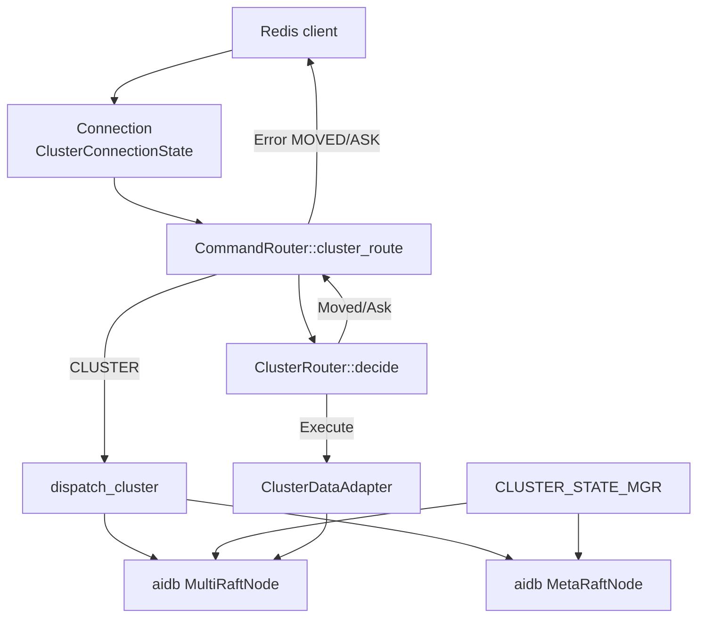
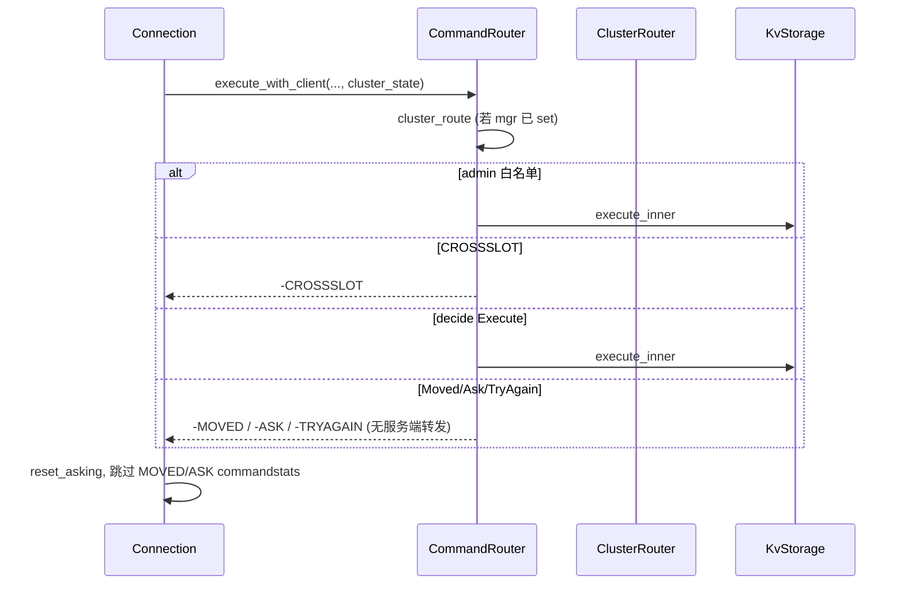

# AiKv Cluster (Redis Cluster 协议层)

## 何时读本文

- 改 `src/cluster/*`、`main.rs` 的 `init_cluster`, 或 `command/router.rs` 的 `cluster_route`
- 排查 MOVED/ASK/CROSSSLOT/CLUSTERDOWN、slot 迁移 (SETSLOT/MIGRATE)、failover、节点 MEET/FORGET
- 理解 aikv 与 aidb 在集群上的分工
- **不覆盖**: MetaRaft/MultiRaft/Router 实现、slot 迁移状态机、gRPC → [aidb cluster.md](../../../aidb/docs/modules/03-cluster.md)
- **不覆盖**: 数据面 `propose_group` / `ClusterDataAdapter` → [storage.md](03-storage.md)
- **不覆盖**: 命令分发骨架 / CROSSSLOT 前置插入点 → [commands-core.md](04-commands-core.md)
- **不覆盖**: MIGRATE TCP/RESTORE → [commands-extended.md](05-commands-extended.md)
- **不覆盖**: `aikv_cluster_redirects_total` / INFO cluster 段 → [observability.md](07-observability.md)
- **构建**: `--features cluster` (启用 `aidb/cluster`); aidb 侧需 `protoc`

## 与 aidb 的分工

| 层 | 仓库 | 职责 |
|----|------|------|
| 共识与拓扑 | aidb | MetaRaft (group 0)、MultiRaft 数据 group、Router/slot 表、MembershipCoordinator、SlotMigrationManager |
| RESP 适配 | aikv (本章) | MOVED/ASK 决策、CLUSTER 子命令 RESP、连接态、client 地址通告、进程装配 |
| KV 读写 | aikv storage | slot 已分配时写经 Raft (`ClusterDataAdapter`) |

权威拓扑 **始终** 来自 MetaRaft; aikv **不** 独立维护 slot/成员状态.

## 架构一览



## 代码地图

| 路径 | 职责 | 入口 |
|------|------|------|
| `cluster/mod.rs` | 模块根; re-export `key_to_slot`/`extract_hash_tag` | `pub mod cluster` |
| `cluster/state.rs` | 全局单例; leader 缓存; coordinator 注入 | `CLUSTER_STATE_MGR`, `ClusterStateManager` |
| `cluster/router.rs` | 同步路由决策 | `ClusterRouter::decide`, `check_cross_slot` |
| `cluster/routing_key.rs` | EVAL/多 key 路由 key 提取 | `cluster_routing_key` |
| `cluster/connection.rs` | 每连接 asking/readonly | `ClusterConnectionState` |
| `cluster/announce.rs` | MOVED/SLOTS 客户端地址; 内部转发 TCP 地址 | `AnnounceResolver`, `AnnounceMode` |
| `cluster/commands.rs` | CLUSTER 子命令 + `dispatch_cluster` | `cluster_meet`, `cluster_set_slot`, … |
| `cluster/gossip.rs` | 拓扑 tick: leader 缓存 + gossip metrics | `start_background_refresh` |
| `cluster/config_auto_save.rs` | MetaRaft version → `nodes.conf` | `ConfigAutoSave::run` |
| `cluster/replication.rs` | HELLO/INFO role 标签 | `node_replication_role` |
| `command/router.rs` | 普通命令 cluster 前置 + `CLUSTER` dispatch | `cluster_route`, `execute_with_client` |
| `server/connection.rs` | ASKING/READONLY/READWRITE; 传/重置 asking | `Connection::run` |
| `main.rs` | CLI + `init_cluster` + `build_storage` 包 adapter | `init_cluster` (main.rs L246–545) |

> 实现文件为 `cluster/commands.rs`, **非** `command/cluster_commands.rs`.

## 关键 invariant (勿破坏)

- **`CLUSTER_STATE_MGR`**: `init_cluster` 成功后才 `set`; 未 set 时 `cluster_route` 跳过 (非 cluster 单机行为).
- **Assigned slot 写**: 必须经数据面 Raft (`ClusterDataAdapter`); **禁止** 写 local fallback (见 storage.md).
- **`ClusterRouter::decide` 同步**: 只读缓存 + MetaRaft 快照; 不 `.await` OpenRaft.
- **IMPORTING 写窗口**: 目标节点 `importing_slots` 或连接 `ASKING` + Migrating/IMPORTING 状态 → `Execute`; 与 MIGRATE RESTORE 配合. **不含** Frozen / ReadyToCommit (见下).
- **Prepare / Migrating (F-056-A1)**: 写 ASK target + `Request::MigrationWrite` (同批 mig tombstone); 读为**合并读** (导向 target leader: tombstone Del → miss; target hit → 值; 否则 source fallback, 含 remote RPC). 非 leader 且非 readonly 的写仍 `MOVED` 到 source leader (再 ASK).
- **Frozen (F-056-A1)**: 一切客户端写 (含 ASKING / importing / MIGRATE·RESTORE) → `TRYAGAIN`; 读为**合并读** (覆盖 A2 的"仍走 source").
- **ReadyToCommit (F-056, A2 起点)**: 写仍 `TRYAGAIN`; 读**必须**导向 target (`Execute` / `ASK` / `MOVED`), 纯 target 无 source fallback.
- **SCAN 族 (F-056-A1)**: 任意活跃迁移期间 SCAN/HSCAN/SSCAN/ZSCAN → `TRYAGAIN` (在 admin 白名单短路之前拦截).
- **ASKING 一次性**: `Connection` 每命令执行后 `reset_asking`.
- **readonly replica 读**: `READONLY` + `CommandType::Read` + 本地 group → 本地读; 写仍 MOVED 到 leader. 迁移活跃期读统一导向 target (合并读或纯 target).
- **admin 白名单**: `cluster_route` 内命令 (PING/CLUSTER/INFO/…) **不** 按 key 路由; SCAN 族见上例外. MIGRATE/RESTORE 仅 Frozen/Ready 时仍返回 TRYAGAIN.
- **CROSSSLOT**: 多 key 命令 (MGET/MSET/DEL/BLPOP/…) 须同 slot; MSET key 在偶数下标.
- **Announce unknown 模式**: 客户端见 `:port`; smart client 用 `redis-cli -c` 或 cluster-aware SDK 跟随 MOVED/ASK.
- **无服务端透明转发**: MOVED/ASK/TRYAGAIN 仅返回错误字符串; MOVED/ASK **不计入** commandstats; TRYAGAIN 计入 errorstats.

## 数据流

### 进程启动 (`init_cluster`)

1. 打开/复用 aidb `DB` (`use_wal: true`)
2. `MetaRaftNode` + 共享 `RaftServiceDispatcher` + Meta gRPC (`--cluster-rpc-addr`)
3. bootstrap (`peers` 空) 或 join peers; 后台 `AIKV_CLIENT_ADDR` → MetaRaft
4. `Router` + `LifecycleManager` + `MultiRaftNode::start_lifecycle_with_data`
5. 数据面 gRPC: `rpc_port + cluster_data_port_offset` (默认 +10000)
6. `MembershipCoordinator` + `SlotMigrationManager` 注入 `ClusterStateManager`; **`state_mgr.metrics = Some(Arc<ServerMetrics>)`** (拓扑 tick → `aikv_gossip_messages_total`) → `CLUSTER_STATE_MGR.set`
7. 后台: 拓扑 tick (leader 缓存 + metrics)、LeaderChangeWatcher → `apply_observed_group_leader`、`ConfigAutoSave` → `nodes.conf`

`build_storage` (aidb 路径): `StorageAdapter` → `ClusterDataAdapter` → `KvStorageAdapter`.

### 普通命令 (非 CLUSTER)



### Slot 迁移 (Kv 侧协调)

1. 源: `CLUSTER SETSLOT <slot> MIGRATING <target-id>` → `SlotMigrationManager::start_migration`
2. 目标: `CLUSTER SETSLOT <slot> IMPORTING <source-id>` → 本地 `importing_slots`
3. `MIGRATE` + `ASKING` + RESTORE (commands-extended); 或内置 `run_pending_migration`
4. `CLUSTER SETSLOT <slot> STABLE` / `CLUSTER REBALANCE` → `finish_migration()`
   (`freeze → quiesce → final_verify → mark_ready → commit`); 失败返回 ERR

Prepare/Migrating: 写 ASK target + MigrationWrite, 读合并读 (target leader).
Frozen: 写 TRYAGAIN, 读合并读. ReadyToCommit: 写 TRYAGAIN, 读纯 target.
目标 IMPORTING 写仅在 Prepare/Migrating 窗口 `Execute` (含 `ASKING` /
`importing_slots`); Frozen/Ready 一律 TRYAGAIN. 活跃迁移期 SCAN 族 TRYAGAIN.

## 分区/脑裂防护 (cluster_state:fail)

本节点视角集群健康由 `ClusterStateManager::cluster_state_ok` (`AtomicBool`) 派生,
数据源为 LeaderChangeWatcher 的 group 级 quorum 探活 (aidb 侧, 规则见
[aidb cluster.md](../../../aidb/docs/modules/03-cluster.md)):

- **探活规则**: 仅对本节点是 leader 的 group 判定; 读 `RaftMetrics::last_quorum_acked`,
  距最近一次 quorum ack 超过 `lease` (= `--raft-election-timeout-max`, 默认 2000ms) →
  该 group 已失去多数派. **单节点 group (voters 仅自己) 恒为 self-quorum 直接判有效**
  (openraft ≥alpha.32 无 follower 回复, 该时间戳会停滞). 判定/汇总为纯函数
  `judge_leader_quorum` + `derive_cluster_ok` (单测覆盖).
- **效果**:
  - 被隔离的少数派旧 leader 视角 `CLUSTER INFO` 的 `cluster_state` 报 `fail`.
  - 路由层拒绝**所有**数据访问 (读与写) → `CLUSTERDOWN` (Redis 语义:
    写拒绝防双主, 读拒绝防滞后读). admin 命令 (CLUSTER INFO/NODES 等) 经
    `cluster_route` 白名单绕过.
  - 多数派侧节点不受影响: follower 不参与 quorum 判定; 新 leader 首个 quorum ack
    前 (`last_quorum_acked = None`) 不误判.
- **装配**: `main.rs` watcher 同步任务每 tick 调 `apply_observed_group_quorum`
  注入探活状态并派生 `cluster_state_ok`. `derive_cluster_ok` (路由门) 与
  `compute_cluster_state` (CLUSTER INFO) 为独立实现, 但**共用同一 quorum 数据源**
  (`group_quorum_ok` / `resolve_group_leader_for_info`), 孤儿 slot 组 (槽指派但
  group 不在 meta) 与 quorum 失效均判 fail, 避免两套判定漂移.
- **读路径一致性**: 集群装配默认 `linearizable_read=true` (env
  `AIKV_LINEARIZABLE_READ=0/false` 可关); aidb 侧 `OpenRaftNode::get` 用
  `ReadPolicy::LeaseRead` (正常期零 RTT 本地读, 分区期 lease 过期快速失败).
  aikv 主 GET 走本地状态机直读 (`ClusterDataAdapter::get`), 不经过 LeaseRead,
  其分区期保护由上述 cluster_state:fail 门控覆盖.
- **known limitations**: 无 key 数据命令 (PING/INFO 等) 在 fail 态不拒绝;
  新 leader 首个 quorum ack 前被分区时, 写挂起至 client 超时且**路由门控同样保持
  开放** (此时读侧 LeaseRead 会快速失败, 且新 leader 持有全部已提交日志故无数据
  正确性问题, 只是写侧不对称); 与旧 leader 同处少数派分区的 follower 不被门控
  (非 leader 不判定, 会持续服务陈旧本地读 — 与 Redis 全节点 fail 语义的取舍);
  slot 未全分配 / 孤儿 slot 组时 gate 与 CLUSTER INFO 语义按「未知 group 视为
  有效 (gate) / 视为 fail (INFO)」处理, 两处已对齐为 fail;
  探活门控为单次判定 (无滞回): 健康 leader 偶发停顿 > lease (如大 batch apply /
  存储 IO 阻塞) 时该节点会误报 CLUSTERDOWN, 属 fail-closed 取舍;
  直读路径门控采样粒度 = watcher tick (`election_timeout_min/2` = 500ms),
  最坏情形门控关闭较 lease 过期滞后 ≤1 tick; 3 成员数据组下新 leader 选举耗时
  (>lease) 与门控时序有 500ms 余量, 但 >3 成员数据组存在 (lease, lease+tick]
  窗口内读到旧 leader 陈旧数据的理论可能.

## 关键类型

| 类型 | 说明 |
|------|------|
| `RouteDecision` | `Execute` / `Moved` / `Ask` / `TryAgain` / `ClusterDown` |
| `CommandType` | `Read` / `Write` / `Admin` |
| `ClusterConnectionState` | `asking`, `readonly` |
| `AnnounceMode` | `Fixed` (完整 host:port) / `UnknownEndpoint` (默认 `:port`) |
| `ReplicationRole` | `Primary` / `Replica { primary_id }` (由 `CLUSTER REPLICATE` 设置) |

## CLUSTER 子命令

### Redis 标准 (已实现)

| 子命令 | 入口 | 说明 |
|--------|------|------|
| KEYSLOT, MYID | `cluster_keyslot`, `cluster_myid` | |
| INFO, NODES, SLOTS, SHARDS, MYSHARDID | `cluster_*` | INFO: `cluster_state` 按 slot 覆盖 + group leader 动态 ok/fail, 并纳入 quorum 探活 (分区期被隔离旧 leader 报 fail) |
| COUNTKEYSINSLOT, GETKEYSINSLOT | scan 本地 group SM | |
| MEET, FORGET [FORCE] | `MembershipCoordinator` | MEET NotLeader 退避重试 |
| ADDSLOTS [NODE id], DELSLOTS | MetaRaft `AssignSlots`/`UnassignSlots` | 无 group 时 ADDSLOTS 可自动 CreateGroup |
| SETSLOT MIGRATING/IMPORTING/NODE/STABLE | migration mgr + 本地 map | |
| REPLICATE, REPLICAS | 元数据 / 列表 | REPLICATE 仅本地 role |
| FAILOVER [FORCE\|TAKEOVER] | `change_group_membership` 升主 | 需 replica role |
| SAVECONFIG, BUMPEPOCH | `nodes.conf` / MetaRaft propose | |

### AiKv 扩展

| 子命令 | 说明 |
|--------|------|
| CREATEGROUP | 空 data group, 不分配 slot |
| ADD_REPLICA / DEL_REPLICA | group 成员变更 (跨 group 可仅 MetaRaft 元数据) |
| REBALANCE | `SlotMigrationManager` 再均衡 |
| GROUPSTATUS | 暴露 Raft metrics (current_leader, members, last_log_index, last_applied, running_state, replication_count) |

### AiKv 扩展 (cluster-test-util feature only)

| 子命令 | 说明 |
|--------|------|
| FAILPOINT ARM \<name\> [once] | 武装故障注入点 (panic on trigger) |
| FAILPOINT RELEASE \<name\> | 解除指定 failpoint |
| FAILPOINT STATUS | 查询所有 failpoint 状态 |

### 未实现 / stub

| 子命令 | 行为 |
|--------|------|
| CLUSTER RESET | **不支持** — 返回 ERR; 见下方 [重置集群](#重置集群无-cluster-reset) |
| CLUSTER METARAFT * | 不在 aikv; 见 [aidb cluster.md](../../../aidb/docs/modules/03-cluster.md) |
| SET-CONFIG-EPOCH | 恒 OK |
| COUNT-FAILURE-REPORTS | 恒 0 |

NotLeader (MetaRaft propose): `map_propose_error` → `MOVED 0 <addr>` 或 CLUSTERDOWN.

## 配置与 feature flags

| 项 | 位置 | 说明 |
|----|------|------|
| `feature cluster` | `Cargo.toml` | `cluster = ["aidb/cluster"]` |
| `--cluster-node-id` | `main.rs` CLI | 节点 ID |
| `--cluster-rpc-addr` | `main.rs` CLI | MetaRaft gRPC |
| `--cluster-peers` | `main.rs` CLI | 加入集群 peer 列表 |
| `--cluster-data-port-offset` | `main.rs` CLI | 默认 10000 |
| `AIKV_CLIENT_ADDR` | env | 写入 MetaRaft `client_addr` |
| `AIKV_CLUSTER_ANNOUNCE_MODE` | env | `unknown` (默认) / `fixed` |
| gossip / lifecycle / autosave 间隔 | `main.rs` CLI | 拓扑 tick / lifecycle / autosave 间隔 |

## 常见任务

### 排查 MOVED 循环

1. 目标节点 `CLUSTER NODES` 中 `client_addr` 是否可达 (`AIKV_CLIENT_ADDR`)
2. `AIKV_CLUSTER_ANNOUNCE_MODE=fixed` 是否更适合 LAN
3. `LeaderChangeWatcher` / 拓扑 tick 是否刷新 router (`apply_observed_group_leader`)
4. 对比 aidb Router slot 表: `CLUSTER SLOTS` vs MetaRaft

### 手动 failover

1. 副本节点: `CLUSTER REPLICATE <master-id>` (元数据)
2. `CLUSTER FAILOVER FORCE` → 本节点 `change_group_membership` 为 sole voter
3. 验证 `CLUSTER NODES` 中 `myself,master`; 数据可读性依赖 prior Raft 复制 (storage adapter)

### 在线迁槽

1. 源 `SETSLOT MIGRATING`; 目标 `SETSLOT IMPORTING`
2. `MIGRATE` (源) → 目标 RESTORE (自动 ASKING)
3. 双方 `SETSLOT STABLE`

### 重置集群 (无 CLUSTER RESET)

AiKv 集群元数据由 **MetaRaft 共识** 维护, 非 Redis 式每节点本地 `nodes.conf`. 单节点 `CLUSTER RESET` **不支持**: 命令返回明确 ERR, 不会清 MetaRaft / MultiRaft 状态.

**为何不支持**: 忘记节点、清空 slot、改 node ID 等需 MetaRaft propose 或删持久化目录; 运行中假 OK 比 explicit ERR 更易造成运维误判. oldmain 虽有 `cluster_reset()` 但未接入 dispatch, SOFT 为空操作.

| 场景 | 替代步骤 |
|------|----------|
| 单节点重初始化 | 停进程 → `rm -rf <data_dir>/*` → 重启 (bootstrap: `--cluster-peers` 空; join: 带 peers) |
| 全集群重搭 | 所有节点停服 → 各节点清 `data_dir` → 按 e2e 流程 MEET + ADDSLOTS (参考 `e2e/function/` pytest 套件, 如 [failover](../../e2e/function/failover/test_failover.py)) |
| slot 冲突 / 重复分配 | MetaRaft leader 上 `CLUSTER DELSLOTS` / `FORGET`; 严重则全量清 data_dir |
| 仅清连接 ephemeral | 重启进程 (清 `importing_slots`、ASKING 等) |

```bash
# 单节点示例 (停服后)
rm -rf /var/lib/aikv/node1/*
aikv --features cluster --engine aidb --data-dir /var/lib/aikv/node1 \
  --cluster-node-id 1 --cluster-rpc-addr 127.0.0.1:5001 --bind 127.0.0.1:7001
```

### 新增 CLUSTER 子命令

1. 在 `cluster/commands.rs` 实现 handler
2. 注册 `dispatch_cluster` match arm
3. 若影响路由: 同步 `cluster_route` admin 白名单 / `is_multi_key_cmd`
4. 若写 MetaRaft: 用 `map_propose_error` 统一 NotLeader

## 测试

```bash
cargo test --features cluster cluster_ -- --test-threads=1
cargo test --features cluster -p aikv --test cluster_integration
cargo test --features cluster -p aikv --test cluster_routing
cargo test --features cluster -p aikv --test cluster_commands
cargo test --features cluster -p aikv --test cluster_creategroup

# e2e (pytest, 黑盒; 需已部署被测服务)
pytest e2e/function/failover -v   # 故障切换
pytest e2e/function/migration -v  # 槽位迁移
```

## 已知限制

- **非 Redis Gossip**: 无 cluster bus PING/PONG; 拓扑靠 MetaRaft + MEET (见 Gossip 节).
- **REPLICATE/FAILOVER**: 手动模型; replica 不自动服务写; 非 Redis 全自动 failover.
- **无 CLUSTER RESET**: MetaRaft 共识; 停服清 `data_dir` 重搭 — 见上方排障节.
- **无 CLUSTER METARAFT RESP 子命令**.
- **无 ADDSLOTSRANGE** (redis-cli 常用 ADDSLOTS 仍可用).
- **透明转发**: 仅 server 侧; smart client (`redis-cli -c`) 仍靠 MOVED/ASK 字符串.
- **MSETNX**: 未实现; 非 cluster 特有限制 — 见 [commands-core.md](04-commands-core.md).

## Gossip (轻量)

**无 Redis cluster bus PING/PONG**; 成员与 slot 权威拓扑来自 MetaRaft. `cluster/gossip.rs` 的 `start_background_refresh` 仅周期性:

- 调用 `ClusterStateManager::refresh()` 更新本地 group leader 路由缓存
- 递增 `CLUSTER INFO` 的 `cluster_stats_messages_*` (metrics 语义, 非真实 gossip 报文)
- OTel: `on_gossip_refresh` → 内部 `GOSSIP.tick` → `sync_counters` → `aikv_gossip_messages_total` (需 `init_cluster` 注入 `ClusterStateManager.metrics`)

`CLUSTER NODES` **直接读 MetaRaft** (`cluster_nodes()`); ping-sent/pong-recv 恒 `0 0` (与 oldmain 一致). link-state 来自 `NodeInfo.status` (`Online`/`Draining` → `connected`, `Offline` → `disconnected`). 故障检测与成员变更以 MetaRaft/Raft 为准.
