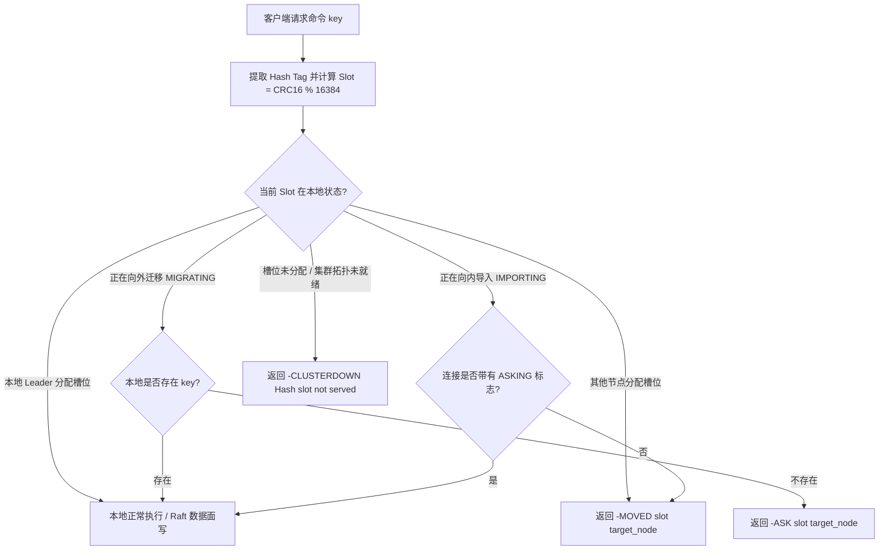

# AiKv Cluster (Redis Cluster 协议层)

## 何时读本文

- 修改 `src/cluster/{router.rs, routing_key.rs, state.rs, gossip.rs, replication.rs, connection.rs, commands.rs, announce.rs, config_auto_save.rs, mod.rs}` 源码;
- 排查 16384 槽位计算、`{...}` Hash Tag 提取、`-MOVED` / `-ASK` 客户端重定向逻辑;
- 排查 `CLUSTER` 系列子命令 (`NODES`, `SLOTS`, `SHARDS`, `SETSLOT`, `MEET`, `FAILOVER` 等) 实现;
- 排查连接级 `ASKING` 与 `READONLY` 读副本标志、Slot 在线迁移状态机;
- **不覆盖**: 底层 MetaRaft (控制面) 与 MultiRaft (数据面) 状态机实现 → [AiDb Cluster 文档](../../../aidb/docs/modules/03-cluster.md);
- **不覆盖**: 数据面写批处理 `ClusterDataAdapter` → [storage.md](03-storage.md);
- **不覆盖**: MIGRATE 网络传输与 RESTORE 编解码 → [commands-extended.md](05-commands-extended.md).

---

## 代码地图

| 文件路径 | 模块核心职责 | 公共接口与核心入口 |
| :--- | :--- | :--- |
| [`src/cluster/mod.rs`](../../src/cluster/mod.rs) | 集群模块根; 统一导出路由工具与子命令处理器 | `AnnounceResolver`, `key_to_slot`, `extract_hash_tag` |
| [`src/cluster/router.rs`](../../src/cluster/router.rs) | 集群路由决策器: Slot 计算、本地 Leader 判定与重定向响应生成 | `ClusterRouter::decide`, `migration_phase_for_slot` |
| [`src/cluster/routing_key.rs`](../../src/cluster/routing_key.rs) | Redis 标准 `{...}` Hash Tag 提取算法与 Key 槽位哈希计算 | `extract_hash_tag`, `key_to_slot` |
| [`src/cluster/state.rs`](../../src/cluster/state.rs) | `ClusterStateManager` 拓扑缓存、Leader 路由快照与全局单例管理 | `ClusterStateManager`, `CLUSTER_STATE_MGR` |
| [`src/cluster/gossip.rs`](../../src/cluster/gossip.rs) | 节点间轻量拓扑 tick、Leader 路由缓存刷新与 Gossip 监控指标采集 | `start_gossip_task` |
| [`src/cluster/replication.rs`](../../src/cluster/replication.rs) | 主从复制状态维护、`READONLY` / `READWRITE` 副本读门控 | `ReplicationState` |
| [`src/cluster/commands.rs`](../../src/cluster/commands.rs) | `CLUSTER` 族全量子命令统一分发与处理 | `dispatch_cluster` |
| [`src/cluster/announce.rs`](../../src/cluster/announce.rs) | 容器 / NAT 外部客户端通告地址解析器 (`AIKV_CLIENT_ADDR`) | `AnnounceResolver`, `AnnounceMode` |
| [`src/cluster/config_auto_save.rs`](../../src/cluster/config_auto_save.rs) | 集群节点状态与拓扑变更自动持久化 | `ConfigAutoSave` |

---

## 关键 Invariants (勿破坏规则)

- **16384 固定槽位与 Hash Tag 规范**:
  - 全局槽位固定为 `16384` 个 (`0..16383`);
  - 槽位计算严格遵循 `CRC16(tag) % 16384`, 其中 `tag` 为第一个 `{` 与第一个 `}` 之间的非空字节切片 (若无 `{}` 则对完整 Key 做 CRC16).
- **客户端重定向无代理原则**:
  - 当 Key 所在 Slot 不在本节点时, 必须向客户端返回 `-MOVED <slot> <target_ip:port>` 字符串错误;
  - 在 Slot 迁移期间, 当 Key 在源节点不存在但处于迁移中时, 返回 `-ASK <slot> <target_ip:port>`;
  - **严禁在服务端代为透明网络转发**, 所有路由重定向均由客户端处理.
- **连接级标志 (`ASKING` & `READONLY`)**:
  - `ASKING`: 仅在当前连接的**紧接着下一条命令**临时生效, 允许目标节点在 `IMPORTING` 状态下执行该命令;
  - `READONLY`: 标记当前连接为只读, 允许在从副本节点上直接读取本 Group 的数据而无需 MOVED 重定向至 Leader; 写命令仍强制 MOVED.
- **拓扑真源为 MetaRaft**:
  - `CLUSTER NODES`, `CLUSTER SLOTS`, `CLUSTER SHARDS` 的权威数据均读取 AiDb 的 `MetaRaft` 快照;
  - AiKv 内部的 Gossip 仅负责周期性拉取 MetaRaft 拓扑并刷新本地缓存, 严禁使用 Gossip 进行投票选主.
- **不支持 `CLUSTER RESET`**:
  - 由于元数据受 MetaRaft 共识保护, `CLUSTER RESET` 必须返回明确的报错信息, 禁止客户端在线重置元数据.

---

## 集群路由决策与 Slot 迁移流程

---

## 支持的 CLUSTER 子命令清单

| 子命令 | 权限与类型 | 说明 |
| :--- | :--- | :--- |
| `CLUSTER NODES` | 只读 | 输出集群全部节点 ID、IP:Port、角色 (master/slave)、Leader 状态与负责 Slot 范围 |
| `CLUSTER SLOTS` | 只读 | 输出三元组数组 (`[start_slot, end_slot, [ip, port, id], ...]`) 供客户端构建路由表 |
| `CLUSTER SHARDS` | 只读 | Redis 7.0+ / 8.8 分片拓扑视图 (包含 slots 与 nodes 列表) |
| `CLUSTER INFO` | 只读 | 输出 `cluster_state:ok`、`cluster_slots_assigned`、`cluster_known_nodes` 等状态 |
| `CLUSTER MYID` | 只读 | 返回当前节点的 40 字符 Node ID |
| `CLUSTER KEYSLOT <key>` | 只读 | 计算并返回指定 Key 的槽位编号 (0..16383) |
| `CLUSTER MEET <ip> <port> [c_port]` | 运维写 | 引导将目标节点加入集群 (自动同步至 MetaRaft) |
| `CLUSTER FORGET <node-id>` | 运维写 | 从集群中移除指定节点 |
| `CLUSTER ADDSLOTS <slot...>` | 运维写 | 将指定 Slot 集合分配给当前节点 |
| `CLUSTER DELSLOTS <slot...>` | 运维写 | 移除当前节点负责的 Slot |
| `CLUSTER SETSLOT <slot> MIGRATING <node-id>` | 迁移 | 将槽位标记为向目标节点迁出 |
| `CLUSTER SETSLOT <slot> IMPORTING <node-id>` | 迁移 | 将槽位标记为从源节点迁入 |
| `CLUSTER SETSLOT <slot> STABLE` | 迁移 | 结束迁移, 槽位进入稳定服务状态 |
| `CLUSTER SETSLOT <slot> NODE <node-id>` | 运维写 | 强制将槽位归属变更至指定节点 |
| `CLUSTER FAILOVER [FORCE\|TAKEOVER]` | 运维写 | 手动触发从节点晋升为主节点 |
| `CLUSTER REPLICATE <node-id>` | 运维写 | 配置当前节点作为指定主节点的副本 |
| `CLUSTER REPLICAS <node-id>` | 只读 | 列出指定主节点下的所有从节点列表 |
| `CLUSTER REBALANCE` | 运维写 | 触发全局槽位自动负载均衡迁移 |
| `CLUSTER CREATEGROUP <group-id>` | 扩展 | 创建新的 MultiRaft 数据分片组 |
| `CLUSTER GROUPSTATUS [group-id]` | 扩展 | 查询各 MultiRaft 数据组的 Raft 状态与 Leader 节点 |
