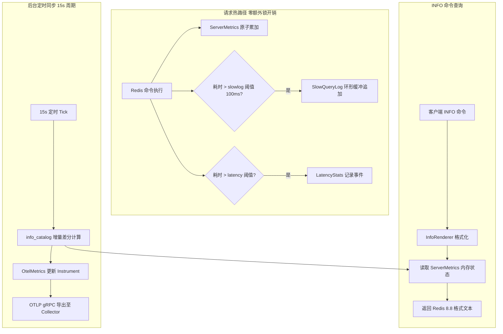

# AiKv Observability (可观测性架构)

## 何时读本文

- 修改 `src/server/{slowlog.rs, latency.rs, info.rs, info_catalog.rs, metrics.rs, metrics_server.rs, otel.rs, otel_metrics/, process_metrics.rs}` 或 `src/storage/observation.rs` 源码;
- 排查 Redis `INFO` 命令输出、`SLOWLOG` 环形缓冲、`LATENCY` 延迟尖刺统计;
- 排查 OpenTelemetry (`aikv_*`) 指标管道、Tracing Span 层次与 OTLP gRPC 导出;
- **不覆盖**: TCP 连接管理与内联命令分发 → [server.md](02-server.md);
- **不覆盖**: `INFO` / `SLOWLOG` / `LATENCY` 命令语法解析 → [commands-extended.md](05-commands-extended.md);
- **不覆盖**: 底层 AiDb `aidb_*` 存储指标与 Raft 状态 → [AiDb Observability 文档](../../../aidb/docs/modules/05-observability.md);
- **指标全量字典与 INFO 对照表**: 详见 [observability-reference.md](08-observability-reference.md).

---

## 代码地图

| 文件路径 | 模块核心职责 | 公共接口与核心入口 |
| :--- | :--- | :--- |
| [`src/server/metrics.rs`](../../src/server/metrics.rs) | `ServerMetrics` 原子内存单例 (请求热路径高性能计数真源) | `ServerMetrics`, `on_command_done`, `record_keyspace_hit` |
| [`src/server/info.rs`](../../src/server/info.rs) | Redis 8.8 `INFO` 11 个 Section 格式化渲染器 | `InfoRenderer::render_section`, `render_all` |
| [`src/server/info_catalog.rs`](../../src/server/info_catalog.rs) | `ServerMetrics` 增量差分计算与 OTel Instrument 同步器 | `sync_otel_from_server_metrics` |
| [`src/server/slowlog.rs`](../../src/server/slowlog.rs) | `SlowQueryLog` 环形缓冲区 (支持 `SLOWLOG GET/LEN/RESET`) | `SlowQueryLog::record`, `get_entries` |
| [`src/server/latency.rs`](../../src/server/latency.rs) | `LatencyStats` 延迟尖刺事件采样与直方图统计 | `LatencyStats::record_event`, `get_latest` |
| [`src/server/otel.rs`](../../src/server/otel.rs) | OpenTelemetry TracerProvider 与 MeterProvider 初始化及资源绑定 | `init_tracer`, `init_meter` |
| [`src/server/otel_metrics/`](../../src/server/otel_metrics/) | `aikv_*` 全部 OTel Counter, Gauge, Histogram 指标声明与更新 | `OtelMetrics`, `refresh_runtime_metrics` |
| [`src/server/process_metrics.rs`](../../src/server/process_metrics.rs) | 进程级 CPU 时间、内存 RSS、Peak RSS 与文件描述符采集 | `collect_process_metrics` |
| [`src/server/metrics_server.rs`](../../src/server/metrics_server.rs) | 独立 HTTP 探活服务 (`/health` 与 `/`, feature = "monitoring") | `MetricsServer::run` |

---

## 关键 Invariants (勿破坏规则)

- **单一真源原则 (Single Source of Truth)**:
  - 业务请求热路径**仅更新** `ServerMetrics` 中的原子计数器 (Atomic / Concurrent Map);
  - `INFO` 命令渲染与 `CLUSTER INFO` 直接读取 `ServerMetrics`;
  - 严禁在热路径上同时向两个指标系统重复加锁写入.
- **OTel 增量镜像同步 (15s 周期)**:
  - 后台周期性任务调用 `info_catalog::sync_otel_from_server_metrics()`, 读取 `ServerMetrics` 快照并计算增量 Delta, 随后调用 OTel Counter `add(delta)`;
  - 指标数据相对于内存真源最多滞后 ~15s (符合云原生监控抓取常规间隔).
- **热路径 Debug Span 约束**:
  - `kv_command`, `cmd_string`, `batcher_batch_done` 等高频请求 Span 必须标注 `level = "debug"`;
  - 生产环境运行在 `RUST_LOG=info` 时, tracing 静态过滤将开销降至零.
- **端口协议隔离**:
  - Redis RESP 端口 (6379) 与 HTTP 协议不兼容;
  - `--metrics-addr:--metrics-port` (默认 9191) 仅提供 HTTP `/health` 探活响应 (返回 `200 OK`), **不提供** HTTP `/metrics` 文本抓取;
  - 生产环境监控统一通过 OTLP gRPC 管道推送给 OpenTelemetry Collector.

---

## 可观测性架构与数据流

---

## INFO 渲染段 (Sections) 与 Redis 8.8 对齐

`InfoRenderer` 支持 Redis 8.8 规范的全部 11 个标准段:

1. **`Server`**: 版本 (`redis_version: 0.10.5` 与 `redis_compatible_version: 8.8`), 运行模式, OS, 启动时间;
2. **`Clients`**: 当前连接数 (`connected_clients`), 最大连接上限, 阻塞客户端数 (`blocked_clients`);
3. **`Memory`**: 使用内存 (`used_memory`), 峰值内存 (`used_memory_peak`), 碎片率 (`mem_fragmentation_ratio`);
4. **`Persistence`**: 持久化引擎状态, 最后一次快照时间戳 (`rdb_last_save_time`), 正在进行的 BGSAVE 状态;
5. **`Stats`**: 累计处理请求数 (`total_commands_processed`), 网络吞吐 (`total_net_input/output_bytes`), Key 命中/未命中 (`keyspace_hits/misses`);
6. **`Replication`**: 节点角色 (`role: master/slave`), 连接从节点数, 复制偏移量;
7. **`CPU`**: 用户态与内核态 CPU 耗时 (`used_cpu_sys`, `used_cpu_user`);
8. **`Modules`**: 已加载模块列表 (空);
9. **`Errorstats`**: 详细错误分类统计 (`errorstat_WRONGTYPE`, `errorstat_ERR` 等);
10. **`Cluster`**: 集群启用标志 (`cluster_enabled: 1`), 集群状态 (`cluster_state: ok/fail`), 槽位分配数;
11. **`Keyspace`**: 各逻辑数据库 Key 总数与设置 TTL 的 Key 数量 (`db0:keys=100,expires=10,avg_ttl=3600000`).
