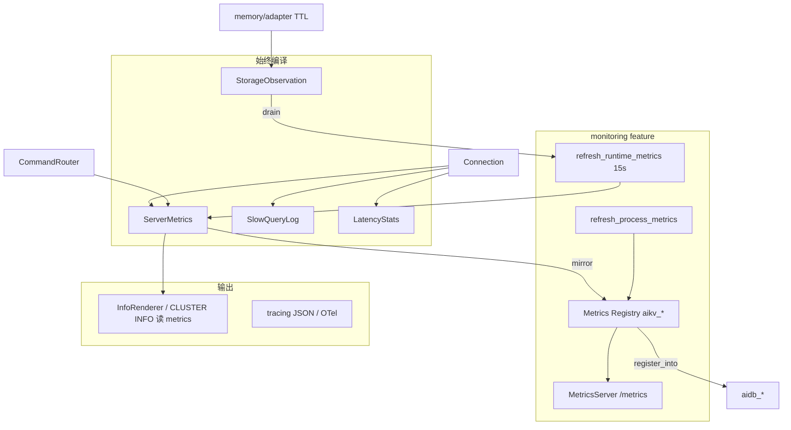
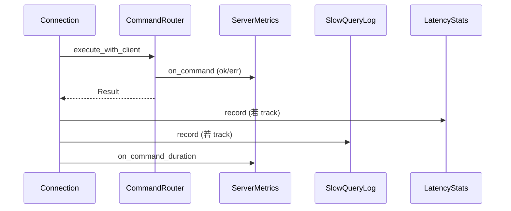

# AiKv Observability (可观测性)

## 何时读本文

- 改 `server/{slowlog,latency,info,metrics,metrics_server,process_metrics}`、`storage/observation`, 或 `main.rs` tracing/OTel/metrics 装配
- 排查 INFO 与 Prometheus 数值不一致、慢查询/SLOWLOG、LATENCY 直方图、`/metrics` scrape
- 接集群 gossip/failover/redirect 计数、JSON/Lua 专用 metrics
- **不覆盖**: TCP 连接循环与内联命令 → [server.md](server.md)
- **不覆盖**: INFO/SLOWLOG/LATENCY/COMMAND **命令 dispatch** → [commands-extended.md](commands-extended.md)
- **不覆盖**: MOVED/ASK、CLUSTER 子命令语义 → [cluster.md](cluster.md) (本章只写 metrics/INFO 段写入点)
- **不覆盖**: `aidb_*` / `aidb_raft_*` 定义与引擎 span → [aidb observability.md](../../../aidb/docs/modules/observability.md)
- **构建**: `--features monitoring` 启用 Prometheus HTTP + OTel; 默认 **不** 启用

## 架构: 单一数据源 + 可选 Prometheus 镜像



要点:

- **热路径**: `ServerMetrics` (atomic + `commands_total` Mutex) 为 INFO 与业务计数唯一源
- **冷路径**: `[monitoring]` 下 `main` 每 **15s** 调 `refresh_runtime_metrics` + `refresh_process_metrics`
- **无 monitoring**: slowlog/latency/INFO/`ServerMetrics` 仍可用; **无** HTTP `/metrics`、无 OTel layer、**无** 自动 refresh
- **内部命令**: 含 `.` 的伪命令 (`GOSSIP.tick`, `JSON.get`, `CLUSTER.redirect.moved`) **不** 进 INFO `commandstats`

## 代码地图

| 路径 | 职责 | 入口 |
|------|------|------|
| `server/metrics.rs` | `ServerMetrics` 热路径计数; `[monitoring]` `Metrics` + `aikv_*` 注册 | `on_connect`, `on_command`, `Metrics::new` |
| `server/info.rs` | Redis INFO section 渲染 | `InfoRenderer::render`, `redis_mode()` |
| `server/slowlog.rs` | 慢查询环形缓冲 | `SlowQueryLog::record/get` |
| `server/latency.rs` | 按命令延迟直方图 + 历史 | `LatencyStats::record/snapshot` |
| `server/config.rs` | `ServerSharedState` 持有上述组件; refresh | `try_register_connection`, `refresh_runtime_metrics` |
| `server/connection.rs` | 网络字节; Router 命令 observability 钩子 | `record_command_observability`, `should_track_observability` |
| `server/metrics_server.rs` | HTTP `/metrics`, `/health`, `/` | `MetricsServer::run` `[monitoring]` |
| `server/process_metrics.rs` | Linux `/proc` RSS/CPU/IO | `read_*` `[monitoring]` |
| `storage/observation.rs` | 跨引擎 expired key 计数 | `record_expired_key`, `drain_expired_keys` |
| `main.rs` | JSON log, OTel, MetricsServer spawn, 15s tick | `init_logging`, `create_otel_tracer` (~L503–696) |

**横切写入点** (语义见它章, 本章只记钩子):

| 路径 | 调用 |
|------|------|
| `command/router.rs` | `on_command`, keyspace hit/miss, `on_cluster_redirect` |
| `command/json.rs`, `command/script.rs` | `on_json_command`, `on_lua_command`, `on_lua_execution` |
| `command/server.rs` | INFO/SLOWLOG/LATENCY **读** shared (dispatch → commands-extended) |
| `cluster/gossip.rs` | `on_gossip_refresh` |
| `cluster/commands.rs` | `cluster_info()` 读 `cluster_messages_*`; failover → `on_failover` |

完整 `aikv_*` 指标表 → [observability-reference.md](observability-reference.md).

## 关键 invariant (勿破坏)

- **I1 INFO↔Prometheus**: `InfoRenderer` / `CLUSTER INFO` stats 字段须与同期 `ServerMetrics` (及 refresh 后的 gauge) 一致; 禁止独立计数公式
- **I2 钩子分工**: Router `on_command` 计 calls/err; Connection `on_command_duration` 计 usec/histogram; **勿** 在 INFO 重复累加
- **I3 跟踪排除**: `PING|ECHO|HELLO|QUIT|MONITOR|SLOWLOG` 不经 `record_command_observability`
- **I4 客户端 commandstats**: `is_client_command` 过滤含 `.` 的内部 key
- **I5 expired_keys**: 存储 TTL 路径写 `StorageObservation`; 须经 `refresh_runtime_metrics` drain 汇入 `ServerMetrics`

## 数据流

### 启动 (`main.rs`)

1. `init_logging()` — `RUST_LOG`; JSON 默认开 (`AIKV_JSON_LOG`, 默认 `true`)
2. `[monitoring]` + `AIKV_OTLP_ENDPOINT` → OTel layer (`service.name=aikv`)
3. `StorageObservation::new()` → `build_storage` → `ServerSharedState::new_with_backup_dir`
4. `[monitoring]` spawn `MetricsServer` (`--metrics-addr` + `--metrics-port`, 默认 `127.0.0.1:9191`)
5. `[monitoring]` 15s loop: `refresh_runtime_metrics` + `refresh_process_metrics`

### 命令路径 (经 Router)



内联命令 (PING/ATOM/ASKING 等) **不** 走上述 Router 钩子.

### 周期 refresh (`refresh_runtime_metrics`)

- `set_uptime_secs`, `sample_instantaneous_ops`, `sync_redis_aligned_gauges`
- `storage.db_key_counts` → `set_db_key_count`
- `storage.memory_usage_bytes` → `set_memory_bytes`
- `storage_observation.drain_expired_keys` → `record_expired_keys`

### INFO 渲染 (`InfoRenderer`)

| 请求 | 行为 |
|------|------|
| `INFO` | default: server → clients → memory → persistence → stats → replication → cpu → [cluster] → keyspace |
| `INFO all` | default + commandstats + errorstats + modules |
| `INFO <section>` | 单 section, 大小写敏感 (Redis 段名) |
| `INFO nosuch` | 空 bulk string (非 ERR) |

`memory`: 优先 `KvStorage::memory_usage_bytes()`; fallback `ServerMetrics.used_memory_bytes`.

`CLUSTER INFO` 文本在 `cluster/commands.rs::cluster_info`; `cluster_state` 按 slot 覆盖与 group leader 动态 ok/fail; gossip 计数读 `ServerMetrics.cluster_messages_*`.

### INFO ↔ Prometheus (P0 不变式)

| INFO 字段 | Prometheus | 备注 |
|-----------|------------|------|
| `used_memory` | `aikv_used_memory_bytes` | refresh 周期内相等 |
| `keyspace_hits` / `keyspace_misses` | `aikv_keyspace_*_total` | counter 当前值 |
| `instantaneous_ops_per_sec` | `aikv_instantaneous_ops_per_sec` | gauge |
| `expired_keys` | `aikv_expired_keys_total` | 需 refresh drain |
| `blocked_clients` | `aikv_blocked_clients` | `BlockedClientGuard` (BLPOP 等阻塞等待) |
| `evicted_keys` | `aikv_evicted_keys_total` | 无 maxmemory eviction, 恒 0 |

Golden 字段: `tests/fixtures/redis7_info_p0_fields.txt`.

## 关键类型与 API

### `ServerSharedState` (observability 字段)

- `metrics: Arc<ServerMetrics>`
- `slow_query_log: Arc<SlowQueryLog>`
- `latency_stats: Arc<LatencyStats>`
- `[monitoring] prometheus_metrics: Arc<Metrics>`

### `ServerMetrics` (节选 pub 面)

| 方法 | 用途 |
|------|------|
| `on_connect` / `on_disconnect` | 连接计数 |
| `on_rejected_connection` | max_clients 拒绝 |
| `on_command` / `on_command_duration` | 命令 calls/err/usec |
| `on_keyspace_hit` / `on_keyspace_miss` | GET 类命中 |
| `on_gossip_refresh` / `on_failover` / `on_cluster_redirect` | 集群 metrics |
| `on_json_command` / `on_lua_*` | 扩展命令 |
| `on_client_blocked` / `on_client_unblocked` | 阻塞命令 (BLPOP 等) |
| `client_command_totals()` | INFO commandstats/errorstats |
| `[monitoring] with_prometheus` | 双写 Prometheus |

### `SlowQueryLog`

- 默认阈值 **100ms** (`DEFAULT_SLOWLOG_THRESHOLD_US = 100_000`)
- 默认容量 128; CONFIG 键 `slowlog-log-slower-than`, `slowlog-max-len`

### `MetricsServer`

- `GET /metrics` — Prometheus text 0.0.4
- `GET /health` — `200 OK`
- bind 失败时 error log 并退出 task (不 crash 主进程)

## 常见任务

### 启用 Prometheus + scrape

```bash
cargo build --features monitoring
cargo run --features monitoring -- --metrics-addr 0.0.0.0 --metrics-port 9191
curl -s http://127.0.0.1:9191/metrics | head
```

`Metrics::new()` 已 `aidb::metrics::register_into`; scrape 同一 Registry 含 `aidb_*` (engine 启用 monitoring 时).

### 启用 OTel trace

```bash
export AIKV_OTLP_ENDPOINT=http://127.0.0.1:4317
cargo run --features monitoring
```

无 endpoint 时仅 JSON/compact tracing, 无 OTel layer.

### 调整慢查询阈值

```bash
redis-cli CONFIG SET slowlog-log-slower-than 10000
redis-cli SLOWLOG GET 10
```

或改 `SlowQueryLog` 默认值.

### 排查 INFO 与 /metrics 不一致

1. 确认 `--features monitoring` 且后台 15s refresh 在跑
2. 对 memory/expired/ops: 手动 `refresh_runtime_metrics` 后再比 (测试里常用)
3. 确认比的是 **同名** 字段 (INFO Redis 名 vs `aikv_*`)
4. scrape 间隔内 counter 允许微小延迟

### 新增业务 counter

1. 在 `ServerMetrics` 加 atomic 字段 + `on_*` 热路径
2. `[monitoring]` 在 `on_*` 内 mirror 到 `Metrics` 并 `register`
3. 若 INFO 需暴露: 扩展 `InfoRenderer` 对应 section
4. 加 `info_alignment` / `observability` 契约测试

## 配置与 feature flags

| 项 | 位置 | 说明 |
|----|------|------|
| `monitoring` | `Cargo.toml` | `prometheus`, OTel, hyper; `aidb/monitoring`; 导出 `metrics_server` |
| `cluster` | 叠加 | `aikv_cluster_redirects_total`, gossip/failover counters |
| `--metrics-port` / `--metrics-addr` | `main.rs` CLI | 默认 9191 / 127.0.0.1 |
| `AIKV_JSON_LOG` | env | 默认 true → JSON tracing |
| `AIKV_OTLP_ENDPOINT` | env | `[monitoring]` OTel exporter |
| `RUST_LOG` | env | tracing filter |

运维 scrape/OTLP/Loki 部署流程 → 阶段 2 `DEPLOYMENT.md` (提炼自 wiqun-factory); 旧 env 名 `WIQUN_*` 已改为 `AIKV_*`.

## 测试

```bash
# 基础 (无 monitoring)
cargo test -p aikv observability info_alignment info_golden -- --test-threads=1

# Prometheus HTTP
cargo test -p aikv --features monitoring test_metrics_endpoint -- --test-threads=1

# 集群 metrics
cargo test -p aikv --features cluster gossip_refresh -- --test-threads=1
```

| 测试 | 覆盖 |
|------|------|
| `tests/modules/server/observability.rs` | 连接计数、/metrics、INFO↔Prom 对齐 |
| `tests/modules/command/info_golden.rs` | Redis 7 P0 字段 |
| `tests/modules/command/info_alignment.rs` | memory 非 placeholder、stats 字段 |
| `tests/modules/cluster/observability.rs` | gossip → cluster_messages |

## 已知限制

- **无 monitoring 时无自动 refresh** — `expired_keys` / `instantaneous_ops_per_sec` 可能滞后
- **refresh 周期 15s** — 非设计 spec 1s
- **Slowlog 默认 100ms** — Redis/oldmain 为 10ms
- **`evicted_keys` 恒 0** — 无 maxmemory eviction
- **无 `CONFIG SET loglevel`** — oldmain `LoggingManager` 已移除
- **Grafana 旧面板** 可能仍用 `wiqun_kv_*` PromQL — 现 scrape 为 `aikv_*`
- **`aidb_*` 不映射 Redis INFO** — 仅 `/metrics`

## 待核实

- (无)
