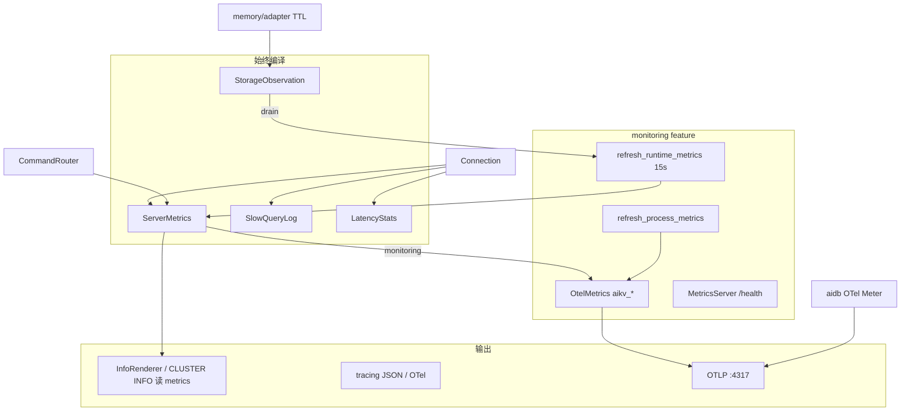
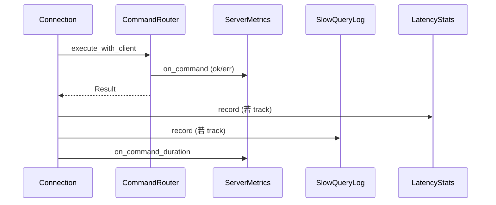

# AiKv Observability (可观测性)

## 何时读本文

- 改 `server/{slowlog,latency,info,metrics,metrics_server,process_metrics}`、`storage/observation`, 或 `main.rs` tracing/OTel/metrics 装配
- 排查 INFO 与 OTel/PromQL 数值不一致、慢查询/SLOWLOG、LATENCY 直方图
- 接集群 gossip/failover/redirect 计数、JSON/Lua 专用 metrics
- **不覆盖**: TCP 连接循环与内联命令 → [server.md](server.md)
- **不覆盖**: INFO/SLOWLOG/LATENCY/COMMAND **命令 dispatch** → [commands-extended.md](commands-extended.md)
- **不覆盖**: MOVED/ASK、CLUSTER 子命令语义 → [cluster.md](cluster.md) (本章只写 metrics/INFO 段写入点)
- **不覆盖**: `aidb_*` / `aidb_raft_*` 定义与引擎 span → [aidb observability.md](../../../aidb/docs/modules/observability.md)
- **构建**: `--features monitoring` 启用 OTel + health HTTP; 默认 **不** 启用

## 架构: ServerMetrics atomics + OTel 唯一出口



要点:

- **热路径**: `ServerMetrics` (atomic + `commands_total` Mutex) 为 INFO 与业务计数唯一源
- **冷路径**: `[monitoring]` 下 `main` 每 **15s** 调 `refresh_runtime_metrics` + `refresh_process_metrics`
- **无 monitoring**: slowlog/latency/INFO/`ServerMetrics` 仍可用; **无** health HTTP 端口、无 OTel layer、**无** 自动 refresh
- **生产指标**: 仅 **OTLP** → Collector → Prom remote write; **无** 进程内 Prometheus registry, **无** HTTP `/metrics`
- **INFO ↔ OTel sync (P3)**: 热路径 **仅** 写 `ServerMetrics`; `[monitoring]` 下 `refresh_runtime_metrics` 末尾经 `info_catalog::sync_otel_from_server_metrics` 读真源、算 delta、写 OTLP 镜像 (相对 INFO 最多滞后 ~15s) — 见 [observability-reference.md](observability-reference.md) §INFO mapping
- **内部命令**: 含 `.` 的伪命令 (`GOSSIP.tick`, `JSON.get`, `CLUSTER.redirect.moved`) **不** 进 INFO `commandstats`

## 代码地图

| 路径 | 职责 | 入口 |
|------|------|------|
| `server/metrics.rs` | `ServerMetrics` 热路径计数 (P3: 不写 OTel) | `on_connect`, `on_command` |
| `server/otel_metrics.rs` | `OtelMetrics` instruments; refresh delta sync | `init_global`, `sync_counters` |
| `server/info.rs` | Redis INFO section 渲染 | `InfoRenderer::render`, `redis_mode()` |
| `server/info_catalog.rs` | INFO ↔ OTel refresh sync | `sync_otel_from_server_metrics` `[monitoring]` |
| `server/slowlog.rs` | 慢查询环形缓冲 | `SlowQueryLog::record/get` |
| `server/latency.rs` | 按命令延迟直方图 + 历史 | `LatencyStats::record/snapshot` |
| `server/config.rs` | `ServerSharedState` 持有上述组件; refresh | `try_register_connection`, `refresh_runtime_metrics` |
| `server/connection.rs` | 网络字节; Router 命令 observability 钩子 | `record_command_observability`, `should_track_observability` |
| `server/metrics_server.rs` | HTTP `/health`, `/` (生产指标经 OTLP) | `MetricsServer::run` `[monitoring]` |
| `server/process_metrics.rs` | Linux `/proc` RSS/CPU/IO | `read_*` `[monitoring]` |
| `storage/observation.rs` | 跨引擎 expired key 计数 | `record_expired_key`, `drain_expired_keys` |
| `main.rs` | JSON log, OTel, MetricsServer spawn, 15s tick | `init_logging`, `create_otel_tracer` (~L503–696) |

**横切写入点** (语义见它章, 本章只记钩子):

| 路径 | 调用 |
|------|------|
| `command/router.rs` | `on_command`, keyspace hit/miss, `on_cluster_redirect` |
| `command/json.rs`, `command/script.rs` | `on_json_command`, `on_lua_command`, `on_lua_execution` |
| `command/server.rs` | INFO/SLOWLOG/LATENCY **读** shared (dispatch → commands-extended) |
| `cluster/gossip.rs` | `on_gossip_refresh` |
| `cluster/commands.rs` | `cluster_info()` 读 `cluster_messages_*`; failover → `on_failover` |

完整 `aikv_*` 指标表 → [observability-reference.md](observability-reference.md).

## 关键 invariant (勿破坏)

- **I1 INFO↔ServerMetrics**: `InfoRenderer` / `CLUSTER INFO` stats 字段须与同期 `ServerMetrics` atomics 一致; 禁止独立计数公式
- **I2 钩子分工**: Router `on_command` 计 calls/err; Connection `on_command_duration` 计 usec/histogram; **勿** 在 INFO 重复累加
- **I3 跟踪排除**: `PING|ECHO|HELLO|QUIT|MONITOR|SLOWLOG` 不经 `record_command_observability`
- **I4 客户端 commandstats**: `is_client_command` 过滤含 `.` 的内部 key
- **I5 expired_keys**: 存储 TTL 路径写 `StorageObservation`; 须经 `refresh_runtime_metrics` drain 汇入 `ServerMetrics`
- **I6 MOVED/ASK**: cluster 重定向响应 **不** 经 `record_command_observability` / Router `on_command` (对齐 Redis 8.8; 见 [cluster.md](cluster.md))

## 数据流

### 启动 (`main.rs`)

1. `init_logging()` — `RUST_LOG`; JSON 默认开 (`AIKV_JSON_LOG`, 默认 `true`)
2. `[monitoring]` + `OTEL_EXPORTER_OTLP_ENDPOINT` (fallback `AIKV_OTLP_ENDPOINT`) → OTel traces + metrics (`service.name`, `host.name`, `node_id`)
3. `StorageObservation::new()` → `build_storage` → `ServerSharedState::new_with_backup_dir`
4. `[monitoring]` spawn `MetricsServer` (`--metrics-addr` + `--metrics-port`, 默认 `127.0.0.1:9191`)
5. `[monitoring]` 15s loop: `refresh_runtime_metrics` + `refresh_process_metrics`

### 命令路径 (经 Router)



内联命令 (PING/ATOM/ASKING 等) **不** 走上述 Router 钩子.

### 周期 refresh (`refresh_runtime_metrics`)

- `set_uptime_secs`, `sample_instantaneous_ops`, `refresh_cached_process_info`, `sync_redis_aligned_gauges`
- `storage.db_key_counts` → `set_db_key_count`
- `storage.memory_usage_bytes` → `set_memory_bytes`
- `storage_observation.drain_expired_keys` → `record_expired_keys`

### Profiles (C3.1, 无应用埋点)

```text
aikv 进程 (Docker)
  └─ Alloy pyroscope.ebpf (worker, privileged)
        └─ push → 115 Pyroscope (:4040)
              └─ Grafana AiKv Profiles / Explore
```

标签: `service_name=aikv`, `host` = Alloy `HOST_LABEL` (对齐 OTLP `host.name`). 可读火焰图: C3.2 `[profile.release] debug = 1`.

### INFO 渲染 (`InfoRenderer`)

| 请求 | 行为 |
|------|------|
| `INFO` / `INFO default` | server → clients → memory → persistence → stats → replication → cpu → [cluster] → keyspace |
| `INFO all` | default + commandstats + errorstats + **threads** + **latencystats** |
| `INFO everything` | all + **modules** |
| `INFO section [section ...]` | Redis 7.0+ 多段拼接 (未知 section 跳过) |
| `INFO nosuch` | 空 bulk string (非 ERR) |

`memory`: 优先 `KvStorage::memory_usage_bytes()`; fallback `ServerMetrics.used_memory_bytes()`. **AiDb 引擎**下该值为 memtable + block cache 近似, 不等于全库 key 占用 — 看 `INFO keyspace` 与 `used_memory_rss` (`/proc`).

`CLUSTER INFO` 文本在 `cluster/commands.rs::cluster_info`; `cluster_state` 按 slot 覆盖与 group leader 动态 ok/fail; gossip 计数读 `ServerMetrics.cluster_messages_*`.

**Redis 8.8 对齐:** `redis_compatible_version:8.8`. `commandstats` 每行 8 字段 (见下). 仅有执行记录的命令出现在 section 中 (与 redis_exporter 一致).

#### 字段三类 (读 INFO 时)

| 类型 | 含义 | 负载后是否变化 | 示例 |
|------|------|----------------|------|
| **Stub** | 键名对齐, 无子系统 | 否, 恒 `0`/`-1`/`ok` | `pubsub_*`, `aof_*`, `allocator_*`, `eventloop_*`, `tracking_*` |
| **配置/未启用** | 有真源, 当前值为零 | 改 CONFIG 才变 | `maxmemory:0`, `aof_enabled:0` |
| **运行时真源** | ServerMetrics / storage / `/proc` | 是 | `keyspace_hits`, `cmdstat_*`, `db0:keys`, `used_memory_rss`, `latency_percentiles_*` |

`instantaneous_ops_per_sec` / `instantaneous_*_kbps` 依赖 `refresh_runtime_metrics` (~15s) 滑动采样; 短 burst 可能仍为 0. `slowlog_commands_*` (stats 段) 仅统计 **超过 slowlog 阈值 (默认 100ms)** 的命令.

Golden: `tests/fixtures/redis88_info_p0_fields.txt` (INFO all 核心字段); `redis88_info_full_fields.txt` (INFO everything 全键名).

#### 待核实 (暂不修)

- **errorstats**: 设计为错误前缀 (`errorstat_WRONGTYPE`); 部分命令失败若走 RESP `-ERR` 成功响应路径, 可能未调用 `on_error_stat` (线上常见仅见历史 `errorstat_ERR`).
- **used_memory vs keyspace**: 集群 AiDb 下二者不必同步上涨; 验收数据集规模以 keyspace 为准.

**Redis 8.8 commandstats 八字段:** `calls`, `usec`, `usec_per_call`, `rejected_calls`, `failed_calls`, `slowlog_count`, `slowlog_time_ms_sum`, `slowlog_time_ms_max`.

### INFO ↔ PromQL (P0 不变式)

INFO 读 `ServerMetrics` atomics; PromQL 读 OTLP 导出的 `aikv_*`. 两者同源, refresh 周期内应对齐:

| INFO 字段 | PromQL (OTLP) | 备注 |
|-----------|---------------|------|
| `used_memory` | `aikv_used_memory_bytes` | refresh 周期内相等 |
| `keyspace_hits` / `keyspace_misses` | `aikv_keyspace_*_total` | counter 当前值 |
| `instantaneous_ops_per_sec` | `aikv_instantaneous_ops_per_sec` | gauge |
| `expired_keys` | `aikv_expired_keys_total` | 需 refresh drain |
| `blocked_clients` | `aikv_blocked_clients` | `BlockedClientGuard` (BLPOP 等阻塞等待) |
| `evicted_keys` | `aikv_evicted_keys_total` | 无 maxmemory eviction, 恒 0 |

Golden 字段: `tests/fixtures/redis88_info_p0_fields.txt` (P0 / INFO all); 全量键名: `tests/fixtures/redis88_info_full_fields.txt` (INFO everything). Stub 与真源对照见上文 **字段三类** 与 [observability-reference.md](observability-reference.md#stub-字段策略).

## 关键类型与 API

### `ServerSharedState` (observability 字段)

- `metrics: Arc<ServerMetrics>`
- `slow_query_log: Arc<SlowQueryLog>`
- `latency_stats: Arc<LatencyStats>`

(`OtelMetrics` 经 `ServerMetrics::with_otel` 内联, 启动时 `OtelMetrics::init_global`.)

### `ServerMetrics` (节选 pub 面)

| 方法 | 用途 |
|------|------|
| `on_connect` / `on_disconnect` | 连接计数 |
| `on_rejected_connection` | max_clients 拒绝 |
| `on_command` / `on_command_duration` | 命令 calls/err/usec |
| `on_slowlog_command` | INFO commandstats `slowlog_*` (超阈值时) |
| `on_keyspace_hit` / `on_keyspace_miss` | GET 类命中 |
| `on_gossip_refresh` / `on_failover` / `on_cluster_redirect` | 集群 metrics |
| `on_json_command` / `on_lua_*` | 扩展命令 |
| `on_client_blocked` / `on_client_unblocked` | 阻塞命令 (BLPOP 等) |
| `client_command_totals()` | INFO commandstats/errorstats |
| `[monitoring] with_otel` | 关联 `OtelMetrics` 实例 |

### `SlowQueryLog`

- 默认阈值 **100ms** (`DEFAULT_SLOWLOG_THRESHOLD_US = 100_000`)
- 默认容量 128; CONFIG 键 `slowlog-log-slower-than`, `slowlog-max-len`

### `MetricsServer`

- `GET /health` — `200 OK`
- `GET /` — 简要说明页 (指标经 OTLP)
- **无** `/metrics` — 生产指标仅 OTLP 出口
- bind 失败时 error log 并退出 task (不 crash 主进程)

## 常见任务

### 启用 monitoring + OTLP

```bash
cargo build --features monitoring
export OTEL_EXPORTER_OTLP_ENDPOINT=http://127.0.0.1:4317
cargo run --features monitoring -- --metrics-addr 0.0.0.0 --metrics-port 9191
curl -s http://127.0.0.1:9191/health
```

全部 `aikv_*` / `aidb_*` 经 OTel Meter 直写, OTLP 导出至 Collector (115 Prom remote write).

### 启用 OTel trace

```bash
export OTEL_EXPORTER_OTLP_ENDPOINT=http://127.0.0.1:4317
cargo run --features monitoring
```

无 endpoint 时仅 JSON/compact tracing, 无 OTel layer.

### 调整慢查询阈值

```bash
redis-cli CONFIG SET slowlog-log-slower-than 10000
redis-cli SLOWLOG GET 10
```

或改 `SlowQueryLog` 默认值.

### 排查 INFO 与 PromQL 不一致

1. 确认 `--features monitoring` 且后台 15s refresh 在跑
2. 对 memory/expired/ops: 手动 `refresh_runtime_metrics` 后再比 (测试里常用)
3. 确认比的是 **同名** 字段 (INFO Redis 名 vs `aikv_*`)
4. OTLP 在 refresh sync 前 counter 不变; export 间隔内允许额外延迟 (P3: 最多 ~15s)
5. 测试可用 `otel_metrics::testutil` (InMemoryMetricExporter)

### 新增业务 counter

1. 在 `ServerMetrics` 加 atomic 字段 + `on_*` 热路径
2. `[monitoring]` 在 `OtelMetrics::sync_counters` / `sync_commandstats` 增加对应 delta 字段 (勿在热路径写 OTel)
3. 若 INFO 需暴露: 扩展 `InfoRenderer` 对应 section
4. 加 `info_alignment` / `observability` 契约测试 (refresh 后再 assert OTLP)

## 配置与 feature flags

| 项 | 位置 | 说明 |
|----|------|------|
| `monitoring` | `Cargo.toml` | OTel, hyper, `aidb/monitoring`; 导出 `metrics_server` |
| `cluster` | 叠加 | `aikv_cluster_redirects_total`, gossip/failover counters |
| `--metrics-port` / `--metrics-addr` | `main.rs` CLI | 默认 9191 / 127.0.0.1 |
| `AIKV_JSON_LOG` | env | 默认 true → JSON tracing |
| `OTEL_EXPORTER_OTLP_ENDPOINT` | env | `[monitoring]` traces + metrics OTLP (**优先**; fallback: `AIKV_OTLP_ENDPOINT`) |
| `AIKV_OTLP_ENDPOINT` | env | `OTEL_EXPORTER_OTLP_ENDPOINT` 的 aikv fallback |
| `AIKV_HOST_LABEL` | env | Resource `host.name` (与 Alloy HOST_LABEL 对齐) |
| `AIKV_NODE_ID` | env | Resource `node_id` + `service.instance.id` (或 `--cluster-node-id`) |
| `OTEL_DEPLOYMENT_ENVIRONMENT` | env | Resource `deployment.environment` (**优先**; fallback: `AIKV_DEPLOYMENT_ENV`) |
| `AIKV_DEPLOYMENT_ENV` | env | `OTEL_DEPLOYMENT_ENVIRONMENT` 的 aikv fallback |
| `OTEL_RESOURCE_ATTRIBUTES` | env | 追加 Resource 键值 (`k=v,k2=v2`) |
| `OTEL_SERVICE_NAME` | env | Resource `service.name` (默认 `aikv`) |
| `RUST_LOG` | env | tracing filter |

### OTel Resource (OTLP → Prom 标签)

| Resource 属性 | 来源 | Prom remote write 标签 |
|---------------|------|------------------------|
| `service.name` | 默认 `aikv`; `OTEL_SERVICE_NAME` 可覆盖 | `service_name` |
| `service.version` | `CARGO_PKG_VERSION` | (resource) |
| `service.instance.id` | 集群 `node_id` / `AIKV_NODE_ID`; 否则 `{host.name\|localhost}:{tcp_port}` | `service_instance_id` (若 backend 映射) |
| `host.name` | `AIKV_HOST_LABEL` | `host_name` |
| `node_id` | 同上 (兼容 Grafana 变量) | `node_id` |
| `deployment.environment` | `AIKV_DEPLOYMENT_ENV` 等 | `deployment_environment` |

### Trace span (`kv_command` / `kv_connection`)

| 字段 | 说明 |
|------|------|
| `otel.kind` | `server` |
| `db.system` | `redis` (命令 span) |
| `db.operation.name` | 命令名 |
| `server.port` | TCP 服务端口 |
| `client.address` / `network.peer.*` | 客户端地址 (Connection 传入) |
| `otel.status_code` | Rust `Err` 时为 `ERROR` |
| `exception.*` | 命令失败时 exception event (`exception.type`, `exception.message`) |

Collector `transform/traces` 为缺失 `service.namespace` 的 trace resource 补 `aikv`.

**Collector tail_sampling** (115 `monitor/.env`): 保留 ERROR; 慢 trace ≥ `TRACE_SLOW_THRESHOLD_MS` (默认 **100ms**, 与 slowlog 对齐); 内部 span (`cmp_*`, `raft_*`, `meta_*`, `tick` 等) 按 `INTERNAL_TRACE_SAMPLE_PCT` (默认 **1%**, 设 **0** 则该 bucket 全 drop). 其余 trace drop. Tempo retention **3d** (`compaction.block_retention: 72h`).

运维 OTLP/Loki 部署流程 → 阶段 2 `DEPLOYMENT.md` (提炼自 wiqun-factory); 旧 env 名 `WIQUN_*` 已改为 `AIKV_*`.

## 测试

```bash
# 基础 (无 monitoring)
cargo test -p aikv observability info_alignment info_golden -- --test-threads=1

# OTel testutil + 契约
cargo test -p aikv --features monitoring observability -- --test-threads=1

# 集群 metrics
cargo test -p aikv --features cluster gossip_refresh -- --test-threads=1
```

| 测试 | 覆盖 |
|------|------|
| `tests/modules/server/observability.rs` | 连接计数、/health(404 /metrics)、INFO↔atomics; OTel testutil 指标 catalog |
| `tests/modules/command/info_golden.rs` | Redis 7 P0 字段 |
| `tests/modules/command/info_alignment.rs` | memory 非 placeholder、stats 字段 |
| `tests/modules/cluster/observability.rs` | gossip → cluster_messages |

## 已知限制

- **无 monitoring 时无自动 refresh** — `expired_keys` / `instantaneous_ops_per_sec` 可能滞后
- **refresh 周期 15s** — 非设计 spec 1s
- **Slowlog 默认 100ms** — Redis/oldmain 为 10ms
- **`evicted_keys` 恒 0** — 无 maxmemory eviction
- **无 `CONFIG SET loglevel`** — oldmain `LoggingManager` 已移除
- **Grafana 面板** 见 AiFactory [`monitor/config/grafana/dashboards/README.md`](../../../AiFactory/monitor/config/grafana/dashboards/README.md) (PromQL: `aikv_*` / `aidb_*`, filter `{service_name="aikv"}`)
- **C2.6**: 生产 metrics 经 OTLP remote write; `:9191-9196` 仅 `/health`; `aikv_db_keys` 为 OTel labeled gauge
- **C2.3 Exemplars**: 暂缓; OTel Rust SDK 0.32 仍无 exemplar 采集 — TODO 待 SDK 支持后实现
- **C3.1 Profiles**: Alloy `pyroscope.ebpf` → 115 Pyroscope; Grafana **AiKv Profiles**; 无应用内 profiling SDK
- **C3.2 debug symbols**: `[profile.release] debug = 1` (line tables); AiFactory 镜像不 strip — eBPF 火焰图可读函数名
- **`aidb_*` 不映射 Redis INFO** — 仅 OTLP/metrics

## 待核实

- (无)
