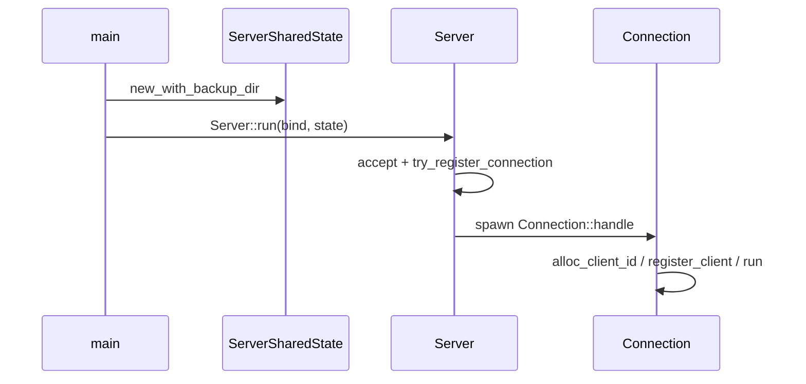
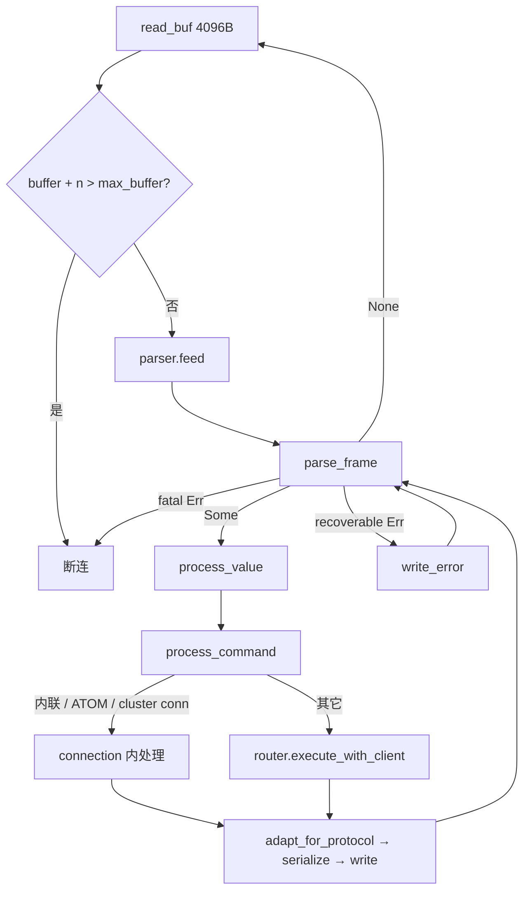

# AiKv Server (TCP 连接层)

## 何时读本文

- 改 `server/{listener,connection,config}` 或 TCP 读写循环、pipeline、连接级命令分发
- 排查 HELLO 协商、`protocol_negotiated` 门控、响应 null 线格式 (`$-1` vs `_`)、fatal 协议断连
- 排查 MONITOR 模式、ATOM 事务 (MULTI/EXEC/WATCH)、`max_clients` 拒绝连接
- **不覆盖**: RESP 帧语法 / parser limits → [protocol.md](protocol.md); 命令实现 → [commands-core.md](commands-core.md) / [commands-extended.md](commands-extended.md); MOVED/ASK 路由 → [cluster.md](cluster.md); slowlog/latency/INFO/metrics 数据结构 → [observability.md](observability.md)

## 代码地图

| 路径 | 职责 | 入口 |
|------|------|------|
| `server/mod.rs` | 模块根; re-export | `Server`, `Connection`, `ServerSharedState`, `ConnectionConfig` |
| `server/listener.rs` | TCP accept; shutdown; max_clients gate | `Server::run`, `run_with_listener` |
| `server/connection.rs` | 单连接读写、pipeline、分发、HELLO、响应编码、ATOM/MONITOR | `Connection::handle`, `run`, `process_value`, `adapt_for_protocol` |
| `server/config.rs` | 连接配置 + 进程共享状态 | `ConnectionConfig`, `ServerSharedState::new_with_backup_dir`, `router()` |
| `main.rs` (~L621–699) | 构造 `ServerSharedState`; 可选 Metrics 后台任务; `Server::run` | 非 server 模块正文, 启动关联 |

同目录 **不归本文正文**: `slowlog.rs`, `latency.rs`, `info.rs`, `metrics.rs`, `metrics_server.rs`, `process_metrics.rs` → [observability.md](observability.md).

公共 re-export (`lib.rs`): `pub mod server`; `Server`, `Connection`, `ServerSharedState` 等.

## 关键 invariant (勿破坏)

- **每连接一 task**: accept 后 `tokio::spawn(Connection::handle)`; 连接状态 (`current_db`, `parser`, `tx_state`) 不跨连接共享.
- **Pipeline 内层循环**: 单次 `read` 后 `feed`, 然后 `loop { parse_frame → process_value }` 直到 `Ok(None)`; 与 [protocol.md](protocol.md) 单帧语义一致.
- **Buffer 超限断连**: `parser.buffer_len() + n > max_buffer_size()` 时直接 break, 不写 ERR.
- **Fatal vs recoverable**: `is_fatal_protocol` (depth / too large / buffer size / line too long) → 断连; 其它 `Protocol` → `write_error` 后继续.
- **命令请求形态**: 顶层须为 `Array`; 命令名与参数须为 `BulkString` (`process_value` 校验).
- **HELLO 门控线格式**: 默认 `ProtocolVersion::Resp3`, 但 `protocol_negotiated = false` 直到客户端发 `HELLO 2|3`; 仅协商 Resp3 后 `adapt_for_protocol` 才把 `$-1`/`*-1` 转为 `_`.
- **Router 懒加载**: `ServerSharedState::router()` 用 `OnceLock` 首次调用时建 `CommandRouter`.
- **Observability 钩子**: 经 Router 的命令 (非内联列表) 成功后写 latency/slowlog/metrics; 详情见 [observability.md](observability.md).

## 数据流

### 进程启动 → 首连接



### 单连接读-解析-写 (pipeline)



## 关键类型与 API

### `ConnectionConfig`

```rust
pub struct ConnectionConfig {
    pub read_timeout: Option<Duration>,   // 默认 Some(60s)
    pub idle_timeout: Option<Duration>,  // 默认 Some(300s)
    pub max_clients: usize,               // 默认 10000; 0 = 不限制
}
```

测试 helpers 常设 timeout 为 `None` (`tests/modules/server/helpers.rs`).

### `ServerSharedState`

进程级 `Arc` 共享: `storage`, `metrics`, `slow_query_log`, `latency_stats`, `config_map`, `clients`, `monitor_tx`, `shutdown`, `key_versions` (WATCH), `router` (`OnceLock`).

| 方法 | 用途 |
|------|------|
| `router()` | 懒初始化 `CommandRouter` |
| `try_register_connection()` | max_clients 检查; 拒绝时 `on_rejected_connection` |
| `alloc_client_id` / `register_client` / `unregister_client` | CLIENT LIST 数据源 |
| `increment_key_version` / `get_key_version` | ATOM WATCH 冲突检测 |
| `refresh_runtime_metrics()` | `[monitoring]` 后台 15s tick |

### `Connection`

每连接持有: `RespParser`, `protocol_version`, `protocol_negotiated`, `current_db`, `client_id`, `mode` (Normal/Monitor), `tx_state`, `[cluster] cluster_state`.

入口:

```rust
Connection::handle(stream, remote, state: Arc<ServerSharedState>).await
// 内部: run() → process_value → process_command
```

### `CommandRouter::execute_with_client` (调用方视角)

```rust
router().execute_with_client(
    cmd, args,
    &mut self.current_db,
    Some(self.client_id),
    self.protocol_version,
    #[cfg(feature = "cluster")] Some(&self.cluster_state),
).await
```

集群 MOVED/ASK/CROSSSLOT 在 Router 内; 连接级 ASKING/READONLY/READWRITE 在 `process_command` 内.

## 连接内联命令

| 命令 | 处理位置 | 备注 |
|------|----------|------|
| `PING` | `cmd_ping` | 无参 → `+PONG`; 一参 → bulk 回显 |
| `ECHO` | `cmd_echo` | 恰好一参 |
| `HELLO` | `cmd_hello` | 见下节 |
| `QUIT` | `cmd_quit` | `+OK` 后 `quit = true` |
| `MONITOR` | `cmd_monitor` | `+OK` 后进入 Monitor 模式 |
| `MULTI` / `ATOM.MULTI` 等 | ATOM 事务 | 见下节 |
| `[cluster] ASKING` / `READONLY` / `READWRITE` | `process_command` | 改 `ClusterConnectionState`; 不进 Router |

其余命令 → Router. `SHUTDOWN` 成功后 connection 设 `quit = true`.

## HELLO 与 `adapt_for_protocol`

### HELLO 语义

| 客户端 | 行为 |
|--------|------|
| `HELLO` (无参) | 返回 `hello_map`; **不**改 `protocol_version`; **不**设 `protocol_negotiated` |
| `HELLO 2` / `HELLO 3` | 设置版本 + `protocol_negotiated = true`; 返回 `hello_map` |
| 非法版本 | `-ERR invalid protocol version` |

`hello_map`: Resp3 → `Map` (key 均为 BulkString, `proto`/`id` 为 Integer); Resp2 → flat `Array`. 含 `server`, `version`, `proto`, `id`, `mode`, `role`; `[cluster]` 时 mode/role 读集群状态.

### `adapt_for_protocol`

仅在 `protocol_negotiated && protocol_version == Resp3` 时:

- `BulkString(None)` / `Array(None)` → `Null` (`_`)
- 递归处理 `Array`, `Map`, `Set`, `Push`, `Attribute`

未协商的 Resp3 默认连接仍发 `$-1`/`*-1`, 避免破坏 RESP2 客户端 (及 redis-py RESP3 解析兼容).

编码路径: `write_response` → `encode` → `adapt_for_protocol(value).serialize()`.

## ATOM 事务 (AiKv 扩展)

连接级 `TransactionState`: `in_multi`, `tx_queue`, `watched_keys`.

| 命令 | 行为 |
|------|------|
| `MULTI` / `ATOM.MULTI` | 进入 multi; 清空队列 |
| 非事务命令 (multi 中) | 入队, 回复 `+QUEUED` |
| `EXEC` / `ATOM.EXEC` (multi 中) | WATCH 冲突 → null bulk; 否则顺序 `execute_with_client`, 返回 Array |
| `EXEC` + JSON arg (无 multi) | `cmd_atom_exec_json_batch`: DUMP/RESTORE 快照回滚; **非 Redis 标准** |
| `WATCH` / `UNWATCH` | 记录/清除 key 版本 (`ServerSharedState.key_versions`) |
| `DISCARD` | 重置事务状态 |

写命令成功后 `track_command_keys` 递增 key 版本.

## MONITOR 模式

1. `MONITOR` → `+OK`, `mode = Monitor`, 订阅 `state.monitor_tx`
2. `run_monitor_loop`: `select!` 读客户端 (仅处理 `QUIT`) + 收 broadcast 行写 socket
3. 正常模式下 `broadcast_monitor` 向 `monitor_tx` 发送 `"timestamp [db N] \"CMD\" \"arg\"...\r\n"` (MONITOR 命令本身不广播)

Monitor 模式 **不支持 RESET** (oldmain 有; 当前仅 QUIT).

## 常见任务

### 调试 pipeline 无响应

1. 确认客户端一次 send 多帧或 TCP_NODELAY
2. 在 connection 看 `parse_frame`: `Ok(None)` 表示等更多数据
3. 查 buffer 是否触顶 `max_buffer_size` 导致静默断连
4. 参考 `tests/modules/server/tcp.rs::test_tcp_pipeline`

### 调试 HELLO / null 线格式

1. 未发 `HELLO 3` 时 GET 缺失 key 应见 `$-1`, 不是 `_`
2. `HELLO 3` 后同场景应见 `_\r\n`
3. 参考 `test_tcp_hello_resp3`, `test_tcp_hello_version_switch_in_pipeline`

### 调试 max_clients 拒绝

1. `ConnectionConfig.max_clients` + `main --max-clients`
2. 超限: listener drop stream, `on_rejected_connection`
3. 参考 `tests/modules/server/observability.rs::test_maxclients_rejection_metrics`

### 新增连接级命令 (不进 Router)

1. 在 `process_command` match 加分支 (或 ATOM 相关)
2. 若需改连接态, 勿经 Router
3. 在 `tests/modules/server/tcp.rs` 加集成测试

### 修改 observability 记录范围

1. 改 `should_track_observability` 排除列表
2. 数据结构 / SLOWLOG 命令 → [observability.md](observability.md)

## 配置与 feature flags

| 项 | 位置 | 说明 |
| --- | --- | --- |
| `read_timeout` / `idle_timeout` | `ConnectionConfig` | CLI 未单独暴露; main 用 `Default` |
| `max_clients` | `ConnectionConfig` + CLI `--max-clients` | 0 = 不限 |
| `shutdown` | `ServerSharedState.shutdown` | `CancellationToken`; listener select 退出 |
| `feature = "cluster"` | `connection.rs` | `cluster_state`; ASKING/READONLY/READWRITE; HELLO mode/role |
| `feature = "monitoring"` | `main.rs` | Metrics HTTP + `refresh_runtime_metrics` 后台任务 (非 listener 本体) |

## 测试

```bash
cargo test --test server -- --test-threads=1
# 33 passed; 2 ignored (slow send / large pipeline stress)

cargo test --test server -- --ignored --test-threads=1   # 可选压测
```

| 文件 | 覆盖 |
|------|------|
| `tests/modules/server/tcp.rs` | PING/ECHO/HELLO/pipeline/MONITOR/路由命令 E2E |
| `tests/modules/server/listen.rs` | accept |
| `tests/modules/server/helpers.rs` | `start_server` 测试夹具 |
| `tests/modules/server/observability.rs` | 连接 metrics / maxclients (跨 observability 边界) |
| `connection.rs` `mod tests` | `hello_map` 格式, JSON batch helpers |

## 已知限制

- **AiKv 扩展**: `ATOM.*` 别名、`EXEC <json>` 无 MULTI 批量 (DUMP/RESTORE 回滚); 非 Redis 官方 MULTI 文档的一一对应说明.
- **MONITOR**: 无 RESET; 无 monitor 客户端注册计数 (oldmain `MonitorBroadcaster` 已移除).
- **内联命令**: 不支持非数组 `PING\r\n` telnet 格式.
- **PING/ECHO**: 在 connection 内联 (oldmain 在 command 层); 行为等价.
- **write_response**: 无 `flush()`; 依赖 tokio 缓冲 (与 oldmain 差异, 无已知问题).

## 待核实

- 无.
