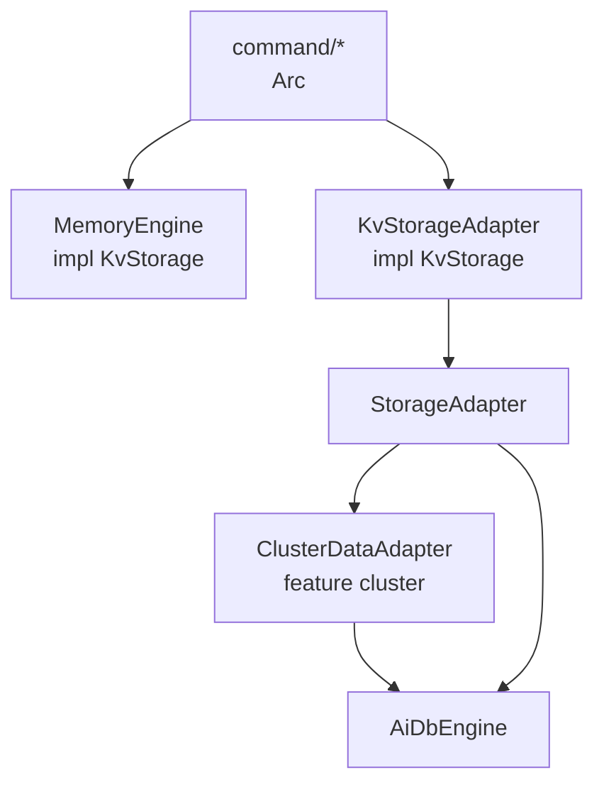
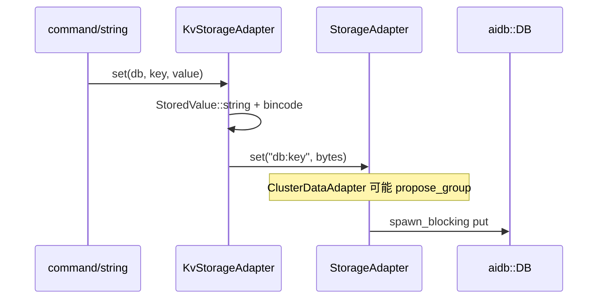
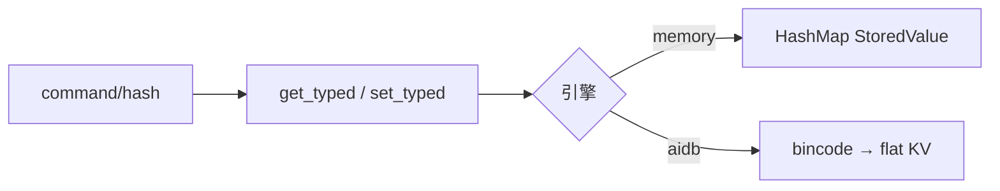
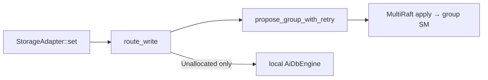

# AiKv Storage (存储层)

## 何时读本文

- 改 `src/storage/*` 或排查 memory / aidb 引擎、TTL、多 DB、`StoredValue` 编解码
- 理解命令层如何持有 `Arc<dyn KvStorage>` (见 [commands-core.md](commands-core.md))
- 排查 cluster 模式下 **数据面** 写是否经 Raft (IMPORTING / slot 已分配)
- **不覆盖**: AiDb LSM 内核 (WAL/MemTable/SSTable) → [aidb engine.md](../../../aidb/docs/modules/engine.md) / [engine-storage.md](../../../aidb/docs/modules/engine-storage.md)
- **不覆盖**: MetaRaft/MultiRaft/Router → [aidb cluster.md](../../../aidb/docs/modules/cluster.md)
- **不覆盖**: MOVED/ASK / CLUSTER 子命令 → [cluster.md](cluster.md) (步 11)
- **不覆盖**: SAVE/BGSAVE/RESTORE 命令语义 → [commands-extended.md](commands-extended.md); INFO/metrics 渲染 → [observability.md](observability.md)

## 架构一览

命令层只依赖 **`KvStorage`** (多 DB、typed value、TTL). 底层持久化/集群走 **两层扁平 KV**:



**进程装配** (`main.rs` `build_storage`):

| `--engine` | 链路 | `StorageEngineKind` |
|------------|------|---------------------|
| `memory` | `MemoryEngine::with_observation(16, obs)` → 直接 `Arc<dyn KvStorage>` | `Memory` |
| `aidb` | `AiDbEngine::open` → 可选 `ClusterDataAdapter::new` → `KvStorageAdapter::with_observation` | `AiDb` |

cluster 包装 **仅 aidb 路径**; memory 不经 `StorageAdapter`.

## 代码地图

| 路径 | 职责 | 入口 |
|------|------|------|
| `storage/mod.rs` | 模块根; pub re-export | `KvStorage`, `MemoryEngine`, `AiDbEngine` |
| `storage/types.rs` | 命令层契约 | `KvStorage`, `StoredValue`, `ValueType`, `WriteOp`, `StorageEngineKind` |
| `storage/memory.rs` | 内存引擎; 直 impl `KvStorage` | `MemoryEngine::new`, `glob_match` |
| `storage/adapter.rs` | 扁平 KV → 多 DB 语义 | `StorageAdapter`, `KvStorageAdapter`, `AdapterWriteOp` |
| `storage/aidb.rs` | sync `aidb::DB` 的 async 包装 | `AiDbEngine::open`, `open_for_testing`, `encode_key` / `decode_key` |
| `storage/aidb_options.rs` | CLI / 单测 Options 构建 | `server_db_options`, `testing_db_options` |
| `storage/cluster_adapter.rs` | 数据面 Raft 包装 (`#[cfg(feature = "cluster")]`) | `ClusterDataAdapter::new` |
| `storage/dump.rs` | 内部 DUMP 格式 | `encode` / `decode`, `DUMP_VERSION` |
| `storage/observation.rs` | 过期 key 计数 (INFO/metrics) | `StorageObservation` |
| `main.rs` ~L130–157 | CLI 引擎装配 | `build_storage` |

`ServerSharedState` 持有 `Arc<dyn KvStorage>` (`server/config.rs`); RESTORE 用 `dump_encode`/`decode` (`server/connection.rs`).

## 关键 invariant (勿破坏)

- **String `get`/`set`**: `get`/`set` 仅 String; 非 String → `WRONGTYPE`. Hash/List/Set/ZSet 必须 `get_typed`/`set_typed`.
- **MGET wrong-type**: 对齐 Redis 7 — 非 String 或 missing key 对该位返回 `nil`, 整命令不失败 (与 `GET` 的 WRONGTYPE 不同).
- **两套 WriteOp**: `storage::WriteOp` (命令/Lua batch) ≠ `AdapterWriteOp` (扁平 KV). 转换在 `KvStorageAdapter::write_batch`.
- **AiDb key 编码**: 物理 key = `{db_index}:{user_key}` (ASCII). `clear`/`keys`/`scan` 依赖 `db_prefix` + `prefix_end`.
- **bincode 值**: aidb 路径 blob = `bincode(StoredValue)`; 与 `dump.rs` 同类型, DUMP 多 1 字节 version 前缀.
- **惰性 TTL**: 读路径遇过期删除; memory/adapter 可 `StorageObservation::record_expired_key`.
- **cluster 写路径**: slot 已分配时写 **必须** `propose_group`; **禁止** 写 local fallback (防 SET 成功 GET 空). 仅 `Unallocated` 或未初始化 cluster 写 local.
- **cluster 读路径**: Assigned / 本地 Migrating group → `get_local`; 否则 `CLUSTERDOWN data group not ready`.
- **持久化面**: memory 默认 `create_checkpoint` → ERR; aidb 委托 `DB::flush` / `Checkpoint::create`.

## 数据流

### String SET (aidb 路径)



### Typed HSET (共用)



### Cluster 写 (已分配 slot)



## 关键类型与 API

### `StoredValue` / `ValueType`

- `StoredValue { value, expires_at }` — `expires_at`: Unix ms, `None` = 永不过期
- `ValueType`: String / Hash / List / Set / ZSet (`Serialize`)
- `as_*` / `as_*_mut` 类型不符 → `Error::Command(WRONGTYPE)`
- `TTL_NO_EXPIRY` (-1): 存储层 sentinel; 命令层映射 Redis `-1`

### `KvStorage` (命令层面, 节选)

| 类别 | 方法 |
|------|------|
| String KV | `get`, `set`, `set_with_ttl`, `delete`, `exists`, `mget`, `mset` |
| Typed | `get_typed`, `set_typed` |
| 批量 | `write_batch(db, Vec<(key, WriteOp)>)` |
| 键空间 | `keys`, `scan`, `len`, `keyspace_stats`, `clear`, `clear_all` |
| TTL | `expire`, `expire_at`, `ttl`, `persist` |
| DB | `db_count`, `swap_db`, `rename_key`, `copy_key`, `random_key` |
| 引擎 | `engine_kind`, `flush_engine`, `create_checkpoint`, `close_engine`, `memory_usage_bytes`, `db_key_counts` |

默认 `engine_kind` = Memory; memory 不覆盖 checkpoint/flush.

### `StorageAdapter` (扁平 KV)

`get` / `set` / `delete` / `exists` / `write_batch` / `scan_prefix` / `delete_range` / `len` / `clear` / `flush` / `create_checkpoint` / `close` / `engine_kind` / `approximate_memory_bytes`.

实现: `AiDbEngine`; cluster 模式下外层 `ClusterDataAdapter` 再包一层.

**集群写路径 (SET)**: `ClusterDataAdapter` 按 data group 串行 batcher — `try_recv` 凑批后 `propose_group` (Raft). 常量见 `cluster_adapter.rs`: `SET_BATCH_MAX_DELAY`, `SET_BATCH_EAGER_FLUSH`, `SET_BATCH_MAX_OPS`. 压测与排查见 [AiFactory docs/PERFORMANCE.md](../../../AiFactory/docs/PERFORMANCE.md).

### `AiDbEngine` key 工具

```rust
// 物理 key
AiDbEngine::encode_key(db, user_key)   // b"0:mykey"
AiDbEngine::decode_key(encoded)        // Option<(db, user_key)>
AiDbEngine::prefix_end(prefix)         // range scan 上界
```

`open(path)`: 生产 preset (`server_db_options`, 对齐 `Options::default()`); `open_for_testing()` 供单测; `open_with_options` 可显式传入. CLI 经 `--sync-wal` 控制 fsync. 所有 DB 操作为 `spawn_blocking`.

### DUMP (内部格式, 非 Redis)

```shell
[ u8 version=0 ][ bincode(StoredValue) ]
```

RESTORE 校验 version; 失败 → `ERR DUMP payload version or checksum error`.

## 常见任务

### 新增/修改 KvStorage 方法

1. 在 `types.rs` trait 定义; 评估 memory 与 `KvStorageAdapter` **双实现**
2. 若涉及 flat KV, 评估是否扩展 `StorageAdapter` + `AiDbEngine` + `ClusterDataAdapter`
3. 在 `tests/modules/storage/compat.rs` 补 memory vs aidb 一致性 (若适用)
4. 命令层在 [commands-core.md](commands-core.md) 对应 handler 调用

### 调试 memory vs aidb 行为不一致

1. 跑 `cargo test --test storage compat -- --test-threads=1`
2. 确认走哪条路径: `engine_kind()` 或 CLI `--engine`
3. 对比是否经 bincode / key 编码 (adapter 专有)
4. 查 [ISSUES.md](../../ISSUES.md) 已知差异

### 调试 aidb 重启后数据丢失

1. 确认 `--engine aidb --data-dir` 指向持久目录
2. 查 `AiDbEngine::open` 是否同一 path
3. cluster 模式: 用户数据在 **group SM**, 不单靠 local `AiDbEngine` 单库
4. LSM 恢复细节 → [aidb engine.md](../../../aidb/docs/modules/engine.md)

### 调试 cluster 写成功读为空

1. 确认 `CLUSTER_STATE_MGR` 已初始化且 slot Assigned
2. 查 `ClusterDataAdapter::should_use_local_engine` — 已分配 slot **不应** fallback local
3. 查 `route_write` / IMPORTING 是否写到 target group
4. 控制面/MOVED → [cluster.md](cluster.md); Raft → [aidb cluster.md](../../../aidb/docs/modules/cluster.md)

### 调试 TTL / keyspace stats

1. 过期为惰性: `ttl`/`get_typed` 触发删除
2. `keyspace_stats` 只计未过期 key; `avg_ttl` 来自 `compute_avg_ttl_ms`
3. `StorageObservation` 计数在 INFO/metrics drain — [observability.md](observability.md)

## 配置与 feature flags

| 项 | 位置 | 说明 |
|----|------|------|
| `--engine memory\|aidb` | `main.rs` | 选择装配链 |
| `--data-dir` | `main.rs` | aidb 必填 |
| `--sync-wal` | `main.rs` | aidb 每条写后 fsync (默认 false) |
| `feature = "cluster"` | `cluster_adapter.rs`, `main.rs` | 插入 `ClusterDataAdapter` |
| `DB_COUNT` (=16) | `types.rs` | 逻辑 DB 数量 |
| `StorageObservation` | `main.rs` → engine | 可选注入, 两路径均支持 |

## 测试

```bash
cd aikv
cargo test --test storage -- --test-threads=1
cargo test --test storage compat -- --test-threads=1
cargo test --test storage memory aidb types -- --test-threads=1
```

| 套件 | 路径 | 重点 |
|------|------|------|
| memory | `tests/modules/storage/memory.rs` | TTL, rename, scan, WRONGTYPE |
| aidb | `tests/modules/storage/aidb.rs` | encode_key, adapter 读写 |
| compat | `tests/modules/storage/compat.rs` | **双引擎行为一致** |
| prod_options | `tests/modules/storage/prod_options.rs` | **生产 Options** (B1.3) |
| dump | `storage/dump.rs` unit | version + roundtrip |
| cluster checkpoint | `cluster_adapter.rs` unit | `checkpoint_group_storages` |

## 已知限制

- **`scan` / `keys` (aidb 路径)**: `scan_prefix` 后 **全量 sort**, O(n) 内存; 大 keyspace 慎用.
- **Memory `write_batch`**: 顺序 await, **非原子**; AiDb 路径单 `WriteBatch` 原子.
- **AiDb 单库多 DB**: 非 oldmain 的 16 独立 `DB` 目录; 靠 key 前缀隔离.
- **DUMP/RESTORE**: AiKv 内部格式, **不兼容** Redis DUMP.
- **`glob_match`**: 仅 `*`/`?`; 无 `[abc]` 字符类.
- **`random_key`**: memory 用 `rand`; adapter 用 `unix_nanos % len` — 分布不同.

## 待核实

(无 storage 层 open 条目)
