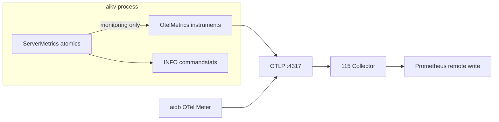

# aikv OTel-Only Metrics Implementation Plan

> **For agentic workers:** REQUIRED SUB-SKILL: Use superpowers:subagent-driven-development (recommended) or superpowers:executing-plans to implement this plan task-by-task. Steps use checkbox (`- [ ]`) syntax for tracking.

**Goal:** Remove Prometheus from aikv entirely; `aikv_*` metrics export only via OTel (aligned with aidb). No dual-write, no internal registry, no transitional bridges.

**Architecture:** `ServerMetrics` atomics remain the source of truth for INFO/stats. Under `[monitoring]`, the same hooks write once to `OtelMetrics` instruments. Production path unchanged: OTLP → 115 Collector → Prom remote write. `:9191` stays health-only.

**Tech Stack:** `opentelemetry` 0.32, `opentelemetry_sdk` 0.32, `opentelemetry-otlp` 0.32; remove `prometheus` 0.13 from aikv.

---

## 完成定义 (零包袱验收)

实施完成后, 以下必须为 **零匹配** (排除 `archive/`):

```bash
rg 'prometheus|with_prometheus|prometheus_metrics|register_kv_db_keys|registry\.gather|双写' aikv/src aikv/tests aikv/docs/modules
rg 'prometheus' aikv/Cargo.toml
```

且:

- `cargo test -p aikv --features monitoring observability -- --test-threads=1` 全绿
- `cargo test -p aikv --features monitoring,cluster` 全绿
- `cargo build -p aikv --features monitoring,cluster` 无 prom 依赖
- 生产 Prom 仍有 `aikv_*` / `aidb_*` (OTLP), `:9191/metrics` 仍 404

---

## 目标架构



**删除:**

- `prometheus::Registry` 及全部 `kv_*` prom 类型
- `ServerMetrics::with_prometheus` / `prom: Option<Arc<Metrics>>`
- `register_kv_db_keys_source` + prom Observable 桥
- `test_otel_prometheus_counter_parity` 等双写测试

**保留/改名:**

- `MetricsServer` → 仅 `/health`, `/` (可改名为 `HealthServer`, 可选)
- `ServerSharedState.prometheus_metrics` → `otel_metrics: Arc<OtelMetrics>` 或内联进 `ServerMetrics`

---

## 文件变更地图

| 文件 | 动作 |
|------|------|
| `aikv/Cargo.toml` | 删 `prometheus` dep; `monitoring` feature 去掉 `dep:prometheus` |
| `aikv/src/server/otel_metrics.rs` | 吸收全部 instrument 定义; 加 `set_db_key_count`; 删 prom 桥 |
| `aikv/src/server/metrics.rs` | 只留 `ServerMetrics` + `with_otel()`; 删 `Metrics` struct 及 prom 注册 |
| `aikv/src/server/config.rs` | `OtelMetrics::new` + `with_otel`; 字段改名 |
| `aikv/src/server/metrics_server.rs` | 去掉 `Arc<Metrics>` 依赖 (health-only, metrics 字段可删) |
| `aikv/src/main.rs` | 更新 MetricsServer 构造 |
| `aikv/src/server/otel_metrics.rs` | 新增 `#[cfg(test)] pub mod testutil` (InMemory exporter) |
| `aikv/tests/modules/server/observability.rs` | prom gather → testutil |
| `aikv/tests/modules/cluster/observability.rs` | 同上 |
| `aikv/docs/modules/observability.md` | 删 prom/双写/register_into 描述 |
| `aikv/docs/modules/observability-reference.md` | 同上 |
| `aikv/DEPLOYMENT.md` | monitoring 段: 仅 OTLP, 无 prom |

---

## Phase 1: OTel 层补全 (单一出口)

### Task 1: `aikv_db_keys` 改为 OTel 直写 gauge

**Files:**
- Modify: `aikv/src/server/otel_metrics.rs`

**设计:** 不再 Observable 读 prom. 在 `OtelMetrics` 增加 labeled gauge (或 `record` 带 `db` label):

```rust
pub fn set_db_key_count(&self, db: usize, count: u64) {
    self.db_keys_gauge.record(count as f64, &[KeyValue::new("db", db.to_string())]);
}
```

- [ ] **Step 1:** 在 `OtelMetrics` 增加 `db_keys_gauge: Gauge<f64>` 字段, `new()` 里 `meter.f64_gauge("aikv_db_keys").build()`
- [ ] **Step 2:** 实现 `set_db_key_count`, 删除 `KV_DB_KEYS`, `register_kv_db_keys_source`, `mirror_aikv_db_keys_gauge`, `label_value` (prom proto)
- [ ] **Step 3:** `cargo build -p aikv --features monitoring`

### Task 2: 合并 `Metrics::new` 逻辑进 `OtelMetrics::new`

**Files:**
- Modify: `aikv/src/server/otel_metrics.rs`
- Modify: `aikv/src/server/metrics.rs` (暂时仍调用两处, 下一步删 prom)

- [ ] **Step 1:** 确保 `OtelMetrics::new(meter)` 返回 `Arc<Self>` 并注册全部 `AIKV_METRIC_NAMES` 契约指标
- [ ] **Step 2:** histogram boundaries 与现 prom bucket 对齐 (`CMD_DURATION_BUCKETS` 已有)
- [ ] **Step 3:** 导出 `pub fn init_global(meter: Meter) -> Arc<OtelMetrics>` 用 `OnceLock` (替代 `Metrics::new` 里的 otel 初始化)

---

## Phase 2: ServerMetrics 单写 OTel

### Task 3: `with_prometheus` → `with_otel`

**Files:**
- Modify: `aikv/src/server/metrics.rs`

- [ ] **Step 1:** 字段 `prom: Option<Arc<Metrics>>` → `otel: Option<Arc<OtelMetrics>>`
- [ ] **Step 2:** `with_prometheus` → `with_otel`
- [ ] **Step 3:** 每个 `on_*` / `set_*` 方法: **删除** 所有 `p.kv_*` prom 调用, **仅保留** `p.otel.*` (或 `self.otel.*`)
- [ ] **Step 4:** `set_db_key_count` 调 `otel.set_db_key_count`, 不再写 prom gauge vec
- [ ] **Step 5:** `refresh_process_metrics` 等只走 otel

### Task 4: 删除 `Metrics` struct 及 prom 注册块

**Files:**
- Modify: `aikv/src/server/metrics.rs` (~400 行删除)

- [ ] **Step 1:** 删除 `pub struct Metrics { registry, kv_*, ... }` 及 `impl Metrics { fn new() ... }`
- [ ] **Step 2:** 删除 `impl Debug for Metrics`
- [ ] **Step 3:** 文件顶注释改为 "ServerMetrics + OTel export (monitoring)"
- [ ] **Step 4:** `cargo build -p aikv --features monitoring,cluster` — 修复编译错误 (config/main/tests)

---

## Phase 3: 接线与命名清理

### Task 5: `ServerSharedState` 与 main

**Files:**
- Modify: `aikv/src/server/config.rs`
- Modify: `aikv/src/main.rs`
- Modify: `aikv/src/server/metrics_server.rs`

- [ ] **Step 1:** `config.rs`: `prometheus_metrics` → `otel_metrics: Arc<OtelMetrics>`; 启动时 `OtelMetrics::init_global(global::meter("aikv"))` + `ServerMetrics::with_otel`
- [ ] **Step 2:** `metrics_server.rs`: 删除 `metrics: Arc<Metrics>` (health server 不需要 metrics handle); `MetricsServer::new(addr)` 无第二参数
- [ ] **Step 3:** `main.rs`: 更新 spawn 调用
- [ ] **Step 4:** 全局 grep `prometheus_metrics` → 0 (src + tests)

### Task 6: 删 Cargo prometheus 依赖

**Files:**
- Modify: `aikv/Cargo.toml`

- [ ] **Step 1:**

```toml
monitoring = ["dep:tracing-opentelemetry", "dep:opentelemetry-otlp", ...]  # 无 dep:prometheus
# 删除 [dependencies] prometheus = ...
```

- [ ] **Step 2:** `cargo build -p aikv --features monitoring,cluster`
- [ ] **Step 3:** `cargo tree -p aikv -e normal | rg prometheus` → 应无输出

---

## Phase 4: 测试迁移 (OTel testutil)

### Task 7: 新增 `aikv` OTel testutil

**Files:**
- Modify: `aikv/src/server/otel_metrics.rs` (或 `aikv/src/server/metrics_testutil.rs`)

复用 aidb 模式 (可 copy 精简版):

```rust
#[cfg(all(test, feature = "monitoring"))]
pub mod testutil {
    // InMemoryMetricExporter + SdkMeterProvider + counter_sum / gauge_value / histogram_count
}
```

- [ ] **Step 1:** 添加 testutil (读 latest export batch, 与 aidb 相同语义)
- [ ] **Step 2:** `opentelemetry_sdk` dev 或 monitoring 启用 `features = ["testing"]` (若 InMemory 需要)

### Task 8: 重写 observability 测试

**Files:**
- Modify: `aikv/tests/modules/server/observability.rs`
- Modify: `aikv/tests/modules/cluster/observability.rs`

| 旧测试 | 新策略 |
|--------|--------|
| `test_prometheus_metrics_integration` | 改名 `test_otel_metrics_integration`; testutil 查 `aikv_connections_total` |
| `info_metrics_consistency_after_commands` | INFO 字段 vs **ServerMetrics atomics** (删 prom gather) |
| `test_runtime_metrics_refresh` | testutil 查 gauge/counter |
| `test_metric_catalog_contract` | testutil 验证 `AIKV_METRIC_NAMES` 存在 |
| `test_otel_prometheus_counter_parity` | **删除** (双写已不存在) |
| `prom_*` helper 函数 | 删, 用 testutil |

- [ ] **Step 1:** 重写 server observability tests
- [ ] **Step 2:** 更新 cluster observability test
- [ ] **Step 3:** `cargo test -p aikv --features monitoring observability -- --test-threads=1`

---

## Phase 5: 文档与 CHANGELOG

### Task 9: 更新活跃文档 (不碰 archive)

**Files:**
- Modify: `aikv/docs/modules/observability.md`
- Modify: `aikv/docs/modules/observability-reference.md`
- Modify: `aikv/DEPLOYMENT.md`
- Modify: `aikv/CHANGELOG.md` (Unreleased 条目)

要点:

- 删 "双 Registry / 双写 / internal prometheus registry"
- 写清: INFO ← ServerMetrics atomics; PromQL ← OTLP only
- aidb: OTel 直写 (已无 register_into)

- [ ] **Step 1:** 文档更新
- [ ] **Step 2:** 零包袱 grep 验收 (见文首)

---

## Phase 6: 生产验证 (112/113/115)

### Task 10: 重建部署

**Files:** 无 (运维)

- [ ] **Step 1:** `cd AiFactory && ./scripts/up-worker.sh --build`
- [ ] **Step 2:** `./scripts/up-monitoring.sh --sync-only` (若仅 aikv 变更可跳过 recreate)
- [ ] **Step 3:** Prom 查询: `aikv_commands_total`, `aikv_db_keys`, `aidb_operations_total` 仍有数据
- [ ] **Step 4:** `curl :9191/metrics` → 404; `/health` → 200
- [ ] **Step 5:** Grafana AiKv Overview 面板 spot check

---

## 风险与决策 (已锁定, 实施时勿偏离)

| 决策 | 选择 | 原因 |
|------|------|------|
| INFO 数据源 | ServerMetrics atomics | 与 monitoring feature 解耦; 不依赖 OTel |
| `aikv_db_keys` | OTel labeled gauge `record` | 比 Observable 更简单, 无 prom 桥 |
| MetricsServer | 保留, health-only | 运维已习惯 :9191 探活 |
| 分 phase 合并 | **单 PR 或 2 PR max** | 避免中间态双写半删留债 |
| exemplars | 不纳入 | SDK 未支持, 不在本计划范围 |

---

## 建议执行顺序 (2 PR 策略)

**PR-A (代码, 可独立合并):** Phase 1–4 + 零包袱 grep + 全量 test

**PR-B (可选, 同日):** Phase 5 文档 + Phase 6 生产验证记录

若坚持 **单 PR**: 全部 Phase 1–6 一次提交, 合并前必须跑完零包袱验收命令.

---

## 预估工作量

| Phase | 时间 |
|-------|------|
| 1–2 代码 | ~2h |
| 3 接线 | ~30m |
| 4 测试 | ~1.5h |
| 5 文档 | ~30m |
| 6 部署验证 | ~30m |
| **合计** | **~5h** |
