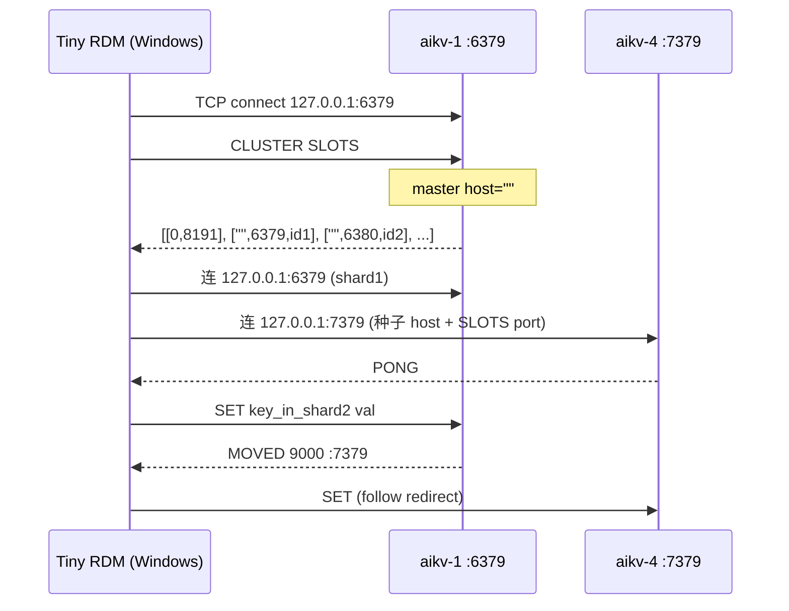

# AiKv 集群客户端地址通告 (Cluster Client Announce) 设计

**日期:** 2026-06-05  
**状态:** Implemented (2026-06-05)  
**版本:** v1.1 (审核修订)  
**关联:** `WIQUN_CLIENT_ADDR`, `WIQUN_EXTERNAL_HOST`, `WIQUN_CLUSTER_ANNOUNCE_MODE`, `CLUSTER SLOTS`, `CLUSTER SHARDS`, MOVED/ASK

---

## 1. 问题陈述

### 1.1 现象

- WSL2 + Docker 部署 6 节点 AiKv 集群后, WSL 内 `redis-cli -c` 正常.
- Windows 宿主机 Tiny RDM:
  - **单节点模式** 连接 `127.0.0.1:6379` **成功**
  - **集群模式** 连接同一地址 **无限转圈、无报错**
- Windows `redis-cli.exe -c -h 127.0.0.1` 正常; `-h 192.168.0.140` 超时.

**方案 A 已验证 (2026-06-05):** `WIQUN_EXTERNAL_HOST=127.0.0.1` 重建后, Windows `redis-cli.exe -c` 跨 shard 正常, `CLUSTER SLOTS` 全为 `127.0.0.1`.

### 1.2 根因 (已验证)

集群拓扑命令 (`CLUSTER SLOTS` / `CLUSTER SHARDS`) 通告的是 `WIQUN_EXTERNAL_HOST` 自动检测到的 WSL 网卡 IP (`192.168.0.140`), 而非 Windows 经 WSL2 端口转发可达的 `127.0.0.1`.

| 客户端模式 | 行为 | 结果 |
|-----------|------|------|
| 单节点 | 只连种子 `127.0.0.1:6379`, 不拉拓扑 | 成功 (仅访问本地 shard) |
| 集群 | 连种子后按 `CLUSTER SLOTS` 连其余节点 `192.168.0.140:*` | Windows 不可达 → 转圈 |

**不是 MOVED 逻辑 bug**, 而是 **Redis Cluster 标准的 announce address 问题** (对标 Redis `cluster-announce-ip` / Redis 7 `cluster-preferred-endpoint-type`).

### 1.3 历史「修 A 坏 B」

地址通告、MetaRaft `NodeRole`、Redis `master/slave` 标签是三套独立语义, 曾耦合在同一处修改:

- `cluster_node_role_label()` 已修复 Voter 误显示为 master (0.9.7).
- 地址问题与角色问题应 **永久解耦**, 本设计 **只改地址通告层**, 不碰角色推导.
- `gossip.rs` 使用 `rpc_addr` 做轻量拓扑缓存, **不在本设计范围内**, 不修改.

---

## 2. 目标与非目标

### 2.1 目标

1. **短期:** WSL2 + Windows GUI 开发场景开箱可用 (方案 A 已验证; 方案 B 降低配置成本).
2. **长期:** 在 **`unknown` 默认模式** 下, 客户端用任意可达种子地址连入后, 拓扑发现与 MOVED/ASK 均可完成, **无需手动猜 IP**. (`fixed` + LAN 场景仍须正确设置 `WIQUN_EXTERNAL_HOST`.)
3. **一致性:** `CLUSTER SLOTS`, `CLUSTER SHARDS`, 数据面 `MOVED`/`ASK`, `map_propose_error` NotLeader MOVED 统一经 `AnnounceResolver` 输出.
4. **可运维:** 部署脚本与文档明确各环境变量语义; CHANGELOG 标明默认行为变更.

### 2.2 非目标

- 不改变 MultiRaft / MetaRaft 内部 RPC 地址 (仍用 Docker hostname).
- 不修改 `gossip.rs` (内部故障检测委托 MetaRaft, 与客户端拓扑无关).
- 不修改 slot 分配、副本角色、failover 逻辑.
- 不实现 Redis 全部 `cluster-announce-*` 配置项 (YAGNI).
- 不为 `CLUSTER SHARDS` 新增 replica 节点输出 (当前仅 primary; 若未来扩展 replica, 须复用同一 resolver).
- `announce_mode` **不写入 MetaRaft** — 仅进程环境变量, 避免元数据与运行时配置分叉.

---

## 3. 方案对比

| 方案 | 描述 | 优点 | 缺点 |
|------|------|------|------|
| **A. 部署参数** | `WIQUN_EXTERNAL_HOST=127.0.0.1` 重建 | 零代码, 已验证 | 换场景需重建; LAN 远程客户端失败 |
| **B. 脚本智能默认** | WSL2 检测默认 `127.0.0.1` | 降低踩坑率 | 仅缓解 fixed 语义下的 host 选择 |
| **C. NULL endpoint (实现主体)** | SLOTS/SHARDS/MOVED 空 host, 客户端沿用种子 IP | 兼容 Redis 7, 一劳永逸 | 需验证 GUI 客户端; 默认行为变更 |

**决策:** A+B 作即时缓解; **C 作代码实现主体, 默认 `unknown`**.

### 3.1 脚本默认 vs 代码默认 (不冲突)

| 层级 | 默认 | 作用 |
|------|------|------|
| **代码** `WIQUN_CLUSTER_ANNOUNCE_MODE` | `unknown` | 决定 SLOTS/SHARDS/MOVED 是否输出空 host |
| **脚本** `WIQUN_EXTERNAL_HOST` (WSL2) | `127.0.0.1` | 写入 MetaRaft `client_addr`, 影响 **CLUSTER NODES** 显示与 fixed 模式 |

在 `unknown` 模式下, `WIQUN_EXTERNAL_HOST` **不再决定** `CLUSTER SLOTS` 的 host 字段 (恒为空), 但仍写入 `client_addr` 供运维查看和 `fixed` 模式回退.

---

## 4. 架构设计

### 4.1 三层地址模型

```
┌─────────────────────────────────────────────────────────┐
│ Layer 1: RPC (内部)     aikv-1:16379                │
│          MultiRaft / MetaRaft / CLUSTER MEET bus        │
├─────────────────────────────────────────────────────────┤
│ Layer 2: MetaRaft 存储  client_addr (WIQUN_CLIENT_ADDR) │
│          Router 缓存完整地址; 人类可读 / fixed 模式源    │
├─────────────────────────────────────────────────────────┤
│ Layer 3: Preferred endpoint (AnnounceResolver 输出层)   │
│          unknown: 空 host → 客户端沿用种子连接 IP        │
│          fixed:   使用 Layer 2 解析出的 host:port       │
└─────────────────────────────────────────────────────────┘
```

### 4.2 AnnounceResolver (新增 `aikv/src/cluster/announce.rs`)

```rust
pub enum AnnounceMode {
  Fixed,
  UnknownEndpoint,
}

pub struct AnnounceResolver {
  mode: AnnounceMode,
}

impl AnnounceResolver {
  /// 从 Router 取原始地址, 按模式输出 (host, port).
  /// 回退链: client_addr (Router) → rpc_addr (MetaRaft, 由 Router 填充) → 解析失败则 None.
  pub fn endpoint_for_node(
    &self,
    node_id: u64,
    router: &Router,
  ) -> Option<(String, u16)>; // fixed: ("127.0.0.1", 6379); unknown: ("", 6379)

  /// MOVED/ASK / NotLeader 重定向字符串.
  pub fn redirect_addr(&self, node_id: u64, router: &Router) -> Option<String>;
  // fixed:   "127.0.0.1:7379"
  // unknown: ":7379"
}
```

**地址解析 (共用, 与现有 `resolve_endpoint` 一致):**

```rust
fn raw_client_endpoint(router: &Router, node_id: u64) -> Option<(String, u16)> {
  let addr_str = router.get_node_addr(node_id)?; // client_addr, fallback rpc_addr
  let (host, port_str) = addr_str.rsplit_once(':')?;
  let port: u16 = port_str.parse().ok()?;
  Some((host.to_string(), port))
}
```

**IPv6 说明:** 现有 `rsplit_once(':')` 对 `[::1]:6379` 取末段为端口, 可用. `unknown` 模式 MOVED `:6379` 在 IPv6 种子连接下, 客户端应回退到种子 host `[::1]` — 与 Redis 行为一致; WSL/Windows 场景通常不涉及, 不在测试中覆盖.

**配置 (仅进程环境变量, 不持久化):**

| 变量 | 含义 | 默认 |
|------|------|------|
| `WIQUN_CLIENT_ADDR` | 完整 `host:port` → MetaRaft `client_addr` | 从 bind 推导 |
| `WIQUN_CLUSTER_ANNOUNCE_MODE` | `fixed` \| `unknown` | **`unknown`** |

### 4.3 注入路径

```
main.rs
  ├─ 解析 WIQUN_CLUSTER_ANNOUNCE_MODE
  ├─ 构造 AnnounceResolver
  ├─ 传入 ClusterStateManager::announce_resolver (新增字段)
  └─ CLUSTER_STATE_MGR.set(state_mgr)

ClusterStateManager (state.rs)
  └─ pub announce_resolver: AnnounceResolver

调用点:
  commands.rs  → resolve_endpoint / cluster_slots / cluster_shards / map_propose_error
  router.rs    → leader_moved / leader_ask
```

启动时若检测到同集群其它节点 env 不一致 (仅日志, 非阻断): `tracing::warn!("WIQUN_CLUSTER_ANNOUNCE_MODE mismatch across nodes is unsupported")` — 全集群须统一, 无运行时校验 RPC.

### 4.4 受影响命令与行为 (定稿)

| 命令/路径 | unknown 模式 | fixed 模式 | 经 resolver? |
|-----------|-------------|-----------|-------------|
| `CLUSTER SLOTS` | host=`""`, port=client port | host=client_addr host | **是** |
| `CLUSTER SHARDS` | `ip`/`endpoint`=`""` | 完整 host | **是** |
| `CLUSTER NODES` | **完整 `client_addr`** (如 `127.0.0.1:6379@16379`) | 同左 | **否** — 运维可读, 与 Redis 习惯一致 |
| `MOVED` / `ASK` (数据面) | `MOVED <slot> :<port>` | `MOVED <slot> host:port` | **是** |
| `map_propose_error` NotLeader | `MOVED 0 :<port>` | `MOVED 0 host:port` | **是** — `leader_addr` 若来自 RPC 地址, 须解析 port 后经 resolver 输出 |
| `cluster_meet` | 不变; 写入 `client_addr` | 同左 | 否 |

**`map_propose_error` 补充:** 当前 `NotLeader { leader_addr }` 直接格式化 `MOVED 0 {addr}`. 实现时改为: 从 `leader_addr` 提取 node_id 或 port → `AnnounceResolver::redirect_addr`. 若 leader 未知, 仍返回 `CLUSTERDOWN`.

### 4.5 Bootstrap 节点 client_addr 同步 (bugfix)

**问题:** 仅 join 节点 (`!peers.is_empty()`) 后台同步 `WIQUN_CLIENT_ADDR`; bootstrap 节点在持久化元数据已存在时不会更新.

**修复:** 提取 `sync_client_addr_on_startup(meta_raft, node_id, external_client_addr)`:

- **所有节点** (含 bootstrap) 启动后执行.
- 若 MetaRaft 中 `client_addr != WIQUN_CLIENT_ADDR`, propose `UpdateNodeClientAddr`.
- 重试策略与现有 join 节点 task 一致 (最多 20 次, 2s 间隔).
- join 节点现有 task **合并** 到此函数, 避免双份逻辑.

### 4.6 部署脚本 (wiqun-factory)

**`up-cluster.sh`:**

1. WSL2 检测 (`/proc/version` 含 `Microsoft`) 且未设 `WIQUN_EXTERNAL_HOST` → 默认 `127.0.0.1`.
2. 非 WSL2 保持现有 `ip route` 检测.
3. 打印: `WIQUN_CLUSTER_ANNOUNCE_MODE` 与 `WIQUN_EXTERNAL_HOST` 当前值.
4. LAN 远程访问提示: 显式 `WIQUN_EXTERNAL_HOST=<LAN IP>` + `WIQUN_CLUSTER_ANNOUNCE_MODE=fixed`.

**`docker-compose.cluster.yaml`:**

```yaml
WIQUN_CLUSTER_ANNOUNCE_MODE: "${WIQUN_CLUSTER_ANNOUNCE_MODE:-unknown}"
```

---

## 5. 数据流 (集群模式客户端, unknown 模式)



---

## 6. 错误处理

| 场景 | 行为 |
|------|------|
| Router 无地址 | `CLUSTERDOWN unknown node address` (现有) |
| fixed 模式, `client_addr` 未设置 | 回退 `rpc_addr` → resolver 输出 (可能不可达, 运维责任) |
| unknown 模式 MOVED | `:port` 格式 |
| 改 `WIQUN_CLIENT_ADDR` 后旧 volume | `sync_client_addr_on_startup` 修正; 或 `down -v` 重建 |
| 集群节点 `ANNOUNCE_MODE` 不一致 | 启动 `warn` 日志, 不阻断 (文档禁止) |
| 升级默认 unknown | CHANGELOG + 迁移节说明; `fixed` 一键回滚 |

---

## 7. 测试计划

### 7.1 P0 — 单元测试 (`tests/modules/cluster/announce.rs` 或 `announce.rs` 内嵌)

| # | 用例 | 断言 |
|---|------|------|
| U1 | fixed + client_addr `192.168.0.140:7379` | endpoint → (`192.168.0.140`, 7379); redirect → `192.168.0.140:7379` |
| U2 | unknown + 同上 | endpoint → (`""`, 7379); redirect → `:7379` |
| U3 | fixed + 仅 rpc_addr `aikv-4:17379` | redirect 含 host `aikv-4` (回退链) |
| U4 | RESP: unknown endpoint host 序列化 | `BulkString("")` 非 NULL (Redis 空串语义) |

### 7.2 P0 — 集成测试 (更新现有文件)

| # | 文件 | 变更 |
|---|------|------|
| I1 | `tests/cluster_routing.rs` | 参数化 announce mode; unknown 断言 `MOVED` 含 `:7001` 而非硬编码 `127.0.0.1:7001` |
| I2 | `tests/cluster_integration.rs` | 2+ 节点 harness, unknown 模式解析 `CLUSTER SLOTS` RESP, master host `""` |
| I3 | `tests/cluster_integration.rs` | 非本地 shard GET → MOVED `:port`; 若有子进程能力则 `redis-cli -c` 完成 SET/GET |
| I4 | `cluster_nodes_role_tests` | 回归: unknown 模式下 NODES 仍显示完整 client_addr; master/slave 不变 |

### 7.3 P1 — 补充测试

| # | 用例 |
|---|------|
| P1-1 | `cluster_shards` unknown: `ip`/`endpoint` 为空 |
| P1-2 | `sync_client_addr_on_startup`: mock 旧 client_addr + 新 env → propose `UpdateNodeClientAddr`; **覆盖 bootstrap (`peers.is_empty()`)** |
| P1-3 | `map_propose_error` NotLeader unknown → `MOVED 0 :<port>` |
| P1-4 | E2E `e2e/test_cluster_announce.sh`: `ANNOUNCE_MODE=unknown`, SLOTS 空 host + 跨端口 SET/GET |

### 7.4 P2 / 手动

| # | 场景 | 说明 |
|---|------|------|
| M1 | Tiny RDM Windows 集群模式 | 无法 CI, 保留手动 (#3) |
| M2 | `WIQUN_EXTERNAL_HOST=127.0.0.1` + **`ANNOUNCE_MODE=fixed`** | 方案 A 回归 (#1 修订) |
| M3 | unknown + 任意 EXTERNAL_HOST | Windows 127.0.0.1 与 WSL 内均可用 (#4) |
| M4 | `CLUSTER NODES` master/slave | 无回归 (#5) |

### 7.5 测试覆盖目标

| 维度 | 目标 |
|------|------|
| 核心 resolver 逻辑 | P0 单元 + I1/I2 |
| MOVED 格式回归 | 更新所有硬编码 `127.0.0.1:port` 断言 |
| 多节点 unknown 路由 | I2/I3 或 E2E P1-4 |
| 角色/NODES 解耦 | I4 |
| 真实 GUI | 仅 M1 手动 |

---

## 8. 实现范围 (文件)

| 文件 | 变更 |
|------|------|
| `aikv/src/cluster/announce.rs` | **新增** AnnounceResolver |
| `aikv/src/cluster/mod.rs` | 导出 announce 模块 |
| `aikv/src/cluster/state.rs` | `announce_resolver: AnnounceResolver` 字段 |
| `aikv/src/cluster/commands.rs` | SLOTS/SHARDS/map_propose_error 经 resolver; NODES **不改** |
| `aikv/src/cluster/router.rs` | leader_moved/ask 经 resolver |
| `aikv/src/main.rs` | 解析 env; `sync_client_addr_on_startup` 全节点 |
| `aikv/tests/modules/cluster/announce.rs` | P0 单元测试 |
| `aikv/tests/cluster_routing.rs` | I1 参数化 |
| `aikv/tests/cluster_integration.rs` | I2/I3 |
| `aikv/e2e/test_cluster_announce.sh` | P1-4 |
| `wiqun-factory/scripts/up-cluster.sh` | WSL2 默认 + 日志 |
| `wiqun-factory/docker-compose.cluster.yaml` | 新 env |
| `aikv/DEPLOYMENT.md` | WSL2 / Windows GUI / announce_mode |
| `aikv/CHANGELOG.md` | **Breaking-ish:** 默认 `unknown`; `fixed` 回滚说明 |

---

## 9. 迁移与回滚

### 9.1 行为变更 (CHANGELOG 必写)

| 升级前 | 升级后 (默认 unknown) |
|--------|----------------------|
| `CLUSTER SLOTS` host = `WIQUN_EXTERNAL_HOST` | host = `""` |
| MOVED = `host:port` | MOVED = `:port` |
| `CLUSTER NODES` | **不变** (完整 client_addr) |

依赖 LAN IP 做服务发现的部署: 设置 `WIQUN_CLUSTER_ANNOUNCE_MODE=fixed` + 正确 `WIQUN_EXTERNAL_HOST`.

### 9.2 迁移路径

1. **已用方案 A 的 dev 环境:** 可继续 `fixed` + `127.0.0.1`, 或切 `unknown` 后删 `WIQUN_EXTERNAL_HOST` 特殊配置.
2. **生产 LAN 客户端:** 保持 `fixed` 直至确认客户端支持 unknown.
3. **回滚:** `WIQUN_CLUSTER_ANNOUNCE_MODE=fixed` 或 revert commit.

---

## 10. 参考

- Redis: `cluster-announce-ip`, `cluster-preferred-endpoint-type` (Redis 7+)
- Kvrocks: `--bind`, proxy 层外部地址配置
- AiKv CHANGELOG 0.9.7: `WIQUN_CLIENT_ADDR` / 角色显示修复
- AiDb: [`aidb/docs/superpowers/specs/2026-06-03-data-plane-port-configurable-design.md`](../../../aidb/docs/superpowers/specs/2026-06-03-data-plane-port-configurable-design.md) — bus `@cport` 偏移; SLOTS client port 问题记录

---

## 附录 A: 审核修订对照

| 审核项 | 修订 |
|--------|------|
| CLUSTER NODES 二选一 | **定稿:** 不经 resolver, 始终完整 client_addr |
| map_propose_error | 加入 4.4 表 |
| 注入路径 | 新增 4.3 节 |
| announce_mode 持久化 | 明确仅 env |
| 脚本 vs 代码默认 | 新增 3.1 节 |
| 目标 2 措辞 | 限定 unknown 模式 |
| E2E #1 | 标注需 `ANNOUNCE_MODE=fixed` |
| 测试 P0/P1 | 重写第 7 节 |
| gossip | 写入 2.2 非目标 |
| 关联 spec 链接 | 修正为 aidb 路径 |
