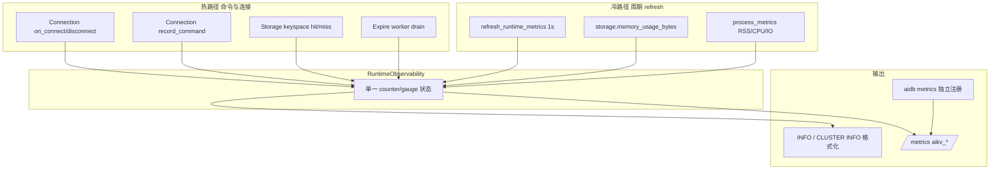

# AiKv Redis 可观测性对齐设计

**日期:** 2026-06-10  
**状态:** Completed (Phase 1–4)  
**版本:** v1.0  
**关联:** `INFO`, `CLUSTER INFO`, `/metrics`, `aikv_*`, `aidb_*`, `ServerMetrics`, `08-observability.md`

---

## 1. 问题陈述

### 1.1 背景

AiKv 的目标是 **替换 Redis** 作为业务 KV, 可观测性需满足:

1. 继续走 **原生 `/metrics`** (`aikv_*`, `aidb_*`), 不依赖 redis-exporter.
2. **语义对齐 Redis**: `redis-cli INFO` / `CLUSTER INFO` 能读到与 Redis 同名字段、同含义的统计.
3. **INFO 与 Prometheus 一致**: 同一时刻, `INFO stats` 的 `keyspace_hits` 与 `aikv_keyspace_hits_total` 数值一致 (counter 允许 scrape 间隔内的微小延迟).

当前实现已具备 Phase 17 基础 (`/metrics` 9191, 24+ KV 指标, 18+ DB 指标), 但 **INFO 与 metrics 分叉**, 且 INFO 覆盖远少于 Redis 7.

### 1.2 已验证问题 (2026-06-10)

| 问题 | 影响 |
|------|------|
| `INFO memory` 使用占位公式 `1MB + 16KB×连接数` | 与 `aikv_used_memory_bytes` 严重不一致 |
| `expired_keys` / `rejected_connections` 仅在 Prometheus | INFO stats 缺失 |
| 集群节点 `redis_mode` 固定 `standalone` | 集群运维工具误判 |
| 未知 INFO section 返回 `ERR` | Redis 返回空 bulk string |
| 无 `commandstats` / `cpu` / `replication` / `cluster` section | 运维脚本、GUI 探测失败 |

### 1.3 非目标

- **不** 引入 redis-exporter 或 `redis_*` 指标命名.
- **不** 为对齐而复制 Redis 未启用能力的「假活跃」行为 (如无 AOF 时 AOF 字段为 0).
- **不** 在本 spec 中重构 Grafana 面板 (PromQL 已用 `aikv_*`).
- **不** 要求 AiDb 引擎指标映射进 Redis INFO (见 §7 扩展层).

---

## 2. 目标

### 2.1 功能目标

| ID | 目标 | 验收 |
|----|------|------|
| G1 | 单一数据源 | INFO 与 `/metrics` 同源, 无手写重复逻辑 |
| G2 | Redis INFO 字段对齐 | §5 矩阵中 P0 字段全部实现 |
| G3 | Redis CLUSTER INFO 对齐 | §6 矩阵中 P0 字段全部实现 |
| G4 | 集群模式正确标识 | `redis_mode:cluster`, `cluster_enabled:1` |
| G5 | AiKv 扩展可识别 | server 段保留 `storage_engine`, `persistent`; 不污染 Redis 标准字段名 |
| G6 | 契约测试 | CI 断言 INFO↔metrics 一致性与字段存在性 |

### 2.2 兼容性基准

- **Redis 参考版本:** 7.2 (INFO section 与字段名)
- **对标实现:** AiKv `build_*_info()` (已验证 redis-cli / 运维工具兼容模式)
- **命名空间:** Prometheus 保持 `aikv_*` / `aidb_*`; INFO 保持 Redis 原始字段名

---

## 3. 架构: 单一数据源

### 3.1 核心类型 `RuntimeObservability`

新增模块 `aikv/src/server/observability.rs` (或拆 `snapshot.rs` + `info_format.rs`).

```rust
/// 进程内可观测性单一数据源.
/// - 热路径: atomic / 无锁递增 (连接、命令、命中)
/// - 冷路径: 周期性 refresh 写入 gauge (内存、keyspace、ops/sec)
pub struct RuntimeObservability {
  // --- 与 Redis stats 对齐 ---
  connections_total: AtomicU64,
  connected_clients: AtomicUsize,
  rejected_connections: AtomicU64,
  commands_total: Mutex<CommandStats>,   // 含 per-cmd calls/usec/error
  keyspace_hits: AtomicU64,
  keyspace_misses: AtomicU64,
  expired_keys: AtomicU64,
  evicted_keys: AtomicU64,              // AiKv 无 maxmemory  eviction, 恒 0
  net_input_bytes: AtomicU64,
  net_output_bytes: AtomicU64,
  // --- 与 Redis memory 对齐 ---
  used_memory_bytes: AtomicU64,           // 引擎逻辑内存
  used_memory_peak_bytes: AtomicU64,
  process_rss_bytes: AtomicU64,           // /proc, 与 process_metrics 同源
  // --- 派生 / 周期采样 ---
  instantaneous_ops_per_sec: AtomicU64,   // 1s 窗口 rate
  uptime_secs: AtomicU64,
  // --- 集群 (feature cluster) ---
  cluster_messages_sent: AtomicU64,
  cluster_messages_received: AtomicU64,
}
```

**原则:**

- `ServerMetrics` **演进为** `RuntimeObservability` 的 facade, 或内部持有其 `Arc` (避免双份 counter).
- `refresh_runtime_metrics()` 只负责 **采样外部状态** (storage memory, db key counts, /proc RSS), 不重复计数命令.
- Prometheus `Metrics` 结构体在 `on_*` / `refresh` 时 **只读** `RuntimeObservability` 写 gauge/counter, 不再独立维护业务计数.

### 3.2 数据流



### 3.3 INFO 格式化层

```rust
pub struct InfoRenderer<'a> {
  runtime: &'a RuntimeObservability,
  shared: &'a ServerSharedState,
  storage: &'a dyn KvStorage,  // keyspace 段异步读
  cluster: Option<&'a ClusterRuntimeSnapshot>,
}

impl InfoRenderer<'_> {
  pub async fn render(&self, section: InfoSection) -> String;
}
```

- `InfoSection`: `Default | All | Server | Clients | Memory | Stats | ... | Unknown`
- `Unknown` → 返回空字符串 (Redis 兼容, 非 ERR).

---

## 4. INFO 命令行为对齐

### 4.1 Section 路由

| 请求 | Redis 行为 | AiKv 目标行为 |
|------|-----------|---------------|
| `INFO` | default 多 section | 同 Redis default 列表 (§4.2) |
| `INFO all` / `INFO everything` | 全 section | 同 Redis all 列表 |
| `INFO server` 等 | 单 section | 大小写不敏感 |
| `INFO nosuch` | 空 bulk string | 空 bulk string (**改**: 当前 ERR) |

### 4.2 Default / All section 顺序

与 Redis 7 `INFO default` 一致:

1. server  
2. clients  
3. memory  
4. persistence  
5. stats  
6. replication  
7. cpu  
8. cluster (仅 cluster feature)  
9. keyspace  

`INFO all` 额外包含:

10. commandstats  
11. errorstats  
12. modules (空 section header)

---

## 5. INFO 字段矩阵 (Redis ↔ AiKv)

**优先级:** P0 = 必须实现; P1 = 建议 stub/真实; P2 = 可选/恒 0.

### 5.1 Server (`INFO server`)

| 字段 | P | Redis 含义 | AiKv 数据源 | 备注 |
|------|---|-----------|-------------|------|
| `redis_version` | P0 | 版本 | `CARGO_PKG_VERSION` | 可另加 `aikv_version` 扩展字段 |
| `redis_mode` | P0 | standalone/cluster | cluster 初始化状态 | **修**: 集群为 `cluster` |
| `tcp_port` | P0 | 客户端端口 | `shared.tcp_port` | |
| `uptime_in_seconds` | P0 | 运行秒数 | `shared.uptime_secs()` | |
| `run_id` | P0 | 实例 ID | `shared.run_id` | |
| `process_id` | P1 | PID | `std::process::id()` | |
| `os` / `arch_bits` | P1 | 平台 | `std::env::consts` | AiKv 已有模板 |
| `hz` / `configured_hz` | P2 | 事件循环频率 | 固定 `10` | stub |
| `storage_engine` | P0 | AiKv 扩展 | memory/aidb | 已有, 保留 |
| `persistent` | P0 | AiKv 扩展 | engine kind | 已有, 保留 |

### 5.2 Clients (`INFO clients`)

| 字段 | P | 数据源 | aikv metric |
|------|---|--------|-----------------|
| `connected_clients` | P0 | runtime | `aikv_connected_clients` |
| `maxclients` | P0 | config | (无 metric, INFO only) |
| `blocked_clients` | P1 | 阻塞连接表 | 新增 `aikv_blocked_clients` (无 BLPOP 时 0) |
| `cluster_connections` | P2 | 0 | stub |

### 5.3 Memory (`INFO memory`)

| 字段 | P | 数据源 | aikv metric |
|------|---|--------|-----------------|
| `used_memory` | P0 | `storage.memory_usage_bytes` | `aikv_used_memory_bytes` |
| `used_memory_human` | P0 | 格式化 | derived |
| `used_memory_peak` | P0 | runtime peak | `aikv_used_memory_peak_bytes` |
| `used_memory_peak_human` | P0 | 格式化 | derived |
| `used_memory_rss` | P1 | `/proc/self/status` VmRSS | `aikv_process_resident_memory_bytes` |
| `mem_fragmentation_ratio` | P1 | rss/logical | derived gauge 可选 |

**不变式:** `INFO memory.used_memory` == `aikv_used_memory_bytes` (refresh 周期内).

### 5.4 Stats (`INFO stats`)

| 字段 | P | 数据源 | aikv metric |
|------|---|--------|-----------------|
| `total_connections_received` | P0 | runtime | `aikv_connections_total` |
| `total_commands_processed` | P0 | sum commands | `sum(aikv_commands_total)` |
| `instantaneous_ops_per_sec` | P0 | 1s 窗口 | 新增 `aikv_instantaneous_ops_per_sec` |
| `keyspace_hits` | P0 | runtime | `aikv_keyspace_hits_total` |
| `keyspace_misses` | P0 | runtime | `aikv_keyspace_misses_total` |
| `expired_keys` | P0 | runtime | `aikv_expired_keys_total` |
| `evicted_keys` | P0 | 恒 0 | 新增 `aikv_evicted_keys_total` |
| `rejected_connections` | P0 | runtime | `aikv_rejected_connections_total` |
| `total_net_input_bytes` | P0 | runtime | `aikv_net_input_bytes_total` |
| `total_net_output_bytes` | P0 | runtime | `aikv_net_output_bytes_total` |
| `total_error_replies` | P1 | command errors sum | 可选 `aikv_error_replies_total` |
| pubsub/sync/eventloop 等 | P2 | 0 | stub (AiKv 模板) |

### 5.5 Commandstats (`INFO commandstats`)

格式: `cmdstat_{cmd}:calls=N,usec=M,usec_per_call=X.XX`

| 项 | P | 数据源 |
|----|---|--------|
| per-command calls | P0 | `CommandStats` (已有 `commands_total` HashMap) |
| per-command usec | P0 | 累加 `on_command_duration` 微秒 |
| usec_per_call | P0 | calls>0 时 usec/calls |

Prometheus: **不新增** `aikv_cmdstat_*` (Redis 无对应 metric); 查询用 `aikv_commands_total{command="GET"}` + histogram.

### 5.6 Errorstats (`INFO errorstats`)

格式: `errorstat_{type}:count=N`

| 项 | P | 数据源 |
|----|---|--------|
| 按错误类型计数 | P1 | `commands_total` 的 error 分支 + 错误分类 (WRONGTYPE, ERR, ...) |

初版可仅输出 command 级 `errorstat_get:count=N` (AiKv 做法), P2 再细化到 Redis 错误码.

### 5.7 CPU (`INFO cpu`)

| 字段 | P | 数据源 | aikv metric |
|------|---|--------|-----------------|
| `used_cpu_sys` | P1 | `/proc/self/stat` | 与 `aikv_process_cpu_milliseconds_total` 同源 |
| `used_cpu_user` | P1 | 同上 | 同上 |
| `*_children` / `*_main_thread` | P2 | 同 user/sys | stub 为相同值 |

### 5.8 Replication (`INFO replication`)

AiKv 集群复制模型 **≠** Redis 主从复制. 策略:

| 字段 | P | 值 |
|------|---|-----|
| `role` | P0 | 集群: 按节点 `master`/`slave`; standalone: `master` |
| `connected_slaves` | P1 | 副本数 (集群) 或 0 |
| 其余 repl backlog 字段 | P2 | stub 0 / 默认 (AiKv 模板) |

### 5.9 Cluster section (`INFO cluster`)

与 `CLUSTER INFO` 子命令 **不同** — 这是 INFO 内嵌段.

| 字段 | P | 值 |
|------|---|-----|
| `cluster_enabled` | P0 | cluster feature 且已初始化 → `1`, 否则 `0` |
| `cluster_stats_messages_sent` | P1 | gossip 计数 |
| `cluster_stats_messages_received` | P1 | gossip 计数 |

### 5.10 Persistence (`INFO persistence`)

| 字段 | P | AiKv 行为 |
|------|---|-----------|
| `loading` | P0 | 0 (或 restore 中时为 1, 若未来支持) |
| `rdb_bgsave_in_progress` | P0 | 已有 `shared.bgsave_in_progress()` |
| `rdb_last_save_time` | P0 | 已有 |
| `rdb_last_bgsave_status` | P0 | 已有 |
| `aof_enabled` | P0 | 0 (无 AOF) |
| `aof_rewrite_in_progress` | P2 | 0 |

### 5.11 Keyspace (`INFO keyspace`)

格式: `dbN:keys=X,expires=Y,avg_ttl=Z`

| 项 | P | 数据源 |
|----|---|--------|
| keys / expires | P0 | `storage.keyspace_stats` (已有) |
| avg_ttl | P1 | 引擎统计扩展 (无则 0) |

Prometheus: `aikv_db_keys{db="N"}` 与 keys 一致.

### 5.12 Modules (`INFO modules`)

P2: 空 section header only (`# Modules\r\n`).

---

## 6. CLUSTER INFO 对齐

子命令 `CLUSTER INFO` 输出 **纯 kv 文本** (非 `# Section` 格式).

### 6.1 字段矩阵

| 字段 | P | 当前 | 目标 |
|------|---|------|------|
| `cluster_state` | P0 | ok/fail | 保持, 迁移中可 `fail` |
| `cluster_slots_assigned` | P0 | 真实 | 保持 |
| `cluster_slots_ok` | P0 | 真实 | 保持 |
| `cluster_slots_pfail` | P0 | 0 | 未来按 health 填 |
| `cluster_slots_fail` | P0 | 0 | 同上 |
| `cluster_slots_migrating` | P0 | 真实 | 保持 |
| `cluster_known_nodes` | P0 | 真实 | 保持 |
| `cluster_size` | P0 | group count | 保持 (文档说明与 Redis shard 数语义差异) |
| `cluster_current_epoch` | P0 | meta.version | 保持 |
| `cluster_my_epoch` | P0 | 同 epoch | 保持 |
| `cluster_stats_messages_sent` | P1 | 0 | 接 gossip |
| `cluster_stats_messages_received` | P1 | 0 | 接 gossip |
| `cluster_stats_messages_ping/pong/...` | P2 | 0 | 可选细分 |

**语义说明 (文档化, 非 bug):**

- Redis `cluster_size` = 主分片数; AiKv 当前 = `meta.groups.len()` (2-shard 部署为 2). 在 spec 与运维文档中明确, 不强行改字段含义.

### 6.2 与 INFO cluster section 的关系

| 输出 | 内容 |
|------|------|
| `INFO cluster` | 仅 `cluster_enabled` + 消息统计摘要 |
| `CLUSTER INFO` | 完整集群状态 kv 列表 |

两者 **共用** `ClusterRuntimeSnapshot` 数据源.

---

## 7. aidb 扩展层 (Prometheus only)

以下指标 **不映射** 到 Redis INFO, 仅 `/metrics`:

| 类别 | 指标示例 | 说明 |
|------|---------|------|
| WAL / MemTable | `aidb_wal_size_bytes`, `aidb_memtable_size_bytes` | LSM 特有 |
| SSTable | `aidb_sstable_count`, `aidb_sstable_size_bytes` | |
| Compaction | `aidb_compaction_total`, `_duration_seconds` | |
| Block cache | `aidb_block_cache_*` | |
| Raft | `aidb_raft_rpc_total`, `aidb_raft_log_entries_total` | cluster+monitoring |

**可选未来扩展:** `INFO aikv` 自定义 section 暴露引擎摘要 (本 spec **不做**, YAGNI).

---

## 8. Prometheus 指标变更

### 8.1 新增 (对齐 Redis 语义)

| 指标 | 类型 | 对应 INFO |
|------|------|----------|
| `aikv_instantaneous_ops_per_sec` | Gauge | stats.instantaneous_ops_per_sec |
| `aikv_evicted_keys_total` | Counter | stats.evicted_keys (恒 0 也注册) |
| `aikv_blocked_clients` | Gauge | clients.blocked_clients |

### 8.2 保持不变

现有 `aikv_*` / `aidb_*` 命名 **不改** (避免破坏已有 Grafana 面板).

进程级指标 (`aikv_process_*`) 保留, 作为 Redis INFO 无对应项的 **运维增强**.

### 8.3 一致性规则

| 规则 | 说明 |
|------|------|
| R1 | Counter 型 INFO 字段 == Prometheus counter 当前值 (modulo scrape 延迟) |
| R2 | Gauge 型 INFO 字段 == Prometheus gauge 当前值 |
| R3 | `commandstats` 各 cmd calls 之和 == `total_commands_processed` (不含内部伪命令可选排除) |
| R4 | refresh 周期默认 1s, 与 ops/sec 窗口一致 |

---

## 9. 实现逻辑

### 9.1 热路径 (不变更性能特征)

```
Connection::handle_command():
  runtime.on_command(cmd, ok)
  runtime.on_command_duration(cmd, usec, ok)
  latency_stats.record(cmd, usec)   // LATENCY 命令仍独立服务
  if slow: runtime.on_slow_query(cmd)
```

### 9.2 冷路径 refresh (已有, 扩展)

```
every 1s (metrics_refresh task):
  runtime.set_uptime(shared.uptime_secs())
  runtime.set_used_memory(storage.memory_usage_bytes())
  runtime.set_db_key_counts(storage.db_key_counts())
  runtime.drain_expired_keys(storage_observation)
  runtime.refresh_process_rss_and_cpu(process_metrics)
  runtime.sample_instantaneous_ops()   // 新增: delta commands / elapsed
  sync_prometheus_from_runtime()       // 单一出口写 prom gauge/counter
```

### 9.3 INFO 请求路径

```
INFO [section]:
  renderer = InfoRenderer::new(runtime, shared, storage, cluster)
  match section:
    Default -> renderer.render_default().await
    All -> renderer.render_all().await
    X -> renderer.render_section(X).await
    Unknown -> Ok("")
```

**禁止:** 在 `command/server.rs` 内联拼字符串时使用与 runtime 无关的公式.

---

## 10. 并发模型

| 操作 | 机制 | 说明 |
|------|------|------|
| counter 递增 | AtomicU64 | 热路径无锁 |
| commandstats HashMap | Mutex | 已有, 争用低 |
| refresh | 单 task 顺序写 gauge | 与 Prometheus scrape 无锁竞争 |
| INFO 读取 | 读 atomic + 短锁 snapshot | 不阻塞命令路径 |
| keyspace 段 | async storage 读 | INFO 命令 await, 可接受 |

---

## 11. 错误处理

| 场景 | 处理 |
|------|------|
| storage.memory_usage 失败 | INFO memory 省略或用上次缓存; metrics gauge 不更新 |
| /proc 不可读 (非 Linux) | RSS/CPU 字段省略; process_* metrics 不注册 (已有 cfg) |
| cluster 未初始化 | `cluster_enabled:0`, CLUSTER INFO 返回 CLUSTERDOWN |
| INFO section 拼写错误 | 空字符串, 非 ERR |

---

## 12. 边界条件

| 场景 | 行为 |
|------|------|
| standalone + cluster feature 编译但未 init | `redis_mode:standalone`, `cluster_enabled:0` |
| 刚启动 keyspace 未扫描 | `db0:keys=0,expires=0,avg_ttl=0` 或空 section |
| 内部命令 (GOSSIP.tick, CLUSTER.redirect.*) | 计入 total_commands; commandstats **默认排除** (配置项后续) |
| 无 monitoring feature | INFO 仍完整; 无 /metrics 端点 |
| 高 QPS | ops/sec 用滑动 1s 窗口, 非 cumulative 差分 |

---

## 13. 分阶段交付

### Phase 1 — 一致性修复 (P0, ~2d)

- [x] 引入 `InfoRenderer`, 扩展 `ServerMetrics` 计数
- [x] 删除 INFO memory 占位公式
- [x] stats 补: expired, rejected, instantaneous_ops
- [x] `redis_mode` / `cluster_enabled`
- [x] 未知 INFO section → 空
- [x] `INFO` default section 顺序对齐
- [x] 契约测试: memory/stats 与 metrics 一致

### Phase 2 — Redis 标准 section (P0/P1, ~3d)

- [x] commandstats, errorstats (初版)
- [x] cpu, replication (stub+部分真实)
- [x] clients 补 maxclients
- [x] keyspace avg_ttl
- [x] persistence 补 aof_enabled 等
- [x] `INFO all` 支持

### Phase 3 — 集群与 Prometheus 补洞 (~2d)

- [x] gossip → cluster message 计数
- [x] CLUSTER INFO 消息统计
- [x] 新增 3 个 Prometheus 指标 (§8.1)
- [x] replication role 按节点

### Phase 4 — 硬化 (~1d)

- [x] golden file: Redis 7 字段存在性
- [x] 集成测试: 跑命令后 INFO + curl /metrics 对比
- [x] 更新 `08-observability.md` 与 `/monitoring/grafana/dashboards/README.md`

---

## 14. 测试策略

### 14.1 L1 单元

| 测试 | 断言 |
|------|------|
| `info_unknown_section_returns_empty` | `INFO nosuch` → 空 bulk |
| `info_memory_matches_runtime` | set memory 后 INFO == gauge |
| `info_stats_counters` | GET/SET 后 hits/misses/commands 正确 |
| `commandstats_format` | 正则 `cmdstat_get:calls=\d+,usec=\d+` |
| `cluster_enabled_flag` | init 前后 0/1 |

### 14.2 L2 集成

| 测试 | 断言 |
|------|------|
| `info_metrics_consistency` | 同一进程 INFO stats 与 /metrics 数值一致 |
| `cluster_info_required_fields` | 6 节点部署后字段齐全 |
| `info_default_sections_present` | 含 server,clients,memory,...,keyspace |

### 14.3 不变式

- I1: `used_memory` (INFO) == `aikv_used_memory_bytes` (metrics)
- I2: `keyspace_hits` (INFO) == `aikv_keyspace_hits_total`
- I3: sum(`cmdstat_*`.calls) <= `total_commands_processed`
- I4: 集群模式下 `redis_mode=cluster` 且 `cluster_enabled=1`

---

## 15. 设计决策

### D1: 为何不用 redis-exporter 而用 INFO 对齐?

用户目标是 **替换 Redis 运维习惯** (redis-cli, 脚本, GUI), 不是替换 exporter. INFO 对齐使工具链零改造; metrics 仍走原生 Prometheus 性能更好.

### D2: 为何单一 RuntimeObservability 而非 INFO 读 Prometheus?

Prometheus client 侧重 export, 不适合高频 INFO 解析; 且 counter 读 gauge 有 label 聚合问题. **Runtime 为源, Prometheus 为镜像**.

### D3: replication 段 stub 是否合理?

Redis 主从字段在 AiKv 集群语义下 **无直接等价**. stub 是为兼容 `redis-cli INFO` 与监控探针不报错; 真实角色信息在 `role` + `CLUSTER NODES`.

### D4: 是否在 INFO 暴露 aidb?

YAGNI. 引擎深度指标走 `/metrics` + Grafana AiDb 面板. 避免污染 Redis 命名空间.

### D5: instantaneous_ops_per_sec 用 Gauge 而非 PromQL rate?

Redis INFO **直接暴露** 该字段, 运维脚本依赖. Prometheus 侧同步 gauge 便于与 INFO 对照; QPS 大盘仍推荐 `rate(aikv_commands_total)`.

---

## 16. 开放问题 (待审核)

| ID | 问题 | 建议默认 |
|----|------|---------|
| Q1 | `redis_version` 报 AiKv 版本还是固定 Redis 兼容版本 (如 7.2.0)? | **AiKv 真实版本** + 可选 `redis_compatible_version:7.2` |
| Q2 | 内部命令是否计入 commandstats? | **否**, 仅客户端可见命令 |
| Q3 | `cluster_size` 是否改为 Redis 语义 (仅 master shard)? | **保持现状**, 文档说明 |
| Q4 | errorstats 按命令名还是 Redis 错误码? | Phase 2 用命令名, Phase 3 细化错误码 |
| Q5 | 是否新增 `INFO aikv` section? | **否** (本 spec) |

---

## 17. 与总览的对齐

| 路线图 / 文档 | 本文 |
|--------------|------|
| `08-observability.md` Phase 17 metrics | §3 单一数据源, §8 指标 |
| `project-design.md` 原生 /metrics | 保持, 增强语义 |
| Redis 替换目标 | §2 G2/G3 INFO 对齐 |
| AiKv INFO 兼容层 | 参考实现, 不引入 aikv_ 前缀 |

---

## 18. 文件变更预估

| 文件 | 变更 |
|------|------|
| `aikv/src/server/observability.rs` | 新增 |
| `aikv/src/server/metrics.rs` |  refactor → facade |
| `aikv/src/command/server.rs` | INFO 委托 InfoRenderer |
| `aikv/src/cluster/commands.rs` | CLUSTER INFO 接 runtime |
| `aikv/src/server/config.rs` | refresh 扩展 |
| `aikv/tests/modules/command/server.rs` | INFO 契约测试 |
| `aikv/tests/modules/server/observability.rs` | metrics↔INFO 一致性 |

---

## 审核记录

| 轮次 | 状态 | 说明 |
|:----:|:----:|------|
| 0 | Draft | 初稿待用户审核 |

**待确认项:** §16 开放问题 Q1–Q5.

**终稿条件:** 用户确认开放问题 + Phase 范围后, 进入实现.
