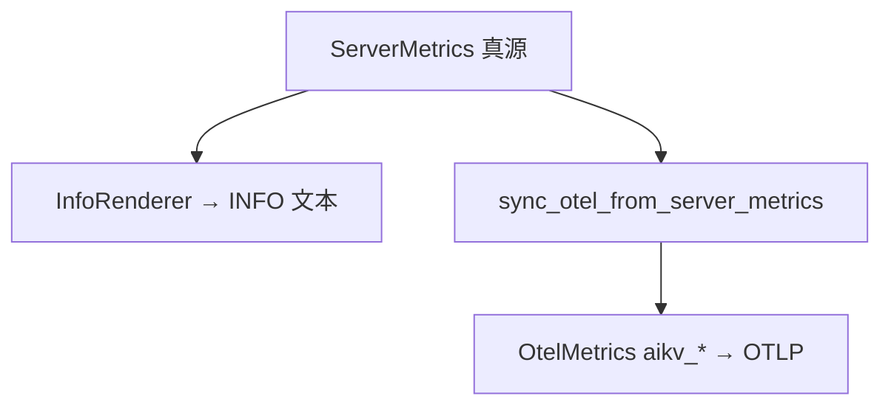

# AiKv Redis 对齐: 集群路由 + INFO + OTel

**日期:** 2026-06-25  
**状态:** Approved — P0–P2 **Implemented** (P3 sync-only 热路径 optional, 未做)  
**版本:** v1.2  
**关联:** [DESIGN.md](../../../DESIGN.md), `cluster/routing_key.rs`, `command/router.rs`, `server/info.rs`, `server/info_catalog.rs`, `docs/modules/observability*.md`

**实现进度:** P0 (集群 MOVED/ASK) + P1 (INFO 8.8 commandstats) + P2 (`info_catalog` sync + mapping 文档) **已落地**; P3 (热路径 OTel 收敛) 可选未做.

**前置决策 (用户确认):**

- Grafana 面板 **搁置**, 先改项目本体
- **Redis 参考版本:** Open Source **8.8** (Context7 `/redis/docs`, 8.8.0 GA 2026-05)
- OTel 命名 **方案 A**: 保持 `aikv_*`, 严格 1:1 映射 INFO 字段; 文档提供与 redis_exporter 对照表
- 集群行为与 Redis 官方一致: **去掉透明转发**, 客户端 `redis-cli -c` 或 cluster-aware SDK
- OTel 导出 **方案 A**: INFO/`ServerMetrics` 为真源, refresh 同步 OTLP (语义等价 redis_exporter 解析 INFO)

---

## 0. Redis 8.8 官方模型 (摘要)

> 来源: [Redis INFO command](https://github.com/redis/docs/blob/main/content/commands/info.md) (Context7 `/redis/docs`)

### 0.1 集群客户端协议

| 行为 | Redis 官方 |
|------|-----------|
| 连错 slot | 返回 `-MOVED slot addr` 或 `-ASK slot addr`; **服务端不代转** |
| 客户端 | smart client 更新 slot 表并重试 (`redis-cli -c`) |
| 命令统计 | **仅实际执行命令的节点** 计入 `commandstats` / `total_commands_processed` |
| MOVED 未执行 | wrong node **不** 给该命令的 `cmdstat_*` 加 calls |

AiKV `DESIGN.md` 集群节与此一致; 实现中 `forward_command` 为 **偏离**, 本 spec P0 移除.

### 0.2 INFO section 模型 (Redis 8.x)

| 请求 | 行为 |
|------|------|
| `INFO` (无参) | 等同 **`INFO default`**: server, clients, memory, persistence, stats, replication, cpu, [cluster], keyspace |
| `INFO all` | default 段 + **commandstats, errorstats** 等 (不含 module 动态生成段) |
| `INFO everything` | 含 module 生成段 |
| `INFO <section>` | 单段; 未知段 → **空 bulk** (非 ERR) |

AiKV 现 `INFO all` ≈ default + commandstats + errorstats + modules — 与 Redis 8 语义接近; `redis_compatible_version` 由 **7.2 → 8.8**.

### 0.3 commandstats (Redis 8.8)

每行 `cmdstat_<name>:` 字段:

| 字段 | 自版本 |
|------|--------|
| `calls`, `usec`, `usec_per_call` | 早期 |
| `rejected_calls`, `failed_calls` | 6.2+ |
| `slowlog_count`, `slowlog_time_ms_sum`, `slowlog_time_ms_max` | **8.8+** (与 Slowlog 联动) |

- 仅 **calls > 0** 的命令出现在 INFO (与 Redis / redis_exporter 一致)
- 子命令名可含 `\|` (如 `cmdstat_acl|list:...`, Redis 7+)

### 0.4 errorstats

`errorstat_<prefix>:count=N` — 按错误前缀聚合; AiKV 已有基础实现, 本 spec 保持并与 8.8 字段语义对齐.

### 0.5 redis_exporter 等价物 (AiKV)

| redis_exporter | AiKV |
|----------------|------|
| 周期性 `INFO` scrape | `ServerMetrics` + `InfoRenderer` (真源) |
| 解析 INFO → Prom metrics | refresh → **OTLP `aikv_*`** (镜像 INFO) |
| stats 零值字段仍导出 | catalog 中 stats/memory **固定字段** 即使为 0 也 sync |
| commandstats 仅已有 cmd | 同: 不预创建未执行命令 series |
| `cluster` 标签 | **非 Redis 内置**; Prometheus relabel / 未来 `cluster_id` Resource |

---

## 1. 问题陈述

### 1.1 背景

| 问题 | 影响 |
|------|------|
| 集群 **透明 TCP 转发** (`forward_command`) | 双计 `aikv_commands_total`; 与 Redis 8.8 集群模型冲突 |
| MOVED 路径 `record_command_outcome` | 连错节点也可能记 commandstats |
| `redis_compatible_version:7.2` | 低于参考基准 8.8; commandstats 缺 8.8 slowlog 三字段 |
| `commandstats` 缺 `rejected_calls`/`failed_calls` | redis_exporter extended 解析不完整 |
| OTel 热路径与 INFO 缺 catalog | 无法保证「INFO 有的, OTel 必有」 |
| `DESIGN.md` 与实现分叉 | 文档写放弃透明代理, 代码仍默认转发; 可观测性仍写 `/metrics` Prom 主路径 |

### 1.2 非目标

- Grafana 面板 (本 spec 之后)
- redis-exporter sidecar / `redis_*` 指标命名
- OTel `cluster_id` Resource (独立后续)
- MIGRATE 的 ASKING+RESTORE 内部路径
- Redis 8.8 **新命令** (Array, INCREX, XNACK 等) — 仅 INFO/集群/可观测性对齐
- INFO P1 段: `latencystats`, `keysizes`, `hotkeys`, `tracking` — 后续 spec

---

## 2. 目标

### 2.1 功能目标

| ID | 目标 | 验收 |
|----|------|------|
| G1 | Redis 8.8 集群 MOVED/ASK | 非本地 slot → 错误字符串; **无** TCP 转发 |
| G2 | 命令计数与 Redis 一致 | MOVED/ASK 不计 commandstats; 仅执行节点计数 |
| G3 | commandstats **8.8 行格式** | 五行 + slowlog 三元组 (无 slowlog 时为 0) |
| G4 | `redis_compatible_version:8.8` | INFO server 段; fixture/golden 更新 |
| G5 | INFO P0 (8.8 基线) | `info_golden` + `redis88_info_p0_fields.txt` 通过 |
| G6 | OTel 镜像 INFO | P0 stats/memory/clients + 动态 commandstats → `aikv_*` |
| G7 | 文档 | `DESIGN.md` + `observability-reference.md` 三列 mapping |

### 2.2 兼容性基准

- **Redis Open Source 8.8.0 GA** (2026-05) — sections、commandstats、集群 MOVED 语义
- **AiKV 报文:** `redis_version` = AiKV 真实版本; `redis_compatible_version` = **`8.8`**
- **redis_exporter:** oliver006 解析语义 (INFO 驱动; commandstats 动态 series)

---

## 3. 集群路由: 去掉透明转发 (P0)

### 3.1 行为

```text
Client → wrong node → -MOVED slot addr (不执行, 不计 cmdstat)
Client (-c) → correct node → 执行, 计 1 次
```

### 3.2 代码

| 文件 | 变更 |
|------|------|
| `command/router.rs` | MOVED/ASK → `RespValue::Error(...)`; 删 `forward_command` |
| `cluster/forward.rs` | 删 TCP 转发; `cluster_routing_key` → `cluster/routing_key.rs` |
| `command/router.rs` | cluster 早返回 **不** `record_command_outcome` |
| `server/connection.rs` | MOVED/ASK **跳过** observability |
| `DESIGN.md`, `cluster.md`, `CHANGELOG.md` | 与 Redis 8.8 官方模型一致; **breaking** |

### 3.3 计数 invariant

| 事件 | `total_commands_processed` | commandstats | `aikv_cluster_redirects_total` |
|------|---------------------------|--------------|--------------------------------|
| 本地执行 | +1 | +1 | — |
| MOVED/ASK (未执行) | **0** | **0** | +1 |
| CROSSSLOT 等 | 现有 error 路径 | errorstats | — |

---

## 4. INFO / commandstats 8.8 (P1)

### 4.1 commandstats 行

```text
cmdstat_get:calls=21,usec=175,usec_per_call=8.33,rejected_calls=0,failed_calls=0,slowlog_count=0,slowlog_time_ms_sum=0,slowlog_time_ms_max=0
```

**实现:**

- `CommandTotals`: `rejected`, `failed`; slowlog 聚合 `slowlog_count`, `slowlog_time_ms_sum`, `slowlog_time_ms_max` (与 `SlowQueryLog` 按命令汇总, 或命令完成时增量更新)
- `InfoRenderer::render_commandstats`: 输出 8.8 完整行
- `REDIS_COMPAT_VERSION` / tests: **7.2 → 8.8**
- Fixture: `redis7_info_p0_fields.txt` → **`redis88_info_p0_fields.txt`** (内容 review, 字段名不变则仅改注释与 compatible version 断言)

### 4.2 INFO default / all

- `INFO` default 段顺序与 Redis 8 **default** 一致 (现实现已基本对齐)
- `INFO all`: default + commandstats + errorstats + modules (不含 latencystats)

### 4.3 AiKV 扩展字段 (保留)

- `storage_engine`, `persistent` — server 段; 不冒充 Redis 标准字段名以外的语义

---

## 5. OTel: INFO 真源 + `aikv_*` (P2)

### 5.1 架构



- **原则:** 与 redis_exporter 相同 — **INFO 里有什么, 监控镜像什么**; 区别是 push OTLP 而非 pull scrape
- **命名:** `aikv_*` only; `observability-reference.md` 提供 ↔ redis_exporter 对照

### 5.2 Catalog (P0 段 + 动态 commandstats)

| INFO | `aikv_*` | redis_exporter (参考) |
|------|----------|----------------------|
| `keyspace_hits` | `aikv_keyspace_hits_total` | `redis_keyspace_hits_total` |
| `used_memory` | `aikv_used_memory_bytes` | `redis_memory_used_bytes` |
| `cmdstat_get:*` | `aikv_commands_total{name=GET}` + duration | `redis_commands_total{cmd=get}` |
| `cmdstat_get:slowlog_count` | `aikv_slowlog_entries_total{name=GET}` 或 catalog 定名 | (8.8+ exporter 待跟进) |

### 5.3 阶段

| 阶段 | 内容 |
|------|------|
| P0 | 去转发 + 计数 invariant |
| P1 | INFO 8.8 commandstats + compatible version + fixtures |
| P2 | info_catalog + otel sync + reference 文档 |
| P3 | (可选) 热路径 OTel 写入收敛为 sync-only |

---

## 6. DESIGN.md 同步 (与本 spec 一并落地)

| 章节 | 更新 |
|------|------|
| §集群 MOVED | 删除「除 forward_command 辅助」; 明确 **无服务端代理** |
| §决策总表「重定向」 | 「默认透明代理」→ **仅 MOVED/ASK 字符串** |
| §可观测性 | HTTP **`/health` only**; 生产指标 **OTLP**; INFO 真源 → OTel 镜像; 参考 **Redis 8.8** |
| 删除/修正 | 「Prometheus 镜像」「HTTP `/metrics` 主路径」等过时表述 |
| 交叉引用 | 本 spec + [observability.md](../../modules/observability.md) |

---

## 7. 测试

```bash
cargo test -p aikv cluster_routing --features cluster
cargo test -p aikv observability info_alignment info_golden -- --test-threads=1
cargo test -p aikv cluster_redirect_metrics --features cluster  # 新增
```

- 手动: `redis-cli` vs `redis-cli -c` 对比 Redis 8.8 同场景
- `INFO commandstats` 行格式 vs Redis 8.8 样例 (含 slowlog 三字段)

---

## 8. 风险

| 风险 | 缓解 |
|------|------|
| dumb client breaking | CHANGELOG + DEPLOYMENT 要求 `-c` |
| 8.8 slowlog 字段需 Slowlog 聚合 | P1 与 `SlowQueryLog` 挂钩 |
| redis_exporter 尚未解析 8.8 slowlog 字段 | AiKV 先 INFO 对齐; mapping 文档标注 exporter 缺口 |

---

## 9. 开放项 (本 spec 外)

- `cluster_id` OTel Resource
- INFO `latencystats` / `keysizes` / `hotkeys`
- Grafana 面板

---

## 10. 批准记录

| 项 | 决定 |
|----|------|
| Redis 基准 | **8.8** |
| OTel 命名 | **A** — `aikv_*` + mapping 文档 |
| OTel 模型 | **A** — INFO/ServerMetrics 真源 |
| 透明转发 | **移除** |
| 面板 | **搁置** |

**待 review → 实现计划:** [../plans/2026-06-25-redis-alignment-cluster-info-otel.md](../plans/2026-06-25-redis-alignment-cluster-info-otel.md)
